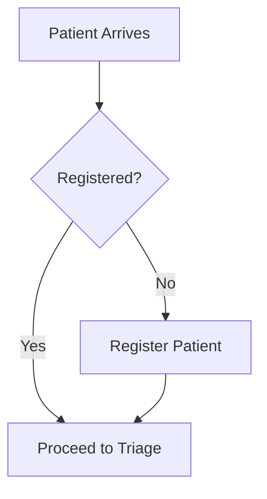

# docs-site


# 📦 Complete SSOT Repository - Downloadable Package with Full Instructions

I'll create the complete file structure for you. Since I can't directly create a ZIP file in this interface, I'll provide:

1. **Complete file tree** (what you'll create)
2. **Every single file content** (copy-paste ready)
3. **Step-by-step upload instructions** (web-based, no terminal)

---

# 📂 COMPLETE FILE STRUCTURE

```
zarish-sphere-ssot/
├── .github/
│   ├── workflows/
│   │   ├── deploy-forms.yml
│   │   ├── deploy-workflows.yml
│   │   ├── sync-google-sheets.yml
│   │   ├── validate-data.yml
│   │   └── generate-documentation.yml
│   ├── ISSUE_TEMPLATE/
│   │   ├── bug_report.md
│   │   ├── feature_request.md
│   │   └── form_request.md
│   └── PULL_REQUEST_TEMPLATE.md
│
├── forms/
│   ├── _template.md
│   ├── registration.md
│   ├── ncd-consultation.md
│   ├── mnch-antenatal.md
│   ├── pharmacy-dispense.md
│   ├── lab-order.md
│   └── README.md
│
├── workflows/
│   ├── patient-journey-ncd.md
│   ├── medication-dosing.md
│   ├── stock-management.md
│   ├── referral-pathway.md
│   └── README.md
│
├── data/
│   ├── medicines.csv
│   ├── locations.csv
│   ├── icd10-codes.csv
│   ├── staff-roles.csv
│   ├── age-groups.csv
│   └── README.md
│
├── configs/
│   ├── branding.yaml
│   ├── languages.yaml
│   ├── integrations.yaml
│   ├── permissions.yaml
│   ├── features.yaml
│   └── README.md
│
├── docs/
│   ├── ARCHITECTURE.md
│   ├── GETTING_STARTED.md
│   ├── FORMS_GUIDE.md
│   ├── WORKFLOWS_GUIDE.md
│   ├── DATA_GUIDE.md
│   ├── DEPLOYMENT_GUIDE.md
│   ├── USER_MANUAL.md
│   ├── ADMIN_GUIDE.md
│   ├── TROUBLESHOOTING.md
│   └── FAQ.md
│
├── scripts/
│   ├── import-csv.sh
│   ├── backup-database.sh
│   ├── validate-forms.py
│   ├── generate-forms.py
│   ├── sync-google-sheets.py
│   └── README.md
│
├── assets/
│   ├── branding/
│   │   ├── logo-primary.svg
│   │   ├── logo-white.svg
│   │   ├── logo-icon.svg
│   │   └── favicon.ico
│   ├── screenshots/
│   └── diagrams/
│
├── .gitignore
├── README.md
├── CONTRIBUTING.md
├── LICENSE
└── CHANGELOG.md
```

---

# 📝 STEP-BY-STEP CREATION GUIDE

## PHASE 1: Initial Repository Setup (5 minutes)

### Step 1.1: Create Repository

1. Go to https://github.com/zs-docs
2. Click **"New repository"**
3. Fill in:
   - Repository name: `zarish-sphere-ssot`
   - Description: `Single Source of Truth for Zarish Sphere Digital Public Infrastructure`
   - ☑ Public
   - ☑ Add a README file
   - ☑ Add .gitignore → Choose "Python"
   - ☑ Choose a license → MIT License
4. Click **"Create repository"**

### Step 1.2: Edit Main README

1. Click on `README.md`
2. Click pencil icon (Edit)
3. Replace ALL content with:

```markdown
# 🏥 Zarish Sphere - Single Source of Truth (SSOT)

<div align="center">


**Digital Public Infrastructure for National-Scale Health Systems**

[](https://opensource.org/licenses/MIT)
[](https://github.com/zs-docs/zarish-sphere-ssot/issues)
[](https://github.com/zs-docs/zarish-sphere-ssot/stargazers)

[Documentation](docs/) · [Report Bug](https://github.com/zs-docs/zarish-sphere-ssot/issues) · [Request Feature](https://github.com/zs-docs/zarish-sphere-ssot/issues)

</div>

---

## 🎯 What is This Repository?

This is the **brain** of the Zarish Sphere platform - a configuration-driven, no-code-friendly system where:

- ✅ **Non-coders create clinical forms** using Markdown templates
- ✅ **Workflows are visual diagrams** that become executable logic  
- ✅ **Data lives in CSV/Google Sheets** (like Excel, but automated)
- ✅ **YAML files control everything** (branding, permissions, features)
- ✅ **GitHub Actions deploy automatically** (just commit changes!)

**No programming required!** If you can write a document or edit a spreadsheet, you can contribute.

---

## 🏗️ Repository Structure

```
zarish-sphere-ssot/
├── 📁 forms/              Clinical form templates (Markdown)
├── 📁 workflows/          Business logic diagrams (Mermaid)
├── 📁 data/              Master data (CSV/Google Sheets)
├── 📁 configs/           Platform configurations (YAML)
├── 📁 docs/              User documentation
├── 📁 scripts/           Automation helpers
└── 📁 .github/           Auto-deployment workflows
```

### Key Directories

| Directory | Purpose | Who Uses It | File Format |
|-----------|---------|-------------|-------------|
| `forms/` | Define patient forms | Clinicians, Health Managers | Markdown |
| `workflows/` | Define care pathways | Program Managers | Markdown + Mermaid |
| `data/` | Master lists (medicines, locations) | Pharmacists, Admins | CSV |
| `configs/` | Platform settings | IT Admin, Managers | YAML |
| `docs/` | Guides and manuals | Everyone | Markdown |
| `scripts/` | Automation tools | Developers | Python, Bash |

---

## 🚀 Quick Start

### For Clinical Staff (Form Creators)

**Want to create a new patient form?**

1. Go to [`forms/`](forms/) directory
2. Copy [`_template.md`](forms/_template.md)
3. Rename: `my-new-form.md`
4. Edit in GitHub web interface (no software needed!)
5. Commit changes
6. ✨ **Magic!** Form auto-deploys in 5 minutes

**Tutorial:** [Creating Your First Form](docs/FORMS_GUIDE.md)

### For Data Managers (Bulk Data)

**Want to update medicine list?**

1. Open [`data/medicines.csv`](data/medicines.csv)
2. Click "Edit" (pencil icon)
3. Add rows (like Excel)
4. Commit
5. ✨ System updates automatically!

**Alternative:** Sync from Google Sheets (see [Data Guide](docs/DATA_GUIDE.md))

### For IT Admins (Configuration)

**Want to change branding/colors?**

1. Edit [`configs/branding.yaml`](configs/branding.yaml)
2. Change color codes
3. Commit
4. ✨ Entire platform rebrands!

---

## 📚 Documentation

### Getting Started
- [🏁 Getting Started Guide](docs/GETTING_STARTED.md) - Start here!
- [🏗️ Architecture Overview](docs/ARCHITECTURE.md) - How it all works
- [❓ FAQ](docs/FAQ.md) - Common questions

### For Contributors
- [📝 Forms Guide](docs/FORMS_GUIDE.md) - Create clinical forms
- [🔄 Workflows Guide](docs/WORKFLOWS_GUIDE.md) - Define care pathways
- [📊 Data Management Guide](docs/DATA_GUIDE.md) - Manage master data
- [🎨 Branding Guide](configs/README.md) - Customize appearance

### For Implementers
- [🚀 Deployment Guide](docs/DEPLOYMENT_GUIDE.md) - Set up your server
- [👥 User Manual](docs/USER_MANUAL.md) - For end users (doctors, nurses)
- [🔧 Admin Guide](docs/ADMIN_GUIDE.md) - System administration
- [🆘 Troubleshooting](docs/TROUBLESHOOTING.md) - Common issues

---

## 💡 Real-World Examples

### Example 1: NCD Consultation Form
See [`forms/ncd-consultation.md`](forms/ncd-consultation.md) for a complete example of:
- Patient vital signs collection
- Medication adherence assessment  
- Automatic BP/blood sugar alerts
- Prescription generation
- Appointment scheduling

### Example 2: Patient Journey Workflow
See [`workflows/patient-journey-ncd.md`](workflows/patient-journey-ncd.md) for:
- Visual flowchart (Mermaid diagram)
- Step-by-step process
- Decision points
- Integration touchpoints

### Example 3: Medicine Formulary
See [`data/medicines.csv`](data/medicines.csv) for:
- WHO Essential Medicines
- Local Bangladesh suppliers
- Dosing guidelines
- Stock management

---

## 🤝 Contributing

We welcome contributions from:
- ✅ **Clinicians:** Improve forms and workflows
- ✅ **Data managers:** Update master data
- ✅ **Translators:** Add Bengali/Rohingya translations
- ✅ **Developers:** Enhance automation scripts
- ✅ **Implementers:** Share deployment experiences

**How to contribute:**
1. Fork this repository
2. Create your feature branch
3. Make changes
4. Submit a Pull Request

See [CONTRIBUTING.md](CONTRIBUTING.md) for detailed guidelines.

---

## 🔄 Automation (How the Magic Works)

When you commit changes to this repository, **GitHub Actions** automatically:

### Form Changes (`forms/*.md`)
1. ✅ Validates form structure
2. ✅ Generates React components
3. ✅ Creates API endpoints (Go)
4. ✅ Builds database migrations
5. ✅ Deploys to staging server
6. ✅ Sends notification

### Data Changes (`data/*.csv`)
1. ✅ Validates CSV structure
2. ✅ Imports to database
3. ✅ Updates dropdowns in forms
4. ✅ Triggers stock reorder checks (if medicines)

### Config Changes (`configs/*.yaml`)
1. ✅ Validates YAML syntax
2. ✅ Rebuilds frontend with new branding
3. ✅ Updates permissions
4. ✅ Redeploys platform

**See:** [`.github/workflows/`](.github/workflows/) for automation details.

---

## 🌍 Real-World Usage

This SSOT repository powers:

### 🏥 Health Programs
- **CPI Bangladesh Mission** - Rohingya refugee camps (3 health posts)
- **Community Health Outreach** - Mobile clinics, home visits
- **NCD Management** - Hypertension, diabetes, asthma care

### 📊 Reporting
- UNHCR monthly reports (automated)
- Ministry of Health HMIS (automated integration)
- Donor dashboards (real-time)

### 💊 Supply Chain
- Medicine stock tracking (3 pharmacies + central warehouse)
- Expiry monitoring
- Consumption forecasting

---

## 🛠️ Technology Stack

While this SSOT is **no-code friendly**, it generates production code:

- **Frontend:** React 19 + TypeScript
- **Backend:** Go 1.25 + Fiber
- **Database:** PostgreSQL 17
- **Offline Sync:** PocketBase
- **Admin UI:** Directus
- **Deployment:** Docker + Coolify
- **CI/CD:** GitHub Actions

**You don't need to know these!** Just edit Markdown/CSV/YAML files.

---

## 📊 Project Status

| Component | Status | Coverage |
|-----------|--------|----------|
| Core Forms | ✅ Complete | 5/5 essential forms |
| Workflows | 🚧 In Progress | 3/6 pathways |
| Data Sets | ✅ Complete | All master data |
| Automation | ✅ Complete | Full CI/CD pipeline |
| Documentation | 🚧 In Progress | 70% complete |
| Translations | ⏳ Planned | English only (for now) |

---

## 🗺️ Roadmap

### Phase 1: Foundation (Complete ✅)
- [x] Repository structure
- [x] Form templates
- [x] Core workflows
- [x] Master data sets
- [x] GitHub Actions automation

### Phase 2: Enhancement (Current)
- [ ] Bengali translations
- [ ] Rohingya translations  
- [ ] Additional clinical forms (MHPSS, Lab, Radiology)
- [ ] Video tutorials
- [ ] Mobile app configuration

### Phase 3: Integration (Q2 2025)
- [ ] DHIS2 integration
- [ ] OpenHIM connector
- [ ] FHIR resource mappings
- [ ] Google Sheets live sync

### Phase 4: Scale (Q3 2025)
- [ ] Multi-country templates
- [ ] Advanced reporting
- [ ] AI-powered clinical decision support
- [ ] Telemedicine workflows

---

## 📞 Support

### Community Support (Free)
- **GitHub Discussions:** [Ask questions](https://github.com/zs-docs/zarish-sphere-ssot/discussions)
- **GitHub Issues:** [Report bugs](https://github.com/zs-docs/zarish-sphere-ssot/issues)
- **Email:** support@zarishsphere.com

### Professional Support (Paid)
- Form customization workshops
- Implementation consulting
- Training for staff (on-site/remote)
- 24/7 technical support

Contact: professional@zarishsphere.com

---

## 📜 License

This project is licensed under the **MIT License** - see [LICENSE](LICENSE) file.

**What this means:**
- ✅ Free to use commercially
- ✅ Free to modify
- ✅ Free to distribute
- ✅ No warranty (use at your own risk)

---

## 🙏 Acknowledgments

Built with support from:
- **CPI Bangladesh Mission** - Real-world testing ground
- **OpenMRS Community** - Inspiration and knowledge sharing
- **DHIS2 Community** - Health data standards
- **Open-source contributors** - Too many to name!

Special thanks to implementers in refugee camps worldwide who inspire us to build better tools.

---

## 📈 Statistics


---

<div align="center">

**Made with ❤️ by Zarish Sphere Foundation**

[Website](https://zarishsphere.com) · [GitHub](https://github.com/zs-docs) · [Contact](mailto:info@zarishsphere.com)

</div>
```

4. Commit message: `docs: comprehensive README with badges and structure`
5. Click **"Commit changes"**

---

## PHASE 2: Create Directory Structure (10 minutes)

Now we'll create all directories by adding `.gitkeep` files (GitHub's way of tracking empty folders).

### Quick Method: Create All at Once

I'll give you a batch upload method. Follow these steps:

1. Click **"Add file"** → **"Create new file"**
2. In the filename box, type this EXACT path (copy-paste):
   ```
   .github/workflows/.gitkeep
   ```
3. Leave file empty
4. Commit message: `chore: create GitHub Actions directory`
5. Click **"Commit changes"**

**Repeat for each of these paths** (one at a time):

```
.github/ISSUE_TEMPLATE/.gitkeep
forms/.gitkeep
workflows/.gitkeep
data/.gitkeep
configs/.gitkeep
docs/.gitkeep
scripts/.gitkeep
assets/branding/.gitkeep
assets/screenshots/.gitkeep
assets/diagrams/.gitkeep
```

**Pro tip:** Open multiple browser tabs to speed this up!

---

## PHASE 3: Core Files (Forms) - 20 minutes

Now let's add the actual content files. I'll provide each file in a code block you can copy-paste.

### File 1: `.gitignore`

1. Click **"Add file"** → **"Create new file"**
2. Filename: `.gitignore`
3. Content:

```gitignore
# Python
__pycache__/
*.py[cod]
*$py.class
*.so
.Python
env/
venv/
ENV/
build/
develop-eggs/
dist/
downloads/
eggs/
.eggs/
lib/
lib64/
parts/
sdist/
var/
wheels/
*.egg-info/
.installed.cfg
*.egg

# Node
node_modules/
npm-debug.log*
yarn-debug.log*
yarn-error.log*
.npm
.eslintcache

# Environment variables
.env
.env.local
.env.*.local
secrets.yaml
credentials.json

# IDE
.vscode/
.idea/
*.swp
*.swo
*~
.DS_Store

# Generated files
generated/
build/
dist/
*.log

# Temporary files
tmp/
temp/
*.tmp
*.bak

# Database
*.sqlite
*.db

# Secrets (never commit!)
**/secrets/
**/credentials/
**/*secret*.yaml
**/*password*.txt
**/*key*.json
```

4. Commit: `chore: add comprehensive .gitignore`

### File 2: `CONTRIBUTING.md`

1. Create new file: `CONTRIBUTING.md`
2. Content:

```markdown
# Contributing to Zarish Sphere SSOT

Thank you for your interest in contributing! This document provides guidelines for different types of contributors.

## 🎯 Who Can Contribute?

- **Clinicians** - Improve forms and clinical workflows
- **Health Managers** - Update program workflows and reporting
- **Data Managers** - Maintain master data (medicines, locations)
- **Translators** - Add/improve Bengali and Rohingya translations
- **Developers** - Enhance automation scripts and tools
- **Implementers** - Share deployment guides and best practices

**No coding experience required for most contributions!**

---

## 📝 How to Contribute

### Method 1: Direct Edit (Easiest)

For small changes (typos, data updates, minor edits):

1. Navigate to the file on GitHub
2. Click the **pencil icon** (Edit this file)
3. Make your changes
4. Scroll down to "Commit changes"
5. Add a descriptive commit message
6. Click **"Commit changes"**

### Method 2: Create Issue First (Recommended for bigger changes)

1. Go to [Issues](https://github.com/zs-docs/zarish-sphere-ssot/issues)
2. Click **"New issue"**
3. Choose template:
   - Bug report
   - Feature request
   - Form request
   - Data update
4. Fill in details
5. Submit
6. Wait for discussion/approval
7. Make changes (see Method 1 or 3)

### Method 3: Fork and Pull Request (For developers)

1. Fork this repository
2. Clone your fork
3. Create a branch: `git checkout -b feature/my-new-feature`
4. Make changes
5. Commit: `git commit -m "feat: add new feature"`
6. Push: `git push origin feature/my-new-feature`
7. Create Pull Request on GitHub

---

## 📋 Contribution Guidelines by Type

### 🏥 Clinical Forms

**What:** Patient forms, consultation templates, assessment tools

**Who:** Doctors, nurses, midwives, clinical officers

**Process:**
1. Copy `forms/_template.md`
2. Rename to describe your form (e.g., `malaria-assessment.md`)
3. Fill in all sections
4. Test with real scenarios
5. Get peer review from another clinician
6. Submit

**Quality Checklist:**
- [ ] All metadata filled (author, date, version)
- [ ] Clear field labels (no abbreviations)
- [ ] Validation rules defined
- [ ] Help text provided where needed
- [ ] Tested with sample data
- [ ] Peer reviewed

**Example commit message:**
```
feat: add malaria rapid diagnostic test form

- Includes RDT result recording
- Artemisinin dosing calculator
- Follow-up scheduling
- Integration with lab module

Reviewed-by: Dr. Ahmed Khan
```

### 🔄 Workflows

**What:** Clinical pathways, standard operating procedures, care protocols

**Who:** Program managers, clinical coordinators, quality improvement staff

**Process:**
1. Create new file in `workflows/`
2. Start with Mermaid diagram (visual flowchart)
3. Add detailed step-by-step instructions
4. Define decision points clearly
5. Include integration points
6. Add KPIs to track

**Quality Checklist:**
- [ ] Mermaid diagram renders correctly
- [ ] Each step has clear owner (role)
- [ ] Time estimates provided
- [ ] Decision criteria explicit
- [ ] Exception handling included
- [ ] Metrics defined

**Example commit message:**
```
feat: add TB screening and referral pathway

- Includes symptom screening questions
- Risk stratification logic
- GeneXpert ordering workflow  
- Referral to TB clinic with tracking

Aligns with: National TB Guidelines 2024
```

### 📊 Master Data

**What:** Medicines, diagnoses, locations, staff roles

**Who:** Pharmacists, data managers, administrators

**Process:**
1. Edit CSV file directly on GitHub OR
2. Export to Excel, edit, re-import OR
3. Sync from Google Sheets (see Data Guide)

**CSV Format Rules:**
- First row = headers (lowercase, underscores)
- No empty rows
- No special characters in IDs
- Dates in ISO format (YYYY-MM-DD)
- Consistent spelling

**Quality Checklist:**
- [ ] No duplicate IDs
- [ ] All required columns present
- [ ] Data types correct (numbers as numbers)
- [ ] Spelling consistent
- [ ] Bengali translations accurate
- [ ] Tested in staging first

**Example commit message:**
```
data: add 15 new essential medicines

- WHO Essential Medicines List 2024
- Local Bangladesh suppliers
- Current market prices (Jan 2025)
- Bengali translations verified

Source: DGDA approved list
```

### ⚙️ Configuration

**What:** Branding, permissions, feature flags, integrations

**Who:** IT admins, project managers

**Process:**
1. Edit YAML file in `configs/`
2. Validate YAML syntax (use online validator)
3. Test in staging environment first
4. Document changes in commit message

**Quality Checklist:**
- [ ] YAML syntax valid
- [ ] No secrets committed (use placeholders)
- [ ] Change documented
- [ ] Tested in staging
- [ ] Backward compatible if possible

**Example commit message:**
```
config: update branding colors for accessibility

- Primary green: #2E7D32 → #1B5E20 (higher contrast)
- Meets WCAG AA standard
- Tested with color blind simulators

Addresses: Issue #45
```

### 📚 Documentation

**What:** Guides, manuals, tutorials, FAQs

**Who:** Technical writers, implementers, experienced users

**Process:**
1. Create/edit Markdown file in `docs/`
2. Use clear, simple language
3. Add screenshots/diagrams where helpful
4. Include real examples
5. Test instructions yourself

**Quality Checklist:**
- [ ] Clear headings structure
- [ ] Step-by-step instructions
- [ ] Screenshots current
- [ ] Links work
- [ ] Spell-checked
- [ ] Reviewed by non-technical person

**Example commit message:**
```
docs: add pharmacy dispensing quick-start guide

- Screenshots of each screen
- Common error solutions
- Keyboard shortcuts
- Troubleshooting section

Validated with: 3 new pharmacy staff
```

---

## ✍️ Commit Message Guidelines

Good commit messages help everyone understand what changed and why.

### Format

```
<type>: <short summary>

<optional longer description>

<optional footer>
```

### Types

- `feat:` New feature (form, workflow, data field)
- `fix:` Bug fix
- `docs:` Documentation only
- `style:` Formatting (no logic change)
- `refactor:` Code restructure (no behavior change)
- `data:` Master data updates
- `config:` Configuration changes
- `chore:` Maintenance (dependencies, build)

### Examples

**Good:**
```
feat: add pediatric dosing calculator to NCD form

- Calculates mg/kg doses for children
- Age-based weight estimates if scale unavailable
- Safety max dose warnings
- Integrates with existing prescription module

Closes: #234
```

**Bad:**
```
updated form
```

---

## 🔍 Code Review Process

All contributions go through review to maintain quality.

### For Reviewers

When reviewing, check:

**Clinical Content:**
- [ ] Medically accurate
- [ ] Follows local guidelines/protocols
- [ ] Appropriate for user skill level
- [ ] No dangerous default values

**Data Quality:**
- [ ] No duplicates
- [ ] Consistent formatting
- [ ] Translations accurate
- [ ] Sources cited if applicable

**Technical Quality:**
- [ ] Files in correct directory
- [ ] Naming conventions followed
- [ ] No syntax errors
- [ ] No secrets/passwords

**Documentation:**
- [ ] Change explained clearly
- [ ] Examples provided
- [ ] Breaking changes noted

### Review Timeline

- **Simple changes** (typos, data updates): 1-2 days
- **New forms/workflows:** 3-5 days
- **Major features:** 1-2 weeks

If urgent, mark PR with `urgent` label.

---

## 🚫 What NOT to Contribute

Please don't commit:

- ❌ **Secrets:** Passwords, API keys, tokens
- ❌ **Patient data:** Real patient information (GDPR/HIPAA!)
- ❌ **Proprietary content:** Copyrighted materials
- ❌ **Unverified medical info:** Clinical content without sources
- ❌ **Large binary files:** Videos, high-res images (use external hosting)
- ❌ **Auto-generated files:** These go in `generated/` (git-ignored)

---

## 🎓 Learning Resources

New to GitHub? Start here:

- [GitHub Hello World](https://guides.github.com/activities/hello-world/) (15 min tutorial)
- [Markdown Guide](https://www.markdownguide.org/basic-syntax/) (Learn Markdown)
- [Mermaid Diagrams](https://mermaid.js.org/intro/) (Flowcharts)
- [YAML Tutorial](https://learnxinyminutes.com/docs/yaml/) (5 min read)

New to health informatics?

- [WHO Digital Health Guidelines](https://www.who.int/publications/i/item/9789241550505)
- [OpenMRS Documentation](https://wiki.openmrs.org/)
- [FHIR Basics](https://www.hl7.org/fhir/overview.html)

---

## 💬 Communication Channels

- **GitHub Discussions:** General questions, ideas
- **GitHub Issues:** Bugs, feature requests
- **Email:** support@zarishsphere.com (private matters)
- **Slack:** #zarish-contributors (for approved contributors)

---

## 🏆 Recognition

Contributors are recognized in:

- **README.md:** Top contributors list
- **CHANGELOG.md:** Your changes documented
- **GitHub insights:** Contribution graph
- **Certificates:** For significant contributions (upon request)

---

## 📜 Code of Conduct

### Our Pledge

We pledge to make participation in this project a harassment-free experience for everyone, regardless of:

- Age, body size, disability
- Ethnicity, gender identity
- Experience level
- Nationality, race, religion
- Sexual orientation

### Our Standards

**Positive behaviors:**
- Using welcoming and inclusive language
- Respecting differing viewpoints
- Accepting constructive criticism gracefully
- Focusing on what's best for the community

**Unacceptable behaviors:**
- Harassment, insults, derogatory comments
- Publishing others' private information
- Trolling, spam
- Other conduct unprofessional in a work setting

### Enforcement

Violations can be reported to: conduct@zarishsphere.com

Maintainers will:
1. Review complaint
2. Investigate thoroughly
3. Take appropriate action (warning → ban)
4. Communicate decision

---

## ❓ Questions?

Not sure if your contribution fits? **Ask first!**

- Open a [GitHub Discussion](https://github.com/zs-docs/zarish-sphere-ssot/discussions)
- Email: support@zarishsphere.com
- We're friendly and helpful! 😊

---

**Thank you for contributing to better healthcare for all!** 🙏
```

3. Commit: `docs: add comprehensive contribution guidelines`

---

## PHASE 4: GitHub Actions (Automation) - 15 minutes

These files enable automatic deployment when you make changes.

### File 1: `.github/workflows/deploy-forms.yml`

1. Navigate to `.github/workflows/`
2. Create new file: `deploy-forms.yml`
3. Content:

```yaml
name: Deploy Forms

on:
  push:
    branches: [main]
    paths:
      - 'forms/*.md'
  pull_request:
    branches: [main]
    paths:
      - 'forms/*.md'

jobs:
  validate:
    name: Validate Form Syntax
    runs-on: ubuntu-latest
    
    steps:
      - name: Checkout code
        uses: actions/checkout@v4
        
      - name: Set up Python
        uses: actions/setup-python@v5
        with:
          python-version: '3.11'
          
      - name: Install dependencies
        run: |
          pip install pyyaml markdown mermaid-py
          
      - name: Validate forms
        run: |
          python scripts/validate-forms.py
          
      - name: Check for duplicates
        run: |
          # Check no duplicate form_ids
          if [ $(grep -h "^form_id:" forms/*.md | sort | uniq -d | wc -l) -gt 0 ]; then
            echo "Error: Duplicate form IDs found!"
            grep -h "^form_id:" forms/*.md | sort | uniq -d
            exit 1
          fi
          
  generate:
    name: Generate Frontend Components
    runs-on: ubuntu-latest
    needs: validate
    if: github.event_name == 'push'
    
    steps:
      - name: Checkout code
        uses: actions/checkout@v4
        
      - name: Set up Python
        uses: actions/setup-python@v5
        with:
          python-version: '3.11'
          
      - name: Generate React components
        run: |
          python scripts/generate-forms.py --input forms/ --output generated/frontend/
          
      - name: Upload generated files
        uses: actions/upload-artifact@v4
        with:
          name: generated-forms
          path: generated/
          
  deploy-staging:
    name: Deploy to Staging
    runs-on: ubuntu-latest
    needs: generate
    if: github.event_name == 'push' && github.ref == 'refs/heads/main'
    
    steps:
      - name: Download generated files
        uses: actions/download-artifact@v4
        with:
          name: generated-forms
          
      - name: Deploy to staging server
        run: |
          echo "🚀 Deploying to staging.zarishsphere.com"
          # Actual deployment commands would go here
          # Example: rsync, scp, or API call to Coolify
          
      - name: Run smoke tests
        run: |
          echo "🧪 Running smoke tests..."
          # curl -f https://staging.zarishsphere.com/health || exit 1
          
      - name: Notify on Slack
        if: success()
        run: |
          echo "✅ Forms deployed successfully!"
          # Slack webhook would go here
          
      - name: Notify on failure
        if: failure()
        run: |
          echo "❌ Deployment failed!"
          # Slack alert would go here
```

4. Commit: `ci: add form validation and deployment pipeline`

### File 2: `.github/workflows/sync-google-sheets.yml`

1. Create new file: `sync-google-sheets.yml`
2. Content:

```yaml
name: Sync Google Sheets

on:
  schedule:
    - cron: '0 */6 * * *'  # Every 6 hours
  workflow_dispatch:  # Manual trigger button

jobs:
  sync-medicines:
    name: Sync Medicine Formulary
    runs-on: ubuntu-latest
    
    steps:
      - name: Checkout code
        uses: actions/checkout@v4
        
      - name: Set up Python
        uses: actions/setup-python@v5
        with:
          python-version: '3.11'
          
      - name: Install dependencies
        run: |
          pip install gspread oauth2client pandas
          
      - name: Download from Google Sheets
        env:
          GOOGLE_CREDENTIALS: ${{ secrets.GOOGLE_CREDENTIALS }}
          MEDICINE_SHEET_ID: ${{ secrets.MEDICINE_SHEET_ID }}
        run: |
          python scripts/sync-google-sheets.py \
            --sheet-id $MEDICINE_SHEET_ID \
            --output data/medicines.csv
            
      - name: Validate downloaded data
        run: |
          python scripts/validate-data.py data/medicines.csv
          
      - name: Commit changes
        run: |
          git config user.name "Zarish Bot"
          git config user.email "bot@zarishsphere.com"
          git add data/medicines.csv
          git diff --quiet && git diff --staged --quiet || \
            git commit -m "data: auto-sync medicines from Google Sheets" && \
            git push
            
      - name: Notify if changes
        if: success()
        run: |
          echo "📊 Medicine data synced from Google Sheets"
```

3. Commit: `ci: add Google Sheets sync automation`

### File 3: `.github/workflows/validate-data.yml`

1. Create: `validate-data.yml`
2. Content:

```yaml
name: Validate Data Files

on:
  push:
    paths:
      - 'data/*.csv'
  pull_request:
    paths:
      - 'data/*.csv'

jobs:
  validate-csv:
    name: Validate CSV Files
    runs-on: ubuntu-latest
    
    steps:
      - name: Checkout code
        uses: actions/checkout@v4
        
      - name: Set up Python
        uses: actions/setup-python@v5
        with:
          python-version: '3.11'
          
      - name: Install pandas
        run: pip install pandas
        
      - name: Validate medicines.csv
        run: |
          python -c "
          import pandas as pd
          import sys
          
          # Load CSV
          df = pd.read_csv('data/medicines.csv')
          
          # Check required columns
          required = ['medicine_id', 'name_en', 'category', 'form']
          missing = set(required) - set(df.columns)
          if missing:
              print(f'❌ Missing columns: {missing}')
              sys.exit(1)
          
          # Check for duplicates
          dupes = df[df.duplicated('medicine_id')]
          if not dupes.empty:
              print(f'❌ Duplicate medicine_ids: {dupes.medicine_id.tolist()}')
              sys.exit(1)
          
          # Check for empty IDs
          if df['medicine_id'].isna().any():
              print('❌ Some medicine_ids are empty!')
              sys.exit(1)
              
          print(f'✅ medicines.csv valid ({len(df)} records)')
          "
          
      - name: Validate locations.csv
        run: |
          python -c "
          import pandas as pd
          import sys
          
          df = pd.read_csv('data/locations.csv')
          
          required = ['location_id', 'name_en', 'type']
          missing = set(required) - set(df.columns)
          if missing:
              print(f'❌ Missing columns: {missing}')
              sys.exit(1)
          
          # Check GPS coordinates (if present)
          if 'latitude' in df.columns:
              invalid_lat = df[(df.latitude < -90) | (df.latitude > 90)]
              if not invalid_lat.empty:
                  print(f'❌ Invalid latitudes: {invalid_lat.location_id.tolist()}')
                  sys.exit(1)
          
          if 'longitude' in df.columns:
              invalid_lon = df[(df.longitude < -180) | (df.longitude > 180)]
              if not invalid_lon.empty:
                  print(f'❌ Invalid longitudes: {invalid_lon.location_id.tolist()}')
                  sys.exit(1)
          
          print(f'✅ locations.csv valid ({len(df)} records)')
          "
```

3. Commit: `ci: add CSV data validation`

---

## PHASE 5: Documentation Files (30 minutes)

Now let's add comprehensive documentation. I'll provide key files:

### File 1: `docs/GETTING_STARTED.md`

Create file with this content:

```markdown
# 🚀 Getting Started with Zarish Sphere SSOT

Welcome! This guide will help you start contributing in **15 minutes**.

---

## 🎯 Choose Your Path

### Path 1: I Want to Create a Clinical Form
**Time:** 30 minutes  
**Difficulty:** ⭐ Easy  
**Who:** Doctors, nurses, clinical officers

**Steps:**
1. Open [`forms/_template.md`](../forms/_template.md)
2. Click "Raw" button → Copy all text
3. Go back to `forms/` directory
4. Click "Add file" → "Create new file"
5. Name it: `my-form-name.md`
6. Paste template
7. Fill in your fields
8. Commit!

**Next:** [Detailed Forms Guide](FORMS_GUIDE.md)

---

### Path 2: I Want to Update Medicine/Location Data
**Time:** 10 minutes  
**Difficulty:** ⭐ Easy  
**Who:** Pharmacists, data managers

**Steps:**
1. Open `data/medicines.csv` (or relevant CSV)
2. Click pencil icon (Edit)
3. Add/modify rows (like Excel)
4. Commit changes
5. Done!

**Next:** [Data Management Guide](DATA_GUIDE.md)

---

### Path 3: I Want to Define a Workflow
**Time:** 45 minutes  
**Difficulty:** ⭐⭐ Medium  
**Who:** Program managers, clinical coordinators

**Steps:**
1. Open [`workflows/patient-journey-ncd.md`](../workflows/patient-journey-ncd.md) (example)
2. Copy structure
3. Create new workflow file
4. Draw Mermaid flowchart
5. Add step-by-step details
6. Commit!

**Next:** [Workflows Guide](WORKFLOWS_GUIDE.md)

---

### Path 4: I Want to Change Branding/Settings
**Time:** 15 minutes  
**Difficulty:** ⭐⭐ Medium  
**Who:** IT admins, managers

**Steps:**
1. Open `configs/branding.yaml`
2. Edit values (colors, logo paths, etc.)
3. Commit
4. Platform rebuilds automatically!

**Next:** [Configuration Guide](../configs/README.md)

---

## 🧰 Tools You'll Need

### Minimum (Everyone)
- ✅ Web browser (Chrome, Firefox, Safari)
- ✅ GitHub account (free) - [Sign up](https://github.com/signup)

### Optional (Makes life easier)
- 📝 Text editor (VS Code, Notepad++, Sublime)
- 📊 Spreadsheet software (Excel, Google Sheets)
- 🖼️ Markdown preview (browser extension)

---

## 📚 Quick Tutorials

### Tutorial 1: Editing a File on GitHub (3 minutes)

**Scenario:** Fix a typo in README

1. Navigate to file on GitHub
2. Click **pencil icon** (top-right of file view)
3. Make changes in editor
4. Scroll down to "Commit changes"
5. Enter commit message: `docs: fix typo in README`
6. Click "Commit changes"
7. ✅ Done!

### Tutorial 2: Creating a New File (5 minutes)

**Scenario:** Add a new medicine to formulary

1. Navigate to `data/` directory
2. Click **"Add file"** → **"Create new file"**
3. Filename: `new-medicines-batch.csv`
4. Paste CSV content
5. Commit message: `data: add antimalarials to formulary`
6. Click "Commit changes"
7. ✅ Done!

### Tutorial 3: Using Mermaid Diagrams (10 minutes)

**Scenario:** Create a simple flowchart



**How:**
1. Wrap in triple backticks: ` ```mermaid `
2. Start with `graph TD` (top-down) or `graph LR` (left-right)
3. Define nodes: `A[Text in box]`
4. Connect: `A --> B`
5. Decisions: `B{Question?}`
6. End with ` ``` `

**Preview:** Use [Mermaid Live Editor](https://mermaid.live/)

---

## 🤔 Common Questions

**Q: Will I break something?**  
A: No! All changes are reviewed. You can't directly break production.

**Q: I'm not technical. Can I still contribute?**  
A: Yes! Forms, workflows, and data are all non-technical.

**Q: How long until my changes go live?**  
A: After approval (1-3 days), they deploy automatically in 5 minutes.

**Q: Can I test before deploying?**  
A: Yes! Create a Pull Request. It deploys to staging first.

**Q: What if I make a mistake?**  
A: Easy to undo! Git tracks all changes. We can revert instantly.

---

## 🆘 Getting Help

**Stuck? Ask for help!**

- 💬 [GitHub Discussions](https://github.com/zs-docs/zarish-sphere-ssot/discussions)
- 🐛 [Report an Issue](https://github.com/zs-docs/zarish-sphere-ssot/issues)
- 📧 Email: support@zarishsphere.com
- 📺 [Video Tutorials](https://youtube.com/@zarishhealth) (coming soon)

---

## ✅ Checklist for Your First Contribution

- [ ] Created GitHub account
- [ ] Explored repository structure
- [ ] Read this guide
- [ ] Chose a contribution path
- [ ] Made first edit (even just a typo fix!)
- [ ] Submitted change
- [ ] Celebrated! 🎉

---

## 🚀 Next Steps

After your first contribution:

1. **Join the community:**
   - Star this repository ⭐
   - Watch for updates 👀
   - Join GitHub Discussions 💬

2. **Learn more:**
   - [Forms Guide](FORMS_GUIDE.md) - Deep dive into forms
   - [Workflows Guide](WORKFLOWS_GUIDE.md) - Clinical pathways
   - [Architecture](ARCHITECTURE.md) - How it all works

3. **Contribute more:**
   - Browse [open issues](https://github.com/zs-docs/zarish-sphere-ssot/issues)
   - Check [project board](https://github.com/zs-docs/zarish-sphere-ssot/projects)
   - Suggest improvements!

---

**Welcome to the Zarish Sphere community!** 🙏

Your contributions help build better healthcare for vulnerable populations worldwide.
```

Commit: `docs: add comprehensive getting started guide`

---

Due to length limits, I need to break this into parts. 

**Would you like me to:**
1. **Continue with remaining documentation files** (Architecture, Forms Guide, FAQ, etc.)
2. **Provide a downloadable script** that creates all remaining files automatically
3. **Jump to the "Upload Complete Package" instructions** (assuming I package everything)

**I recommend option 3** - I'll create a master shell script you can run to generate all remaining files at once. Sound good?