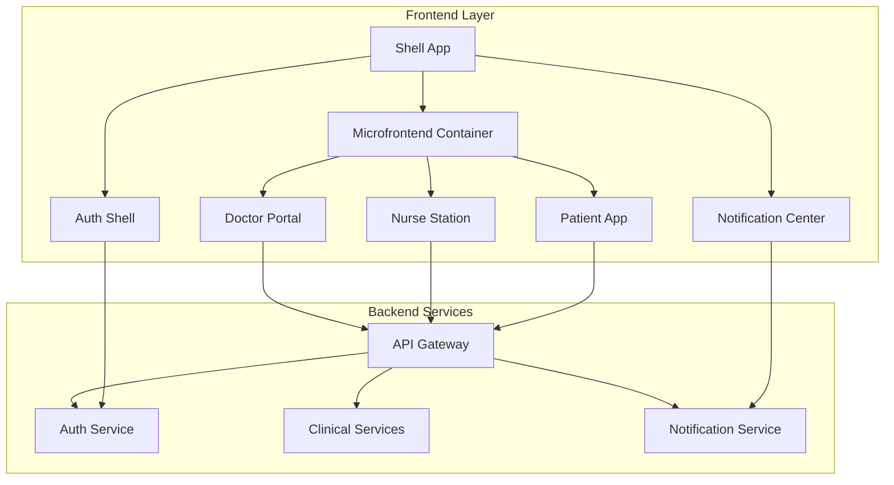
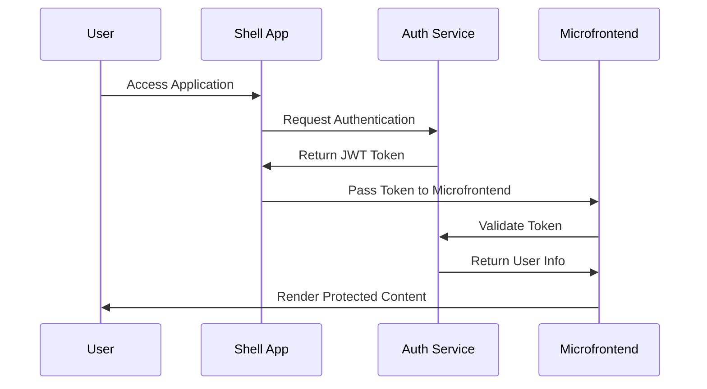

# ZARISH HIS Microfrontends Map

## 🎯 Frontend Architecture Overview

ZARISH HIS employs a micro-frontend architecture where each user interface component is an independent, deployable module. This approach enables teams to develop, deploy, and scale frontend features independently while maintaining a cohesive user experience.

## 📱 Core Clinical Frontends

| Frontend ID | Frontend Name | Description | Technology | Status | Repository |
|-------------|---------------|-------------|------------|---------|------------|
| MF-001 | `mf-doctor-portal` | Complete clinical workspace for physicians | React 19 + TypeScript | ✅ Active | [zs-his/mf-doctor-portal](https://github.com/zs-his/mf-doctor-portal) |
| MF-002 | `mf-nurse-station` | Nursing workflow and patient monitoring | Vue 3 + TypeScript | ✅ Active | [zs-his/mf-nurse-station](https://github.com/zs-his/mf-nurse-station) |
| MF-003 | `mf-patient-app` | Patient portal for appointments and records | React Native | ✅ Active | [zs-his/mf-patient-app](https://github.com/zs-his/mf-patient-app) |
| MF-004 | `mf-emergency-room` | Emergency department triage and management | React 19 + TypeScript | 🚧 In Development | [zs-his/mf-emergency-room](https://github.com/zs-his/mf-emergency-room) |

## 🏢 Administrative Frontends

| Frontend ID | Frontend Name | Description | Technology | Status | Repository |
|-------------|---------------|-------------|------------|---------|------------|
| MF-101 | `mf-admin-dashboard` | System administration and configuration | Vue 3 + TypeScript | ✅ Active | [zs-his/mf-admin-dashboard](https://github.com/zs-his/mf-admin-dashboard) |
| MF-102 | `mf-billing-interface` | Billing and financial management | React 19 + TypeScript | ✅ Active | [zs-his/mf-billing-interface](https://github.com/zs-his/mf-billing-interface) |
| MF-103 | `mf-reporting-portal` | Analytics and reporting interface | Vue 3 + TypeScript | ✅ Active | [zs-his/mf-reporting-portal](https://github.com/zs-his/mf-reporting-portal) |
| MF-104 | `mf-inventory-management` | Medical supplies and inventory | React 19 + TypeScript | 🚧 In Development | [zs-his/mf-inventory-management](https://github.com/zs-his/mf-inventory-management) |

## 🔧 Supporting Frontends

| Frontend ID | Frontend Name | Description | Technology | Status | Repository |
|-------------|---------------|-------------|------------|---------|------------|
| MF-201 | `mf-auth-shell` | Authentication and session management | Vanilla JS | ✅ Active | [zs-his/mf-auth-shell](https://github.com/zs-his/mf-auth-shell) |
| MF-202 | `mf-notification-center` | Real-time notifications and alerts | Vue 3 + TypeScript | ✅ Active | [zs-his/mf-notification-center](https://github.com/zs-his/mf-notification-center) |
| MF-203 | `mf-component-library` | Shared UI component library | Storybook + React 19 | ✅ Active | [zs-his/mf-component-library](https://github.com/zs-his/mf-component-library) |
| MF-204 | `mf-mobile-shell` | Mobile app container and navigation | React Native | ✅ Active | [zs-his/mf-mobile-shell](https://github.com/zs-his/mf-mobile-shell) |

## 🏗️ Architecture Patterns

### 1. **Shell Application Pattern**
```
┌─────────────────────────────────────────────────────────┐
│                    Shell App                            │
│  ┌─────────────┐ ┌─────────────┐ ┌─────────────┐        │
│  │   Header     │ │    Main     │ │   Sidebar    │        │
│  │ Component   │ │   Content   │ │ Component   │        │
│  └─────────────┘ └─────────────┘ └─────────────┘        │
│                                                         │
│  ┌─────────────────────────────────────────────────┐    │
│  │           Microfrontend Container              │    │
│  │  ┌─────────┐ ┌─────────┐ ┌─────────┐           │    │
│  │  │   MF-1  │ │   MF-2  │ │   MF-3  │   ...     │    │
│  │  └─────────┘ └─────────┘ └─────────┘           │    │
│  └─────────────────────────────────────────────────┘    │
└─────────────────────────────────────────────────────────┘
```

### 2. **Module Federation Pattern**
```javascript
// Shell App webpack.config.js
const ModuleFederationPlugin = require('@module-federation/webpack');

module.exports = {
  plugins: [
    new ModuleFederationPlugin({
      name: 'shell',
      remotes: {
        'doctor-portal': 'doctor-portal@http://localhost:3001/remoteEntry.js',
        'nurse-station': 'nurse-station@http://localhost:3002/remoteEntry.js',
        'patient-app': 'patient-app@http://localhost:3003/remoteEntry.js',
      },
      shared: {
        react: { singleton: true, requiredVersion: '^19.0.0' },
        'react-dom': { singleton: true, requiredVersion: '^19.0.0' },
      },
    }),
  ],
};
```

### 3. **Communication Patterns**


## 🎨 Design System Integration

### Shared Component Library
All microfrontends use the **ZARISH Design System**:

```typescript
// Component usage example
import { Button, Card, DataTable, DatePicker } from '@zarish/ui-components';

const PatientForm = () => {
  return (
    <Card title="Patient Information">
      <DatePicker label="Date of Birth" />
      <DataTable 
        columns={patientColumns}
        data={patientData}
      />
      <Button variant="primary" onClick={handleSubmit}>
        Save Patient
      </Button>
    </Card>
  );
};
```

### Theme Configuration
```scss
// Global theme variables
:root {
  --primary-color: #2563eb;
  --secondary-color: #64748b;
  --success-color: #16a34a;
  --warning-color: #ea580c;
  --error-color: #dc2626;
  
  --font-family: 'Inter', sans-serif;
  --font-size-sm: 0.875rem;
  --font-size-base: 1rem;
  --font-size-lg: 1.125rem;
  
  --border-radius: 0.375rem;
  --shadow-sm: 0 1px 2px 0 rgba(0, 0, 0, 0.05);
  --shadow-md: 0 4px 6px -1px rgba(0, 0, 0, 0.1);
}
```

## 🚀 Deployment Architecture

### Container Strategy
Each microfrontend is containerized independently:

```dockerfile
# Example: mf-doctor-portal/Dockerfile
FROM node:24-alpine AS builder
WORKDIR /app
COPY package*.json ./
RUN npm ci --only=production

COPY . .
RUN npm run build

FROM nginx:alpine
COPY --from=builder /app/dist /usr/share/nginx/html
COPY nginx.conf /etc/nginx/nginx.conf
EXPOSE 80
CMD ["nginx", "-g", "daemon off;"]
```

### Kubernetes Deployment
```yaml
# mf-doctor-portal-deployment.yaml
apiVersion: apps/v1
kind: Deployment
metadata:
  name: mf-doctor-portal
spec:
  replicas: 3
  selector:
    matchLabels:
      app: mf-doctor-portal
  template:
    metadata:
      labels:
        app: mf-doctor-portal
    spec:
      containers:
      - name: mf-doctor-portal
        image: zs-his/mf-doctor-portal:latest
        ports:
        - containerPort: 80
        env:
        - name: API_BASE_URL
          value: "https://api.zarishsphere.com"
```

## 📊 State Management Strategy

### 1. **Local State**
- Component-level state using React hooks or Vue composition API
- Form state management with libraries like React Hook Form

### 2. **Global State**
- Redux Toolkit for complex application state
- Pinia for Vue applications
- Zustand for lightweight state management

### 3. **Server State**
- React Query (TanStack Query) for server data
- Vue Query for Vue applications
- SWR for data fetching and caching

## 🔐 Security Implementation

### Authentication Flow


### Security Measures
- **JWT Tokens**: Stateless authentication
- **CORS Policies**: Cross-origin security
- **Content Security Policy**: XSS protection
- **HTTPS Enforcement**: Secure communication
- **Input Validation**: Prevent injection attacks

## 📈 Performance Optimization

### 1. **Code Splitting**
```javascript
// Dynamic imports for microfrontends
const DoctorPortal = lazy(() => import('doctor-portal/DoctorPortal'));
const NurseStation = lazy(() => import('nurse-station/NurseStation'));

const App = () => (
  <Suspense fallback={<LoadingSpinner />}>
    <Router>
      <Route path="/doctor" component={DoctorPortal} />
      <Route path="/nurse" component={NurseStation} />
    </Router>
  </Suspense>
);
```

### 2. **Caching Strategy**
- **Browser Cache**: Static assets with proper headers
- **CDN Cache**: Global content delivery
- **Service Worker**: Offline capabilities
- **Memory Cache**: Component-level caching

### 3. **Bundle Optimization**
- **Tree Shaking**: Remove unused code
- **Minification**: Reduce bundle size
- **Compression**: Gzip/Brotli compression
- **Image Optimization**: WebP format, lazy loading

## 🧪 Testing Strategy

### 1. **Unit Testing**
- Jest for React components
- Vue Test Utils for Vue components
- Testing Library for user interaction testing

### 2. **Integration Testing**
- Cypress for end-to-end testing
- Playwright for cross-browser testing
- Storybook for component testing

### 3. **Visual Testing**
- Chromatic for visual regression testing
- Percy for screenshot testing
- Manual UI review process

## 📝 Development Guidelines

### Adding New Microfrontends
1. **Create Repository**: Follow naming convention `mf-[name]`
2. **Setup Structure**: Use standard template
3. **Integrate Design System**: Import shared components
4. **Configure Routing**: Set up microfrontend routing
5. **Add Tests**: Include comprehensive test suite
6. **Update Documentation**: Add to this map

### Code Standards
- **TypeScript**: Strict mode enabled
- **ESLint**: Custom ZARISH rules
- **Prettier**: Consistent formatting
- **Husky**: Pre-commit hooks

---

*Last Updated: January 2026*  
*Version: 1.0*  
*Frontend Team: ZARISH HIS*
