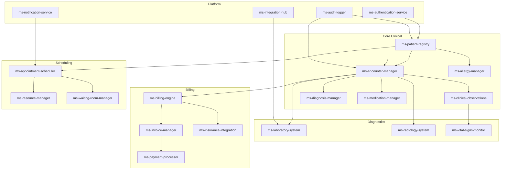

# ZARISH HIS Microservices Grid

## 📋 Service Inventory

This document provides a comprehensive overview of all microservices in the ZARISH HIS ecosystem, their responsibilities, and interconnections.

## 🏥 Core Clinical Services

| Service ID | Service Name | Description | Status | Repository |
|------------|--------------|-------------|---------|------------|
| MS-001 | `ms-patient-registry` | Central patient management and demographics | ✅ Active | [zs-his/ms-patient-registry](https://github.com/zs-his/ms-patient-registry) |
| MS-002 | `ms-encounter-manager` | Clinical encounter and visit management | ✅ Active | [zs-his/ms-encounter-manager](https://github.com/zs-his/ms-encounter-manager) |
| MS-003 | `ms-clinical-observations` | Vitals signs, clinical measurements, and observations | ✅ Active | [zs-his/ms-clinical-observations](https://github.com/zs-his/ms-clinical-observations) |
| MS-004 | `ms-diagnosis-manager` | Diagnosis coding and management (ICD-11) | ✅ Active | [zs-his/ms-diagnosis-manager](https://github.com/zs-his/ms-diagnosis-manager) |
| MS-005 | `ms-medication-manager` | Prescription and medication management | ✅ Active | [zs-his/ms-medication-manager](https://github.com/zs-his/ms-medication-manager) |
| MS-006 | `ms-allergy-manager` | Patient allergy and adverse reaction tracking | ✅ Active | [zs-his/ms-allergy-manager](https://github.com/zs-his/ms-allergy-manager) |

## 🧪 Laboratory & Diagnostic Services

| Service ID | Service Name | Description | Status | Repository |
|------------|--------------|-------------|---------|------------|
| MS-101 | `ms-laboratory-system` | Lab order management and results integration | ✅ Active | [zs-his/ms-laboratory-system](https://github.com/zs-his/ms-laboratory-system) |
| MS-102 | `ms-radiology-system` | Radiology orders and imaging integration | 🚧 In Development | [zs-his/ms-radiology-system](https://github.com/zs-his/ms-radiology-system) |
| MS-103 | `ms-pathology-system` | Pathology test management | 📋 Planned | - |
| MS-104 | `ms-vital-signs-monitor` | Real-time vital signs monitoring from devices | ✅ Active | [zs-his/ms-vital-signs-monitor](https://github.com/zs-his/ms-vital-signs-monitor) |

## 💰 Billing & Financial Services

| Service ID | Service Name | Description | Status | Repository |
|------------|--------------|-------------|---------|------------|
| MS-201 | `ms-billing-engine` | Medical billing and claims processing | ✅ Active | [zs-his/ms-billing-engine](https://github.com/zs-his/ms-billing-engine) |
| MS-202 | `ms-invoice-manager` | Invoice generation and tracking | ✅ Active | [zs-his/ms-invoice-manager](https://github.com/zs-his/ms-invoice-manager) |
| MS-203 | `ms-payment-processor` | Payment gateway integration | ✅ Active | [zs-his/ms-payment-processor](https://github.com/zs-his/ms-payment-processor) |
| MS-204 | `ms-insurance-integration` | Insurance company integrations | 🚧 In Development | [zs-his/ms-insurance-integration](https://github.com/zs-his/ms-insurance-integration) |

## 📅 Appointment & Scheduling Services

| Service ID | Service Name | Description | Status | Repository |
|------------|--------------|-------------|---------|------------|
| MS-301 | `ms-appointment-scheduler` | Appointment booking and management | ✅ Active | [zs-his/ms-appointment-scheduler](https://github.com/zs-his/ms-appointment-scheduler) |
| MS-302 | `ms-resource-manager` | Room, equipment, and staff scheduling | ✅ Active | [zs-his/ms-resource-manager](https://github.com/zs-his/ms-resource-manager) |
| MS-303 | `ms-waiting-room-manager` | Patient queue and waiting room management | ✅ Active | [zs-his/ms-waiting-room-manager](https://github.com/zs-his/ms-waiting-room-manager) |

## 🏢 Administrative Services

| Service ID | Service Name | Description | Status | Repository |
|------------|--------------|-------------|---------|------------|
| MS-401 | `ms-user-management` | User accounts, roles, and permissions | ✅ Active | [zs-his/ms-user-management](https://github.com/zs-his/ms-user-management) |
| MS-402 | `ms-facility-manager` | Hospital and facility management | ✅ Active | [zs-his/ms-facility-manager](https://github.com/zs-his/ms-facility-manager) |
| MS-403 | `ms-inventory-manager` | Medical supplies and inventory tracking | 🚧 In Development | [zs-his/ms-inventory-manager](https://github.com/zs-his/ms-inventory-manager) |
| MS-404 | `ms-reporting-engine` | Analytics and reporting services | ✅ Active | [zs-his/ms-reporting-engine](https://github.com/zs-his/ms-reporting-engine) |

## 🔐 Security & Integration Services

| Service ID | Service Name | Description | Status | Repository |
|------------|--------------|-------------|---------|------------|
| MS-501 | `ms-authentication-service` | Authentication and authorization | ✅ Active | [zs-his/ms-authentication-service](https://github.com/zs-his/ms-authentication-service) |
| MS-502 | `ms-audit-logger` | Comprehensive audit logging | ✅ Active | [zs-his/ms-audit-logger](https://github.com/zs-his/ms-audit-logger) |
| MS-503 | `ms-notification-service` | Email, SMS, and push notifications | ✅ Active | [zs-his/ms-notification-service](https://github.com/zs-his/ms-notification-service) |
| MS-504 | `ms-integration-hub` | Third-party system integrations (HL7, FHIR) | ✅ Active | [zs-his/ms-integration-hub](https://github.com/zs-his/ms-integration-hub) |

## 📊 Service Dependencies



## 🔧 Service Specifications

### Standard Service Pattern
All ZARISH HIS microservices follow this standard pattern:

```
ms-[service-name]/
├── cmd/
│   └── server/
│       └── main.go              # Service entry point
├── internal/
│   ├── domain/                  # Business logic
│   ├── infrastructure/          # External dependencies
│   ├── application/            # Use cases
│   └── interfaces/             # HTTP/gRPC handlers
├── pkg/
│   ├── errors/                  # Standard error types
│   ├── logger/                  # Logging utilities
│   └── metrics/                 # Metrics collection
├── configs/
│   ├── config.yaml              # Configuration
│   └── docker/                  # Docker configs
├── migrations/                  # Database migrations
├── tests/                       # Test files
├── docs/                        # API documentation
├── Dockerfile
├── docker-compose.yml
├── go.mod
├── go.sum
└── README.md
```

### Technology Stack
- **Language**: Golang 1.25.x
- **Framework**: Gin (HTTP) + gRPC
- **Database**: PostgreSQL (primary) + Redis (cache)
- **Messaging**: Apache Kafka
- **Observability**: OpenTelemetry
- **Container**: Docker + Kubernetes

## 📈 Service Metrics

### Performance Indicators
- **Response Time**: < 200ms (95th percentile)
- **Availability**: > 99.9%
- **Error Rate**: < 0.1%
- **Throughput**: Varies by service

### Monitoring
- **Health Checks**: `/health` endpoint
- **Metrics**: Prometheus endpoints
- **Tracing**: Jaeger integration
- **Logging**: Structured JSON logs

## 🚀 Deployment

### Kubernetes Deployment
Each service includes:
- **Deployment**: Pod management
- **Service**: Network exposure
- **ConfigMap**: Configuration management
- **Secret**: Sensitive data
- **HorizontalPodAutoscaler**: Auto-scaling

### Environment Configuration
- **Development**: Local Docker Compose
- **Staging**: Kubernetes cluster
- **Production**: Multi-zone Kubernetes

---

## 📝 Service Development Guidelines

### Adding New Services
1. Follow the standard service pattern
2. Implement required interfaces
3. Add comprehensive tests
4. Update this grid
5. Create API specifications

### Service Communication
- Use **gRPC** for internal service communication
- Use **REST APIs** for external integrations
- Implement **circuit breakers** for resilience
- Use **message queues** for async operations

---

*Last Updated: January 2026*  
*Version: 1.0*  
*Microservices Team: ZARISH HIS*
