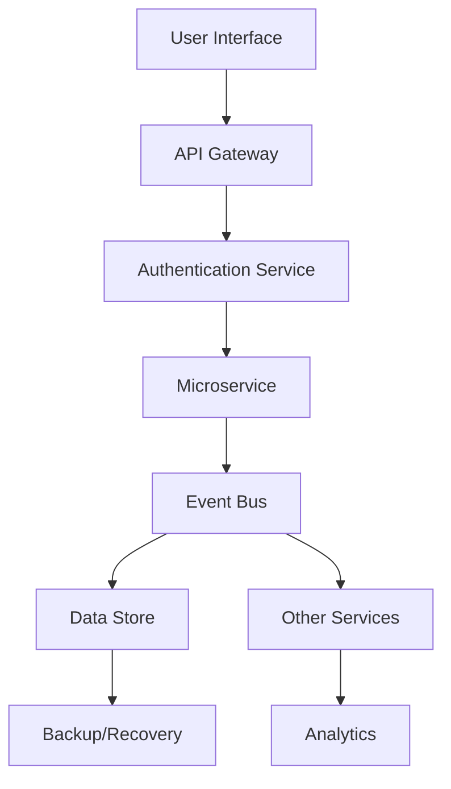

# ZARISH HIS System Overview

## 🎯 Executive Summary

ZARISH HIS is a next-generation Health Information System designed for extreme modularity, scalability, and interoperability. Built on a microservices architecture with **Golang 1.25.x** and modern micro-frontends, ZARISH HIS enables healthcare organizations to deploy, customize, and scale individual components as independent plug-ins.

## 🏗️ Core Architecture Principles

### 1. **Plug-in Architecture**
Every component - from patient registration to billing - is designed as an independent, pluggable module that can be:
- **Added**: New modules can be introduced without system restart
- **Removed**: Unneeded services can be detached without affecting others
- **Updated**: Individual modules can be upgraded independently
- **Scaled**: Services can scale based on demand

### 2. **Canonical Data Model**
All medical data follows **FHIR R5** standards, ensuring:
- **Interoperability**: Seamless data exchange with other systems
- **Consistency**: Uniform data definitions across all modules
- **Compliance**: Adherence to international healthcare standards

### 3. **Event-Driven Communication**
Services communicate through:
- **Async Events**: Non-blocking message passing
- **Event Sourcing**: Complete audit trail of all changes
- **CQRS Pattern**: Separate read/write operations for performance

## 🚀 System Components

### Backend Microservices (Golang 1.25.x)
```
┌─────────────────┐    ┌─────────────────┐    ┌─────────────────┐
│  ms-patient-    │    │  ms-billing-    │    │  ms-laboratory- │
│  registry       │    │  engine         │    │  system         │
└─────────────────┘    └─────────────────┘    └─────────────────┘
         │                       │                       │
         └───────────────────────┼───────────────────────┘
                                 │
                    ┌─────────────────┐
                    │  Event Bus      │
                    │  (Apache Kafka) │
                    └─────────────────┘
```

### Frontend Micro-frontends
```
┌─────────────────┐    ┌─────────────────┐    ┌─────────────────┐
│  mf-doctor-     │    │  mf-patient-    │    │  mf-admin-      │
│  portal         │    │  app            │    │  dashboard      │
└─────────────────┘    └─────────────────┘    └─────────────────┘
         │                       │                       │
         └───────────────────────┼───────────────────────┘
                                 │
                    ┌─────────────────┐
                    │  Shell App      │
                    │  (React 19/Vue)    │
                    └─────────────────┘
```

## 📊 Data Flow Architecture



## 🔧 Technology Stack

### Backend Technologies
- **Language**: Golang 1.25.x
- **Framework**: Gin + gRPC
- **Database**: PostgreSQL + Redis
- **Messaging**: Apache Kafka
- **Container**: Docker + Kubernetes

### Frontend Technologies
- **Framework**: React 19 / Vue 3+
- **Build Tool**: Vite
- **State Management**: Redux Toolkit / Pinia
- **UI Library**: Tailwind CSS + Headless UI

### Infrastructure
- **Orchestration**: Kubernetes
- **Service Mesh**: Istio
- **Monitoring**: Prometheus + Grafana
- **Logging**: ELK Stack
- **CI/CD**: GitHub Actions

## 🔐 Security Architecture

### Multi-Layer Security
1. **Network Layer**: TLS 1.3, mTLS for service communication
2. **Application Layer**: JWT + OAuth 2.0 + OpenID Connect
3. **Data Layer**: Encryption at rest and in transit
4. **Compliance**: HIPAA, GDPR, and local healthcare regulations

### Identity & Access Management
- **Role-Based Access Control (RBAC)**
- **Attribute-Based Access Control (ABAC)**
- **Multi-Factor Authentication (MFA)**
- **Session Management**

## 📈 Scalability & Performance

### Horizontal Scaling
- **Stateless Services**: Easy horizontal scaling
- **Load Balancing**: Multiple load balancing strategies
- **Caching**: Multi-level caching (Redis, CDN)
- **Database Sharding**: Horizontal data partitioning

### Performance Monitoring
- **Real-time Metrics**: Service health and performance
- **Distributed Tracing**: Request flow across services
- **Error Tracking**: Centralized error monitoring
- **Resource Monitoring**: CPU, memory, and network usage

## 🔄 Deployment Strategy

### Blue-Green Deployment
- **Zero Downtime**: Seamless updates
- **Rollback Capability**: Quick rollback if issues occur
- **Health Checks**: Automated health verification
- **Traffic Shifting**: Gradual traffic migration

### Environment Management
- **Development**: Local development setup
- **Staging**: Production-like testing environment
- **Production**: Live environment with high availability
- **Disaster Recovery**: Backup and recovery procedures

---

## 📚 Next Steps

1. **Read the [Microservices Grid](microservices-grid.md)** for detailed service specifications
2. **Review the [Microfrontends Map](microfrontends-map.md)** for UI component architecture
3. **Check [Standards](../01-standards/)** for development guidelines
4. **Explore [API Specifications](../04-api-specifications/)** for integration details

---

*Last Updated: January 2026*  
*Version: 1.0*  
*Architecture Team: ZARISH HIS*