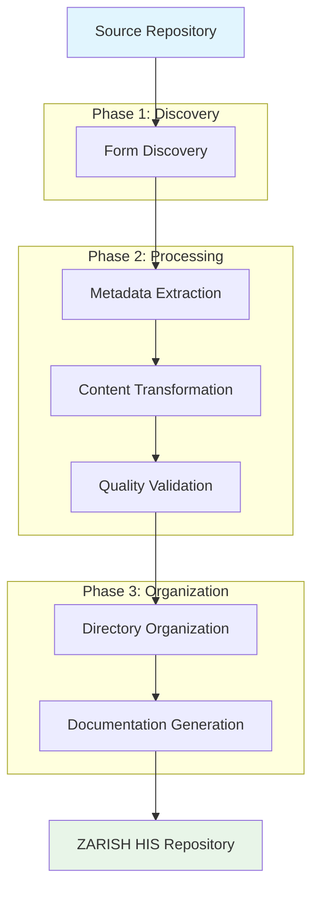
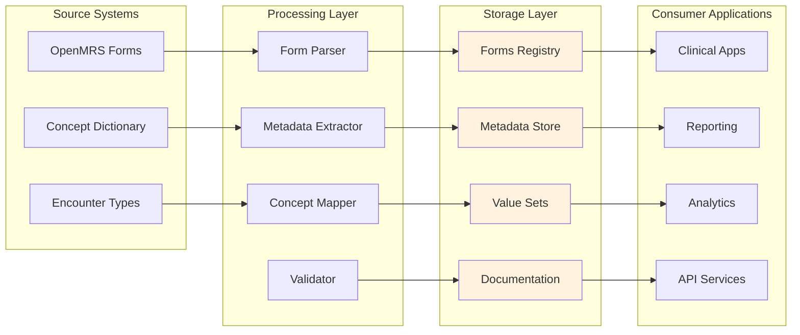
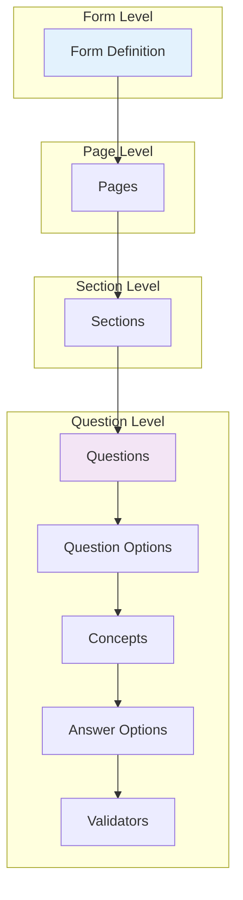
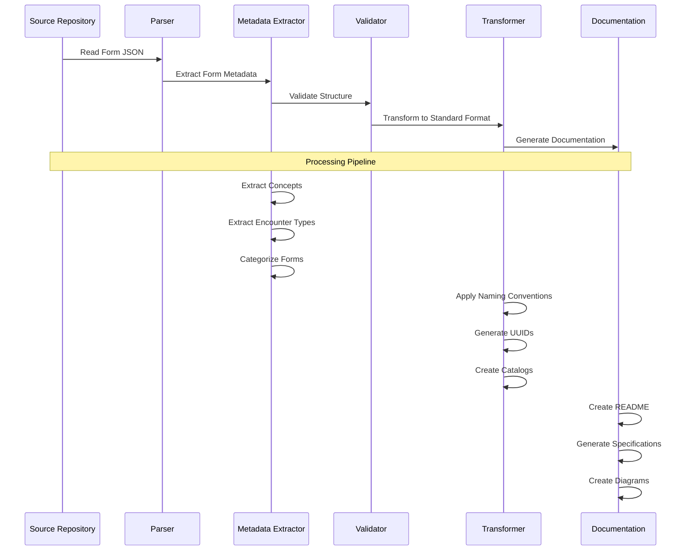
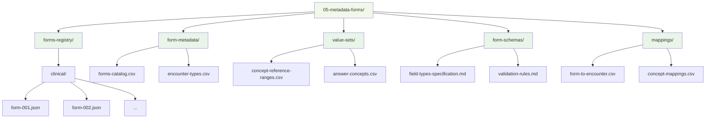
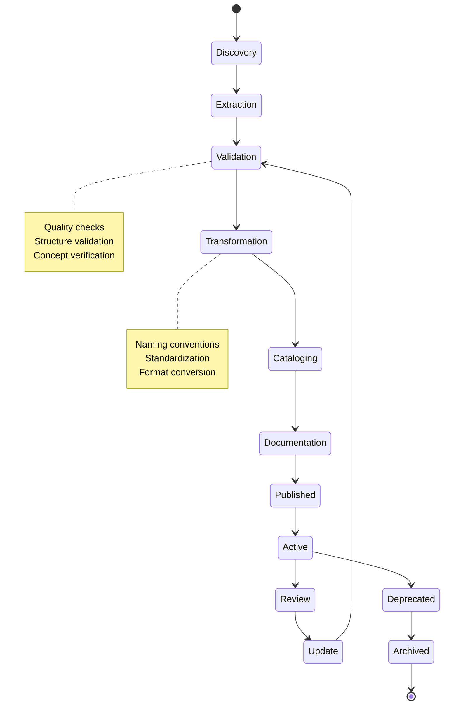
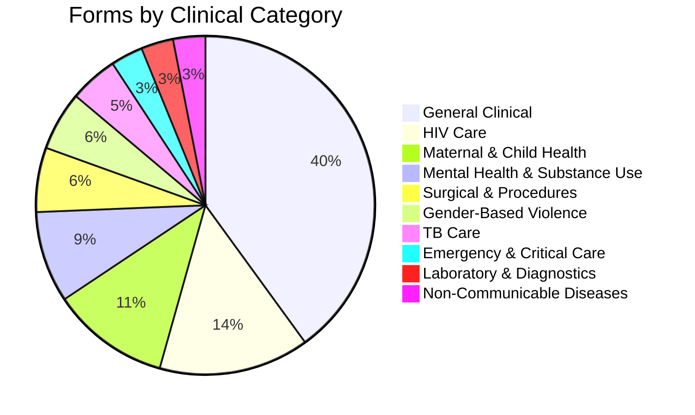
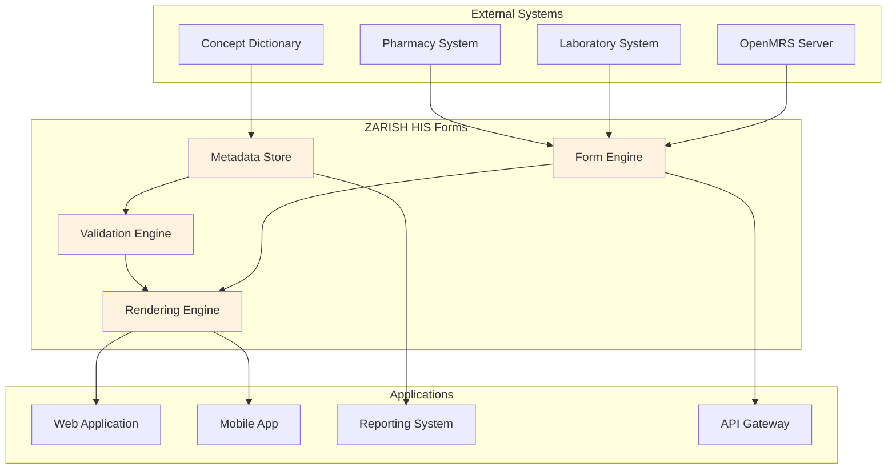
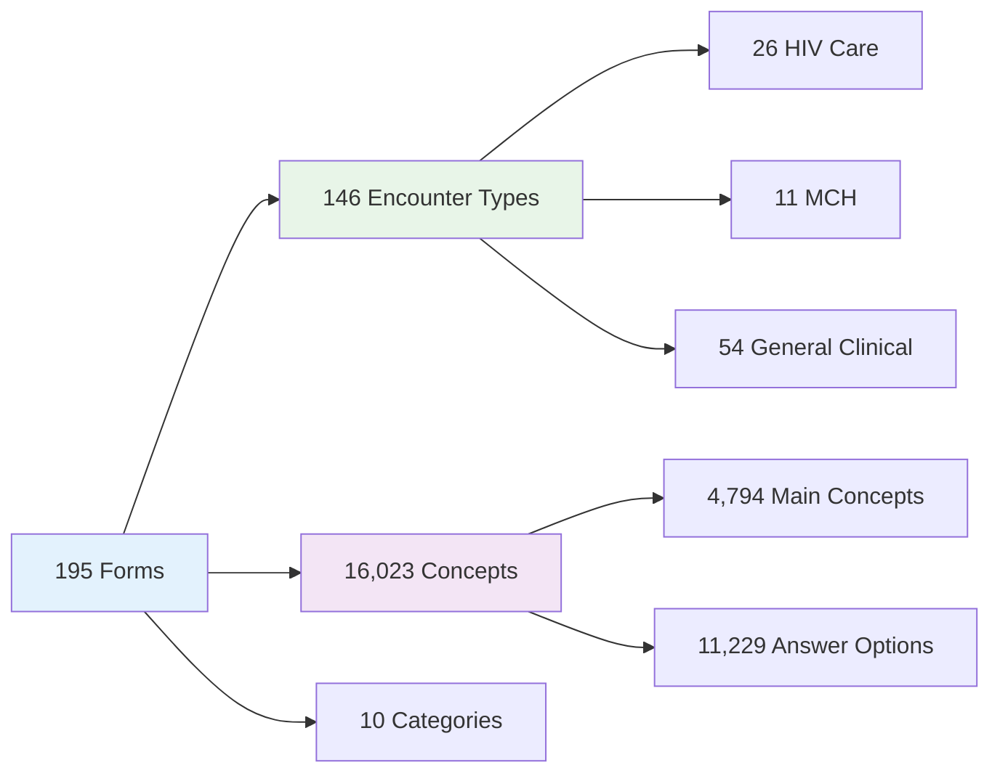
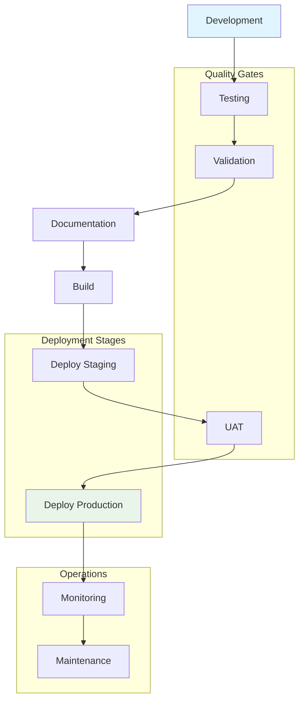

# Form Processing Pipeline and Architecture

This document provides visual representations of the form processing pipeline, data flow, and system architecture for the ZARISH HIS forms system.

## 🔄 Form Processing Pipeline

## 📊 Data Flow Architecture

## 🏗️ Form Structure Hierarchy

## 📋 Metadata Processing Flow

## 🗂️ Directory Structure Flow

## 🔄 Form Lifecycle Management

## 📊 Form Categories Distribution

## 🔗 Integration Architecture

## 📈 Processing Metrics

## 🚀 Deployment Pipeline

---

*These diagrams provide a comprehensive view of the ZARISH HIS forms system architecture and processing workflows. They are updated as the system evolves.*
