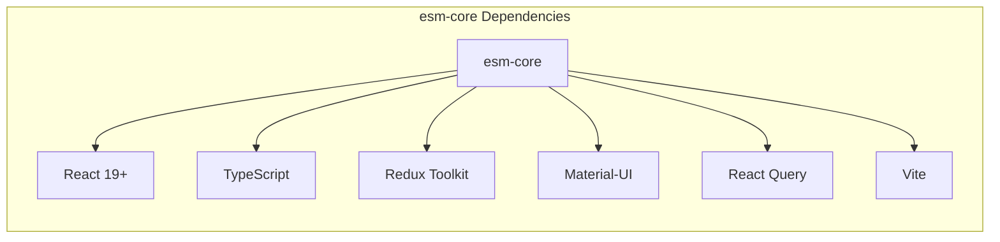
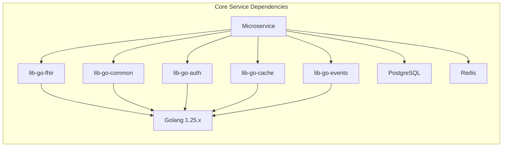
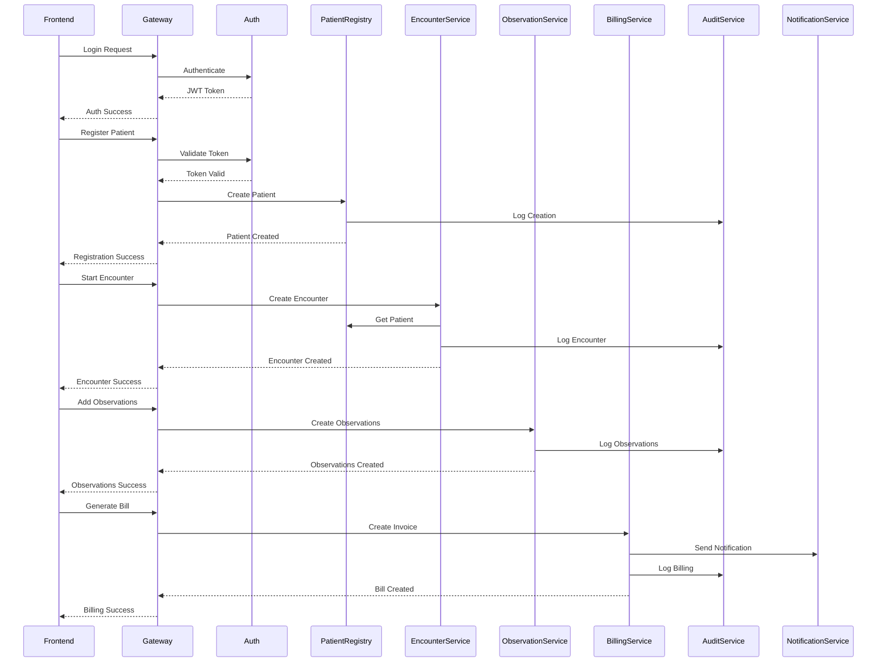
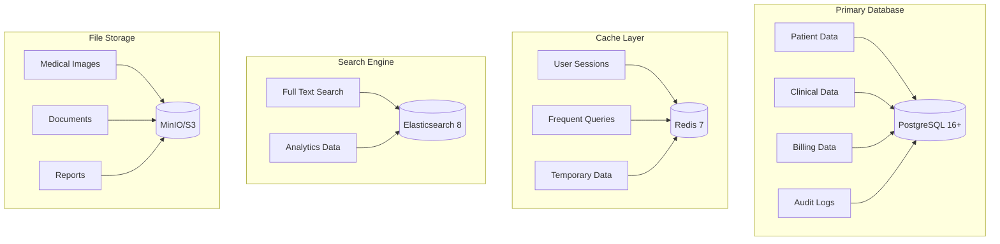
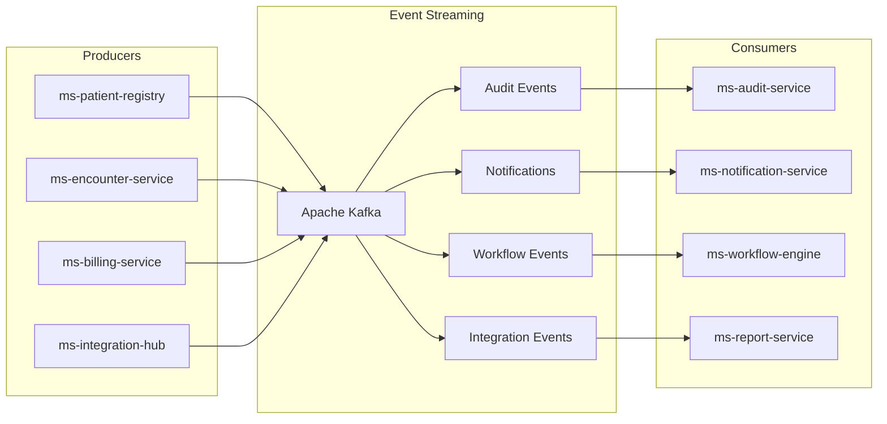
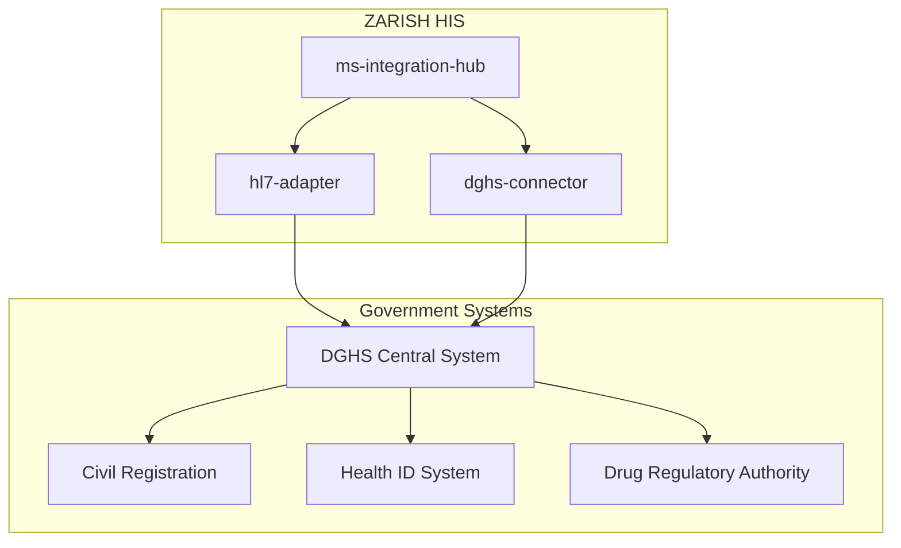
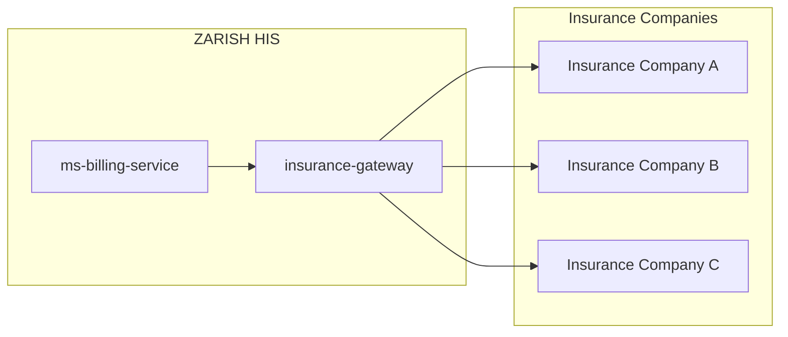

# ZARISH HIS Dependency Graph

This document visualizes and explains the dependencies between all ZARISH HIS components, including frontend monorepos, backend microservices, and shared libraries.

## 🏗️ System Dependency Overview

```mermaid
graph TB
    subgraph "External Systems"
        DGHS[DGHS Systems]
        INSURANCE[Insurance Gateways]
        LABS[External Labs]
        PHARMACIES[External Pharmacies]
        BANKS[Banking Systems]
    end
    
    subgraph "Frontend Layer"
        subgraph "Core Framework"
            ESM_CORE[esm-core]
            ESM_DESIGN[esm-design-system]
        end
        
        subgraph "Patient Applications"
            ESM_PATIENT[esm-patient-management]
            ESM_CHART[esm-patient-chart]
        end
        
        subgraph "Clinical Applications"
            ESM_FORMS[esm-form-engine]
            ESM_CLINICAL[esm-clinical-workspace]
            ESM_PRESCRIPTION[esm-prescription]
        end
        
        subgraph "Departmental Apps"
            ESM_PHARMACY[esm-pharmacy]
            ESM_LAB[esm-laboratory]
            ESM_RADIO[esm-radiology]
            ESM_BILLING[esm-billing]
            ESM_INPATIENT[esm-inpatient]
            ESM_EMERGENCY[esm-emergency]
            ESM_SURGERY[esm-surgery]
            ESM_MATERNAL[esm-maternal-health]
        end
        
        subgraph "Administrative Apps"
            ESM_ADMIN[esm-admin]
            ESM_REPORTS[esm-reports]
            ESM_INVENTORY[esm-inventory]
        end
        
        subgraph "Mobile Apps"
            ESM_MOBILE[esm-mobile]
        end
    end
    
    subgraph "API Gateway"
        GATEWAY[api-gateway]
        FHIR_GATEWAY[fhir-gateway]
    end
    
    subgraph "Backend Services"
        subgraph "Core Services"
            MS_PATIENT[ms-patient-registry]
            MS_PRACTITIONER[ms-practitioner-registry]
            MS_ORGANIZATION[ms-organization-registry]
            MS_ENCOUNTER[ms-encounter-service]
        end
        
        subgraph "Clinical Services"
            MS_OBSERVATION[ms-observation-service]
            MS_CONDITION[ms-condition-service]
            MS_MEDICATION[ms-medication-service]
            MS_PROCEDURE[ms-procedure-service]
            MS_IMMUNIZATION[ms-immunization-service]
            MS_DIAGNOSTIC[ms-diagnostic-service]
        end
        
        subgraph "Ancillary Services"
            MS_LABORATORY[ms-laboratory-service]
            MS_RADIOLOGY[ms-radiology-service]
            MS_PHARMACY_SVC[ms-pharmacy-service]
            MS_BLOOD_BANK[ms-blood-bank-service]
        end
        
        subgraph "Administrative Services"
            MS_APPOINTMENT[ms-appointment-service]
            MS_BILLING_SVC[ms-billing-service]
            MS_INVENTORY_SVC[ms-inventory-service]
            MS_BED[ms-bed-management]
            MS_QUEUE[ms-queue-service]
        end
        
        subgraph "Infrastructure Services"
            MS_AUTH[ms-auth-service]
            MS_NOTIFICATION[ms-notification-service]
            MS_AUDIT[ms-audit-service]
            MS_INTEGRATION[ms-integration-hub]
            MS_REPORT[ms-report-service]
            MS_WORKFLOW[ms-workflow-engine]
        end
    end
    
    subgraph "Shared Libraries"
        subgraph "Frontend Libraries"
            LIB_FHIR_UI[lib-fhir-utils]
            LIB_UI[lib-ui-components]
            LIB_FORMS[lib-form-validators]
        end
        
        subgraph "Backend Libraries"
            LIB_FHIR_GO[lib-go-fhir]
            LIB_COMMON[lib-go-common]
            LIB_AUTH[lib-go-auth]
            LIB_EVENTS[lib-go-events]
            LIB_CACHE[lib-go-cache]
        end
    end
    
    subgraph "Infrastructure Components"
        POSTGRES[(PostgreSQL)]
        REDIS[(Redis)]
        KAFKA[Apache Kafka]
        ELASTICSEARCH[(Elasticsearch)]
        MINIO[(MinIO/S3)]
    end
    
    subgraph "External Integrations"
        HL7_ADAPTER[hl7-adapter]
        DGHS_CONNECTOR[dghs-connector]
        INSURANCE_GATEWAY[insurance-gateway]
    end
    
    %% Frontend Dependencies
    ESM_PATIENT --> ESM_CORE
    ESM_PATIENT --> LIB_FHIR_UI
    ESM_PATIENT --> LIB_UI
    ESM_CHART --> ESM_CORE
    ESM_CHART --> LIB_FHIR_UI
    ESM_FORMS --> ESM_CORE
    ESM_FORMS --> LIB_FORMS
    ESM_PHARMACY --> ESM_CORE
    ESM_LAB --> ESM_CORE
    ESM_RADIO --> ESM_CORE
    ESM_BILLING --> ESM_CORE
    ESM_INPATIENT --> ESM_CORE
    ESM_EMERGENCY --> ESM_CORE
    ESM_SURGERY --> ESM_CORE
    ESM_MATERNAL --> ESM_CORE
    ESM_ADMIN --> ESM_CORE
    ESM_REPORTS --> ESM_CORE
    ESM_INVENTORY --> ESM_CORE
    ESM_MOBILE --> ESM_CORE
    
    %% All Frontends to Gateway
    ESM_CORE --> GATEWAY
    ESM_DESIGN --> GATEWAY
    
    %% Gateway to Services
    GATEWAY --> MS_AUTH
    GATEWAY --> FHIR_GATEWAY
    FHIR_GATEWAY --> MS_PATIENT
    FHIR_GATEWAY --> MS_PRACTITIONER
    FHIR_GATEWAY --> MS_ORGANIZATION
    FHIR_GATEWAY --> MS_ENCOUNTER
    FHIR_GATEWAY --> MS_OBSERVATION
    FHIR_GATEWAY --> MS_CONDITION
    FHIR_GATEWAY --> MS_MEDICATION
    FHIR_GATEWAY --> MS_PROCEDURE
    FHIR_GATEWAY --> MS_IMMUNIZATION
    FHIR_GATEWAY --> MS_DIAGNOSTIC
    FHIR_GATEWAY --> MS_LABORATORY
    FHIR_GATEWAY --> MS_RADIOLOGY
    FHIR_GATEWAY --> MS_PHARMACY_SVC
    FHIR_GATEWAY --> MS_BLOOD_BANK
    FHIR_GATEWAY --> MS_APPOINTMENT
    FHIR_GATEWAY --> MS_BILLING_SVC
    FHIR_GATEWAY --> MS_INVENTORY_SVC
    FHIR_GATEWAY --> MS_BED
    FHIR_GATEWAY --> MS_QUEUE
    FHIR_GATEWAY --> MS_NOTIFICATION
    FHIR_GATEWAY --> MS_AUDIT
    FHIR_GATEWAY --> MS_REPORT
    FHIR_GATEWAY --> MS_WORKFLOW
    
    %% Service Dependencies
    MS_PATIENT --> LIB_FHIR_GO
    MS_PATIENT --> LIB_COMMON
    MS_PATIENT --> LIB_AUTH
    MS_PRACTITIONER --> LIB_FHIR_GO
    MS_PRACTITIONER --> LIB_COMMON
    MS_ORGANIZATION --> LIB_FHIR_GO
    MS_ORGANIZATION --> LIB_COMMON
    MS_ENCOUNTER --> LIB_FHIR_GO
    MS_ENCOUNTER --> LIB_COMMON
    MS_ENCOUNTER --> LIB_EVENTS
    
    MS_OBSERVATION --> LIB_FHIR_GO
    MS_OBSERVATION --> LIB_COMMON
    MS_CONDITION --> LIB_FHIR_GO
    MS_MEDICATION --> LIB_FHIR_GO
    MS_PROCEDURE --> LIB_FHIR_GO
    MS_IMMUNIZATION --> LIB_FHIR_GO
    MS_DIAGNOSTIC --> LIB_FHIR_GO
    
    MS_LABORATORY --> LIB_FHIR_GO
    MS_RADIOLOGY --> LIB_FHIR_GO
    MS_PHARMACY_SVC --> LIB_FHIR_GO
    MS_BLOOD_BANK --> LIB_FHIR_GO
    
    MS_APPOINTMENT --> LIB_FHIR_GO
    MS_BILLING_SVC --> LIB_FHIR_GO
    MS_INVENTORY_SVC --> LIB_FHIR_GO
    MS_BED --> LIB_FHIR_GO
    MS_QUEUE --> LIB_FHIR_GO
    
    MS_AUTH --> LIB_AUTH
    MS_AUTH --> LIB_CACHE
    MS_NOTIFICATION --> LIB_EVENTS
    MS_AUDIT --> LIB_EVENTS
    MS_INTEGRATION --> LIB_EVENTS
    MS_REPORT --> LIB_COMMON
    MS_WORKFLOW --> LIB_EVENTS
    
    %% Data Dependencies
    MS_PATIENT --> POSTGRES
    MS_PRACTITIONER --> POSTGRES
    MS_ORGANIZATION --> POSTGRES
    MS_ENCOUNTER --> POSTGRES
    MS_OBSERVATION --> POSTGRES
    MS_CONDITION --> POSTGRES
    MS_MEDICATION --> POSTGRES
    MS_PROCEDURE --> POSTGRES
    MS_IMMUNIZATION --> POSTGRES
    MS_DIAGNOSTIC --> POSTGRES
    MS_LABORATORY --> POSTGRES
    MS_RADIOLOGY --> POSTGRES
    MS_PHARMACY_SVC --> POSTGRES
    MS_BLOOD_BANK --> POSTGRES
    MS_APPOINTMENT --> POSTGRES
    MS_BILLING_SVC --> POSTGRES
    MS_INVENTORY_SVC --> POSTGRES
    MS_BED --> POSTGRES
    MS_QUEUE --> POSTGRES
    MS_AUTH --> POSTGRES
    MS_NOTIFICATION --> POSTGRES
    MS_AUDIT --> POSTGRES
    MS_REPORT --> POSTGRES
    MS_WORKFLOW --> POSTGRES
    
    %% Cache Dependencies
    MS_AUTH --> REDIS
    MS_PATIENT --> REDIS
    MS_OBSERVATION --> REDIS
    MS_BILLING_SVC --> REDIS
    MS_NOTIFICATION --> REDIS
    
    %% Event Streaming
    MS_NOTIFICATION --> KAFKA
    MS_AUDIT --> KAFKA
    MS_INTEGRATION --> KAFKA
    MS_WORKFLOW --> KAFKA
    
    %% File Storage
    MS_LABORATORY --> MINIO
    MS_RADIOLOGY --> MINIO
    MS_BILLING_SVC --> MINIO
    
    %% Search
    MS_REPORT --> ELASTICSEARCH
    
    %% External Integrations
    MS_INTEGRATION --> HL7_ADAPTER
    MS_INTEGRATION --> DGHS_CONNECTOR
    MS_BILLING_SVC --> INSURANCE_GATEWAY
    
    HL7_ADAPTER --> DGHS
    DGHS_CONNECTOR --> DGHS
    INSURANCE_GATEWAY --> INSURANCE
    MS_LABORATORY --> LABS
    MS_RADIOLOGY --> LABS
    MS_PHARMACY_SVC --> PHARMACIES
    MS_BILLING_SVC --> BANKS
```

## 📦 Frontend Dependency Details

### Core Framework Dependencies

### Application Dependencies

| Application | Core Dependencies | Specialized Dependencies | Purpose |
|-------------|------------------|----------------------|---------|
| **esm-patient-management** | esm-core, lib-fhir-utils, lib-ui-components | lib-form-validators | Patient registration and management |
| **esm-patient-chart** | esm-core, lib-fhir-utils | Chart.js, D3.js | Clinical data visualization |
| **esm-form-engine** | esm-core, lib-form-validators | React Hook Form, Yup | Dynamic form generation |
| **esm-pharmacy** | esm-core, lib-fhir-utils | jsPDF, Barcode.js | Pharmacy operations |
| **esm-laboratory** | esm-core, lib-fhir-utils | WebSocket, File Upload | Lab test management |
| **esm-radiology** | esm-core, lib-fhir-utils | DICOM Parser, Image Viewer | Radiology imaging |
| **esm-billing** | esm-core, lib-fhir-utils | Stripe Integration | Financial processing |
| **esm-inpatient** | esm-core, lib-fhir-utils | Drag & Drop, Calendar | Bed management |
| **esm-admin** | esm-core, lib-ui-components | Admin Dashboard Kit | System administration |
| **esm-reports** | esm-core, lib-fhir-utils | Chart.js, Export Tools | Analytics and reporting |
| **esm-emergency** | esm-core, lib-fhir-utils | Real-time Updates | Emergency department |
| **esm-surgery** | esm-core, lib-fhir-utils | Scheduler, Timeline | OR management |
| **esm-maternal-health** | esm-core, lib-fhir-utils | Pregnancy Calculator | Maternal care |
| **esm-mobile** | esm-core, lib-fhir-utils | React Native, Capacitor | Mobile applications |

## ⚙️ Backend Dependency Details

### Core Service Dependencies

### Service-Specific Dependencies

| Service Type | Core Libraries | Specialized Dependencies | Purpose |
|-------------|----------------|----------------------|---------|
| **Core Services** | lib-go-fhir, lib-go-common, lib-go-auth | PostgreSQL, Redis | Patient, practitioner, organization data |
| **Clinical Services** | lib-go-fhir, lib-go-common | lib-go-events, PostgreSQL | Clinical data and observations |
| **Ancillary Services** | lib-go-fhir, lib-go-common | MinIO, PostgreSQL | Lab, radiology, pharmacy operations |
| **Administrative Services** | lib-go-fhir, lib-go-common | lib-go-events, Redis | Billing, appointments, inventory |
| **Infrastructure Services** | lib-go-common, lib-go-auth | Kafka, Redis, Elasticsearch | Auth, notifications, audit |

## 🔄 Data Flow Dependencies

### Patient Journey Data Flow

## 🏛️ Infrastructure Dependencies

### Database Dependencies

### Message Queue Dependencies

## 🔗 External System Dependencies

### Government Integrations

### Insurance Integrations

## 📊 Dependency Analysis

### Critical Path Analysis

**Critical Dependencies** (Failure affects entire system):
1. **API Gateway** - Single point of entry
2. **Authentication Service** - Security dependency
3. **PostgreSQL** - Primary data store
4. **Redis** - Session management
5. **esm-core** - Frontend framework

**High Impact Dependencies**:
1. **FHIR Gateway** - Clinical data routing
2. **lib-go-fhir** - FHIR operations
3. **Kafka** - Event streaming
4. **MinIO** - File storage

**Medium Impact Dependencies**:
1. **Individual microservices** - Domain-specific functionality
2. **Departmental frontend apps** - Specialized workflows
3. **External integrations** - Third-party data exchange

### Risk Assessment

| Dependency | Risk Level | Mitigation Strategy |
|-------------|-------------|-------------------|
| **API Gateway** | High | Redundant instances, health checks |
| **PostgreSQL** | High | Master-slave replication, backups |
| **Redis** | Medium | Cluster configuration, persistence |
| **Kafka** | Medium | Cluster replication, monitoring |
| **External APIs** | Medium | Circuit breakers, retry logic |
| **Single Services** | Low | Service isolation, monitoring |

---

## 🔄 Dependency Management

### Version Management

- **Frontend**: Semantic versioning with npm
- **Backend**: Go modules with version tags
- **Shared Libraries**: Independent versioning
- **Infrastructure**: Docker image versioning

### Update Strategies

1. **Frontend Updates**:
   - Core framework updates first
   - Gradual application migration
   - Backward compatibility maintained

2. **Backend Updates**:
   - Database migrations first
   - Service updates with blue-green deployment
   - API versioning for compatibility

3. **Library Updates**:
   - Shared libraries updated independently
   - Semantic versioning for breaking changes
   - Automated testing for compatibility

---

_Last updated: 2026-01-21_
