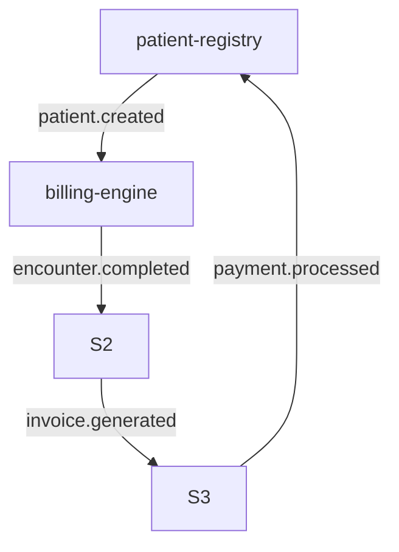

# Event Flow Diagram

```mermaid
graph TD
    %% Event-driven architecture flow

    S0[patient-registry]
    S1[billing-engine]

    %% Event flows
    S0 -->|patient.created| S1
    S1 -->|encounter.completed| S2
    S2 -->|invoice.generated| S3
    S3 -->|payment.processed| S0
```