# Data Flows

Comprehensive data flow documentation for ZARISH HIS, including real-time streams, batch processing, data transformation, and Bangladesh healthcare system integration patterns.

## 📋 Data Flow Overview

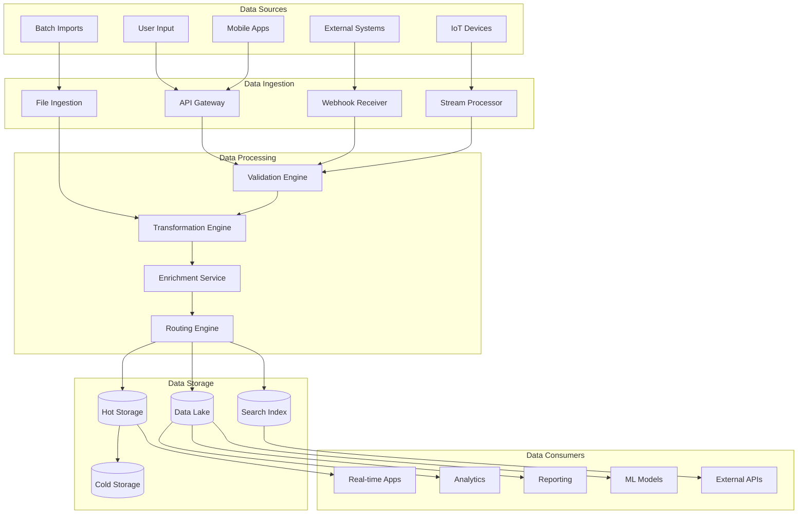

## 🔄 Real-Time Data Flows

### Patient Registration Flow

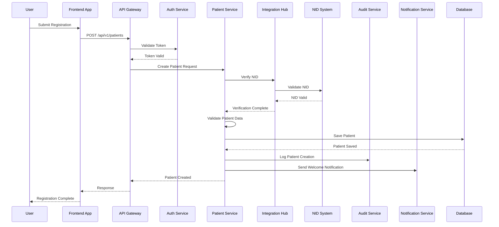

### Clinical Encounter Flow

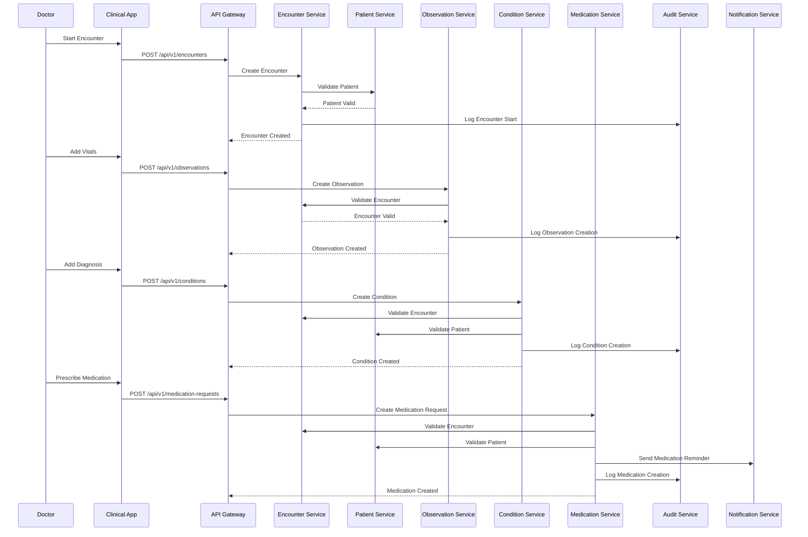

### Laboratory Order Flow

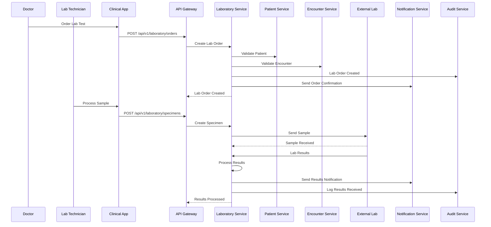

## 📊 Batch Data Flows

### Daily DGHS Reporting Flow

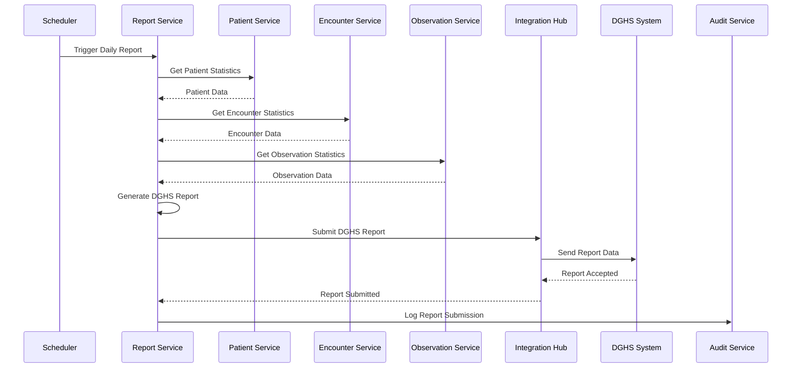

### Insurance Claims Processing Flow

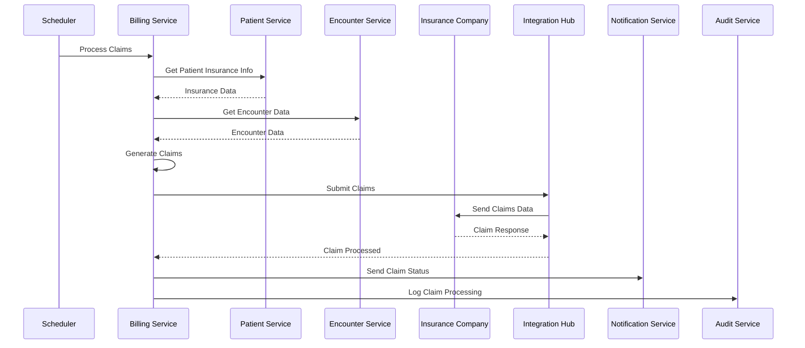

## 🌐 Bangladesh Integration Data Flows

### NID Verification Flow

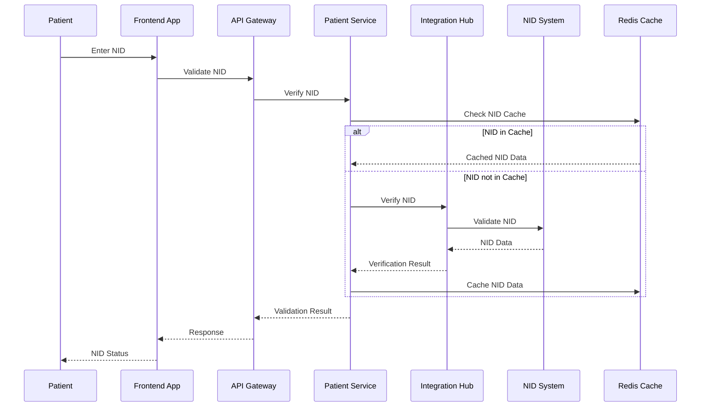

### BMDC Registration Verification Flow

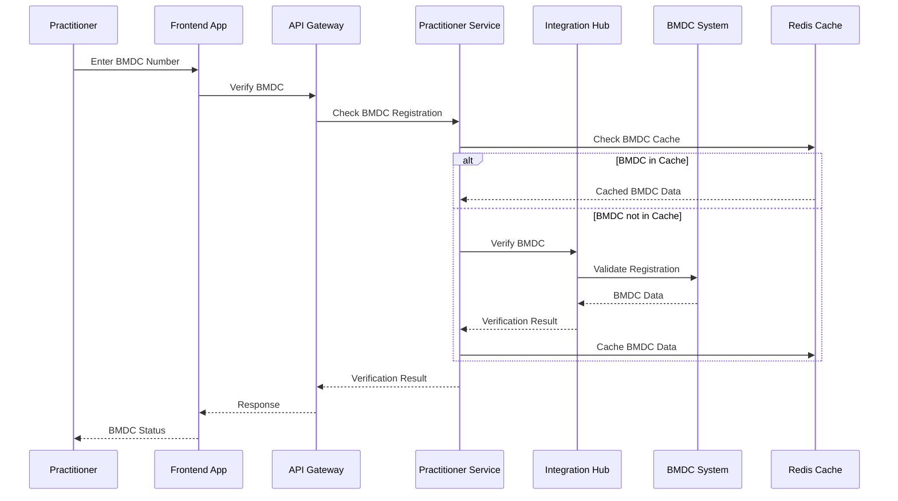

### DGHS Disease Reporting Flow

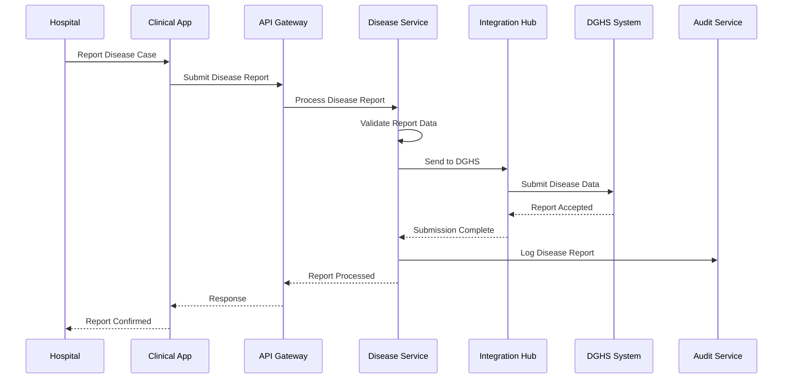

## 🔄 Event-Driven Data Flows

### Patient Event Stream

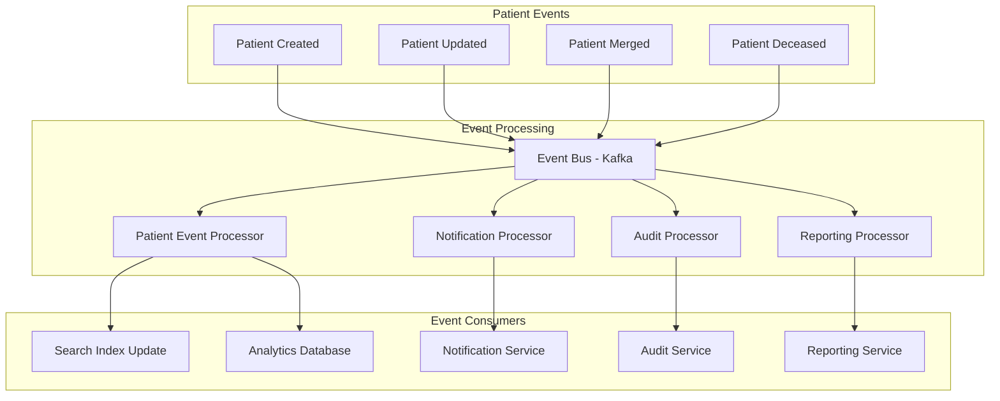

### Clinical Event Stream

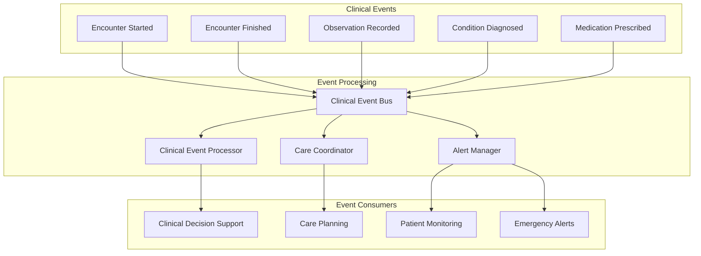

## 📈 Data Transformation Flows

### FHIR Data Transformation

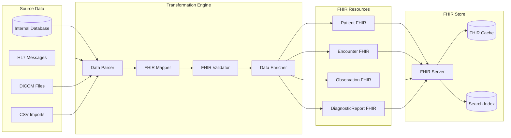

### Bangladesh Standards Transformation

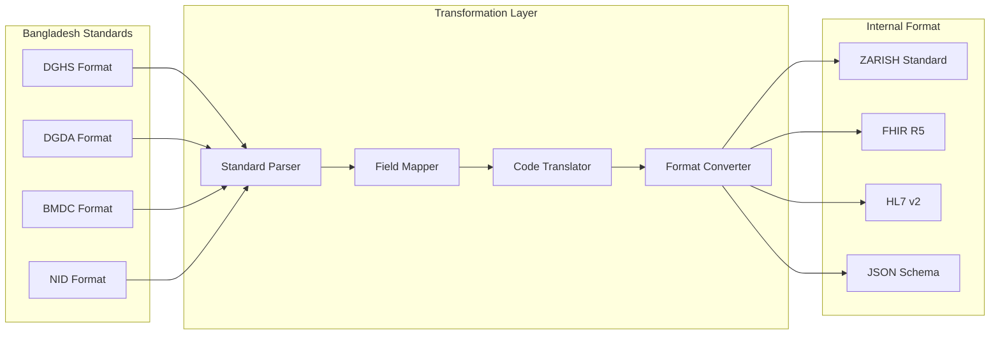

## 🔍 Data Quality Flows

### Data Validation Pipeline

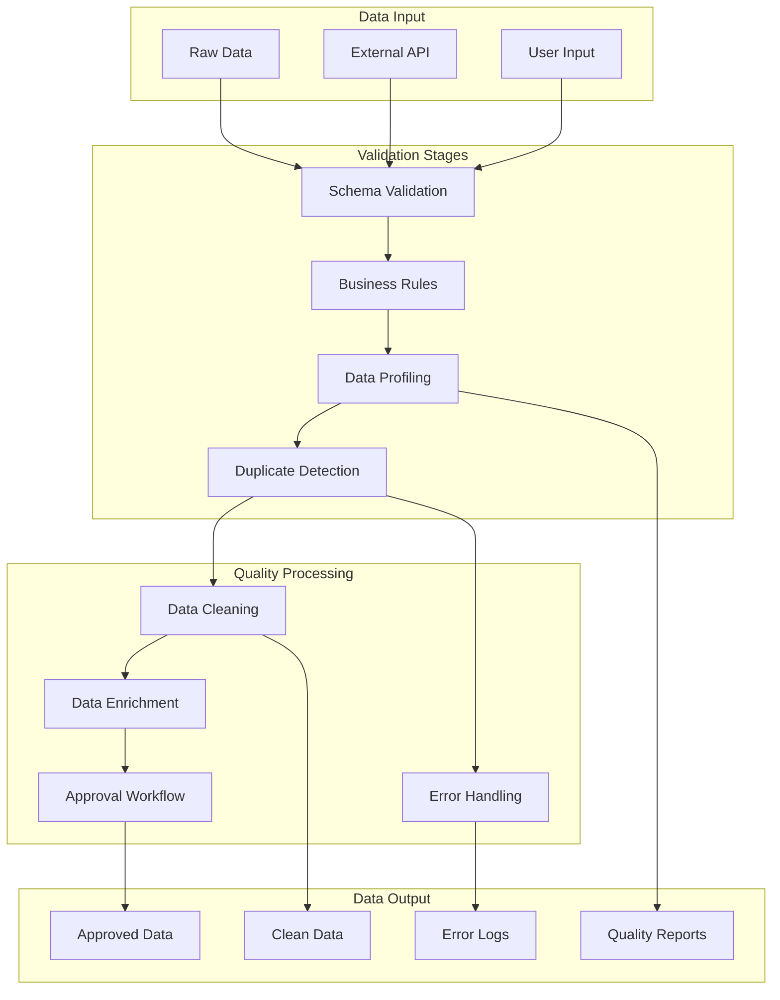

## 📊 Analytics Data Flows

### Real-Time Analytics Pipeline

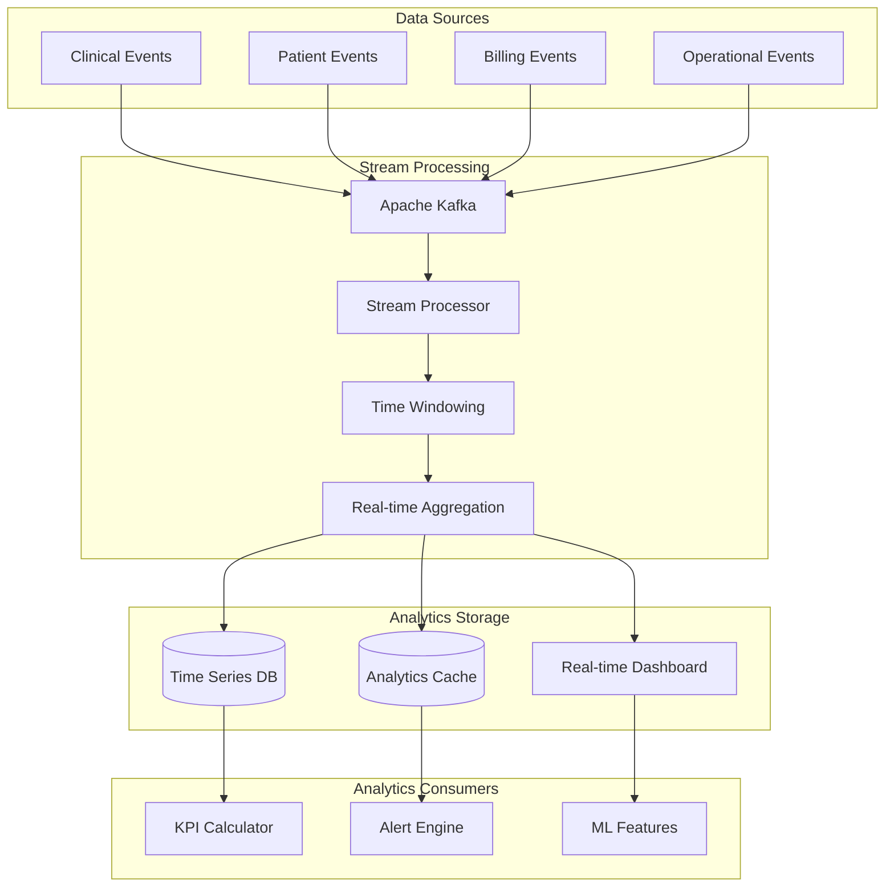

### Batch Analytics Pipeline

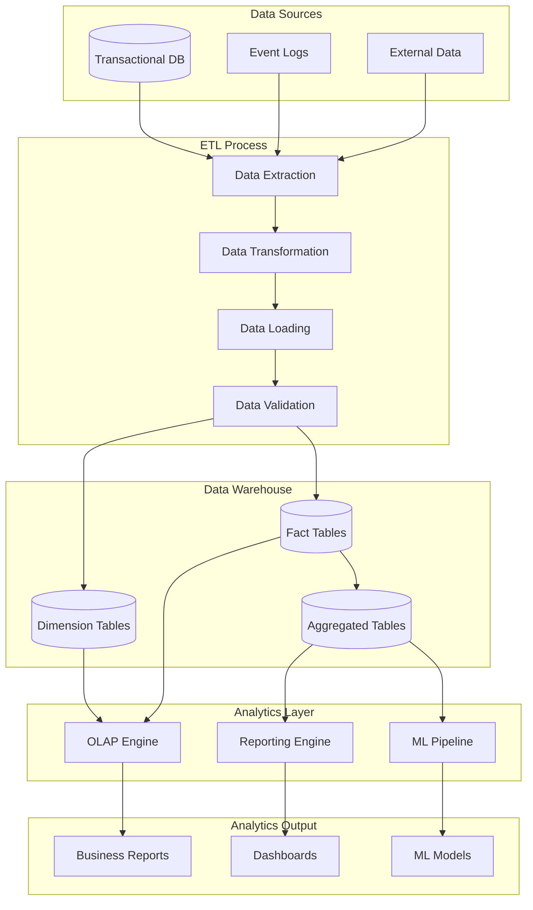

## 🔒 Security Data Flows

### Data Encryption Flow

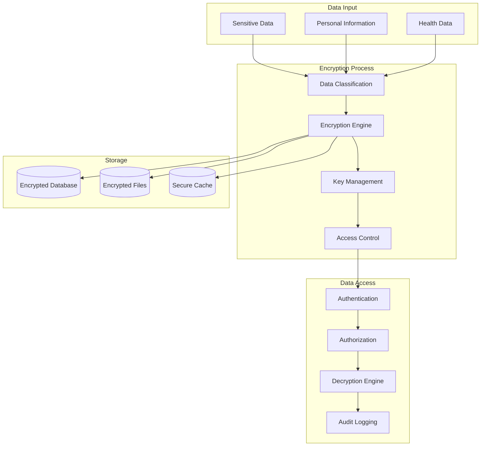

---

_Last updated: 2026-01-21_
