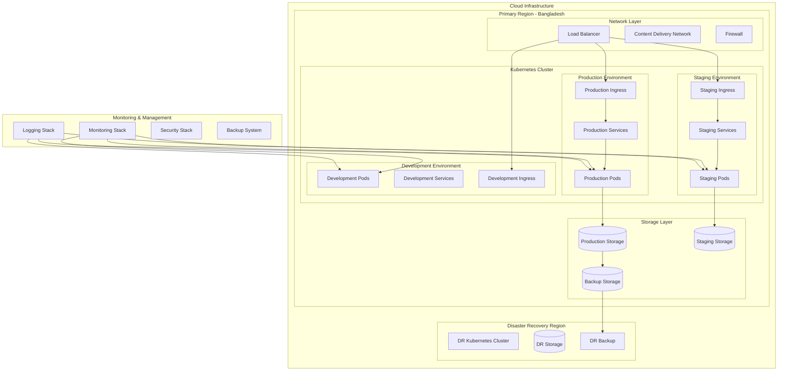
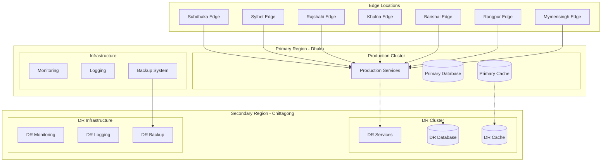

# Deployment Architecture

Comprehensive deployment architecture for ZARISH HIS, including Kubernetes orchestration, container management, CI/CD pipelines, and Bangladesh data center deployment strategies.

## 📋 Deployment Overview



## 🏗️ Kubernetes Architecture

### Cluster Configuration
```yaml
# cluster-config.yaml
apiVersion: v1
kind: ConfigMap
metadata:
  name: cluster-config
  namespace: kube-system
data:
  cluster.name: "zarish-his-prod"
  cluster.region: "bangladesh-south"
  cluster.version: "1.28"
  network.pod-cidr: "10.244.0.0/16"
  network.service-cidr: "10.96.0.0/12"
  storage.class: "fast-ssd"
  ingress.class: "nginx"
  monitoring.enabled: "true"
  logging.enabled: "true"
  backup.enabled: "true"
```

### Namespace Strategy
```yaml
# namespaces.yaml
apiVersion: v1
kind: Namespace
metadata:
  name: zarish-his-prod
  labels:
    environment: production
    project: zarish-his
    managed-by: zarish-team
---
apiVersion: v1
kind: Namespace
metadata:
  name: zarish-his-staging
  labels:
    environment: staging
    project: zarish-his
    managed-by: zarish-team
---
apiVersion: v1
kind: Namespace
metadata:
  name: zarish-his-dev
  labels:
    environment: development
    project: zarish-his
    managed-by: zarish-team
---
apiVersion: v1
kind: Namespace
metadata:
  name: zarish-his-monitoring
  labels:
    environment: infrastructure
    project: zarish-his
    managed-by: zarish-team
```

### Resource Quotas
```yaml
# resource-quotas.yaml
apiVersion: v1
kind: ResourceQuota
metadata:
  name: zarish-his-prod-quota
  namespace: zarish-his-prod
spec:
  hard:
    requests.cpu: "20"
    requests.memory: 40Gi
    limits.cpu: "40"
    limits.memory: 80Gi
    persistentvolumeclaims: "20"
    pods: "50"
    services: "30"
    secrets: "20"
    configmaps: "20"
---
apiVersion: v1
kind: ResourceQuota
metadata:
  name: zarish-his-staging-quota
  namespace: zarish-his-staging
spec:
  hard:
    requests.cpu: "10"
    requests.memory: 20Gi
    limits.cpu: "20"
    limits.memory: 40Gi
    persistentvolumeclaims: "10"
    pods: "25"
    services: "15"
    secrets: "10"
    configmaps: "10"
```

## 🚀 Service Deployment

### Microservice Deployment Template
```yaml
# service-deployment.yaml
apiVersion: apps/v1
kind: Deployment
metadata:
  name: {{ .Values.serviceName }}
  namespace: {{ .Values.namespace }}
  labels:
    app: {{ .Values.serviceName }}
    version: {{ .Values.version }}
    environment: {{ .Values.environment }}
spec:
  replicas: {{ .Values.replicas }}
  strategy:
    type: RollingUpdate
    rollingUpdate:
      maxSurge: 1
      maxUnavailable: 0
  selector:
    matchLabels:
      app: {{ .Values.serviceName }}
  template:
    metadata:
      labels:
        app: {{ .Values.serviceName }}
        version: {{ .Values.version }}
        environment: {{ .Values.environment }}
      annotations:
        prometheus.io/scrape: "true"
        prometheus.io/port: "{{ .Values.metricsPort }}"
        prometheus.io/path: "/metrics"
    spec:
      securityContext:
        runAsNonRoot: true
        runAsUser: 1000
        fsGroup: 2000
      containers:
      - name: {{ .Values.serviceName }}
        image: {{ .Values.image.repository }}:{{ .Values.image.tag }}
        imagePullPolicy: IfNotPresent
        ports:
        - name: http
          containerPort: {{ .Values.containerPort }}
          protocol: TCP
        - name: metrics
          containerPort: {{ .Values.metricsPort }}
          protocol: TCP
        env:
        - name: DATABASE_URL
          valueFrom:
            secretKeyRef:
              name: {{ .Values.serviceName }}-secrets
              key: database-url
        - name: REDIS_URL
          valueFrom:
            configMapKeyRef:
              name: {{ .Values.serviceName }}-config
              key: redis-url
        - name: KAFKA_BROKERS
          valueFrom:
            configMapKeyRef:
              name: global-config
              key: kafka-brokers
        resources:
          requests:
            memory: "{{ .Values.resources.requests.memory }}"
            cpu: "{{ .Values.resources.requests.cpu }}"
          limits:
            memory: "{{ .Values.resources.limits.memory }}"
            cpu: "{{ .Values.resources.limits.cpu }}"
        livenessProbe:
          httpGet:
            path: /health
            port: http
          initialDelaySeconds: 30
          periodSeconds: 10
          timeoutSeconds: 5
          failureThreshold: 3
        readinessProbe:
          httpGet:
            path: /ready
            port: http
          initialDelaySeconds: 5
          periodSeconds: 5
          timeoutSeconds: 3
          failureThreshold: 3
        volumeMounts:
        - name: config-volume
          mountPath: /app/config
          readOnly: true
        - name: logs-volume
          mountPath: /app/logs
      volumes:
      - name: config-volume
        configMap:
          name: {{ .Values.serviceName }}-config
      - name: logs-volume
        emptyDir: {}
      imagePullSecrets:
      - name: registry-secret
---
apiVersion: v1
kind: Service
metadata:
  name: {{ .Values.serviceName }}
  namespace: {{ .Values.environment }}
  labels:
    app: {{ .Values.serviceName }}
    environment: {{ .Values.environment }}
spec:
  type: ClusterIP
  ports:
  - name: http
    port: 80
    targetPort: http
    protocol: TCP
  - name: metrics
    port: {{ .Values.metricsPort }}
    targetPort: metrics
    protocol: TCP
  selector:
    app: {{ .Values.serviceName }}
```

### Helm Chart Values
```yaml
# values.yaml
global:
  imageRegistry: registry.zs-his.com
  imagePullSecrets:
    - name: registry-secret
  environment: production
  namespace: zarish-his-prod
  
service:
  serviceName: patient-registry
  version: "1.0.0"
  replicas: 3
  
  image:
    repository: patient-registry
    tag: "1.0.0"
    
  containerPort: 8080
  metricsPort: 9090
  
  resources:
    requests:
      memory: "256Mi"
      cpu: "250m"
    limits:
      memory: "512Mi"
      cpu: "500m"
      
  autoscaling:
    enabled: true
    minReplicas: 3
    maxReplicas: 10
    targetCPUUtilizationPercentage: 70
    targetMemoryUtilizationPercentage: 80
    
  ingress:
    enabled: true
    className: nginx
    annotations:
      cert-manager.io/cluster-issuer: letsencrypt-prod
      nginx.ingress.kubernetes.io/rate-limit: "100"
      nginx.ingress.kubernetes.io/rate-limit-window: "1m"
    hosts:
      - host: patient-api.zarishsphere.com
        paths:
          - path: /
            pathType: Prefix
    tls:
      - secretName: patient-api-tls
        hosts:
          - patient-api.zarishsphere.com
          
  database:
    host: postgres-cluster.zs-his.svc.cluster.local
    port: 5432
    name: patient_registry
    sslMode: require
    
  redis:
    host: redis-cluster.zs-his.svc.cluster.local
    port: 6379
    db: 0
    
  kafka:
    brokers:
      - kafka-1.zs-his.svc.cluster.local:9092
      - kafka-2.zs-his.svc.cluster.local:9092
      - kafka-3.zs-his.svc.cluster.local:9092
```

## 🔄 CI/CD Pipeline

### GitLab CI Configuration
```yaml
# .gitlab-ci.yml
stages:
  - validate
  - test
  - build
  - security
  - deploy-staging
  - integration-test
  - deploy-production

variables:
  DOCKER_REGISTRY: registry.zs-his.com
  KUBERNETES_NAMESPACE_STAGING: zarish-his-staging
  KUBERNETES_NAMESPACE_PROD: zarish-his-prod

# Validate stage
validate:code:
  stage: validate
  image: golang:1.21-alpine
  script:
    - go mod download
    - go fmt ./...
    - go vet ./...
    - golangci-lint run
  only:
    - merge_requests
    - main
    - develop

validate:helm:
  stage: validate
  image: alpine/helm:3.12
  script:
    - helm lint helm/zarish-his
    - helm template helm/zarish-his --values helm/values-prod.yaml
  only:
    - merge_requests
    - main
    - develop

# Test stage
test:unit:
  stage: test
  image: golang:1.21-alpine
  services:
    - postgres:15
    - redis:7
  variables:
    POSTGRES_DB: test_db
    POSTGRES_USER: test_user
    POSTGRES_PASSWORD: test_pass
    REDIS_URL: redis://redis:6379
  script:
    - go mod download
    - go test -v -race -coverprofile=coverage.out ./...
    - go tool cover -html=coverage.out -o coverage.html
  coverage: '/coverage: (\d+\.\d+)% of statements/'
  artifacts:
    reports:
      coverage_report:
        coverage_format: cobertura
        path: coverage.xml
    paths:
      - coverage.html

# Build stage
build:docker:
  stage: build
  image: docker:24.0.5
  services:
    - docker:24.0.5-dind
  variables:
    DOCKER_TLS_CERTDIR: "/certs"
  before_script:
    - echo $CI_REGISTRY_PASSWORD | docker login -u $CI_REGISTRY_USER --password-stdin $CI_REGISTRY
  script:
    - docker build -t $DOCKER_REGISTRY/$CI_PROJECT_NAME:$CI_COMMIT_SHA .
    - docker push $DOCKER_REGISTRY/$CI_PROJECT_NAME:$CI_COMMIT_SHA
    - docker tag $DOCKER_REGISTRY/$CI_PROJECT_NAME:$CI_COMMIT_SHA $DOCKER_REGISTRY/$CI_PROJECT_NAME:latest
    - docker push $DOCKER_REGISTRY/$CI_PROJECT_NAME:latest
  only:
    - main
    - develop

# Security stage
security:scan:
  stage: security
  image: aquasec/trivy:latest
  script:
    - trivy image --exit-code 0 --severity HIGH,CRITICAL $DOCKER_REGISTRY/$CI_PROJECT_NAME:$CI_COMMIT_SHA
  only:
    - main
    - develop

# Deploy to staging
deploy:staging:
  stage: deploy-staging
  image: bitnami/kubectl:latest
  script:
    - kubectl config use-context $KUBE_CONTEXT_STAGING
    - helm upgrade --install zarish-his-staging helm/zarish-his 
      --namespace $KUBERNETES_NAMESPACE_STAGING
      --values helm/values-staging.yaml
      --set image.tag=$CI_COMMIT_SHA
      --wait
      --timeout=10m
  environment:
    name: staging
    url: https://staging-api.zarishsphere.com
  only:
    - develop

# Integration tests
test:integration:
  stage: integration-test
  image: golang:1.21-alpine
  script:
    - go mod download
    - go test -v -tags=integration ./tests/integration/...
  dependencies:
    - deploy:staging
  only:
    - develop

# Deploy to production
deploy:production:
  stage: deploy-production
  image: bitnami/kubectl:latest
  script:
    - kubectl config use-context $KUBE_CONTEXT_PROD
    - helm upgrade --install zarish-his-prod helm/zarish-his 
      --namespace $KUBERNETES_NAMESPACE_PROD
      --values helm/values-prod.yaml
      --set image.tag=$CI_COMMIT_SHA
      --wait
      --timeout=15m
  environment:
    name: production
    url: https://api.zarishsphere.com
  when: manual
  only:
    - main
```

### GitHub Actions Workflow
```yaml
# .github/workflows/deploy.yml
name: Deploy to Kubernetes

on:
  push:
    branches: [ main, develop ]
  pull_request:
    branches: [ main ]

env:
  REGISTRY: registry.zs-his.com
  IMAGE_NAME: ${{ github.repository }}

jobs:
  test:
    runs-on: ubuntu-latest
    services:
      postgres:
        image: postgres:15
        env:
          POSTGRES_PASSWORD: postgres
          POSTGRES_DB: test_db
        options: >-
          --health-cmd pg_isready
          --health-interval 10s
          --health-timeout 5s
          --health-retries 5
      redis:
        image: redis:7
        options: >-
          --health-cmd "redis-cli ping"
          --health-interval 10s
          --health-timeout 5s
          --health-retries 5

    steps:
    - uses: actions/checkout@v3
    
    - name: Set up Go
      uses: actions/setup-go@v3
      with:
        go-version: '1.21'
    
    - name: Cache Go modules
      uses: actions/cache@v3
      with:
        path: ~/go/pkg/mod
        key: ${{ runner.os }}-go-${{ hashFiles('**/go.sum') }}
        restore-keys: |
          ${{ runner.os }}-go-
    
    - name: Install dependencies
      run: go mod download
    
    - name: Run tests
      run: |
        go test -v -race -coverprofile=coverage.out ./...
        go tool cover -html=coverage.out -o coverage.html
    
    - name: Upload coverage
      uses: codecov/codecov-action@v3
      with:
        file: ./coverage.out

  build:
    needs: test
    runs-on: ubuntu-latest
    if: github.ref == 'refs/heads/main' || github.ref == 'refs/heads/develop'
    
    steps:
    - uses: actions/checkout@v3
    
    - name: Log in to Docker Hub
      uses: docker/login-action@v2
      with:
        registry: ${{ env.REGISTRY }}
        username: ${{ secrets.DOCKER_USERNAME }}
        password: ${{ secrets.DOCKER_PASSWORD }}
    
    - name: Extract metadata
      id: meta
      uses: docker/metadata-action@v4
      with:
        images: ${{ env.REGISTRY }}/${{ env.IMAGE_NAME }}
        tags: |
          type=ref,event=branch
          type=ref,event=pr
          type=sha,prefix={{branch}}-
    
    - name: Build and push Docker image
      uses: docker/build-push-action@v4
      with:
        context: .
        push: true
        tags: ${{ steps.meta.outputs.tags }}
        labels: ${{ steps.meta.outputs.labels }}

  deploy-staging:
    needs: build
    runs-on: ubuntu-latest
    if: github.ref == 'refs/heads/develop'
    environment: staging
    
    steps:
    - uses: actions/checkout@v3
    
    - name: Configure kubectl
      uses: azure/k8s-set-context@v1
      with:
        method: kubeconfig
        kubeconfig: ${{ secrets.KUBE_CONFIG_STAGING }}
    
    - name: Deploy to staging
      run: |
        helm upgrade --install zarish-his-staging ./helm/zarish-his \
          --namespace zarish-his-staging \
          --create-namespace \
          --set image.tag=${{ github.sha }} \
          --values ./helm/values-staging.yaml

  deploy-production:
    needs: build
    runs-on: ubuntu-latest
    if: github.ref == 'refs/heads/main'
    environment: production
    
    steps:
    - uses: actions/checkout@v3
    
    - name: Configure kubectl
      uses: azure/k8s-set-context@v1
      with:
        method: kubeconfig
        kubeconfig: ${{ secrets.KUBE_CONFIG_PROD }}
    
    - name: Deploy to production
      run: |
        helm upgrade --install zarish-his-prod ./helm/zarish-his \
          --namespace zarish-his-prod \
          --create-namespace \
          --set image.tag=${{ github.sha }} \
          --values ./helm/values-prod.yaml
```

## 📊 Monitoring & Observability

### Prometheus Configuration
```yaml
# prometheus-config.yaml
apiVersion: v1
kind: ConfigMap
metadata:
  name: prometheus-config
  namespace: zarish-his-monitoring
data:
  prometheus.yml: |
    global:
      scrape_interval: 15s
      evaluation_interval: 15s
    
    rule_files:
      - "/etc/prometheus/rules/*.yml"
    
    alerting:
      alertmanagers:
        - static_configs:
            - targets:
              - alertmanager:9093
    
    scrape_configs:
      - job_name: 'kubernetes-apiservers'
        kubernetes_sd_configs:
        - role: endpoints
        scheme: https
        tls_config:
          ca_file: /var/run/secrets/kubernetes.io/serviceaccount/ca.crt
        bearer_token_file: /var/run/secrets/kubernetes.io/serviceaccount/token
        relabel_configs:
        - source_labels: [__meta_kubernetes_namespace, __meta_kubernetes_service_name, __meta_kubernetes_endpoint_port_name]
          action: keep
          regex: default;kubernetes;https
      
      - job_name: 'kubernetes-nodes'
        kubernetes_sd_configs:
        - role: node
        relabel_configs:
        - action: labelmap
          regex: __meta_kubernetes_node_label_(.+)
        - target_label: __address__
          replacement: kubernetes.default.svc:443
        - source_labels: [__meta_kubernetes_node_name]
          regex: (.+)
          target_label: __metrics_path__
          replacement: /api/v1/nodes/${1}/proxy/metrics
      
      - job_name: 'kubernetes-pods'
        kubernetes_sd_configs:
        - role: pod
        relabel_configs:
        - source_labels: [__meta_kubernetes_pod_annotation_prometheus_io_scrape]
          action: keep
          regex: true
        - source_labels: [__meta_kubernetes_pod_annotation_prometheus_io_path]
          action: replace
          target_label: __metrics_path__
          regex: (.+)
        - source_labels: [__address__, __meta_kubernetes_pod_annotation_prometheus_io_port]
          action: replace
          regex: ([^:]+)(?::\d+)?;(\d+)
          replacement: $1:$2
          target_label: __address__
        - action: labelmap
          regex: __meta_kubernetes_pod_label_(.+)
        - source_labels: [__meta_kubernetes_namespace]
          action: replace
          target_label: kubernetes_namespace
        - source_labels: [__meta_kubernetes_pod_name]
          action: replace
          target_label: kubernetes_pod_name
```

### Grafana Dashboard Configuration
```yaml
# grafana-dashboard.yaml
apiVersion: v1
kind: ConfigMap
metadata:
  name: grafana-dashboards
  namespace: zarish-his-monitoring
  labels:
    grafana_dashboard: "1"
data:
  zarish-his-overview.json: |
    {
      "dashboard": {
        "id": null,
        "title": "ZARISH HIS Overview",
        "tags": ["zarish-his", "overview"],
        "timezone": "Asia/Dhaka",
        "panels": [
          {
            "title": "Request Rate",
            "type": "graph",
            "targets": [
              {
                "expr": "sum(rate(http_requests_total[5m])) by (service)",
                "legendFormat": "{{service}}"
              }
            ],
            "yAxes": [
              {
                "label": "Requests/sec"
              }
            ]
          },
          {
            "title": "Error Rate",
            "type": "graph",
            "targets": [
              {
                "expr": "sum(rate(http_requests_total{status=~\"5..\"}[5m])) by (service) / sum(rate(http_requests_total[5m])) by (service)",
                "legendFormat": "{{service}}"
              }
            ],
            "yAxes": [
              {
                "label": "Error Rate",
                "max": 1,
                "min": 0
              }
            ]
          },
          {
            "title": "Response Time",
            "type": "graph",
            "targets": [
              {
                "expr": "histogram_quantile(0.95, sum(rate(http_request_duration_seconds_bucket[5m])) by (le, service))",
                "legendFormat": "95th percentile - {{service}}"
              },
              {
                "expr": "histogram_quantile(0.50, sum(rate(http_request_duration_seconds_bucket[5m])) by (le, service))",
                "legendFormat": "50th percentile - {{service}}"
              }
            ],
            "yAxes": [
              {
                "label": "Response Time (s)"
              }
            ]
          }
        ],
        "time": {
          "from": "now-1h",
          "to": "now"
        },
        "refresh": "30s"
      }
    }
```

## 🔒 Security Configuration

### Network Policies
```yaml
# network-policy.yaml
apiVersion: networking.k8s.io/v1
kind: NetworkPolicy
metadata:
  name: zarish-his-network-policy
  namespace: zarish-his-prod
spec:
  podSelector: {}
  policyTypes:
  - Ingress
  - Egress
  ingress:
  - from:
    - namespaceSelector:
        matchLabels:
          name: zarish-his-prod
    - namespaceSelector:
        matchLabels:
          name: ingress-nginx
    ports:
    - protocol: TCP
      port: 8080
    - protocol: TCP
      port: 9090
  egress:
  - to:
    - namespaceSelector:
        matchLabels:
          name: zarish-his-prod
    - namespaceSelector:
        matchLabels:
          name: kube-system
    ports:
    - protocol: TCP
      port: 53
    - protocol: UDP
      port: 53
    - protocol: TCP
      port: 443
    - protocol: TCP
      port: 5432
    - protocol: TCP
      port: 6379
    - protocol: TCP
      port: 9092
```

### Pod Security Policy
```yaml
# pod-security-policy.yaml
apiVersion: policy/v1beta1
kind: PodSecurityPolicy
metadata:
  name: zarish-his-psp
spec:
  privileged: false
  allowPrivilegeEscalation: false
  requiredDropCapabilities:
    - ALL
  volumes:
    - 'configMap'
    - 'emptyDir'
    - 'projected'
    - 'secret'
    - 'downwardAPI'
    - 'persistentVolumeClaim'
  runAsUser:
    rule: 'MustRunAsNonRoot'
  seLinux:
    rule: 'RunAsAny'
  fsGroup:
    rule: 'RunAsAny'
  readOnlyRootFilesystem: false
```

## 💾 Storage Configuration

### Persistent Volume Claims
```yaml
# storage.yaml
apiVersion: v1
kind: PersistentVolumeClaim
metadata:
  name: postgres-pvc
  namespace: zarish-his-prod
spec:
  accessModes:
    - ReadWriteOnce
  storageClassName: fast-ssd
  resources:
    requests:
      storage: 100Gi
---
apiVersion: v1
kind: PersistentVolumeClaim
metadata:
  name: redis-pvc
  namespace: zarish-his-prod
spec:
  accessModes:
    - ReadWriteOnce
  storageClassName: fast-ssd
  resources:
    requests:
      storage: 10Gi
---
apiVersion: v1
kind: PersistentVolumeClaim
metadata:
  name: minio-pvc
  namespace: zarish-his-prod
spec:
  accessModes:
    - ReadWriteOnce
  storageClassName: standard
  resources:
    requests:
      storage: 1Ti
```

### Storage Classes
```yaml
# storage-classes.yaml
apiVersion: storage.k8s.io/v1
kind: StorageClass
metadata:
  name: fast-ssd
provisioner: kubernetes.io/aws-ebs
parameters:
  type: gp3
  iops: "3000"
  throughput: "125"
  fsType: ext4
allowVolumeExpansion: true
volumeBindingMode: WaitForFirstConsumer
---
apiVersion: storage.k8s.io/v1
kind: StorageClass
metadata:
  name: standard
provisioner: kubernetes.io/aws-ebs
parameters:
  type: gp2
  fsType: ext4
allowVolumeExpansion: true
volumeBindingMode: WaitForFirstConsumer
```

## 🌍 Bangladesh Data Center Strategy

### Multi-Region Deployment


### Disaster Recovery Plan
```yaml
# disaster-recovery.yaml
apiVersion: v1
kind: ConfigMap
metadata:
  name: disaster-recovery-plan
  namespace: zarish-his-prod
data:
  rto: "4 hours"  # Recovery Time Objective
  rpo: "1 hour"   # Recovery Point Objective
  backup-schedule: "0 2 * * *"  # Daily at 2 AM
  retention-policy: "30 days"
  dr-trigger-conditions: |
    - Primary region unavailable > 30 minutes
    - Database replication lag > 5 minutes
    - Error rate > 10% for 5 minutes
    - Manual trigger by operations team
  failover-procedure: |
    1. Verify DR cluster health
    2. Promote DR database to primary
    3. Update DNS to point to DR region
    4. Scale up DR services
    5. Verify application functionality
    6. Notify stakeholders
  failback-procedure: |
    1. Verify primary region recovery
    2. Sync data back to primary
    3. Update DNS to point to primary
    4. Scale down DR services
    5. Verify application functionality
    6. Notify stakeholders
```

---

*Last updated: 2026-01-21*
