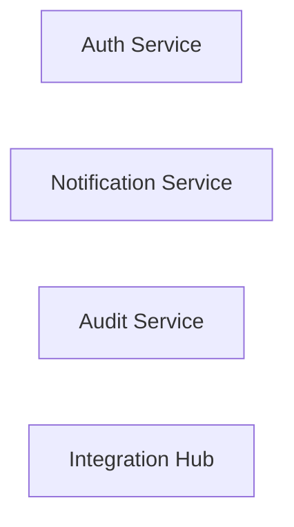
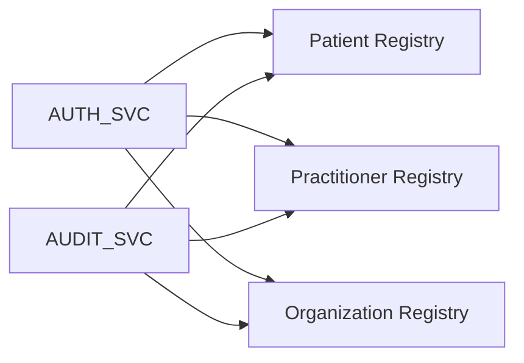
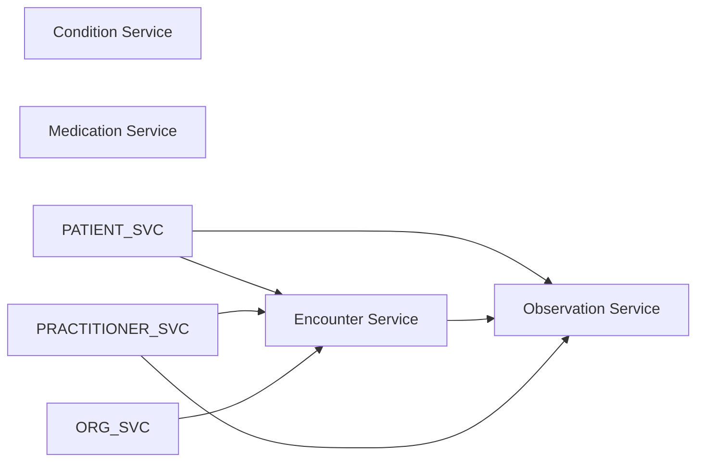
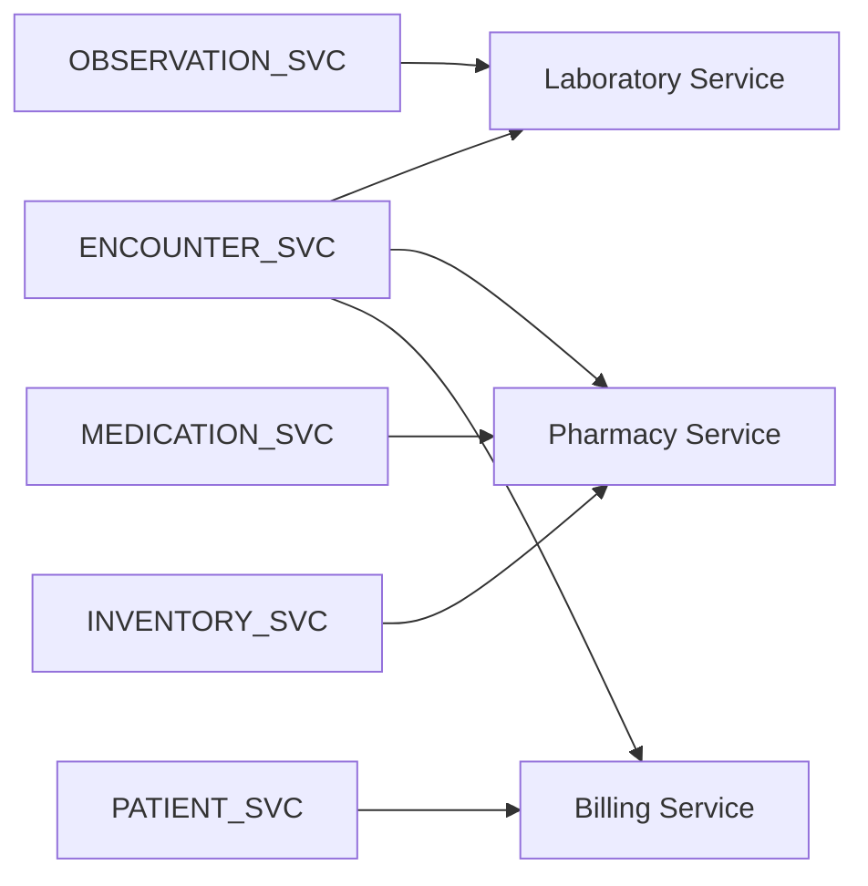
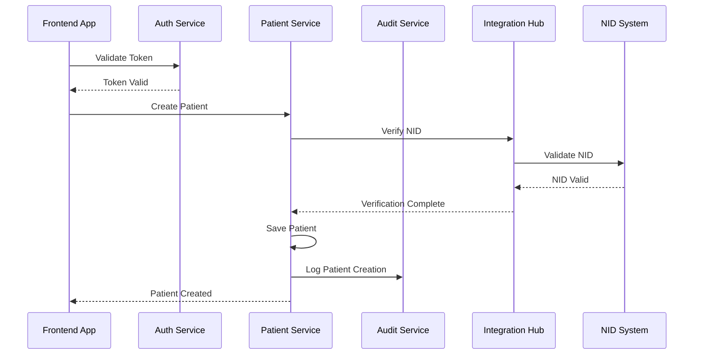
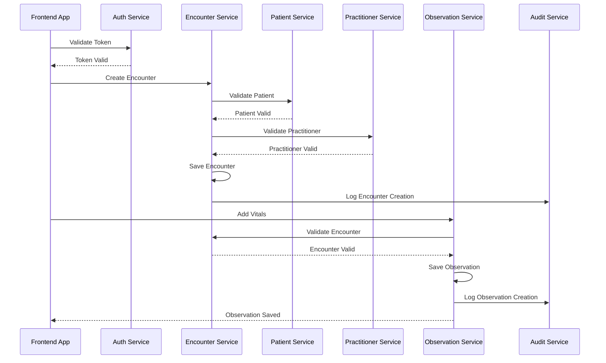
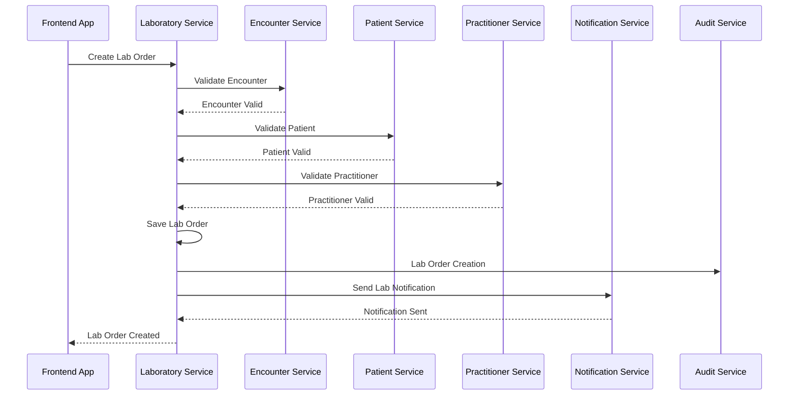
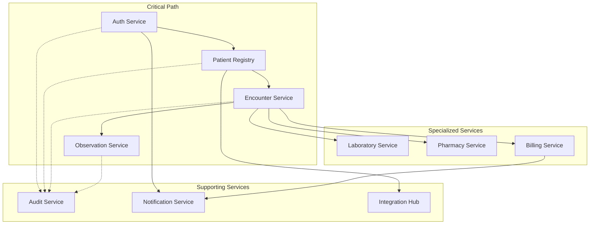
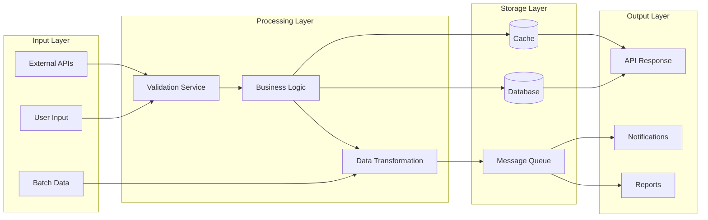

# Service Dependencies

Detailed dependency mapping and interaction patterns between all ZARISH HIS microservices, including communication protocols, data flows, and service orchestration.

## 📋 Dependency Overview

```mermaid
graph TB
    subgraph "External Dependencies"
        DGHS[DGHS Systems]
        DGDA[DGDA Portal]
        BMDC[BMDC Database]
        NID[NID Verification]
        SMS_GATEWAY[SMS Gateway]
        EMAIL_SERVICE[Email Service]
        PAYMENT_GATEWAY[Payment Gateway]
    end
    
    subgraph "Infrastructure Services"
        AUTH_SVC[Auth Service]
        NOTIFICATION_SVC[Notification Service]
        AUDIT_SVC[Audit Service]
        INTEGRATION_SVC[Integration Hub]
        REPORT_SVC[Report Service]
        WORKFLOW_SVC[Workflow Engine]
    end
    
    subgraph "Core Services"
        PATIENT_SVC[Patient Registry]
        PRACTITIONER_SVC[Practitioner Registry]
        ORG_SVC[Organization Registry]
        ENCOUNTER_SVC[Encounter Service]
    end
    
    subgraph "Clinical Services"
        OBSERVATION_SVC[Observation Service]
        CONDITION_SVC[Condition Service]
        MEDICATION_SVC[Medication Service]
        PROCEDURE_SVC[Procedure Service]
        IMMUNIZATION_SVC[Immunization Service]
        DIAGNOSTIC_SVC[Diagnostic Service]
    end
    
    subgraph "Ancillary Services"
        LAB_SVC[Laboratory Service]
        RADIOLOGY_SVC[Radiology Service]
        PHARMACY_SVC[Pharmacy Service]
        BLOOD_BANK_SVC[Blood Bank Service]
    end
    
    subgraph "Administrative Services"
        APPOINTMENT_SVC[Appointment Service]
        BILLING_SVC[Billing Service]
        INVENTORY_SVC[Inventory Service]
        BED_MGMT_SVC[Bed Management]
        QUEUE_SVC[Queue Service]
    end
    
    %% External Dependencies
    INTEGRATION_SVC --> DGHS
    INTEGRATION_SVC --> DGDA
    INTEGRATION_SVC --> BMDC
    INTEGRATION_SVC --> NID
    NOTIFICATION_SVC --> SMS_GATEWAY
    NOTIFICATION_SVC --> EMAIL_SERVICE
    BILLING_SVC --> PAYMENT_GATEWAY
    
    %% Infrastructure Dependencies
    AUTH_SVC -.-> PATIENT_SVC
    AUTH_SVC -.-> PRACTITIONER_SVC
    AUTH_SVC -.-> ORG_SVC
    AUTH_SVC -.-> ENCOUNTER_SVC
    AUTH_SVC -.-> OBSERVATION_SVC
    AUTH_SVC -.-> CONDITION_SVC
    AUTH_SVC -.-> MEDICATION_SVC
    AUTH_SVC -.-> PROCEDURE_SVC
    AUTH_SVC -.-> IMMUNIZATION_SVC
    AUTH_SVC -.-> DIAGNOSTIC_SVC
    AUTH_SVC -.-> LAB_SVC
    AUTH_SVC -.-> RADIOLOGY_SVC
    AUTH_SVC -.-> PHARMACY_SVC
    AUTH_SVC -.-> BLOOD_BANK_SVC
    AUTH_SVC -.-> APPOINTMENT_SVC
    AUTH_SVC -.-> BILLING_SVC
    AUTH_SVC -.-> INVENTORY_SVC
    AUTH_SVC -.-> BED_MGMT_SVC
    AUTH_SVC -.-> QUEUE_SVC
    
    NOTIFICATION_SVC -.-> APPOINTMENT_SVC
    NOTIFICATION_SVC -.-> BILLING_SVC
    NOTIFICATION_SVC -.-> LAB_SVC
    NOTIFICATION_SVC -.-> RADIOLOGY_SVC
    NOTIFICATION_SVC -.-> PHARMACY_SVC
    
    AUDIT_SVC -.-> PATIENT_SVC
    AUDIT_SVC -.-> PRACTITIONER_SVC
    AUDIT_SVC -.-> ORG_SVC
    AUDIT_SVC -.-> ENCOUNTER_SVC
    AUDIT_SVC -.-> OBSERVATION_SVC
    AUDIT_SVC -.-> CONDITION_SVC
    AUDIT_SVC -.-> MEDICATION_SVC
    AUDIT_SVC -.-> PROCEDURE_SVC
    AUDIT_SVC -.-> IMMUNIZATION_SVC
    AUDIT_SVC -.-> DIAGNOSTIC_SVC
    AUDIT_SVC -.-> LAB_SVC
    AUDIT_SVC -.-> RADIOLOGY_SVC
    AUDIT_SVC -.-> PHARMACY_SVC
    AUDIT_SVC -.-> BLOOD_BANK_SVC
    AUDIT_SVC -.-> APPOINTMENT_SVC
    AUDIT_SVC -.-> BILLING_SVC
    AUDIT_SVC -.-> INVENTORY_SVC
    AUDIT_SVC -.-> BED_MGMT_SVC
    AUDIT_SVC -.-> QUEUE_SVC
    
    %% Core Service Dependencies
    ENCOUNTER_SVC --> PATIENT_SVC
    ENCOUNTER_SVC --> PRACTITIONER_SVC
    ENCOUNTER_SVC --> ORG_SVC
    
    OBSERVATION_SVC --> PATIENT_SVC
    OBSERVATION_SVC --> ENCOUNTER_SVC
    OBSERVATION_SVC --> PRACTITIONER_SVC
    
    CONDITION_SVC --> PATIENT_SVC
    CONDITION_SVC --> ENCOUNTER_SVC
    CONDITION_SVC --> PRACTITIONER_SVC
    
    MEDICATION_SVC --> PATIENT_SVC
    MEDICATION_SVC --> ENCOUNTER_SVC
    MEDICATION_SVC --> PRACTITIONER_SVC
    MEDICATION_SVC --> PHARMACY_SVC
    
    PROCEDURE_SVC --> PATIENT_SVC
    PROCEDURE_SVC --> ENCOUNTER_SVC
    PROCEDURE_SVC --> PRACTITIONER_SVC
    
    IMMUNIZATION_SVC --> PATIENT_SVC
    IMMUNIZATION_SVC --> ENCOUNTER_SVC
    IMMUNIZATION_SVC --> PRACTITIONER_SVC
    
    DIAGNOSTIC_SVC --> PATIENT_SVC
    DIAGNOSTIC_SVC --> ENCOUNTER_SVC
    DIAGNOSTIC_SVC --> PRACTITIONER_SVC
    
    %% Ancillary Service Dependencies
    LAB_SVC --> PATIENT_SVC
    LAB_SVC --> ENCOUNTER_SVC
    LAB_SVC --> PRACTITIONER_SVC
    LAB_SVC --> DIAGNOSTIC_SVC
    
    RADIOLOGY_SVC --> PATIENT_SVC
    RADIOLOGY_SVC --> ENCOUNTER_SVC
    RADIOLOGY_SVC --> PRACTITIONER_SVC
    RADIOLOGY_SVC --> DIAGNOSTIC_SVC
    
    PHARMACY_SVC --> PATIENT_SVC
    PHARMACY_SVC --> ENCOUNTER_SVC
    PHARMACY_SVC --> PRACTITIONER_SVC
    PHARMACY_SVC --> MEDICATION_SVC
    PHARMACY_SVC --> INVENTORY_SVC
    
    BLOOD_BANK_SVC --> PATIENT_SVC
    BLOOD_BANK_SVC --> ENCOUNTER_SVC
    BLOOD_BANK_SVC --> PRACTITIONER_SVC
    
    %% Administrative Service Dependencies
    APPOINTMENT_SVC --> PATIENT_SVC
    APPOINTMENT_SVC --> PRACTITIONER_SVC
    APPOINTMENT_SVC --> ORG_SVC
    APPOINTMENT_SVC --> QUEUE_SVC
    
    BILLING_SVC --> PATIENT_SVC
    BILLING_SVC --> ENCOUNTER_SVC
    BILLING_SVC --> PRACTITIONER_SVC
    BILLING_SVC --> ORG_SVC
    
    INVENTORY_SVC --> ORG_SVC
    INVENTORY_SVC --> PHARMACY_SVC
    
    BED_MGMT_SVC --> PATIENT_SVC
    BED_MGMT_SVC --> ENCOUNTER_SVC
    BED_MGMT_SVC --> ORG_SVC
    
    QUEUE_SVC --> PATIENT_SVC
    QUEUE_SVC --> PRACTITIONER_SVC
    QUEUE_SVC --> ORG_SVC
    
    %% Report and Workflow Dependencies
    REPORT_SVC -.-> PATIENT_SVC
    REPORT_SVC -.-> PRACTITIONER_SVC
    REPORT_SVC -.-> ORG_SVC
    REPORT_SVC -.-> ENCOUNTER_SVC
    REPORT_SVC -.-> OBSERVATION_SVC
    REPORT_SVC -.-> CONDITION_SVC
    REPORT_SVC -.-> MEDICATION_SVC
    REPORT_SVC -.-> PROCEDURE_SVC
    REPORT_SVC -.-> IMMUNIZATION_SVC
    REPORT_SVC -.-> DIAGNOSTIC_SVC
    REPORT_SVC -.-> LAB_SVC
    REPORT_SVC -.-> RADIOLOGY_SVC
    REPORT_SVC -.-> PHARMACY_SVC
    REPORT_SVC -.-> BLOOD_BANK_SVC
    REPORT_SVC -.-> APPOINTMENT_SVC
    REPORT_SVC -.-> BILLING_SVC
    REPORT_SVC -.-> INVENTORY_SVC
    REPORT_SVC -.-> BED_MGMT_SVC
    REPORT_SVC -.-> QUEUE_SVC
    
    WORKFLOW_SVC -.-> PATIENT_SVC
    WORKFLOW_SVC -.-> PRACTITIONER_SVC
    WORKFLOW_SVC -.-> ORG_SVC
    WORKFLOW_SVC -.-> ENCOUNTER_SVC
    WORKFLOW_SVC -.-> APPOINTMENT_SVC
    WORKFLOW_SVC -.-> BILLING_SVC
    WORKFLOW_SVC -.-> LAB_SVC
    WORKFLOW_SVC -.-> RADIOLOGY_SVC
    WORKFLOW_SVC -.-> PHARMACY_SVC
```



## 🔗 Service Communication Patterns

### 1. **Synchronous Communication (REST/gRPC)**
- **User-Facing Operations**: Real-time API calls
- **Data Validation**: Immediate response required
- **Authentication**: Token validation and user session management
- **Configuration**: Service configuration and metadata

### 2. **Asynchronous Communication (Events)**
- **Audit Logging**: Non-blocking audit trail updates
- **Notifications**: Email, SMS, push notifications
- **Data Synchronization**: Cross-service data consistency
- **Reporting**: Batch data processing and analytics

### 3. **Data Access Patterns**
- **Direct Database Access**: Service-owned data
- **API Calls**: Cross-service data access
- **Event Streaming**: Real-time data updates
- **Caching**: Frequently accessed data

## 📊 Critical Dependencies

### Level 1: Core Infrastructure (No Dependencies)


### Level 2: Core Services (Depend on Level 1)


### Level 3: Clinical Services (Depend on Level 1 & 2)


### Level 4: Specialized Services (Depend on all previous levels)


## 🔄 Data Flow Dependencies

### Patient Registration Flow


### Clinical Encounter Flow


### Laboratory Order Flow


## 🔧 Service Configuration Dependencies

### Shared Configuration
```yaml
# Common configuration shared across services
shared:
  database:
    host: postgres-cluster.zs-his.svc.cluster.local
    port: 5432
    ssl_mode: require
  
  redis:
    host: redis-cluster.zs-his.svc.cluster.local
    port: 6379
    db: 0
  
  kafka:
    brokers:
      - kafka-1.zs-his.svc.cluster.local:9092
      - kafka-2.zs-his.svc.cluster.local:9092
      - kafka-3.zs-his.svc.cluster.local:9092
  
  auth:
    service_url: http://auth-service.zs-his.svc.cluster.local:8080
    jwt_secret: ${JWT_SECRET}
  
  audit:
    service_url: http://audit-service.zs-his.svc.cluster.local:8080
  
  notification:
    service_url: http://notification-service.zs-his.svc.cluster.local:8080
```

### Service-Specific Configuration
```yaml
# Patient Service Configuration
patient_service:
  database:
    name: patient_registry
    migrations: ./migrations/patient
  
  integration:
    nid_service_url: https://nid.gov.bd/api/verify
    bmdc_service_url: https://bmdc.org.bd/api/verify
  
  validation:
    national_id_required: true
    phone_number_required: true
    address_required: true

# Laboratory Service Configuration
laboratory_service:
  database:
    name: laboratory_service
    migrations: ./migrations/laboratory
  
  external_labs:
    - name: "Popular Diagnostics"
      api_url: https://api.popular.com.bd
      api_key: ${POPULAR_API_KEY}
    - name: "LabAid"
      api_url: https://api.labaid.com.bd
      api_key: ${LABAID_API_KEY}
  
  reporting:
    dghs_endpoint: https://dghs.gov.bd/api/lab-reports
```

## 🚨 Dependency Failure Handling

### Circuit Breaker Pattern
```go
type CircuitBreaker struct {
    maxFailures   int
    resetTimeout  time.Duration
    failures      int
    lastFailTime  time.Time
    state         CircuitState
    mutex         sync.RWMutex
}

type CircuitState int

const (
    Closed CircuitState = iota
    Open
    HalfOpen
)

func (cb *CircuitBreaker) Call(service Service, request Request) (Response, error) {
    cb.mutex.Lock()
    defer cb.mutex.Unlock()
    
    if cb.state == Open {
        if time.Since(cb.lastFailTime) > cb.resetTimeout {
            cb.state = HalfOpen
        } else {
            return nil, errors.New("circuit breaker is open")
        }
    }
    
    response, err := service.Call(request)
    if err != nil {
        cb.failures++
        cb.lastFailTime = time.Now()
        
        if cb.failures >= cb.maxFailures {
            cb.state = Open
        }
        return nil, err
    }
    
    cb.failures = 0
    cb.state = Closed
    return response, nil
}
```

### Retry Pattern
```go
type RetryConfig struct {
    MaxRetries    int
    InitialDelay  time.Duration
    MaxDelay      time.Duration
    BackoffFactor float64
}

func RetryWithBackoff(fn func() error, config RetryConfig) error {
    var lastErr error
    
    for i := 0; i <= config.MaxRetries; i++ {
        err := fn()
        if err == nil {
            return nil
        }
        
        lastErr = err
        
        if i < config.MaxRetries {
            delay := time.Duration(float64(config.InitialDelay) * math.Pow(config.BackoffFactor, float64(i)))
            if delay > config.MaxDelay {
                delay = config.MaxDelay
            }
            
            time.Sleep(delay)
        }
    }
    
    return lastErr
}
```

## 📈 Performance Dependencies

### Service Performance Metrics
```go
type ServiceMetrics struct {
    ServiceName         string    `json:"service_name"`
    RequestCount        int64     `json:"request_count"`
    ErrorCount          int64     `json:"error_count"`
    AverageResponseTime float64   `json:"average_response_time_ms"`
    P95ResponseTime     float64   `json:"p95_response_time_ms"`
    P99ResponseTime     float64   `json:"p99_response_time_ms"`
    ThroughputPerSecond float64   `json:"throughput_per_second"`
    UptimePercentage   float64   `json:"uptime_percentage"`
    LastUpdated        time.Time `json:"last_updated"`
}

type DependencyMetrics struct {
    ServiceName         string    `json:"service_name"`
    DependencyName     string    `json:"dependency_name"`
    RequestCount        int64     `json:"request_count"`
    ErrorCount          int64     `json:"error_count"`
    AverageResponseTime float64   `json:"average_response_time_ms"`
    CircuitBreakerState string   `json:"circuit_breaker_state"`
    LastUpdated        time.Time `json:"last_updated"`
}
```

### Dependency Health Monitoring
```go
type HealthChecker struct {
    dependencies map[string]Dependency
    httpClient   *http.Client
    timeout      time.Duration
}

type Dependency struct {
    Name     string
    URL      string
    Method   string
    Headers  map[string]string
    Expected int
}

func (hc *HealthChecker) CheckDependencyHealth() map[string]HealthStatus {
    results := make(map[string]HealthStatus)
    
    for name, dep := range hc.dependencies {
        status := hc.checkSingleDependency(dep)
        results[name] = status
    }
    
    return results
}

func (hc *HealthChecker) checkSingleDependency(dep Dependency) HealthStatus {
    req, err := http.NewRequest(dep.Method, dep.URL, nil)
    if err != nil {
        return HealthStatus{
            Status:    "unhealthy",
            Error:     err.Error(),
            Timestamp: time.Now(),
        }
    }
    
    for key, value := range dep.Headers {
        req.Header.Set(key, value)
    }
    
    ctx, cancel := context.WithTimeout(context.Background(), hc.timeout)
    defer cancel()
    
    req = req.WithContext(ctx)
    
    resp, err := hc.httpClient.Do(req)
    if err != nil {
        return HealthStatus{
            Status:    "unhealthy",
            Error:     err.Error(),
            Timestamp: time.Now(),
        }
    }
    defer resp.Body.Close()
    
    if resp.StatusCode == dep.Expected {
        return HealthStatus{
            Status:    "healthy",
            Timestamp: time.Now(),
        }
    }
    
    return HealthStatus{
        Status:    "unhealthy",
        Error:     fmt.Sprintf("unexpected status code: %d", resp.StatusCode),
        Timestamp: time.Now(),
    }
}
```

## 🔍 Dependency Visualization

### Service Dependency Graph


### Data Flow Dependencies


---

*Last updated: 2026-01-21*
