# System Architecture Overview

Comprehensive architectural overview of the ZARISH Health Information System, including microservices architecture, data flows, deployment patterns, and Bangladesh healthcare integration.

## 🏗️ High-Level Architecture

```mermaid
graph TB
    subgraph "External Systems"
        DGHS[DGHS Systems]
        DGDA[DGDA Portal]
        BMDC[BMDC Database]
        NID[NID Verification]
        INSURANCE[Insurance Companies]
        BANKS[Banking Systems]
    end
    
    subgraph "Frontend Layer"
        subgraph "Web Applications"
            ADMIN[ESM Admin]
            PATIENT[ESM Patient Management]
            CLINICAL[ESM Clinical]
            PHARMACY[ESM Pharmacy]
            LAB[ESM Laboratory]
            RADIOLOGY[ESM Radiology]
            BILLING[ESM Billing]
            REPORTS[ESM Reports]
        end
        
        subgraph "Mobile Applications"
            MOBILE[ESM Mobile]
            PATIENT_APP[Patient Mobile App]
        end
    end
    
    subgraph "API Gateway"
        GATEWAY[API Gateway]
        LB[Load Balancer]
        AUTH[Authentication]
    end
    
    subgraph "Microservices Layer"
        subgraph "Core Services"
            PATIENT_SVC[Patient Registry]
            PRACTITIONER_SVC[Practitioner Registry]
            ORG_SVC[Organization Registry]
            ENCOUNTER_SVC[Encounter Service]
        end
        
        subgraph "Clinical Services"
            OBSERVATION_SVC[Observation Service]
            CONDITION_SVC[Condition Service]
            MEDICATION_SVC[Medication Service]
            PROCEDURE_SVC[Procedure Service]
            IMMUNIZATION_SVC[Immunization Service]
            DIAGNOSTIC_SVC[Diagnostic Service]
        end
        
        subgraph "Ancillary Services"
            LAB_SVC[Laboratory Service]
            RADIOLOGY_SVC[Radiology Service]
            PHARMACY_SVC[Pharmacy Service]
            BLOOD_BANK_SVC[Blood Bank Service]
        end
        
        subgraph "Administrative Services"
            APPOINTMENT_SVC[Appointment Service]
            BILLING_SVC[Billing Service]
            INVENTORY_SVC[Inventory Service]
            BED_MGMT_SVC[Bed Management]
            QUEUE_SVC[Queue Service]
        end
        
        subgraph "Infrastructure Services"
            AUTH_SVC[Auth Service]
            NOTIFICATION_SVC[Notification Service]
            AUDIT_SVC[Audit Service]
            INTEGRATION_SVC[Integration Hub]
            REPORT_SVC[Report Service]
            WORKFLOW_SVC[Workflow Engine]
        end
    end
    
    subgraph "Data Layer"
        POSTGRES[(PostgreSQL Cluster)]
        REDIS[(Redis Cluster)]
        KAFKA[Apache Kafka]
        MINIO[(MinIO Storage)]
        ELASTICSEARCH[(Elasticsearch)]
    end
    
    subgraph "Infrastructure"
        K8S[Kubernetes Cluster]
        DOCKER[Docker Registry]
        MONITORING[Monitoring Stack]
        LOGGING[Logging Stack]
    end
    
    DGHS --> INTEGRATION_SVC
    DGDA --> INTEGRATION_SVC
    BMDC --> INTEGRATION_SVC
    NID --> INTEGRATION_SVC
    INSURANCE --> BILLING_SVC
    BANKS --> BILLING_SVC
    
    ADMIN --> GATEWAY
    PATIENT --> GATEWAY
    CLINICAL --> GATEWAY
    PHARMACY --> GATEWAY
    LAB --> GATEWAY
    RADIOLOGY --> GATEWAY
    BILLING --> GATEWAY
    REPORTS --> GATEWAY
    MOBILE --> GATEWAY
    PATIENT_APP --> GATEWAY
    
    GATEWAY --> LB
    LB --> AUTH
    AUTH --> PATIENT_SVC
    AUTH --> PRACTITIONER_SVC
    AUTH --> ORG_SVC
    AUTH --> ENCOUNTER_SVC
    
    PATIENT_SVC --> POSTGRES
    PRACTITIONER_SVC --> POSTGRES
    ORG_SVC --> POSTGRES
    ENCOUNTER_SVC --> POSTGRES
    
    OBSERVATION_SVC --> POSTGRES
    CONDITION_SVC --> POSTGRES
    MEDICATION_SVC --> POSTGRES
    PROCEDURE_SVC --> POSTGRES
    IMMUNIZATION_SVC --> POSTGRES
    DIAGNOSTIC_SVC --> POSTGRES
    
    LAB_SVC --> POSTGRES
    RADIOLOGY_SVC --> POSTGRES
    PHARMACY_SVC --> POSTGRES
    BLOOD_BANK_SVC --> POSTGRES
    
    APPOINTMENT_SVC --> POSTGRES
    BILLING_SVC --> POSTGRES
    INVENTORY_SVC --> POSTGRES
    BED_MGMT_SVC --> POSTGRES
    QUEUE_SVC --> POSTGRES
    
    AUTH_SVC --> POSTGRES
    NOTIFICATION_SVC --> REDIS
    AUDIT_SVC --> POSTGRES
    INTEGRATION_SVC --> KAFKA
    REPORT_SVC --> POSTGRES
    WORKFLOW_SVC --> POSTGRES
    
    AUTH_SVC --> REDIS
    NOTIFICATION_SVC --> REDIS
    REPORT_SVC --> REDIS
    
    RADIOLOGY_SVC --> MINIO
    DIAGNOSTIC_SVC --> MINIO
    
    KAFKA --> ELASTICSEARCH
    AUDIT_SVC --> ELASTICSEARCH
```

## 🎯 Architecture Principles

### 1. **Microservices Architecture**

- **Single Responsibility**: Each service has a single, well-defined purpose
- **Loose Coupling**: Services communicate through well-defined APIs
- **High Cohesion**: Related functionality is grouped together
- **Autonomous Teams**: Each service can be developed and deployed independently

### 2. **Domain-Driven Design (DDD)**

- **Bounded Contexts**: Clear boundaries between different domains
- **Ubiquitous Language**: Common terminology across the system
- **Aggregates**: Consistency boundaries within domains
- **Domain Events**: Event-driven communication between services

### 3. **Event-Driven Architecture**

- **Asynchronous Communication**: Services communicate through events
- **Event Sourcing**: Important events are stored for audit and replay
- **CQRS**: Command Query Responsibility Segregation for scalability
- **Message Queues**: Reliable message delivery with Apache Kafka

### 4. **API-First Design**

- **RESTful APIs**: Standard REST API design principles
- **GraphQL**: Flexible query language for frontend applications
- **gRPC**: High-performance internal service communication
- **FHIR R5**: Healthcare standard APIs for interoperability

## 🏥 Healthcare Domain Architecture

### Clinical Domain

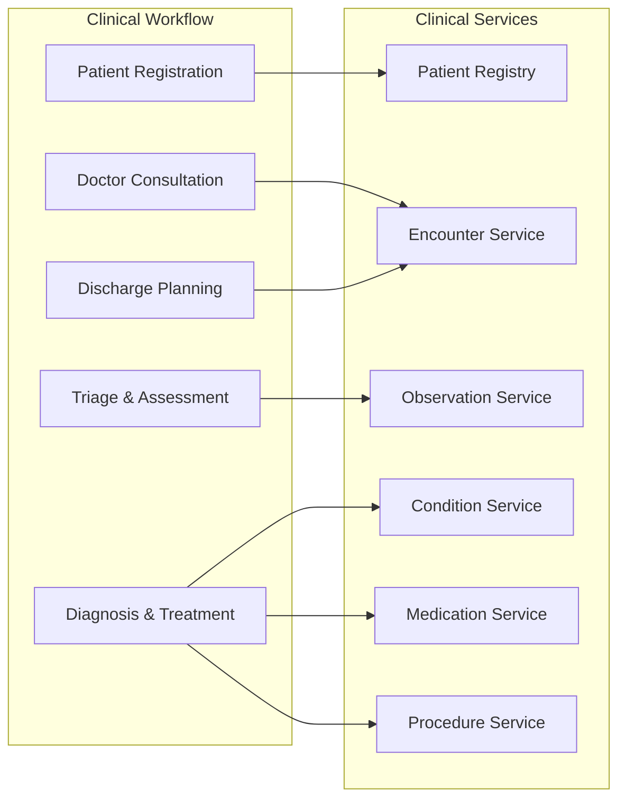

### Administrative Domain

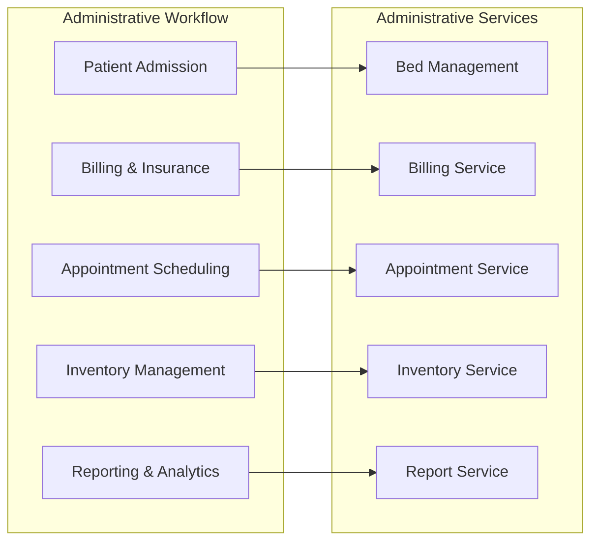

## 🌐 Bangladesh Integration Architecture

### Government Systems Integration

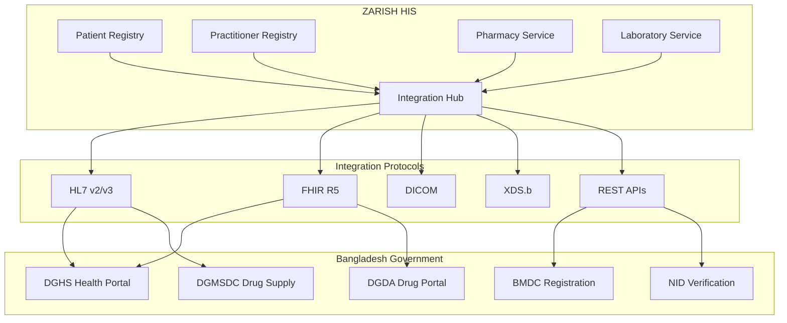

### Data Flow Architecture

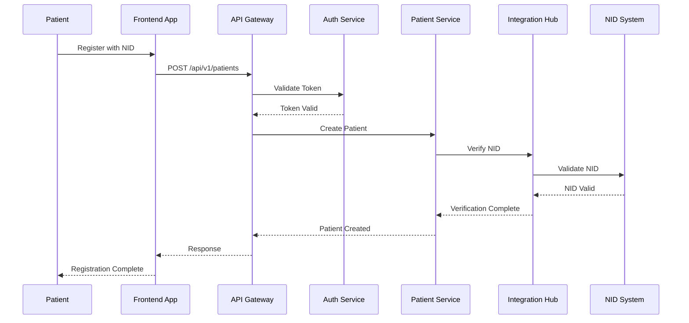

## 🔧 Technology Stack Architecture

### Backend Technology Stack

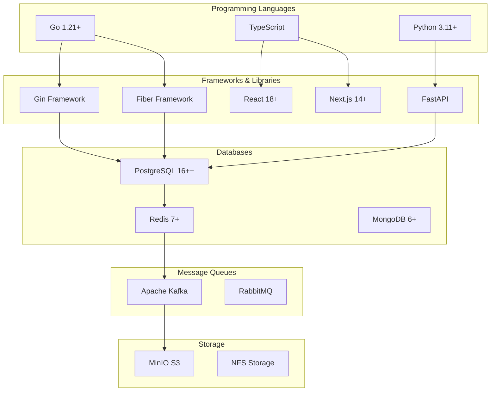

### Frontend Architecture

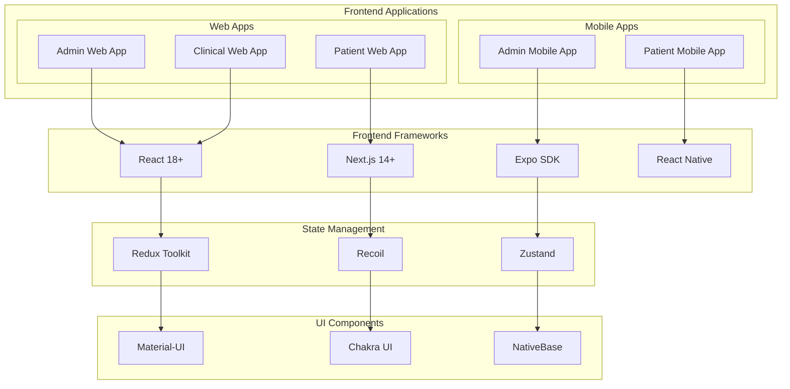

## 🚀 Deployment Architecture

### Kubernetes Deployment

```mermaid
graph TB
    subgraph "Kubernetes Cluster"
        subgraph "Namespaces"
            PROD[Production]
            STAGING[Staging]
            DEV[Development]
        end
        
        subgraph "Production Namespace"
            subgraph "Pods"
                API_PODS[API Pods]
                SVC_PODS[Service Pods]
                DB_PODS[Database Pods]
            end
            
            subgraph "Services"
                API_SVC[API Service]
                SVC_SVC[Service Service]
                DB_SVC[Database Service]
            end
            
            subgraph "Ingress"
                INGRESS[Ingress Controller]
            end
        end
    end
    
    subgraph "Load Balancer"
        LB[External Load Balancer]
    end
    
    subgraph "CDN"
        CDN[CloudFlare CDN]
    end
    
    CDN --> LB
    LB --> INGRESS
    INGRESS --> API_SVC
    INGRESS --> SVC_SVC
    
    API_SVC --> API_PODS
    SVC_SVC --> SVC_PODS
    DB_SVC --> DB_PODS
```

### CI/CD Pipeline Architecture

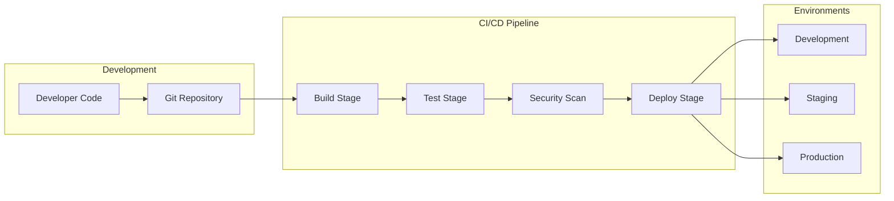

## 🔒 Security Architecture

### Security Layers

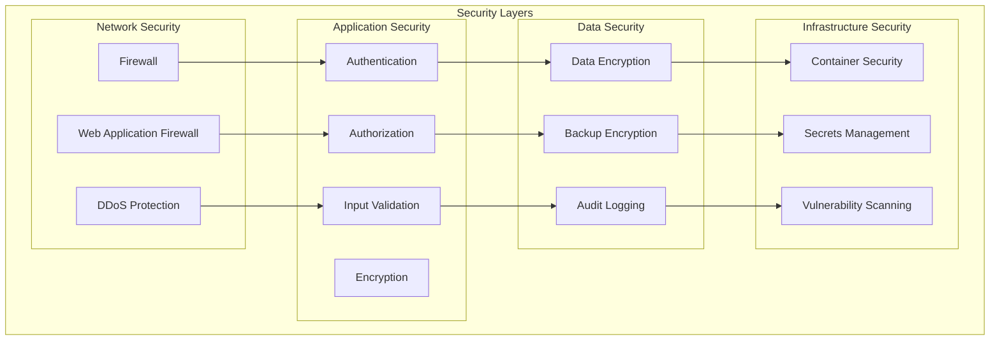

### Authentication & Authorization Flow

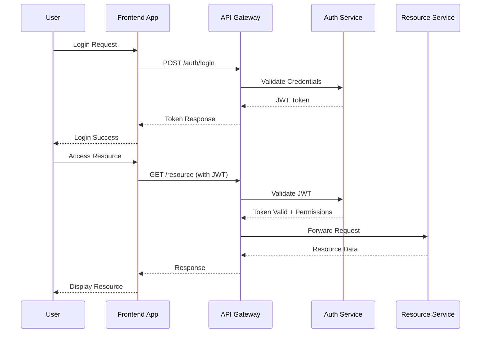

## 📊 Monitoring & Observability

### Monitoring Architecture

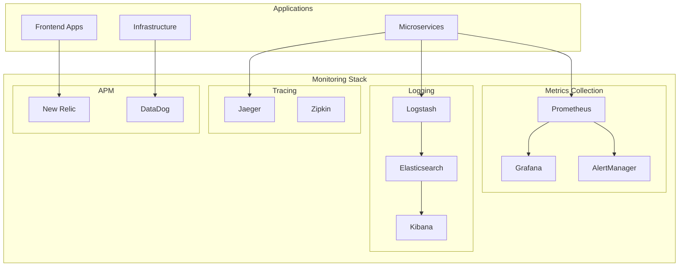

## 🔄 Data Architecture

### Data Flow Patterns

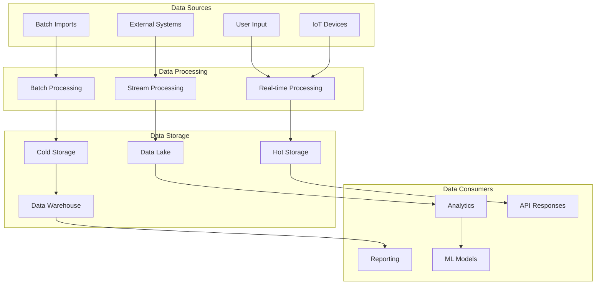

## 🌍 Multi-Tenant Architecture

### Tenant Isolation

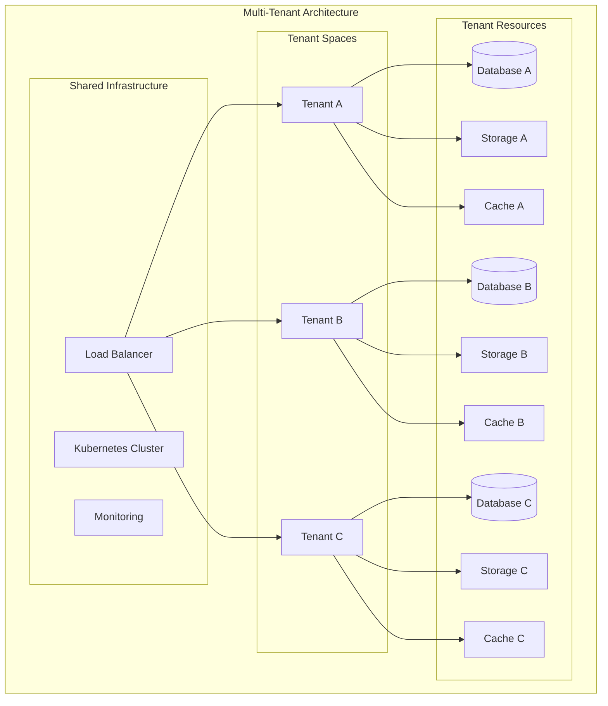

## 📈 Performance Architecture

### Performance Optimization

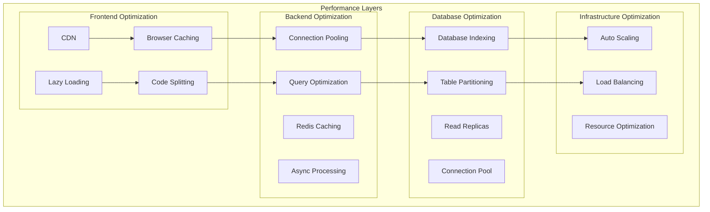

---

_Last updated: 2026-01-21_
