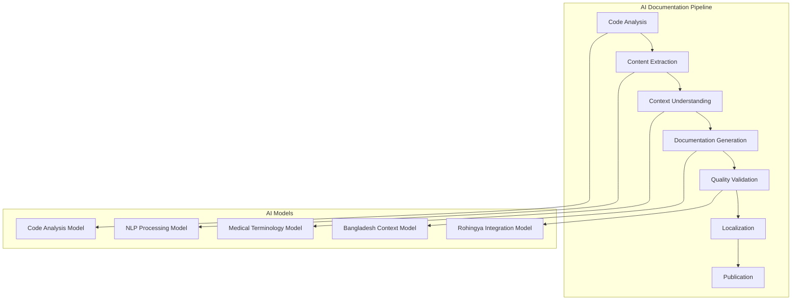

# AI Documentation Generator

## 🎯 Overview

AI-powered documentation generation system for ZARISH HIS with Bangladesh healthcare context and Rohingya refugee integration support.

## 🤖 AI Architecture

### Documentation Generation Pipeline



### AI Service Architecture

```typescript
// src/ai/AIDocumentationService.ts
export class AIDocumentationService {
  private codeAnalyzer: CodeAnalyzer;
  private contentExtractor: ContentExtractor;
  private contextAnalyzer: ContextAnalyzer;
  private documentationGenerator: DocumentationGenerator;
  private qualityValidator: QualityValidator;
  private localizationService: LocalizationService;
  
  constructor() {
    this.codeAnalyzer = new CodeAnalyzer();
    this.contentExtractor = new ContentExtractor();
    this.contextAnalyzer = new ContextAnalyzer();
    this.documentationGenerator = new DocumentationGenerator();
    this.qualityValidator = new QualityValidator();
    this.localizationService = new LocalizationService();
  }
  
  async generateDocumentation(sourcePath: string): Promise<GeneratedDocumentation> {
    // Step 1: Analyze code structure
    const codeAnalysis = await this.codeAnalyzer.analyze(sourcePath);
    
    // Step 2: Extract content and context
    const extractedContent = await this.contentExtractor.extract(codeAnalysis);
    const context = await this.contextAnalyzer.analyze(extractedContent);
    
    // Step 3: Generate documentation
    const documentation = await this.documentationGenerator.generate(context);
    
    // Step 4: Validate quality
    const validatedDoc = await this.qualityValidator.validate(documentation);
    
    // Step 5: Localize for Bangladesh and Rohingya context
    const localizedDoc = await this.localizationService.localize(validatedDoc);
    
    return localizedDoc;
  }
}
```

## 🔍 Code Analysis AI

### Intelligent Code Analysis

```typescript
// src/ai/CodeAnalyzer.ts
export class CodeAnalyzer {
  private openaiClient: OpenAI;
  private codeParser: CodeParser;
  
  constructor() {
    this.openaiClient = new OpenAI({
      apiKey: process.env.OPENAI_API_KEY,
    });
    this.codeParser = new CodeParser();
  }
  
  async analyze(sourcePath: string): Promise<CodeAnalysisResult> {
    const files = await this.scanFiles(sourcePath);
    const analysis: CodeAnalysisResult = {
      files: [],
      apis: [],
      components: [],
      services: [],
      database: [],
      integrations: []
    };
    
    for (const file of files) {
      const fileAnalysis = await this.analyzeFile(file);
      analysis.files.push(fileAnalysis);
      
      // Categorize by type
      if (fileAnalysis.type === 'api') {
        analysis.apis.push(fileAnalysis);
      } else if (fileAnalysis.type === 'component') {
        analysis.components.push(fileAnalysis);
      } else if (fileAnalysis.type === 'service') {
        analysis.services.push(fileAnalysis);
      }
    }
    
    // Analyze integrations
    analysis.integrations = await this.analyzeIntegrations(analysis);
    
    return analysis;
  }
  
  private async analyzeFile(filePath: string): Promise<FileAnalysis> {
    const content = await fs.readFile(filePath, 'utf-8');
    const ast = this.codeParser.parse(content, filePath);
    
    const prompt = `
    Analyze the following code file for ZARISH HIS documentation:
    
    File: ${filePath}
    Language: ${this.getLanguage(filePath)}
    
    Code:
    ${content}
    
    Provide analysis in JSON format with:
    - type: api/component/service/database
    - purpose: What this code does
    - bangladeshContext: Bangladesh healthcare relevance
    - rohingyaIntegration: Rohingya refugee support
    - apis: List of API endpoints (if any)
    - dependencies: External dependencies
    - security: Security considerations
    - performance: Performance implications
    `;
    
    const response = await this.openaiClient.chat.completions.create({
      model: "gpt-4",
      messages: [{ role: "user", content: prompt }],
      temperature: 0.3,
    });
    
    return JSON.parse(response.choices[0].message.content || '{}');
  }
  
  private async analyzeIntegrations(analysis: CodeAnalysisResult): Promise<IntegrationAnalysis[]> {
    const integrations: IntegrationAnalysis[] = [];
    
    // Check for DGHS integration
    const dghsIntegration = await this.checkDGHSIntegration(analysis);
    if (dghsIntegration) {
      integrations.push(dghsIntegration);
    }
    
    // Check for UNHCR integration
    const unhcrIntegration = await this.checkUNHCRIntegration(analysis);
    if (unhcrIntegration) {
      integrations.push(unhcrIntegration);
    }
    
    // Check for payment gateway integration
    const paymentIntegration = await this.checkPaymentIntegration(analysis);
    if (paymentIntegration) {
      integrations.push(paymentIntegration);
    }
    
    return integrations;
  }
  
  private async checkDGHSIntegration(analysis: CodeAnalysisResult): Promise<IntegrationAnalysis | null> {
    const dghsReferences = analysis.files
      .filter(file => file.content?.includes('dghs') || file.content?.includes('DGHS'))
      .map(file => file.path);
    
    if (dghsReferences.length === 0) return null;
    
    return {
      type: 'DGHS',
      purpose: 'Bangladesh Directorate General of Health Services integration',
      files: dghsReferences,
      endpoints: ['validate-nid', 'submit-health-report'],
      authentication: 'API Key based',
      dataFormat: 'JSON',
      compliance: 'DGHS standards'
    };
  }
}
```

### Context-Aware Content Extraction

```typescript
// src/ai/ContentExtractor.ts
export class ContentExtractor {
  private nlpProcessor: NLPProcessor;
  private medicalTerminology: MedicalTerminologyService;
  
  constructor() {
    this.nlpProcessor = new NLPProcessor();
    this.medicalTerminology = new MedicalTerminologyService();
  }
  
  async extract(codeAnalysis: CodeAnalysisResult): Promise<ExtractedContent> {
    const content: ExtractedContent = {
      apis: [],
      components: [],
      services: [],
      database: [],
      integrations: [],
      bangladeshContext: [],
      rohingyaIntegration: []
    };
    
    // Extract API documentation
    for (const api of codeAnalysis.apis) {
      const apiDoc = await this.extractAPIDocumentation(api);
      content.apis.push(apiDoc);
    }
    
    // Extract component documentation
    for (const component of codeAnalysis.components) {
      const componentDoc = await this.extractComponentDocumentation(component);
      content.components.push(componentDoc);
    }
    
    // Extract Bangladesh-specific content
    content.bangladeshContext = await this.extractBangladeshContext(codeAnalysis);
    
    // Extract Rohingya integration content
    content.rohingyaIntegration = await this.extractRohingyaIntegration(codeAnalysis);
    
    return content;
  }
  
  private async extractAPIDocumentation(api: FileAnalysis): Promise<APIDocumentation> {
    const prompt = `
    Extract API documentation from the following code analysis:
    
    ${JSON.stringify(api)}
    
    Generate comprehensive API documentation including:
    - endpoint: API endpoint URL
    - method: HTTP method
    - description: What the API does
    - parameters: Request parameters
    - requestBody: Request body structure
    - response: Response structure
    - errors: Possible error responses
    - bangladeshContext: Bangladesh healthcare relevance
    - rohingyaSupport: Rohingya refugee support
    - examples: Usage examples
    `;
    
    const response = await this.openaiClient.chat.completions.create({
      model: "gpt-4",
      messages: [{ role: "user", content: prompt }],
      temperature: 0.3,
    });
    
    return JSON.parse(response.choices[0].message.content || '{}');
  }
  
  private async extractBangladeshContext(analysis: CodeAnalysisResult): Promise<BangladeshContext[]> {
    const context: BangladeshContext[] = [];
    
    // Extract administrative boundary handling
    const adminBoundaryFiles = analysis.files.filter(file => 
      file.content?.includes('division') || 
      file.content?.includes('district') || 
      file.content?.includes('upazila')
    );
    
    if (adminBoundaryFiles.length > 0) {
      context.push({
        type: 'administrative-boundaries',
        description: 'Bangladesh administrative boundary system (BD.X.Y.Z.W)',
        files: adminBoundaryFiles.map(f => f.path),
        implementation: 'Complete division, district, upazila, union support'
      });
    }
    
    // Extract NID validation
    const nidFiles = analysis.files.filter(file => 
      file.content?.includes('nationalId') || 
      file.content?.includes('NID')
    );
    
    if (nidFiles.length > 0) {
      context.push({
        type: 'national-id',
        description: 'Bangladeshi National ID validation and integration',
        files: nidFiles.map(f => f.path),
        implementation: '13-digit NID format validation with DGHS integration'
      });
    }
    
    return context;
  }
}
```

## 📝 AI Documentation Generation

### Intelligent Documentation Generation

```typescript
// src/ai/DocumentationGenerator.ts
export class DocumentationGenerator {
  private templateEngine: TemplateEngine;
  private codeExampleGenerator: CodeExampleGenerator;
  private diagramGenerator: DiagramGenerator;
  
  constructor() {
    this.templateEngine = new TemplateEngine();
    this.codeExampleGenerator = new CodeExampleGenerator();
    this.diagramGenerator = new DiagramGenerator();
  }
  
  async generate(content: ExtractedContent): Promise<GeneratedDocumentation> {
    const documentation: GeneratedDocumentation = {
      api: [],
      components: [],
      services: [],
      guides: [],
      examples: []
    };
    
    // Generate API documentation
    for (const api of content.apis) {
      const apiDoc = await this.generateAPIDocumentation(api);
      documentation.api.push(apiDoc);
    }
    
    // Generate component documentation
    for (const component of content.components) {
      const componentDoc = await this.generateComponentDocumentation(component);
      documentation.components.push(componentDoc);
    }
    
    // Generate integration guides
    const integrationGuides = await this.generateIntegrationGuides(content);
    documentation.guides.push(...integrationGuides);
    
    // Generate code examples
    const examples = await this.generateCodeExamples(content);
    documentation.examples.push(...examples);
    
    return documentation;
  }
  
  private async generateAPIDocumentation(api: APIDocumentation): Promise<APIDocument> {
    const prompt = `
    Generate comprehensive API documentation for ZARISH HIS:
    
    API Information:
    ${JSON.stringify(api)}
    
    Generate documentation with:
    - Overview section with Bangladesh healthcare context
    - Authentication and authorization details
    - Complete endpoint documentation with examples
    - Error handling and troubleshooting
    - Bangladesh-specific considerations
    - Rohingya refugee support details
    - Performance and security notes
    - Testing examples
    
    Format in Markdown with proper structure and code examples.
    `;
    
    const response = await this.openaiClient.chat.completions.create({
      model: "gpt-4",
      messages: [{ role: "user", content: prompt }],
      temperature: 0.3,
    });
    
    const markdown = response.choices[0].message.content || '';
    
    return {
      title: api.name,
      content: markdown,
      metadata: {
        endpoint: api.endpoint,
        method: api.method,
        version: '1.0',
        lastUpdated: new Date().toISOString(),
        bangladeshContext: api.bangladeshContext,
        rohingyaSupport: api.rohingyaSupport
      }
    };
  }
  
  private async generateIntegrationGuides(content: ExtractedContent): Promise<IntegrationGuide[]> {
    const guides: IntegrationGuide[] = [];
    
    // Generate DGHS integration guide
    if (content.integrations.some(i => i.type === 'DGHS')) {
      const dghsGuide = await this.generateDGHSIntegrationGuide();
      guides.push(dghsGuide);
    }
    
    // Generate UNHCR integration guide
    if (content.integrations.some(i => i.type === 'UNHCR')) {
      const unhcrGuide = await this.generateUNHCRIntegrationGuide();
      guides.push(unhcrGuide);
    }
    
    // Generate payment gateway guide
    if (content.integrations.some(i => i.type === 'PAYMENT')) {
      const paymentGuide = await this.generatePaymentGatewayGuide();
      guides.push(paymentGuide);
    }
    
    return guides;
  }
  
  private async generateDGHSIntegrationGuide(): Promise<IntegrationGuide> {
    const prompt = `
    Generate a comprehensive DGHS integration guide for ZARISH HIS:
    
    Include:
    - DGHS API overview and purpose
    - Authentication and setup
    - National ID validation process
    - Health report submission
    - Bangladesh healthcare compliance
    - Error handling and troubleshooting
    - Code examples in TypeScript
    - Testing procedures
    - Security considerations
    - Performance optimization
    
    Format in Markdown with proper structure, code examples, and Bangladesh context.
    `;
    
    const response = await this.openaiClient.chat.completions.create({
      model: "gpt-4",
      messages: [{ role: "user", content: prompt }],
      temperature: 0.3,
    });
    
    return {
      title: 'DGHS Integration Guide',
      content: response.choices[0].message.content || '',
      type: 'integration',
      target: 'DGHS',
      metadata: {
        version: '1.0',
        lastUpdated: new Date().toISOString(),
        compliance: 'DGHS standards'
      }
    };
  }
}
```

### Code Example Generation

```typescript
// src/ai/CodeExampleGenerator.ts
export class CodeExampleGenerator {
  async generateExamples(api: APIDocumentation): Promise<CodeExample[]> {
    const examples: CodeExample[] = [];
    
    // Generate Bangladeshi patient example
    const bangladeshiExample = await this.generateBangladeshiPatientExample(api);
    examples.push(bangladeshiExample);
    
    // Generate Rohingya refugee example
    const rohingyaExample = await this.generateRohingyaPatientExample(api);
    examples.push(rohingyaExample);
    
    // Generate error handling example
    const errorExample = await this.generateErrorHandlingExample(api);
    examples.push(errorExample);
    
    return examples;
  }
  
  private async generateBangladeshiPatientExample(api: APIDocumentation): Promise<CodeExample> {
    const prompt = `
    Generate a TypeScript code example for creating a Bangladeshi patient in ZARISH HIS:
    
    API Details:
    ${JSON.stringify(api)}
    
    Include:
    - Complete TypeScript code
    - Bangladeshi National ID (13-digit format)
    - Bangladesh administrative boundaries (BD.X.Y.Z.W)
    - Proper error handling
    - Bangladesh phone number format
    - Comments explaining Bangladesh-specific fields
    - Type definitions
    - Integration with DGHS NID validation
    
    Make the example realistic and production-ready.
    `;
    
    const response = await this.openaiClient.chat.completions.create({
      model: "gpt-4",
      messages: [{ role: "user", content: prompt }],
      temperature: 0.3,
    });
    
    return {
      title: 'Bangladeshi Patient Registration',
      description: 'Complete example of registering a Bangladeshi patient with NID validation',
      code: response.choices[0].message.content || '',
      language: 'typescript',
      context: 'bangladesh-healthcare'
    };
  }
  
  private async generateRohingyaPatientExample(api: APIDocumentation): Promise<CodeExample> {
    const prompt = `
    Generate a TypeScript code example for creating a Rohingya refugee patient in ZARISH HIS:
    
    API Details:
    ${JSON.stringify(api)}
    
    Include:
    - Complete TypeScript code
    - Rohingya refugee IDs (ProGress ID, MRC Card, FCN)
    - Camp structure (Kutupalong, Nayapara, Balukhali)
    - Block and sub-block organization
    - UNHCR registration details
    - Proper error handling
    - Comments explaining refugee-specific fields
    - Type definitions
    - Integration with UNHCR validation
    
    Make the example realistic and production-ready.
    `;
    
    const response = await this.openaiClient.chat.completions.create({
      model: "gpt-4",
      messages: [{ role: "user", content: prompt }],
      temperature: 0.3,
    });
    
    return {
      title: 'Rohingya Refugee Patient Registration',
      description: 'Complete example of registering a Rohingya refugee patient with UNHCR integration',
      code: response.choices[0].message.content || '',
      language: 'typescript',
      context: 'rohingya-refugee'
    };
  }
}
```

## 🌐 AI-Powered Localization

### Intelligent Localization Service

```typescript
// src/ai/LocalizationService.ts
export class LocalizationService {
  private bengaliTranslator: BengaliTranslator;
  private burmeseTranslator: BurmeseTranslator;
  private contextAnalyzer: ContextAnalyzer;
  
  constructor() {
    this.bengaliTranslator = new BengaliTranslator();
    this.burmeseTranslator = new BurmeseTranslator();
    this.contextAnalyzer = new ContextAnalyzer();
  }
  
  async localize(documentation: GeneratedDocumentation): Promise<LocalizedDocumentation> {
    const localized: LocalizedDocumentation = {
      original: documentation,
      bengali: await this.translateToBengali(documentation),
      burmese: await this.translateToBurmese(documentation)
    };
    
    return localized;
  }
  
  private async translateToBengali(doc: GeneratedDocumentation): Promise<BengaliDocumentation> {
    const bengaliDoc: BengaliDocumentation = {
      api: [],
      components: [],
      services: [],
      guides: [],
      examples: []
    };
    
    // Translate API documentation
    for (const api of doc.api) {
      const translated = await this.translateAPIToBengali(api);
      bengaliDoc.api.push(translated);
    }
    
    // Translate component documentation
    for (const component of doc.components) {
      const translated = await this.translateComponentToBengali(component);
      bengaliDoc.components.push(translated);
    }
    
    return bengaliDoc;
  }
  
  private async translateAPIToBengali(api: APIDocument): Promise<BengaliAPIDocument> {
    const prompt = `
    Translate the following API documentation to Bengali for ZARISH HIS:
    
    Original: ${api.content}
    
    Requirements:
    - Maintain technical accuracy
    - Use appropriate Bengali medical terminology
    - Keep code examples in English
    - Translate headings and descriptions
    - Preserve Bangladesh healthcare context
    - Use proper Bengali grammar and spelling
    - Format in Markdown
    
    Focus on healthcare professionals and technical users.
    `;
    
    const response = await this.openaiClient.chat.completions.create({
      model: "gpt-4",
      messages: [{ role: "user", content: prompt }],
      temperature: 0.3,
    });
    
    return {
      title: await this.translateTitle(api.title),
      content: response.choices[0].message.content || '',
      metadata: api.metadata
    };
  }
  
  private async translateTitle(title: string): Promise<string> {
    const prompt = `
    Translate this title to Bengali for healthcare documentation:
    
    "${title}"
    
    Keep it professional and accurate for medical context.
    `;
    
    const response = await this.openaiClient.chat.completions.create({
      model: "gpt-4",
      messages: [{ role: "user", content: prompt }],
      temperature: 0.3,
    });
    
    return response.choices[0].message.content || title;
  }
}
```

## 🔍 AI Quality Validation

### Intelligent Quality Assessment

```typescript
// src/ai/QualityValidator.ts
export class QualityValidator {
  private grammarChecker: GrammarChecker;
  private technicalValidator: TechnicalValidator;
  private complianceChecker: ComplianceChecker;
  
  constructor() {
    this.grammarChecker = new GrammarChecker();
    this.technicalValidator = new TechnicalValidator();
    this.complianceChecker = new ComplianceChecker();
  }
  
  async validate(documentation: GeneratedDocumentation): Promise<ValidatedDocumentation> {
    const validation: ValidationReport = {
      grammar: await this.checkGrammar(documentation),
      technical: await this.checkTechnicalAccuracy(documentation),
      compliance: await this.checkCompliance(documentation),
      completeness: await this.checkCompleteness(documentation),
      accessibility: await this.checkAccessibility(documentation)
    };
    
    const score = this.calculateQualityScore(validation);
    
    return {
      documentation,
      validation,
      score,
      recommendations: await this.generateRecommendations(validation)
    };
  }
  
  private async checkTechnicalAccuracy(doc: GeneratedDocumentation): Promise<TechnicalValidation> {
    const validation: TechnicalValidation = {
      codeExamples: [],
      apiEndpoints: [],
      dataStructures: [],
      integrations: []
    };
    
    // Validate code examples
    for (const example of doc.examples) {
      const codeValidation = await this.validateCodeExample(example);
      validation.codeExamples.push(codeValidation);
    }
    
    // Validate API endpoints
    for (const api of doc.api) {
      const apiValidation = await this.validateAPIEndpoint(api);
      validation.apiEndpoints.push(apiValidation);
    }
    
    return validation;
  }
  
  private async validateCodeExample(example: CodeExample): Promise<CodeValidation> {
    const prompt = `
    Validate this TypeScript code example for ZARISH HIS:
    
    ${example.code}
    
    Check for:
    - Syntax correctness
    - Type safety
    - Error handling
    - Best practices
    - Security considerations
    - Performance implications
    - Bangladesh healthcare context
    - Rohingya refugee support
    
    Provide validation results with:
    - isValid: boolean
    - errors: array of errors
    - warnings: array of warnings
    - suggestions: array of suggestions
    - score: 0-100 quality score
    `;
    
    const response = await this.openaiClient.chat.completions.create({
      model: "gpt-4",
      messages: [{ role: "user", content: prompt }],
      temperature: 0.3,
    });
    
    return JSON.parse(response.choices[0].message.content || '{}');
  }
  
  private async checkCompliance(doc: GeneratedDocumentation): Promise<ComplianceValidation> {
    const validation: ComplianceValidation = {
      healthcare: [],
      dataProtection: [],
      accessibility: [],
      bangladesh: [],
      rohingya: []
    };
    
    // Check Bangladesh healthcare compliance
    validation.bangladesh = await this.checkBangladeshCompliance(doc);
    
    // Check Rohingya refugee compliance
    validation.rohingya = await this.checkRohingyaCompliance(doc);
    
    // Check data protection compliance
    validation.dataProtection = await this.checkDataProtectionCompliance(doc);
    
    return validation;
  }
  
  private async checkBangladeshCompliance(doc: GeneratedDocumentation): Promise<ComplianceItem[]> {
    const compliance: ComplianceItem[] = [];
    
    // Check for DGHS integration
    const dghsCompliance = await this.checkDGHSCompliance(doc);
    compliance.push(dghsCompliance);
    
    // Check for NID validation
    const nidCompliance = await this.checkNIDCompliance(doc);
    compliance.push(nidCompliance);
    
    // Check for administrative boundaries
    const adminCompliance = await this.checkAdministrativeCompliance(doc);
    compliance.push(adminCompliance);
    
    return compliance;
  }
}
```

---

**Service Version**: 1.0  
**Last Updated**: January 2026  
**Compliance**: ZARISH HIS AI Standards
