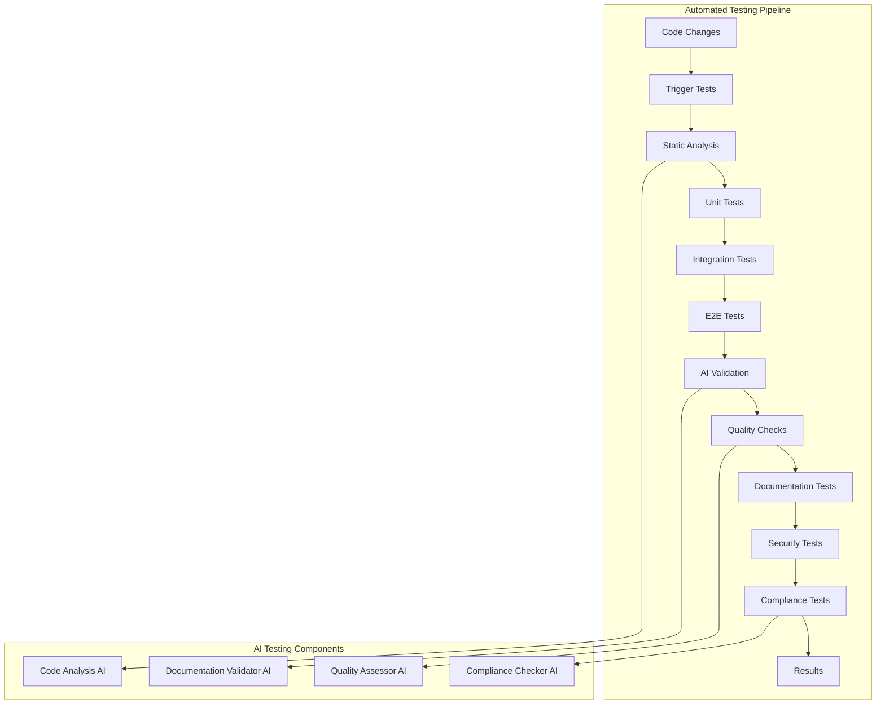

# Automated Testing System

## 🎯 Overview

Comprehensive automated testing system for ZARISH HIS documentation with AI-powered validation and Bangladesh healthcare context.

## 🤖 Automated Testing Architecture

### Testing Pipeline



### Test Configuration

```yaml
# .github/workflows/automated-testing.yml
name: Automated Testing Pipeline

on:
  push:
    branches: [main, develop]
  pull_request:
    branches: [main]
  schedule:
    - cron: '0 2 * * *'  # Daily at 2 AM

jobs:
  static-analysis:
    runs-on: ubuntu-latest
    steps:
      - uses: actions/checkout@v4
      
      - name: Setup Node.js
        uses: actions/setup-node@v4
        with:
          node-version: '18'
          cache: 'npm'
      
      - name: Install dependencies
        run: npm ci
      
      - name: Run ESLint
        run: npm run lint
      
      - name: Run TypeScript check
        run: npm run type-check
      
      - name: Run Markdown lint
        run: npm run markdown-lint
      
      - name: AI Code Analysis
        run: npm run ai-code-analysis

  unit-tests:
    runs-on: ubuntu-latest
    needs: static-analysis
    steps:
      - uses: actions/checkout@v4
      
      - name: Setup Node.js
        uses: actions/setup-node@v4
        with:
          node-version: '18'
          cache: 'npm'
      
      - name: Install dependencies
        run: npm ci
      
      - name: Run unit tests
        run: npm run test:unit
      
      - name: Generate coverage report
        run: npm run test:coverage
      
      - name: Upload coverage to Codecov
        uses: codecov/codecov-action@v3

  integration-tests:
    runs-on: ubuntu-latest
    needs: unit-tests
    services:
      postgres:
        image: postgres:15
        env:
          POSTGRES_PASSWORD: test
          POSTGRES_DB: zarish_his_test
        options: >-
          --health-cmd pg_isready
          --health-interval 10s
          --health-timeout 5s
          --health-retries 5
      
      redis:
        image: redis:7
        options: >-
          --health-cmd "redis-cli ping"
          --health-interval 10s
          --health-timeout 5s
          --health-retries 5
    
    steps:
      - uses: actions/checkout@v4
      
      - name: Setup Node.js
        uses: actions/setup-node@v4
        with:
          node-version: '18'
          cache: 'npm'
      
      - name: Install dependencies
        run: npm ci
      
      - name: Setup test database
        run: npm run test:setup-db
      
      - name: Run integration tests
        run: npm run test:integration
      
      - name: Run API tests
        run: npm run test:api

  e2e-tests:
    runs-on: ubuntu-latest
    needs: integration-tests
    steps:
      - uses: actions/checkout@v4
      
      - name: Setup Node.js
        uses: actions/setup-node@v4
        with:
          node-version: '18'
          cache: 'npm'
      
      - name: Install dependencies
        run: npm ci
      
      - name: Install Playwright
        run: npx playwright install --with-deps
      
      - name: Build application
        run: npm run build
      
      - name: Run E2E tests
        run: npm run test:e2e
      
      - name: Upload test results
        uses: actions/upload-artifact@v3
        if: failure()
        with:
          name: playwright-report
          path: playwright-report/

  ai-validation:
    runs-on: ubuntu-latest
    needs: e2e-tests
    steps:
      - uses: actions/checkout@v4
      
      - name: Setup Python
        uses: actions/setup-python@v4
        with:
          python-version: '3.10'
      
      - name: Install dependencies
        run: |
          pip install -r requirements.txt
          pip install openai
      
      - name: Run AI documentation validation
        run: python scripts/ai_validation.py
        env:
          OPENAI_API_KEY: ${{ secrets.OPENAI_API_KEY }}
      
      - name: Run AI code quality check
        run: python scripts/ai_quality_check.py
        env:
          OPENAI_API_KEY: ${{ secrets.OPENAI_API_KEY }}

  quality-checks:
    runs-on: ubuntu-latest
    needs: ai-validation
    steps:
      - uses: actions/checkout@v4
      
      - name: Run documentation quality checks
        run: npm run test:docs-quality
      
      - name: Run link validation
        run: npm run test:links
      
      - name: Run code example validation
        run: npm run test:code-examples
      
      - name: Run accessibility tests
        run: npm run test:accessibility

  security-tests:
    runs-on: ubuntu-latest
    needs: quality-checks
    steps:
      - uses: actions/checkout@v4
      
      - name: Run security audit
        run: npm audit --audit-level high
      
      - name: Run OWASP ZAP Baseline Scan
        uses: zaproxy/action-baseline@v0.7.0
        with:
          target: 'http://localhost:3000'
      
      - name: Run security tests
        run: npm run test:security

  compliance-tests:
    runs-on: ubuntu-latest
    needs: security-tests
    steps:
      - uses: actions/checkout@v4
      
      - name: Setup Python
        uses: actions/setup-python@v4
        with:
          python-version: '3.10'
      
      - name: Install dependencies
        run: pip install -r requirements.txt
      
      - name: Run Bangladesh healthcare compliance tests
        run: python scripts/bangladesh_compliance.py
      
      - name: Run Rohingya refugee compliance tests
        run: python scripts/rohingya_compliance.py
      
      - name: Run data protection compliance tests
        run: python scripts/data_protection_compliance.py

  deployment-test:
    runs-on: ubuntu-latest
    needs: compliance-tests
    if: github.ref == 'refs/heads/main'
    steps:
      - uses: actions/checkout@v4
      
      - name: Deploy to staging
        run: npm run deploy:staging
      
      - name: Run smoke tests
        run: npm run test:smoke
      
      - name: Run performance tests
        run: npm run test:performance
      
      - name: Run load tests
        run: npm run test:load
```

## 🔍 AI-Powered Testing

### AI Test Generation

```typescript
// src/testing/ai/AITestGenerator.ts
export class AITestGenerator {
  private openaiClient: OpenAI;
  private codeAnalyzer: CodeAnalyzer;
  
  constructor() {
    this.openaiClient = new OpenAI({
      apiKey: process.env.OPENAI_API_KEY,
    });
    this.codeAnalyzer = new CodeAnalyzer();
  }
  
  async generateTests(sourcePath: string): Promise<GeneratedTests> {
    const codeAnalysis = await this.codeAnalyzer.analyze(sourcePath);
    const tests: GeneratedTests = {
      unit: [],
      integration: [],
      e2e: [],
      api: []
    };
    
    // Generate unit tests
    for (const file of codeAnalysis.files) {
      const unitTests = await this.generateUnitTests(file);
      tests.unit.push(...unitTests);
    }
    
    // Generate integration tests
    for (const service of codeAnalysis.services) {
      const integrationTests = await this.generateIntegrationTests(service);
      tests.integration.push(...integrationTests);
    }
    
    // Generate API tests
    for (const api of codeAnalysis.apis) {
      const apiTests = await this.generateAPITests(api);
      tests.api.push(...apiTests);
    }
    
    return tests;
  }
  
  private async generateUnitTests(file: FileAnalysis): Promise<UnitTest[]> {
    const prompt = `
    Generate comprehensive unit tests for the following TypeScript code:
    
    File: ${file.path}
    Code: ${file.content}
    
    Requirements:
    - Use Jest testing framework
    - Include Bangladesh healthcare context tests
    - Include Rohingya refugee integration tests
    - Test all public methods
    - Include edge cases and error scenarios
    - Mock external dependencies (DGHS, UNHCR)
    - Test data validation
    - Include performance considerations
    - Use proper TypeScript typing
    
    Generate complete, runnable test files with:
    - Import statements
    - Test descriptions in Bengali and English
    - Mock implementations
    - Test data setup
    - Assertion expectations
    - Cleanup procedures
    `;
    
    const response = await this.openaiClient.chat.completions.create({
      model: "gpt-4",
      messages: [{ role: "user", content: prompt }],
      temperature: 0.3,
    });
    
    const testCode = response.choices[0].message.content || '';
    
    return [{
      fileName: `${file.path}.test.ts`,
      content: testCode,
      type: 'unit',
      coverage: ['functions', 'branches', 'lines', 'statements']
    }];
  }
  
  private async generateAPITests(api: FileAnalysis): Promise<APITest[]> {
    const prompt = `
    Generate comprehensive API tests for the following endpoint:
    
    API: ${JSON.stringify(api)}
    
    Requirements:
    - Use Supertest for HTTP testing
    - Test all HTTP methods (GET, POST, PUT, DELETE)
    - Include Bangladeshi patient data tests
    - Include Rohingya refugee patient tests
    - Test authentication and authorization
    - Test request validation
    - Test error responses
    - Test rate limiting
    - Test Bangladesh-specific validations (NID, phone)
    - Test Rohingya-specific validations (ProGress ID, MRC)
    
    Generate complete test files with:
    - Test setup and teardown
    - Mock authentication
    - Test data factories
    - Request/response assertions
    - Error scenario tests
    - Performance tests
    `;
    
    const response = await this.openaiClient.chat.completions.create({
      model: "gpt-4",
      messages: [{ role: "user", content: prompt }],
      temperature: 0.3,
    });
    
    const testCode = response.choices[0].message.content || '';
    
    return [{
      fileName: `${api.name}.api.test.ts`,
      content: testCode,
      endpoint: api.endpoint,
      methods: ['GET', 'POST', 'PUT', 'DELETE']
    }];
  }
}
```

### AI Test Validation

```typescript
// src/testing/ai/AITestValidator.ts
export class AITestValidator {
  private openaiClient: OpenAI;
  
  constructor() {
    this.openaiClient = new OpenAI({
      apiKey: process.env.OPENAI_API_KEY,
    });
  }
  
  async validateTests(testResults: TestResults): Promise<TestValidationReport> {
    const validation: TestValidationReport = {
      overall: { score: 0, issues: [], recommendations: [] },
      coverage: { score: 0, gaps: [], suggestions: [] },
      quality: { score: 0, problems: [], improvements: [] },
      bangladeshContext: { score: 0, missing: [], additions: [] },
      rohingyaIntegration: { score: 0, gaps: [], enhancements: [] }
    };
    
    // Validate test coverage
    validation.coverage = await this.validateTestCoverage(testResults);
    
    // Validate test quality
    validation.quality = await this.validateTestQuality(testResults);
    
    // Validate Bangladesh context coverage
    validation.bangladeshContext = await this.validateBangladeshContext(testResults);
    
    // Validate Rohingya integration coverage
    validation.rohingyaIntegration = await this.validateRohingyaIntegration(testResults);
    
    // Calculate overall score
    validation.overall.score = this.calculateOverallScore(validation);
    
    return validation;
  }
  
  private async validateBangladeshContext(tests: TestResults): Promise<BangladeshContextValidation> {
    const prompt = `
    Analyze the following test results for Bangladesh healthcare context coverage:
    
    ${JSON.stringify(tests)}
    
    Evaluate:
    - NID validation tests (13-digit format)
    - Bangladesh administrative boundary tests (BD.X.Y.Z.W)
    - Bangladeshi phone number format tests
    - DGHS integration tests
    - BMDC verification tests
    - Bangladesh healthcare workflow tests
    - Cultural context considerations
    - Language support tests (Bengali)
    
    Provide:
    - score: 0-100
    - missing: list of missing Bangladesh-specific tests
    - additions: recommended test additions
    - coverage: percentage of Bangladesh context covered
    `;
    
    const response = await this.openaiClient.chat.completions.create({
      model: "gpt-4",
      messages: [{ role: "user", content: prompt }],
      temperature: 0.3,
    });
    
    return JSON.parse(response.choices[0].message.content || '{}');
  }
  
  private async validateRohingyaIntegration(tests: TestResults): Promise<RohingyaIntegrationValidation> {
    const prompt = `
    Analyze the following test results for Rohingya refugee integration coverage:
    
    ${JSON.stringify(tests)}
    
    Evaluate:
    - ProGress ID validation tests
    - MRC card validation tests
    - Family Counting Number (FCN) tests
    - Camp structure tests (Kutupalong, Nayapara, Balukhali)
    - Block and sub-block organization tests
    - UNHCR integration tests
    - Refugee-specific workflow tests
    - Language support tests (Burmese)
    - Data protection tests for refugee data
    - Humanitarian standards compliance tests
    
    Provide:
    - score: 0-100
    - gaps: list of missing Rohingya-specific tests
    - enhancements: recommended test enhancements
    - coverage: percentage of Rohingya integration covered
    `;
    
    const response = await this.openaiClient.chat.completions.create({
      model: "gpt-4",
      messages: [{ role: "user", content: prompt }],
      temperature: 0.3,
    });
    
    return JSON.parse(response.choices[0].message.content || '{}');
  }
}
```

## 🧪 Test Data Generation

### AI-Powered Test Data Factory

```typescript
// src/testing/data/TestDataFactory.ts
export class TestDataFactory {
  private aiGenerator: AITestDataGenerator;
  
  constructor() {
    this.aiGenerator = new AITestDataGenerator();
  }
  
  async generateTestData(type: 'bangladeshi' | 'rohingya', count: number): Promise<TestData[]> {
    if (type === 'bangladeshi') {
      return this.generateBangladeshiTestData(count);
    } else {
      return this.generateRohingyaTestData(count);
    }
  }
  
  private async generateBangladeshiTestData(count: number): Promise<TestData[]> {
    const prompt = `
    Generate ${count} realistic Bangladeshi patient test data for ZARISH HIS:
    
    Requirements:
    - Valid 13-digit National ID numbers
    - Bangladesh phone numbers (+880 format)
    - Administrative addresses (BD.X.Y.Z.W format)
    - Realistic Bengali names
    - Valid dates of birth
    - Proper gender distribution
    - Various divisions and districts
    - Emergency contact information
    
    Generate JSON array with:
    - firstName: Bengali first name
    - lastName: Bengali last name
    - dateOfBirth: YYYY-MM-DD format
    - gender: M/F/O
    - nationalId: 13-digit NID
    - phoneNumber: +880 format
    - address: Bangladesh administrative structure
    - emergencyContact: name, relationship, phone
    
    Ensure all data is realistic and follows Bangladesh standards.
    `;
    
    const response = await this.openaiClient.chat.completions.create({
      model: "gpt-4",
      messages: [{ role: "user", content: prompt }],
      temperature: 0.3,
    });
    
    return JSON.parse(response.choices[0].message.content || '[]');
  }
  
  private async generateRohingyaTestData(count: number): Promise<TestData[]> {
    const prompt = `
    Generate ${count} realistic Rohingya refugee patient test data for ZARISH HIS:
    
    Requirements:
    - Valid ProGress ID numbers (PROGXXXXXXXXX)
    - Valid MRC card numbers (MRCXXXXXXXXX)
    - Valid Family Counting Numbers (FCN-CAMP-BLOCK-XXX)
    - Camp structure (Kutupalong, Nayapara, Balukhali)
    - Block and sub-block organization
    - Shelter numbers
    - Realistic Rohingya names
    - Valid dates of birth
    - Proper gender distribution
    - Emergency contact information
    - UNHCR registration numbers
    
    Generate JSON array with:
    - firstName: Rohingya first name
    - lastName: Rohingya last name
    - dateOfBirth: YYYY-MM-DD format
    - gender: M/F/O
    - progressId: PROGXXXXXXXXX
    - mrcCard: MRCXXXXXXXXX
    - familyCountingNumber: FCN-CAMP-BLOCK-XXX
    - campName: Camp name
    - block: Block identifier
    - subBlock: Sub-block identifier
    - shelter: Shelter number
    - phoneNumber: +880 format
    - emergencyContact: name, relationship, phone
    - unhcrRegistration: UNHCR number
    
    Ensure all data is realistic and follows refugee standards.
    `;
    
    const response = await this.openaiClient.chat.completions.create({
      model: "gpt-4",
      messages: [{ role: "user", content: prompt }],
      temperature: 0.3,
    });
    
    return JSON.parse(response.choices[0].message.content || '[]');
  }
}
```

## 📊 Test Reporting

### AI-Enhanced Test Reports

```typescript
// src/testing/reporting/TestReporter.ts
export class TestReporter {
  private aiAnalyzer: AITestAnalyzer;
  
  constructor() {
    this.aiAnalyzer = new AITestAnalyzer();
  }
  
  async generateReport(testResults: TestResults): Promise<TestReport> {
    const report: TestReport = {
      summary: await this.generateSummary(testResults),
      coverage: await this.generateCoverageReport(testResults),
      quality: await this.generateQualityReport(testResults),
      bangladeshContext: await this.generateBangladeshReport(testResults),
      rohingyaIntegration: await this.generateRohingyaReport(testResults),
      recommendations: await this.generateRecommendations(testResults),
      trends: await this.analyzeTrends(testResults)
    };
    
    return report;
  }
  
  private async generateBangladeshReport(tests: TestResults): Promise<BangladeshTestReport> {
    const prompt = `
    Analyze the following test results and generate a Bangladesh healthcare context report:
    
    ${JSON.stringify(tests)}
    
    Generate a comprehensive report including:
    - Bangladesh-specific test coverage percentage
    - NID validation test results
    - Administrative boundary test results
    - DGHS integration test status
    - Cultural context test coverage
    - Language support test results
    - Performance metrics for Bangladesh features
    - Security test results for Bangladesh data
    - Recommendations for improvement
    
    Format as a detailed report with metrics and insights.
    `;
    
    const response = await this.openaiClient.chat.completions.create({
      model: "gpt-4",
      messages: [{ role: "user", content: prompt }],
      temperature: 0.3,
    });
    
    return {
      content: response.choices[0].message.content || '',
      metrics: await this.calculateBangladeshMetrics(tests),
      status: this.assessBangladeshStatus(tests)
    };
  }
  
  private async generateRohingyaReport(tests: TestResults): Promise<RohingyaTestReport> {
    const prompt = `
    Analyze the following test results and generate a Rohingya refugee integration report:
    
    ${JSON.stringify(tests)}
    
    Generate a comprehensive report including:
    - Rohingya-specific test coverage percentage
    - ProGress ID validation test results
    - MRC card validation test results
    - Camp structure test results
    - UNHCR integration test status
    - Refugee data protection test results
    - Language support test results (Burmese)
    - Performance metrics for Rohingya features
    - Security test results for refugee data
    - Humanitarian standards compliance
    - Recommendations for improvement
    
    Format as a detailed report with metrics and insights.
    `;
    
    const response = await this.openaiClient.chat.completions.create({
      model: "gpt-4",
      messages: [{ role: "user", content: prompt }],
      temperature: 0.3,
    });
    
    return {
      content: response.choices[0].message.content || '',
      metrics: await this.calculateRohingyaMetrics(tests),
      status: this.assessRohingyaStatus(tests)
    };
  }
}
```

## 🔧 Automated Test Execution

### Test Runner Configuration

```typescript
// src/testing/runner/TestRunner.ts
export class TestRunner {
  private config: TestRunnerConfig;
  private aiValidator: AITestValidator;
  private reporter: TestReporter;
  
  constructor(config: TestRunnerConfig) {
    this.config = config;
    this.aiValidator = new AITestValidator();
    this.reporter = new TestReporter();
  }
  
  async runTests(): Promise<TestExecutionResult> {
    const execution: TestExecutionResult = {
      startTime: new Date(),
      phases: [],
      results: null,
      report: null
    };
    
    try {
      // Phase 1: Static Analysis
      const staticAnalysis = await this.runStaticAnalysis();
      execution.phases.push({
        name: 'Static Analysis',
        status: staticAnalysis.success ? 'passed' : 'failed',
        duration: staticAnalysis.duration,
        results: staticAnalysis
      });
      
      // Phase 2: Unit Tests
      const unitTests = await this.runUnitTests();
      execution.phases.push({
        name: 'Unit Tests',
        status: unitTests.success ? 'passed' : 'failed',
        duration: unitTests.duration,
        results: unitTests
      });
      
      // Phase 3: Integration Tests
      const integrationTests = await this.runIntegrationTests();
      execution.phases.push({
        name: 'Integration Tests',
        status: integrationTests.success ? 'passed' : 'failed',
        duration: integrationTests.duration,
        results: integrationTests
      });
      
      // Phase 4: E2E Tests
      const e2eTests = await this.runE2ETests();
      execution.phases.push({
        name: 'E2E Tests',
        status: e2eTests.success ? 'passed' : 'failed',
        duration: e2eTests.duration,
        results: e2eTests
      });
      
      // Phase 5: AI Validation
      const aiValidation = await this.runAIValidation();
      execution.phases.push({
        name: 'AI Validation',
        status: aiValidation.success ? 'passed' : 'failed',
        duration: aiValidation.duration,
        results: aiValidation
      });
      
      // Generate comprehensive report
      execution.results = this.aggregateResults(execution.phases);
      execution.report = await this.reporter.generateReport(execution.results);
      
      execution.endTime = new Date();
      execution.success = execution.phases.every(phase => phase.status === 'passed');
      
      return execution;
      
    } catch (error) {
      execution.endTime = new Date();
      execution.success = false;
      execution.error = error;
      
      return execution;
    }
  }
  
  private async runAIValidation(): Promise<AIValidationResult> {
    const startTime = Date.now();
    
    try {
      // Collect test results from previous phases
      const testResults = this.collectTestResults();
      
      // Run AI validation
      const validation = await this.aiValidator.validateTests(testResults);
      
      return {
        success: validation.overall.score >= 80,
        duration: Date.now() - startTime,
        validation: validation
      };
      
    } catch (error) {
      return {
        success: false,
        duration: Date.now() - startTime,
        error: error
      };
    }
  }
}
```

---

**Service Version**: 1.0  
**Last Updated**: January 2026  
**Compliance**: ZARISH HIS Automated Testing Standards
