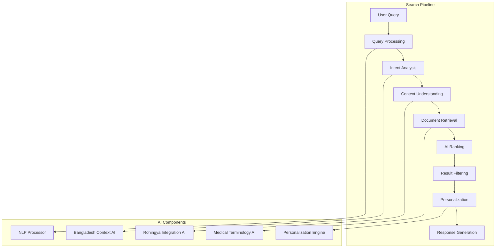

# Intelligent Search System

## 🎯 Overview

AI-powered intelligent search system for ZARISH HIS documentation with Bangladesh healthcare context and Rohingya refugee integration support.

## 🔍 Search Architecture

### Intelligent Search Pipeline



### Search Service Implementation

```typescript
// src/search/IntelligentSearchService.ts
export class IntelligentSearchService {
  private queryProcessor: QueryProcessor;
  private intentAnalyzer: IntentAnalyzer;
  private documentRetriever: DocumentRetriever;
  private rankingEngine: AIRankingEngine;
  personalizationEngine: PersonalizationEngine;
  private responseGenerator: ResponseGenerator;
  
  constructor() {
    this.queryProcessor = new QueryProcessor();
    this.intentAnalyzer = new IntentAnalyzer();
    this.documentRetriever = new DocumentRetriever();
    this.rankingEngine = new AIRankingEngine();
    this.personalizationEngine = new PersonalizationEngine();
    this.responseGenerator = new ResponseGenerator();
  }
  
  async search(query: SearchQuery, userContext: UserContext): Promise<SearchResponse> {
    // Step 1: Process and normalize query
    const processedQuery = await this.queryProcessor.process(query);
    
    // Step 2: Analyze user intent
    const intent = await this.intentAnalyzer.analyze(processedQuery, userContext);
    
    // Step 3: Retrieve relevant documents
    const documents = await this.documentRetriever.retrieve(processedQuery, intent);
    
    // Step 4: Rank results using AI
    const rankedResults = await this.rankingEngine.rank(documents, intent, userContext);
    
    // Step 5: Apply personalization
    const personalizedResults = await this.personalizationEngine.personalize(
      rankedResults, 
      userContext
    );
    
    // Step 6: Generate response
    const response = await this.responseGenerator.generate(
      personalizedResults, 
      query, 
      intent
    );
    
    return response;
  }
}
```

## 🧠 AI-Powered Query Processing

### Intelligent Query Analysis

```typescript
// src/search/QueryProcessor.ts
export class QueryProcessor {
  private nlpProcessor: NLPProcessor;
  private bangladeshContext: BangladeshContextProcessor;
  private rohingyaContext: RohingyaContextProcessor;
  
  constructor() {
    this.nlpProcessor = new NLPProcessor();
    this.bangladeshContext = new BangladeshContextProcessor();
    this.rohingyaContext = new RohingyaContextProcessor();
  }
  
  async process(query: SearchQuery): Promise<ProcessedQuery> {
    const processed: ProcessedQuery = {
      original: query.text,
      normalized: this.normalizeText(query.text),
      language: this.detectLanguage(query.text),
      entities: await this.extractEntities(query.text),
      intent: await this.extractIntent(query.text),
      context: await this.analyzeContext(query.text),
      bangladeshContext: await this.bangladeshContext.process(query.text),
      rohingyaContext: await this.rohingyaContext.process(query.text),
      medicalTerms: await this.extractMedicalTerms(query.text)
    };
    
    return processed;
  }
  
  private async extractEntities(text: string): Promise<Entity[]> {
    const entities: Entity[] = [];
    
    // Extract Bangladesh administrative entities
    const adminEntities = this.extractBangladeshEntities(text);
    entities.push(...adminEntities);
    
    // Extract Rohingya camp entities
    const campEntities = this.extractRohingyaEntities(text);
    entities.push(...campEntities);
    
    // Extract medical entities
    const medicalEntities = await this.extractMedicalEntities(text);
    entities.push(...medicalEntities);
    
    return entities;
  }
  
  private extractBangladeshEntities(text: string): Entity[] {
    const entities: Entity[] = [];
    
    // Division names
    const divisions = ['Dhaka', 'Chattogram', 'Khulna', 'Rajshahi', 'Barishal', 'Sylhet', 'Mymensingh', 'Rangpur'];
    for (const division of divisions) {
      if (text.toLowerCase().includes(division.toLowerCase())) {
        entities.push({
          type: 'division',
          value: division,
          confidence: 0.9,
          context: 'bangladesh-admin'
        });
      }
    }
    
    // Administrative codes
    const adminCodeRegex = /BD\.\d+\.\d+\.\d+\.\d+/g;
    const matches = text.match(adminCodeRegex);
    if (matches) {
      for (const match of matches) {
        entities.push({
          type: 'administrative_code',
          value: match,
          confidence: 0.95,
          context: 'bangladesh-admin'
        });
      }
    }
    
    return entities;
  }
  
  private extractRohingyaEntities(text: string): Entity[] {
    const entities: Entity[] = [];
    
    // Camp names
    const camps = ['Kutupalong', 'Nayapara', 'Balukhali', 'Thangkhali'];
    for (const camp of camps) {
      if (text.toLowerCase().includes(camp.toLowerCase())) {
        entities.push({
          type: 'camp',
          value: camp,
          confidence: 0.9,
          context: 'rohingya-camp'
        });
      }
    }
    
    // Refugee ID types
    const idTypes = ['ProGress', 'MRC', 'FCN'];
    for (const idType of idTypes) {
      if (text.toLowerCase().includes(idType.toLowerCase())) {
        entities.push({
          type: 'refugee_id_type',
          value: idType,
          confidence: 0.85,
          context: 'rohingya-identification'
        });
      }
    }
    
    return entities;
  }
}
```

### Intent Analysis

```typescript
// src/search/IntentAnalyzer.ts
export class IntentAnalyzer {
  private openaiClient: OpenAI;
  
  constructor() {
    this.openaiClient = new OpenAI({
      apiKey: process.env.OPENAI_API_KEY,
    });
  }
  
  async analyze(query: ProcessedQuery, userContext: UserContext): Promise<SearchIntent> {
    const prompt = `
    Analyze the search query for ZARISH HIS documentation:
    
    Query: ${query.original}
    Language: ${query.language}
    Entities: ${JSON.stringify(query.entities)}
    Bangladesh Context: ${JSON.stringify(query.bangladeshContext)}
    Rohingya Context: ${JSON.stringify(query.rohingyaContext)}
    Medical Terms: ${JSON.stringify(query.medicalTerms)}
    
    User Context:
    - Role: ${userContext.role}
    - Department: ${userContext.department}
    - Location: ${userContext.location}
    - Previous Searches: ${userContext.previousSearches}
    
    Determine the search intent with:
    - primaryIntent: main purpose (api/documentation/guide/example/troubleshooting)
    - secondaryIntent: secondary purpose
    - specificity: how specific the query is (low/medium/high)
    - urgency: how urgent the query is (low/medium/high)
    - complexity: how complex the answer should be (low/medium/high)
    - bangladeshRelevance: relevance to Bangladesh healthcare (0-1)
    - rohingyaRelevance: relevance to Rohingya refugees (0-1)
    - suggestedFilters: recommended filters to apply
    - expectedResultType: what type of result the user expects
    
    Respond in JSON format.
    `;
    
    const response = await this.openaiClient.chat.completions.create({
      model: "gpt-4",
      messages: [{ role: "user", content: prompt }],
      temperature: 0.3,
    });
    
    const intent = JSON.parse(response.choices[0].message.content || '{}');
    
    return {
      ...intent,
      confidence: this.calculateIntentConfidence(intent, query),
      processingTime: Date.now()
    };
  }
  
  private calculateIntentConfidence(intent: any, query: ProcessedQuery): number {
    let confidence = 0.5; // Base confidence
    
    // Increase confidence based on entity matches
    if (query.entities.length > 0) confidence += 0.2;
    
    // Increase confidence based on context relevance
    if (intent.bangladeshRelevance > 0.7) confidence += 0.1;
    if (intent.rohingyaRelevance > 0.7) confidence += 0.1;
    
    // Increase confidence based on specificity
    if (intent.specificity === 'high') confidence += 0.1;
    
    return Math.min(confidence, 1.0);
  }
}
```

## 📚 Document Retrieval

### Intelligent Document Retrieval

```typescript
// src/search/DocumentRetriever.ts
export class DocumentRetriever {
  private vectorStore: VectorStore;
  private documentIndex: DocumentIndex;
  private semanticSearch: SemanticSearch;
  
  constructor() {
    this.vectorStore = new VectorStore();
    this.documentIndex = new DocumentIndex();
    this.semanticSearch = new SemanticSearch();
  }
  
  async retrieve(query: ProcessedQuery, intent: SearchIntent): Promise<RetrievedDocument[]> {
    const documents: RetrievedDocument[] = [];
    
    // Keyword-based retrieval
    const keywordResults = await this.keywordSearch(query);
    documents.push(...keywordResults);
    
    // Semantic search
    const semanticResults = await this.semanticSearch.search(query);
    documents.push(...semanticResults);
    
    // Context-specific retrieval
    if (intent.bangladeshRelevance > 0.5) {
      const bangladeshResults = await this.searchBangladeshDocuments(query);
      documents.push(...bangladeshResults);
    }
    
    if (intent.rohingyaRelevance > 0.5) {
      const rohingyaResults = await this.searchRohingyaDocuments(query);
      documents.push(...rohingyaResults);
    }
    
    // Remove duplicates and sort by relevance
    const uniqueDocuments = this.removeDuplicates(documents);
    return uniqueDocuments.slice(0, 50); // Limit to top 50 results
  }
  
  private async searchBangladeshDocuments(query: ProcessedQuery): Promise<RetrievedDocument[]> {
    const bangladeshKeywords = [
      'bangladesh', 'bd', 'dhaka', 'division', 'district', 'upazila',
      'national id', 'nid', 'dghs', 'bmdc', 'bangladeshi', 'bengali'
    ];
    
    const filteredQuery = {
      ...query,
      keywords: query.keywords.filter(keyword => 
        bangladeshKeywords.some(bk => keyword.toLowerCase().includes(bk.toLowerCase()))
      )
    };
    
    return this.documentIndex.search(filteredQuery, {
      category: 'bangladesh-healthcare',
      tags: ['dghs', 'bmdc', 'administrative-boundaries']
    });
  }
  
  private async searchRohingyaDocuments(query: ProcessedQuery): Promise<RetrievedDocument[]> {
    const rohingyaKeywords = [
      'rohingya', 'refugee', 'camp', 'kutupalong', 'nayapara',
      'progress', 'mrc', 'fcn', 'unhcr', 'myanmar', 'burmese'
    ];
    
    const filteredQuery = {
      ...query,
      keywords: query.keywords.filter(keyword => 
        rohingyaKeywords.some(rk => keyword.toLowerCase().includes(rk.toLowerCase()))
      )
    };
    
    return this.documentIndex.search(filteredQuery, {
      category: 'rohingya-integration',
      tags: ['unhcr', 'camp-management', 'refugee-health']
    });
  }
}
```

## 🎯 AI Ranking Engine

### Intelligent Result Ranking

```typescript
// src/search/AIRankingEngine.ts
export class AIRankingEngine {
  private openaiClient: OpenAI;
  private relevanceCalculator: RelevanceCalculator;
  
  constructor() {
    this.openaiClient = new OpenAI({
      apiKey: process.env.OPENAI_API_KEY,
    });
    this.relevanceCalculator = new RelevanceCalculator();
  }
  
  async rank(
    documents: RetrievedDocument[], 
    intent: SearchIntent, 
    userContext: UserContext
  ): Promise<RankedDocument[]> {
    const ranked: RankedDocument[] = [];
    
    for (const doc of documents) {
      const score = await this.calculateDocumentScore(doc, intent, userContext);
      ranked.push({
        ...doc,
        score: score.overall,
        breakdown: score.breakdown,
        explanation: score.explanation
      });
    }
    
    // Sort by score (descending)
    ranked.sort((a, b) => b.score - a.score);
    
    return ranked;
  }
  
  private async calculateDocumentScore(
    doc: RetrievedDocument, 
    intent: SearchIntent, 
    userContext: UserContext
  ): Promise<DocumentScore> {
    const prompt = `
    Calculate relevance score for this document based on search query and user context:
    
    Document:
    - Title: ${doc.title}
    - Content: ${doc.content.substring(0, 500)}...
    - Tags: ${doc.tags.join(', ')}
    - Category: ${doc.category}
    
    Search Intent:
    - Primary: ${intent.primaryIntent}
    - Secondary: ${intent.secondaryIntent}
    - Bangladesh Relevance: ${intent.bangladeshRelevance}
    - Rohingya Relevance: ${intent.rohingyaRelevance}
    
    User Context:
    - Role: ${userContext.role}
    - Department: ${userContext.department}
    - Location: ${userContext.location}
    
    Calculate score (0-100) with breakdown:
    - textRelevance: How well the text matches the query
    - intentMatch: How well it matches the user intent
    - contextRelevance: Relevance to user context
    - bangladeshRelevance: Bangladesh healthcare relevance
    - rohingyaRelevance: Rohingya refugee relevance
    - qualityScore: Document quality score
    - freshness: How recent the information is
    
    Also provide:
    - explanation: Why this score was given
    - confidence: Confidence in the scoring (0-1)
    
    Respond in JSON format.
    `;
    
    const response = await this.openaiClient.chat.completions.create({
      model: "gpt-4",
      messages: [{ role: "user", content: prompt }],
      temperature: 0.3,
    });
    
    const scoreData = JSON.parse(response.choices[0].message.content || '{}');
    
    return {
      overall: scoreData.textRelevance * 0.3 + 
               scoreData.intentMatch * 0.25 + 
               scoreData.contextRelevance * 0.2 + 
               scoreData.bangladeshRelevance * 0.1 + 
               scoreData.rohingyaRelevance * 0.1 + 
               scoreData.qualityScore * 0.05,
      breakdown: scoreData,
      explanation: scoreData.explanation
    };
  }
}
```

## 🎨 Personalization Engine

### User Personalization

```typescript
// src/search/PersonalizationEngine.ts
export class PersonalizationEngine {
  private userProfileStore: UserProfileStore;
  private behaviorAnalyzer: BehaviorAnalyzer;
  
  constructor() {
    this.userProfileStore = new UserProfileStore();
    this.behaviorAnalyzer = new BehaviorAnalyzer();
  }
  
  async personalize(
    results: RankedDocument[], 
    userContext: UserContext
  ): Promise<PersonalizedResult[]> {
    const userProfile = await this.userProfileStore.getProfile(userContext.userId);
    const personalized: PersonalizedResult[] = [];
    
    for (const result of results) {
      const personalizationScore = await this.calculatePersonalizationScore(
        result, 
        userProfile, 
        userContext
      );
      
      personalized.push({
        ...result,
        personalizationScore,
        personalizedReason: personalizationScore.reason,
        boosted: personalizationScore.boosted
      });
    }
    
    // Re-rank based on personalization
    personalized.sort((a, b) => {
      const scoreA = a.score * (1 + a.personalizationScore.score);
      const scoreB = b.score * (1 + b.personalizationScore.score);
      return scoreB - scoreA;
    });
    
    return personalized;
  }
  
  private async calculatePersonalizationScore(
    result: RankedDocument, 
    profile: UserProfile, 
    context: UserContext
  ): Promise<PersonalizationScore> {
    let score = 0;
    let reason = '';
    let boosted = false;
    
    // Boost based on user role
    if (profile.role === 'doctor' && result.tags.includes('clinical')) {
      score += 0.2;
      reason = 'Relevant to clinical practice';
      boosted = true;
    }
    
    if (profile.role === 'admin' && result.tags.includes('administration')) {
      score += 0.2;
      reason = 'Relevant to system administration';
      boosted = true;
    }
    
    // Boost based on location (Bangladesh)
    if (context.location === 'bangladesh' && result.tags.includes('bangladesh')) {
      score += 0.15;
      reason = 'Relevant to Bangladesh context';
      boosted = true;
    }
    
    // Boost based on previous interactions
    const previousInteractions = profile.interactions.filter(
      interaction => interaction.documentId === result.id
    );
    
    if (previousInteractions.length > 0) {
      const avgRating = previousInteractions.reduce((sum, i) => sum + i.rating, 0) / previousInteractions.length;
      score += avgRating * 0.1;
      reason = 'Previously viewed with positive feedback';
      boosted = true;
    }
    
    // Boost based on search history
    const similarSearches = profile.searchHistory.filter(search => 
      this.calculateSearchSimilarity(search.query, result.title) > 0.7
    );
    
    if (similarSearches.length > 0) {
      score += 0.1;
      reason = 'Similar to previous searches';
      boosted = true;
    }
    
    return {
      score: Math.min(score, 0.5), // Cap personalization boost at 50%
      reason: reason || 'No personalization factors',
      boosted
    };
  }
}
```

## 💬 Response Generation

### AI-Powered Response Generation

```typescript
// src/search/ResponseGenerator.ts
export class ResponseGenerator {
  private openaiClient: OpenAI;
  private templateEngine: TemplateEngine;
  
  constructor() {
    this.openaiClient = new OpenAI({
      apiKey: process.env.OPENAI_API_KEY,
    });
    this.templateEngine = new TemplateEngine();
  }
  
  async generate(
    results: PersonalizedResult[], 
    query: SearchQuery, 
    intent: SearchIntent
  ): Promise<SearchResponse> {
    const response: SearchResponse = {
      query: query.text,
      results: results.slice(0, 10), // Top 10 results
      totalCount: results.length,
      suggestions: await this.generateSuggestions(query, intent),
      relatedTopics: await this.generateRelatedTopics(results),
      bangladeshContext: await this.generateBangladeshContext(results, intent),
      rohingyaContext: await this.generateRohingyaContext(results, intent),
      nextSteps: await this.generateNextSteps(results, intent),
      responseTime: Date.now()
    };
    
    // Generate AI summary if results are relevant
    if (results.length > 0 && results[0].score > 0.7) {
      response.summary = await this.generateSummary(results, query);
    }
    
    return response;
  }
  
  private async generateBangladeshContext(
    results: PersonalizedResult[], 
    intent: SearchIntent
  ): Promise<BangladeshContext | null> {
    const bangladeshResults = results.filter(r => 
      r.tags.includes('bangladesh') || r.category === 'bangladesh-healthcare'
    );
    
    if (bangladeshResults.length === 0) return null;
    
    const prompt = `
    Generate Bangladesh healthcare context summary for these search results:
    
    Results: ${JSON.stringify(bangladeshResults.slice(0, 3).map(r => ({
      title: r.title,
      tags: r.tags,
      score: r.score
    })))}
    
    Intent: ${JSON.stringify(intent)}
    
    Generate a summary including:
    - relevance: How relevant to Bangladesh healthcare
    - keyPoints: Key Bangladesh-specific information
    - regulations: Relevant Bangladesh regulations
    - implementation: Bangladesh implementation considerations
    - resources: Additional Bangladesh resources
    
    Format as a concise, helpful summary in English and Bengali.
    `;
    
    const response = await this.openaiClient.chat.completions.create({
      model: "gpt-4",
      messages: [{ role: "user", content: prompt }],
      temperature: 0.3,
    });
    
    return {
      summary: response.choices[0].message.content || '',
      relevance: intent.bangladeshRelevance,
      resources: bangladeshResults.map(r => r.id)
    };
  }
  
  private async generateRohingyaContext(
    results: PersonalizedResult[], 
    intent: SearchIntent
  ): Promise<RohingyaContext | null> {
    const rohingyaResults = results.filter(r => 
      r.tags.includes('rohingya') || r.category === 'rohingya-integration'
    );
    
    if (rohingyaResults.length === 0) return null;
    
    const prompt = `
    Generate Rohingya refugee integration context summary for these search results:
    
    Results: ${JSON.stringify(rohingyaResults.slice(0, 3).map(r => ({
      title: r.title,
      tags: r.tags,
      score: r.score
    })))}
    
    Intent: ${JSON.stringify(intent)}
    
    Generate a summary including:
    - relevance: How relevant to Rohingya refugee integration
    - keyPoints: Key Rohingya-specific information
    - camps: Relevant camp information
    - standards: UNHCR and humanitarian standards
    - implementation: Refugee service implementation
    - resources: Additional refugee resources
    
    Format as a concise, helpful summary in English and Burmese.
    `;
    
    const response = await this.openaiClient.chat.completions.create({
      model: "gpt-4",
      messages: [{ role: "user", content: prompt }],
      temperature: 0.3,
    });
    
    return {
      summary: response.choices[0].message.content || '',
      relevance: intent.rohingyaRelevance,
      resources: rohingyaResults.map(r => r.id)
    };
  }
}
```

---

**Service Version**: 1.0  
**Last Updated**: January 2026  
**Compliance**: ZARISH HIS Search Standards
