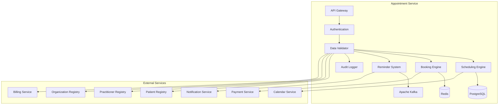

# MS Appointment Service

The Appointment Service manages patient appointments, scheduling, and booking operations with comprehensive Bangladesh healthcare context and multi-specialty support.

## 📋 Service Overview

- **Repository**: [ms-appointment-service](https://github.com/zs-his/ms-appointment-service)
- **Status**: 🟡 In Progress
- **FHIR Resources**: Appointment, Schedule, Slot, ServiceRequest
- **Primary Database**: PostgreSQL
- **Cache Layer**: Redis
- **Event Streaming**: Apache Kafka

## 🎯 Key Features

### Appointment Management
- **Multi-Specialty Scheduling**: Support for various medical specialties
- **Resource Management**: Room, equipment, and practitioner scheduling
- **Booking Engine**: Online and offline appointment booking
- **Waitlist Management**: Appointment cancellation and rebooking
- **Reminder System**: Automated appointment reminders

### Bangladesh-Specific Features
- **Local Working Hours**: Bangladesh healthcare facility schedules
- **Regional Holidays**: Bangladesh public holidays and observances
- **Language Support**: Bengali and English appointment communications
- **Payment Integration**: Bangladesh payment gateway integration
- **Government Schemes**: Public healthcare appointment scheduling

## 🏗️ Architecture



## 📊 Database Schema

### Appointment Table
```sql
CREATE TABLE appointments (
    id UUID PRIMARY KEY DEFAULT gen_random_uuid(),
    appointment_id VARCHAR(50) UNIQUE NOT NULL,
    patient_id UUID NOT NULL,
    practitioner_id UUID REFERENCES practitioners(id),
    facility_id UUID REFERENCES organizations(id),
    department_id UUID REFERENCES organizations(id),
    status VARCHAR(20) NOT NULL DEFAULT 'proposed',
    appointment_type VARCHAR(50) NOT NULL,
    reason_code JSONB,
    reason_reference JSONB,
    priority VARCHAR(20) DEFAULT 'routine',
    description TEXT,
    start TIMESTAMP NOT NULL,
    end TIMESTAMP NOT NULL,
    created TIMESTAMP DEFAULT CURRENT_TIMESTAMP,
    minutes_duration INTEGER NOT NULL,
    slot JSONB,
    participant JSONB,
    requested_period JSONB,
    cancelation_reason TEXT,
    service_type JSONB,
    special_instructions TEXT,
    payment_status VARCHAR(20) DEFAULT 'pending',
    payment_amount DECIMAL(10,2),
    consultation_fee DECIMAL(10,2),
    created_at TIMESTAMP DEFAULT CURRENT_TIMESTAMP,
    updated_at TIMESTAMP DEFAULT CURRENT_TIMESTAMP,
    metadata JSONB,
    FOREIGN KEY (patient_id) REFERENCES patients(id)
);
```

### Schedule Table
```sql
CREATE TABLE schedules (
    id UUID PRIMARY KEY DEFAULT gen_random_uuid(),
    schedule_id VARCHAR(50) UNIQUE NOT NULL,
    practitioner_id UUID REFERENCES practitioners(id),
    facility_id UUID REFERENCES organizations(id),
    department_id UUID REFERENCES organizations(id),
    service_category VARCHAR(50),
    service_type VARCHAR(50),
    specialty VARCHAR(100),
    active BOOLEAN DEFAULT true,
    planning_horizon_days INTEGER DEFAULT 30,
    service_type_json JSONB,
    created_at TIMESTAMP DEFAULT CURRENT_TIMESTAMP,
    updated_at TIMESTAMP DEFAULT CURRENT_TIMESTAMP
);
```

### Slot Table
```sql
CREATE TABLE slots (
    id UUID PRIMARY KEY DEFAULT gen_random_uuid(),
    slot_id VARCHAR(50) UNIQUE NOT NULL,
    schedule_id UUID REFERENCES schedules(id) ON DELETE CASCADE,
    service_category VARCHAR(50),
    service_type VARCHAR(50),
    service_type_json JSONB,
    specialty VARCHAR(100),
    appointment_type VARCHAR(50),
    start TIMESTAMP NOT NULL,
    end TIMESTAMP NOT NULL,
    overbooked BOOLEAN DEFAULT false,
    free_booking_type VARCHAR(20),
    status VARCHAR(20) DEFAULT 'free',
    created_at TIMESTAMP DEFAULT CURRENT_TIMESTAMP,
    updated_at TIMESTAMP DEFAULT CURRENT_TIMESTAMP
);
```

## 🔌 API Endpoints

### Appointment Operations
```go
// Create appointment
POST /api/appointments
{
  "status": "proposed",
  "appointmentType": "routine",
  "reasonCode": [{
    "coding": [{
      "system": "http://snomed.info/sct",
      "code": "267036007",
      "display": "Chest pain"
    }]
  }],
  "priority": "routine",
  "description": "Follow-up for chest pain evaluation",
  "start": "2026-01-21T10:30:00+06:00",
  "end": "2026-01-21T11:00:00+06:00",
  "minutesDuration": 30,
  "participant": [
    {
      "actor": {
        "reference": "Patient/12345",
        "display": "John Doe"
      },
      "status": "accepted",
      "required": "required"
    },
    {
      "actor": {
        "reference": "Practitioner/67890",
        "display": "Dr. Jane Smith"
      },
      "status": "accepted",
      "required": "required"
    },
    {
      "actor": {
        "reference": "Location/111",
        "display": "Consultation Room A"
      },
      "status": "accepted",
      "required": "required"
    }
  ],
  "serviceType": {
    "coding": [{
      "system": "http://terminology.hl7.org/CodeSystem/service-type",
      "code": "consultation",
      "display": "Consultation"
    }]
  },
  "specialInstructions": "Patient to bring previous ECG reports",
  "paymentStatus": "pending",
  "consultationFee": 500.00
}

// Get appointment by ID
GET /api/appointments/{id}

// Search appointments
GET /api/appointments?patient=12345&status=booked&date=2026-01-21

// Update appointment
PUT /api/appointments/{id}

// Cancel appointment
POST /api/appointments/{id}/cancel
{
  "cancelationReason": "Patient unable to attend due to emergency",
  "status": "cancelled"
}
```

### Slot Management
```go
// Get available slots
GET /api/appointments/slots/available?practitioner=67890&date=2026-01-21&specialty=cardiology

// Response
{
  "slots": [
    {
      "slotId": "slot-001",
      "start": "2026-01-21T09:00:00+06:00",
      "end": "2026-01-21T09:30:00+06:00",
      "status": "free",
      "appointmentType": "routine",
      "consultationFee": 500.00
    },
    {
      "slotId": "slot-002", 
      "start": "2026-01-21T09:30:00+06:00",
      "end": "2026-01-21T10:00:00+06:00",
      "status": "free",
      "appointmentType": "routine",
      "consultationFee": 500.00
    }
  ]
}

// Book slot
POST /api/appointments/slots/{slotId}/book
{
  "patientId": "12345",
  "reasonCode": [{
    "coding": [{
      "system": "http://snomed.info/sct",
      "code": "267036007",
      "display": "Chest pain"
    }]
  }],
  "description": "Follow-up for chest pain evaluation",
  "specialInstructions": "Patient to bring previous ECG reports"
}

// Get practitioner schedule
GET /api/appointments/schedules?practitioner=67890&start=2026-01-21&end=2026-01-28
```

### Waitlist Management
```go
// Add to waitlist
POST /api/appointments/waitlist
{
  "patientId": "12345",
  "practitionerId": "67890",
  "specialty": "cardiology",
  "appointmentType": "routine",
  "reasonCode": [{
    "coding": [{
      "system": "http://snomed.info/sct",
      "code": "267036007",
      "display": "Chest pain"
    }]
  }],
  "description": "New patient with chest pain",
  "preferredDates": ["2026-01-22", "2026-01-23", "2026-01-24"],
  "preferredTimes": ["morning", "afternoon"],
  "flexibility": "high",
  "contactNumber": "+8801712345678"
}

// Get waitlist
GET /api/appointments/waitlist?practitioner=67890&specialty=cardiology

// Process waitlist
POST /api/appointments/waitlist/process
{
  "slotId": "slot-001",
  "autoBook": true,
  "notificationMethod": "sms"
}
```

## 🏥 Bangladesh Appointment Features

### Working Hours and Holidays
```go
type WorkingHours struct {
    DayOfWeek    string    `json:"day_of_week"`
    OpeningTime  time.Time `json:"opening_time"`
    ClosingTime  time.Time `json:"closing_time"`
    BreakStart   time.Time `json:"break_start"`
    BreakEnd     time.Time `json:"break_end"`
    SlotDuration int       `json:"slot_duration_minutes"`
    MaxPatients  int       `json:"max_patients_per_day"`
}

var BangladeshWorkingHours = map[string][]WorkingHours{
    "government_hospital": {
        {
            DayOfWeek:    "Monday",
            OpeningTime:  parseTime("08:00"),
            ClosingTime:  parseTime("14:00"),
            BreakStart:   parseTime("13:00"),
            BreakEnd:     parseTime("13:30"),
            SlotDuration: 15,
            MaxPatients:  40,
        },
        {
            DayOfWeek:    "Tuesday",
            OpeningTime:  parseTime("08:00"),
            ClosingTime:  parseTime("14:00"),
            BreakStart:   parseTime("13:00"),
            BreakEnd:     parseTime("13:30"),
            SlotDuration: 15,
            MaxPatients:  40,
        },
        // ... other days
    },
    "private_clinic": {
        {
            DayOfWeek:    "Monday",
            OpeningTime:  parseTime("09:00"),
            ClosingTime:  parseTime("21:00"),
            BreakStart:   parseTime("13:00"),
            BreakEnd:     parseTime("14:00"),
            SlotDuration: 30,
            MaxPatients:  60,
        },
        // ... other days
    },
}

type Holiday struct {
    Date        string `json:"date"`
    Name        string `json:"name"`
    Type        string `json:"type"` // national, religious, optional
    Affects     []string `json:"affects"` // government, private, all
}

var BangladeshHolidays = []Holiday{
    {
        Date:    "2026-02-21",
        Name:    "International Mother Language Day",
        Type:    "national",
        Affects: []string{"government", "private", "all"},
    },
    {
        Date:    "2026-03-26",
        Name:    "Independence Day",
        Type:    "national",
        Affects: []string{"government", "private", "all"},
    },
    {
        Date:    "2026-04-14",
        Name:    "Bengali New Year",
        Type:    "national",
        Affects: []string{"government", "private", "all"},
    },
    {
        Date:    "2026-05-01",
        Name:    "May Day",
        Type:    "national",
        Affects: []string{"government", "private", "all"},
    },
    // ... more holidays
}
```

### Consultation Fees
```go
type ConsultationFee struct {
    Specialty        string  `json:"specialty"`
    PractitionerType string  `json:"practitioner_type"` // consultant, specialist, junior
    FacilityType     string  `json:"facility_type"`     // government, private
    AppointmentType  string  `json:"appointment_type"`  // routine, urgent, emergency
    BaseFee          float64 `json:"base_fee"`
    WeekendSurcharge float64 `json:"weekend_surcharge"`
    EveningSurcharge float64 `json:"evening_surcharge"`
    Currency         string  `json:"currency"`
}

var BangladeshConsultationFees = []ConsultationFee{
    {
        Specialty:        "cardiology",
        PractitionerType: "consultant",
        FacilityType:     "private",
        AppointmentType:  "routine",
        BaseFee:          800.00,
        WeekendSurcharge: 200.00,
        EveningSurcharge: 150.00,
        Currency:         "BDT",
    },
    {
        Specialty:        "medicine",
        PractitionerType: "consultant",
        FacilityType:     "private",
        AppointmentType:  "routine",
        BaseFee:          500.00,
        WeekendSurcharge: 100.00,
        EveningSurcharge: 75.00,
        Currency:         "BDT",
    },
    {
        Specialty:        "pediatrics",
        PractitionerType: "consultant",
        FacilityType:     "private",
        AppointmentType:  "routine",
        BaseFee:          600.00,
        WeekendSurcharge: 150.00,
        EveningSurcharge: 100.00,
        Currency:         "BDT",
    },
    {
        Specialty:        "obstetrics_gynecology",
        PractitionerType: "consultant",
        FacilityType:     "private",
        AppointmentType:  "routine",
        BaseFee:          700.00,
        WeekendSurcharge: 200.00,
        EveningSurcharge: 150.00,
        Currency:         "BDT",
    },
}
```

## 🔍 Search and Filtering

### Advanced Appointment Search
```go
type AppointmentSearchCriteria struct {
    PatientID       string    `json:"patient_id"`
    PractitionerID  string    `json:"practitioner_id"`
    FacilityID      string    `json:"facility_id"`
    DepartmentID    string    `json:"department_id"`
    Status          string    `json:"status"`
    AppointmentType string    `json:"appointment_type"`
    Specialty       string    `json:"specialty"`
    DateFrom        time.Time `json:"date_from"`
    DateTo          time.Time `json:"date_to"`
    Priority        string    `json:"priority"`
    PaymentStatus   string    `json:"payment_status"`
}

func (s *AppointmentService) SearchAppointments(criteria AppointmentSearchCriteria) ([]Appointment, error) {
    query := s.db.NewSelect().Model(&Appointment{})
    
    if criteria.PatientID != "" {
        query = query.Where("patient_id = ?", criteria.PatientID)
    }
    
    if criteria.PractitionerID != "" {
        query = query.Where("practitioner_id = ?", criteria.PractitionerID)
    }
    
    if criteria.Status != "" {
        query = query.Where("status = ?", criteria.Status)
    }
    
    if criteria.AppointmentType != "" {
        query = query.Where("appointment_type = ?", criteria.AppointmentType)
    }
    
    if !criteria.DateFrom.IsZero() {
        query = query.Where("start >= ?", criteria.DateFrom)
    }
    
    if !criteria.DateTo.IsZero() {
        query = query.Where("start <= ?", criteria.DateTo)
    }
    
    var appointments []Appointment
    err := query.Scan(ctx, &appointments)
    return appointments, err
}
```

## 📈 Performance Optimization

### Caching Strategy
```go
// Cache available slots for 15 minutes
func (s *AppointmentService) GetAvailableSlots(practitionerID string, date time.Time) ([]Slot, error) {
    cacheKey := fmt.Sprintf("available_slots:%s:%s", practitionerID, date.Format("2006-01-02"))
    
    if cached, err := s.cache.Get(cacheKey); err == nil {
        return cached.([]Slot), nil
    }
    
    slots, err := s.repository.GetAvailableSlots(practitionerID, date)
    if err != nil {
        return nil, err
    }
    
    s.cache.Set(cacheKey, slots, 15*time.Minute)
    return slots, nil
}

// Cache practitioner schedules for 1 hour
func (s *AppointmentService) GetPractitionerSchedule(practitionerID string, startDate, endDate time.Time) ([]Schedule, error) {
    cacheKey := fmt.Sprintf("practitioner_schedule:%s:%s:%s", practitionerID, startDate.Format("2006-01-02"), endDate.Format("2006-01-02"))
    
    if cached, err := s.cache.Get(cacheKey); err == nil {
        return cached.([]Schedule), nil
    }
    
    schedules, err := s.repository.GetPractitionerSchedule(practitionerID, startDate, endDate)
    if err != nil {
        return nil, err
    }
    
    s.cache.Set(cacheKey, schedules, time.Hour)
    return schedules, nil
}
```

### Database Indexing
```sql
-- Performance indexes
CREATE INDEX idx_appointments_patient ON appointments(patient_id);
CREATE INDEX idx_appointments_practitioner ON appointments(practitioner_id);
CREATE INDEX idx_appointments_facility ON appointments(facility_id);
CREATE INDEX idx_appointments_status ON appointments(status);
CREATE INDEX idx_appointments_start ON appointments(start);
CREATE INDEX idx_appointments_end ON appointments(end);
CREATE INDEX idx_appointments_type ON appointments(appointment_type);
CREATE INDEX idx_schedules_practitioner ON schedules(practitioner_id);
CREATE INDEX idx_schedules_facility ON schedules(facility_id);
CREATE INDEX idx_schedules_specialty ON schedules(specialty);
CREATE INDEX idx_slots_schedule ON slots(schedule_id);
CREATE INDEX idx_slots_start ON slots(start);
CREATE INDEX idx_slots_status ON slots(status);
```

## 📅 Scheduling Engine

### Automated Slot Generation
```go
type SlotGenerator struct {
    WorkingHours    []WorkingHours `json:"working_hours"`
    SlotDuration    int           `json:"slot_duration_minutes"`
    BreakDuration   int           `json:"break_duration_minutes"`
    MaxPatients     int           `json:"max_patients_per_day"`
    BufferTime      int           `json:"buffer_time_minutes"`
}

func (s *AppointmentService) GenerateSlots(practitionerID, facilityID string, date time.Time) ([]Slot, error) {
    // Get practitioner schedule
    schedule, err := s.repository.GetPractitionerSchedule(practitionerID, date, date)
    if err != nil {
        return nil, err
    }
    
    // Check if it's a holiday
    if s.isHoliday(date, facilityID) {
        return nil, nil // No slots on holidays
    }
    
    // Get working hours for the day
    dayOfWeek := date.Weekday().String()
    workingHours, err := s.getWorkingHours(facilityID, dayOfWeek)
    if err != nil {
        return nil, err
    }
    
    var slots []Slot
    
    for _, wh := range workingHours {
        // Generate slots for the working period
        slots = append(slots, s.generateDaySlots(practitionerID, facilityID, date, wh)...)
    }
    
    // Save slots to database
    for _, slot := range slots {
        err = s.repository.CreateSlot(&slot)
        if err != nil {
            return nil, fmt.Errorf("failed to create slot: %w", err)
        }
    }
    
    return slots, nil
}

func (s *AppointmentService) generateDaySlots(practitionerID, facilityID string, date time.Time, wh WorkingHours) []Slot {
    var slots []Slot
    
    currentTime := time.Date(date.Year(), date.Month(), date.Day(), wh.OpeningTime.Hour(), wh.OpeningTime.Minute(), 0, 0, time.Local)
    endTime := time.Date(date.Year(), date.Month(), date.Day(), wh.ClosingTime.Hour(), wh.ClosingTime.Minute(), 0, 0, time.Local)
    
    slotCount := 0
    
    for currentTime.Before(endTime) && slotCount < wh.MaxPatients {
        // Check if it's break time
        if s.isBreakTime(currentTime, wh.BreakStart, wh.BreakEnd) {
            currentTime = wh.BreakEnd
            continue
        }
        
        slotEnd := currentTime.Add(time.Duration(wh.SlotDuration) * time.Minute)
        
        // Don't create slot if it goes beyond closing time
        if slotEnd.After(endTime) {
            break
        }
        
        slot := Slot{
            SlotID:          generateID(),
            ScheduleID:      s.getScheduleID(practitionerID, facilityID),
            Start:           currentTime,
            End:             slotEnd,
            Status:          "free",
            AppointmentType: "routine",
        }
        
        slots = append(slots, slot)
        
        currentTime = slotEnd
        slotCount++
    }
    
    return slots
}

func (s *AppointmentService) isHoliday(date time.Time, facilityType string) bool {
    dateStr := date.Format("2006-01-02")
    
    for _, holiday := range BangladeshHolidays {
        if holiday.Date == dateStr {
            for _, affected := range holiday.Affects {
                if affected == facilityType || affected == "all" {
                    return true
                }
            }
        }
    }
    
    return false
}
```

## 🔔 Reminder System

### Appointment Reminders
```go
type AppointmentReminder struct {
    AppointmentID  string    `json:"appointment_id"`
    PatientID      string    `json:"patient_id"`
    ReminderType   string    `json:"reminder_type"` // sms, email, push
    ReminderTime   time.Time `json:"reminder_time"`
    Message        string    `json:"message"`
    Sent           bool      `json:"sent"`
    SentAt         time.Time `json:"sent_at"`
}

func (s *AppointmentService) GenerateReminders() error {
    // Get appointments for next 24 hours
    tomorrow := time.Now().Add(24 * time.Hour)
    appointments, err := s.repository.GetAppointmentsInRange(time.Now(), tomorrow)
    if err != nil {
        return err
    }
    
    for _, appointment := range appointments {
        if appointment.Status == "booked" {
            // Generate reminders at different intervals
            reminders := []AppointmentReminder{
                {
                    AppointmentID: appointment.ID,
                    PatientID:     appointment.PatientID,
                    ReminderType:  "sms",
                    ReminderTime:  appointment.Start.Add(-24 * time.Hour),
                    Message:       fmt.Sprintf("Reminder: Your appointment with Dr. %s is scheduled for %s at %s", s.getPractitionerName(appointment.PractitionerID), appointment.Start.Format("2006-01-02"), appointment.Start.Format("3:04 PM")),
                },
                {
                    AppointmentID: appointment.ID,
                    PatientID:     appointment.PatientID,
                    ReminderType:  "sms",
                    ReminderTime:  appointment.Start.Add(-2 * time.Hour),
                    Message:       fmt.Sprintf("Reminder: Your appointment is in 2 hours at %s", appointment.Start.Format("3:04 PM")),
                },
            }
            
            // Schedule reminders
            for _, reminder := range reminders {
                err = s.scheduleReminder(reminder)
                if err != nil {
                    log.Printf("Failed to schedule reminder for appointment %s: %v", appointment.ID, err)
                }
            }
        }
    }
    
    return nil
}

func (s *AppointmentService) scheduleReminder(reminder AppointmentReminder) error {
    // Store reminder in database
    err := s.repository.CreateReminder(&reminder)
    if err != nil {
        return err
    }
    
    // Schedule reminder task
    return s.taskScheduler.ScheduleTask(reminder.ReminderTime, func() error {
        return s.sendReminder(reminder)
    })
}

func (s *AppointmentService) sendReminder(reminder AppointmentReminder) error {
    // Get patient contact information
    patient, err := s.patientService.GetPatient(reminder.PatientID)
    if err != nil {
        return err
    }
    
    // Send reminder based on type
    switch reminder.ReminderType {
    case "sms":
        if patient.MobilePhone != "" {
            return s.notificationService.SendSMS(patient.MobilePhone, reminder.Message)
        }
    case "email":
        if patient.Email != "" {
            return s.notificationService.SendEmail(patient.Email, "Appointment Reminder", reminder.Message)
        }
    case "push":
        return s.notificationService.SendPushNotification(reminder.PatientID, reminder.Message)
    }
    
    return nil
}
```

## 🔒 Security Features

### Access Control
```go
func (s *AppointmentService) CanAccessAppointmentData(userID, appointmentID string, action string) bool {
    // Check user permissions
    permissions := s.authService.GetUserPermissions(userID)
    
    switch action {
    case "read":
        return permissions.Contains("appointment.read") || 
               s.canViewPatientAppointment(userID, appointmentID)
    case "write":
        return permissions.Contains("appointment.write") || 
               s.isAuthorizedScheduler(userID)
    case "cancel":
        return permissions.Contains("appointment.cancel") || 
               s.canCancelAppointment(userID, appointmentID)
    case "reschedule":
        return permissions.Contains("appointment.reschedule") || 
               s.canRescheduleAppointment(userID, appointmentID)
    default:
        return false
    }
}

func (s *AppointmentService) canCancelAppointment(userID, appointmentID string) bool {
    appointment, err := s.repository.GetByID(appointmentID)
    if err != nil {
        return false
    }
    
    // Patient can cancel their own appointment
    if s.authService.IsPatient(userID, appointment.PatientID) {
        return true
    }
    
    // Staff can cancel with appropriate permissions
    return s.authService.HasPermission(userID, "appointment.cancel")
}
```

### Data Privacy
```go
func (s *AppointmentService) anonymizeSensitiveAppointments(appointments []Appointment, requestUserID string) []Appointment {
    // Check if requester has full access
    if s.authService.HasFullAccess(requestUserID) {
        return appointments
    }
    
    // Anonymize sensitive appointment information
    var anonymized []Appointment
    for _, appointment := range appointments {
        if s.isSensitiveAppointment(appointment) {
            // Remove sensitive details
            appointment.Description = "Sensitive appointment"
            appointment.ReasonCode = nil
            appointment.SpecialInstructions = ""
        }
        anonymized = append(anonymized, appointment)
    }
    
    return anonymized
}

func (s *AppointmentService) isSensitiveAppointment(appointment Appointment) bool {
    // Check for sensitive specialties
    sensitiveSpecialties := []string{
        "psychiatry",
        "reproductive_health",
        "hiv_aids",
        // Add more sensitive specialties
    }
    
    for _, specialty := range sensitiveSpecialties {
        if strings.Contains(strings.ToLower(appointment.ServiceType.Coding[0].Display), specialty) {
            return true
        }
    }
    
    return false
}
```

## 📊 Monitoring and Metrics

### Health Checks
```go
func (s *AppointmentService) HealthCheck() map[string]interface{} {
    return map[string]interface{}{
        "database":          s.checkDatabase(),
        "cache":             s.checkCache(),
        "kafka":             s.checkKafka(),
        "scheduling_engine": s.checkSchedulingEngine(),
        "booking_engine":    s.checkBookingEngine(),
        "reminder_system":   s.checkReminderSystem(),
        "payment_service":   s.checkPaymentService(),
        "patient_service":   s.checkPatientService(),
        "timestamp":         time.Now(),
    }
}
```

### Performance Metrics
```go
// Prometheus metrics
var (
    appointmentRequestsTotal = prometheus.NewCounterVec(
        prometheus.CounterOpts{
            Name: "appointment_requests_total",
            Help: "Total number of appointment requests",
        },
        []string{"method", "endpoint", "status"},
    )
    
    bookingTime = prometheus.NewHistogramVec(
        prometheus.HistogramOpts{
            Name: "appointment_booking_seconds",
            Help: "Time taken to complete appointment booking",
        },
        []string{"appointment_type", "facility"},
    )
    
    reminderSentTotal = prometheus.NewCounterVec(
        prometheus.CounterOpts{
            Name: "appointment_reminders_sent_total",
            Help: "Total number of appointment reminders sent",
        },
        []string{"reminder_type", "status"},
    )
)
```

## 🧪 Testing

### Unit Tests
```go
func TestAppointmentService_CreateAppointment(t *testing.T) {
    service := NewAppointmentService(mockRepo, mockCache, mockScheduler)
    appointment := &Appointment{
        Status:         "proposed",
        AppointmentType: "routine",
        PatientID:      "patient-12345",
        PractitionerID: "practitioner-67890",
        FacilityID:     "facility-111",
        Start:          time.Now(),
        End:            time.Now().Add(30 * time.Minute),
        MinutesDuration: 30,
        Participant: []Participant{
            {
                Actor:     Reference{Reference: "Patient/12345"},
                Status:    "accepted",
                Required:  "required",
            },
            {
                Actor:     Reference{Reference: "Practitioner/67890"},
                Status:    "accepted",
                Required:  "required",
            },
        },
        ServiceType: Code{Coding: []Coding{{Code: "consultation", Display: "Consultation"}}},
        PaymentStatus: "pending",
        ConsultationFee: 500.00,
    }
    
    result, err := service.CreateAppointment(appointment)
    
    assert.NoError(t, err)
    assert.NotNil(t, result)
    assert.NotEmpty(t, result.ID)
    assert.Equal(t, "proposed", result.Status)
    assert.Equal(t, "patient-12345", result.PatientID)
}
```

## 🚀 Deployment

### Docker Configuration
```dockerfile
FROM golang:1.25-alpine AS builder

WORKDIR /app
COPY go.mod go.sum ./
RUN go mod download

COPY . .
RUN CGO_ENABLED=0 GOOS=linux go build -o main cmd/server/main.go

FROM alpine:latest
RUN apk --no-cache add ca-certificates
WORKDIR /root/
COPY --from=builder /app/main .
EXPOSE 8080
CMD ["./main"]
```

### Kubernetes Deployment
```yaml
apiVersion: apps/v1
kind: Deployment
metadata:
  name: ms-appointment-service
spec:
  replicas: 3
  selector:
    matchLabels:
      app: ms-appointment-service
  template:
    metadata:
      labels:
        app: ms-appointment-service
    spec:
      containers:
      - name: ms-appointment-service
        image: zarish-his/ms-appointment-service:latest
        ports:
        - containerPort: 8080
        env:
        - name: DB_HOST
          value: "postgresql-service"
        - name: REDIS_HOST
          value: "redis-service"
        - name: KAFKA_BROKERS
          value: "kafka-service:9092"
        - name: PAYMENT_SERVICE_URL
          value: "payment-service:8080"
```

## 🔗 Related Resources

- **Frontend Integration**: [ESM Admin](../frontend/esm-admin.md)
- **FHIR Implementation**: [FHIR Appointment Profile](../fhir/appointment-profile.md)
- **API Documentation**: [Appointment API Reference](../api-reference/rest-apis.md)

---

*Last updated: 2026-01-21*
