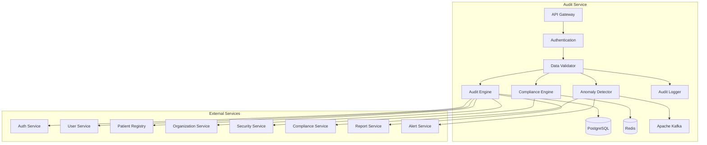

# MS Audit Service

The Audit Service manages comprehensive audit logging, compliance tracking, security monitoring, and regulatory reporting with Bangladesh healthcare compliance requirements.

## 📋 Service Overview

- **Repository**: [ms-audit-service](https://github.com/zs-his/ms-audit-service)
- **Status**: 🟡 In Progress
- **FHIR Resources: AuditEvent, Provenance, Consent
- **Primary Database**: PostgreSQL
- **Cache Layer**: Redis
- **Event Streaming**: Apache Kafka

## 🎯 Key Features

### Audit Management
- **Comprehensive Logging**: All system activities and data access
- **Security Monitoring**: Real-time security event tracking
- **Compliance Reporting**: Regulatory compliance reports
- **Data Provenance**: Complete data lineage tracking
- **Anomaly Detection**: Suspicious activity detection and alerting

### Bangladesh-Specific Features
- **DGHS Compliance**: Bangladesh health authority requirements
- **Data Privacy Laws**: Bangladesh Digital Security Act compliance
- **Medical Council Standards**: BMDC audit requirements
- **Healthcare Regulations**: Bangladesh healthcare sector regulations
- **Regional Compliance**: Division-specific compliance requirements

## 🏗️ Architecture



## 📊 Database Schema

### Audit Event Table
```sql
CREATE TABLE audit_events (
    id UUID PRIMARY KEY DEFAULT gen_random_uuid(),
    event_id VARCHAR(50) UNIQUE NOT NULL,
    event_type VARCHAR(50) NOT NULL,
    event_action VARCHAR(50) NOT NULL,
    event_timestamp TIMESTAMP NOT NULL,
    user_id UUID REFERENCES users(id),
    user_type VARCHAR(20),
    user_name VARCHAR(255),
    facility_id UUID REFERENCES organizations(id),
    facility_name VARCHAR(255),
    resource_type VARCHAR(50),
    resource_id VARCHAR(100),
    patient_id UUID REFERENCES patients(id),
    encounter_id UUID REFERENCES encounters(id),
    ip_address INET,
    user_agent TEXT,
    session_id VARCHAR(255),
    outcome VARCHAR(20) NOT NULL,
    description TEXT,
    details JSONB,
    sensitive_data_accessed JSONB,
    compliance_tags JSONB,
    created_at TIMESTAMP DEFAULT CURRENT_TIMESTAMP
);
```

### Compliance Report Table
```sql
CREATE TABLE compliance_reports (
    id UUID PRIMARY KEY DEFAULT gen_random_uuid(),
    report_id VARCHAR(50) UNIQUE NOT NULL,
    report_type VARCHAR(50) NOT NULL,
    report_period_start DATE NOT NULL,
    report_period_end DATE NOT NULL,
    facility_id UUID REFERENCES organizations(id),
    generated_by UUID REFERENCES users(id),
    generated_at TIMESTAMP NOT NULL,
    report_data JSONB NOT NULL,
    summary_stats JSONB,
    compliance_score DECIMAL(5,2),
    violations_count INTEGER DEFAULT 0,
    recommendations JSONB,
    status VARCHAR(20) DEFAULT 'generated',
    submitted_at TIMESTAMP,
    approved_by UUID REFERENCES users(id),
    approved_at TIMESTAMP,
    created_at TIMESTAMP DEFAULT CURRENT_TIMESTAMP
);
```

### Security Incident Table
```sql
CREATE TABLE security_incidents (
    id UUID PRIMARY KEY DEFAULT gen_random_uuid(),
    incident_id VARCHAR(50) UNIQUE NOT NULL,
    incident_type VARCHAR(50) NOT NULL,
    severity VARCHAR(20) NOT NULL,
    status VARCHAR(20) NOT NULL DEFAULT 'open',
    title VARCHAR(255) NOT NULL,
    description TEXT,
    detected_at TIMESTAMP NOT NULL,
    facility_id UUID REFERENCES organizations(id),
    affected_users JSONB,
    affected_resources JSONB,
    ip_addresses JSONB,
    attack_vector VARCHAR(100),
    mitigation_actions JSONB,
    resolved_by UUID REFERENCES users(id),
    resolved_at TIMESTAMP,
    impact_assessment JSONB,
    lessons_learned TEXT,
    created_at TIMESTAMP DEFAULT CURRENT_TIMESTAMP,
    updated_at TIMESTAMP DEFAULT CURRENT_TIMESTAMP
);
```

## 🔌 API Endpoints

### Audit Event Management
```go
// Create audit event
POST /api/audit/events
{
  "eventType": "data_access",
  "eventAction": "patient_record_view",
  "eventTimestamp": "2026-01-21T10:30:00+06:00",
  "userId": "user-123",
  "userType": "practitioner",
  "userName": "Dr. John Smith",
  "facilityId": "facility-456",
  "facilityName": "ZARISH Hospital Dhaka",
  "resourceType": "patient",
  "resourceId": "patient-789",
  "patientId": "patient-789",
  "ipAddress": "192.168.1.100",
  "userAgent": "Mozilla/5.0 (Windows NT 10.0; Win64; x64) AppleWebKit/537.36",
  "sessionId": "session-abc123",
  "outcome": "success",
  "description": "Practitioner accessed patient record for consultation",
  "details": {
    "accessPurpose": "clinical_consultation",
    "duration": "5 minutes",
    "pagesViewed": ["demographics", "vitals", "medications"]
  },
  "sensitiveDataAccessed": ["diagnosis", "medications"],
  "complianceTags": ["HIPAA", "BMDC", "DGHS"]
}

// Get audit event by ID
GET /api/audit/events/{id}

// Search audit events
GET /api/audit/events?user=123&facility=456&type=data_access&date=2026-01-21

// Get audit statistics
GET /api/audit/statistics?facility=456&period=weekly&start=2026-01-01&end=2026-01-31
```

### Compliance Management
```go
// Generate compliance report
POST /api/audit/compliance/reports
{
  "reportType": "monthly_compliance",
  "reportPeriodStart": "2026-01-01",
  "reportPeriodEnd": "2026-01-31",
  "facilityId": "facility-456",
  "complianceFrameworks": ["HIPAA", "BMDC", "DGHS", "Digital_Security_Act"]
}

// Get compliance report by ID
GET /api/audit/compliance/reports/{id}

// Search compliance reports
GET /api/audit/compliance/reports?facility=456&type=monthly_compliance&year=2026

// Submit compliance report
POST /api/audit/compliance/reports/{id}/submit
{
  "submittedBy": "user-123",
  "submissionNotes": "Monthly compliance report for January 2026"
}
```

### Security Incident Management
```go
// Create security incident
POST /api/audit/security/incidents
{
  "incidentType": "unauthorized_access",
  "severity": "high",
  "title": "Unauthorized patient data access attempt",
  "description": "Multiple failed login attempts detected from unusual IP address",
  "detectedAt": "2026-01-21T14:30:00+06:00",
  "facilityId": "facility-456",
  "affectedUsers": ["user-789"],
  "affectedResources": ["patient-123", "patient-124"],
  "ipAddresses": ["192.168.1.200", "10.0.0.50"],
  "attackVector": "brute_force_login"
}

// Get security incident by ID
GET /api/audit/security/incidents/{id}

// Search security incidents
GET /api/audit/security/incidents?facility=456&severity=high&status=open

// Update security incident
PUT /api/audit/security/incidents/{id}
{
  "status": "resolved",
  "mitigationActions": [
    "Blocked IP address",
    "Reset user passwords",
    "Enhanced monitoring"
  ],
  "resolvedBy": "user-456",
  "resolvedAt": "2026-01-21T16:00:00+06:00",
  "lessonsLearned": "Implement stronger IP-based access controls"
}
```

## 🏥 Bangladesh Audit Features

### Compliance Frameworks
```go
type BangladeshComplianceFramework struct {
    FrameworkCode    string    `json:"framework_code"`
    FrameworkName    string    `json:"framework_name"`
    Authority        string    `json:"authority"`
    Description      string    `json:"description"`
    Requirements     []string  `json:"requirements"`
    AuditFrequency   string    `json:"audit_frequency"`
    ReportingPeriod  string    `json:"reporting_period"`
    PenaltyFramework string    `json:"penalty_framework"`
    EffectiveFrom    time.Time `json:"effective_from"`
    UpdatedAt        time.Time `json:"updated_at"`
}

var BangladeshComplianceFrameworks = map[string]BangladeshComplianceFramework{
    "BMDC_GUIDELINES": {
        FrameworkCode:    "BMDC_GUIDELINES",
        FrameworkName:    "Bangladesh Medical & Dental Council Guidelines",
        Authority:        "Bangladesh Medical & Dental Council",
        Description:      "Medical practice and patient data handling guidelines",
        Requirements:     [
            "patient_privacy_protection",
            "medical_record_maintenance",
            "prescription_audit_trail",
            "informed_consent_documentation",
            "professional_conduct_standards"
        ],
        AuditFrequency:   "quarterly",
        ReportingPeriod:  "quarterly",
        PenaltyFramework: "medical_council_disciplinary",
        EffectiveFrom:    time.Date(2020, 1, 1, 0, 0, 0, 0, time.UTC),
        UpdatedAt:        time.Date(2024, 6, 1, 0, 0, 0, 0, time.UTC),
    },
    "DGHS_COMPLIANCE": {
        FrameworkCode:    "DGHS_COMPLIANCE",
        FrameworkName:    "Directorate General of Health Services Compliance",
        Authority:        "Directorate General of Health Services",
        Description:      "Public healthcare system compliance requirements",
        Requirements:     [
            "data_security_standards",
            "patient_record_management",
            "emergency_response_protocols",
            "infection_control_auditing",
            "public_health_reporting"
        ],
        AuditFrequency:   "monthly",
        ReportingPeriod:  "monthly",
        PenaltyFramework: "administrative_penalties",
        EffectiveFrom:    time.Date(2019, 7, 1, 0, 0, 0, 0, time.UTC),
        UpdatedAt:        time.Date(2024, 3, 15, 0, 0, 0, 0, time.UTC),
    },
    "DIGITAL_SECURITY_ACT": {
        FrameworkCode:    "DIGITAL_SECURITY_ACT",
        FrameworkName:    "Digital Security Act 2018",
        Authority:        "Digital Security Agency",
        Description:      "Digital data protection and cybersecurity requirements",
        Requirements:     [
            "personal_data_protection",
            "cybersecurity_standards",
            "data_breach_reporting",
            "access_control_auditing",
            "incident_response_procedures"
        ],
        AuditFrequency:   "semi_annual",
        ReportingPeriod:  "semi_annual",
        PenaltyFramework: "legal_penalties",
        EffectiveFrom:    time.Date(2018, 9, 22, 0, 0, 0, 0, time.UTC),
        UpdatedAt:        time.Date(2023, 10, 1, 0, 0, 0, 0, time.UTC),
    },
}
```

### Regional Compliance Requirements
```go
type RegionalCompliance struct {
    Division         string    `json:"division"`
    District         string    `json:"district"`
    SpecificRequirements []string `json:"specific_requirements"`
    LocalAuthorities []string  `json:"local_authorities"`
    AdditionalAudits []string  `json:"additional_audits"`
    CulturalFactors  []string  `json:"cultural_factors"`
}

var BangladeshRegionalCompliance = map[string]RegionalCompliance{
    "DHAKA_DIVISION": {
        Division: "Dhaka",
        District: "Dhaka",
        SpecificRequirements: [
            "urban_healthcare_standards",
            "high_volume_patient_management",
            "specialized_facility_auditing",
            "emergency_services_compliance"
        ],
        LocalAuthorities: [
            "Dhaka City Corporation",
            "Dhaka Medical College Hospital Authority",
            "Directorate General of Health Services (Dhaka Region)"
        ],
        AdditionalAudits: [
            "urban_healthcare_kpi_audit",
            "emergency_response_time_audit",
            "specialized_equipment_usage_audit"
        ],
        CulturalFactors: [
            "high_patient_volume_considerations",
            "multilingual_requirements",
            "urban_privacy_expectations"
        ],
    },
    "CHITTAGONG_DIVISION": {
        Division: "Chattogram",
        District: "Chattogram",
        SpecificRequirements: [
            "coastal_healthcare_standards",
            "port_city_health_regulations",
            "industrial_health_safety",
            "disaster_preparedness_auditing"
        ],
        LocalAuthorities: [
            "Chattogram City Corporation",
            "Chattogram Medical College Hospital Authority",
            "Port Health Authority"
        ],
        AdditionalAudits: [
            "industrial_health_safety_audit",
            "disaster_response_capability_audit",
            "port_health_compliance_audit"
        ],
        CulturalFactors: [
            "industrial_community_health_needs",
            "coastal_disease_patterns",
            "maritime_health_considerations"
        ],
    },
    "SYLHET_DIVISION": {
        Division: "Sylhet",
        District: "Sylhet",
        SpecificRequirements: [
            "tea_garden_healthcare_standards",
            "rural_outreach_program_auditing",
            "community_health_worker_compliance",
            "traditional_medicine_integration"
        ],
        LocalAuthorities: [
            "Sylhet City Corporation",
            "Sylhet Medical College Hospital Authority",
            "Tea Garden Health Authority"
        ],
        AdditionalAudits: [
            "rural_outreach_effectiveness_audit",
            "community_health_program_audit",
            "traditional_medicine_integration_audit"
        ],
        CulturalFactors: [
            "tea_garden_community_health_needs",
            "traditional_medicine_practices",
            "rural_healthcare_access_patterns"
        ],
    },
}
```

## 🔍 Search and Filtering

### Advanced Audit Search
```go
type AuditSearchCriteria struct {
    FacilityID        string    `json:"facility_id"`
    UserID            string    `json:"user_id"`
    UserType          string    `json:"user_type"`
    EventType         string    `json:"event_type"`
    EventAction       string    `json:"event_action"`
    ResourceType      string    `json:"resource_type"`
    PatientID         string    `json:"patient_id"`
    Outcome           string    `json:"outcome"`
    IPAddress         string    `json:"ip_address"`
    DateFrom          time.Time `json:"date_from"`
    DateTo            time.Time `json:"date_to"`
    ComplianceTags    []string  `json:"compliance_tags"`
    SensitiveData     bool      `json:"sensitive_data"`
}

func (s *AuditService) SearchAuditEvents(criteria AuditSearchCriteria) ([]AuditEvent, error) {
    query := s.db.NewSelect().Model(&AuditEvent{})
    
    if criteria.FacilityID != "" {
        query = query.Where("facility_id = ?", criteria.FacilityID)
    }
    
    if criteria.UserID != "" {
        query = query.Where("user_id = ?", criteria.UserID)
    }
    
    if criteria.EventType != "" {
        query = query.Where("event_type = ?", criteria.EventType)
    }
    
    if criteria.EventAction != "" {
        query = query.Where("event_action = ?", criteria.EventAction)
    }
    
    if criteria.ResourceType != "" {
        query = query.Where("resource_type = ?", criteria.ResourceType)
    }
    
    if criteria.PatientID != "" {
        query = query.Where("patient_id = ?", criteria.PatientID)
    }
    
    if criteria.Outcome != "" {
        query = query.Where("outcome = ?", criteria.Outcome)
    }
    
    if !criteria.DateFrom.IsZero() {
        query = query.Where("event_timestamp >= ?", criteria.DateFrom)
    }
    
    if !criteria.DateTo.IsZero() {
        query = query.Where("event_timestamp <= ?", criteria.DateTo)
    }
    
    if len(criteria.ComplianceTags) > 0 {
        for _, tag := range criteria.ComplianceTags {
            query = query.Where("compliance_tags @> ?", fmt.Sprintf(`["%s"]`, tag))
        }
    }
    
    var events []AuditEvent
    err := query.Scan(ctx, &events)
    return events, err
}
```

## 📈 Performance Optimization

### Caching Strategy
```go
// Cache compliance frameworks for 24 hours
func (s *AuditService) GetComplianceFrameworks() ([]BangladeshComplianceFramework, error) {
    cacheKey := "compliance_frameworks"
    
    if cached, err := s.cache.Get(cacheKey); err == nil {
        return cached.([]BangladeshComplianceFramework), nil
    }
    
    frameworks := s.getAllComplianceFrameworks()
    s.cache.Set(cacheKey, frameworks, 24*time.Hour)
    return frameworks, nil
}

// Cache audit statistics for 1 hour
func (s *AuditService) GetAuditStatistics(facilityID string, period string) (*AuditStatistics, error) {
    cacheKey := fmt.Sprintf("audit_stats:%s:%s", facilityID, period)
    
    if cached, err := s.cache.Get(cacheKey); err == nil {
        return cached.(*AuditStatistics), nil
    }
    
    stats, err := s.calculateAuditStatistics(facilityID, period)
    if err != nil {
        return nil, err
    }
    
    s.cache.Set(cacheKey, stats, time.Hour)
    return stats, nil
}
```

### Database Indexing
```sql
-- Performance indexes
CREATE INDEX idx_audit_events_user ON audit_events(user_id);
CREATE INDEX idx_audit_events_facility ON audit_events(facility_id);
CREATE INDEX idx_audit_events_type ON audit_events(event_type);
CREATE INDEX idx_audit_events_action ON audit_events(event_action);
CREATE INDEX idx_audit_events_timestamp ON audit_events(event_timestamp);
CREATE INDEX idx_audit_events_resource ON audit_events(resource_type, resource_id);
CREATE INDEX idx_audit_events_patient ON audit_events(patient_id);
CREATE INDEX idx_audit_events_outcome ON audit_events(outcome);
CREATE INDEX idx_audit_events_ip ON audit_events(ip_address);
CREATE INDEX idx_audit_events_compliance ON audit_events USING gin(compliance_tags);
CREATE INDEX idx_compliance_reports_facility ON compliance_reports(facility_id);
CREATE INDEX idx_compliance_reports_type ON compliance_reports(report_type);
CREATE INDEX idx_compliance_reports_period ON compliance_reports(report_period_start, report_period_end);
CREATE INDEX idx_security_incidents_facility ON security_incidents(facility_id);
CREATE INDEX idx_security_incidents_severity ON security_incidents(severity);
CREATE INDEX idx_security_incidents_status ON security_incidents(status);
CREATE INDEX idx_security_incidents_detected ON security_incidents(detected_at);
```

## 🔍 Audit Engine

### Real-time Audit Processing
```go
type AuditEngine struct {
    Processors       map[string]AuditProcessor
    EventQueue       chan AuditEvent
    BufferSize       int
    Workers          int
    BatchSize        int
    FlushInterval    time.Duration
}

type AuditProcessor interface {
    Process(event *AuditEvent) error
    GetProcessorType() string
    IsEnabled() bool
}

func (s *AuditService) ProcessAuditEvent(event *AuditEvent) error {
    // Validate audit event
    err := s.validateAuditEvent(event)
    if err != nil {
        return fmt.Errorf("audit event validation failed: %w", err)
    }
    
    // Enrich event with additional context
    err = s.enrichAuditEvent(event)
    if err != nil {
        return fmt.Errorf("failed to enrich audit event: %w", err)
    }
    
    // Apply compliance tags
    err = s.applyComplianceTags(event)
    if err != nil {
        log.Printf("Failed to apply compliance tags: %v", err)
    }
    
    // Send to processing queue
    s.auditEngine.EventQueue <- *event
    
    return nil
}

func (s *AuditService) enrichAuditEvent(event *AuditEvent) error {
    // Get user details if not provided
    if event.UserID != "" && event.UserName == "" {
        user, err := s.userService.GetUser(event.UserID)
        if err == nil {
            event.UserName = fmt.Sprintf("%s %s", user.FirstName, user.LastName)
            event.UserType = user.UserType
        }
    }
    
    // Get facility details if not provided
    if event.FacilityID != "" && event.FacilityName == "" {
        facility, err := s.organizationService.GetOrganization(event.FacilityID)
        if err == nil {
            event.FacilityName = facility.Name
        }
    }
    
    // Get patient details for compliance
    if event.PatientID != "" {
        patient, err := s.patientService.GetPatient(event.PatientID)
        if err == nil {
            // Add patient age group for compliance
            event.Details["patientAgeGroup"] = s.calculateAgeGroup(patient.DateOfBirth)
            event.Details["patientGender"] = patient.Gender
        }
    }
    
    return nil
}

func (s *AuditService) applyComplianceTags(event *AuditEvent) error {
    var tags []string
    
    // Apply HIPAA tags
    if s.isHIPAARelevant(event) {
        tags = append(tags, "HIPAA")
    }
    
    // Apply BMDC tags
    if s.isBMDCRelevant(event) {
        tags = append(tags, "BMDC")
    }
    
    // Apply DGHS tags
    if s.isDGHSRelevant(event) {
        tags = append(tags, "DGHS")
    }
    
    // Apply Digital Security Act tags
    if s.isDigitalSecurityActRelevant(event) {
        tags = append(tags, "Digital_Security_Act")
    }
    
    // Apply regional compliance tags
    if event.FacilityID != "" {
        regionalTags := s.getRegionalComplianceTags(event.FacilityID)
        tags = append(tags, regionalTags...)
    }
    
    event.ComplianceTags = tags
    return nil
}
```

## 🛡️ Anomaly Detection

### Security Anomaly Detection
```go
type AnomalyDetector struct {
    Rules            []AnomalyRule
    Thresholds       map[string]float64
    AlertChannels    []string
    LearningEnabled  bool
    ModelUpdateFreq  time.Duration
}

type AnomalyRule struct {
    RuleID       string `json:"rule_id"`
    RuleName     string `json:"rule_name"`
    Description  string `json:"description"`
    Condition    string `json:"condition"`
    Severity     string `json:"severity"`
    Enabled      bool   `json:"enabled"`
}

func (s *AuditService) DetectAnomalies(events []AuditEvent) ([]SecurityIncident, error) {
    var incidents []SecurityIncident
    
    // Check for various anomaly patterns
    for _, event := range events {
        // Check for unusual access patterns
        if incident := s.detectUnusualAccessPattern(event); incident != nil {
            incidents = append(incidents, *incident)
        }
        
        // Check for privilege escalation
        if incident := s.detectPrivilegeEscalation(event); incident != nil {
            incidents = append(incidents, *incident)
        }
        
        // Check for data exfiltration patterns
        if incident := s.detectDataExfiltration(event); incident != nil {
            incidents = append(incidents, *incident)
        }
        
        // Check for brute force attacks
        if incident := s.detectBruteForceAttack(event); incident != nil {
            incidents = append(incidents, *incident)
        }
    }
    
    return incidents, nil
}

func (s *AuditService) detectUnusualAccessPattern(event AuditEvent) *SecurityIncident {
    // Check for access from unusual IP addresses
    if s.isUnusualIPAddress(event.UserID, event.IPAddress.String()) {
        return &SecurityIncident{
            IncidentID:   generateID(),
            IncidentType: "unusual_access_pattern",
            Severity:     "medium",
            Title:        "Unusual IP address detected",
            Description:   fmt.Sprintf("User %s accessed from unusual IP: %s", event.UserName, event.IPAddress),
            DetectedAt:    time.Now(),
            FacilityID:    event.FacilityID,
            AffectedUsers: []string{event.UserID},
            IPAddresses:   []string{event.IPAddress.String()},
            AttackVector:  "unknown",
        }
    }
    
    // Check for access at unusual times
    if s.isUnusualAccessTime(event.EventTimestamp) {
        return &SecurityIncident{
            IncidentID:   generateID(),
            IncidentType: "unusual_access_pattern",
            Severity:     "low",
            Title:        "Unusual access time detected",
            Description:   fmt.Sprintf("User %s accessed system at unusual time: %s", event.UserName, event.EventTimestamp),
            DetectedAt:    time.Now(),
            FacilityID:    event.FacilityID,
            AffectedUsers: []string{event.UserID},
            AttackVector:  "unknown",
        }
    }
    
    return nil
}

func (s *AuditService) detectDataExfiltration(event AuditEvent) *SecurityIncident {
    // Check for large data downloads
    if event.EventType == "data_access" && event.EventAction == "bulk_export" {
        if s.isUnusualDataVolume(event.UserID, event.Details) {
            return &SecurityIncident{
                IncidentID:   generateID(),
                IncidentType: "potential_data_exfiltration",
                Severity:     "high",
                Title:        "Potential data exfiltration detected",
                Description:   fmt.Sprintf("User %s performed unusual bulk data export", event.UserName),
                DetectedAt:    time.Now(),
                FacilityID:    event.FacilityID,
                AffectedUsers: []string{event.UserID},
                AffectedResources: []string{event.ResourceID},
                AttackVector:  "data_export",
            }
        }
    }
    
    return nil
}
```

## 📊 Compliance Reporting

### Automated Compliance Reports
```go
type ComplianceEngine struct {
    Frameworks      map[string]ComplianceFramework
    ReportTemplates map[string]ReportTemplate
    ScheduleEngine  *ScheduleEngine
    Validators      []ComplianceValidator
}

func (s *AuditService) GenerateComplianceReport(reportType string, facilityID string, periodStart, periodEnd time.Time) (*ComplianceReport, error) {
    // Get compliance framework requirements
    framework, err := s.getComplianceFramework(reportType)
    if err != nil {
        return nil, fmt.Errorf("compliance framework not found: %w", err)
    }
    
    // Collect audit data for the period
    auditData, err := s.collectAuditData(facilityID, periodStart, periodEnd)
    if err != nil {
        return nil, fmt.Errorf("failed to collect audit data: %w", err)
    }
    
    // Analyze compliance
    complianceAnalysis, err := s.analyzeCompliance(auditData, framework)
    if err != nil {
        return nil, fmt.Errorf("compliance analysis failed: %w", err)
    }
    
    // Generate report
    report := &ComplianceReport{
        ReportID:          generateID(),
        ReportType:        reportType,
        ReportPeriodStart: periodStart,
        ReportPeriodEnd:   periodEnd,
        FacilityID:        facilityID,
        GeneratedAt:       time.Now(),
        ReportData:        complianceAnalysis,
        SummaryStats:      s.calculateSummaryStats(complianceAnalysis),
        ComplianceScore:   s.calculateComplianceScore(complianceAnalysis),
        ViolationsCount:   len(complianceAnalysis.Violations),
        Recommendations:   s.generateRecommendations(complianceAnalysis),
        Status:           "generated",
    }
    
    // Save report
    err = s.repository.CreateComplianceReport(report)
    if err != nil {
        return nil, fmt.Errorf("failed to save compliance report: %w", err)
    }
    
    return report, nil
}

func (s *AuditService) analyzeCompliance(auditData []AuditEvent, framework BangladeshComplianceFramework) (*ComplianceAnalysis, error) {
    analysis := &ComplianceAnalysis{
        Framework:    framework.FrameworkName,
        Requirements: make(map[string]RequirementAnalysis),
        Violations:   []Violation{},
        Score:        0.0,
    }
    
    // Analyze each requirement
    for _, requirement := range framework.Requirements {
        reqAnalysis := s.analyzeRequirement(auditData, requirement)
        analysis.Requirements[requirement] = reqAnalysis
        
        if !reqAnalysis.Compliant {
            analysis.Violations = append(analysis.Violations, Violation{
                Requirement:     requirement,
                Description:      reqAnalysis.ViolationDescription,
                Severity:         reqAnalysis.Severity,
                AffectedEvents:   reqAnalysis.AffectedEvents,
                Recommendation:    reqAnalysis.Recommendation,
            })
        }
    }
    
    // Calculate overall compliance score
    analysis.Score = s.calculateComplianceScore(analysis.Requirements)
    
    return analysis, nil
}
```

## 🔒 Security Features

### Access Control
```go
func (s *AuditService) CanAccessAuditData(userID, recordID string, action string) bool {
    // Check user permissions
    permissions := s.authService.GetUserPermissions(userID)
    
    switch action {
    case "read":
        return permissions.Contains("audit.read") || 
               s.canViewUserAuditData(userID, recordID)
    case "write":
        return permissions.Contains("audit.write") || 
               s.isAuthorizedAuditStaff(userID)
    case "compliance":
        return permissions.Contains("audit.compliance") || 
               s.isAuthorizedComplianceOfficer(userID)
    case "security":
        return permissions.Contains("audit.security") || 
               s.isAuthorizedSecurityStaff(userID)
    default:
        return false
    }
}

func (s *AuditService) isAuthorizedComplianceOfficer(userID string) bool {
    practitioner, err := s.practitionerService.GetPractitionerByUser(userID)
    if err != nil {
        return false
    }
    
    // Check if practitioner has compliance role
    for _, role := range practitioner.Roles {
        if role.Specialty == "compliance" || 
           role.Specialty == "quality_assurance" ||
           role.Specialty == "administration" {
            return true
        }
    }
    
    return false
}
```

### Data Privacy
```go
func (s *AuditService) anonymizeSensitiveAuditData(events []AuditEvent, requestUserID string) []AuditEvent {
    // Check if requester has full access
    if s.authService.HasFullAccess(requestUserID) {
        return events
    }
    
    // Anonymize sensitive audit information
    var anonymized []AuditEvent
    for _, event := range events {
        if s.isSensitiveAuditEvent(event) {
            // Remove sensitive details
            event.Details = nil
            event.SensitiveDataAccessed = nil
            event.IPAddress = nil
            event.UserAgent = ""
        }
        anonymized = append(anonymized, event)
    }
    
    return anonymized
}

func (s *AuditService) isSensitiveAuditEvent(event AuditEvent) bool {
    // Check for sensitive event types
    sensitiveTypes := []string{
        "psychiatric_record_access",
        "reproductive_health_access",
        "hiv_status_access",
        "genetic_information_access",
    }
    
    for _, sensitiveType := range sensitiveTypes {
        if event.EventType == sensitiveType {
            return true
        }
    }
    
    return false
}
```

## 📊 Monitoring and Metrics

### Health Checks
```go
func (s *AuditService) HealthCheck() map[string]interface{} {
    return map[string]interface{}{
        "database":             s.checkDatabase(),
        "cache":                s.checkCache(),
        "kafka":                s.checkKafka(),
        "audit_engine":         s.checkAuditEngine(),
        "compliance_engine":    s.checkComplianceEngine(),
        "anomaly_detector":      s.checkAnomalyDetector(),
        "user_service":         s.checkUserService(),
        "patient_service":       s.checkPatientService(),
        "security_service":      s.checkSecurityService(),
        "timestamp":            time.Now(),
    }
}
```

### Performance Metrics
```go
// Prometheus metrics
var (
    auditRequestsTotal = prometheus.NewCounterVec(
        prometheus.CounterOpts{
            Name: "audit_requests_total",
            Help: "Total number of audit requests",
        },
        []string{"method", "endpoint", "status"},
    )
    
    auditProcessingTime = prometheus.NewHistogramVec(
        prometheus.HistogramOpts{
            Name: "audit_processing_seconds",
            Help: "Time taken to process audit events",
        },
        []string{"event_type", "facility"},
    )
    
    complianceScore = prometheus.NewGaugeVec(
        prometheus.GaugeOpts{
            Name: "audit_compliance_score",
            Help: "Compliance score percentage",
        },
        []string{"framework", "facility"},
    )
)
```

## 🧪 Testing

### Unit Tests
```go
func TestAuditService_CreateAuditEvent(t *testing.T) {
    service := NewAuditService(mockRepo, mockCache, mockCompliance)
    
    event := &AuditEvent{
        EventType:      "data_access",
        EventAction:    "patient_record_view",
        EventTimestamp: time.Now(),
        UserID:         "user-123",
        UserName:       "Dr. John Smith",
        FacilityID:     "facility-456",
        ResourceType:    "patient",
        ResourceID:     "patient-789",
        PatientID:      "patient-789",
        IPAddress:      net.ParseIP("192.168.1.100"),
        UserAgent:      "Mozilla/5.0...",
        SessionID:      "session-abc123",
        Outcome:        "success",
        Description:    "Patient record access for consultation",
    }
    
    err := service.ProcessAuditEvent(event)
    
    assert.NoError(t, err)
    assert.NotEmpty(t, event.EventID)
    assert.NotEmpty(t, event.ComplianceTags)
}
```

## 🚀 Deployment

### Docker Configuration
```dockerfile
FROM golang:1.25-alpine AS builder

WORKDIR /app
COPY go.mod go.sum ./
RUN go mod download

COPY . .
RUN CGO_ENABLED=0 GOOS=linux go build -o main cmd/server/main.go

FROM alpine:latest
RUN apk --no-cache add ca-certificates
WORKDIR /root/
COPY --from=builder /app/main .
EXPOSE 8080
CMD ["./main"]
```

### Kubernetes Deployment
```yaml
apiVersion: apps/v1
kind: Deployment
metadata:
  name: ms-audit-service
spec:
  replicas: 3
  selector:
    matchLabels:
      app: ms-audit-service
  template:
    metadata:
      labels:
        app: ms-audit-service
    spec:
      containers:
      - name: ms-audit-service
        image: zarish-his/ms-audit-service:latest
        ports:
        - containerPort: 8080
        env:
        - name: DB_HOST
          value: "postgresql-service"
        - name: REDIS_HOST
          value: "redis-service"
        - name: KAFKA_BROKERS
          value: "kafka-service:9092"
        - name: COMPLIANCE_API_URL
          value: "https://compliance.gov.bd/api"
```

## 🔗 Related Resources

- **Frontend Integration**: [ESM Admin](../frontend/esm-admin.md)
- **FHIR Implementation**: [FHIR AuditEvent Profile](../fhir/audit-event-profile.md)
- **API Documentation**: [Audit API Reference](../api-reference/rest-apis.md)
- **Compliance Integration**: [Compliance Service Documentation](#)

---

*Last updated: 2026-01-21*
