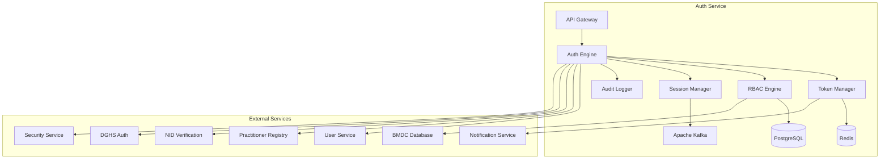

# MS Auth Service

The Authentication Service manages user authentication, authorization, role-based access control, and security operations with comprehensive Bangladesh healthcare compliance requirements.

## 📋 Service Overview

- **Repository**: [ms-auth-service](https://github.com/zs-his/ms-auth-service)
- **Status**: 🟡 In Progress
- **FHIR Resources**: Practitioner, Person, RelatedPerson
- **Primary Database**: PostgreSQL
- **Cache Layer**: Redis
- **Event Streaming**: Apache Kafka

## 🎯 Key Features

### Authentication Operations
- **User Authentication**: Multi-factor authentication support
- **Authorization**: Role-based access control (RBAC)
- **Session Management**: Secure session handling
- **Password Management**: Password policies and recovery
- **Token Management**: JWT token generation and validation

### Bangladesh-Specific Features
- **BMDC Integration**: Bangladesh Medical & Dental Council verification
- **DGHS Authentication**: Government healthcare staff authentication
- **National ID Integration**: Bangladesh NID verification
- **Healthcare Compliance**: Bangladesh healthcare data security standards
- **Regional Access Control**: Geographic-based access restrictions

## 🏗️ Architecture



## 📊 Database Schema

### User Table
```sql
CREATE TABLE users (
    id UUID PRIMARY KEY DEFAULT gen_random_uuid(),
    user_id VARCHAR(50) UNIQUE NOT NULL,
    username VARCHAR(100) UNIQUE NOT NULL,
    email VARCHAR(255) UNIQUE NOT NULL,
    phone_number VARCHAR(20) UNIQUE,
    password_hash VARCHAR(255) NOT NULL,
    salt VARCHAR(100) NOT NULL,
    first_name VARCHAR(100) NOT NULL,
    last_name VARCHAR(100) NOT NULL,
    user_type VARCHAR(50) NOT NULL,
    status VARCHAR(20) NOT NULL DEFAULT 'active',
    email_verified BOOLEAN DEFAULT false,
    phone_verified BOOLEAN DEFAULT false,
    mfa_enabled BOOLEAN DEFAULT false,
    mfa_secret VARCHAR(100),
    last_login TIMESTAMP,
    login_attempts INTEGER DEFAULT 0,
    locked_until TIMESTAMP,
    password_changed_at TIMESTAMP DEFAULT CURRENT_TIMESTAMP,
    created_at TIMESTAMP DEFAULT CURRENT_TIMESTAMP,
    updated_at TIMESTAMP DEFAULT CURRENT_TIMESTAMP,
    metadata JSONB
);
```

### Role Table
```sql
CREATE TABLE roles (
    id UUID PRIMARY KEY DEFAULT gen_random_uuid(),
    role_id VARCHAR(50) UNIQUE NOT NULL,
    role_name VARCHAR(100) NOT NULL,
    role_description TEXT,
    role_type VARCHAR(50) NOT NULL,
    permissions JSONB NOT NULL,
    is_system_role BOOLEAN DEFAULT false,
    is_active BOOLEAN DEFAULT true,
    created_at TIMESTAMP DEFAULT CURRENT_TIMESTAMP,
    updated_at TIMESTAMP DEFAULT CURRENT_TIMESTAMP,
    metadata JSONB
);
```

### User Role Table
```sql
CREATE TABLE user_roles (
    id UUID PRIMARY KEY DEFAULT gen_random_uuid(),
    user_id UUID REFERENCES users(id) ON DELETE CASCADE,
    role_id UUID REFERENCES roles(id) ON DELETE CASCADE,
    facility_id UUID REFERENCES organizations(id),
    assigned_by UUID REFERENCES users(id),
    assigned_at TIMESTAMP DEFAULT CURRENT_TIMESTAMP,
    expires_at TIMESTAMP,
    is_active BOOLEAN DEFAULT true,
    created_at TIMESTAMP DEFAULT CURRENT_TIMESTAMP,
    metadata JSONB,
    UNIQUE(user_id, role_id, facility_id)
);
```

### Session Table
```sql
CREATE TABLE sessions (
    id UUID PRIMARY KEY DEFAULT gen_random_uuid(),
    session_id VARCHAR(255) UNIQUE NOT NULL,
    user_id UUID REFERENCES users(id) ON DELETE CASCADE,
    facility_id UUID REFERENCES organizations(id),
    device_info JSONB,
    ip_address INET,
    user_agent TEXT,
    created_at TIMESTAMP DEFAULT CURRENT_TIMESTAMP,
    expires_at TIMESTAMP NOT NULL,
    last_activity TIMESTAMP DEFAULT CURRENT_TIMESTAMP,
    is_active BOOLEAN DEFAULT true,
    logout_at TIMESTAMP,
    metadata JSONB
);
```

## 🔌 API Endpoints

### Authentication
```go
// User login
POST /api/auth/login
{
  "username": "john.doe@zarish.com",
  "password": "SecurePassword123!",
  "mfaCode": "123456",
  "facilityId": "facility-123",
  "deviceInfo": {
    "deviceType": "web",
    "browser": "Chrome",
    "os": "Windows",
    "ipAddress": "192.168.1.100"
  }
}

// Response
{
  "accessToken": "eyJhbGciOiJIUzI1NiIsInR5cCI6IkpXVCJ9...",
  "refreshToken": "eyJhbGciOiJIUzI1NiIsInR5cCI6IkpXVCJ9...",
  "tokenType": "Bearer",
  "expiresIn": 3600,
  "user": {
    "userId": "user-123",
    "username": "john.doe@zarish.com",
    "firstName": "John",
    "lastName": "Doe",
    "userType": "practitioner",
    "roles": ["doctor", "clinical_staff"],
    "permissions": ["patient.read", "encounter.write", "medication.prescribe"]
  },
  "facility": {
    "facilityId": "facility-123",
    "facilityName": "ZARISH Hospital Dhaka"
  }
}

// Refresh token
POST /api/auth/refresh
{
  "refreshToken": "eyJhbGciOiJIUzI1NiIsInR5cCI6IkpXVCJ9..."
}

// Logout
POST /api/auth/logout
{
  "sessionId": "session-456"
}
```

### User Management
```go
// Create user
POST /api/auth/users
{
  "username": "jane.smith@zarish.com",
  "email": "jane.smith@zarish.com",
  "phoneNumber": "+8801712345678",
  "password": "SecurePassword123!",
  "firstName": "Jane",
  "lastName": "Smith",
  "userType": "practitioner",
  "roles": ["nurse"],
  "facilityId": "facility-123"
}

// Get user by ID
GET /api/auth/users/{id}

// Search users
GET /api/auth/users?facility=123&type=practitioner&status=active

// Update user
PUT /api/auth/users/{id}

// Change password
POST /api/auth/users/{id}/change-password
{
  "currentPassword": "OldPassword123!",
  "newPassword": "NewPassword123!"
}
```

### Role Management
```go
// Create role
POST /api/auth/roles
{
  "roleName": "Emergency Nurse",
  "roleDescription": "Emergency department nurse with triage capabilities",
  "roleType": "clinical",
  "permissions": {
    "patient": ["read", "update"],
    "encounter": ["read", "write"],
    "observation": ["read", "write"],
    "medication": ["read"],
    "emergency": ["triage", "priority_assignment"]
  }
}

// Get role by ID
GET /api/auth/roles/{id}

// Search roles
GET /api/auth/roles?type=clinical&active=true

// Assign role to user
POST /api/auth/users/{userId}/roles
{
  "roleId": "role-456",
  "facilityId": "facility-123",
  "expiresAt": "2026-12-31T23:59:59+06:00"
}
```

## 🏥 Bangladesh Authentication Features

### BMDC Integration
```go
type BMDCVerification struct {
    BMDCNumber      string    `json:"bmdc_number"`
    PractitionerName string    `json:"practitioner_name"`
    Specialization  string    `json:"specialization"`
    RegistrationDate time.Time `json:"registration_date"`
    ValidUntil      time.Time `json:"valid_until"`
    Status          string    `json:"status"`
    Verified        bool      `json:"verified"`
    VerificationDate time.Time `json:"verification_date"`
}

func (s *AuthService) VerifyBMDC(bmdcNumber string) (*BMDCVerification, error) {
    // Check cache first
    cacheKey := fmt.Sprintf("bmdc_verification:%s", bmdcNumber)
    if cached, err := s.cache.Get(cacheKey); err == nil {
        return cached.(*BMDCVerification), nil
    }
    
    // Call BMDC API
    verification, err := s.bmdcService.VerifyPractitioner(bmdcNumber)
    if err != nil {
        return nil, fmt.Errorf("BMDC verification failed: %w", err)
    }
    
    // Cache result for 24 hours
    s.cache.Set(cacheKey, verification, 24*time.Hour)
    
    return verification, nil
}

var BangladeshSpecializations = map[string][]string{
    "medicine": []string{
        "General Medicine",
        "Cardiology",
        "Nephrology",
        "Gastroenterology",
        "Endocrinology",
        "Pulmonology",
        "Rheumatology",
        "Hematology",
        "Infectious Diseases",
        "Neurology",
    },
    "surgery": []string{
        "General Surgery",
        "Cardiothoracic Surgery",
        "Neurosurgery",
        "Orthopedic Surgery",
        "Urology",
        "Plastic Surgery",
        "Pediatric Surgery",
        "Vascular Surgery",
        "Surgical Oncology",
    },
    "obstetrics_gynecology": []string{
        "Obstetrics & Gynecology",
        "Maternal-Fetal Medicine",
        "Reproductive Endocrinology",
        "Gynecologic Oncology",
        "Urogynecology",
    },
    "pediatrics": []string{
        "General Pediatrics",
        "Pediatric Cardiology",
        "Pediatric Neurology",
        "Pediatric Surgery",
        "Neonatology",
        "Pediatric Intensive Care",
    },
}
```

### National ID Integration
```go
type NIDVerification struct {
    NIDNumber      string    `json:"nid_number"`
    FullName       string    `json:"full_name"`
    DateOfBirth    time.Time `json:"date_of_birth"`
    Gender         string    `json:"gender"`
    PresentAddress string    `json:"present_address"`
    PermanentAddress string  `json:"permanent_address"`
    Verified       bool      `json:"verified"`
    VerificationDate time.Time `json:"verification_date"`
}

func (s *AuthService) VerifyNID(nidNumber string, dateOfBirth time.Time) (*NIDVerification, error) {
    // Validate NID format
    if !s.isValidNIDFormat(nidNumber) {
        return nil, fmt.Errorf("invalid NID format")
    }
    
    // Check cache first
    cacheKey := fmt.Sprintf("nid_verification:%s", nidNumber)
    if cached, err := s.cache.Get(cacheKey); err == nil {
        return cached.(*NIDVerification), nil
    }
    
    // Call NID verification API
    verification, err := s.nidService.VerifyCitizen(nidNumber, dateOfBirth)
    if err != nil {
        return nil, fmt.Errorf("NID verification failed: %w", err)
    }
    
    // Cache result for 7 days
    s.cache.Set(cacheKey, verification, 7*24*time.Hour)
    
    return verification, nil
}

func (s *AuthService) isValidNIDFormat(nidNumber string) bool {
    // Bangladesh NID is 10 or 13 digits
    nidPattern := regexp.MustCompile(`^\d{10}(\d{3})?$`)
    return nidPattern.MatchString(nidNumber)
}
```

## 🔍 Search and Filtering

### Advanced User Search
```go
type UserSearchCriteria struct {
    FacilityID     string    `json:"facility_id"`
    UserType       string    `json:"user_type"`
    Status         string    `json:"status"`
    Role           string    `json:"role"`
    EmailVerified  bool      `json:"email_verified"`
    PhoneVerified  bool      `json:"phone_verified"`
    MFAEnabled     bool      `json:"mfa_enabled"`
    CreatedFrom    time.Time `json:"created_from"`
    CreatedTo      time.Time `json:"created_to"`
    LastLoginFrom  time.Time `json:"last_login_from"`
    LastLoginTo    time.Time `json:"last_login_to"`
}

func (s *AuthService) SearchUsers(criteria UserSearchCriteria) ([]User, error) {
    query := s.db.NewSelect().Model(&User{})
    
    if criteria.FacilityID != "" {
        query = query.Join("JOIN user_roles ON users.id = user_roles.user_id").
                   Where("user_roles.facility_id = ?", criteria.FacilityID)
    }
    
    if criteria.UserType != "" {
        query = query.Where("user_type = ?", criteria.UserType)
    }
    
    if criteria.Status != "" {
        query = query.Where("status = ?", criteria.Status)
    }
    
    if criteria.EmailVerified {
        query = query.Where("email_verified = ?", criteria.EmailVerified)
    }
    
    if !criteria.CreatedFrom.IsZero() {
        query = query.Where("created_at >= ?", criteria.CreatedFrom)
    }
    
    if !criteria.CreatedTo.IsZero() {
        query = query.Where("created_at <= ?", criteria.CreatedTo)
    }
    
    var users []User
    err := query.Scan(ctx, &users)
    return users, err
}
```

## 📈 Performance Optimization

### Caching Strategy
```go
// Cache user permissions for 30 minutes
func (s *AuthService) GetUserPermissions(userID string) ([]string, error) {
    cacheKey := fmt.Sprintf("user_permissions:%s", userID)
    
    if cached, err := s.cache.Get(cacheKey); err == nil {
        return cached.([]string), nil
    }
    
    permissions, err := s.calculateUserPermissions(userID)
    if err != nil {
        return nil, err
    }
    
    s.cache.Set(cacheKey, permissions, 30*time.Minute)
    return permissions, nil
}

// Cache role definitions for 2 hours
func (s *AuthService) GetRoleDefinition(roleID string) (*Role, error) {
    cacheKey := fmt.Sprintf("role_definition:%s", roleID)
    
    if cached, err := s.cache.Get(cacheKey); err == nil {
        return cached.(*Role), nil
    }
    
    role, err := s.repository.GetRole(roleID)
    if err != nil {
        return nil, err
    }
    
    s.cache.Set(cacheKey, role, 2*time.Hour)
    return role, nil
}
```

### Database Indexing
```sql
-- Performance indexes
CREATE INDEX idx_users_username ON users(username);
CREATE INDEX idx_users_email ON users(email);
CREATE INDEX idx_users_phone ON users(phone_number);
CREATE INDEX idx_users_type ON users(user_type);
CREATE INDEX idx_users_status ON users(status);
CREATE INDEX idx_users_last_login ON users(last_login);
CREATE INDEX idx_roles_name ON roles(role_name);
CREATE INDEX idx_roles_type ON roles(role_type);
CREATE INDEX idx_user_roles_user ON user_roles(user_id);
CREATE INDEX idx_user_roles_role ON user_roles(role_id);
CREATE INDEX idx_user_roles_facility ON user_roles(facility_id);
CREATE INDEX idx_sessions_user ON sessions(user_id);
CREATE INDEX idx_sessions_expires ON sessions(expires_at);
CREATE INDEX idx_sessions_active ON sessions(is_active);
```

## 🔐 Authentication Engine

### Multi-Factor Authentication
```go
type MFAEngine struct {
    TOTPSecretLength int
    BackupCodesCount int
    Issuer          string
    TokenValidity   int
}

func (s *AuthService) EnableMFA(userID string) (*MFASetupResult, error) {
    // Generate TOTP secret
    secret, err := s.generateTOTPSecret()
    if err != nil {
        return nil, fmt.Errorf("failed to generate TOTP secret: %w", err)
    }
    
    // Generate backup codes
    backupCodes, err := s.generateBackupCodes()
    if err != nil {
        return nil, fmt.Errorf("failed to generate backup codes: %w", err)
    }
    
    // Generate QR code
    qrCode, err := s.generateQRCode(userID, secret)
    if err != nil {
        return nil, fmt.Errorf("failed to generate QR code: %w", err)
    }
    
    // Store MFA settings (not activated yet)
    err = s.repository.UpdateUserMFASettings(userID, secret, backupCodes, false)
    if err != nil {
        return nil, fmt.Errorf("failed to store MFA settings: %w", err)
    }
    
    return &MFASetupResult{
        Secret:     secret,
        QRCode:     qrCode,
        BackupCodes: backupCodes,
        Instructions: s.getMFASetupInstructions(),
    }, nil
}

func (s *AuthService) VerifyMFA(userID string, code string) (bool, error) {
    // Get user MFA settings
    user, err := s.repository.GetUser(userID)
    if err != nil {
        return false, err
    }
    
    if !user.MFAEnabled {
        return false, fmt.Errorf("MFA not enabled for user")
    }
    
    // Check backup codes first
    if s.isValidBackupCode(user.MFASecret, code) {
        err = s.markBackupCodeAsUsed(user.MFASecret, code)
        return err == nil, err
    }
    
    // Verify TOTP code
    return s.verifyTOTPCode(user.MFASecret, code)
}

func (s *AuthService) generateTOTPSecret() (string, error) {
    bytes := make([]byte, s.totpSecretLength)
    _, err := rand.Read(bytes)
    if err != nil {
        return "", err
    }
    
    return base32.StdEncoding.WithPadding(base32.NoPadding).EncodeToString(bytes), nil
}
```

### Password Management
```go
type PasswordPolicy struct {
    MinLength        int  `json:"min_length"`
    RequireUppercase bool  `json:"require_uppercase"`
    RequireLowercase bool  `json:"require_lowercase"`
    RequireNumbers   bool  `json:"require_numbers"`
    RequireSpecial   bool  `json:"require_special"`
    MaxAge           int  `json:"max_age_days"`
    HistoryCount     int  `json:"history_count"`
    PreventReuse     bool  `json:"prevent_reuse"`
}

var BangladeshPasswordPolicy = PasswordPolicy{
    MinLength:        12,
    RequireUppercase: true,
    RequireLowercase: true,
    RequireNumbers:   true,
    RequireSpecial:   true,
    MaxAge:           90,
    HistoryCount:     5,
    PreventReuse:     true,
}

func (s *AuthService) ValidatePassword(password string, userID string) error {
    // Check password policy
    err := s.validatePasswordPolicy(password)
    if err != nil {
        return err
    }
    
    // Check password history
    if s.passwordPolicy.PreventReuse {
        err = s.checkPasswordHistory(userID, password)
        if err != nil {
            return err
        }
    }
    
    // Check for common passwords
    if s.isCommonPassword(password) {
        return fmt.Errorf("password is too common")
    }
    
    return nil
}

func (s *AuthService) validatePasswordPolicy(password string) error {
    policy := s.passwordPolicy
    
    if len(password) < policy.MinLength {
        return fmt.Errorf("password must be at least %d characters long", policy.MinLength)
    }
    
    if policy.RequireUppercase && !regexp.MustCompile(`[A-Z]`).MatchString(password) {
        return fmt.Errorf("password must contain at least one uppercase letter")
    }
    
    if policy.RequireLowercase && !regexp.MustCompile(`[a-z]`).MatchString(password) {
        return fmt.Errorf("password must contain at least one lowercase letter")
    }
    
    if policy.RequireNumbers && !regexp.MustCompile(`[0-9]`).MatchString(password) {
        return fmt.Errorf("password must contain at least one number")
    }
    
    if policy.RequireSpecial && !regexp.MustCompile(`[!@#$%^&*(),.?":{}|<>]`).MatchString(password) {
        return fmt.Errorf("password must contain at least one special character")
    }
    
    return nil
}
```

## 🛡️ Security Features

### Rate Limiting
```go
type RateLimiter struct {
    LoginAttempts    map[string]*LoginAttempt
    MaxAttempts      int
    LockoutDuration  time.Duration
    CleanupInterval  time.Duration
}

type LoginAttempt struct {
    IPAddress   string
    Username    string
    Attempts    int
    FirstAttempt time.Time
    LastAttempt  time.Time
    LockedUntil time.Time
}

func (s *AuthService) CheckRateLimit(username, ipAddress string) error {
    key := fmt.Sprintf("%s:%s", username, ipAddress)
    
    attempt, exists := s.rateLimiter.LoginAttempts[key]
    if !exists {
        return nil
    }
    
    // Check if currently locked out
    if time.Now().Before(attempt.LockedUntil) {
        return fmt.Errorf("account locked until %s", attempt.LockedUntil.Format("2006-01-02 15:04:05"))
    }
    
    // Check if too many attempts
    if attempt.Attempts >= s.rateLimiter.MaxAttempts {
        // Lock the account
        attempt.LockedUntil = time.Now().Add(s.rateLimiter.LockoutDuration)
        s.rateLimiter.LoginAttempts[key] = attempt
        
        return fmt.Errorf("too many login attempts, account locked for %v", s.rateLimiter.LockoutDuration)
    }
    
    return nil
}

func (s *AuthService) RecordFailedAttempt(username, ipAddress string) {
    key := fmt.Sprintf("%s:%s", username, ipAddress)
    
    attempt, exists := s.rateLimiter.LoginAttempts[key]
    if !exists {
        attempt = &LoginAttempt{
            IPAddress:   ipAddress,
            Username:    username,
            Attempts:    0,
            FirstAttempt: time.Now(),
        }
    }
    
    attempt.Attempts++
    attempt.LastAttempt = time.Now()
    
    s.rateLimiter.LoginAttempts[key] = attempt
}
```

### Session Security
```go
type SessionSecurity struct {
    MaxSessionsPerUser int
    SessionTimeout     time.Duration
    IdleTimeout        time.Duration
    RequireReauth      bool
}

func (s *AuthService) ValidateSession(sessionID string, ipAddress string, userAgent string) (*Session, error) {
    // Get session from database
    session, err := s.repository.GetSession(sessionID)
    if err != nil {
        return nil, fmt.Errorf("session not found")
    }
    
    // Check if session is active
    if !session.IsActive {
        return nil, fmt.Errorf("session is inactive")
    }
    
    // Check if session has expired
    if time.Now().After(session.ExpiresAt) {
        return nil, fmt.Errorf("session has expired")
    }
    
    // Check for suspicious activity
    if s.isSuspiciousActivity(session, ipAddress, userAgent) {
        // Invalidate session and notify user
        s.invalidateSession(sessionID)
        s.sendSecurityAlert(session.UserID, "Suspicious activity detected")
        return nil, fmt.Errorf("suspicious activity detected, session invalidated")
    }
    
    // Update last activity
    session.LastActivity = time.Now()
    err = s.repository.UpdateSession(session)
    if err != nil {
        return nil, fmt.Errorf("failed to update session: %w", err)
    }
    
    return session, nil
}

func (s *AuthService) isSuspiciousActivity(session *Session, ipAddress string, userAgent string) bool {
    // Check IP address change
    if session.IPAddress.String() != ipAddress {
        return true
    }
    
    // Check user agent change
    if session.UserAgent != userAgent {
        return true
    }
    
    // Check for concurrent sessions from different locations
    concurrentSessions, err := s.repository.GetActiveSessionsForUser(session.UserID)
    if err == nil {
        uniqueIPs := make(map[string]bool)
        for _, s := range concurrentSessions {
            uniqueIPs[s.IPAddress.String()] = true
        }
        
        if len(uniqueIPs) > 2 {
            return true
        }
    }
    
    return false
}
```

## 📊 Monitoring and Metrics

### Health Checks
```go
func (s *AuthService) HealthCheck() map[string]interface{} {
    return map[string]interface{}{
        "database":          s.checkDatabase(),
        "cache":             s.checkCache(),
        "kafka":             s.checkKafka(),
        "auth_engine":       s.checkAuthEngine(),
        "token_manager":     s.checkTokenManager(),
        "rbac_engine":       s.checkRBACEngine(),
        "session_manager":   s.checkSessionManager(),
        "bmdc_service":      s.checkBMDCService(),
        "nid_service":       s.checkNIDService(),
        "timestamp":         time.Now(),
    }
}
```

### Performance Metrics
```go
// Prometheus metrics
var (
    authRequestsTotal = prometheus.NewCounterVec(
        prometheus.CounterOpts{
            Name: "auth_requests_total",
            Help: "Total number of authentication requests",
        },
        []string{"method", "endpoint", "status"},
    )
    
    loginProcessingTime = prometheus.NewHistogramVec(
        prometheus.HistogramOpts{
            Name: "auth_login_processing_seconds",
            Help: "Time taken to process login requests",
        },
        []string{"auth_method", "status"},
    )
    
    activeSessionsTotal = prometheus.NewGaugeVec(
        prometheus.GaugeOpts{
            Name: "auth_active_sessions_total",
            Help: "Total number of active sessions",
        },
        []string{"facility", "user_type"},
    )
)
```

## 🧪 Testing

### Unit Tests
```go
func TestAuthService_Login(t *testing.T) {
    service := NewAuthService(mockRepo, mockCache, mockBMDC)
    
    // Create test user
    user := &User{
        Username:     "test@example.com",
        Email:        "test@example.com",
        PasswordHash: "hashed_password",
        Salt:         "salt",
        UserType:     "practitioner",
        Status:       "active",
        EmailVerified: true,
    }
    
    // Mock login request
    loginReq := &LoginRequest{
        Username:    "test@example.com",
        Password:    "password123",
        FacilityID:  "facility-123",
        DeviceInfo:  DeviceInfo{DeviceType: "web"},
    }
    
    result, err := service.Login(loginReq)
    
    assert.NoError(t, err)
    assert.NotNil(t, result)
    assert.NotEmpty(t, result.AccessToken)
    assert.NotEmpty(t, result.RefreshToken)
    assert.Equal(t, "Bearer", result.TokenType)
    assert.Equal(t, 3600, result.ExpiresIn)
}
```

## 🚀 Deployment

### Docker Configuration
```dockerfile
FROM golang:1.25-alpine AS builder

WORKDIR /app
COPY go.mod go.sum ./
RUN go mod download

COPY . .
RUN CGO_ENABLED=0 GOOS=linux go build -o main cmd/server/main.go

FROM alpine:latest
RUN apk --no-cache add ca-certificates
WORKDIR /root/
COPY --from=builder /app/main .
EXPOSE 8080
CMD ["./main"]
```

### Kubernetes Deployment
```yaml
apiVersion: apps/v1
kind: Deployment
metadata:
  name: ms-auth-service
spec:
  replicas: 3
  selector:
    matchLabels:
      app: ms-auth-service
  template:
    metadata:
      labels:
        app: ms-auth-service
    spec:
      containers:
      - name: ms-auth-service
        image: zarish-his/ms-auth-service:latest
        ports:
        - containerPort: 8080
        env:
        - name: DB_HOST
          value: "postgresql-service"
        - name: REDIS_HOST
          value: "redis-service"
        - name: KAFKA_BROKERS
          value: "kafka-service:9092"
        - name: BMDC_API_URL
          value: "https://bmdc.org.bd/api"
        - name: NID_API_URL
          value: "https://nid.gov.bd/api"
        - name: JWT_SECRET
          valueFrom:
            secretKeyRef:
              name: auth-secrets
              key: jwt-secret
```

## 🔗 Related Resources

- **Frontend Integration**: [ESM Admin](../frontend/esm-admin.md)
- **FHIR Implementation**: [FHIR Practitioner Profile](../fhir/practitioner-profile.md)
- **API Documentation**: [Auth API Reference](../api-reference/rest-apis.md)
- **BMDC Integration**: [BMDC Service Documentation](#)

---

*Last updated: 2026-01-21*
