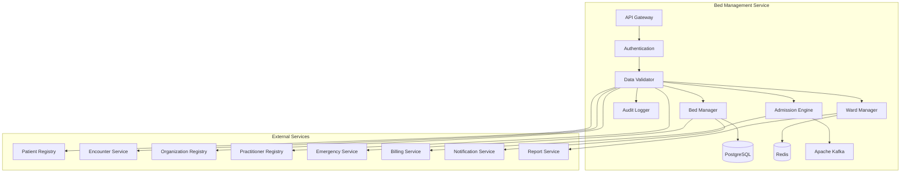

# MS Bed Management Service

The Bed Management Service manages hospital bed allocation, patient admissions, bed availability, and ward operations with comprehensive Bangladesh healthcare facility management.

## 📋 Service Overview

- **Repository**: [ms-bed-management-service](https://github.com/zs-his/ms-bed-management-service)
- **Status**: 🟡 In Progress
- **FHIR Resources**: Location, Encounter, Slot
- **Primary Database**: PostgreSQL
- **Cache Layer**: Redis
- **Event Streaming**: Apache Kafka

## 🎯 Key Features

### Bed Management
- **Bed Allocation**: Real-time bed assignment and management
- **Ward Management**: Hospital ward and unit operations
- **Patient Admissions**: Admission and discharge workflows
- **Bed Availability**: Live bed status and availability tracking
- **Transfer Management**: Inter-ward patient transfers

### Bangladesh-Specific Features
- **Government Hospital Beds**: Public sector bed management
- **Private Hospital Beds**: Private healthcare facility management
- **Regional Bed Distribution**: Bangladesh healthcare capacity planning
- **Emergency Bed Allocation**: Disaster response bed management
- **Bed Classification**: Bangladesh standard bed categories

## 🏗️ Architecture



## 📊 Database Schema

### Bed Table
```sql
CREATE TABLE beds (
    id UUID PRIMARY KEY DEFAULT gen_random_uuid(),
    bed_id VARCHAR(50) UNIQUE NOT NULL,
    facility_id UUID REFERENCES organizations(id),
    ward_id UUID REFERENCES wards(id),
    room_number VARCHAR(20) NOT NULL,
    bed_number VARCHAR(20) NOT NULL,
    bed_type VARCHAR(50) NOT NULL,
    bed_status VARCHAR(20) NOT NULL DEFAULT 'available',
    bed_class VARCHAR(20) NOT NULL,
    gender_preference VARCHAR(20),
    age_group_preference VARCHAR(20),
    special_features JSONB,
    equipment JSONB,
    current_patient_id UUID REFERENCES patients(id),
    current_encounter_id UUID REFERENCES encounters(id),
    admission_date TIMESTAMP,
    expected_discharge_date TIMESTAMP,
    cleaning_status VARCHAR(20) DEFAULT 'clean',
    maintenance_status VARCHAR(20) DEFAULT 'operational',
    last_cleaned TIMESTAMP,
    next_maintenance DATE,
    created_at TIMESTAMP DEFAULT CURRENT_TIMESTAMP,
    updated_at TIMESTAMP DEFAULT CURRENT_TIMESTAMP,
    metadata JSONB
);
```

### Ward Table
```sql
CREATE TABLE wards (
    id UUID PRIMARY KEY DEFAULT gen_random_uuid(),
    ward_id VARCHAR(50) UNIQUE NOT NULL,
    facility_id UUID REFERENCES organizations(id),
    ward_name VARCHAR(100) NOT NULL,
    ward_type VARCHAR(50) NOT NULL,
    ward_class VARCHAR(20) NOT NULL,
    total_beds INTEGER NOT NULL DEFAULT 0,
    available_beds INTEGER NOT NULL DEFAULT 0,
    occupied_beds INTEGER NOT NULL DEFAULT 0,
    reserved_beds INTEGER NOT NULL DEFAULT 0,
    under_maintenance INTEGER NOT NULL DEFAULT 0,
    head_nurse UUID REFERENCES practitioners(id),
    location JSONB,
    contact_number VARCHAR(20),
    visiting_hours JSONB,
    special_instructions TEXT,
    created_at TIMESTAMP DEFAULT CURRENT_TIMESTAMP,
    updated_at TIMESTAMP DEFAULT CURRENT_TIMESTAMP,
    metadata JSONB
);
```

### Bed Assignment Table
```sql
CREATE TABLE bed_assignments (
    id UUID PRIMARY KEY DEFAULT gen_random_uuid(),
    assignment_id VARCHAR(50) UNIQUE NOT NULL,
    bed_id UUID REFERENCES beds(id),
    patient_id UUID REFERENCES patients(id),
    encounter_id UUID REFERENCES encounters(id),
    facility_id UUID REFERENCES organizations(id),
    assignment_type VARCHAR(20) NOT NULL,
    assignment_status VARCHAR(20) NOT NULL DEFAULT 'active',
    assigned_by UUID REFERENCES practitioners(id),
    assigned_at TIMESTAMP NOT NULL,
    expected_discharge_date TIMESTAMP,
    actual_discharge_date TIMESTAMP,
    discharge_reason VARCHAR(50),
    discharge_by UUID REFERENCES practitioners(id),
    notes TEXT,
    created_at TIMESTAMP DEFAULT CURRENT_TIMESTAMP,
    updated_at TIMESTAMP DEFAULT CURRENT_TIMESTAMP,
    metadata JSONB
);
```

## 🔌 API Endpoints

### Bed Management
```go
// Create bed
POST /api/bed-management/beds
{
  "bedId": "BED-001",
  "facilityId": "facility-123",
  "wardId": "ward-456",
  "roomNumber": "101",
  "bedNumber": "A",
  "bedType": "general",
  "bedStatus": "available",
  "bedClass": "economy",
  "genderPreference": "any",
  "ageGroupPreference": "adult",
  "specialFeatures": {
    "oxygen_support": true,
    "iv_drip": true,
    "monitor": false
  },
  "equipment": {
    "bedside_table": true,
    "overbed_table": true,
    "call_bell": true,
    "oxygen_outlet": true
  },
  "cleaningStatus": "clean",
  "maintenanceStatus": "operational"
}

// Get bed by ID
GET /api/bed-management/beds/{id}

// Search beds
GET /api/bed-management/beds?facility=123&ward=456&status=available&type=general

// Update bed
PUT /api/bed-management/beds/{id}

// Assign bed to patient
POST /api/bed-management/beds/{id}/assign
{
  "patientId": "patient-789",
  "encounterId": "encounter-101",
  "assignmentType": "admission",
  "assignedBy": "practitioner-202",
  "expectedDischargeDate": "2026-01-28T10:00:00+06:00",
  "notes": "Routine admission for pneumonia treatment"
}
```

### Ward Management
```go
// Create ward
POST /api/bed-management/wards
{
  "wardId": "WARD-001",
  "facilityId": "facility-123",
  "wardName": "General Ward A",
  "wardType": "general",
  "wardClass": "economy",
  "totalBeds": 50,
  "headNurse": {"reference": "Practitioner/303"},
  "location": {
    "building": "Main Building",
    "floor": "3rd Floor",
    "wing": "East Wing"
  },
  "contactNumber": "+880-2-1234567",
  "visitingHours": {
    "morning": "10:00-12:00",
    "evening": "16:00-18:00"
  },
  "specialInstructions": "No visitors after 8 PM"
}

// Get ward by ID
GET /api/bed-management/wards/{id}

// Search wards
GET /api/bed-management/wards?facility=123&type=general&class=economy

// Update ward statistics
PUT /api/bed-management/wards/{id}/statistics
{
  "totalBeds": 50,
  "availableBeds": 15,
  "occupiedBeds": 30,
  "reservedBeds": 3,
  "underMaintenance": 2
}
```

### Patient Admissions
```go
// Create admission
POST /api/bed-management/admissions
{
  "patientId": "patient-789",
  "encounterId": "encounter-101",
  "facilityId": "facility-123",
  "admissionType": "routine",
  "admissionPriority": "routine",
  "preferredWardType": "general",
  "preferredBedClass": "economy",
  "medicalRequirements": {
    "oxygen_support": true,
    "iv_drip": true,
    "monitor": false
  },
  "specialNeeds": {
    "wheelchair_access": true,
    "ground_floor": false
  },
  "expectedLengthOfStay": 7,
  "admissionReason": "Pneumonia treatment",
  "admittingPhysician": {"reference": "Practitioner/202"},
  "requestedBy": {"reference": "Practitioner/202"}
}

// Get admission by ID
GET /api/bed-management/admissions/{id}

// Search admissions
GET /api/bed-management/admissions?facility=123&status=active&date=2026-01-21

// Process discharge
POST /api/bed-management/admissions/{id}/discharge
{
  "dischargeType": "routine",
  "dischargeReason": "Treatment completed",
  "dischargeBy": "practitioner-202",
  "dischargeDate": "2026-01-28T10:00:00+06:00",
  "finalDiagnosis": "Community-acquired pneumonia - resolved",
  "dischargeInstructions": "Complete antibiotics course, follow-up in 1 week"
}
```

## 🏥 Bangladesh Bed Management Features

### Bed Classification System
```go
type BedClassification struct {
    BedClass        string  `json:"bed_class"`
    ClassName       string  `json:"class_name"`
    Description     string  `json:"description"`
    Features        []string `json:"features"`
    PricePerDay    float64 `json:"price_per_day"`
    AvailableInGovt bool    `json:"available_in_govt"`
    AvailableInPrivate bool `json:"available_in_private"`
    PopularInBD    bool    `json:"popular_in_bd"`
}

var BangladeshBedClasses = map[string]BedClassification{
    "ECONOMY": {
        BedClass:        "ECONOMY",
        ClassName:       "Economy Class",
        Description:     "Basic accommodation with shared facilities",
        Features:        []string{"basic_bed", "shared_bathroom", "common_area"},
        PricePerDay:    500.00,
        AvailableInGovt: true,
        AvailableInPrivate: true,
        PopularInBD:    true,
    },
    "SEMI_PRIVATE": {
        BedClass:        "SEMI_PRIVATE",
        ClassName:       "Semi-Private",
        Description:     "2-3 patients per room with shared bathroom",
        Features:        []string{"comfortable_bed", "shared_bathroom", "tv", "wardrobe"},
        PricePerDay:    1500.00,
        AvailableInGovt: false,
        AvailableInPrivate: true,
        PopularInBD:    true,
    },
    "PRIVATE": {
        BedClass:        "PRIVATE",
        ClassName:       "Private Room",
        Description:     "Single room with private bathroom",
        Features:        []string{"private_bed", "private_bathroom", "tv", "refrigerator", "sofa"},
        PricePerDay:    3000.00,
        AvailableInGovt: false,
        AvailableInPrivate: true,
        PopularInBD:    true,
    },
    "DELUXE": {
        BedClass:        "DELUXE",
        ClassName:       "Deluxe Suite",
        Description:     "Luxury suite with premium amenities",
        Features:        []string{"luxury_bed", "private_bathroom", "living_area", "kitchenette", "premium_view"},
        PricePerDay:    8000.00,
        AvailableInGovt: false,
        AvailableInPrivate: true,
        PopularInBD:    false,
    },
    "ICU": {
        BedClass:        "ICU",
        ClassName:       "Intensive Care Unit",
        Description:     "Critical care with advanced monitoring",
        Features:        []string{"advanced_monitoring", "ventilator_support", "critical_care_nursing", "isolation"},
        PricePerDay:    10000.00,
        AvailableInGovt: true,
        AvailableInPrivate: true,
        PopularInBD:    true,
    },
    "CCU": {
        BedClass:        "CCU",
        ClassName:       "Coronary Care Unit",
        Description:     "Specialized cardiac care",
        Features:        []string{"cardiac_monitoring", "emergency_equipment", "cardiac_nursing"},
        PricePerDay:    8000.00,
        AvailableInGovt: true,
        AvailableInPrivate: true,
        PopularInBD:    true,
    },
}
```

### Ward Types and Specializations
```go
type WardType struct {
    WardCode        string    `json:"ward_code"`
    WardName        string    `json:"ward_name"`
    Specialization  string    `json:"specialization"`
    CapacityRange   string    `json:"capacity_range"`
    StaffingLevel   string    `json:"staffing_level"`
    EquipmentLevel  string    `json:"equipment_level"`
    CommonInBD      bool      `json:"common_in_bd"`
    GovtHospitals   bool      `json:"govt_hospitals"`
    PrivateHospitals bool     `json:"private_hospitals"`
}

var BangladeshWardTypes = map[string]WardType{
    "GENERAL": {
        WardCode:        "GENERAL",
        WardName:        "General Ward",
        Specialization:  "general_medicine",
        CapacityRange:   "30-60 beds",
        StaffingLevel:   "medium",
        EquipmentLevel:  "basic",
        CommonInBD:      true,
        GovtHospitals:   true,
        PrivateHospitals: true,
    },
    "SURGICAL": {
        WardCode:        "SURGICAL",
        WardName:        "Surgical Ward",
        Specialization:  "surgery",
        CapacityRange:   "20-40 beds",
        StaffingLevel:   "high",
        EquipmentLevel:  "advanced",
        CommonInBD:      true,
        GovtHospitals:   true,
        PrivateHospitals: true,
    },
    "MATERNITY": {
        WardCode:        "MATERNITY",
        WardName:        "Maternity Ward",
        Specialization:  "obstetrics_gynecology",
        CapacityRange:   "15-30 beds",
        StaffingLevel:   "high",
        EquipmentLevel:  "specialized",
        CommonInBD:      true,
        GovtHospitals:   true,
        PrivateHospitals: true,
    },
    "PEDIATRIC": {
        WardCode:        "PEDIATRIC",
        WardName:        "Pediatric Ward",
        Specialization:  "pediatrics",
        CapacityRange:   "20-40 beds",
        StaffingLevel:   "high",
        EquipmentLevel:  "specialized",
        CommonInBD:      true,
        GovtHospitals:   true,
        PrivateHospitals: true,
    },
    "ICU": {
        WardCode:        "ICU",
        WardName:        "Intensive Care Unit",
        Specialization:  "critical_care",
        CapacityRange:   "8-20 beds",
        StaffingLevel:   "very_high",
        EquipmentLevel:  "critical",
        CommonInBD:      true,
        GovtHospitals:   true,
        PrivateHospitals: true,
    },
    "ISOLATION": {
        WardCode:        "ISOLATION",
        WardName:        "Isolation Ward",
        Specialization:  "infectious_diseases",
        CapacityRange:   "5-15 beds",
        StaffingLevel:   "high",
        EquipmentLevel:  "specialized",
        CommonInBD:      true,
        GovtHospitals:   true,
        PrivateHospitals: false,
    },
}
```

## 🔍 Search and Filtering

### Advanced Bed Search
```go
type BedSearchCriteria struct {
    FacilityID       string    `json:"facility_id"`
    WardID           string    `json:"ward_id"`
    BedType          string    `json:"bed_type"`
    BedStatus        string    `json:"bed_status"`
    BedClass         string    `json:"bed_class"`
    GenderPreference string    `json:"gender_preference"`
    AgeGroupPreference string  `json:"age_group_preference"`
    HasFeatures      []string  `json:"has_features"`
    AvailableFrom    time.Time `json:"available_from"`
    AvailableTo      time.Time `json:"available_to"`
}

func (s *BedManagementService) SearchBeds(criteria BedSearchCriteria) ([]Bed, error) {
    query := s.db.NewSelect().Model(&Bed{})
    
    if criteria.FacilityID != "" {
        query = query.Where("facility_id = ?", criteria.FacilityID)
    }
    
    if criteria.WardID != "" {
        query = query.Where("ward_id = ?", criteria.WardID)
    }
    
    if criteria.BedStatus != "" {
        query = query.Where("bed_status = ?", criteria.BedStatus)
    }
    
    if criteria.BedClass != "" {
        query = query.Where("bed_class = ?", criteria.BedClass)
    }
    
    if len(criteria.HasFeatures) > 0 {
        for _, feature := range criteria.HasFeatures {
            query = query.Where("special_features @> ?", fmt.Sprintf(`{"%s": true}`, feature))
        }
    }
    
    var beds []Bed
    err := query.Scan(ctx, &beds)
    return beds, err
}
```

## 📈 Performance Optimization

### Caching Strategy
```go
// Cache bed availability for 5 minutes
func (s *BedManagementService) GetBedAvailability(facilityID string) (*BedAvailability, error) {
    cacheKey := fmt.Sprintf("bed_availability:%s", facilityID)
    
    if cached, err := s.cache.Get(cacheKey); err == nil {
        return cached.(*BedAvailability), nil
    }
    
    availability, err := s.calculateBedAvailability(facilityID)
    if err != nil {
        return nil, err
    }
    
    s.cache.Set(cacheKey, availability, 5*time.Minute)
    return availability, nil
}

// Cache ward statistics for 10 minutes
func (s *BedManagementService) GetWardStatistics(facilityID string) ([]WardStatistics, error) {
    cacheKey := fmt.Sprintf("ward_statistics:%s", facilityID)
    
    if cached, err := s.cache.Get(cacheKey); err == nil {
        return cached.([]WardStatistics), nil
    }
    
    statistics, err := s.calculateWardStatistics(facilityID)
    if err != nil {
        return nil, err
    }
    
    s.cache.Set(cacheKey, statistics, 10*time.Minute)
    return statistics, nil
}
```

### Database Indexing
```sql
-- Performance indexes
CREATE INDEX idx_beds_facility ON beds(facility_id);
CREATE INDEX idx_beds_ward ON beds(ward_id);
CREATE INDEX idx_beds_status ON beds(bed_status);
CREATE INDEX idx_beds_type ON beds(bed_type);
CREATE INDEX idx_beds_class ON beds(bed_class);
CREATE INDEX idx_beds_patient ON beds(current_patient_id);
CREATE INDEX idx_wards_facility ON wards(facility_id);
CREATE INDEX idx_wards_type ON wards(ward_type);
CREATE INDEX idx_wards_class ON wards(ward_class);
CREATE INDEX idx_bed_assignments_bed ON bed_assignments(bed_id);
CREATE INDEX idx_bed_assignments_patient ON bed_assignments(patient_id);
CREATE INDEX idx_bed_assignments_status ON bed_assignments(assignment_status);
CREATE INDEX idx_bed_assignments_date ON bed_assignments(assigned_at);
```

## 🏥 Bed Allocation Engine

### Smart Bed Assignment
```go
type BedAllocationEngine struct {
    AllocationRules  []AllocationRule
    PriorityMatrix   map[string]int
    CompatibilityMatrix map[string]bool
    EmergencyOverride bool
}

type AllocationRule struct {
    RuleID       string `json:"rule_id"`
    RuleName     string `json:"rule_name"`
    Condition    string `json:"condition"`
    Priority     int    `json:"priority"`
    Action       string `json:"action"`
    Active       bool   `json:"active"`
}

func (s *BedManagementService) FindOptimalBed(request *BedAllocationRequest) (*BedRecommendation, error) {
    // Get available beds
    availableBeds, err := s.getAvailableBeds(request.FacilityID, request.WardType)
    if err != nil {
        return nil, err
    }
    
    // Score each bed based on criteria
    var scoredBeds []ScoredBed
    for _, bed := range availableBeds {
        score := s.calculateBedScore(bed, request)
        scoredBeds = append(scoredBeds, ScoredBed{
            Bed:   bed,
            Score: score,
        })
    }
    
    // Sort by score (highest first)
    sort.Slice(scoredBeds, func(i, j int) bool {
        return scoredBeds[i].Score > scoredBeds[j].Score
    })
    
    if len(scoredBeds) == 0 {
        return nil, fmt.Errorf("no suitable beds available")
    }
    
    // Return best match
    return &BedRecommendation{
        Bed:           scoredBeds[0].Bed,
        Score:         scoredBeds[0].Score,
        MatchReason:   s.getMatchReason(scoredBeds[0].Bed, request),
        Alternatives:  scoredBeds[1:min(3, len(scoredBeds))],
    }, nil
}

func (s *BedManagementService) calculateBedScore(bed Bed, request *BedAllocationRequest) float64 {
    var score float64 = 0.0
    
    // Base score for availability
    score += 50.0
    
    // Ward type match
    if s.isWardTypeMatch(bed, request.WardType) {
        score += 20.0
    }
    
    // Bed class preference
    if bed.BedClass == request.PreferredBedClass {
        score += 15.0
    }
    
    // Gender preference
    if s.isGenderCompatible(bed, request.PatientGender) {
        score += 10.0
    }
    
    // Age group compatibility
    if s.isAgeGroupCompatible(bed, request.PatientAge) {
        score += 10.0
    }
    
    // Medical requirements match
    if s.hasRequiredFeatures(bed, request.MedicalRequirements) {
        score += 15.0
    }
    
    // Special needs accommodation
    if s.canAccommodateSpecialNeeds(bed, request.SpecialNeeds) {
        score += 10.0
    }
    
    // Location preference (if specified)
    if s.isLocationPreferred(bed, request.LocationPreference) {
        score += 5.0
    }
    
    // Availability timing
    if s.isAvailableAtTime(bed, request.RequiredTime) {
        score += 5.0
    }
    
    return score
}

func (s *BedManagementService) hasRequiredFeatures(bed Bed, requirements map[string]bool) bool {
    for feature, required := range requirements {
        if required {
            bedValue, exists := bed.SpecialFeatures[feature]
            if !exists || !bedValue {
                return false
            }
        }
    }
    return true
}
```

## 📊 Admission Management

### Admission Workflow
```go
type AdmissionWorkflow struct {
    Steps           []WorkflowStep
    RequiredDocuments []string
    ApprovalLevels  []ApprovalLevel
    AutoAdmit       bool
}

type WorkflowStep struct {
    StepID       string `json:"step_id"`
    StepName     string `json:"step_name"`
    RequiredRole string `json:"required_role"`
    TimeoutHours int    `json:"timeout_hours"`
    AutoApprove  bool   `json:"auto_approve"`
}

func (s *BedManagementService) ProcessAdmission(request *AdmissionRequest) (*AdmissionResult, error) {
    // Validate admission request
    err := s.validateAdmissionRequest(request)
    if err != nil {
        return nil, fmt.Errorf("admission validation failed: %w", err)
    }
    
    // Check bed availability
    bedRecommendation, err := s.FindOptimalBed(&BedAllocationRequest{
        FacilityID:          request.FacilityID,
        WardType:           request.PreferredWardType,
        PreferredBedClass:  request.PreferredBedClass,
        PatientGender:      request.PatientGender,
        PatientAge:         request.PatientAge,
        MedicalRequirements: request.MedicalRequirements,
        SpecialNeeds:       request.SpecialNeeds,
        RequiredTime:       request.AdmissionTime,
    })
    
    if err != nil {
        return nil, fmt.Errorf("bed allocation failed: %w", err)
    }
    
    // Create admission record
    admission := &Admission{
        PatientID:        request.PatientID,
        EncounterID:      request.EncounterID,
        FacilityID:       request.FacilityID,
        BedID:           bedRecommendation.Bed.ID,
        AdmissionType:    request.AdmissionType,
        AdmissionPriority: request.AdmissionPriority,
        AdmissionDate:    request.AdmissionTime,
        AdmittingPhysician: request.AdmittingPhysician,
        AdmissionReason:  request.AdmissionReason,
        Status:          "pending",
    }
    
    err = s.repository.CreateAdmission(admission)
    if err != nil {
        return nil, fmt.Errorf("failed to create admission: %w", err)
    }
    
    // Assign bed
    err = s.assignBedToPatient(bedRecommendation.Bed.ID, request.PatientID, request.EncounterID)
    if err != nil {
        return nil, fmt.Errorf("bed assignment failed: %w", err)
    }
    
    // Update admission status
    admission.Status = "confirmed"
    admission.BedID = bedRecommendation.Bed.ID
    err = s.repository.UpdateAdmission(admission)
    if err != nil {
        return nil, fmt.Errorf("failed to update admission: %w", err)
    }
    
    // Send notifications
    err = s.sendAdmissionNotifications(admission, bedRecommendation)
    if err != nil {
        log.Printf("Failed to send admission notifications: %v", err)
    }
    
    return &AdmissionResult{
        AdmissionID:     admission.ID,
        Bed:            bedRecommendation.Bed,
        AdmissionDate:  admission.AdmissionDate,
        Status:         admission.Status,
        Instructions:    s.getAdmissionInstructions(admission),
    }, nil
}
```

## 🔒 Security Features

### Access Control
```go
func (s *BedManagementService) CanAccessBedData(userID, recordID string, action string) bool {
    // Check user permissions
    permissions := s.authService.GetUserPermissions(userID)
    
    switch action {
    case "read":
        return permissions.Contains("bed_management.read") || 
               s.canViewFacilityBeds(userID, recordID)
    case "write":
        return permissions.Contains("bed_management.write") || 
               s.isAuthorizedNursingStaff(userID)
    case "assign":
        return permissions.Contains("bed_management.assign") || 
               s.isAuthorizedAdmissionStaff(userID)
    case "discharge":
        return permissions.Contains("bed_management.discharge") || 
               s.isAuthorizedPhysician(userID)
    default:
        return false
    }
}

func (s *BedManagementService) isAuthorizedNursingStaff(userID string) bool {
    practitioner, err := s.practitionerService.GetPractitionerByUser(userID)
    if err != nil {
        return false
    }
    
    // Check if practitioner has nursing role
    for _, role := range practitioner.Roles {
        if role.Specialty == "nursing" || 
           role.Specialty == "ward_management" {
            return true
        }
    }
    
    return false
}
```

### Data Privacy
```go
func (s *BedManagementService) anonymizeSensitiveBedData(beds []Bed, requestUserID string) []Bed {
    // Check if requester has full access
    if s.authService.HasFullAccess(requestUserID) {
        return beds
    }
    
    // Anonymize sensitive bed information
    var anonymized []Bed
    for _, bed := range beds {
        if s.isSensitiveBed(bed) {
            // Remove sensitive details
            bed.CurrentPatientID = ""
            bed.CurrentEncounterID = ""
            bed.AdmissionDate = time.Time{}
            bed.ExpectedDischargeDate = time.Time{}
        }
        anonymized = append(anonymized, bed)
    }
    
    return anonymized
}

func (s *BedManagementService) isSensitiveBed(bed Bed) bool {
    // Check for sensitive bed types
    sensitiveTypes := []string{
        "icu",
        "ccu",
        "isolation",
        "psychiatric",
    }
    
    for _, bedType := range sensitiveTypes {
        if bed.BedType == bedType {
            return true
        }
    }
    
    return false
}
```

## 📊 Monitoring and Metrics

### Health Checks
```go
func (s *BedManagementService) HealthCheck() map[string]interface{} {
    return map[string]interface{}{
        "database":          s.checkDatabase(),
        "cache":             s.checkCache(),
        "kafka":             s.checkKafka(),
        "bed_manager":       s.checkBedManager(),
        "ward_manager":      s.checkWardManager(),
        "admission_engine":  s.checkAdmissionEngine(),
        "allocation_engine": s.checkAllocationEngine(),
        "patient_service":   s.checkPatientService(),
        "encounter_service": s.checkEncounterService(),
        "timestamp":         time.Now(),
    }
}
```

### Performance Metrics
```go
// Prometheus metrics
var (
    bedManagementRequestsTotal = prometheus.NewCounterVec(
        prometheus.CounterOpts{
            Name: "bed_management_requests_total",
            Help: "Total number of bed management requests",
        },
        []string{"method", "endpoint", "status"},
    )
    
    bedAssignmentTime = prometheus.NewHistogramVec(
        prometheus.HistogramOpts{
            Name: "bed_assignment_seconds",
            Help: "Time taken to assign beds",
        },
        []string{"ward_type", "bed_class", "priority"},
    )
    
    admissionProcessingTime = prometheus.NewHistogramVec(
        prometheus.HistogramOpts{
            Name: "admission_processing_seconds",
            Help: "Time taken to process admissions",
        },
        []string{"admission_type", "priority", "status"},
    )
)
```

## 🧪 Testing

### Unit Tests
```go
func TestBedManagementService_AssignBed(t *testing.T) {
    service := NewBedManagementService(mockRepo, mockCache, mockAllocation)
    bed := &Bed{
        BedID:       "BED-001",
        FacilityID:  "facility-123",
        WardID:      "ward-456",
        RoomNumber:  "101",
        BedNumber:   "A",
        BedType:     "general",
        BedStatus:   "available",
        BedClass:    "economy",
        CleaningStatus: "clean",
        MaintenanceStatus: "operational",
    }
    
    assignment := &BedAssignment{
        BedID:        "BED-001",
        PatientID:    "patient-789",
        EncounterID:  "encounter-101",
        AssignmentType: "admission",
        AssignedBy:   "practitioner-202",
        AssignedAt:   time.Now(),
    }
    
    result, err := service.AssignBedToPatient(bed.ID, assignment.PatientID, assignment.EncounterID)
    
    assert.NoError(t, err)
    assert.NotNil(t, result)
    assert.Equal(t, "occupied", result.BedStatus)
    assert.Equal(t, assignment.PatientID, result.CurrentPatientID)
}
```

## 🚀 Deployment

### Docker Configuration
```dockerfile
FROM golang:1.25-alpine AS builder

WORKDIR /app
COPY go.mod go.sum ./
RUN go mod download

COPY . .
RUN CGO_ENABLED=0 GOOS=linux go build -o main cmd/server/main.go

FROM alpine:latest
RUN apk --no-cache add ca-certificates
WORKDIR /root/
COPY --from=builder /app/main .
EXPOSE 8080
CMD ["./main"]
```

### Kubernetes Deployment
```yaml
apiVersion: apps/v1
kind: Deployment
metadata:
  name: ms-bed-management-service
spec:
  replicas: 3
  selector:
    matchLabels:
      app: ms-bed-management-service
  template:
    metadata:
      labels:
        app: ms-bed-management-service
    spec:
      containers:
      - name: ms-bed-management-service
        image: zarish-his/ms-bed-management-service:latest
        ports:
        - containerPort: 8080
        env:
        - name: DB_HOST
          value: "postgresql-service"
        - name: REDIS_HOST
          value: "redis-service"
        - name: KAFKA_BROKERS
          value: "kafka-service:9092"
```

## 🔗 Related Resources

- **Frontend Integration**: [ESM Inpatient](../frontend/esm-inpatient.md)
- **FHIR Implementation**: [FHIR Location Profile](../fhir/location-profile.md)
- **API Documentation**: [Bed Management API Reference](../api-reference/rest-apis.md)
- **Emergency Integration**: [Emergency Service Documentation](#)

---

*Last updated: 2026-01-21*
