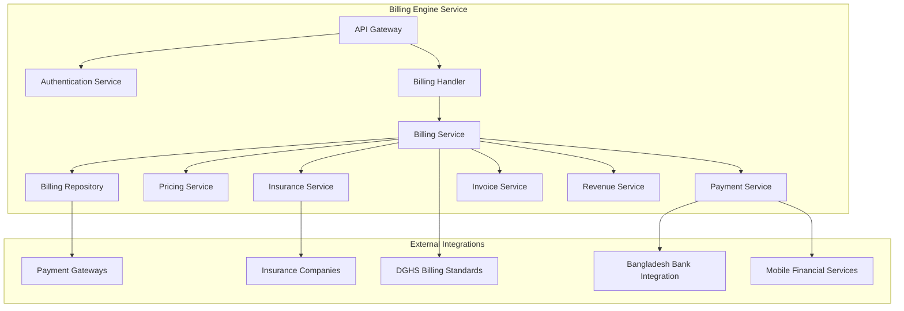

# Billing Engine Microservice

## 🎯 Overview

The Billing Engine microservice handles all financial operations in ZARISH HIS, including patient billing, insurance claims, payment processing, and revenue management with Bangladesh healthcare context and Rohingya refugee billing support.

## 🏗️ Architecture

### Service Components



### Database Schema

```mermaid
erDiagram
    BILLING_ACCOUNT {
        string id PK
        string patient_id FK
        string account_type
        string account_number
        string account_holder
        json billing_address
        json payment_methods
        boolean is_active
        timestamp created_at
        timestamp updated_at
    }
    
    BILLING_INVOICE {
        string id PK
        string patient_id FK
        string account_id FK
        string invoice_number
        date invoice_date
        date due_date
        decimal total_amount
        decimal paid_amount
        decimal balance_amount
        string currency
        string status
        json line_items
        json payments
        json insurance_claims
        timestamp created_at
        timestamp updated_at
    }
    
    BILLING_LINE_ITEM {
        string id PK
        string invoice_id FK
        string service_type
        string service_id
        string description
        decimal quantity
        decimal unit_price
        decimal total_price
        string billing_code
        json insurance_coverage
        decimal discount_amount
        decimal tax_amount
    }
    
    INSURANCE_CLAIM {
        string id PK
        string invoice_id FK
        string patient_id FK
        string insurance_provider_id
        string claim_number
        string policy_number
        decimal claimed_amount
        decimal approved_amount
        decimal patient_responsibility
        string status
        date submission_date
        date approval_date
        json supporting_documents
        string rejection_reason
        timestamp created_at
        timestamp updated_at
    }
    
    PAYMENT {
        string id PK
        string invoice_id FK
        string patient_id FK
        string payment_method
        string gateway_transaction_id
        decimal amount
        string currency
        string status
        date payment_date
        json payment_details
        timestamp created_at
        timestamp updated_at
    }
    
    PRICING {
        string id PK
        string service_type
        string service_code
        string description
        decimal base_price
        decimal currency
        string pricing_model
        json tier_pricing
        date effective_date
        date expiry_date
        boolean is_active
    }
    
    INSURANCE_PROVIDER {
        string id PK
        string provider_name
        string provider_code
        json contact_info
        json billing_address
        json supported_plans
        string status
        timestamp created_at
        timestamp updated_at
    }
    
    BILLING_ACCOUNT ||--o{ BILLING_INVOICE
    BILLING_INVOICE ||--o{ BILLING_LINE_ITEM
    BILLING_INVOICE ||--o{ INSURANCE_CLAIM
    BILLING_INVOICE ||--o{ PAYMENT
    BILLING_LINE_ITEM ||--o{ PRICING
    INSURANCE_CLAIM ||--o{ INSURANCE_PROVIDER
```

## 📋 API Endpoints

### Billing Account Management

#### Create Billing Account

```http
POST /api/v1/billing/accounts
Content-Type: application/json
Authorization: Bearer <token>
```

**Request Body:**

```json
{
  "patientId": "550e8400-e29b-41d4-a716-446655440000",
  "accountType": "PATIENT",
  "accountHolder": "Mohammad Rahman",
  "billingAddress": {
    "street": "123 Medical Center Road",
    "city": "Dhaka",
    "division": "BD.3",
    "district": "BD.3.01",
    "postalCode": "1000",
    "country": "Bangladesh"
  },
  "paymentMethods": ["CASH", "CARD", "MOBILE_BANKING"],
  "defaultPaymentMethod": "CASH"
}
```

#### Get Billing Account

```http
GET /api/v1/billing/accounts/{accountId}
Authorization: Bearer <token>
```

### Invoice Management

#### Create Invoice

```http
POST /api/v1/billing/invoices
Content-Type: application/json
Authorization: Bearer <token>
```

**Request Body:**

```json
{
  "patientId": "550e8400-e29b-41d4-a716-446655440000",
  "accountId": "billing-acc-123",
  "invoiceNumber": "INV-2026-0001",
  "invoiceDate": "2026-01-21",
  "dueDate": "2026-02-20",
  "lineItems": [
    {
      "serviceType": "CONSULTATION",
      "serviceId": "GOPD-001",
      "description": "General OPD Consultation",
      "quantity": 1,
      "unitPrice": 500.00,
      "totalPrice": 500.00,
      "billingCode": "GOPD_CONSULT",
      "insuranceCoverage": {
        "covered": true,
        "coveragePercentage": 80.0,
        "copayAmount": 100.00
      },
      "discountAmount": 0.00,
      "taxAmount": 75.00
    },
    {
      "serviceType": "LABORATORY",
      "serviceId": "LAB-001",
      "description": "Complete Blood Count",
      "quantity": 1,
      "unitPrice": 300.00,
      "totalPrice": 300.00,
      "billingCode": "LAB_CBC",
      "insuranceCoverage": {
        "covered": true,
        "coveragePercentage": 70.0,
        "copayAmount": 90.00
      },
      "discountAmount": 0.00,
      "taxAmount": 45.00
    }
  ],
  "currency": "BDT",
  "totalAmount": 800.00,
  "paidAmount": 0.00,
  "balanceAmount": 800.00,
  "status": "DRAFT"
}
```

#### Process Payment

```http
POST /api/v1/billing/payments
Content-Type: application/json
Authorization: Bearer <token>
```

**Request Body:**

```json
{
  "invoiceId": "inv-123456",
  "paymentMethod": "MOBILE_BANKING",
  "amount": 800.00,
  "currency": "BDT",
  "paymentDetails": {
    "gateway": "bKash",
    "transactionId": "TXN123456789",
    "mobileNumber": "+8801234567890",
    "referenceNumber": "REF123456"
  }
}
```

### Insurance Claims

#### Submit Insurance Claim

```http
POST /api/v1/billing/insurance-claims
Content-Type: application/json
Authorization: Bearer <token>
```

**Request Body:**

```json
{
  "invoiceId": "inv-123456",
  "patientId": "550e8400-e29b-41d4-a716-446655440000",
  "insuranceProviderId": "ins-001",
  "policyNumber": "POL-123456789",
  "claimNumber": "CLAIM-2026-0001",
  "claimedAmount": 800.00,
  "supportingDocuments": [
    {
      "type": "INVOICE",
      "url": "https://docs.zarish-his.com/invoices/inv-123456.pdf"
    },
    {
      "type": "MEDICAL_REPORT",
      "url": "https://docs.zarish-his.com/reports/rep-123456.pdf"
    }
  ]
}
```

### Rohingya Refugee Billing

#### Refugee Billing Account

```http
POST /api/v1/billing/accounts
Content-Type: application/json
Authorization: Bearer <token>
```

**Request Body:**

```json
{
  "patientId": "rohingya-patient-123",
  "accountType": "REFUGEE",
  "accountHolder": "Ayesha Begum",
  "billingAddress": {
    "campName": "Kutupalong",
    "block": "Block A",
    "subBlock": "Sub-Block 1",
    "shelter": "Shelter 123",
    "coordinates": {
      "latitude": 21.1234,
      "longitude": 92.1234
    }
  },
  "paymentMethods": ["CASH", "VOUCHER"],
  "defaultPaymentMethod": "VOUCHER",
  "unhcrRegistration": {
    "registrationNumber": "UNHCR-123456",
    "familyCountingNumber": "FCN-KTP-BLOCK-A-001"
  }
}
```

#### Process Voucher Payment

```http
POST /api/v1/billing/payments
Content-Type: application/json
Authorization: Bearer <token>
```

**Request Body:**

```json
{
  "invoiceId": "inv-refugee-123",
  "paymentMethod": "VOUCHER",
  "amount": 200.00,
  "currency": "BDT",
  "paymentDetails": {
    "voucherType": "UNHCR_HEALTH_VOUCHER",
    "voucherNumber": "VCH-123456789",
    "issuingOrganization": "UNHCR",
    "expiryDate": "2026-12-31",
    "authorizedBy": "Camp Health Officer"
  }
}
```

## 🔧 Service Implementation

### Billing Service Layer

```go
// internal/service/billing_service.go
package service

import (
    "context"
    "time"
    
    "github.com/zarish-his/internal/interfaces"
    "github.com/zarish-his/internal/model"
    "github.com/zarish-his/pkg/logger"
    "github.com/zarish-his/pkg/errors"
)

type BillingService struct {
    repo           interfaces.BillingRepository
    pricingSvc     interfaces.PricingService
    insuranceSvc   interfaces.InsuranceService
    paymentSvc     interfaces.PaymentService
    revenueSvc     interfaces.RevenueService
    auditSvc       interfaces.AuditService
    logger         logger.Logger
}

func NewBillingService(
    repo interfaces.BillingRepository,
    pricingSvc interfaces.PricingService,
    insuranceSvc interfaces.InsuranceService,
    paymentSvc interfaces.PaymentService,
    revenueSvc interfaces.RevenueService,
    auditSvc interfaces.AuditService,
    logger logger.Logger,
) *BillingService {
    return &BillingService{
        repo:         repo,
        pricingSvc:   pricingSvc,
        insuranceSvc: insuranceSvc,
        paymentSvc:   paymentSvc,
        revenueSvc:   revenueSvc,
        auditSvc:     auditSvc,
        logger:       logger,
    }
}

func (s *BillingService) CreateInvoice(ctx context.Context, req *model.CreateInvoiceRequest) (*model.Invoice, error) {
    // Validate request
    if err := s.validateCreateInvoiceRequest(ctx, req); err != nil {
        s.logger.Error("Invoice creation validation failed", "error", err)
        return nil, err
    }
    
    // Get pricing for services
    var totalAmount decimal.Decimal
    var lineItems []*model.LineItem
    
    for _, item := range req.LineItems {
        pricing, err := s.pricingSvc.GetServicePricing(ctx, item.ServiceType, item.ServiceCode)
        if err != nil {
            return nil, errors.ErrPricingNotFound
        }
        
        lineItem := &model.LineItem{
            ID:             generateUUID(),
            ServiceType:     item.ServiceType,
            ServiceID:       item.ServiceCode,
            Description:     item.Description,
            Quantity:        item.Quantity,
            UnitPrice:       pricing.BasePrice,
            TotalPrice:       pricing.BasePrice.Mul(decimal.NewFromInt(item.Quantity)),
            BillingCode:     item.BillingCode,
            InsuranceCoverage: item.InsuranceCoverage,
            DiscountAmount:   item.DiscountAmount,
            TaxAmount:       calculateTax(pricing.BasePrice.Mul(decimal.NewFromInt(item.Quantity))),
        }
        
        totalAmount = totalAmount.Add(lineItem.TotalPrice)
        lineItems = append(lineItems, lineItem)
    }
    
    // Create invoice
    invoice := &model.Invoice{
        ID:           generateUUID(),
        PatientID:    req.PatientID,
        AccountID:    req.AccountID,
        InvoiceNumber: req.InvoiceNumber,
        InvoiceDate:  req.InvoiceDate,
        DueDate:      req.DueDate,
        TotalAmount:  totalAmount,
        PaidAmount:   decimal.Zero,
        BalanceAmount: totalAmount,
        Currency:     req.Currency,
        Status:       model.InvoiceStatusDraft,
        LineItems:    lineItems,
        CreatedAt:     time.Now(),
        UpdatedAt:     time.Now(),
    }
    
    if err := s.repo.CreateInvoice(ctx, invoice); err != nil {
        s.logger.Error("Failed to create invoice", "error", err, "invoiceId", invoice.ID)
        return nil, errors.ErrDatabaseError
    }
    
    // Process insurance claims if applicable
    if req.PatientInsurance != nil {
        if err := s.processInsuranceClaim(ctx, invoice, req.PatientInsurance); err != nil {
            s.logger.Error("Failed to process insurance claim", "error", err, "invoiceId", invoice.ID)
        }
    }
    
    // Log audit
    s.auditSvc.LogAction(ctx, &model.AuditLog{
        PatientID: req.PatientID,
        Action:    "INVOICE_CREATED",
        ActorType: "USER",
        NewValues: invoice,
        IPAddress: getIPAddress(ctx),
        UserAgent: getUserAgent(ctx),
    })
    
    s.logger.Info("Invoice created successfully", "invoiceId", invoice.ID, "totalAmount", totalAmount)
    return invoice, nil
}

func (s *BillingService) processInsuranceClaim(ctx context.Context, invoice *model.Invoice, insurance *model.PatientInsurance) error {
    // Check if patient has valid insurance
    if insurance == nil || !insurance.IsActive {
        return nil
    }
    
    // Calculate covered amount
    var coveredAmount decimal.Decimal
    var patientResponsibility decimal.Decimal
    
    for _, item := range invoice.LineItems {
        if item.InsuranceCoverage.Covered {
            coverage := item.InsuranceCoverage.CoveragePercentage.Div(decimal.NewFromInt(100))
            covered := item.TotalPrice.Mul(coverage)
            copay := item.TotalPrice.Sub(covered)
            
            coveredAmount = coveredAmount.Add(covered)
            patientResponsibility = patientResponsibility.Add(copay)
            
            item.InsuranceCoverage.CopayAmount = &copay
        } else {
            patientResponsibility = patientResponsibility.Add(item.TotalPrice)
        }
    }
    
    // Create insurance claim
    claim := &model.InsuranceClaim{
        ID:                 generateUUID(),
        InvoiceID:          invoice.ID,
        PatientID:          invoice.PatientID,
        InsuranceProviderID: insurance.InsuranceProviderID,
        PolicyNumber:        insurance.PolicyNumber,
        ClaimNumber:         generateClaimNumber(),
        ClaimedAmount:       invoice.TotalAmount,
        ApprovedAmount:       coveredAmount,
        PatientResponsibility: patientResponsibility,
        Status:             model.ClaimStatusSubmitted,
        SubmissionDate:      time.Now(),
    }
    
    if err := s.repo.CreateInsuranceClaim(ctx, claim); err != nil {
        return errors.ErrDatabaseError
    }
    
    return nil
}
```

### Pricing Service

```go
// internal/service/pricing_service.go
package service

import (
    "context"
    "decimal"
    
    "github.com/zarish-his/internal/interfaces"
    "github.com/zarish-his/internal/model"
    "github.com/zarish-his/pkg/logger"
)

type PricingService struct {
    repo   interfaces.PricingRepository
    logger logger.Logger
}

func NewPricingService(repo interfaces.PricingRepository, logger logger.Logger) *PricingService {
    return &PricingService{
        repo:   repo,
        logger: logger,
    }
}

func (s *PricingService) GetServicePricing(ctx context.Context, serviceType, serviceCode string) (*model.Pricing, error) {
    // Check cache first
    cacheKey := fmt.Sprintf("pricing:%s:%s", serviceType, serviceCode)
    if pricing, err := s.getFromCache(ctx, cacheKey); err == nil {
        return pricing, nil
    }
    
    // Get from database
    pricing, err := s.repo.GetActivePricing(ctx, serviceType, serviceCode)
    if err != nil {
        s.logger.Error("Failed to get pricing", "error", err, "serviceType", serviceType, "serviceCode", serviceCode)
        return nil, errors.ErrPricingNotFound
    }
    
    // Apply Bangladesh-specific pricing rules
    pricing = s.applyBangladeshPricingRules(ctx, pricing)
    
    // Cache result
    s.setCache(ctx, cacheKey, pricing, 1*time.Hour)
    
    return pricing, nil
}

func (s *PricingService) applyBangladeshPricingRules(ctx context.Context, pricing *model.Pricing) *model.Pricing {
    // Apply VAT (15% for healthcare services in Bangladesh)
    if pricing.PricingModel == "STANDARD" {
        vatRate := decimal.NewFromFloat(0.15)
        vatAmount := pricing.BasePrice.Mul(vatRate)
        pricing.BasePrice = pricing.BasePrice.Add(vatAmount)
    }
    
    // Apply refugee discount for UNHCR services
    if isRefugeeService(ctx) {
        discountRate := decimal.NewFromFloat(0.20) // 20% discount for refugees
        discountAmount := pricing.BasePrice.Mul(discountRate)
        pricing.BasePrice = pricing.BasePrice.Sub(discountAmount)
    }
    
    return pricing
}

func isRefugeeService(ctx context.Context) bool {
    // Check if current context is for refugee services
    if refugeeCamp, exists := ctx.Value("refugee_camp"); exists {
        return refugeeCamp.(string) != ""
    }
    return false
}
```

## 🔍 Integration Services

### Payment Gateway Integration

```go
// internal/service/payment_service.go
package service

import (
    "context"
    
    "github.com/zarish-his/pkg/paymentgateway"
    "github.com/zarish-his/pkg/logger"
)

type PaymentService struct {
    gateways map[string]paymentgateway.Gateway
    logger   logger.Logger
}

func NewPaymentService(logger logger.Logger) *PaymentService {
    return &PaymentService{
        gateways: map[string]paymentgateway.Gateway{
            "bKash": paymentgateway.NewBKashGateway(),
            "Nagad": paymentgateway.NewNagadGateway(),
            "Rocket": paymentgateway.NewRocketGateway(),
            "DBBL":  paymentgateway.NewDBBLGateway(),
        },
        logger: logger,
    }
}

func (s *PaymentService) ProcessPayment(ctx context.Context, req *model.PaymentRequest) (*model.PaymentResponse, error) {
    gateway, exists := s.gateways[req.PaymentMethod]
    if !exists {
        return nil, errors.ErrUnsupportedPaymentMethod
    }
    
    // Process payment through gateway
    response, err := gateway.ProcessPayment(ctx, req)
    if err != nil {
        s.logger.Error("Payment processing failed", "error", err, "gateway", req.PaymentMethod)
        return nil, err
    }
    
    // Record payment in database
    payment := &model.Payment{
        ID:                 generateUUID(),
        InvoiceID:          req.InvoiceID,
        PatientID:          req.PatientID,
        PaymentMethod:       req.PaymentMethod,
        GatewayTransactionID: response.TransactionID,
        Amount:             req.Amount,
        Currency:           req.Currency,
        Status:             response.Status,
        PaymentDate:        time.Now(),
        PaymentDetails:      req.PaymentDetails,
    }
    
    if err := s.repo.CreatePayment(ctx, payment); err != nil {
        s.logger.Error("Failed to record payment", "error", err)
        return nil, errors.ErrDatabaseError
    }
    
    s.logger.Info("Payment processed successfully", "paymentId", payment.ID, "amount", req.Amount)
    return response, nil
}
```

## 📊 Performance Optimization

### Database Indexing

```sql
-- Billing indexes
CREATE INDEX idx_invoices_patient_id ON invoices(patient_id);
CREATE INDEX idx_invoices_account_id ON invoices(account_id);
CREATE INDEX idx_invoices_status ON invoices(status);
CREATE INDEX idx_invoices_created_at ON invoices(created_at DESC);
CREATE INDEX idx_line_items_invoice_id ON line_items(invoice_id);
CREATE INDEX idx_line_items_service_type ON line_items(service_type);
CREATE INDEX idx_payments_invoice_id ON payments(invoice_id);
CREATE INDEX idx_payments_status ON payments(status);
CREATE INDEX idx_insurance_claims_patient_id ON insurance_claims(patient_id);
CREATE INDEX idx_insurance_claims_status ON insurance_claims(status);
```

### Caching Strategy

```go
// Cache keys and TTL
const (
    PricingCacheKey         = "pricing:%s:%s"
    InvoiceCacheKey        = "invoice:%s"
    PaymentCacheKey        = "payment:%s"
    InsuranceProviderCacheKey = "insurance:%s"
    
    PricingCacheTTL         = 2 * time.Hour
    InvoiceCacheTTL        = 30 * time.Minute
    PaymentCacheTTL        = 15 * time.Minute
    InsuranceProviderCacheTTL = 24 * time.Hour
)
```

## 🔒 Security Implementation

### Payment Security

```go
// Encrypt payment information
func (s *PaymentService) encryptPaymentData(payment *model.Payment) error {
    if payment.PaymentDetails != nil {
        encrypted, err := s.encrypt(payment.PaymentDetails)
        if err != nil {
            return err
        }
        payment.EncryptedPaymentDetails = encrypted
    }
    
    // Mask sensitive data in logs
    s.logger.Info("Payment processed", 
        "paymentId", payment.ID,
        "amount", payment.Amount,
        "method", payment.PaymentMethod,
        "status", payment.Status,
        // Don't log full payment details
    )
    
    return nil
}
```

### Compliance Monitoring

```go
// Monitor for Bangladesh financial regulations
func (s *BillingService) ensureCompliance(ctx context.Context, invoice *model.Invoice) error {
    // Check VAT compliance
    if invoice.Currency == "BDT" {
        if !s.hasValidVAT(invoice) {
            return errors.ErrInvalidVATCalculation
        }
    }
    
    // Check insurance compliance
    if hasInsurance := s.hasValidInsurance(invoice); hasInsurance {
        if !s.isValidInsuranceClaim(invoice) {
            return errors.ErrInvalidInsuranceClaim
        }
    }
    
    // Check refugee billing compliance
    if isRefugeePatient(ctx, invoice.PatientID) {
        if !s.isValidRefugeeBilling(invoice) {
            return errors.ErrInvalidRefugeeBilling
        }
    }
    
    return nil
}
```

## 📋 Monitoring and Metrics

### Key Performance Indicators

- **Invoice Generation Rate**: Invoices created per hour/day
- **Payment Success Rate**: Payment processing success percentage
- **Insurance Claim Processing Time**: Average time to process claims
- **Revenue Recognition**: Daily/weekly/monthly revenue
- **Bad Debt Rate**: Percentage of unpaid invoices
- **Gateway Performance**: Payment gateway response times
- **Pricing Accuracy**: Pricing calculation accuracy rate

### Financial Reports

```go
// Generate daily financial reports
func (s *BillingService) GenerateDailyReport(ctx context.Context, date time.Time) (*model.FinancialReport, error) {
    report := &model.FinancialReport{
        Date:         date,
        TotalRevenue: decimal.Zero,
        TotalInvoices: 0,
        TotalPayments: 0,
        OutstandingBalance: decimal.Zero,
        InsuranceClaims: 0,
        RefereeServices: 0,
    }
    
    // Get daily statistics
    stats, err := s.repo.GetDailyStatistics(ctx, date)
    if err != nil {
        return nil, err
    }
    
    report.TotalRevenue = stats.TotalRevenue
    report.TotalInvoices = stats.TotalInvoices
    report.TotalPayments = stats.TotalPayments
    report.OutstandingBalance = stats.OutstandingBalance
    report.InsuranceClaims = stats.InsuranceClaims
    report.RefereeServices = stats.RefereeServices
    
    return report, nil
}
```

---

**Service Version**: 1.0  
**Last Updated**: January 2026  
**Go Version**: 1.25.7  
**Compliance**: ZARISH HIS Billing Engine Standards
