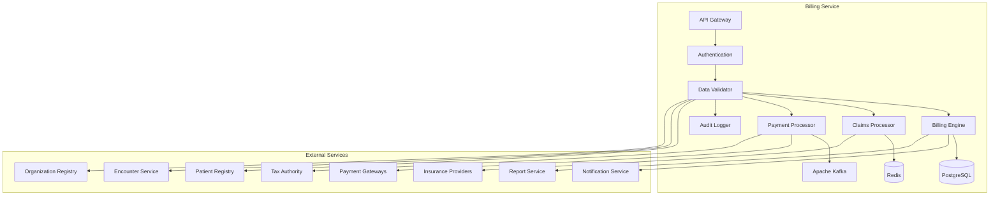

# MS Billing Service

The Billing Service manages healthcare billing, insurance claims, payment processing, and financial operations with comprehensive Bangladesh healthcare payment systems integration.

## 📋 Service Overview

- **Repository**: [ms-billing-service](https://github.com/zs-his/ms-billing-service)
- **Status**: 🟡 In Progress
- **FHIR Resources**: Account, ChargeItem, Invoice, PaymentReconciliation
- **Primary Database**: PostgreSQL
- **Cache Layer**: Redis
- **Event Streaming**: Apache Kafka

## 🎯 Key Features

### Billing Operations
- **Service Billing**: Medical service and procedure billing
- **Insurance Claims**: Health insurance claim processing
- **Payment Processing**: Multiple payment gateway integration
- **Financial Reporting**: Comprehensive billing analytics
- **Revenue Management**: Revenue cycle management

### Bangladesh-Specific Features
- **Government Health Schemes**: Public healthcare billing
- **Private Insurance**: Bangladesh private health insurance
- **Local Payment Methods**: Mobile banking and digital payments
- **Tax Compliance**: Bangladesh tax regulations
- **Price Control**: Government-mandated service pricing

## 🏗️ Architecture



## 📊 Database Schema

### Invoice Table
```sql
CREATE TABLE invoices (
    id UUID PRIMARY KEY DEFAULT gen_random_uuid(),
    invoice_id VARCHAR(50) UNIQUE NOT NULL,
    patient_id UUID NOT NULL,
    encounter_id UUID REFERENCES encounters(id),
    facility_id UUID REFERENCES organizations(id),
    status VARCHAR(20) NOT NULL DEFAULT 'draft',
    invoice_date DATE NOT NULL,
    due_date DATE NOT NULL,
    total_amount DECIMAL(12,2) NOT NULL,
    paid_amount DECIMAL(12,2) DEFAULT 0.00,
    balance_amount DECIMAL(12,2) GENERATED ALWAYS AS (total_amount - paid_amount) STORED,
    currency VARCHAR(3) DEFAULT 'BDT',
    payment_terms VARCHAR(50),
    billing_period JSONB,
    recipient JSONB,
    participant JSONB,
    line_items JSONB,
    total_price_component JSONB,
    created_at TIMESTAMP DEFAULT CURRENT_TIMESTAMP,
    updated_at TIMESTAMP DEFAULT CURRENT_TIMESTAMP,
    metadata JSONB,
    FOREIGN KEY (patient_id) REFERENCES patients(id)
);
```

### Charge Item Table
```sql
CREATE TABLE charge_items (
    id UUID PRIMARY KEY DEFAULT gen_random_uuid(),
    charge_item_id VARCHAR(50) UNIQUE NOT NULL,
    invoice_id UUID REFERENCES invoices(id) ON DELETE CASCADE,
    patient_id UUID NOT NULL,
    encounter_id UUID REFERENCES encounters(id),
    facility_id UUID REFERENCES organizations(id),
    status VARCHAR(20) NOT NULL DEFAULT 'planned',
    code JSONB NOT NULL,
    subject_type VARCHAR(20) DEFAULT 'patient',
    subject_id UUID NOT NULL,
    encounter_reference UUID REFERENCES encounters(id),
    performing_organization JSONB,
    requesting_organization JSONB,
    quantity JSONB NOT NULL,
    unit_price DECIMAL(10,2) NOT NULL,
    total_amount DECIMAL(12,2) GENERATED ALWAYS AS (quantity->>'value'::decimal * unit_price) STORED,
    factor_override DECIMAL(5,2),
    price_override DECIMAL(10,2),
    reason_code JSONB,
    service_type JSONB,
    created_at TIMESTAMP DEFAULT CURRENT_TIMESTAMP,
    updated_at TIMESTAMP DEFAULT CURRENT_TIMESTAMP,
    metadata JSONB,
    FOREIGN KEY (patient_id) REFERENCES patients(id)
);
```

### Payment Table
```sql
CREATE TABLE payments (
    id UUID PRIMARY KEY DEFAULT gen_random_uuid(),
    payment_id VARCHAR(50) UNIQUE NOT NULL,
    invoice_id UUID REFERENCES invoices(id),
    patient_id UUID NOT NULL,
    facility_id UUID REFERENCES organizations(id),
    status VARCHAR(20) NOT NULL DEFAULT 'pending',
    payment_date TIMESTAMP NOT NULL,
    amount DECIMAL(12,2) NOT NULL,
    currency VARCHAR(3) DEFAULT 'BDT',
    payment_method VARCHAR(50) NOT NULL,
    payment_gateway VARCHAR(100),
    transaction_id VARCHAR(100),
    reference_number VARCHAR(100),
    payer JSONB,
    recipient JSONB,
    created_at TIMESTAMP DEFAULT CURRENT_TIMESTAMP,
    updated_at TIMESTAMP DEFAULT CURRENT_TIMESTAMP,
    metadata JSONB,
    FOREIGN KEY (patient_id) REFERENCES patients(id)
);
```

## 🔌 API Endpoints

### Invoice Management
```go
// Create invoice
POST /api/billing/invoices
{
  "status": "draft",
  "patient": {"reference": "Patient/12345"},
  "encounter": {"reference": "Encounter/67890"},
  "facility": {"reference": "Organization/111"},
  "invoiceDate": "2026-01-21",
  "dueDate": "2026-02-21",
  "totalAmount": 2500.00,
  "currency": "BDT",
  "paymentTerms": "Net 30 days",
  "recipient": {
    "reference": "Patient/12345",
    "display": "John Doe"
  },
  "participant": [
    {
      "role": {
        "coding": [{
          "system": "http://terminology.hl7.org/CodeSystem/invoiceparticipantrole",
          "code": "provider"
        }]
      },
      "actor": {
        "reference": "Organization/111",
        "display": "ZARISH Hospital"
      }
    }
  ],
  "lineItem": [
    {
      "code": {
        "coding": [{
          "system": "http://loinc.org",
          "code": "34839-5",
          "display": "Chest X-ray"
        }]
      },
      "quantity": {
        "value": 1,
        "unit": "service"
      },
      "unitPrice": {
        "value": 800.00,
        "currency": "BDT"
      },
      "totalAmount": 800.00
    },
    {
      "code": {
        "coding": [{
          "system": "http://loinc.org",
          "code": "58410-2",
          "display": "CBC with differential"
        }]
      },
      "quantity": {
        "value": 1,
        "unit": "test"
      },
      "unitPrice": {
        "value": 500.00,
        "currency": "BDT"
      },
      "totalAmount": 500.00
    }
  ]
}

// Get invoice by ID
GET /api/billing/invoices/{id}

// Search invoices
GET /api/billing/invoices?patient=12345&status=pending&date=2026-01-21

// Update invoice
PUT /api/billing/invoices/{id}

// Finalize invoice
POST /api/billing/invoices/{id}/finalize
{
  "status": "issued",
  "issuedDate": "2026-01-21T16:00:00+06:00"
}
```

### Payment Processing
```go
// Process payment
POST /api/billing/payments
{
  "invoiceId": "invoice-123",
  "patient": {"reference": "Patient/12345"},
  "facility": {"reference": "Organization/111"},
  "paymentDate": "2026-01-21T16:30:00+06:00",
  "amount": 2500.00,
  "currency": "BDT",
  "paymentMethod": "mobile_banking",
  "paymentGateway": "bKash",
  "payer": {
    "reference": "Patient/12345",
    "display": "John Doe"
  },
  "recipient": {
    "reference": "Organization/111",
    "display": "ZARISH Hospital"
  }
}

// Get payment by ID
GET /api/billing/payments/{id}

// Search payments
GET /api/billing/payments?patient=12345&status=completed&date=2026-01-21

// Refund payment
POST /api/billing/payments/{id}/refund
{
  "refundAmount": 500.00,
  "refundReason": "Service cancellation",
  "refundMethod": "mobile_banking"
}
```

### Insurance Claims
```go
// Submit insurance claim
POST /api/billing/claims
{
  "claimId": "claim-456",
  "invoiceId": "invoice-123",
  "patient": {"reference": "Patient/12345"},
  "insuranceProvider": {"reference": "Organization/insurance-789"},
  "claimType": "outpatient",
  "services": [
    {
      "serviceCode": "34839-5",
      "serviceDescription": "Chest X-ray",
      "serviceAmount": 800.00,
      "coveredAmount": 640.00,
      "patientResponsibility": 160.00
    }
  ],
  "totalClaimAmount": 2500.00,
  "totalCoveredAmount": 2000.00,
  "totalPatientResponsibility": 500.00,
  "submissionDate": "2026-01-21",
  "status": "submitted"
}

// Get claim by ID
GET /api/billing/claims/{id}

// Search claims
GET /api/billing/claims?patient=12345&status=approved&provider=insurance-789

// Update claim status
PUT /api/billing/claims/{id}/status
{
  "status": "approved",
  "approvedAmount": 2000.00,
  "approvedDate": "2026-01-25",
  "explanation": "Standard coverage applied"
}
```

## 🏥 Bangladesh Billing Features

### Government Health Schemes
```go
type GovernmentHealthScheme struct {
    SchemeCode        string    `json:"scheme_code"`
    SchemeName        string    `json:"scheme_name"`
    CoverageType      string    `json:"coverage_type"`
    EligibilityCriteria string   `json:"eligibility_criteria"`
    CoveragePercentage float64  `json:"coverage_percentage"`
    MaxCoverageAmount float64  `json:"max_coverage_amount"`
    CoPaymentRequired bool      `json:"co_payment_required"`
    CoPaymentRate     float64   `json:"co_payment_rate"`
    Active            bool      `json:"active"`
    ValidFrom         time.Time `json:"valid_from"`
    ValidTo           time.Time `json:"valid_to"`
}

var BangladeshHealthSchemes = map[string]GovernmentHealthScheme{
    "DGHS_FREE": {
        SchemeCode:        "DGHS_FREE",
        SchemeName:        "DGHS Free Health Services",
        CoverageType:      "comprehensive",
        EligibilityCriteria: "Below poverty line, rural areas",
        CoveragePercentage: 100.0,
        MaxCoverageAmount: 50000.00,
        CoPaymentRequired: false,
        CoPaymentRate:     0.0,
        Active:            true,
        ValidFrom:         time.Date(2024, 1, 1, 0, 0, 0, 0, time.UTC),
        ValidTo:           time.Date(2026, 12, 31, 0, 0, 0, 0, time.UTC),
    },
    "MATERNAL_HEALTH": {
        SchemeCode:        "MATERNAL_HEALTH",
        SchemeName:        "Maternal Health Voucher Scheme",
        CoverageType:      "maternal_services",
        EligibilityCriteria: "Pregnant women in rural areas",
        CoveragePercentage: 85.0,
        MaxCoverageAmount: 15000.00,
        CoPaymentRequired: true,
        CoPaymentRate:     15.0,
        Active:            true,
        ValidFrom:         time.Date(2024, 1, 1, 0, 0, 0, 0, time.UTC),
        ValidTo:           time.Date(2026, 12, 31, 0, 0, 0, 0, time.UTC),
    },
}
```

### Payment Methods
```go
type PaymentMethod struct {
    MethodCode      string  `json:"method_code"`
    MethodName      string  `json:"method_name"`
    SupportedGateways []string `json:"supported_gateways"`
    ProcessingFee   float64 `json:"processing_fee"`
    MinAmount       float64 `json:"min_amount"`
    MaxAmount       float64 `json:"max_amount"`
    SettlementTime  int     `json:"settlement_time_hours"`
    PopularInBD     bool    `json:"popular_in_bd"`
}

var BangladeshPaymentMethods = map[string]PaymentMethod{
    "MOBILE_BANKING": {
        MethodCode:      "MOBILE_BANKING",
        MethodName:      "Mobile Banking",
        SupportedGateways: []string{"bKash", "Nagad", "Rocket", "Upay"},
        ProcessingFee:   0.018, // 1.8%
        MinAmount:       10.00,
        MaxAmount:       50000.00,
        SettlementTime:  24,
        PopularInBD:     true,
    },
    "CASH": {
        MethodCode:      "CASH",
        MethodName:      "Cash Payment",
        SupportedGateways: []string{"cash"},
        ProcessingFee:   0.0,
        MinAmount:       0.0,
        MaxAmount:       100000.00,
        SettlementTime:  0,
        PopularInBD:     true,
    },
    "CARD": {
        MethodCode:      "CARD",
        MethodName:      "Credit/Debit Card",
        SupportedGateways: []string{"Visa", "Mastercard", "Amex"},
        ProcessingFee:   0.025, // 2.5%
        MinAmount:       100.00,
        MaxAmount:       200000.00,
        SettlementTime:  48,
        PopularInBD:     false,
    },
    "DIGITAL_WALLET": {
        MethodCode:      "DIGITAL_WALLET",
        MethodName:      "Digital Wallet",
        SupportedGateways: []string{"bKash", "Nagad", "Upay"},
        ProcessingFee:   0.015, // 1.5%
        MinAmount:       10.00,
        MaxAmount:       30000.00,
        SettlementTime:  24,
        PopularInBD:     true,
    },
}
```

## 🔍 Search and Filtering

### Advanced Invoice Search
```go
type InvoiceSearchCriteria struct {
    PatientID       string    `json:"patient_id"`
    EncounterID     string    `json:"encounter_id"`
    FacilityID      string    `json:"facility_id"`
    Status          string    `json:"status"`
    DateFrom        time.Time `json:"date_from"`
    DateTo          time.Time `json:"date_to"`
    MinAmount       float64   `json:"min_amount"`
    MaxAmount       float64   `json:"max_amount"`
    PaymentStatus   string    `json:"payment_status"`
    InsuranceProvider string  `json:"insurance_provider"`
}

func (s *BillingService) SearchInvoices(criteria InvoiceSearchCriteria) ([]Invoice, error) {
    query := s.db.NewSelect().Model(&Invoice{})
    
    if criteria.PatientID != "" {
        query = query.Where("patient_id = ?", criteria.PatientID)
    }
    
    if criteria.Status != "" {
        query = query.Where("status = ?", criteria.Status)
    }
    
    if !criteria.DateFrom.IsZero() {
        query = query.Where("invoice_date >= ?", criteria.DateFrom)
    }
    
    if !criteria.DateTo.IsZero() {
        query = query.Where("invoice_date <= ?", criteria.DateTo)
    }
    
    if criteria.MinAmount > 0 {
        query = query.Where("total_amount >= ?", criteria.MinAmount)
    }
    
    if criteria.MaxAmount > 0 {
        query = query.Where("total_amount <= ?", criteria.MaxAmount)
    }
    
    var invoices []Invoice
    err := query.Scan(ctx, &invoices)
    return invoices, err
}
```

## 📈 Performance Optimization

### Caching Strategy
```go
// Cache service pricing for 2 hours
func (s *BillingService) GetServicePricing(serviceCode string) (*ServicePricing, error) {
    cacheKey := fmt.Sprintf("service_pricing:%s", serviceCode)
    
    if cached, err := s.cache.Get(cacheKey); err == nil {
        return cached.(*ServicePricing), nil
    }
    
    pricing, err := s.repository.GetServicePricing(serviceCode)
    if err != nil {
        return nil, err
    }
    
    s.cache.Set(cacheKey, pricing, 2*time.Hour)
    return pricing, nil
}

// Cache patient billing summary for 30 minutes
func (s *BillingService) GetPatientBillingSummary(patientID string) (*BillingSummary, error) {
    cacheKey := fmt.Sprintf("billing_summary:%s", patientID)
    
    if cached, err := s.cache.Get(cacheKey); err == nil {
        return cached.(*BillingSummary), nil
    }
    
    summary, err := s.calculateBillingSummary(patientID)
    if err != nil {
        return nil, err
    }
    
    s.cache.Set(cacheKey, summary, 30*time.Minute)
    return summary, nil
}
```

### Database Indexing
```sql
-- Performance indexes
CREATE INDEX idx_invoices_patient ON invoices(patient_id);
CREATE INDEX idx_invoices_status ON invoices(status);
CREATE INDEX idx_invoices_facility ON invoices(facility_id);
CREATE INDEX idx_invoices_date ON invoices(invoice_date);
CREATE INDEX idx_invoices_amount ON invoices(total_amount);
CREATE INDEX idx_charge_items_invoice ON charge_items(invoice_id);
CREATE INDEX idx_charge_items_patient ON charge_items(patient_id);
CREATE INDEX idx_charge_items_code ON charge_items USING gin(to_tsvector('english', code->>'coding'->>0->>'code'));
CREATE INDEX idx_payments_invoice ON payments(invoice_id);
CREATE INDEX idx_payments_status ON payments(status);
CREATE INDEX idx_payments_date ON payments(payment_date);
CREATE INDEX idx_payments_method ON payments(payment_method);
```

## 💳 Payment Processing Engine

### Multi-Gateway Payment Processing
```go
type PaymentProcessor struct {
    GatewayProviders map[string]PaymentGateway
    DefaultGateway   string
    RetryAttempts    int
    TimeoutSeconds   int
}

type PaymentGateway interface {
    ProcessPayment(payment *Payment) (*PaymentResult, error)
    RefundPayment(payment *Payment, amount float64) (*RefundResult, error)
    GetPaymentStatus(transactionID string) (*PaymentStatus, error)
}

func (s *BillingService) ProcessPayment(payment *Payment) (*PaymentResult, error) {
    // Get payment gateway
    gateway, err := s.getPaymentGateway(payment.PaymentMethod)
    if err != nil {
        return nil, err
    }
    
    // Validate payment
    err = s.validatePayment(payment)
    if err != nil {
        return nil, err
    }
    
    // Process payment with retry logic
    var result *PaymentResult
    for attempt := 0; attempt < s.retryAttempts; attempt++ {
        result, err = gateway.ProcessPayment(payment)
        if err == nil {
            break
        }
        
        if attempt < s.retryAttempts-1 {
            time.Sleep(time.Duration(attempt+1) * time.Second)
        }
    }
    
    if err != nil {
        return nil, fmt.Errorf("payment processing failed after %d attempts: %w", s.retryAttempts, err)
    }
    
    // Update payment status
    payment.Status = result.Status
    payment.TransactionID = result.TransactionID
    payment.ReferenceNumber = result.ReferenceNumber
    
    err = s.repository.UpdatePayment(payment)
    if err != nil {
        return nil, fmt.Errorf("failed to update payment status: %w", err)
    }
    
    // Send payment confirmation
    err = s.sendPaymentConfirmation(payment, result)
    if err != nil {
        log.Printf("Failed to send payment confirmation: %v", err)
    }
    
    return result, nil
}

func (s *BillingService) getPaymentGateway(method string) (PaymentGateway, error) {
    paymentMethod, exists := BangladeshPaymentMethods[method]
    if !exists {
        return nil, fmt.Errorf("unsupported payment method: %s", method)
    }
    
    // Get primary gateway for the method
    primaryGateway := paymentMethod.SupportedGateways[0]
    gateway, exists := s.gatewayProviders[primaryGateway]
    if !exists {
        return nil, fmt.Errorf("gateway not available: %s", primaryGateway)
    }
    
    return gateway, nil
}
```

## 🏥 Insurance Claims Processing

### Claims Engine
```go
type ClaimsEngine struct {
    Providers        map[string]InsuranceProvider
    ValidationRules  []ClaimValidationRule
    CoverageRules    []CoverageRule
    AutoApproval     bool
}

type InsuranceProvider interface {
    SubmitClaim(claim *InsuranceClaim) (*ClaimResult, error)
    CheckClaimStatus(claimID string) (*ClaimStatus, error)
    GetCoverageDetails(patientID string) (*CoverageDetails, error)
}

func (s *BillingService) ProcessInsuranceClaim(claim *InsuranceClaim) (*ClaimResult, error) {
    // Validate claim
    err := s.validateClaim(claim)
    if err != nil {
        return nil, fmt.Errorf("claim validation failed: %w", err)
    }
    
    // Calculate coverage
    coverage, err := s.calculateCoverage(claim)
    if err != nil {
        return nil, fmt.Errorf("coverage calculation failed: %w", err)
    }
    
    // Update claim with coverage details
    claim.TotalCoveredAmount = coverage.CoveredAmount
    claim.TotalPatientResponsibility = coverage.PatientResponsibility
    claim.CoverageDetails = coverage.Details
    
    // Get insurance provider
    provider, err := s.getInsuranceProvider(claim.InsuranceProvider)
    if err != nil {
        return nil, err
    }
    
    // Submit claim
    result, err := provider.SubmitClaim(claim)
    if err != nil {
        return nil, fmt.Errorf("claim submission failed: %w", err)
    }
    
    // Update claim status
    claim.Status = result.Status
    claim.ClaimID = result.ClaimID
    claim.SubmissionDate = time.Now()
    
    err = s.repository.UpdateClaim(claim)
    if err != nil {
        return nil, fmt.Errorf("failed to update claim: %w", err)
    }
    
    // Send claim notification
    err = s.sendClaimNotification(claim, result)
    if err != nil {
        log.Printf("Failed to send claim notification: %v", err)
    }
    
    return result, nil
}

func (s *BillingService) calculateCoverage(claim *InsuranceClaim) (*CoverageResult, error) {
    // Get patient coverage details
    coverage, err := s.getPatientCoverage(claim.PatientID, claim.InsuranceProvider)
    if err != nil {
        return nil, err
    }
    
    var coveredAmount float64
    var patientResponsibility float64
    var details []CoverageDetail
    
    for _, service := range claim.Services {
        serviceCoverage := s.calculateServiceCoverage(service, coverage)
        coveredAmount += serviceCoverage.CoveredAmount
        patientResponsibility += serviceCoverage.PatientResponsibility
        details = append(details, serviceCoverage)
    }
    
    return &CoverageResult{
        CoveredAmount:       coveredAmount,
        PatientResponsibility: patientResponsibility,
        Details:            details,
        CoveragePercentage: (coveredAmount / claim.TotalClaimAmount) * 100,
    }, nil
}
```

## 🔒 Security Features

### Access Control
```go
func (s *BillingService) CanAccessBillingData(userID, recordID string, action string) bool {
    // Check user permissions
    permissions := s.authService.GetUserPermissions(userID)
    
    switch action {
    case "read":
        return permissions.Contains("billing.read") || 
               s.canViewPatientBilling(userID, recordID)
    case "write":
        return permissions.Contains("billing.write") || 
               s.isAuthorizedBillingStaff(userID)
    case "process_payment":
        return permissions.Contains("billing.process_payment") || 
               s.isAuthorizedCashier(userID)
    case "approve_claim":
        return permissions.Contains("billing.approve_claim") || 
               s.isAuthorizedClaimsProcessor(userID)
    default:
        return false
    }
}

func (s *BillingService) isAuthorizedBillingStaff(userID string) bool {
    practitioner, err := s.practitionerService.GetPractitionerByUser(userID)
    if err != nil {
        return false
    }
    
    // Check if practitioner has billing role
    for _, role := range practitioner.Roles {
        if role.Specialty == "billing" || 
           role.Specialty == "finance" ||
           role.Specialty == "administration" {
            return true
        }
    }
    
    return false
}
```

### Data Privacy
```go
func (s *BillingService) anonymizeSensitiveBillingData(invoices []Invoice, requestUserID string) []Invoice {
    // Check if requester has full access
    if s.authService.HasFullAccess(requestUserID) {
        return invoices
    }
    
    // Anonymize sensitive billing information
    var anonymized []Invoice
    for _, invoice := range invoices {
        if s.isSensitiveBilling(invoice) {
            // Remove sensitive details
            invoice.TotalAmount = 0.00
            invoice.LineItems = nil
            invoice.Recipient = nil
        }
        anonymized = append(anonymized, invoice)
    }
    
    return anonymized
}

func (s *BillingService) isSensitiveBilling(invoice Invoice) bool {
    // Check for sensitive services
    sensitiveServices := []string{
        "psychiatry",
        "reproductive_health",
        "hiv_aids",
        // Add more sensitive service codes
    }
    
    for _, item := range invoice.LineItems {
        for _, service := range sensitiveServices {
            if strings.Contains(strings.ToLower(item.Code.Coding[0].Display), service) {
                return true
            }
        }
    }
    
    return false
}
```

## 📊 Monitoring and Metrics

### Health Checks
```go
func (s *BillingService) HealthCheck() map[string]interface{} {
    return map[string]interface{}{
        "database":          s.checkDatabase(),
        "cache":             s.checkCache(),
        "kafka":             s.checkKafka(),
        "billing_engine":    s.checkBillingEngine(),
        "claims_processor":  s.checkClaimsProcessor(),
        "payment_processor": s.checkPaymentProcessor(),
        "payment_gateways":  s.checkPaymentGateways(),
        "insurance_providers": s.checkInsuranceProviders(),
        "timestamp":         time.Now(),
    }
}
```

### Performance Metrics
```go
// Prometheus metrics
var (
    billingRequestsTotal = prometheus.NewCounterVec(
        prometheus.CounterOpts{
            Name: "billing_requests_total",
            Help: "Total number of billing requests",
        },
        []string{"method", "endpoint", "status"},
    )
    
    paymentProcessingTime = prometheus.NewHistogramVec(
        prometheus.HistogramOpts{
            Name: "billing_payment_processing_seconds",
            Help: "Time taken to process payments",
        },
        []string{"payment_method", "gateway", "status"},
    )
    
    claimProcessingTime = prometheus.NewHistogramVec(
        prometheus.HistogramOpts{
            Name: "billing_claim_processing_seconds",
            Help: "Time taken to process insurance claims",
        },
        []string{"insurance_provider", "claim_type", "status"},
    )
)
```

## 🧪 Testing

### Unit Tests
```go
func TestBillingService_CreateInvoice(t *testing.T) {
    service := NewBillingService(mockRepo, mockCache, mockPaymentProcessor)
    invoice := &Invoice{
        Status:       "draft",
        PatientID:    "patient-12345",
        EncounterID:  "encounter-67890",
        FacilityID:   "facility-111",
        InvoiceDate:  time.Now(),
        DueDate:      time.Now().AddDate(0, 0, 30),
        TotalAmount:  2500.00,
        Currency:     "BDT",
        PaymentTerms: "Net 30 days",
        Recipient:    Reference{Reference: "Patient/12345"},
        LineItems: []LineItem{
            {
                Code: Code{Coding: []Coding{{System: "http://loinc.org", Code: "34839-5", Display: "Chest X-ray"}}},
                Quantity: Quantity{Value: 1, Unit: "service"},
                UnitPrice: Money{Value: 800.00, Currency: "BDT"},
                TotalAmount: 800.00,
            },
        },
    }
    
    result, err := service.CreateInvoice(invoice)
    
    assert.NoError(t, err)
    assert.NotNil(t, result)
    assert.NotEmpty(t, result.ID)
    assert.Equal(t, "draft", result.Status)
    assert.Equal(t, "patient-12345", result.PatientID)
}
```

## 🚀 Deployment

### Docker Configuration
```dockerfile
FROM golang:1.25-alpine AS builder

WORKDIR /app
COPY go.mod go.sum ./
RUN go mod download

COPY . .
RUN CGO_ENABLED=0 GOOS=linux go build -o main cmd/server/main.go

FROM alpine:latest
RUN apk --no-cache add ca-certificates
WORKDIR /root/
COPY --from=builder /app/main .
EXPOSE 8080
CMD ["./main"]
```

### Kubernetes Deployment
```yaml
apiVersion: apps/v1
kind: Deployment
metadata:
  name: ms-billing-service
spec:
  replicas: 3
  selector:
    matchLabels:
      app: ms-billing-service
  template:
    metadata:
      labels:
        app: ms-billing-service
    spec:
      containers:
      - name: ms-billing-service
        image: zarish-his/ms-billing-service:latest
        ports:
        - containerPort: 8080
        env:
        - name: DB_HOST
          value: "postgresql-service"
        - name: REDIS_HOST
          value: "redis-service"
        - name: KAFKA_BROKERS
          value: "kafka-service:9092"
        - name: BKASH_API_URL
          value: "https://checkout.bkash.com/v1.2.0-beta"
        - name: NAGAD_API_URL
          value: "https://api.mynagad.com"
```

## 🔗 Related Resources

- **Frontend Integration**: [ESM Billing](../frontend/esm-billing.md)
- **FHIR Implementation**: [FHIR Invoice Profile](../fhir/invoice-profile.md)
- **API Documentation**: [Billing API Reference](../api-reference/rest-apis.md)
- **Payment Integration**: [Payment Gateway Documentation](#)

---

*Last updated: 2026-01-21*
