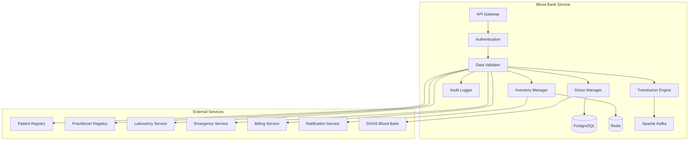

# MS Blood Bank Service

The Blood Bank Service manages blood donation, inventory, transfusion services, and blood banking operations with comprehensive Bangladesh blood safety standards.

## 📋 Service Overview

- **Repository**: [ms-blood-bank-service](https://github.com/zs-his/ms-blood-bank-service)
- **Status**: 🟡 In Progress
- **FHIR Resources**: BiologicallyDerivedProduct, Observation, ServiceRequest, Procedure
- **Primary Database**: PostgreSQL
- **Cache Layer**: Redis
- **Event Streaming**: Apache Kafka

## 🎯 Key Features

### Blood Bank Operations
- **Blood Donation Management**: Donor registration, screening, and collection
- **Blood Inventory Management**: Stock tracking, expiry monitoring, blood typing
- **Transfusion Services**: Blood component preparation and transfusion
- **Quality Control**: Blood safety testing and quality assurance
- **Emergency Services**: Urgent blood requirements and emergency protocols

### Bangladesh-Specific Features
- **Blood Safety Standards**: Bangladesh Directorate General of Health Services (DGHS) blood safety protocols
- **Local Blood Types**: Regional blood type distribution and prevalence
- **Emergency Response**: Bangladesh emergency blood supply management
- **Donor Motivation**: Community blood donation campaigns and awareness

## 🏗️ Architecture



## 📊 Database Schema

### Blood Donation Table
```sql
CREATE TABLE blood_donations (
    id UUID PRIMARY KEY DEFAULT gen_random_uuid(),
    donation_id VARCHAR(50) UNIQUE NOT NULL,
    donor_id UUID NOT NULL,
    facility_id UUID REFERENCES organizations(id),
    donation_date TIMESTAMP NOT NULL,
    donation_type VARCHAR(20) NOT NULL,
    blood_type VARCHAR(10) NOT NULL,
    rh_factor VARCHAR(5) NOT NULL,
    volume_ml INTEGER NOT NULL,
    collection_method VARCHAR(50),
    donor_status VARCHAR(20),
    screening_results JSONB,
    quality_control JSONB,
    processed BOOLEAN DEFAULT false,
    components_created JSONB,
    adverse_reactions JSONB,
    collector JSONB,
    created_at TIMESTAMP DEFAULT CURRENT_TIMESTAMP,
    updated_at TIMESTAMP DEFAULT CURRENT_TIMESTAMP,
    metadata JSONB,
    FOREIGN KEY (donor_id) REFERENCES patients(id)
);
```

### Blood Inventory Table
```sql
CREATE TABLE blood_inventory (
    id UUID PRIMARY KEY DEFAULT gen_random_uuid(),
    inventory_id VARCHAR(50) UNIQUE NOT NULL,
    facility_id UUID REFERENCES organizations(id),
    blood_type VARCHAR(10) NOT NULL,
    rh_factor VARCHAR(5) NOT NULL,
    component_type VARCHAR(20) NOT NULL,
    volume_ml INTEGER NOT NULL,
    units_available INTEGER NOT NULL DEFAULT 0,
    units_reserved INTEGER NOT NULL DEFAULT 0,
    units_expired INTEGER NOT NULL DEFAULT 0,
    collection_date DATE NOT NULL,
    expiry_date DATE NOT NULL,
    storage_location VARCHAR(100),
    storage_conditions JSONB,
    quality_status VARCHAR(20) DEFAULT 'available',
    donor_id UUID REFERENCES patients(id),
    donation_id UUID REFERENCES blood_donations(id),
    created_at TIMESTAMP DEFAULT CURRENT_TIMESTAMP,
    updated_at TIMESTAMP DEFAULT CURRENT_TIMESTAMP,
    metadata JSONB
);
```

### Blood Transfusion Table
```sql
CREATE TABLE blood_transfusions (
    id UUID PRIMARY KEY DEFAULT gen_random_uuid(),
    transfusion_id VARCHAR(50) UNIQUE NOT NULL,
    patient_id UUID NOT NULL,
    facility_id UUID REFERENCES organizations(id),
    encounter_id UUID REFERENCES encounters(id),
    transfusion_date TIMESTAMP NOT NULL,
    blood_type VARCHAR(10) NOT NULL,
    rh_factor VARCHAR(5) NOT NULL,
    component_type VARCHAR(20) NOT NULL,
    units_transfused INTEGER NOT NULL,
    volume_ml INTEGER NOT NULL,
    indication TEXT,
    transfusion_status VARCHAR(20) DEFAULT 'pending',
    cross_match_results JSONB,
    pre_transfusion_vitals JSONB,
    post_transfusion_vitals JSONB,
    adverse_reactions JSONB,
    transfusionist JSONB,
    physician JSONB,
    inventory_reference UUID REFERENCES blood_inventory(id),
    created_at TIMESTAMP DEFAULT CURRENT_TIMESTAMP,
    updated_at TIMESTAMP DEFAULT CURRENT_TIMESTAMP,
    metadata JSONB,
    FOREIGN KEY (patient_id) REFERENCES patients(id)
);
```

## 🔌 API Endpoints

### Blood Donation Management
```go
// Create blood donation
POST /api/blood-bank/donations
{
  "donorId": "donor-12345",
  "facilityId": "facility-67890",
  "donationDate": "2026-01-21T10:00:00+06:00",
  "donationType": "whole_blood",
  "bloodType": "O",
  "rhFactor": "positive",
  "volumeMl": 450,
  "collectionMethod": "venipuncture",
  "donorStatus": "eligible",
  "screeningResults": {
    "hiv": "negative",
    "hbsag": "negative",
    "hcv": "negative",
    "syphilis": "negative",
    "malaria": "negative"
  },
  "qualityControl": {
    "hemoglobin": 14.5,
    "bloodPressure": "120/80",
    "temperature": 36.5,
    "weight": 70
  },
  "collector": {
    "reference": "Practitioner/111",
    "display": "Nurse Jane Smith"
  }
}

// Get donation by ID
GET /api/blood-bank/donations/{id}

// Search donations
GET /api/blood-bank/donations?donor=12345&date=2026-01-21&blood-type=O

// Update donation status
PUT /api/blood-bank/donations/{id}/status
{
  "processed": true,
  "componentsCreated": [
    {
      "componentType": "red_blood_cells",
      "volumeMl": 250,
      "expiryDate": "2026-02-21"
    },
    {
      "componentType": "plasma",
      "volumeMl": 200,
      "expiryDate": "2026-03-21"
    }
  ]
}
```

### Blood Inventory Management
```go
// Get blood inventory
GET /api/blood-bank/inventory?facility=67890&blood-type=O&component=red_blood_cells

// Update inventory
PUT /api/blood-bank/inventory/{inventoryId}
{
  "unitsAvailable": 10,
  "unitsReserved": 2,
  "qualityStatus": "available",
  "storageLocation": "Blood Bank Refrigerator A"
}

// Reserve blood units
POST /api/blood-bank/inventory/reserve
{
  "patientId": "patient-111",
  "bloodType": "O",
  "rhFactor": "positive",
  "componentType": "red_blood_cells",
  "unitsRequired": 2,
  "urgency": "routine",
  "indication": "Elective surgery",
  "requestedBy": {
    "reference": "Practitioner/222",
    "display": "Dr. John Doe"
  }
}

// Get inventory alerts
GET /api/blood-bank/inventory/alerts?facility=67890&type=low_stock

// Get expiring units
GET /api/blood-bank/inventory/expiring?days=7&facility=67890
```

### Blood Transfusion
```go
// Create blood transfusion
POST /api/blood-bank/transfusions
{
  "patientId": "patient-111",
  "facilityId": "facility-67890",
  "encounterId": "encounter-222",
  "transfusionDate": "2026-01-21T14:00:00+06:00",
  "bloodType": "O",
  "rhFactor": "positive",
  "componentType": "red_blood_cells",
  "unitsTransfused": 2,
  "volumeMl": 500,
  "indication": "Elective cholecystectomy",
  "crossMatchResults": {
    "majorCrossMatch": "compatible",
    "minorCrossMatch": "compatible",
    "antibodyScreen": "negative"
  },
  "preTransfusionVitals": {
    "bloodPressure": "120/80",
    "heartRate": 72,
    "temperature": 36.5,
    "oxygenSaturation": 98
  },
  "transfusionist": {
    "reference": "Practitioner/333",
    "display": "Nurse Mary Johnson"
  },
  "physician": {
    "reference": "Practitioner/222",
    "display": "Dr. John Doe"
  }
}

// Get transfusion by ID
GET /api/blood-bank/transfusions/{id}

// Search transfusions
GET /api/blood-bank/transfusions?patient=111&date=2026-01-21&status=completed

// Update transfusion status
PUT /api/blood-bank/transfusions/{id}/status
{
  "transfusionStatus": "completed",
  "postTransfusionVitals": {
    "bloodPressure": "118/78",
    "heartRate": 75,
    "temperature": 36.6,
    "oxygenSaturation": 99
  },
  "adverseReactions": []
}
```

## 🏥 Bangladesh Blood Bank Features

### Blood Type Distribution
```go
var BangladeshBloodTypeDistribution = map[string]BloodTypeStats{
    "O_positive": {
        BloodType:    "O",
        RhFactor:     "positive",
        Prevalence:   35.0,
        UniversalDonor: true,
        UniversalRecipient: false,
        CommonInBangladesh: true,
    },
    "O_negative": {
        BloodType:    "O",
        RhFactor:     "negative",
        Prevalence:   6.0,
        UniversalDonor: true,
        UniversalRecipient: false,
        CommonInBangladesh: true,
        CriticalNeed: true,
    },
    "A_positive": {
        BloodType:    "A",
        RhFactor:     "positive",
        Prevalence:   28.0,
        UniversalDonor: false,
        UniversalRecipient: false,
        CommonInBangladesh: true,
    },
    "A_negative": {
        BloodType:    "A",
        RhFactor:     "negative",
        Prevalence:   4.0,
        UniversalDonor: false,
        UniversalRecipient: false,
        CommonInBangladesh: true,
    },
    "B_positive": {
        BloodType:    "B",
        RhFactor:     "positive",
        Prevalence:   20.0,
        UniversalDonor: false,
        UniversalRecipient: false,
        CommonInBangladesh: true,
    },
    "B_negative": {
        BloodType:    "B",
        RhFactor:     "negative",
        Prevalence:   3.0,
        UniversalDonor: false,
        UniversalRecipient: false,
        CommonInBangladesh: true,
    },
    "AB_positive": {
        BloodType:    "AB",
        RhFactor:     "positive",
        Prevalence:   3.0,
        UniversalDonor: false,
        UniversalRecipient: true,
        CommonInBangladesh: true,
    },
    "AB_negative": {
        BloodType:    "AB",
        RhFactor:     "negative",
        Prevalence:   1.0,
        UniversalDonor: false,
        UniversalRecipient: true,
        CommonInBangladesh: true,
        CriticalNeed: true,
    },
}

type BloodTypeStats struct {
    BloodType           string  `json:"blood_type"`
    RhFactor            string  `json:"rh_factor"`
    Prevalence          float64 `json:"prevalence"`
    UniversalDonor      bool    `json:"universal_donor"`
    UniversalRecipient  bool    `json:"universal_recipient"`
    CommonInBangladesh  bool    `json:"common_in_bangladesh"`
    CriticalNeed        bool    `json:"critical_need"`
}
```

### Blood Safety Standards
```go
type BloodSafetyStandard struct {
    TestName         string   `json:"test_name"`
    Required         bool     `json:"required"`
    Method           string   `json:"method"`
    TurnaroundHours  int      `json:"turnaround_hours"`
    MandatoryForAll  bool     `json:"mandatory_for_all"`
    DGHSApproved     bool     `json:"dghs_approved"`
}

var BangladeshBloodSafetyStandards = []BloodSafetyStandard{
    {
        TestName:        "HIV Antibody",
        Required:        true,
        Method:          "ELISA",
        TurnaroundHours: 4,
        MandatoryForAll: true,
        DGHSApproved:    true,
    },
    {
        TestName:        "Hepatitis B Surface Antigen",
        Required:        true,
        Method:          "ELISA",
        TurnaroundHours: 4,
        MandatoryForAll: true,
        DGHSApproved:    true,
    },
    {
        TestName:        "Hepatitis C Antibody",
        Required:        true,
        Method:          "ELISA",
        TurnaroundHours: 4,
        MandatoryForAll: true,
        DGHSApproved:    true,
    },
    {
        TestName:        "Syphilis (VDRL/RPR)",
        Required:        true,
        Method:          "RPR",
        TurnaroundHours: 2,
        MandatoryForAll: true,
        DGHSApproved:    true,
    },
    {
        TestName:        "Malaria Parasite",
        Required:        true,
        Method:          "Microscopy",
        TurnaroundHours: 2,
        MandatoryForAll: true,
        DGHSApproved:    true,
    },
    {
        TestName:        "Hemoglobin",
        Required:        true,
        Method:          "Hemoglobinometer",
        TurnaroundHours: 1,
        MandatoryForAll: true,
        DGHSApproved:    true,
    },
    {
        TestName:        "Blood Group & Rh Factor",
        Required:        true,
        Method:          "Card Method",
        TurnaroundHours: 1,
        MandatoryForAll: true,
        DGHSApproved:    true,
    },
}
```

## 🔍 Search and Filtering

### Advanced Donation Search
```go
type DonationSearchCriteria struct {
    DonorID       string    `json:"donor_id"`
    FacilityID    string    `json:"facility_id"`
    DonationType  string    `json:"donation_type"`
    BloodType     string    `json:"blood_type"`
    RhFactor      string    `json:"rh_factor"`
    DateFrom      time.Time `json:"date_from"`
    DateTo        time.Time `json:"date_to"`
    Status        string    `json:"status"`
    CollectorID   string    `json:"collector_id"`
}

func (s *BloodBankService) SearchDonations(criteria DonationSearchCriteria) ([]BloodDonation, error) {
    query := s.db.NewSelect().Model(&BloodDonation{})
    
    if criteria.DonorID != "" {
        query = query.Where("donor_id = ?", criteria.DonorID)
    }
    
    if criteria.FacilityID != "" {
        query = query.Where("facility_id = ?", criteria.FacilityID)
    }
    
    if criteria.BloodType != "" {
        query = query.Where("blood_type = ?", criteria.BloodType)
    }
    
    if criteria.RhFactor != "" {
        query = query.Where("rh_factor = ?", criteria.RhFactor)
    }
    
    if !criteria.DateFrom.IsZero() {
        query = query.Where("donation_date >= ?", criteria.DateFrom)
    }
    
    if !criteria.DateTo.IsZero() {
        query = query.Where("donation_date <= ?", criteria.DateTo)
    }
    
    var donations []BloodDonation
    err := query.Scan(ctx, &donations)
    return donations, err
}
```

## 📈 Performance Optimization

### Caching Strategy
```go
// Cache blood inventory for 10 minutes
func (s *BloodBankService) GetBloodInventory(facilityID string) ([]BloodInventory, error) {
    cacheKey := fmt.Sprintf("blood_inventory:%s", facilityID)
    
    if cached, err := s.cache.Get(cacheKey); err == nil {
        return cached.([]BloodInventory), nil
    }
    
    inventory, err := s.repository.GetByFacility(facilityID)
    if err != nil {
        return nil, err
    }
    
    s.cache.Set(cacheKey, inventory, 10*time.Minute)
    return inventory, nil
}

// Cache blood type distribution for 1 hour
func (s *BloodBankService) GetBloodTypeDistribution() (map[string]BloodTypeStats, error) {
    cacheKey := "blood_type_distribution"
    
    if cached, err := s.cache.Get(cacheKey); err == nil {
        return cached.(map[string]BloodTypeStats), nil
    }
    
    distribution := BangladeshBloodTypeDistribution
    s.cache.Set(cacheKey, distribution, time.Hour)
    return distribution, nil
}
```

### Database Indexing
```sql
-- Performance indexes
CREATE INDEX idx_blood_donations_donor ON blood_donations(donor_id);
CREATE INDEX idx_blood_donations_facility ON blood_donations(facility_id);
CREATE INDEX idx_blood_donations_date ON blood_donations(donation_date);
CREATE INDEX idx_blood_donations_blood_type ON blood_donations(blood_type, rh_factor);
CREATE INDEX idx_blood_inventory_facility ON blood_inventory(facility_id);
CREATE INDEX idx_blood_inventory_blood_type ON blood_inventory(blood_type, rh_factor);
CREATE INDEX idx_blood_inventory_component ON blood_inventory(component_type);
CREATE INDEX idx_blood_inventory_expiry ON blood_inventory(expiry_date);
CREATE INDEX idx_blood_transfusions_patient ON blood_transfusions(patient_id);
CREATE INDEX idx_blood_transfusions_date ON blood_transfusions(transfusion_date);
CREATE INDEX idx_blood_transfusions_status ON blood_transfusions(transfusion_status);
```

## 🩸 Blood Component Processing

### Component Separation
```go
type BloodComponent struct {
    ComponentType   string    `json:"component_type"`
    VolumeMl        int       `json:"volume_ml"`
    StorageTemp     float64   `json:"storage_temp"`
    StorageConditions string   `json:"storage_conditions"`
    ExpiryDays      int       `json:"expiry_days"`
    ProcessingTime  int       `json:"processing_time_minutes"`
    Indications     []string  `json:"indications"`
}

var BloodComponents = map[string]BloodComponent{
    "whole_blood": {
        ComponentType:    "whole_blood",
        VolumeMl:         450,
        StorageTemp:      4.0,
        StorageConditions: "Refrigerated (2-6°C)",
        ExpiryDays:       35,
        ProcessingTime:   0,
        Indications:      []string{"Massive transfusion", "Exchange transfusion"},
    },
    "red_blood_cells": {
        ComponentType:    "red_blood_cells",
        VolumeMl:         250,
        StorageTemp:      4.0,
        StorageConditions: "Refrigerated (2-6°C)",
        ExpiryDays:       42,
        ProcessingTime:   15,
        Indications:      []string{"Anemia", "Surgery", "Trauma"},
    },
    "plasma": {
        ComponentType:    "plasma",
        VolumeMl:         200,
        StorageTemp:      -30.0,
        StorageConditions: "Frozen (-18°C or below)",
        ExpiryDays:       365,
        ProcessingTime:   20,
        Indications:      []string{"Coagulopathy", "Massive transfusion", "Plasma exchange"},
    },
    "platelets": {
        ComponentType:    "platelets",
        VolumeMl:         50,
        StorageTemp:      22.0,
        StorageConditions: "Room temperature (20-24°C) with agitation",
        ExpiryDays:       5,
        ProcessingTime:   25,
        Indications:      []string{"Thrombocytopenia", "Platelet dysfunction"},
    },
    "cryoprecipitate": {
        ComponentType:    "cryoprecipitate",
        VolumeMl:         15,
        StorageTemp:      -30.0,
        StorageConditions: "Frozen (-18°C or below)",
        ExpiryDays:       365,
        ProcessingTime:   30,
        Indications:      []string{"Hemophilia", "Fibrinogen deficiency", "DIC"},
    },
}

func (s *BloodBankService) ProcessBloodComponents(donationID string) ([]BloodComponent, error) {
    // Get donation
    donation, err := s.repository.GetDonation(donationID)
    if err != nil {
        return nil, err
    }
    
    var components []BloodComponent
    
    // Process based on donation type
    switch donation.DonationType {
    case "whole_blood":
        // Process whole blood into components
        components = []BloodComponent{
            BloodComponents["red_blood_cells"],
            BloodComponents["plasma"],
            BloodComponents["platelets"],
        }
        
    case "apheresis_platelets":
        components = []BloodComponent{BloodComponents["platelets"]}
        
    case "apheresis_plasma":
        components = []BloodComponent{BloodComponents["plasma"]}
        
    default:
        return nil, fmt.Errorf("unsupported donation type: %s", donation.DonationType)
    }
    
    // Create inventory records for each component
    for _, component := range components {
        inventory := &BloodInventory{
            InventoryID:     generateID(),
            FacilityID:      donation.FacilityID,
            BloodType:       donation.BloodType,
            RhFactor:        donation.RhFactor,
            ComponentType:   component.ComponentType,
            VolumeMl:        component.VolumeMl,
            UnitsAvailable:  1,
            CollectionDate:  donation.DonationDate,
            ExpiryDate:      time.Now().AddDate(0, 0, component.ExpiryDays),
            StorageLocation: "Blood Bank Storage",
            QualityStatus:   "available",
            DonorID:         donation.DonorID,
            DonationID:      donation.ID,
        }
        
        err = s.repository.CreateInventory(inventory)
        if err != nil {
            return nil, fmt.Errorf("failed to create inventory for %s: %w", component.ComponentType, err)
        }
    }
    
    return components, nil
}
```

## 🚨 Emergency Blood Management

### Emergency Blood Requests
```go
type EmergencyBloodRequest struct {
    RequestID       string    `json:"request_id"`
    PatientID       string    `json:"patient_id"`
    FacilityID      string    `json:"facility_id"`
    BloodType       string    `json:"blood_type"`
    RhFactor        string    `json:"rh_factor"`
    ComponentType   string    `json:"component_type"`
    UnitsRequired   int       `json:"units_required"`
    Urgency         string    `json:"urgency"`
    Indication      string    `json:"indication"`
    RequestedBy     string    `json:"requested_by"`
    RequestTime     time.Time `json:"request_time"`
    RequiredBy      time.Time `json:"required_by"`
    Status          string    `json:"status"`
    FulfilledBy     string    `json:"fulfilled_by"`
    FulfilledTime   time.Time `json:"fulfilled_time"`
}

func (s *BloodBankService) ProcessEmergencyRequest(request *EmergencyBloodRequest) error {
    // Check inventory availability
    available, err := s.checkInventoryAvailability(request.FacilityID, request.BloodType, request.RhFactor, request.ComponentType, request.UnitsRequired)
    if err != nil {
        return err
    }
    
    if !available {
        // Check nearby facilities
        nearbyFacilities, err := s.getNearbyFacilities(request.FacilityID)
        if err != nil {
            return err
        }
        
        for _, facility := range nearbyFacilities {
            available, err = s.checkInventoryAvailability(facility.ID, request.BloodType, request.RhFactor, request.ComponentType, request.UnitsRequired)
            if err == nil && available {
                // Arrange inter-facility transfer
                err = s.arrangeInterFacilityTransfer(request, facility.ID)
                if err == nil {
                    break
                }
            }
        }
        
        if !available {
            // Trigger emergency blood drive
            err = s.triggerEmergencyBloodDrive(request)
            if err != nil {
                return fmt.Errorf("emergency blood unavailable and failed to trigger blood drive: %w", err)
            }
        }
    }
    
    // Reserve blood units
    err = s.reserveBloodUnits(request)
    if err != nil {
        return err
    }
    
    // Update request status
    request.Status = "fulfilled"
    request.FulfilledTime = time.Now()
    
    // Send notifications
    err = s.sendEmergencyNotifications(request)
    if err != nil {
        log.Printf("Failed to send emergency notifications: %v", err)
    }
    
    return nil
}

func (s *BloodBankService) triggerEmergencyBloodDrive(request *EmergencyBloodRequest) error {
    // Get eligible donors
    donors, err := s.getEligibleDonors(request.FacilityID, request.BloodType, request.RhFactor)
    if err != nil {
        return err
    }
    
    // Send emergency notifications to donors
    for _, donor := range donors {
        notification := BloodDonationNotification{
            DonorID:     donor.ID,
            BloodType:  request.BloodType,
            RhFactor:   request.RhFactor,
            Urgency:    "emergency",
            Message:    fmt.Sprintf("URGENT: %s %s blood needed at %s. Please donate immediately.", request.BloodType, request.RhFactor, s.getFacilityName(request.FacilityID)),
            ContactInfo: s.getFacilityContact(request.FacilityID),
        }
        
        err = s.notificationService.SendEmergencyDonationAlert(notification)
        if err != nil {
            log.Printf("Failed to send emergency alert to donor %s: %v", donor.ID, err)
        }
    }
    
    return nil
}
```

## 🔒 Security Features

### Access Control
```go
func (s *BloodBankService) CanAccessBloodBankData(userID, recordID string, action string) bool {
    // Check user permissions
    permissions := s.authService.GetUserPermissions(userID)
    
    switch action {
    case "read":
        return permissions.Contains("blood_bank.read") || 
               s.canViewPatientBloodData(userID, recordID)
    case "write":
        return permissions.Contains("blood_bank.write") || 
               s.isBloodBankPersonnel(userID)
    case "transfuse":
        return permissions.Contains("blood_bank.transfuse") || 
               s.isQualifiedTransfusionist(userID)
    case "process":
        return permissions.Contains("blood_bank.process") || 
               s.isQualifiedBloodBankTechnician(userID)
    default:
        return false
    }
}

func (s *BloodBankService) isBloodBankPersonnel(userID string) bool {
    practitioner, err := s.practitionerService.GetPractitionerByUser(userID)
    if err != nil {
        return false
    }
    
    // Check if practitioner has blood bank specialization
    for _, role := range practitioner.Roles {
        if role.Specialty == "blood_bank" || 
           role.Specialty == "transfusion_medicine" {
            return true
        }
    }
    
    return false
}
```

### Data Privacy
```go
func (s *BloodBankService) anonymizeSensitiveDonations(donations []BloodDonation, requestUserID string) []BloodDonation {
    // Check if requester has full access
    if s.authService.HasFullAccess(requestUserID) {
        return donations
    }
    
    // Anonymize sensitive donor information
    var anonymized []BloodDonation
    for _, donation := range donations {
        if s.isSensitiveDonation(donation) {
            // Remove sensitive details
            donation.DonorID = "anonymous"
            donation.ScreeningResults = nil
            donation.QualityControl = nil
            donation.AdverseReactions = nil
        }
        anonymized = append(anonymized, donation)
    }
    
    return anonymized
}

func (s *BloodBankService) isSensitiveDonation(donation BloodDonation) bool {
    // Check if donation has sensitive health information
    if donation.ScreeningResults != nil {
        for _, result := range donation.ScreeningResults {
            if result == "positive" {
                return true
            }
        }
    }
    
    return false
}
```

## 📊 Monitoring and Metrics

### Health Checks
```go
func (s *BloodBankService) HealthCheck() map[string]interface{} {
    return map[string]interface{}{
        "database":          s.checkDatabase(),
        "cache":             s.checkCache(),
        "kafka":             s.checkKafka(),
        "donor_manager":     s.checkDonorManager(),
        "inventory_manager":  s.checkInventoryManager(),
        "transfusion_engine": s.checkTransfusionEngine(),
        "dghs_integration":  s.checkDGHSIntegration(),
        "patient_service":   s.checkPatientService(),
        "timestamp":         time.Now(),
    }
}
```

### Performance Metrics
```go
// Prometheus metrics
var (
    bloodBankRequestsTotal = prometheus.NewCounterVec(
        prometheus.CounterOpts{
            Name: "blood_bank_requests_total",
            Help: "Total number of blood bank requests",
        },
        []string{"method", "endpoint", "status"},
    )
    
    donationProcessingTime = prometheus.NewHistogramVec(
        prometheus.HistogramOpts{
            Name: "blood_donation_processing_seconds",
            Help: "Time taken to process blood donations",
        },
        []string{"donation_type", "facility"},
    )
    
    inventoryAlertsTotal = prometheus.NewCounterVec(
        prometheus.CounterOpts{
            Name: "blood_inventory_alerts_total",
            Help: "Total number of blood inventory alerts",
        },
        []string{"alert_type", "blood_type", "facility"},
    )
)
```

## 🧪 Testing

### Unit Tests
```go
func TestBloodBankService_CreateBloodDonation(t *testing.T) {
    service := NewBloodBankService(mockRepo, mockCache, mockDonorManager)
    donation := &BloodDonation{
        DonorID:       "donor-12345",
        FacilityID:    "facility-67890",
        DonationDate:  time.Now(),
        DonationType:  "whole_blood",
        BloodType:     "O",
        RhFactor:      "positive",
        VolumeMl:      450,
        DonorStatus:   "eligible",
        ScreeningResults: map[string]string{
            "hiv": "negative",
            "hbsag": "negative",
            "hcv": "negative",
            "syphilis": "negative",
            "malaria": "negative",
        },
        QualityControl: map[string]interface{}{
            "hemoglobin": 14.5,
            "bloodPressure": "120/80",
            "temperature": 36.5,
            "weight": 70,
        },
        Collector: Reference{Reference: "Practitioner/111"},
    }
    
    result, err := service.CreateBloodDonation(donation)
    
    assert.NoError(t, err)
    assert.NotNil(t, result)
    assert.NotEmpty(t, result.ID)
    assert.Equal(t, "donor-12345", result.DonorID)
    assert.Equal(t, "O", result.BloodType)
}
```

## 🚀 Deployment

### Docker Configuration
```dockerfile
FROM golang:1.25-alpine AS builder

WORKDIR /app
COPY go.mod go.sum ./
RUN go mod download

COPY . .
RUN CGO_ENABLED=0 GOOS=linux go build -o main cmd/server/main.go

FROM alpine:latest
RUN apk --no-cache add ca-certificates
WORKDIR /root/
COPY --from=builder /app/main .
EXPOSE 8080
CMD ["./main"]
```

### Kubernetes Deployment
```yaml
apiVersion: apps/v1
kind: Deployment
metadata:
  name: ms-blood-bank-service
spec:
  replicas: 3
  selector:
    matchLabels:
      app: ms-blood-bank-service
  template:
    metadata:
      labels:
        app: ms-blood-bank-service
    spec:
      containers:
      - name: ms-blood-bank-service
        image: zarish-his/ms-blood-bank-service:latest
        ports:
        - containerPort: 8080
        env:
        - name: DB_HOST
          value: "postgresql-service"
        - name: REDIS_HOST
          value: "redis-service"
        - name: KAFKA_BROKERS
          value: "kafka-service:9092"
        - name: DGHS_BLOOD_BANK_URL
          value: "https://dghs.gov.bd/blood-bank"
```

## 🔗 Related Resources

- **Frontend Integration**: [ESM Inpatient](../frontend/esm-inpatient.md)
- **FHIR Implementation**: [FHIR BiologicallyDerivedProduct Profile](../fhir/biologically-derived-product-profile.md)
- **API Documentation**: [Blood Bank API Reference](../api-reference/rest-apis.md)

---

*Last updated: 2026-01-21*
