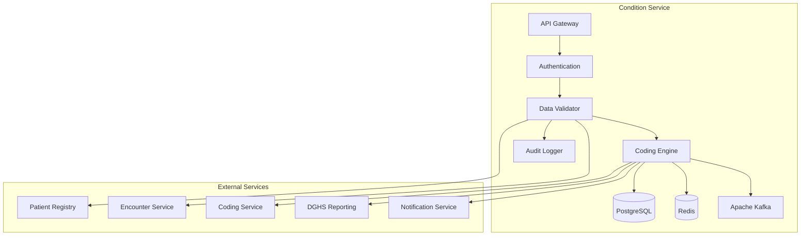

# MS Condition Service

The Condition Service manages medical conditions, diagnoses, allergies, and clinical problems with comprehensive coding support and Bangladesh healthcare context.

## 📋 Service Overview

- **Repository**: [ms-condition-service](https://github.com/zs-his/ms-condition-service)
- **Status**: 🟡 In Progress
- **FHIR Resources**: Condition, AllergyIntolerance, ClinicalImpression
- **Primary Database**: PostgreSQL
- **Cache Layer**: Redis
- **Event Streaming**: Apache Kafka

## 🎯 Key Features

### Condition Management
- **Diagnosis Recording**: Primary and secondary diagnoses
- **Problem List**: Active and resolved conditions
- **Chronic Conditions**: Long-term condition management
- **Acute Conditions**: Short-term illness tracking
- **Clinical Status**: Active, resolved, remission, relapse tracking

### Allergy Management
- **Allergy Recording**: Drug, food, and environmental allergies
- **Severity Levels**: Mild, moderate, severe, life-threatening
- **Reaction Details**: Clinical reactions and manifestations
- **Onset Information**: Allergy onset and duration

### Bangladesh-Specific Features
- **ICD-10 Coding**: Bangladesh ICD-10 implementation
- **Local Disease Patterns**: Tropical diseases and endemic conditions
- **DGHS Reporting**: Notifiable disease reporting
- **Regional Epidemiology**: Bangladesh disease prevalence data

## 🏗️ Architecture



## 📊 Database Schema

### Condition Table
```sql
CREATE TABLE conditions (
    id UUID PRIMARY KEY DEFAULT gen_random_uuid(),
    condition_id VARCHAR(50) UNIQUE NOT NULL,
    patient_id UUID NOT NULL,
    encounter_id UUID REFERENCES encounters(id),
    clinical_status VARCHAR(20) NOT NULL,
    verification_status VARCHAR(20),
    category JSONB NOT NULL,
    severity JSONB,
    code JSONB NOT NULL,
    body_site JSONB,
    subject_type VARCHAR(20) DEFAULT 'patient',
    subject_id UUID NOT NULL,
    onset_date_time TIMESTAMP,
    onset_period JSONB,
    onset_age JSONB,
    onset_range JSONB,
    onset_string TEXT,
    abatement_date_time TIMESTAMP,
    abatement_period JSONB,
    abatement_age JSONB,
    abatement_range JSONB,
    abatement_string TEXT,
    recorded_date TIMESTAMP DEFAULT CURRENT_TIMESTAMP,
    recorder JSONB,
    asserter JSONB,
    stage JSONB,
    evidence JSONB,
    note JSONB,
    created_at TIMESTAMP DEFAULT CURRENT_TIMESTAMP,
    updated_at TIMESTAMP DEFAULT CURRENT_TIMESTAMP,
    metadata JSONB,
    FOREIGN KEY (patient_id) REFERENCES patients(id)
);
```

### Allergy Intolerance Table
```sql
CREATE TABLE allergy_intolerances (
    id UUID PRIMARY KEY DEFAULT gen_random_uuid(),
    allergy_id VARCHAR(50) UNIQUE NOT NULL,
    patient_id UUID NOT NULL,
    clinical_status VARCHAR(20) NOT NULL,
    verification_status VARCHAR(20),
    type VARCHAR(20) NOT NULL,
    category JSONB,
    criticality VARCHAR(20),
    code JSONB NOT NULL,
    patient_type VARCHAR(20) DEFAULT 'patient',
    patient_id_reference UUID NOT NULL,
    encounter_id UUID REFERENCES encounters(id),
    onset_date_time TIMESTAMP,
    onset_period JSONB,
    onset_age JSONB,
    onset_range JSONB,
    onset_string TEXT,
    recorded_date TIMESTAMP DEFAULT CURRENT_TIMESTAMP,
    recorder JSONB,
    asserter JSONB,
    last_occurrence TIMESTAMP,
    note JSONB,
    reaction JSONB,
    created_at TIMESTAMP DEFAULT CURRENT_TIMESTAMP,
    updated_at TIMESTAMP DEFAULT CURRENT_TIMESTAMP,
    metadata JSONB,
    FOREIGN KEY (patient_id) REFERENCES patients(id)
);
```

### Disease Coding Table
```sql
CREATE TABLE disease_codings (
    id UUID PRIMARY KEY DEFAULT gen_random_uuid(),
    code_system VARCHAR(100) NOT NULL,
    code VARCHAR(20) NOT NULL,
    display VARCHAR(500) NOT NULL,
    category VARCHAR(100),
    severity_levels JSONB,
    common_in_bangladesh BOOLEAN DEFAULT false,
    notifiable BOOLEAN DEFAULT false,
    endemic_regions JSONB,
    seasonal_patterns JSONB,
    age_groups JSONB,
    gender_specific BOOLEAN DEFAULT false,
    is_active BOOLEAN DEFAULT true,
    created_at TIMESTAMP DEFAULT CURRENT_TIMESTAMP,
    updated_at TIMESTAMP DEFAULT CURRENT_TIMESTAMP
);
```

## 🔌 API Endpoints

### Condition CRUD Operations
```go
// Create new condition
POST /api/conditions
{
  "clinicalStatus": "active",
  "verificationStatus": "confirmed",
  "category": [{"coding": [{"code": "encounter-diagnosis"}]}],
  "severity": {
    "coding": [{
      "system": "http://snomed.info/sct",
      "code": "24484000",
      "display": "Severe"
    }]
  },
  "code": {
    "coding": [{
      "system": "http://hl7.org/fhir/sid/icd-10",
      "code": "J45.909",
      "display": "Unspecified asthma, uncomplicated"
    }]
  },
  "subject": {"reference": "Patient/12345"},
  "encounter": {"reference": "Encounter/67890"},
  "onsetDateTime": "2026-01-15T10:00:00+06:00",
  "recordedDate": "2026-01-21T10:30:00+06:00"
}

// Get condition by ID
GET /api/conditions/{id}

// Search conditions
GET /api/conditions?patient=12345&clinical-status=active&category=encounter-diagnosis

// Update condition
PUT /api/conditions/{id}

// Resolve condition
POST /api/conditions/{id}/resolve
{
  "abatementDateTime": "2026-01-21T12:00:00+06:00",
  "clinicalStatus": "resolved"
}
```

### Allergy Management
```go
// Create allergy intolerance
POST /api/allergies
{
  "clinicalStatus": "active",
  "verificationStatus": "confirmed",
  "type": "allergy",
  "category": ["medication"],
  "criticality": "high",
  "code": {
    "coding": [{
      "system": "http://snomed.info/sct",
      "code": "387331002",
      "display": "Penicillin"
    }]
  },
  "patient": {"reference": "Patient/12345"},
  "reaction": [{
    "substance": {
      "coding": [{
        "system": "http://snomed.info/sct",
        "code": "387331002",
        "display": "Penicillin"
      }]
    },
    "manifestation": [{
      "coding": [{
        "system": "http://snomed.info/sct",
        "code": "271807003",
        "display": "Eruption of skin"
      }]
    }],
    "severity": "severe"
  }],
  "recordedDate": "2026-01-21T10:30:00+06:00"
}

// Get patient allergies
GET /api/allergies?patient=12345&clinical-status=active

// Update allergy
PUT /api/allergies/{id}
```

### Disease Coding and Search
```go
// Search disease codes
GET /api/diseases/search?q=asthma&system=icd-10&bangladesh=true

// Get disease details
GET /api/diseases/{code}?system=icd-10

// Get Bangladesh-specific diseases
GET /api/diseases/bangladesh?category=tropical&notifiable=true
```

## 🏥 Bangladesh Disease Coding

### ICD-10 Codes for Bangladesh
```go
var BangladeshDiseaseCodes = map[string]DiseaseInfo{
    "A00": {
        Code:        "A00",
        Display:     "Cholera",
        Category:    "infectious_disease",
        Notifiable:  true,
        EndemicIn:   []string{"Bangladesh", "India", "Southeast Asia"},
        Seasonal:    "monsoon",
        CommonInBangladesh: true,
    },
    "A01": {
        Code:        "A01",
        Display:     "Typhoid and paratyphoid fevers",
        Category:    "infectious_disease",
        Notifiable:  true,
        EndemicIn:   []string{"Bangladesh", "South Asia"},
        Seasonal:    "summer",
        CommonInBangladesh: true,
    },
    "J45": {
        Code:        "J45",
        Display:     "Asthma",
        Category:    "respiratory",
        Notifiable:  false,
        Prevalence:  "moderate",
        CommonInBangladesh: true,
    },
    "E11": {
        Code:        "E11",
        Display:     "Type 2 diabetes mellitus",
        Category:    "endocrine",
        Notifiable:  false,
        Prevalence:  "high",
        CommonInBangladesh: true,
    },
    "I10": {
        Code:        "I10",
        Display:     "Essential (primary) hypertension",
        Category:    "cardiovascular",
        Notifiable:  false,
        Prevalence:  "high",
        CommonInBangladesh: true,
    },
}
```

### Tropical Diseases Specific to Bangladesh
```go
var TropicalDiseasesBangladesh = []DiseaseInfo{
    {
        Code:        "A91",
        Display:     "Dengue fever [dengue hemorrhagic fever]",
        Category:    "viral_hemorrhagic_fever",
        Notifiable:  true,
        EndemicIn:   []string{"Bangladesh", "Southeast Asia"},
        Seasonal:    "monsoon_post_monsoon",
        Vector:      "Aedes mosquito",
        Prevention:  "Mosquito control",
    },
    {
        Code:        "A92.0",
        Display:     "Chikungunya virus disease",
        Category:    "viral_fever",
        Notifiable:  true,
        EndemicIn:   []string{"Bangladesh", "India"},
        Seasonal:    "monsoon",
        Vector:      "Aedes mosquito",
        Prevention:  "Mosquito control",
    },
    {
        Code:        "B50",
        Display:     "Plasmodium falciparum malaria",
        Category:    "parasitic_disease",
        Notifiable:  true,
        EndemicIn:   []string{"Bangladesh (Chittagong Hill Tracts)"},
        Seasonal:    "monsoon",
        Vector:      "Anopheles mosquito",
        Prevention:  "Mosquito nets, prophylaxis",
    },
    {
        Code:        "B54",
        Display:     "Unspecified malaria",
        Category:    "parasitic_disease",
        Notifiable:  true,
        EndemicIn:   []string{"Bangladesh (border areas)"},
        Seasonal:    "year_round",
        Vector:      "Anopheles mosquito",
        Prevention:  "Mosquito control",
    },
}
```

## 🔍 Search and Filtering

### Advanced Condition Search
```go
type ConditionSearchCriteria struct {
    PatientID          string    `json:"patient_id"`
    EncounterID        string    `json:"encounter_id"`
    ClinicalStatus     string    `json:"clinical_status"`
    VerificationStatus string    `json:"verification_status"`
    Category           string    `json:"category"`
    Severity           string    `json:"severity"`
    CodeSystem         string    `json:"code_system"`
    Code               string    `json:"code"`
    OnsetDateFrom      time.Time `json:"onset_date_from"`
    OnsetDateTo        time.Time `json:"onset_date_to"`
    RecordedDateFrom   time.Time `json:"recorded_date_from"`
    RecordedDateTo     time.Time `json:"recorded_date_to"`
    Notifiable         bool      `json:"notifiable"`
    BangladeshSpecific  bool      `json:"bangladesh_specific"`
}

func (s *ConditionService) SearchConditions(criteria ConditionSearchCriteria) ([]Condition, error) {
    query := s.db.NewSelect().Model(&Condition{})
    
    if criteria.PatientID != "" {
        query = query.Where("patient_id = ?", criteria.PatientID)
    }
    
    if criteria.ClinicalStatus != "" {
        query = query.Where("clinical_status = ?", criteria.ClinicalStatus)
    }
    
    if criteria.Category != "" {
        query = query.Where("category->>'coding'->>0->>'code' = ?", criteria.Category)
    }
    
    if criteria.Code != "" {
        query = query.Where("code->>'coding'->>0->>'code' = ?", criteria.Code)
    }
    
    if !criteria.OnsetDateFrom.IsZero() {
        query = query.Where("onset_date_time >= ?", criteria.OnsetDateFrom)
    }
    
    var conditions []Condition
    err := query.Scan(ctx, &conditions)
    return conditions, err
}
```

## 📈 Performance Optimization

### Caching Strategy
```go
// Cache active conditions for 30 minutes
func (s *ConditionService) GetActiveConditions(patientID string) ([]Condition, error) {
    cacheKey := fmt.Sprintf("active_conditions:%s", patientID)
    
    // Try cache first
    if cached, err := s.cache.Get(cacheKey); err == nil {
        return cached.([]Condition), nil
    }
    
    // Get from database
    conditions, err := s.repository.GetActiveByPatient(patientID)
    if err != nil {
        return nil, err
    }
    
    // Cache for 30 minutes
    s.cache.Set(cacheKey, conditions, 30*time.Minute)
    return conditions, nil
}

// Cache disease codes for 2 hours
func (s *ConditionService) GetDiseaseCode(code, system string) (*DiseaseInfo, error) {
    cacheKey := fmt.Sprintf("disease_code:%s:%s", system, code)
    
    if cached, err := s.cache.Get(cacheKey); err == nil {
        return cached.(*DiseaseInfo), nil
    }
    
    disease, err := s.repository.GetDiseaseCode(code, system)
    if err != nil {
        return nil, err
    }
    
    s.cache.Set(cacheKey, disease, 2*time.Hour)
    return disease, nil
}
```

### Database Indexing
```sql
-- Performance indexes
CREATE INDEX idx_conditions_patient ON conditions(patient_id);
CREATE INDEX idx_conditions_status ON conditions(clinical_status);
CREATE INDEX idx_conditions_code ON conditions USING gin(to_tsvector('english', code->>'coding'->>0->>'code'));
CREATE INDEX idx_conditions_category ON conditions USING gin(to_tsvector('english', category->>'coding'->>0->>'code'));
CREATE INDEX idx_conditions_onset ON conditions(onset_date_time);
CREATE INDEX idx_conditions_recorded ON conditions(recorded_date);
CREATE INDEX idx_allergies_patient ON allergy_intolerances(patient_id);
CREATE INDEX idx_allergies_status ON allergy_intolerances(clinical_status);
CREATE INDEX idx_disease_codes ON disease_codings(code, code_system);
CREATE INDEX idx_disease_codes_bangladesh ON disease_codings(common_in_bangladesh);
```

## 🚨 Notifiable Disease Reporting

### DGHS Integration
```go
type NotifiableDiseaseReport struct {
    DiseaseCode     string    `json:"disease_code"`
    DiseaseName     string    `json:"disease_name"`
    PatientID       string    `json:"patient_id"`
    Age             int       `json:"age"`
    Gender          string    `json:"gender"`
    Location        string    `json:"location"`
    OnsetDate       time.Time `json:"onset_date"`
    ReportedDate    time.Time `json:"reported_date"`
    ReportingFacility string  `json:"reporting_facility"`
    ReporterID      string    `json:"reporter_id"`
}

func (s *ConditionService) reportNotifiableDisease(condition *Condition) error {
    // Check if condition is notifiable
    disease, err := s.repository.GetDiseaseCode(
        condition.Code.Coding[0].Code,
        condition.Code.Coding[0].System,
    )
    if err != nil || !disease.Notifiable {
        return nil
    }
    
    // Get patient information
    patient, err := s.patientService.GetPatient(condition.PatientID)
    if err != nil {
        return err
    }
    
    // Create report
    report := NotifiableDiseaseReport{
        DiseaseCode:      condition.Code.Coding[0].Code,
        DiseaseName:      disease.Display,
        PatientID:        condition.PatientID,
        Age:              calculateAge(patient.BirthDate),
        Gender:           patient.Gender,
        Location:         patient.Address.City,
        OnsetDate:        condition.OnsetDateTime,
        ReportedDate:     time.Now(),
        ReportingFacility: getCurrentFacility(),
        ReporterID:       getCurrentUserID(),
    }
    
    // Send to DGHS
    return s.dghsService.SubmitNotifiableDisease(report)
}
```

## 🔒 Security Features

### Access Control
```go
func (s *ConditionService) CanAccessCondition(userID, conditionID string, action string) bool {
    // Check user permissions
    permissions := s.authService.GetUserPermissions(userID)
    
    switch action {
    case "read":
        return permissions.Contains("condition.read") || 
               s.canViewPatientData(userID, conditionID)
    case "write":
        return permissions.Contains("condition.write") || 
               s.canRecordCondition(userID, conditionID)
    case "delete":
        return permissions.Contains("condition.delete")
    default:
        return false
    }
}

func (s *ConditionService) canRecordCondition(userID, conditionID string) bool {
    condition, err := s.repository.GetByID(conditionID)
    if err != nil {
        return false
    }
    
    // Check if user is healthcare provider
    return s.authService.IsHealthcareProvider(userID) && 
           s.authService.CanAccessPatient(userID, condition.PatientID)
}
```

### Data Privacy
```go
func (s *ConditionService) anonymizeSensitiveConditions(conditions []Condition, requestUserID string) []Condition {
    // Check if requester has full access
    if s.authService.HasFullAccess(requestUserID) {
        return conditions
    }
    
    // Anonymize sensitive conditions (HIV, mental health, etc.)
    var anonymized []Condition
    for _, condition := range conditions {
        if s.isSensitiveCondition(condition) {
            // Remove sensitive details
            condition.Note = nil
            condition.Evidence = nil
            condition.Recorder = nil
        }
        anonymized = append(anonymized, condition)
    }
    
    return anonymized
}

func (s *ConditionService) isSensitiveCondition(condition Condition) bool {
    sensitiveCodes := []string{
        "B20",    // HIV disease
        "F20",    // Schizophrenia
        "F32",    // Depressive episode
        "F41",    // Anxiety disorders
        // Add more sensitive condition codes
    }
    
    for _, code := range sensitiveCodes {
        if condition.Code.Coding[0].Code == code {
            return true
        }
    }
    
    return false
}
```

## 📊 Monitoring and Metrics

### Health Checks
```go
func (s *ConditionService) HealthCheck() map[string]interface{} {
    return map[string]interface{}{
        "database":         s.checkDatabase(),
        "cache":            s.checkCache(),
        "kafka":            s.checkKafka(),
        "coding_service":  s.checkCodingService(),
        "dghs_service":    s.checkDGHSIntegration(),
        "patient_service": s.checkPatientService(),
        "timestamp":        time.Now(),
    }
}
```

### Performance Metrics
```go
// Prometheus metrics
var (
    conditionRequestsTotal = prometheus.NewCounterVec(
        prometheus.CounterOpts{
            Name: "condition_requests_total",
            Help: "Total number of condition requests",
        },
        []string{"method", "endpoint", "status"},
    )
    
    notifiableDiseaseReports = prometheus.NewCounterVec(
        prometheus.CounterOpts{
            Name: "notifiable_disease_reports_total",
            Help: "Total number of notifiable disease reports",
        },
        []string{"disease_code", "status"},
    )
)
```

## 🧪 Testing

### Unit Tests
```go
func TestConditionService_CreateCondition(t *testing.T) {
    service := NewConditionService(mockRepo, mockCache, mockDGHS)
    condition := &Condition{
        ClinicalStatus:     "active",
        VerificationStatus: "confirmed",
        Category:          []Code{{Coding: []Coding{{Code: "encounter-diagnosis"}}}},
        Code:              Code{Coding: []Coding{{System: "http://hl7.org/fhir/sid/icd-10", Code: "J45.909"}}},
        PatientID:         "patient-123",
        EncounterReference: "encounter-456",
        OnsetDateTime:     time.Now(),
        RecordedDate:      time.Now(),
    }
    
    result, err := service.CreateCondition(condition)
    
    assert.NoError(t, err)
    assert.NotNil(t, result)
    assert.NotEmpty(t, result.ID)
    assert.Equal(t, "active", result.ClinicalStatus)
    assert.Equal(t, "J45.909", result.Code.Coding[0].Code)
}
```

## 🚀 Deployment

### Docker Configuration
```dockerfile
FROM golang:1.25-alpine AS builder

WORKDIR /app
COPY go.mod go.sum ./
RUN go mod download

COPY . .
RUN CGO_ENABLED=0 GOOS=linux go build -o main cmd/server/main.go

FROM alpine:latest
RUN apk --no-cache add ca-certificates
WORKDIR /root/
COPY --from=builder /app/main .
EXPOSE 8080
CMD ["./main"]
```

### Kubernetes Deployment
```yaml
apiVersion: apps/v1
kind: Deployment
metadata:
  name: ms-condition-service
spec:
  replicas: 3
  selector:
    matchLabels:
      app: ms-condition-service
  template:
    metadata:
      labels:
        app: ms-condition-service
    spec:
      containers:
      - name: ms-condition-service
        image: zarish-his/ms-condition-service:latest
        ports:
        - containerPort: 8080
        env:
        - name: DB_HOST
          value: "postgresql-service"
        - name: REDIS_HOST
          value: "redis-service"
        - name: KAFKA_BROKERS
          value: "kafka-service:9092"
        - name: DGHS_SERVICE_URL
          value: "https://dghs.gov.bd/api"
```

## 🔗 Related Resources

- **Frontend Integration**: [ESM Patient Chart](../frontend/esm-patient-chart.md)
- **FHIR Implementation**: [FHIR Condition Profile](../fhir/condition-profile.md)
- **API Documentation**: [Condition API Reference](../api-reference/rest-apis.md)

---

*Last updated: 2026-01-21*
