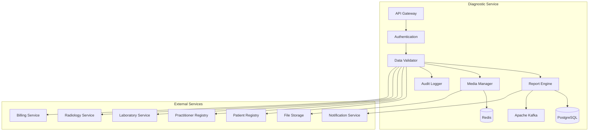

# MS Diagnostic Service

The Diagnostic Service manages diagnostic reports, imaging studies, and clinical pathology services with comprehensive integration with radiology and laboratory services.

## 📋 Service Overview

- **Repository**: [ms-diagnostic-service](https://github.com/zs-his/ms-diagnostic-service)
- **Status**: 🟡 In Progress
- **FHIR Resources**: DiagnosticReport, ImagingStudy, Media, Observation
- **Primary Database**: PostgreSQL
- **Cache Layer**: Redis
- **Event Streaming**: Apache Kafka

## 🎯 Key Features

### Diagnostic Management
- **Report Generation**: Comprehensive diagnostic report creation
- **Imaging Studies**: Radiology and imaging study management
- **Media Management**: Images, videos, and other media files
- **Result Interpretation**: Clinical interpretation and findings
- **Quality Assurance**: Report quality and validation

### Bangladesh-Specific Features
- **Local Disease Patterns**: Bangladesh-specific diagnostic protocols
- **Resource Optimization**: Cost-effective diagnostic strategies
- **Regional Expertise**: Local specialist interpretation networks
- **Government Reporting**: DGHS diagnostic reporting requirements

## 🏗️ Architecture



## 📊 Database Schema

### Diagnostic Report Table
```sql
CREATE TABLE diagnostic_reports (
    id UUID PRIMARY KEY DEFAULT gen_random_uuid(),
    report_id VARCHAR(50) UNIQUE NOT NULL,
    patient_id UUID NOT NULL,
    encounter_id UUID REFERENCES encounters(id),
    status VARCHAR(20) NOT NULL DEFAULT 'preliminary',
    category JSONB NOT NULL,
    code JSONB NOT NULL,
    subject_type VARCHAR(20) DEFAULT 'patient',
    subject_id UUID NOT NULL,
    encounter_reference UUID REFERENCES encounters(id),
    effective_date_time TIMESTAMP,
    effective_period JSONB,
    issued TIMESTAMP,
    performer JSONB,
    results_interpreter JSONB,
    specimen JSONB,
    result JSONB,
    imaging_study JSONB,
    media JSONB,
    conclusion TEXT,
    coded_diagnosis JSONB,
    presented_form JSONB,
    report_type VARCHAR(50),
    priority VARCHAR(20),
    turnaround_time_hours INTEGER,
    created_at TIMESTAMP DEFAULT CURRENT_TIMESTAMP,
    updated_at TIMESTAMP DEFAULT CURRENT_TIMESTAMP,
    metadata JSONB,
    FOREIGN KEY (patient_id) REFERENCES patients(id)
);
```

### Imaging Study Table
```sql
CREATE TABLE imaging_studies (
    id UUID PRIMARY KEY DEFAULT gen_random_uuid(),
    study_id VARCHAR(50) UNIQUE NOT NULL,
    patient_id UUID NOT NULL,
    encounter_id UUID REFERENCES encounters(id),
    status VARCHAR(20) NOT NULL DEFAULT 'registered',
    modality JSONB NOT NULL,
    subject_type VARCHAR(20) DEFAULT 'patient',
    subject_id UUID NOT NULL,
    encounter_reference UUID REFERENCES encounters(id),
    started TIMESTAMP,
    based_on JSONB,
    referrer JSONB,
    interpreter JSONB,
    endpoint JSONB,
    location JSONB,
    reason_code JSONB,
    reason_reference JSONB,
    series JSONB,
    instance JSONB,
    created_at TIMESTAMP DEFAULT CURRENT_TIMESTAMP,
    updated_at TIMESTAMP DEFAULT CURRENT_TIMESTAMP,
    metadata JSONB,
    FOREIGN KEY (patient_id) REFERENCES patients(id)
);
```

### Diagnostic Media Table
```sql
CREATE TABLE diagnostic_media (
    id UUID PRIMARY KEY DEFAULT gen_random_uuid(),
    media_id VARCHAR(50) UNIQUE NOT NULL,
    report_id UUID REFERENCES diagnostic_reports(id) ON DELETE CASCADE,
    study_id UUID REFERENCES imaging_studies(id) ON DELETE CASCADE,
    content_type VARCHAR(100) NOT NULL,
    language VARCHAR(10),
    data BLOB,
    url VARCHAR(500),
    size INTEGER,
    hash VARCHAR(64),
    title VARCHAR(200),
    creation TIMESTAMP DEFAULT CURRENT_TIMESTAMP,
    height INTEGER,
    width INTEGER,
    frames INTEGER,
    duration INTEGER,
    pages INTEGER,
    created_at TIMESTAMP DEFAULT CURRENT_TIMESTAMP,
    updated_at TIMESTAMP DEFAULT CURRENT_TIMESTAMP
);
```

## 🔌 API Endpoints

### Diagnostic Report Operations
```go
// Create diagnostic report
POST /api/diagnostic/reports
{
  "status": "final",
  "category": [{"coding": [{"code": "imaging"}]}],
  "code": {
    "coding": [{
      "system": "http://loinc.org",
      "code": "34839-5",
      "display": "Chest X-ray"
    }]
  },
  "subject": {"reference": "Patient/12345"},
  "encounter": {"reference": "Encounter/67890"},
  "effectiveDateTime": "2026-01-21T14:30:00+06:00",
  "issued": "2026-01-21T16:45:00+06:00",
  "performer": [{
    "function": {
      "coding": [{
        "system": "http://terminology.hl7.org/CodeSystem/v3-ParticipationType",
        "code": "ATND",
        "display": "Attender"
      }]
    },
    "actor": {
      "reference": "Practitioner/111",
      "display": "Dr. John Doe"
    }
  }],
  "resultsInterpreter": [{
    "reference": "Practitioner/222",
    "display": "Dr. Jane Smith"
  }],
  "imagingStudy": [{"reference": "ImagingStudy/333"}],
  "media": [{"reference": "Media/444"}],
  "conclusion": "No acute cardiopulmonary abnormality. Lungs are clear. Heart size normal.",
  "codedDiagnosis": [{
    "coding": [{
      "system": "http://snomed.info/sct",
      "code": "263447006",
      "display": "No abnormality detected"
    }]
  }]
}

// Get diagnostic report by ID
GET /api/diagnostic/reports/{id}

// Search diagnostic reports
GET /api/diagnostic/reports?patient=12345&status=final&category=imaging

// Update diagnostic report
PUT /api/diagnostic/reports/{id}

// Approve report
POST /api/diagnostic/reports/{id}/approve
{
  "status": "final",
  "issued": "2026-01-21T16:45:00+06:00",
  "approver": {
    "reference": "Practitioner/222",
    "display": "Dr. Jane Smith"
  }
}
```

### Imaging Study Management
```go
// Create imaging study
POST /api/diagnostic/imaging-studies
{
  "status": "registered",
  "modality": [{
    "coding": [{
      "system": "http://dicom.nema.org/resources/ontology/DCM",
      "code": "DX",
      "display": "Digital Radiography"
    }]
  }],
  "subject": {"reference": "Patient/12345"},
  "encounter": {"reference": "Encounter/67890"},
  "started": "2026-01-21T14:00:00+06:00",
  "basedOn": [{"reference": "ServiceRequest/111"}],
  "referrer": {
    "reference": "Practitioner/222",
    "display": "Dr. Jane Smith"
  },
  "interpreter": {
    "reference": "Practitioner/333",
    "display": "Dr. John Doe"
  },
  "location": {
    "reference": "Location/444",
    "display": "Radiology Department"
  },
  "reasonCode": [{
    "coding": [{
      "system": "http://snomed.info/sct",
      "code": "267036007",
      "display": "Chest pain"
    }]
  }],
  "series": [{
    "uid": "1.2.840.113619.2.55.3.604688237.621.1233964439.625",
    "number": 1,
    "modality": {
      "coding": [{
        "system": "http://dicom.nema.org/resources/ontology/DCM",
        "code": "DX",
        "display": "Digital Radiography"
      }]
    },
    "description": "Chest PA and Lateral",
    "numberOfInstances": 2,
    "bodySite": {
      "coding": [{
        "system": "http://snomed.info/sct",
        "code": "416550004",
        "display": "Chest"
      }]
    },
    "started": "2026-01-21T14:15:00+06:00",
    "instance": [
      {
        "uid": "1.2.840.113619.2.55.3.604688237.621.1233964439.626.1",
        "sopClass": {
          "system": "http://dicom.nema.org/resources/sopclass",
          "code": "1.2.840.10008.5.1.4.1.1.2",
          "display": "Digital X-Ray Image Storage"
        },
        "number": 1,
        "title": "Chest PA"
      },
      {
        "uid": "1.2.840.113619.2.55.3.604688237.621.1233964439.626.2",
        "sopClass": {
          "system": "http://dicom.nema.org/resources/sopclass",
          "code": "1.2.840.10008.5.1.4.1.1.2",
          "display": "Digital X-Ray Image Storage"
        },
        "number": 2,
        "title": "Chest Lateral"
      }
    ]
  }]
}

// Get imaging study by ID
GET /api/diagnostic/imaging-studies/{id}

// Search imaging studies
GET /api/diagnostic/imaging-studies?patient=12345&modality=DX&status=completed

// Update study status
PUT /api/diagnostic/imaging-studies/{id}/status
{
  "status": "completed",
  "completed": "2026-01-21T14:45:00+06:00"
}
```

### Media Management
```go
// Upload diagnostic media
POST /api/diagnostic/media/upload
Content-Type: multipart/form-data

{
  "reportId": "report-123",
  "studyId": "study-456",
  "contentType": "image/dicom",
  "title": "Chest X-Ray PA View",
  "file": <binary_data>
}

// Get media by ID
GET /api/diagnostic/media/{id}

// Download media
GET /api/diagnostic/media/{id}/download

// Get media metadata
GET /api/diagnostic/media/{id}/metadata
{
  "id": "media-789",
  "contentType": "image/dicom",
  "size": 1048576,
  "title": "Chest X-Ray PA View",
  "creation": "2026-01-21T14:30:00+06:00",
  "dimensions": {
    "width": 2048,
    "height": 2048
  },
  "studyId": "study-456",
  "reportId": "report-123"
}
```

## 🏥 Bangladesh Diagnostic Services

### Common Diagnostic Procedures
```go
var BangladeshDiagnosticProcedures = map[string]DiagnosticProcedure{
    "CHEST_XRAY": {
        Code:              "34839-5",
        Display:           "Chest X-ray",
        Category:           "imaging",
        Modality:           "DX",
        TurnaroundHours:    4,
        Priority:           "routine",
        CommonInBD:         true,
        Cost:               300.00,
        Indications:        []string{"Chest pain", "Shortness of breath", "Fever", "Trauma"},
        Preparation:        "Remove jewelry and clothing from chest area",
    },
    "ABDOMEN_ULTRASOUND": {
        Code:              "39026-1",
        Display:           "Abdomen Ultrasound",
        Category:           "imaging",
        Modality:           "US",
        TurnaroundHours:    2,
        Priority:           "routine",
        CommonInBD:         true,
        Cost:               800.00,
        Indications:        []string{"Abdominal pain", "Gallbladder disease", "Liver disease"},
        Preparation:        "6 hours fasting required",
    },
    "CT_BRAIN": {
        Code:              "24603-0",
        Display:           "CT Brain",
        Category:           "imaging",
        Modality:           "CT",
        TurnaroundHours:    6,
        Priority:           "urgent",
        CommonInBD:         true,
        Cost:               2500.00,
        Indications:        []string{"Head trauma", "Stroke", "Severe headache"},
        Preparation:        "No preparation needed for non-contrast CT",
    },
    "MRI_KNEE": {
        Code:              "39625-0",
        Display:           "MRI Knee",
        Category:           "imaging",
        Modality:           "MR",
        TurnaroundHours:    24,
        Priority:           "routine",
        CommonInBD:         false,
        Cost:               5000.00,
        Indications:        []string{"Joint pain", "Ligament injury", "Arthritis"},
        Preparation:        "Remove all metal objects",
    },
    "ECG": {
        Code:              "34534-8",
        Display:           "Electrocardiogram",
        Category:           "cardiology",
        Modality:           "ECG",
        TurnaroundHours:    1,
        Priority:           "routine",
        CommonInBD:         true,
        Cost:               200.00,
        Indications:        []string{"Chest pain", "Palpitations", "Dyspnea"},
        Preparation:        "Avoid heavy exercise 30 minutes before",
    },
}

type DiagnosticProcedure struct {
    Code              string   `json:"code"`
    Display           string   `json:"display"`
    Category          string   `json:"category"`
    Modality          string   `json:"modality"`
    TurnaroundHours   int      `json:"turnaround_hours"`
    Priority          string   `json:"priority"`
    CommonInBD        bool     `json:"common_in_bd"`
    Cost              float64  `json:"cost"`
    Indications       []string `json:"indications"`
    Preparation       string   `json:"preparation"`
}
```

### Regional Disease Patterns
```go
var BangladeshDiseasePatterns = map[string]DiseasePattern{
    "Dengue": {
        CommonDiagnosticTests: []string{
            "Dengue NS1 Antigen",
            "Dengue IgM/IgG Antibody",
            "Complete Blood Count",
            "Platelet Count",
        },
        TypicalFindings: []string{
            "Thrombocytopenia",
            "Leukopenia",
            "Elevated hematocrit",
        },
        Seasonal: true,
        Regions: []string{"Dhaka", "Chattogram", "Khulna", "Rajshahi", "Sylhet"},
    },
    "Tuberculosis": {
        CommonDiagnosticTests: []string{
            "Chest X-ray",
            "Sputum AFB Smear",
            "Sputum Culture",
            "GeneXpert MTB/RIF",
        },
        TypicalFindings: []string{
            "Upper lobe infiltrates",
            "Cavitation",
            "Pleural effusion",
        },
        Seasonal: false,
        Regions: []string{"Bandarban", "Rangamati", "Khagrachari", "All regions"},
    },
    "Typhoid": {
        CommonDiagnosticTests: []string{
            "Widal Test",
            "Blood Culture",
            "Typhidot Test",
            "Complete Blood Count",
        },
        TypicalFindings: []string{
            "Leukopenia",
            "Elevated ESR",
            "Thrombocytopenia",
        },
        Seasonal: true,
        Regions: []string{"All regions"},
    },
}

type DiseasePattern struct {
    CommonDiagnosticTests []string `json:"common_diagnostic_tests"`
    TypicalFindings       []string `json:"typical_findings"`
    Seasonal              bool     `json:"seasonal"`
    Regions               []string `json:"regions"`
}
```

## 🔍 Search and Filtering

### Advanced Diagnostic Search
```go
type DiagnosticSearchCriteria struct {
    PatientID       string    `json:"patient_id"`
    EncounterID     string    `json:"encounter_id"`
    Status          string    `json:"status"`
    Category        string    `json:"category"`
    Modality        string    `json:"modality"`
    Code            string    `json:"code"`
    PerformerID     string    `json:"performer_id"`
    InterpreterID   string    `json:"interpreter_id"`
    DateFrom        time.Time `json:"date_from"`
    DateTo          time.Time `json:"date_to"`
    Priority        string    `json:"priority"`
    ReportType      string    `json:"report_type"`
}

func (s *DiagnosticService) SearchReports(criteria DiagnosticSearchCriteria) ([]DiagnosticReport, error) {
    query := s.db.NewSelect().Model(&DiagnosticReport{})
    
    if criteria.PatientID != "" {
        query = query.Where("patient_id = ?", criteria.PatientID)
    }
    
    if criteria.Status != "" {
        query = query.Where("status = ?", criteria.Status)
    }
    
    if criteria.Category != "" {
        query = query.Where("category->>'coding'->>0->>'code' = ?", criteria.Category)
    }
    
    if criteria.Modality != "" {
        query = query.Where("imaging_study->>'modality'->>'coding'->>0->>'code' = ?", criteria.Modality)
    }
    
    if !criteria.DateFrom.IsZero() {
        query = query.Where("effective_date_time >= ?", criteria.DateFrom)
    }
    
    if !criteria.DateTo.IsZero() {
        query = query.Where("effective_date_time <= ?", criteria.DateTo)
    }
    
    var reports []DiagnosticReport
    err := query.Scan(ctx, &reports)
    return reports, err
}
```

## 📈 Performance Optimization

### Caching Strategy
```go
// Cache diagnostic procedures for 4 hours
func (s *DiagnosticService) GetDiagnosticProcedures() ([]DiagnosticProcedure, error) {
    cacheKey := "diagnostic_procedures"
    
    if cached, err := s.cache.Get(cacheKey); err == nil {
        return cached.([]DiagnosticProcedure), nil
    }
    
    procedures, err := s.repository.GetAllProcedures()
    if err != nil {
        return nil, err
    }
    
    s.cache.Set(cacheKey, procedures, 4*time.Hour)
    return procedures, nil
}

// Cache patient diagnostic reports for 30 minutes
func (s *DiagnosticService) GetPatientReports(patientID string) ([]DiagnosticReport, error) {
    cacheKey := fmt.Sprintf("patient_reports:%s", patientID)
    
    if cached, err := s.cache.Get(cacheKey); err == nil {
        return cached.([]DiagnosticReport), nil
    }
    
    reports, err := s.repository.GetByPatient(patientID)
    if err != nil {
        return nil, err
    }
    
    s.cache.Set(cacheKey, reports, 30*time.Minute)
    return reports, nil
}
```

### Database Indexing
```sql
-- Performance indexes
CREATE INDEX idx_diagnostic_reports_patient ON diagnostic_reports(patient_id);
CREATE INDEX idx_diagnostic_reports_status ON diagnostic_reports(status);
CREATE INDEX idx_diagnostic_reports_code ON diagnostic_reports USING gin(to_tsvector('english', code->>'coding'->>0->>'code'));
CREATE INDEX idx_diagnostic_reports_category ON diagnostic_reports USING gin(to_tsvector('english', category->>'coding'->>0->>'code'));
CREATE INDEX idx_diagnostic_reports_effective ON diagnostic_reports(effective_date_time);
CREATE INDEX idx_imaging_studies_patient ON imaging_studies(patient_id);
CREATE INDEX idx_imaging_studies_modality ON imaging_studies USING gin(to_tsvector('english', modality->>'coding'->>0->>'code'));
CREATE INDEX idx_imaging_studies_status ON imaging_studies(status);
CREATE INDEX idx_diagnostic_media_report ON diagnostic_media(report_id);
CREATE INDEX idx_diagnostic_media_study ON diagnostic_media(study_id);
```

## 📊 Report Generation Engine

### Automated Report Generation
```go
type ReportTemplate struct {
    ID          string                 `json:"id"`
    Name        string                 `json:"name"`
    Modality    string                 `json:"modality"`
    Sections    []ReportSection        `json:"sections"`
    Variables   map[string]interface{} `json:"variables"`
    AutoFill    bool                   `json:"auto_fill"`
}

type ReportSection struct {
    ID          string `json:"id"`
    Title       string `json:"title"`
    Template    string `json:"template"`
    Required    bool   `json:"required"`
    Order       int    `json:"order"`
}

var ChestXRayTemplate = ReportTemplate{
    ID:       "chest_xray_template",
    Name:     "Chest X-Ray Report",
    Modality: "DX",
    Sections: []ReportSection{
        {
            ID:       "patient_info",
            Title:    "Patient Information",
            Template: "Patient: {{patient.name}}, Age: {{patient.age}}, Gender: {{patient.gender}}",
            Required: true,
            Order:    1,
        },
        {
            ID:       "clinical_info",
            Title:    "Clinical Information",
            Template: "Indication: {{clinical.indication}}",
            Required: true,
            Order:    2,
        },
        {
            ID:       "technique",
            Title:    "Technique",
            Template: "Standard PA and lateral chest radiographs obtained.",
            Required: true,
            Order:    3,
        },
        {
            ID:       "findings",
            Title:    "Findings",
            Template: "{{findings.description}}",
            Required: true,
            Order:    4,
        },
        {
            ID:       "impression",
            Title:    "Impression",
            Template: "{{impression.description}}",
            Required: true,
            Order:    5,
        },
    },
    AutoFill: true,
}

func (s *DiagnosticService) GenerateReport(studyID string, templateID string) (*DiagnosticReport, error) {
    // Get imaging study
    study, err := s.repository.GetImagingStudy(studyID)
    if err != nil {
        return nil, err
    }
    
    // Get template
    template, err := s.getReportTemplate(templateID)
    if err != nil {
        return nil, err
    }
    
    // Get patient information
    patient, err := s.patientService.GetPatient(study.PatientID)
    if err != nil {
        return nil, err
    }
    
    // Prepare variables for template
    variables := map[string]interface{}{
        "patient": map[string]interface{}{
            "name": fmt.Sprintf("%s %s", patient.Name[0].Given[0], patient.Name[0].Family),
            "age":  s.calculateAge(patient.BirthDate),
            "gender": patient.Gender,
        },
        "clinical": map[string]interface{}{
            "indication": s.getClinicalIndication(study),
        },
        "findings": map[string]interface{}{
            "description": s.generateFindings(study),
        },
        "impression": map[string]interface{}{
            "description": s.generateImpression(study),
        },
    }
    
    // Generate report sections
    var sections []ReportSection
    for _, section := range template.Sections {
        content := s.fillTemplate(section.Template, variables)
        sections = append(sections, ReportSection{
            ID:       section.ID,
            Title:    section.Title,
            Content:  content,
            Order:    section.Order,
        })
    }
    
    // Create diagnostic report
    report := &DiagnosticReport{
        Status:    "preliminary",
        Category:  []Code{{Coding: []Coding{{Code: "imaging"}}}},
        Code:      Code{Coding: []Coding{{System: "http://loinc.org", Code: "34839-5", Display: "Chest X-ray"}}},
        PatientID: study.PatientID,
        EncounterReference: study.EncounterReference,
        EffectiveDateTime: time.Now(),
        ImagingStudy: []Reference{{Reference: fmt.Sprintf("ImagingStudy/%s", studyID)}},
        Conclusion: variables["impression"].(map[string]interface{})["description"].(string),
    }
    
    return s.repository.CreateReport(report)
}
```

## 🔒 Security Features

### Access Control
```go
func (s *DiagnosticService) CanAccessDiagnosticData(userID, reportID string, action string) bool {
    // Check user permissions
    permissions := s.authService.GetUserPermissions(userID)
    
    switch action {
    case "read":
        return permissions.Contains("diagnostic.read") || 
               s.canViewPatientDiagnosticData(userID, reportID)
    case "write":
        return permissions.Contains("diagnostic.write") || 
               s.isDiagnosticPersonnel(userID)
    case "interpret":
        return permissions.Contains("diagnostic.interpret") || 
               s.isQualifiedInterpreter(userID)
    case "approve":
        return permissions.Contains("diagnostic.approve") || 
               s.isAuthorizedApprover(userID)
    default:
        return false
    }
}

func (s *DiagnosticService) isDiagnosticPersonnel(userID string) bool {
    practitioner, err := s.practitionerService.GetPractitionerByUser(userID)
    if err != nil {
        return false
    }
    
    // Check if practitioner has diagnostic specialization
    for _, role := range practitioner.Roles {
        if role.Specialty == "radiology" || 
           role.Specialty == "pathology" || 
           role.Specialty == "cardiology" {
            return true
        }
    }
    
    return false
}
```

### Data Privacy
```go
func (s *DiagnosticService) anonymizeSensitiveReports(reports []DiagnosticReport, requestUserID string) []DiagnosticReport {
    // Check if requester has full access
    if s.authService.HasFullAccess(requestUserID) {
        return reports
    }
    
    // Anonymize sensitive diagnostic data (reproductive health, mental health, etc.)
    var anonymized []DiagnosticReport
    for _, report := range reports {
        if s.isSensitiveDiagnostic(report) {
            // Remove sensitive details
            report.Conclusion = "Sensitive diagnostic result - contact healthcare provider"
            report.CodedDiagnosis = nil
            report.Result = nil
        }
        anonymized = append(anonymized, report)
    }
    
    return anonymized
}

func (s *DiagnosticService) isSensitiveDiagnostic(report DiagnosticReport) bool {
    sensitiveCodes := []string{
        "408915004", // Pregnancy test
        "70981007",  // Mental health assessment
        // Add more sensitive diagnostic codes
    }
    
    for _, code := range sensitiveCodes {
        if report.Code.Coding[0].Code == code {
            return true
        }
    }
    
    return false
}
```

## 📊 Monitoring and Metrics

### Health Checks
```go
func (s *DiagnosticService) HealthCheck() map[string]interface{} {
    return map[string]interface{}{
        "database":         s.checkDatabase(),
        "cache":            s.checkCache(),
        "kafka":            s.checkKafka(),
        "report_engine":    s.checkReportEngine(),
        "media_manager":    s.checkMediaManager(),
        "storage_service":  s.checkStorageService(),
        "patient_service":  s.checkPatientService(),
        "timestamp":        time.Now(),
    }
}
```

### Performance Metrics
```go
// Prometheus metrics
var (
    diagnosticRequestsTotal = prometheus.NewCounterVec(
        prometheus.CounterOpts{
            Name: "diagnostic_requests_total",
            Help: "Total number of diagnostic requests",
        },
        []string{"method", "endpoint", "status"},
    )
    
    reportGenerationTime = prometheus.NewHistogramVec(
        prometheus.HistogramOpts{
            Name: "diagnostic_report_generation_seconds",
            Help: "Time taken to generate diagnostic reports",
        },
        []string{"modality", "report_type"},
    )
    
    mediaUploadSize = prometheus.NewHistogramVec(
        prometheus.HistogramOpts{
            Name: "diagnostic_media_upload_size_bytes",
            Help: "Size of uploaded diagnostic media files",
        },
        []string{"content_type"},
    )
)
```

## 🧪 Testing

### Unit Tests
```go
func TestDiagnosticService_CreateDiagnosticReport(t *testing.T) {
    service := NewDiagnosticService(mockRepo, mockCache, mockReportEngine)
    report := &DiagnosticReport{
        Status:    "preliminary",
        Category:  []Code{{Coding: []Coding{{Code: "imaging"}}}},
        Code:      Code{Coding: []Coding{{System: "http://loinc.org", Code: "34839-5"}}},
        PatientID: "patient-123",
        EncounterReference: "encounter-456",
        EffectiveDateTime: time.Now(),
        ImagingStudy: []Reference{{Reference: "ImagingStudy/789"}},
        Conclusion: "No acute cardiopulmonary abnormality",
    }
    
    result, err := service.CreateDiagnosticReport(report)
    
    assert.NoError(t, err)
    assert.NotNil(t, result)
    assert.NotEmpty(t, result.ID)
    assert.Equal(t, "preliminary", result.Status)
    assert.Equal(t, "patient-123", result.PatientID)
}
```

## 🚀 Deployment

### Docker Configuration
```dockerfile
FROM golang:1.25-alpine AS builder

WORKDIR /app
COPY go.mod go.sum ./
RUN go mod download

COPY . .
RUN CGO_ENABLED=0 GOOS=linux go build -o main cmd/server/main.go

FROM alpine:latest
RUN apk --no-cache add ca-certificates
WORKDIR /root/
COPY --from=builder /app/main .
EXPOSE 8080
CMD ["./main"]
```

### Kubernetes Deployment
```yaml
apiVersion: apps/v1
kind: Deployment
metadata:
  name: ms-diagnostic-service
spec:
  replicas: 3
  selector:
    matchLabels:
      app: ms-diagnostic-service
  template:
    metadata:
      labels:
        app: ms-diagnostic-service
    spec:
      containers:
      - name: ms-diagnostic-service
        image: zarish-his/ms-diagnostic-service:latest
        ports:
        - containerPort: 8080
        env:
        - name: DB_HOST
          value: "postgresql-service"
        - name: REDIS_HOST
          value: "redis-service"
        - name: KAFKA_BROKERS
          value: "kafka-service:9092"
        - name: STORAGE_URL
          value: "minio-service:9000"
```

## 🔗 Related Resources

- **Frontend Integration**: [ESM Radiology](../frontend/esm-radiology.md)
- **FHIR Implementation**: [FHIR DiagnosticReport Profile](../fhir/diagnostic-report-profile.md)
- **API Documentation**: [Diagnostic API Reference](../api-reference/rest-apis.md)
- **Storage Integration**: File Storage Service

---

*Last updated: 2026-01-21*
