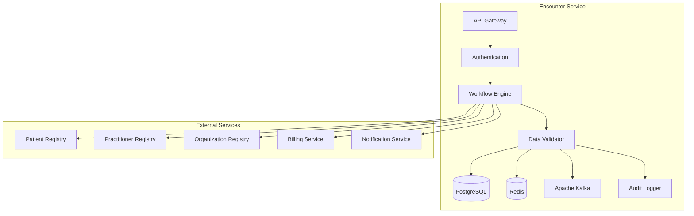

# MS Encounter Service

The Encounter Service manages clinical encounters, visits, and episodes of care with comprehensive workflow support and FHIR R5 compliance.

## 📋 Service Overview

- **Repository**: [ms-encounter-service](https://github.com/zs-his/ms-encounter-service)
- **Status**: ✅ Active
- **FHIR Resources**: Encounter, EpisodeOfCare, Appointment
- **Primary Database**: PostgreSQL
- **Cache Layer**: Redis
- **Event Streaming**: Apache Kafka

## 🎯 Key Features

### Encounter Management
- **Visit Registration**: Patient encounter creation and management
- **Clinical Workflows**: Support for various encounter types
- **Status Tracking**: Real-time encounter status updates
- **Team Assignment**: Healthcare provider team management
- **Documentation**: Clinical documentation and notes

### Encounter Types
- **Outpatient**: OPD visits and consultations
- **Inpatient**: Hospital admissions and stays
- **Emergency**: Emergency department visits
- **Home Visit**: Community healthcare visits
- **Telehealth**: Virtual consultations
- **Day Care**: Day care procedures and treatments

## 🏗️ Architecture



## 📊 Database Schema

### Encounter Table
```sql
CREATE TABLE encounters (
    id UUID PRIMARY KEY DEFAULT gen_random_uuid(),
    encounter_id VARCHAR(50) UNIQUE NOT NULL,
    patient_id UUID NOT NULL,
    encounter_class VARCHAR(20) NOT NULL,
    encounter_type VARCHAR(50) NOT NULL,
    status VARCHAR(20) NOT NULL DEFAULT 'planned',
    period JSONB NOT NULL,
    subject_type VARCHAR(20) DEFAULT 'patient',
    subject_id UUID NOT NULL,
    participant JSONB,
    appointment_id UUID,
    location_id UUID,
    service_provider_id UUID,
    reason_code JSONB,
    reason_reference JSONB,
    diagnosis JSONB,
    account_id UUID,
    hospitalization JSONB,
    created_at TIMESTAMP DEFAULT CURRENT_TIMESTAMP,
    updated_at TIMESTAMP DEFAULT CURRENT_TIMESTAMP,
    metadata JSONB,
    FOREIGN KEY (patient_id) REFERENCES patients(id)
);
```

### Episode of Care Table
```sql
CREATE TABLE episodes_of_care (
    id UUID PRIMARY KEY DEFAULT gen_random_uuid(),
    episode_id VARCHAR(50) UNIQUE NOT NULL,
    patient_id UUID NOT NULL,
    status VARCHAR(20) NOT NULL DEFAULT 'active',
    status_history JSONB,
    type JSONB NOT NULL,
    diagnosis JSONB,
    patient_id_reference UUID NOT NULL,
    managing_organization UUID,
    period JSONB,
    referral_request JSONB,
    care_manager UUID,
    team JSONB,
    account_id UUID,
    created_at TIMESTAMP DEFAULT CURRENT_TIMESTAMP,
    updated_at TIMESTAMP DEFAULT CURRENT_TIMESTAMP,
    metadata JSONB,
    FOREIGN KEY (patient_id) REFERENCES patients(id)
);
```

### Encounter Participants Table
```sql
CREATE TABLE encounter_participants (
    id UUID PRIMARY KEY DEFAULT gen_random_uuid(),
    encounter_id UUID REFERENCES encounters(id) ON DELETE CASCADE,
    practitioner_id UUID REFERENCES practitioners(id),
    organization_id UUID REFERENCES organizations(id),
    period JSONB,
    type JSONB NOT NULL,
    individual_type VARCHAR(20),
    created_at TIMESTAMP DEFAULT CURRENT_TIMESTAMP
);
```

## 🔌 API Endpoints

### Encounter CRUD Operations
```go
// Create new encounter
POST /api/encounters
{
  "class": "AMB",
  "type": [{"coding": [{"code": "CONSULTATION", "display": "Consultation"}]}],
  "subject": {"reference": "Patient/12345"},
  "participant": [{
    "type": [{"coding": [{"code": "ATND", "display": "Attender"}]}],
    "individual": {"reference": "Practitioner/67890"}
  }],
  "period": {
    "start": "2026-01-21T09:00:00+06:00"
  },
  "serviceProvider": {"reference": "Organization/111"}
}

// Get encounter by ID
GET /api/encounters/{id}

// Search encounters
GET /api/encounters?patient=12345&status=active&class=AMB

// Update encounter
PUT /api/encounters/{id}

// Complete encounter
POST /api/encounters/{id}/complete
{
  "period": {"end": "2026-01-21T10:30:00+06:00"},
  "status": "finished"
}
```

### Episode of Care Management
```go
// Create episode of care
POST /api/episodes-of-care
{
  "patient": {"reference": "Patient/12345"},
  "status": "active",
  "type": [{"coding": [{"code": "HOSP", "display": "Hospital admission"}]}],
  "managingOrganization": {"reference": "Organization/111"},
  "period": {
    "start": "2026-01-21T09:00:00+06:00"
  },
  "careManager": {"reference": "Practitioner/67890"}
}

// Get patient episodes
GET /api/episodes-of-care?patient=12345&status=active

// Update episode status
PUT /api/episodes-of-care/{id}/status
{
  "status": "finished",
  "period": {"end": "2026-01-25T12:00:00+06:00"}
}
```

### Encounter Workflows
```go
// Start encounter workflow
POST /api/encounters/{id}/workflows/start
{
  "workflowType": "outpatient_consultation",
  "steps": ["vitals", "history", "examination", "diagnosis", "treatment"]
}

// Get current workflow step
GET /api/encounters/{id}/workflows/current

// Complete workflow step
POST /api/encounters/{id}/workflows/step/complete
{
  "stepId": "vitals",
  "data": {
    "bloodPressure": {"systolic": 120, "diastolic": 80},
    "temperature": 36.5,
    "pulse": 72,
    "respirations": 16,
    "oxygenSaturation": 98
  }
}
```

## 🏥 Encounter Types and Classes

### Bangladesh Encounter Classes
```go
var EncounterClasses = map[string]string{
    "AMB": "Ambulatory",
    "IMP": "Inpatient",
    "EMER": "Emergency",
    "VR": "Virtual",
    "HH": "Home Health",
    "ACUTE": "Acute Care",
    "NONAC": "Non-Acute Care",
    "OBSENC": "Observation",
    "PRENC": "Pre-admission",
    "SS": "Short Stay",
}

var EncounterTypes = map[string]string{
    "CONSULTATION":     "General Consultation",
    "FOLLOWUP":         "Follow-up Visit",
    "EMERGENCY":        "Emergency Visit",
    "ADMISSION":        "Hospital Admission",
    "DISCHARGE":        "Hospital Discharge",
    "PROCEDURE":        "Procedure Visit",
    "IMMUNIZATION":     "Immunization Visit",
    "SCREENING":        "Screening Visit",
    "TELEHEALTH":       "Telehealth Consultation",
    "HOME_VISIT":       "Home Visit",
    "DAY_CARE":         "Day Care Visit",
}
```

### Workflow Templates
```go
type WorkflowTemplate struct {
    ID          string                    `json:"id"`
    Name        string                    `json:"name"`
    EncounterClass string                 `json:"encounter_class"`
    Steps       []WorkflowStep            `json:"steps"`
    RequiredData []string                 `json:"required_data"`
    Permissions map[string][]string       `json:"permissions"`
}

var OutpatientConsultationWorkflow = WorkflowTemplate{
    ID:   "outpatient_consultation",
    Name: "Outpatient Consultation",
    EncounterClass: "AMB",
    Steps: []WorkflowStep{
        {ID: "registration", Name: "Patient Registration", Required: true},
        {ID: "vitals", Name: "Vital Signs", Required: true},
        {ID: "history", Name: "Medical History", Required: true},
        {ID: "examination", Name: "Physical Examination", Required: true},
        {ID: "diagnosis", Name: "Diagnosis", Required: true},
        {ID: "treatment", Name: "Treatment Plan", Required: true},
        {ID: "documentation", Name: "Documentation", Required: true},
        {ID: "billing", Name: "Billing", Required: false},
    },
}
```

## 🔍 Search and Filtering

### Advanced Encounter Search
```go
type EncounterSearchCriteria struct {
    PatientID         string    `json:"patient_id"`
    PractitionerID    string    `json:"practitioner_id"`
    OrganizationID    string    `json:"organization_id"`
    Status            string    `json:"status"`
    Class             string    `json:"class"`
    Type              string    `json:"type"`
    DateFrom          time.Time `json:"date_from"`
    DateTo            time.Time `json:"date_to"`
    LocationID        string    `json:"location_id"`
    ServiceType       string    `json:"service_type"`
}

func (s *EncounterService) SearchEncounters(criteria EncounterSearchCriteria) ([]Encounter, error) {
    query := s.db.NewSelect().Model(&Encounter{})
    
    if criteria.PatientID != "" {
        query = query.Where("patient_id = ?", criteria.PatientID)
    }
    
    if criteria.Status != "" {
        query = query.Where("status = ?", criteria.Status)
    }
    
    if criteria.Class != "" {
        query = query.Where("encounter_class = ?", criteria.Class)
    }
    
    if !criteria.DateFrom.IsZero() {
        query = query.Where("period->>'start' >= ?", criteria.DateFrom.Format(time.RFC3339))
    }
    
    if !criteria.DateTo.IsZero() {
        query = query.Where("period->>'start' <= ?", criteria.DateTo.Format(time.RFC3339))
    }
    
    var encounters []Encounter
    err := query.Scan(ctx, &encounters)
    return encounters, err
}
```

## 📈 Performance Optimization

### Caching Strategy
```go
// Cache active encounters for 15 minutes
func (s *EncounterService) GetActiveEncounters(patientID string) ([]Encounter, error) {
    cacheKey := fmt.Sprintf("active_encounters:%s", patientID)
    
    // Try cache first
    if cached, err := s.cache.Get(cacheKey); err == nil {
        return cached.([]Encounter), nil
    }
    
    // Get from database
    encounters, err := s.repository.GetActiveByPatient(patientID)
    if err != nil {
        return nil, err
    }
    
    // Cache for 15 minutes
    s.cache.Set(cacheKey, encounters, 15*time.Minute)
    return encounters, nil
}
```

### Database Indexing
```sql
-- Performance indexes
CREATE INDEX idx_encounters_patient ON encounters(patient_id);
CREATE INDEX idx_encounters_status ON encounters(status);
CREATE INDEX idx_encounters_class ON encounters(encounter_class);
CREATE INDEX idx_encounters_period_start ON encounters USING gin(to_tsvector('english', period->>'start'));
CREATE INDEX idx_encounters_practitioner ON encounter_participants(practitioner_id);
CREATE INDEX idx_encounters_organization ON encounters(service_provider_id);
CREATE INDEX idx_episodes_patient ON episodes_of_care(patient_id);
CREATE INDEX idx_episodes_status ON episodes_of_care(status);
```

## 🔄 Event Streaming

### Kafka Events
```go
type EncounterEvent struct {
    EventType   string      `json:"event_type"`
    EncounterID string     `json:"encounter_id"`
    PatientID   string     `json:"patient_id"`
    Data        interface{} `json:"data"`
    Timestamp   time.Time   `json:"timestamp"`
    UserID      string     `json:"user_id"`
}

func (s *EncounterService) publishEncounterEvent(eventType, encounterID string, data interface{}) error {
    event := EncounterEvent{
        EventType:   eventType,
        EncounterID: encounterID,
        PatientID:   data.(*Encounter).PatientID,
        Data:        data,
        Timestamp:   time.Now(),
        UserID:      s.getCurrentUserID(),
    }
    
    return s.kafkaProducer.Publish("encounter.events", event)
}

// Event types
const (
    EncounterCreated   = "encounter.created"
    EncounterUpdated   = "encounter.updated"
    EncounterCompleted = "encounter.completed"
    EncounterCancelled = "encounter.cancelled"
    WorkflowStepCompleted = "workflow.step_completed"
)
```

## 🔒 Security Features

### Access Control
```go
func (s *EncounterService) CanAccessEncounter(userID, encounterID string, action string) bool {
    // Check user permissions
    permissions := s.authService.GetUserPermissions(userID)
    
    switch action {
    case "read":
        return permissions.Contains("encounter.read") || 
               s.isAssignedToEncounter(userID, encounterID)
    case "write":
        return permissions.Contains("encounter.write") || 
               s.isAssignedToEncounter(userID, encounterID)
    case "complete":
        return permissions.Contains("encounter.complete") || 
               s.isEncounterProvider(userID, encounterID)
    default:
        return false
    }
}

func (s *EncounterService) isAssignedToEncounter(userID, encounterID string) bool {
    // Check if user is assigned as participant
    assigned, _ := s.repository.IsUserAssigned(userID, encounterID)
    return assigned
}
```

### Data Validation
```go
func (s *EncounterService) ValidateEncounter(encounter *Encounter) error {
    // Validate required fields
    if encounter.PatientID == "" {
        return errors.New("patient ID is required")
    }
    
    if encounter.Class == "" {
        return errors.New("encounter class is required")
    }
    
    // Validate patient exists
    patient, err := s.patientService.GetPatient(encounter.PatientID)
    if err != nil {
        return fmt.Errorf("patient not found: %w", err)
    }
    
    // Validate period
    if encounter.Period.Start.IsZero() {
        return errors.New("encounter start time is required")
    }
    
    // Validate participants
    for _, participant := range encounter.Participants {
        if participant.Individual.Reference != "" {
            // Validate practitioner exists
            practitionerID := extractIDFromReference(participant.Individual.Reference)
            _, err := s.practitionerService.GetPractitioner(practitionerID)
            if err != nil {
                return fmt.Errorf("practitioner not found: %w", err)
            }
        }
    }
    
    return nil
}
```

## 📊 Monitoring and Metrics

### Health Checks
```go
func (s *EncounterService) HealthCheck() map[string]interface{} {
    return map[string]interface{}{
        "database":           s.checkDatabase(),
        "cache":              s.checkCache(),
        "kafka":              s.checkKafka(),
        "patient_service":    s.checkPatientService(),
        "practitioner_service": s.checkPractitionerService(),
        "workflow_engine":    s.checkWorkflowEngine(),
        "timestamp":          time.Now(),
    }
}
```

### Performance Metrics
```go
// Prometheus metrics
var (
    encounterRequestsTotal = prometheus.NewCounterVec(
        prometheus.CounterOpts{
            Name: "encounter_requests_total",
            Help: "Total number of encounter requests",
        },
        []string{"method", "endpoint", "status"},
    )
    
    workflowStepDuration = prometheus.NewHistogramVec(
        prometheus.HistogramOpts{
            Name: "workflow_step_duration_seconds",
            Help: "Workflow step completion time",
        },
        []string{"step_type", "encounter_class"},
    )
)
```

## 🧪 Testing

### Unit Tests
```go
func TestEncounterService_CreateEncounter(t *testing.T) {
    service := NewEncounterService(mockRepo, mockCache, mockKafka)
    encounter := &Encounter{
        Class:      "AMB",
        Type:       []Code{{Coding: []Coding{{Code: "CONSULTATION"}}}},
        PatientID:  "patient-123",
        Period:     Period{Start: time.Now()},
        Participant: []EncounterParticipant{
            {
                Type: []Code{{Coding: []Coding{{Code: "ATND"}}}},
                Individual: Reference{Reference: "Practitioner/67890"},
            },
        },
    }
    
    result, err := service.CreateEncounter(encounter)
    
    assert.NoError(t, err)
    assert.NotNil(t, result)
    assert.NotEmpty(t, result.ID)
    assert.Equal(t, "planned", result.Status)
    assert.Equal(t, "AMB", result.Class)
}
```

## 🚀 Deployment

### Docker Configuration
```dockerfile
FROM golang:1.25-alpine AS builder

WORKDIR /app
COPY go.mod go.sum ./
RUN go mod download

COPY . .
RUN CGO_ENABLED=0 GOOS=linux go build -o main cmd/server/main.go

FROM alpine:latest
RUN apk --no-cache add ca-certificates
WORKDIR /root/
COPY --from=builder /app/main .
EXPOSE 8080
CMD ["./main"]
```

### Kubernetes Deployment
```yaml
apiVersion: apps/v1
kind: Deployment
metadata:
  name: ms-encounter-service
spec:
  replicas: 3
  selector:
    matchLabels:
      app: ms-encounter-service
  template:
    metadata:
      labels:
        app: ms-encounter-service
    spec:
      containers:
      - name: ms-encounter-service
        image: zarish-his/ms-encounter-service:latest
        ports:
        - containerPort: 8080
        env:
        - name: DB_HOST
          value: "postgresql-service"
        - name: REDIS_HOST
          value: "redis-service"
        - name: KAFKA_BROKERS
          value: "kafka-service:9092"
```

## 🔗 Related Resources

- **Frontend Integration**: [ESM Patient Management](../frontend/esm-patient-management.md)
- **FHIR Implementation**: [FHIR Encounter Profile](../fhir/encounter-profile.md)
- **API Documentation**: [Encounter API Reference](../api-reference/rest-apis.md)
- **Workflow Engine**: [MS Workflow Engine](./ms-workflow-engine.md)

---

*Last updated: 2026-01-21*
