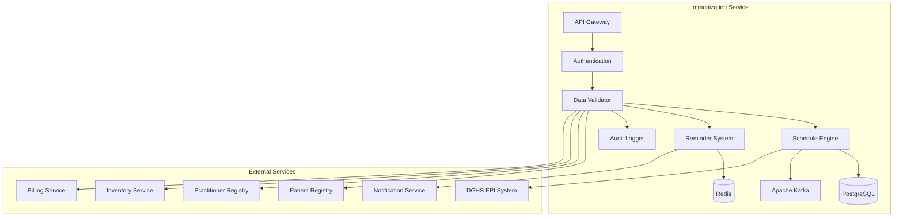

# MS Immunization Service

The Immunization Service manages vaccination records, immunization schedules, and Bangladesh EPI (Expanded Program on Immunization) integration with comprehensive tracking and reminder systems.

## 📋 Service Overview

- **Repository**: [ms-immunization-service](https://github.com/zs-his/ms-immunization-service)
- **Status**: 🟡 In Progress
- **FHIR Resources**: Immunization, ImmunizationRecommendation, Observation
- **Primary Database**: PostgreSQL
- **Cache Layer**: Redis
- **Event Streaming**: Apache Kafka

## 🎯 Key Features

### Immunization Management
- **Vaccination Records**: Complete immunization history tracking
- **Schedule Management**: Age-appropriate vaccination schedules
- **Batch Tracking**: Vaccine batch numbers and expiry tracking
- **Adverse Events**: Vaccine adverse event monitoring
- **Reminder System**: Automated vaccination reminders

### Bangladesh-Specific Features
- **EPI Integration**: Bangladesh Expanded Program on Immunization
- **Local Vaccines**: Bangladesh-specific vaccine schedules
- **Government Reporting**: DGHS immunization reporting
- **Cold Chain Monitoring**: Vaccine storage and transport tracking
- **Campaign Management**: National immunization campaigns

## 🏗️ Architecture



## 📊 Database Schema

### Immunization Table
```sql
CREATE TABLE immunizations (
    id UUID PRIMARY KEY DEFAULT gen_random_uuid(),
    immunization_id VARCHAR(50) UNIQUE NOT NULL,
    patient_id UUID NOT NULL,
    encounter_id UUID REFERENCES encounters(id),
    status VARCHAR(20) NOT NULL DEFAULT 'completed',
    status_reason JSONB,
    vaccine_code JSONB NOT NULL,
    patient_type VARCHAR(20) DEFAULT 'patient',
    patient_id_reference UUID NOT NULL,
    encounter_reference UUID REFERENCES encounters(id),
    occurrence_date_time TIMESTAMP NOT NULL,
    recorded TIMESTAMP DEFAULT CURRENT_TIMESTAMP,
    primary_source BOOLEAN DEFAULT true,
    report_origin VARCHAR(50),
    location JSONB,
    manufacturer JSONB,
    lot_number VARCHAR(50),
    expiration_date DATE,
    route JSONB,
    dose_quantity JSONB,
    performer JSONB,
    reason_code JSONB,
    reason_reference JSONB,
    is_subpotent BOOLEAN DEFAULT false,
    program_eligibility JSONB,
    funding_source JSONB,
    reaction JSONB,
    protocol_applied JSONB,
    created_at TIMESTAMP DEFAULT CURRENT_TIMESTAMP,
    updated_at TIMESTAMP DEFAULT CURRENT_TIMESTAMP,
    metadata JSONB,
    FOREIGN KEY (patient_id) REFERENCES patients(id)
);
```

### Immunization Recommendation Table
```sql
CREATE TABLE immunization_recommendations (
    id UUID PRIMARY KEY DEFAULT gen_random_uuid(),
    recommendation_id VARCHAR(50) UNIQUE NOT NULL,
    patient_id UUID NOT NULL,
    date TIMESTAMP NOT NULL,
    vaccine_code JSONB NOT NULL,
    target_disease JSONB,
    contraindicated_vaccine_code JSONB,
    forecast_status VARCHAR(20) NOT NULL,
    forecast_reason VARCHAR(100),
    date_criteria JSONB,
    dose_number_positive_int INTEGER,
    series_doses_positive_int INTEGER,
    series STRING,
    dose_sequence_positive_int INTEGER,
    supporting_patient_information JSONB,
    supporting_immunization JSONB,
    supporting_adverse_event JSONB,
    supporting_patient_observation JSONB,
    created_at TIMESTAMP DEFAULT CURRENT_TIMESTAMP,
    updated_at TIMESTAMP DEFAULT CURRENT_TIMESTAMP,
    FOREIGN KEY (patient_id) REFERENCES patients(id)
);
```

### Vaccine Master Table
```sql
CREATE TABLE vaccines (
    id UUID PRIMARY KEY DEFAULT gen_random_uuid(),
    vaccine_code VARCHAR(50) UNIQUE NOT NULL,
    vaccine_name VARCHAR(200) NOT NULL,
    vaccine_type VARCHAR(50) NOT NULL,
    target_disease JSONB NOT NULL,
    manufacturer JSONB,
    schedule JSONB NOT NULL,
    dose_count INTEGER NOT NULL,
    interval_between_doses JSONB,
    minimum_age JSONB,
    maximum_age JSONB,
    contraindications JSONB,
    precautions JSONB,
    adverse_reactions JSONB,
    storage_requirements JSONB,
    cold_chain_required BOOLEAN DEFAULT true,
    epi_vaccine BOOLEAN DEFAULT false,
    bangladesh_schedule BOOLEAN DEFAULT false,
    created_at TIMESTAMP DEFAULT CURRENT_TIMESTAMP,
    updated_at TIMESTAMP DEFAULT CURRENT_TIMESTAMP
);
```

## 🔌 API Endpoints

### Immunization CRUD Operations
```go
// Create immunization record
POST /api/immunizations
{
  "status": "completed",
  "vaccineCode": {
    "coding": [{
      "system": "http://snomed.info/sct",
      "code": "871866001",
      "display": "BCG vaccine"
    }]
  },
  "patient": {"reference": "Patient/12345"},
  "encounter": {"reference": "Encounter/67890"},
  "occurrenceDateTime": "2026-01-21T10:30:00+06:00",
  "recorded": "2026-01-21T10:30:00+06:00",
  "primarySource": true,
  "location": {
    "reference": "Location/111",
    "display": "Vaccination Center"
  },
  "manufacturer": {
    "reference": "Organization/222",
    "display": "BCG Laboratory"
  },
  "lotNumber": "BCG-2024-001",
  "expirationDate": "2026-12-31",
  "route": {
    "coding": [{
      "system": "http://snomed.info/sct",
      "code": "34206005",
      "display": "Intradermal route"
    }]
  },
  "doseQuantity": {
    "value": 0.1,
    "unit": "mL",
    "system": "http://unitsofmeasure.org",
    "code": "mL"
  },
  "performer": [{
    "function": {
      "coding": [{
        "system": "http://terminology.hl7.org/CodeSystem/v3-ParticipationType",
        "code": "VRF",
        "display": "Verifier"
      }]
    },
    "actor": {
      "reference": "Practitioner/333",
      "display": "Dr. Jane Smith"
    }
  }],
  "protocolApplied": [{
    "series": "Routine Childhood Immunization",
    "doseNumberPositiveInt": 1,
    "seriesDosesPositiveInt": 1,
    "targetDisease": [{
      "coding": [{
        "system": "http://snomed.info/sct",
        "code": "267906006",
        "display": "Tuberculosis"
      }]
    }]
  }]
}

// Get immunization by ID
GET /api/immunizations/{id}

// Search immunizations
GET /api/immunizations?patient=12345&status=completed&vaccine=BCG

// Update immunization
PUT /api/immunizations/{id}
```

### Immunization Schedule
```go
// Get patient immunization schedule
GET /api/immunizations/schedule/{patientId}
{
  "patientId": "12345",
  "date": "2026-01-21",
  "includeOverdue": true,
  "includeUpcoming": true
}

// Response
{
  "schedule": [
    {
      "vaccineCode": "871866001",
      "vaccineName": "BCG",
      "targetDisease": "Tuberculosis",
      "dueDate": "2026-01-25",
      "status": "overdue",
      "doseNumber": 1,
      "totalDoses": 1,
      "ageRange": "At birth",
      "priority": "high"
    },
    {
      "vaccineCode": "836381006",
      "vaccineName": "OPV",
      "targetDisease": "Polio",
      "dueDate": "2026-02-21",
      "status": "upcoming",
      "doseNumber": 1,
      "totalDoses": 4,
      "ageRange": "6 weeks",
      "priority": "medium"
    }
  ]
}

// Generate immunization forecast
POST /api/immunizations/forecast/{patientId}
{
  "forecastDate": "2026-01-21",
  "includeHistorical": true,
  "includeRecommendations": true
}
```

### Immunization Recommendations
```go
// Create immunization recommendation
POST /api/immunizations/recommendations
{
  "patient": {"reference": "Patient/12345"},
  "date": "2026-01-21",
  "vaccineCode": {
    "coding": [{
      "system": "http://snomed.info/sct",
      "code": "871866001",
      "display": "BCG vaccine"
    }]
  },
  "targetDisease": [{
    "coding": [{
      "system": "http://snomed.info/sct",
      "code": "267906006",
      "display": "Tuberculosis"
    }]
  }],
  "forecastStatus": "due",
  "forecastReason": "First dose due",
  "dateCriteria": {
    "code": {
      "coding": [{
        "system": "http://example.org/forecast-date-codes",
        "code": "dob",
        "display": "Date of Birth"
      }]
    },
    "value": "2026-01-15"
  },
  "doseNumberPositiveInt": 1,
  "seriesDosesPositiveInt": 1,
  "series": "Routine Childhood Immunization"
}

// Get patient recommendations
GET /api/immunizations/recommendations?patient=12345&status=due

// Update recommendation status
PUT /api/immunizations/recommendations/{id}/status
{
  "forecastStatus": "completed",
  "supportingImmunization": [{"reference": "Immunization/456"}]
}
```

## 🏥 Bangladesh EPI Schedule

### Bangladesh Expanded Program on Immunization
```go
var BangladeshEPISchedule = map[string]VaccineSchedule{
    "BCG": {
        VaccineCode:    "871866001",
        VaccineName:    "BCG",
        TargetDisease:  "Tuberculosis",
        Schedule:       []AgeDose{{Age: "At birth", Dose: 1}},
        TotalDoses:     1,
        Route:          "Intradermal",
        Storage:        "2-8°C",
        ColdChain:      true,
    },
    "OPV": {
        VaccineCode:    "836381006",
        VaccineName:    "Oral Polio Vaccine",
        TargetDisease:  "Polio",
        Schedule:       []AgeDose{
            {Age: "6 weeks", Dose: 1},
            {Age: "10 weeks", Dose: 2},
            {Age: "14 weeks", Dose: 3},
            {Age: "9 months", Dose: 4},
        },
        TotalDoses:     4,
        Route:          "Oral",
        Storage:        "2-8°C",
        ColdChain:      true,
    },
    "DPT": {
        VaccineCode:    "836378006",
        VaccineName:    "DPT (Diphtheria, Pertussis, Tetanus)",
        TargetDisease:  "Diphtheria, Pertussis, Tetanus",
        Schedule:       []AgeDose{
            {Age: "6 weeks", Dose: 1},
            {Age: "10 weeks", Dose: 2},
            {Age: "14 weeks", Dose: 3},
            {Age: "16 months", Dose: 4},
            {Age: "5 years", Dose: 5},
        },
        TotalDoses:     5,
        Route:          "Intramuscular",
        Storage:        "2-8°C",
        ColdChain:      true,
    },
    "HepB": {
        VaccineCode:    "860394004",
        VaccineName:    "Hepatitis B",
        TargetDisease:  "Hepatitis B",
        Schedule:       []AgeDose{
            {Age: "At birth", Dose: 1},
            {Age: "6 weeks", Dose: 2},
            {Age: "10 weeks", Dose: 3},
            {Age: "14 weeks", Dose: 4},
        },
        TotalDoses:     4,
        Route:          "Intramuscular",
        Storage:        "2-8°C",
        ColdChain:      true,
    },
    "Measles": {
        VaccineCode:    "836403009",
        VaccineName:    "Measles",
        TargetDisease:  "Measles",
        Schedule:       []AgeDose{{Age: "9 months", Dose: 1}},
        TotalDoses:     1,
        Route:          "Subcutaneous",
        Storage:        "2-8°C",
        ColdChain:      true,
    },
    "MR": {
        VaccineCode:    "836404001",
        VaccineName:    "Measles-Rubella",
        TargetDisease:  "Measles, Rubella",
        Schedule:       []AgeDose{{Age: "9 months", Dose: 1}},
        TotalDoses:     1,
        Route:          "Subcutaneous",
        Storage:        "2-8°C",
        ColdChain:      true,
    },
}

type AgeDose struct {
    Age  string `json:"age"`
    Dose int    `json:"dose"`
}

type VaccineSchedule struct {
    VaccineCode    string    `json:"vaccine_code"`
    VaccineName    string    `json:"vaccine_name"`
    TargetDisease  string    `json:"target_disease"`
    Schedule       []AgeDose `json:"schedule"`
    TotalDoses     int       `json:"total_doses"`
    Route          string    `json:"route"`
    Storage        string    `json:"storage"`
    ColdChain      bool      `json:"cold_chain"`
}
```

### Campaign Vaccines
```go
var BangladeshCampaignVaccines = []CampaignVaccine{
    {
        VaccineCode:    "836403009",
        VaccineName:    "Measles",
        CampaignName:   "National Measles Campaign",
        TargetAge:      "9 months to 5 years",
        CampaignPeriod: "March 2026",
        Doses:          1,
        AdditionalDose: true,
    },
    {
        VaccineCode:    "836381006",
        VaccineName:    "OPV",
        CampaignName:   "Polio Eradication Campaign",
        TargetAge:      "0 to 5 years",
        CampaignPeriod: "April 2026",
        Doses:          2,
        AdditionalDose: true,
    },
    {
        VaccineCode:    "871866001",
        VaccineName:    "BCG",
        CampaignName:   "BCG Catch-up Campaign",
        TargetAge:      "0 to 15 years",
        CampaignPeriod: "May 2026",
        Doses:          1,
        AdditionalDose: false,
    },
}

type CampaignVaccine struct {
    VaccineCode     string `json:"vaccine_code"`
    VaccineName     string `json:"vaccine_name"`
    CampaignName    string `json:"campaign_name"`
    TargetAge       string `json:"target_age"`
    CampaignPeriod  string `json:"campaign_period"`
    Doses           int    `json:"doses"`
    AdditionalDose  bool   `json:"additional_dose"`
}
```

## 🔍 Search and Filtering

### Advanced Immunization Search
```go
type ImmunizationSearchCriteria struct {
    PatientID       string    `json:"patient_id"`
    EncounterID     string    `json:"encounter_id"`
    Status          string    `json:"status"`
    VaccineCode     string    `json:"vaccine_code"`
    TargetDisease   string    `json:"target_disease"`
    DateFrom        time.Time `json:"date_from"`
    DateTo          time.Time `json:"date_to"`
    Manufacturer    string    `json:"manufacturer"`
    LotNumber       string    `json:"lot_number"`
    PerformerID     string    `json:"performer_id"`
    PrimarySource   bool      `json:"primary_source"`
}

func (s *ImmunizationService) SearchImmunizations(criteria ImmunizationSearchCriteria) ([]Immunization, error) {
    query := s.db.NewSelect().Model(&Immunization{})
    
    if criteria.PatientID != "" {
        query = query.Where("patient_id = ?", criteria.PatientID)
    }
    
    if criteria.Status != "" {
        query = query.Where("status = ?", criteria.Status)
    }
    
    if criteria.VaccineCode != "" {
        query = query.Where("vaccine_code->>'coding'->>0->>'code' = ?", criteria.VaccineCode)
    }
    
    if !criteria.DateFrom.IsZero() {
        query = query.Where("occurrence_date_time >= ?", criteria.DateFrom)
    }
    
    if !criteria.DateTo.IsZero() {
        query = query.Where("occurrence_date_time <= ?", criteria.DateTo)
    }
    
    var immunizations []Immunization
    err := query.Scan(ctx, &immunizations)
    return immunizations, err
}
```

## 📈 Performance Optimization

### Caching Strategy
```go
// Cache vaccine master data for 6 hours
func (s *ImmunizationService) GetVaccineMaster() ([]Vaccine, error) {
    cacheKey := "vaccine_master"
    
    if cached, err := s.cache.Get(cacheKey); err == nil {
        return cached.([]Vaccine), nil
    }
    
    vaccines, err := s.repository.GetAllVaccines()
    if err != nil {
        return nil, err
    }
    
    s.cache.Set(cacheKey, vaccines, 6*time.Hour)
    return vaccines, nil
}

// Cache patient immunization history for 1 hour
func (s *ImmunizationService) GetPatientImmunizationHistory(patientID string) ([]Immunization, error) {
    cacheKey := fmt.Sprintf("immunization_history:%s", patientID)
    
    if cached, err := s.cache.Get(cacheKey); err == nil {
        return cached.([]Immunization), nil
    }
    
    history, err := s.repository.GetByPatient(patientID)
    if err != nil {
        return nil, err
    }
    
    s.cache.Set(cacheKey, history, time.Hour)
    return history, nil
}
```

### Database Indexing
```sql
-- Performance indexes
CREATE INDEX idx_immunizations_patient ON immunizations(patient_id);
CREATE INDEX idx_immunizations_status ON immunizations(status);
CREATE INDEX idx_immunizations_vaccine ON immunizations USING gin(to_tsvector('english', vaccine_code->>'coding'->>0->>'code'));
CREATE INDEX idx_immunizations_occurrence ON immunizations(occurrence_date_time);
CREATE INDEX idx_immunizations_lot_number ON immunizations(lot_number);
CREATE INDEX idx_recommendations_patient ON immunization_recommendations(patient_id);
CREATE INDEX idx_recommendations_status ON immunization_recommendations(forecast_status);
CREATE INDEX idx_vaccines_code ON vaccines(vaccine_code);
CREATE INDEX idx_vaccines_epi ON vaccines(epi_vaccine);
```

## 📅 Immunization Forecast Engine

### Forecast Algorithm
```go
type ImmunizationForecast struct {
    PatientID     string              `json:"patient_id"`
    ForecastDate  time.Time           `json:"forecast_date"`
    Vaccines      []VaccineForecast   `json:"vaccines"`
    OverdueCount  int                 `json:"overdue_count"`
    UpcomingCount int                 `json:"upcoming_count"`
    CompletedCount int                `json:"completed_count"`
}

type VaccineForecast struct {
    VaccineCode        string    `json:"vaccine_code"`
    VaccineName        string    `json:"vaccine_name"`
    TargetDisease      string    `json:"target_disease"`
    DueDate           time.Time `json:"due_date"`
    Status            string    `json:"status"` // due, overdue, upcoming, completed
    DoseNumber        int       `json:"dose_number"`
    TotalDoses        int       `json:"total_doses"`
    AgeRange          string    `json:"age_range"`
    Priority          string    `json:"priority"`
    Contraindications []string  `json:"contraindications"`
}

func (s *ImmunizationService) GenerateForecast(patientID string, forecastDate time.Time) (*ImmunizationForecast, error) {
    // Get patient information
    patient, err := s.patientService.GetPatient(patientID)
    if err != nil {
        return nil, err
    }
    
    // Get immunization history
    history, err := s.repository.GetByPatient(patientID)
    if err != nil {
        return nil, err
    }
    
    // Get vaccine master data
    vaccines, err := s.GetVaccineMaster()
    if err != nil {
        return nil, err
    }
    
    var forecast []VaccineForecast
    var overdueCount, upcomingCount, completedCount int
    
    for _, vaccine := range vaccines {
        if !vaccine.BangladeshSchedule {
            continue
        }
        
        // Calculate forecast for this vaccine
        vaccineForecast, err := s.calculateVaccineForecast(vaccine, patient, history, forecastDate)
        if err != nil {
            continue
        }
        
        forecast = append(forecast, vaccineForecast)
        
        // Count by status
        switch vaccineForecast.Status {
        case "overdue":
            overdueCount++
        case "upcoming":
            upcomingCount++
        case "completed":
            completedCount++
        }
    }
    
    return &ImmunizationForecast{
        PatientID:      patientID,
        ForecastDate:   forecastDate,
        Vaccines:       forecast,
        OverdueCount:   overdueCount,
        UpcomingCount:  upcomingCount,
        CompletedCount: completedCount,
    }, nil
}

func (s *ImmunizationService) calculateVaccineForecast(vaccine Vaccine, patient Patient, history []Immunization, forecastDate time.Time) (VaccineForecast, error) {
    // Calculate patient age
    age := s.calculateAge(patient.BirthDate, forecastDate)
    
    // Get completed doses for this vaccine
    completedDoses := s.getCompletedDoses(vaccine.VaccineCode, history)
    
    // Check if all doses completed
    if completedDoses >= vaccine.TotalDoses {
        return VaccineForecast{
            VaccineCode: vaccine.VaccineCode,
            VaccineName: vaccine.VaccineName,
            Status:     "completed",
            DoseNumber: completedDoses,
            TotalDoses: vaccine.TotalDoses,
        }, nil
    }
    
    // Find next due dose
    nextDose := completedDoses + 1
    dueDate, err := s.calculateDueDate(vaccine, patient.BirthDate, nextDose)
    if err != nil {
        return VaccineForecast{}, err
    }
    
    // Determine status
    status := "upcoming"
    if dueDate.Before(forecastDate) {
        status = "overdue"
    }
    
    // Set priority based on age and status
    priority := "medium"
    if status == "overdue" {
        priority = "high"
    } else if age < 365 { // Less than 1 year
        priority = "high"
    }
    
    return VaccineForecast{
        VaccineCode:   vaccine.VaccineCode,
        VaccineName:   vaccine.VaccineName,
        TargetDisease: vaccine.TargetDisease[0].Display,
        DueDate:      dueDate,
        Status:       status,
        DoseNumber:   nextDose,
        TotalDoses:   vaccine.TotalDoses,
        AgeRange:     s.getAgeRangeForDose(vaccine, nextDose),
        Priority:     priority,
    }, nil
}
```

## 🔔 Reminder System

### Immunization Reminders
```go
type ImmunizationReminder struct {
    PatientID     string    `json:"patient_id"`
    VaccineCode    string    `json:"vaccine_code"`
    VaccineName    string    `json:"vaccine_name"`
    DueDate       time.Time `json:"due_date"`
    ReminderType  string    `json:"reminder_type"` // sms, email, push
    ReminderSent  bool      `json:"reminder_sent"`
    ReminderCount int       `json:"reminder_count"`
    NextReminder  time.Time `json:"next_reminder"`
    Message       string    `json:"message"`
}

func (s *ImmunizationService) GenerateReminders() error {
    // Get upcoming immunizations (next 7 days)
    upcoming, err := s.repository.GetUpcomingImmunizations(time.Now().AddDate(0, 0, 7))
    if err != nil {
        return err
    }
    
    // Get overdue immunizations
    overdue, err := s.repository.GetOverdueImmunizations(time.Now())
    if err != nil {
        return err
    }
    
    // Process upcoming reminders
    for _, immunization := range upcoming {
        reminder := ImmunizationReminder{
            PatientID:    immunization.PatientID,
            VaccineCode:  immunization.VaccineCode.Coding[0].Code,
            VaccineName:  immunization.VaccineCode.Coding[0].Display,
            DueDate:      immunization.OccurrenceDateTime,
            ReminderType: "sms",
            Message:      fmt.Sprintf("Reminder: %s vaccination due on %s", immunization.VaccineCode.Coding[0].Display, immunization.OccurrenceDateTime.Format("2006-01-02")),
        }
        
        err := s.sendReminder(reminder)
        if err != nil {
            log.Printf("Failed to send reminder for patient %s: %v", immunization.PatientID, err)
        }
    }
    
    // Process overdue reminders
    for _, immunization := range overdue {
        reminder := ImmunizationReminder{
            PatientID:    immunization.PatientID,
            VaccineCode:  immunization.VaccineCode.Coding[0].Code,
            VaccineName:  immunization.VaccineCode.Coding[0].Display,
            DueDate:      immunization.OccurrenceDateTime,
            ReminderType: "sms",
            Message:      fmt.Sprintf("URGENT: %s vaccination was due on %s. Please visit nearest vaccination center.", immunization.VaccineCode.Coding[0].Display, immunization.OccurrenceDateTime.Format("2006-01-02")),
        }
        
        err := s.sendReminder(reminder)
        if err != nil {
            log.Printf("Failed to send overdue reminder for patient %s: %v", immunization.PatientID, err)
        }
    }
    
    return nil
}

func (s *ImmunizationService) sendReminder(reminder ImmunizationReminder) error {
    // Get patient contact information
    patient, err := s.patientService.GetPatient(reminder.PatientID)
    if err != nil {
        return err
    }
    
    // Send reminder based on type
    switch reminder.ReminderType {
    case "sms":
        if patient.MobilePhone != "" {
            return s.notificationService.SendSMS(patient.MobilePhone, reminder.Message)
        }
    case "email":
        if patient.Email != "" {
            return s.notificationService.SendEmail(patient.Email, "Vaccination Reminder", reminder.Message)
        }
    case "push":
        return s.notificationService.SendPushNotification(reminder.PatientID, reminder.Message)
    }
    
    return nil
}
```

## 🔒 Security Features

### Access Control
```go
func (s *ImmunizationService) CanAccessImmunization(userID, immunizationID string, action string) bool {
    // Check user permissions
    permissions := s.authService.GetUserPermissions(userID)
    
    switch action {
    case "read":
        return permissions.Contains("immunization.read") || 
               s.canViewPatientImmunization(userID, immunizationID)
    case "write":
        return permissions.Contains("immunization.write") || 
               s.isAuthorizedVaccinator(userID)
    case "verify":
        return permissions.Contains("immunization.verify") || 
               s.isAuthorizedVerifier(userID)
    default:
        return false
    }
}

func (s *ImmunizationService) isAuthorizedVaccinator(userID string) bool {
    practitioner, err := s.practitionerService.GetPractitionerByUser(userID)
    if err != nil {
        return false
    }
    
    // Check if practitioner has vaccination authorization
    for _, role := range practitioner.Roles {
        if role.Specialty == "vaccination" || role.Specialty == "public_health" {
            return true
        }
    }
    
    return false
}
```

### Data Privacy
```go
func (s *ImmunizationService) anonymizeSensitiveImmunizations(immunizations []Immunization, requestUserID string) []Immunization {
    // Check if requester has full access
    if s.authService.HasFullAccess(requestUserID) {
        return immunizations
    }
    
    // Anonymize sensitive immunization data (HIV vaccines, etc.)
    var anonymized []Immunization
    for _, immunization := range immunizations {
        if s.isSensitiveImmunization(immunization) {
            // Remove sensitive details
            immunization.Performer = nil
            immunization.Location = nil
            immunization.ReasonCode = nil
        }
        anonymized = append(anonymized, immunization)
    }
    
    return anonymized
}

func (s *ImmunizationService) isSensitiveImmunization(immunization Immunization) bool {
    sensitiveCodes := []string{
        "836398001", // HIV vaccine
        // Add more sensitive vaccine codes
    }
    
    for _, code := range sensitiveCodes {
        if immunization.VaccineCode.Coding[0].Code == code {
            return true
        }
    }
    
    return false
}
```

## 📊 Monitoring and Metrics

### Health Checks
```go
func (s *ImmunizationService) HealthCheck() map[string]interface{} {
    return map[string]interface{}{
        "database":          s.checkDatabase(),
        "cache":             s.checkCache(),
        "kafka":             s.checkKafka(),
        "schedule_engine":   s.checkScheduleEngine(),
        "reminder_system":   s.checkReminderSystem(),
        "dghs_integration":  s.checkDGHSIntegration(),
        "patient_service":   s.checkPatientService(),
        "timestamp":         time.Now(),
    }
}
```

### Performance Metrics
```go
// Prometheus metrics
var (
    immunizationRequestsTotal = prometheus.NewCounterVec(
        prometheus.CounterOpts{
            Name: "immunization_requests_total",
            Help: "Total number of immunization requests",
        },
        []string{"method", "endpoint", "status"},
    )
    
    reminderSentTotal = prometheus.NewCounterVec(
        prometheus.CounterOpts{
            Name: "immunization_reminders_sent_total",
            Help: "Total number of immunization reminders sent",
        },
        []string{"type", "status"},
    )
    
    coverageRate = prometheus.NewGaugeVec(
        prometheus.GaugeOpts{
            Name: "immunization_coverage_rate",
            Help: "Immunization coverage rate by vaccine",
        },
        []string{"vaccine_code", "age_group"},
    )
)
```

## 🧪 Testing

### Unit Tests
```go
func TestImmunizationService_CreateImmunization(t *testing.T) {
    service := NewImmunizationService(mockRepo, mockCache, mockReminder)
    immunization := &Immunization{
        Status:         "completed",
        VaccineCode:    Code{Coding: []Coding{{System: "http://snomed.info/sct", Code: "871866001"}}},
        PatientID:      "patient-123",
        EncounterReference: "encounter-456",
        OccurrenceDateTime: time.Now(),
        Recorded:       time.Now(),
        PrimarySource:  true,
        Location:       Reference{Reference: "Location/111"},
        Manufacturer:   Reference{Reference: "Organization/222"},
        LotNumber:      "BCG-2024-001",
        ExpirationDate: time.Date(2026, 12, 31, 0, 0, 0, 0, time.UTC),
        Route:          Code{Coding: []Coding{{Code: "34206005", Display: "Intradermal route"}}},
        DoseQuantity:   &Quantity{Value: 0.1, Unit: "mL"},
        Performer: []ImmunizationPerformer{{
            Function: Code{Coding: []Coding{{Code: "VRF", Display: "Verifier"}}},
            Actor:    Reference{Reference: "Practitioner/333"},
        }},
    }
    
    result, err := service.CreateImmunization(immunization)
    
    assert.NoError(t, err)
    assert.NotNil(t, result)
    assert.NotEmpty(t, result.ID)
    assert.Equal(t, "completed", result.Status)
    assert.Equal(t, "patient-123", result.PatientID)
}
```

## 🚀 Deployment

### Docker Configuration
```dockerfile
FROM golang:1.25-alpine AS builder

WORKDIR /app
COPY go.mod go.sum ./
RUN go mod download

COPY . .
RUN CGO_ENABLED=0 GOOS=linux go build -o main cmd/server/main.go

FROM alpine:latest
RUN apk --no-cache add ca-certificates
WORKDIR /root/
COPY --from=builder /app/main .
EXPOSE 8080
CMD ["./main"]
```

### Kubernetes Deployment
```yaml
apiVersion: apps/v1
kind: Deployment
metadata:
  name: ms-immunization-service
spec:
  replicas: 3
  selector:
    matchLabels:
      app: ms-immunization-service
  template:
    metadata:
      labels:
        app: ms-immunization-service
    spec:
      containers:
      - name: ms-immunization-service
        image: zarish-his/ms-immunization-service:latest
        ports:
        - containerPort: 8080
        env:
        - name: DB_HOST
          value: "postgresql-service"
        - name: REDIS_HOST
          value: "redis-service"
        - name: KAFKA_BROKERS
          value: "kafka-service:9092"
        - name: DGHS_EPI_URL
          value: "https://dghs.gov.bd/epi"
```

## 🔗 Related Resources

- **Frontend Integration**: [ESM Maternal Health](../frontend/esm-maternal-health.md)
- **FHIR Implementation**: [FHIR Immunization Profile](../fhir/immunization-profile.md)
- **API Documentation**: [Immunization API Reference](../api-reference/rest-apis.md)

---

*Last updated: 2026-01-21*
