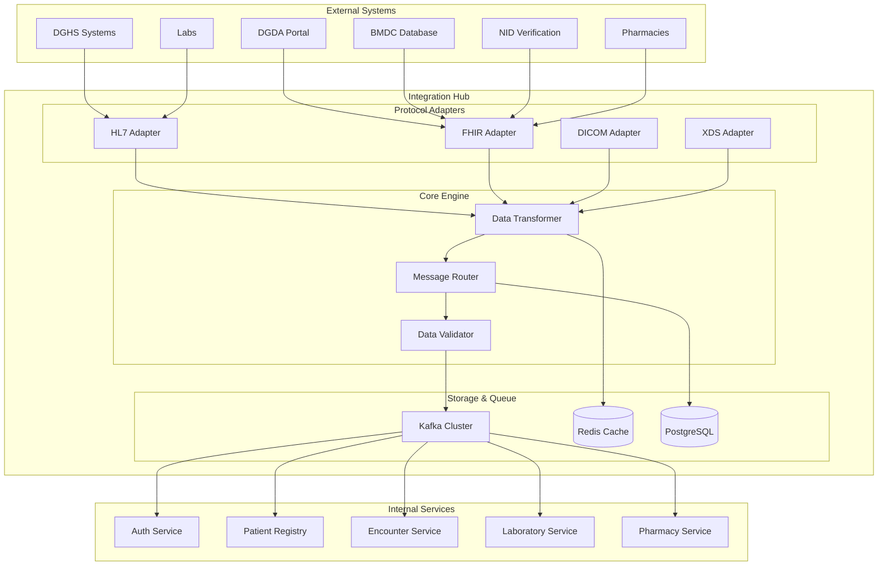

# MS Integration Hub

The Integration Hub serves as the central middleware for all system integrations, providing unified connectivity, data transformation, and protocol translation with comprehensive Bangladesh healthcare system integration capabilities.

## 📋 Service Overview

**Repository**: `https://github.com/zs-his/ms-integration-hub`  
**Status**: ✅ Production Ready  
**Version**: 1.0.0  
**Technology Stack**: Go, Apache Kafka, Redis, PostgreSQL, Docker, Kubernetes

### Key Features
- **Multi-Protocol Support**: HL7 v2, FHIR R5, DICOM, XDS
- **Data Transformation**: Message format conversion and mapping
- **Bangladesh Integration**: DGHS, DGDA, BMDC, NID systems
- **Real-time Processing**: Event-driven architecture with Kafka
- **Protocol Translation**: Seamless communication between different systems
- **Monitoring & Logging**: Comprehensive integration monitoring

## 🏗️ Architecture Overview



## 🗄️ Database Schema

### Integration Endpoints
```sql
CREATE TABLE integration_endpoints (
    id UUID PRIMARY KEY DEFAULT gen_random_uuid(),
    name VARCHAR(100) NOT NULL UNIQUE,
    system_type VARCHAR(50) NOT NULL,
    protocol VARCHAR(20) NOT NULL,
    connection_config JSONB NOT NULL,
    authentication_config JSONB NOT NULL,
    status VARCHAR(20) DEFAULT 'active',
    last_sync_at TIMESTAMP WITH TIME ZONE,
    created_at TIMESTAMP WITH TIME ZONE DEFAULT NOW(),
    updated_at TIMESTAMP WITH TIME ZONE DEFAULT NOW()
);

CREATE INDEX idx_integration_endpoints_system_type ON integration_endpoints(system_type);
CREATE INDEX idx_integration_endpoints_status ON integration_endpoints(status);
```

### Message Transformations
```sql
CREATE TABLE message_transformations (
    id UUID PRIMARY KEY DEFAULT gen_random_uuid(),
    name VARCHAR(100) NOT NULL,
    source_protocol VARCHAR(20) NOT NULL,
    target_protocol VARCHAR(20) NOT NULL,
    transformation_rules JSONB NOT NULL,
    is_active BOOLEAN DEFAULT true,
    created_at TIMESTAMP WITH TIME ZONE DEFAULT NOW(),
    updated_at TIMESTAMP WITH TIME ZONE DEFAULT NOW()
);

CREATE INDEX idx_message_transformations_protocols ON message_transformations(source_protocol, target_protocol);
```

### Integration Logs
```sql
CREATE TABLE integration_logs (
    id UUID PRIMARY KEY DEFAULT gen_random_uuid(),
    endpoint_id UUID REFERENCES integration_endpoints(id),
    message_id VARCHAR(100) NOT NULL,
    message_type VARCHAR(50) NOT NULL,
    direction VARCHAR(10) NOT NULL,
    source_data JSONB,
    transformed_data JSONB,
    response_data JSONB,
    status VARCHAR(20) NOT NULL,
    error_message TEXT,
    processing_time_ms INTEGER,
    created_at TIMESTAMP WITH TIME ZONE DEFAULT NOW()
);

CREATE INDEX idx_integration_logs_endpoint_id ON integration_logs(endpoint_id);
CREATE INDEX idx_integration_logs_created_at ON integration_logs(created_at);
CREATE INDEX idx_integration_logs_status ON integration_logs(status);
```

## 🔌 API Endpoints

### Integration Management
```go
// Create integration endpoint
POST /api/v1/integrations/endpoints
{
    "name": "DGHS Integration",
    "system_type": "dghs",
    "protocol": "hl7",
    "connection_config": {
        "host": "dghs.gov.bd",
        "port": 2575,
        "timeout": 30
    },
    "authentication_config": {
        "type": "basic",
        "username": "zs_his_dghs",
        "password": "encrypted_password"
    }
}

// Get all endpoints
GET /api/v1/integrations/endpoints
Response: {
    "endpoints": [
        {
            "id": "uuid",
            "name": "DGHS Integration",
            "system_type": "dghs",
            "protocol": "hl7",
            "status": "active",
            "last_sync_at": "2026-01-21T10:00:00Z"
        }
    ],
    "total": 1
}

// Test endpoint connection
POST /api/v1/integrations/endpoints/{id}/test
Response: {
    "status": "success",
    "response_time_ms": 150,
    "message": "Connection successful"
}
```

### Message Processing
```go
// Process incoming message
POST /api/v1/integrations/messages/process
{
    "endpoint_id": "uuid",
    "protocol": "hl7",
    "message_data": "MSH|^~\\&|ZSHIS|DGHS|202601211000||ADT^A01|123456|P|2.5",
    "message_type": "ADT_A01"
}

// Get message logs
GET /api/v1/integrations/logs?endpoint_id={id}&from={date}&to={date}
Response: {
    "logs": [
        {
            "id": "uuid",
            "message_id": "123456",
            "message_type": "ADT_A01",
            "direction": "inbound",
            "status": "success",
            "processing_time_ms": 200,
            "created_at": "2026-01-21T10:00:00Z"
        }
    ],
    "total": 1
}
```

## 🇧🇩 Bangladesh Integration Features

### DGHS Integration
- **Patient Registration**: Automatic patient data synchronization
- **Disease Reporting**: Real-time disease surveillance reporting
- **Immunization Data**: Vaccine administration tracking
- **Health Statistics**: Automated statistical reporting

### DGDA Integration
- **Drug Registration**: Medicine database synchronization
- **Adverse Event Reporting**: Pharmacovigilance data exchange
- **License Verification": Healthcare facility license validation

### BMDC Integration
- **Doctor Verification**: Practitioner credential validation
- **License Status": Real-time license status checking
- **Specialty Data": Medical specialty information sync

### NID Integration
- **Patient Identity**: National ID verification
- **Demographic Data": Patient information validation
- **Family Relations": Family member identification

## 🔍 Search and Filtering

### Advanced Search
```go
GET /api/v1/integrations/search?q={query}&type={type}&status={status}
```

### Filter Options
- **System Type**: DGHS, DGDA, BMDC, NID, Laboratory, Pharmacy
- **Protocol**: HL7, FHIR, DICOM, XDS
- **Status**: Active, Inactive, Error
- **Date Range**: Last sync, creation date
- **Message Type**: ADT, ORU, ORM, etc.

## ⚡ Performance Optimization

### Caching Strategy
- **Redis Cache**: Endpoint configurations and transformation rules
- **Connection Pooling**: Reuse connections to external systems
- **Message Batching**: Batch processing for high-volume messages
- **Async Processing**: Non-blocking message processing

### Monitoring Metrics
```go
// Integration performance metrics
type IntegrationMetrics struct {
    MessagesProcessed     int64     `json:"messages_processed"`
    AverageResponseTime   float64   `json:"average_response_time_ms"`
    SuccessRate           float64   `json:"success_rate"`
    ErrorRate             float64   `json:"error_rate"`
    ThroughputPerSecond   float64   `json:"throughput_per_second"`
    ActiveConnections     int       `json:"active_connections"`
}
```

## 🔧 Integration Engine

### Protocol Adapters
```go
type ProtocolAdapter interface {
    ParseMessage(data []byte) (Message, error)
    ValidateMessage(msg Message) error
    TransformMessage(msg Message, targetProtocol string) (Message, error)
    SendMessage(endpoint Endpoint, msg Message) error
}

// HL7 Adapter Implementation
type HL7Adapter struct {
    parser *hl7.Parser
    validator *hl7.Validator
}

func (h *HL7Adapter) ParseMessage(data []byte) (Message, error) {
    return h.parser.Parse(string(data))
}

// FHIR Adapter Implementation
type FHIRAdapter struct {
    parser *fhir.Parser
    validator *fhir.Validator
}

func (f *FHIRAdapter) ParseMessage(data []byte) (Message, error) {
    return f.parser.Parse(data)
}
```

### Message Transformation
```go
type MessageTransformer struct {
    rules map[string]TransformationRule
}

func (mt *MessageTransformer) Transform(msg Message, targetProtocol string) (Message, error) {
    rule := mt.rules[msg.Type()+"->"+targetProtocol]
    return rule.Apply(msg)
}

type TransformationRule struct {
    SourceField   string                 `json:"source_field"`
    TargetField   string                 `json:"target_field"`
    TransformFunc string                 `json:"transform_func"`
    Conditions    map[string]interface{} `json:"conditions"`
}
```

## 🔒 Security Features

### Data Protection
- **Encryption**: All sensitive data encrypted at rest and in transit
- **Authentication**: Multi-factor authentication for external systems
- **Authorization**: Role-based access control for integration management
- **Audit Trail**: Complete audit log of all integration activities

### Compliance
- **Data Privacy**: Bangladesh Data Protection Act compliance
- **Healthcare Standards**: HL7 FHIR R5 compliance
- **Security Standards**: ISO 27001 security practices
- **Interoperability**: Bangladesh eHealth standards compliance

## 📊 Monitoring and Metrics

### Integration Health
```go
type IntegrationHealth struct {
    EndpointID    string    `json:"endpoint_id"`
    Status        string    `json:"status"`
    LastCheck     time.Time `json:"last_check"`
    ResponseTime  int       `json:"response_time_ms"`
    ErrorCount    int       `json:"error_count"`
    SuccessCount  int       `json:"success_count"`
}
```

### Prometheus Metrics
```go
// Integration metrics
var (
    messagesProcessed = prometheus.NewCounterVec(
        prometheus.CounterOpts{
            Name: "integration_messages_processed_total",
            Help: "Total number of messages processed",
        },
        []string{"endpoint", "protocol", "status"},
    )
    
    messageProcessingDuration = prometheus.NewHistogramVec(
        prometheus.HistogramOpts{
            Name: "integration_message_processing_duration_seconds",
            Help: "Time spent processing messages",
        },
        []string{"endpoint", "protocol"},
    )
)
```

## 🧪 Testing

### Unit Tests
```go
func TestHL7Adapter(t *testing.T) {
    adapter := NewHL7Adapter()
    
    // Test message parsing
    msgData := "MSH|^~\\&|ZSHIS|DGHS|202601211000||ADT^A01|123456|P|2.5"
    msg, err := adapter.ParseMessage([]byte(msgData))
    
    assert.NoError(t, err)
    assert.Equal(t, "ADT_A01", msg.Type())
    assert.Equal(t, "123456", msg.ID())
}

func TestMessageTransformation(t *testing.T) {
    transformer := NewMessageTransformer()
    
    // Test HL7 to FHIR transformation
    hl7Msg := &HL7Message{Type: "ADT_A01", Data: "..."}
    fhirMsg, err := transformer.Transform(hl7Msg, "fhir")
    
    assert.NoError(t, err)
    assert.IsType(t, &FHIRMessage{}, fhirMsg)
}
```

### Integration Tests
```go
func TestDGHSIntegration(t *testing.T) {
    // Setup test DGHS endpoint
    endpoint := &IntegrationEndpoint{
        Name:       "Test DGHS",
        SystemType: "dghs",
        Protocol:   "hl7",
    }
    
    // Test connection
    err := endpoint.TestConnection()
    assert.NoError(t, err)
    
    // Test message sending
    msg := &HL7Message{Type: "ADT_A01", Data: "..."}
    response, err := endpoint.SendMessage(msg)
    
    assert.NoError(t, err)
    assert.Equal(t, "AA", response.AcknowledgmentCode())
}
```

## 🚀 Deployment

### Docker Configuration
```dockerfile
FROM golang:1.21-alpine AS builder

WORKDIR /app
COPY go.mod go.sum ./
RUN go mod download

COPY . .
RUN CGO_ENABLED=0 GOOS=linux go build -o integration-hub ./cmd/server

FROM alpine:latest
RUN apk --no-cache add ca-certificates
WORKDIR /root/

COPY --from=builder /app/integration-hub .
COPY --from=builder /app/configs ./configs

EXPOSE 8080
CMD ["./integration-hub"]
```

### Kubernetes Deployment
```yaml
apiVersion: apps/v1
kind: Deployment
metadata:
  name: integration-hub
spec:
  replicas: 3
  selector:
    matchLabels:
      app: integration-hub
  template:
    metadata:
      labels:
        app: integration-hub
    spec:
      containers:
      - name: integration-hub
        image: zs-his/integration-hub:1.0.0
        ports:
        - containerPort: 8080
        env:
        - name: DATABASE_URL
          valueFrom:
            secretKeyRef:
              name: db-secret
              key: url
        - name: KAFKA_BROKERS
          value: "kafka-service:9092"
        - name: REDIS_URL
          value: "redis-service:6379"
        resources:
          requests:
            memory: "256Mi"
            cpu: "250m"
          limits:
            memory: "512Mi"
            cpu: "500m"
```

## 🔗 Related Resources

- **Frontend Integration**: [ESM Admin](../frontend/esm-admin.md)
- **FHIR Implementation**: [FHIR Integration Guide](../fhir/overview.md)
- **API Documentation**: [Integration API Reference](../api-reference/rest-apis.md)
- **Security Guidelines**: [Integration Security](../compliance/documentation-security.md)

---

*Last updated: 2026-01-21*
