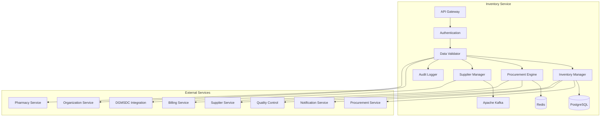

# MS Inventory Service

The Inventory Service manages hospital inventory, stock management, procurement, and supply chain operations with comprehensive Bangladesh healthcare supply chain integration.

## 📋 Service Overview

- **Repository**: [ms-inventory-service](https://github.com/zs-his/ms-inventory-service)
- **Status**: 🟡 In Progress
- **FHIR Resources**: SupplyRequest, SupplyDelivery, InventoryReport
- **Primary Database**: PostgreSQL
- **Cache Layer**: Redis
- **Event Streaming**: Apache Kafka

## 🎯 Key Features

### Inventory Management
- **Stock Management**: Real-time inventory tracking
- **Procurement**: Purchase order management
- **Supplier Management**: Vendor relationships and contracts
- **Expiry Tracking**: Medication and supply expiry monitoring
- **Reorder Management**: Automated reorder point alerts

### Bangladesh-Specific Features
- **Local Suppliers**: Bangladesh pharmaceutical and medical suppliers
- **Government Procurement**: DGMSDC procurement processes
- **Quality Standards**: Bangladesh drug quality regulations
- **Regional Distribution**: Supply chain optimization for Bangladesh regions
- **Emergency Supplies**: Disaster response inventory management

## 🏗️ Architecture



## 📊 Database Schema

### Inventory Item Table
```sql
CREATE TABLE inventory_items (
    id UUID PRIMARY KEY DEFAULT gen_random_uuid(),
    item_id VARCHAR(50) UNIQUE NOT NULL,
    facility_id UUID REFERENCES organizations(id),
    item_code VARCHAR(50) NOT NULL,
    item_name VARCHAR(200) NOT NULL,
    item_category VARCHAR(50) NOT NULL,
    item_type VARCHAR(50) NOT NULL,
    description TEXT,
    unit_of_measure VARCHAR(20) NOT NULL,
    current_stock INTEGER NOT NULL DEFAULT 0,
    minimum_stock INTEGER NOT NULL DEFAULT 0,
    maximum_stock INTEGER NOT NULL DEFAULT 0,
    reorder_level INTEGER NOT NULL DEFAULT 0,
    unit_cost DECIMAL(10,2),
    selling_price DECIMAL(10,2),
    supplier_id UUID REFERENCES suppliers(id),
    storage_location VARCHAR(100),
    storage_conditions JSONB,
    expiry_tracking BOOLEAN DEFAULT false,
    batch_tracking BOOLEAN DEFAULT false,
    quality_control_required BOOLEAN DEFAULT false,
    created_at TIMESTAMP DEFAULT CURRENT_TIMESTAMP,
    updated_at TIMESTAMP DEFAULT CURRENT_TIMESTAMP,
    metadata JSONB
);
```

### Stock Transaction Table
```sql
CREATE TABLE stock_transactions (
    id UUID PRIMARY KEY DEFAULT gen_random_uuid(),
    transaction_id VARCHAR(50) UNIQUE NOT NULL,
    item_id UUID REFERENCES inventory_items(id),
    facility_id UUID REFERENCES organizations(id),
    transaction_type VARCHAR(20) NOT NULL,
    transaction_date TIMESTAMP NOT NULL,
    quantity INTEGER NOT NULL,
    unit_cost DECIMAL(10,2),
    total_cost DECIMAL(12,2),
    reference_id VARCHAR(50),
    reference_type VARCHAR(50),
    supplier_id UUID REFERENCES suppliers(id),
    batch_number VARCHAR(50),
    expiry_date DATE,
    performed_by UUID REFERENCES practitioners(id),
    notes TEXT,
    created_at TIMESTAMP DEFAULT CURRENT_TIMESTAMP,
    metadata JSONB
);
```

### Purchase Order Table
```sql
CREATE TABLE purchase_orders (
    id UUID PRIMARY KEY DEFAULT gen_random_uuid(),
    order_id VARCHAR(50) UNIQUE NOT NULL,
    facility_id UUID REFERENCES organizations(id),
    supplier_id UUID REFERENCES suppliers(id),
    order_date DATE NOT NULL,
    expected_delivery_date DATE,
    status VARCHAR(20) NOT NULL DEFAULT 'draft',
    priority VARCHAR(20) DEFAULT 'normal',
    total_amount DECIMAL(12,2),
    currency VARCHAR(3) DEFAULT 'BDT',
    payment_terms VARCHAR(50),
    delivery_terms VARCHAR(100),
    items JSONB NOT NULL,
    approved_by UUID REFERENCES practitioners(id),
    approved_date TIMESTAMP,
    created_at TIMESTAMP DEFAULT CURRENT_TIMESTAMP,
    updated_at TIMESTAMP DEFAULT CURRENT_TIMESTAMP,
    metadata JSONB
);
```

## 🔌 API Endpoints

### Inventory Management
```go
// Create inventory item
POST /api/inventory/items
{
  "itemCode": "MED-001",
  "itemName": "Paracetamol 500mg",
  "itemCategory": "medication",
  "itemType": "tablet",
  "description": "Paracetamol 500mg tablets, 100 tablets per bottle",
  "unitOfMeasure": "bottle",
  "currentStock": 50,
  "minimumStock": 20,
  "maximumStock": 200,
  "reorderLevel": 30,
  "unitCost": 150.00,
  "sellingPrice": 200.00,
  "supplierId": "supplier-123",
  "storageLocation": "Pharmacy Store A-1",
  "storageConditions": {
    "temperature": "room_temperature",
    "humidity": "normal",
    "light": "avoid_direct_sunlight"
  },
  "expiryTracking": true,
  "batchTracking": true,
  "qualityControlRequired": true
}

// Get inventory item by ID
GET /api/inventory/items/{id}

// Search inventory items
GET /api/inventory/items?facility=123&category=medication&low_stock=true

// Update inventory item
PUT /api/inventory/items/{id}

// Update stock
POST /api/inventory/items/{id}/stock
{
  "transactionType": "adjustment",
  "quantity": 10,
  "reason": "Physical count adjustment",
  "performedBy": "practitioner-456"
}
```

### Stock Transactions
```go
// Create stock transaction
POST /api/inventory/transactions
{
  "itemId": "item-123",
  "facilityId": "facility-456",
  "transactionType": "purchase",
  "transactionDate": "2026-01-21T10:00:00+06:00",
  "quantity": 100,
  "unitCost": 150.00,
  "totalCost": 15000.00,
  "referenceId": "po-789",
  "referenceType": "purchase_order",
  "supplierId": "supplier-123",
  "batchNumber": "PAR-2024-001",
  "expiryDate": "2026-12-31",
  "performedBy": "practitioner-456",
  "notes": "Regular stock replenishment"
}

// Get transaction by ID
GET /api/inventory/transactions/{id}

// Search transactions
GET /api/inventory/transactions?item=123&type=purchase&date=2026-01-21

// Get stock history
GET /api/inventory/items/{id}/history?from=2026-01-01&to=2026-01-31
```

### Purchase Orders
```go
// Create purchase order
POST /api/inventory/purchase-orders
{
  "facilityId": "facility-456",
  "supplierId": "supplier-123",
  "orderDate": "2026-01-21",
  "expectedDeliveryDate": "2026-01-28",
  "priority": "normal",
  "currency": "BDT",
  "paymentTerms": "Net 30 days",
  "deliveryTerms": "Delivery to hospital premises",
  "items": [
    {
      "itemId": "item-123",
      "itemCode": "MED-001",
      "itemName": "Paracetamol 500mg",
      "quantity": 100,
      "unitCost": 150.00,
      "totalCost": 15000.00,
      "deliveryDate": "2026-01-28"
    },
    {
      "itemId": "item-124",
      "itemCode": "MED-002",
      "itemName": "Amoxicillin 500mg",
      "quantity": 50,
      "unitCost": 800.00,
      "totalCost": 40000.00,
      "deliveryDate": "2026-01-28"
    }
  ],
  "totalAmount": 55000.00
}

// Get purchase order by ID
GET /api/inventory/purchase-orders/{id}

// Search purchase orders
GET /api/inventory/purchase-orders?facility=456&status=pending&supplier=123

// Approve purchase order
POST /api/inventory/purchase-orders/{id}/approve
{
  "approvedBy": "practitioner-789",
  "approvedDate": "2026-01-21T14:00:00+06:00",
  "notes": "Approved for regular stock replenishment"
}
```

## 🏥 Bangladesh Inventory Features

### Local Suppliers Database
```go
type BangladeshSupplier struct {
    SupplierID      string    `json:"supplier_id"`
    SupplierName    string    `json:"supplier_name"`
    SupplierType    string    `json:"supplier_type"`
    ContactPerson   string    `json:"contact_person"`
    PhoneNumber     string    `json:"phone_number"`
    Email           string    `json:"email"`
    Address         string    `json:"address"`
    City            string    `json:"city"`
    District        string    `json:"district"`
    Division        string    `json:"division"`
    LicenseNumber   string    `json:"license_number"`
    DGDARegistered  bool      `json:"dgda_registered"`
    ProductCategories []string `json:"product_categories"`
    PaymentTerms     string    `json:"payment_terms"`
    DeliveryTime     int       `json:"delivery_time_days"`
    MinOrderAmount   float64   `json:"min_order_amount"`
    QualityCertified bool      `json:"quality_certified"`
    Active          bool      `json:"active"`
    CreatedAt       time.Time `json:"created_at"`
}

var BangladeshSuppliers = map[string]BangladeshSupplier{
    "SQUARE_PHARMA": {
        SupplierID:      "SUP-001",
        SupplierName:    "Square Pharmaceuticals Ltd.",
        SupplierType:    "pharmaceutical_manufacturer",
        ContactPerson:   "Procurement Department",
        PhoneNumber:     "+880-2-9834411",
        Email:           "procurement@squarepharma.com",
        Address:         "144, Tejgaon Industrial Area, Dhaka-1208",
        City:            "Dhaka",
        District:        "Dhaka",
        Division:        "Dhaka",
        LicenseNumber:   "DGDA-001234",
        DGDARegistered:  true,
        ProductCategories: []string{"medications", "surgical_consumables"},
        PaymentTerms:     "Net 30 days",
        DeliveryTime:     3,
        MinOrderAmount:   10000.00,
        QualityCertified: true,
        Active:          true,
    },
    "BEXIMCO_PHARMA": {
        SupplierID:      "SUP-002",
        SupplierName:    "Beximco Pharmaceuticals Ltd.",
        SupplierType:    "pharmaceutical_manufacturer",
        ContactPerson:   "Sales Department",
        PhoneNumber:     "+880-2-8878222",
        Email:           "sales@beximcopharma.com",
        Address:         "Beximco Industrial Park, Sarabganj, Kashimpur, Gazipur",
        City:            "Gazipur",
        District:        "Gazipur",
        Division:        "Dhaka",
        LicenseNumber:   "DGDA-005678",
        DGDARegistered:  true,
        ProductCategories: []string{"medications", "vaccines"},
        PaymentTerms:     "Net 45 days",
        DeliveryTime:     5,
        MinOrderAmount:   15000.00,
        QualityCertified: true,
        Active:          true,
    },
    "INCEPTA_PHARMA": {
        SupplierID:      "SUP-003",
        SupplierName:    "Incepta Pharmaceuticals Ltd.",
        SupplierType:    "pharmaceutical_manufacturer",
        ContactPerson:   "Distribution Department",
        PhoneNumber:     "+880-2-55031111",
        Email:           "info@inceptapharma.com",
        Address:         "Incepta House, 43, Mohakhali C/A, Dhaka-1212",
        City:            "Dhaka",
        District:        "Dhaka",
        Division:        "Dhaka",
        LicenseNumber:   "DGDA-009012",
        DGDARegistered:  true,
        ProductCategories: []string{"medications", "diagnostic_kits"},
        PaymentTerms:     "Net 30 days",
        DeliveryTime:     2,
        MinOrderAmount:   8000.00,
        QualityCertified: true,
        Active:          true,
    },
}
```

### Essential Medicines List
```go
type EssentialMedicine struct {
    ItemCode        string  `json:"item_code"`
    ItemName        string  `json:"item_name"`
    Category        string  `json:"category"`
    Form            string  `json:"form"`
    Strength        string  `json:"strength"`
    UnitOfMeasure   string  `json:"unit_of_measure"`
    MinStockLevel   int     `json:"min_stock_level"`
    MaxStockLevel   int     `json:"max_stock_level"`
    ReorderLevel    int     `json:"reorder_level"`
    AverageMonthlyConsumption int `json:"average_monthly_consumption"`
    LeadTimeDays    int     `json:"lead_time_days"`
    StorageRequirements string `json:"storage_requirements"`
    PriceControlled  bool    `json:"price_controlled"`
    MaxRetailPrice  float64 `json:"max_retail_price"`
}

var BangladeshEssentialMedicines = map[string]EssentialMedicine{
    "PARACETAMOL": {
        ItemCode:        "EM-001",
        ItemName:        "Paracetamol 500mg",
        Category:        "analgesic",
        Form:            "tablet",
        Strength:        "500mg",
        UnitOfMeasure:   "tablet",
        MinStockLevel:   1000,
        MaxStockLevel:   10000,
        ReorderLevel:    2000,
        AverageMonthlyConsumption: 1500,
        LeadTimeDays:    7,
        StorageRequirements: "Store at room temperature, protect from light",
        PriceControlled: true,
        MaxRetailPrice:  2.50,
    },
    "AMOXICILLIN": {
        ItemCode:        "EM-002",
        ItemName:        "Amoxicillin 500mg",
        Category:        "antibiotic",
        Form:            "capsule",
        Strength:        "500mg",
        UnitOfMeasure:   "capsule",
        MinStockLevel:   500,
        MaxStockLevel:   5000,
        ReorderLevel:    1000,
        AverageMonthlyConsumption: 800,
        LeadTimeDays:    10,
        StorageRequirements: "Store at room temperature, protect from moisture",
        PriceControlled: true,
        MaxRetailPrice:  8.00,
    },
    "IBUPROFEN": {
        ItemCode:        "EM-003",
        ItemName:        "Ibuprofen 400mg",
        Category:        "nsaid",
        Form:            "tablet",
        Strength:        "400mg",
        UnitOfMeasure:   "tablet",
        MinStockLevel:   800,
        MaxStockLevel:   8000,
        ReorderLevel:    1500,
        AverageMonthlyConsumption: 1200,
        LeadTimeDays:    7,
        StorageRequirements: "Store at room temperature, protect from light",
        PriceControlled: true,
        MaxRetailPrice:  3.00,
    },
}
```

## 🔍 Search and Filtering

### Advanced Inventory Search
```go
type InventorySearchCriteria struct {
    FacilityID      string    `json:"facility_id"`
    ItemCategory    string    `json:"item_category"`
    ItemType        string    `json:"item_type"`
    LowStock        bool      `json:"low_stock"`
    ExpiringSoon    bool      `json:"expiring_soon"`
    ExpiryDays      int       `json:"expiry_days"`
    SupplierID      string    `json:"supplier_id"`
    MinStock        int       `json:"min_stock"`
    MaxStock        int       `json:"max_stock"`
    PriceRangeMin   float64   `json:"price_range_min"`
    PriceRangeMax   float64   `json:"price_range_max"`
}

func (s *InventoryService) SearchInventory(criteria InventorySearchCriteria) ([]InventoryItem, error) {
    query := s.db.NewSelect().Model(&InventoryItem{})
    
    if criteria.FacilityID != "" {
        query = query.Where("facility_id = ?", criteria.FacilityID)
    }
    
    if criteria.ItemCategory != "" {
        query = query.Where("item_category = ?", criteria.ItemCategory)
    }
    
    if criteria.LowStock {
        query = query.Where("current_stock <= reorder_level")
    }
    
    if criteria.ExpiringSoon {
        query = query.Join("JOIN stock_batches ON inventory_items.id = stock_batches.item_id").
                   Where("stock_batches.expiry_date <= ?", time.Now().AddDate(0, 0, criteria.ExpiryDays))
    }
    
    var items []InventoryItem
    err := query.Scan(ctx, &items)
    return items, err
}
```

## 📈 Performance Optimization

### Caching Strategy
```go
// Cache inventory levels for 15 minutes
func (s *InventoryService) GetInventoryLevels(facilityID string) ([]InventoryItem, error) {
    cacheKey := fmt.Sprintf("inventory_levels:%s", facilityID)
    
    if cached, err := s.cache.Get(cacheKey); err == nil {
        return cached.([]InventoryItem), nil
    }
    
    items, err := s.repository.GetByFacility(facilityID)
    if err != nil {
        return nil, err
    }
    
    s.cache.Set(cacheKey, items, 15*time.Minute)
    return items, nil
}

// Cache supplier information for 2 hours
func (s *InventoryService) GetSuppliers() ([]BangladeshSupplier, error) {
    cacheKey := "bangladesh_suppliers"
    
    if cached, err := s.cache.Get(cacheKey); err == nil {
        return cached.([]BangladeshSupplier), nil
    }
    
    suppliers, err := s.repository.GetAllSuppliers()
    if err != nil {
        return nil, err
    }
    
    s.cache.Set(cacheKey, suppliers, 2*time.Hour)
    return suppliers, nil
}
```

### Database Indexing
```sql
-- Performance indexes
CREATE INDEX idx_inventory_items_facility ON inventory_items(facility_id);
CREATE INDEX idx_inventory_items_category ON inventory_items(item_category);
CREATE INDEX idx_inventory_items_code ON inventory_items(item_code);
CREATE INDEX idx_inventory_items_stock ON inventory_items(current_stock);
CREATE INDEX idx_inventory_items_supplier ON inventory_items(supplier_id);
CREATE INDEX idx_stock_transactions_item ON stock_transactions(item_id);
CREATE INDEX idx_stock_transactions_date ON stock_transactions(transaction_date);
CREATE INDEX idx_stock_transactions_type ON stock_transactions(transaction_type);
CREATE INDEX idx_purchase_orders_facility ON purchase_orders(facility_id);
CREATE INDEX idx_purchase_orders_supplier ON purchase_orders(supplier_id);
CREATE INDEX idx_purchase_orders_status ON purchase_orders(status);
CREATE INDEX idx_purchase_orders_date ON purchase_orders(order_date);
```

## 📦 Inventory Management Engine

### Automated Reorder System
```go
type ReorderEngine struct {
    ReorderRules     []ReorderRule
    LeadTimeBuffer   int
    SafetyStockFactor float64
    AutoOrderEnabled bool
}

type ReorderRule struct {
    ItemCategory     string  `json:"item_category"`
    ReorderPoint     float64 `json:"reorder_point"`
    EconomicOrderQty int     `json:"economic_order_quantity"`
    LeadTimeDays     int     `json:"lead_time_days"`
    SafetyStockDays  int     `json:"safety_stock_days"`
}

func (s *InventoryService) GenerateReorderRecommendations() ([]ReorderRecommendation, error) {
    var recommendations []ReorderRecommendation
    
    // Get all inventory items
    items, err := s.repository.GetAllItems()
    if err != nil {
        return nil, err
    }
    
    for _, item := range items {
        // Calculate reorder point
        reorderPoint := s.calculateReorderPoint(item)
        
        // Check if reorder is needed
        if item.CurrentStock <= reorderPoint {
            recommendation := ReorderRecommendation{
                ItemID:           item.ID,
                ItemCode:         item.ItemCode,
                ItemName:         item.ItemName,
                CurrentStock:     item.CurrentStock,
                ReorderPoint:     reorderPoint,
                RecommendedQty:   s.calculateRecommendedQuantity(item),
                Urgency:          s.calculateUrgency(item, reorderPoint),
                PreferredSupplier: item.SupplierID,
                EstimatedCost:    s.calculateEstimatedCost(item),
            }
            
            recommendations = append(recommendations, recommendation)
        }
    }
    
    return recommendations, nil
}

func (s *InventoryService) calculateReorderPoint(item InventoryItem) float64 {
    // Get average monthly consumption
    consumption := s.getAverageConsumption(item.ID)
    
    // Get lead time in days
    leadTime := s.getLeadTime(item.ID)
    
    // Calculate reorder point
    dailyConsumption := consumption / 30.0
    reorderPoint := dailyConsumption * float64(leadTime) * s.safetyStockFactor
    
    return reorderPoint
}

func (s *InventoryService) calculateRecommendedQuantity(item InventoryItem) int {
    // Economic Order Quantity (EOQ) calculation
    demand := s.getAnnualDemand(item.ID)
    orderingCost := s.getOrderingCost(item.ID)
    holdingCost := s.getHoldingCost(item.ID)
    
    eoq := int(math.Sqrt((2 * demand * orderingCost) / holdingCost))
    
    // Ensure it's within min/max limits
    if eoq < item.MinimumStock {
        eoq = item.MinimumStock
    }
    if eoq > item.MaximumStock {
        eoq = item.MaximumStock
    }
    
    return eoq
}
```

## 🏭 Procurement Management

### Purchase Order Processing
```go
type ProcurementEngine struct {
    ApprovalWorkflow  []ApprovalStep
    BudgetLimits      map[string]float64
    RequiredDocuments []string
    AutoApproval      bool
}

type ApprovalStep struct {
    StepID       string `json:"step_id"`
    StepName     string `json:"step_name"`
    RequiredRole string `json:"required_role"`
    TimeoutHours int    `json:"timeout_hours"`
    AutoApprove  bool   `json:"auto_approve"`
}

func (s *InventoryService) ProcessPurchaseOrder(order *PurchaseOrder) (*PurchaseOrderResult, error) {
    // Validate purchase order
    err := s.validatePurchaseOrder(order)
    if err != nil {
        return nil, fmt.Errorf("purchase order validation failed: %w", err)
    }
    
    // Check budget limits
    err = s.checkBudgetLimits(order)
    if err != nil {
        return nil, fmt.Errorf("budget limit exceeded: %w", err)
    }
    
    // Start approval workflow
    result, err := s.executeApprovalWorkflow(order)
    if err != nil {
        return nil, fmt.Errorf("approval workflow failed: %w", err)
    }
    
    // If approved, send to supplier
    if result.Approved {
        err = s.sendPurchaseOrderToSupplier(order)
        if err != nil {
            return nil, fmt.Errorf("failed to send purchase order: %w", err)
        }
        
        // Update order status
        order.Status = "sent"
        order.ApprovedDate = time.Now()
        
        err = s.repository.UpdatePurchaseOrder(order)
        if err != nil {
            return nil, fmt.Errorf("failed to update purchase order: %w", err)
        }
    }
    
    return result, nil
}

func (s *InventoryService) executeApprovalWorkflow(order *PurchaseOrder) (*PurchaseOrderResult, error) {
    result := &PurchaseOrderResult{
        OrderID: order.ID,
        Approved: false,
        Steps:   []ApprovalResult{},
    }
    
    for _, step := range s.approvalWorkflow {
        // Check if step can be auto-approved
        if step.AutoApprove && order.TotalAmount < s.getAutoApprovalLimit(step.RequiredRole) {
            stepResult := ApprovalResult{
                StepID:    step.StepID,
                StepName:  step.StepName,
                Approved:  true,
                ApprovedBy: "system",
                ApprovedAt: time.Now(),
                Comments:  "Auto-approved within limit",
            }
            result.Steps = append(result.Steps, stepResult)
            continue
        }
        
        // Check if manual approval is required
        approver, err := s.getApprover(step.RequiredRole, order.FacilityID)
        if err != nil {
            return nil, fmt.Errorf("no approver found for role %s: %w", step.RequiredRole, err)
        }
        
        // Send approval request
        err = s.sendApprovalRequest(order, step, approver)
        if err != nil {
            return nil, fmt.Errorf("failed to send approval request: %w", err)
        }
        
        // Wait for approval (in real implementation, this would be async)
        stepResult := ApprovalResult{
            StepID:    step.StepID,
            StepName:  step.StepName,
            Approved:  false, // Would be updated based on response
            ApprovedBy: approver.ID,
            ApprovedAt: time.Now(),
            Comments:  "Pending approval",
        }
        result.Steps = append(result.Steps, stepResult)
    }
    
    // Check if all steps are approved
    allApproved := true
    for _, step := range result.Steps {
        if !step.Approved {
            allApproved = false
            break
        }
    }
    
    result.Approved = allApproved
    return result, nil
}
```

## 🔒 Security Features

### Access Control
```go
func (s *InventoryService) CanAccessInventoryData(userID, recordID string, action string) bool {
    // Check user permissions
    permissions := s.authService.GetUserPermissions(userID)
    
    switch action {
    case "read":
        return permissions.Contains("inventory.read") || 
               s.canViewFacilityInventory(userID, recordID)
    case "write":
        return permissions.Contains("inventory.write") || 
               s.isAuthorizedInventoryStaff(userID)
    case "procure":
        return permissions.Contains("inventory.procure") || 
               s.isAuthorizedProcurementStaff(userID)
    case "approve":
        return permissions.Contains("inventory.approve") || 
               s.isAuthorizedApprover(userID)
    default:
        return false
    }
}

func (s *InventoryService) isAuthorizedInventoryStaff(userID string) bool {
    practitioner, err := s.practitionerService.GetPractitionerByUser(userID)
    if err != nil {
        return false
    }
    
    // Check if practitioner has inventory role
    for _, role := range practitioner.Roles {
        if role.Specialty == "pharmacy" || 
           role.Specialty == "procurement" ||
           role.Specialty == "store_management" {
            return true
        }
    }
    
    return false
}
```

### Data Privacy
```go
func (s *InventoryService) anonymizeSensitiveInventoryData(items []InventoryItem, requestUserID string) []InventoryItem {
    // Check if requester has full access
    if s.authService.HasFullAccess(requestUserID) {
        return items
    }
    
    // Anonymize sensitive inventory information
    var anonymized []InventoryItem
    for _, item := range items {
        if s.isSensitiveItem(item) {
            // Remove sensitive details
            item.UnitCost = 0.00
            item.SellingPrice = 0.00
            item.SupplierID = ""
        }
        anonymized = append(anonymized, item)
    }
    
    return anonymized
}

func (s *InventoryService) isSensitiveItem(item InventoryItem) bool {
    // Check for sensitive medications
    sensitiveCategories := []string{
        "controlled_substances",
        "psychiatric_medications",
        "expensive_medications",
    }
    
    for _, category := range sensitiveCategories {
        if item.ItemCategory == category {
            return true
        }
    }
    
    return false
}
```

## 📊 Monitoring and Metrics

### Health Checks
```go
func (s *InventoryService) HealthCheck() map[string]interface{} {
    return map[string]interface{}{
        "database":          s.checkDatabase(),
        "cache":             s.checkCache(),
        "kafka":             s.checkKafka(),
        "inventory_manager": s.checkInventoryManager(),
        "procurement_engine": s.checkProcurementEngine(),
        "supplier_manager":  s.checkSupplierManager(),
        "dgmsdc_integration": s.checkDGMSDCIntegration(),
        "quality_service":   s.checkQualityService(),
        "timestamp":         time.Now(),
    }
}
```

### Performance Metrics
```go
// Prometheus metrics
var (
    inventoryRequestsTotal = prometheus.NewCounterVec(
        prometheus.CounterOpts{
            Name: "inventory_requests_total",
            Help: "Total number of inventory requests",
        },
        []string{"method", "endpoint", "status"},
    )
    
    stockUpdateTime = prometheus.NewHistogramVec(
        prometheus.HistogramOpts{
            Name: "inventory_stock_update_seconds",
            Help: "Time taken to update stock levels",
        },
        []string{"transaction_type", "facility"},
    )
    
    procurementProcessingTime = prometheus.NewHistogramVec(
        prometheus.HistogramOpts{
            Name: "inventory_procurement_processing_seconds",
            Help: "Time taken to process procurement requests",
        },
        []string{"order_type", "supplier", "status"},
    )
)
```

## 🧪 Testing

### Unit Tests
```go
func TestInventoryService_CreateInventoryItem(t *testing.T) {
    service := NewInventoryService(mockRepo, mockCache, mockProcurement)
    item := &InventoryItem{
        ItemCode:        "MED-001",
        ItemName:        "Paracetamol 500mg",
        ItemCategory:    "medication",
        ItemType:        "tablet",
        Description:     "Paracetamol 500mg tablets",
        UnitOfMeasure:   "bottle",
        CurrentStock:    50,
        MinimumStock:    20,
        MaximumStock:    200,
        ReorderLevel:    30,
        UnitCost:        150.00,
        SellingPrice:    200.00,
        SupplierID:      "supplier-123",
        StorageLocation: "Pharmacy Store A-1",
        ExpiryTracking:  true,
        BatchTracking:   true,
        QualityControlRequired: true,
    }
    
    result, err := service.CreateInventoryItem(item)
    
    assert.NoError(t, err)
    assert.NotNil(t, result)
    assert.NotEmpty(t, result.ID)
    assert.Equal(t, "MED-001", result.ItemCode)
    assert.Equal(t, 50, result.CurrentStock)
}
```

## 🚀 Deployment

### Docker Configuration
```dockerfile
FROM golang:1.25-alpine AS builder

WORKDIR /app
COPY go.mod go.sum ./
RUN go mod download

COPY . .
RUN CGO_ENABLED=0 GOOS=linux go build -o main cmd/server/main.go

FROM alpine:latest
RUN apk --no-cache add ca-certificates
WORKDIR /root/
COPY --from=builder /app/main .
EXPOSE 8080
CMD ["./main"]
```

### Kubernetes Deployment
```yaml
apiVersion: apps/v1
kind: Deployment
metadata:
  name: ms-inventory-service
spec:
  replicas: 3
  selector:
    matchLabels:
      app: ms-inventory-service
  template:
    metadata:
      labels:
        app: ms-inventory-service
    spec:
      containers:
      - name: ms-inventory-service
        image: zarish-his/ms-inventory-service:latest
        ports:
        - containerPort: 8080
        env:
        - name: DB_HOST
          value: "postgresql-service"
        - name: REDIS_HOST
          value: "redis-service"
        - name: KAFKA_BROKERS
          value: "kafka-service:9092"
        - name: DGMSDC_API_URL
          value: "https://dgmsdc.gov.bd/api"
```

## 🔗 Related Resources

- **Frontend Integration**: [ESM Admin](../frontend/esm-admin.md)
- **FHIR Implementation**: [FHIR SupplyRequest Profile](../fhir/supply-request-profile.md)
- **API Documentation**: [Inventory API Reference](../api-reference/rest-apis.md)
- **DGMSDC Integration**: [DGMSDC Service Documentation](#)

---

*Last updated: 2026-01-21*
