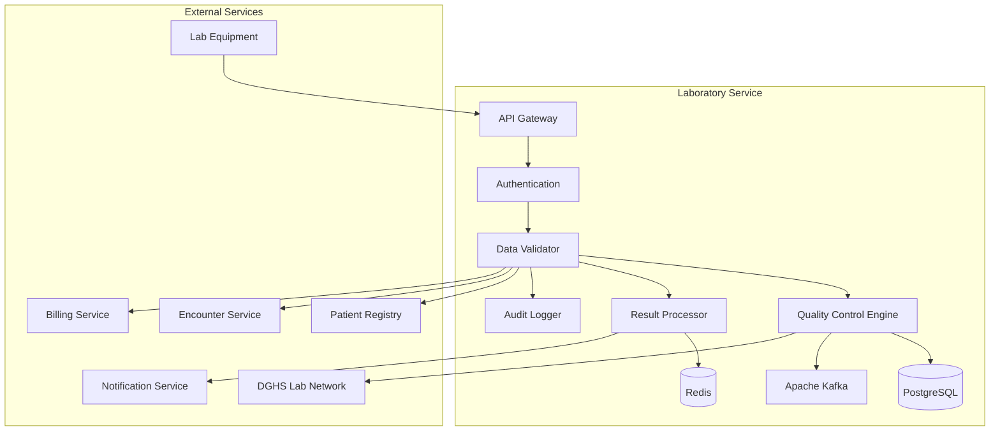

# MS Laboratory Service

The Laboratory Service manages laboratory test ordering, result entry, quality control, and reporting with comprehensive integration with lab equipment and Bangladesh healthcare standards.

## 📋 Service Overview

- **Repository**: [ms-laboratory-service](https://github.com/zs-his/ms-laboratory-service)
- **Status**: 🟡 In Progress
- **FHIR Resources**: DiagnosticReport, Observation, Specimen, ServiceRequest
- **Primary Database**: PostgreSQL
- **Cache Layer**: Redis
- **Event Streaming**: Apache Kafka

## 🎯 Key Features

### Laboratory Operations
- **Test Ordering**: Laboratory test requests and specimen tracking
- **Result Entry**: Manual and automated result capture
- **Quality Control**: QC samples, calibration, and validation
- **Report Generation**: Patient and provider report generation
- **Specimen Management**: Collection, transport, and storage tracking

### Bangladesh-Specific Features
- **DGHS Lab Network**: Bangladesh national laboratory reporting
- **Tropical Disease Testing**: Dengue, malaria, chikungunya assays
- **Local Test Panels**: Bangladesh-specific test combinations
- **Government Reporting**: Notifiable disease laboratory reporting
- **Cost-Effective Testing**: Resource-appropriate test selection

## 🏗️ Architecture



## 📊 Database Schema

### Diagnostic Report Table
```sql
CREATE TABLE diagnostic_reports (
    id UUID PRIMARY KEY DEFAULT gen_random_uuid(),
    report_id VARCHAR(50) UNIQUE NOT NULL,
    patient_id UUID NOT NULL,
    encounter_id UUID REFERENCES encounters(id),
    status VARCHAR(20) NOT NULL DEFAULT 'preliminary',
    category JSONB NOT NULL,
    code JSONB NOT NULL,
    subject_type VARCHAR(20) DEFAULT 'patient',
    subject_id UUID NOT NULL,
    encounter_reference UUID REFERENCES encounters(id),
    effective_date_time TIMESTAMP,
    effective_period JSONB,
    issued TIMESTAMP,
    performer JSONB,
    results_interpreter JSONB,
    specimen JSONB,
    result JSONB,
    imaging_study JSONB,
    media JSONB,
    conclusion TEXT,
    coded_diagnosis JSONB,
    presented_form JSONB,
    created_at TIMESTAMP DEFAULT CURRENT_TIMESTAMP,
    updated_at TIMESTAMP DEFAULT CURRENT_TIMESTAMP,
    metadata JSONB,
    FOREIGN KEY (patient_id) REFERENCES patients(id)
);
```

### Laboratory Test Table
```sql
CREATE TABLE laboratory_tests (
    id UUID PRIMARY KEY DEFAULT gen_random_uuid(),
    test_id VARCHAR(50) UNIQUE NOT NULL,
    test_code VARCHAR(50) NOT NULL,
    test_name VARCHAR(200) NOT NULL,
    test_category VARCHAR(50) NOT NULL,
    specimen_type VARCHAR(50) NOT NULL,
    methodology VARCHAR(100),
    turnaround_time INTEGER,
    price DECIMAL(10,2),
    reference_range JSONB,
    critical_range JSONB,
    units VARCHAR(20),
    loinc_code VARCHAR(10),
    is_active BOOLEAN DEFAULT true,
    requires_fasting BOOLEAN DEFAULT false,
    special_instructions TEXT,
    equipment_required JSONB,
    quality_control_required BOOLEAN DEFAULT true,
    created_at TIMESTAMP DEFAULT CURRENT_TIMESTAMP,
    updated_at TIMESTAMP DEFAULT CURRENT_TIMESTAMP
);
```

### Specimen Table
```sql
CREATE TABLE specimens (
    id UUID PRIMARY KEY DEFAULT gen_random_uuid(),
    specimen_id VARCHAR(50) UNIQUE NOT NULL,
    accession_identifier JSONB,
    status VARCHAR(20) NOT NULL DEFAULT 'available',
    type JSONB NOT NULL,
    subject_type VARCHAR(20) DEFAULT 'patient',
    subject_id UUID NOT NULL,
    received_time TIMESTAMP,
    collection JSONB,
    processing JSONB,
    container JSONB,
    note JSONB,
    created_at TIMESTAMP DEFAULT CURRENT_TIMESTAMP,
    updated_at TIMESTAMP DEFAULT CURRENT_TIMESTAMP,
    FOREIGN KEY (subject_id) REFERENCES patients(id)
);
```

## 🔌 API Endpoints

### Test Ordering
```go
// Create laboratory test order
POST /api/laboratory/orders
{
  "status": "active",
  "intent": "order",
  "category": [{"coding": [{"code": "laboratory"}]}],
  "priority": "routine",
  "code": {
    "coding": [{
      "system": "http://loinc.org",
      "code": "2345-7",
      "display": "Glucose"
    }]
  },
  "subject": {"reference": "Patient/12345"},
  "encounter": {"reference": "Encounter/67890"},
  "authoredOn": "2026-01-21T08:00:00+06:00",
  "requester": {
    "reference": "Practitioner/111",
    "display": "Dr. John Doe"
  },
  "specimen": [{
    "reference": "Specimen/222",
    "display": "Blood - Serum"
  }],
  "note": [{
    "text": "Patient fasting for 8 hours"
  }]
}

// Get test orders
GET /api/laboratory/orders?patient=12345&status=active

// Update order status
PUT /api/laboratory/orders/{id}/status
{
  "status": "completed",
  "statusReason": {
    "coding": [{
      "system": "http://terminology.hl7.org/CodeSystem/laboratory-order-status",
      "code": "complt",
      "display": "Completed"
    }]
  }
}
```

### Result Entry
```go
// Create diagnostic report
POST /api/laboratory/reports
{
  "status": "final",
  "category": [{"coding": [{"code": "laboratory"}]}],
  "code": {
    "coding": [{
      "system": "http://loinc.org",
      "code": "2345-7",
      "display": "Glucose"
    }]
  },
  "subject": {"reference": "Patient/12345"},
  "encounter": {"reference": "Encounter/67890"},
  "effectiveDateTime": "2026-01-21T09:30:00+06:00",
  "issued": "2026-01-21T10:15:00+06:00",
  "performer": [{
    "function": {
      "coding": [{
        "system": "http://terminology.hl7.org/CodeSystem/v3-ParticipationType",
        "code": "author",
        "display": "Author"
      }]
    },
    "actor": {
      "reference": "Practitioner/222",
      "display": "Dr. Jane Smith"
    }
  }],
  "resultsInterpreter": [{
    "reference": "Practitioner/222",
    "display": "Dr. Jane Smith"
  }],
  "specimen": [{
    "reference": "Specimen/333",
    "display": "Blood - Serum"
  }],
  "result": [{
    "status": "final",
    "code": {
      "coding": [{
        "system": "http://loinc.org",
        "code": "2345-7",
        "display": "Glucose"
      }]
    },
    "subject": {"reference": "Patient/12345"},
    "effectiveDateTime": "2026-01-21T09:30:00+06:00",
    "valueQuantity": {
      "value": 95.0,
      "unit": "mg/dL",
      "system": "http://unitsofmeasure.org",
      "code": "mg/dL"
    },
    "referenceRange": [{
      "low": {"value": 70, "unit": "mg/dL"},
      "high": {"value": 100, "unit": "mg/dL"},
      "type": {
        "coding": [{
          "system": "http://terminology.hl7.org/CodeSystem/referencerange-meaning",
          "code": "normal",
          "display": "Normal Range"
        }]
      }
    }]
  }],
  "conclusion": "Normal fasting glucose level"
}

// Get diagnostic reports
GET /api/laboratory/reports?patient=12345&status=final

// Get report by ID
GET /api/laboratory/reports/{id}
```

### Quality Control
```go
// Create QC sample
POST /api/laboratory/quality-control/samples
{
  "sampleId": "QC-GLU-001",
  "testCode": "2345-7",
  "testName": "Glucose",
  "controlMaterial": "Level 1 Control",
  "expectedValue": 90.0,
  "acceptableRange": {"low": 85.0, "high": 95.0},
  "runDate": "2026-01-21T08:00:00+06:00",
  "operator": "Lab Technician 1",
  "instrument": "AutoAnalyzer 2000"
}

// Record QC result
POST /api/laboratory/quality-control/results
{
  "sampleId": "QC-GLU-001",
  "measuredValue": 92.3,
  "runTime": "2026-01-21T08:15:00+06:00",
  "operator": "Lab Technician 1",
  "instrument": "AutoAnalyzer 2000",
  "status": "accepted"
}

// Get QC statistics
GET /api/laboratory/quality-control/statistics?test=2345-7&period=30d
```

## 🏥 Bangladesh Laboratory Tests

### Essential Laboratory Tests
```go
var BangladeshEssentialTests = map[string]LabTest{
    "CBC": {
        Code:        "CBC",
        Name:        "Complete Blood Count",
        Category:    "hematology",
        Specimen:    "Blood - EDTA",
        Price:       150.00,
        Turnaround:  30,
        LOINC:       "58410-2",
        Essential:   true,
    },
    "RBS": {
        Code:        "RBS",
        Name:        "Random Blood Sugar",
        Category:    "clinical_chemistry",
        Specimen:    "Blood - Serum",
        Price:       80.00,
        Turnaround:  15,
        LOINC:       "2345-7",
        Essential:   true,
    },
    "URINE": {
        Code:        "URINE",
        Name:        "Urine Routine Examination",
        Category:    "clinical_pathology",
        Specimen:    "Urine",
        Price:       100.00,
        Turnaround:  45,
        LOINC:       "24357-6",
        Essential:   true,
    },
    "DENGUE": {
        Code:        "DENGUE",
        Name:        "Dengue NS1 Antigen",
        Category:    "serology",
        Specimen:    "Blood - Serum",
        Price:       500.00,
        Turnaround:  60,
        LOINC:       "41251-7",
        Essential:   false,
        Tropical:    true,
    },
    "MALARIA": {
        Code:        "MALARIA",
        Name:        "Malaria Parasite Smear",
        Category:    "parasitology",
        Specimen:    "Blood - EDTA",
        Price:       200.00,
        Turnaround:  120,
        LOINC:       "51721-0",
        Essential:   false,
        Tropical:    true,
    },
}
```

### Tropical Disease Testing
```go
type TropicalDiseaseTest struct {
    Disease     string  `json:"disease"`
    TestName    string  `json:"test_name"`
    Methodology string  `json:"methodology"`
    Specimen    string  `json:"specimen"`
    Turnaround  int     `json:"turnaround_minutes"`
    Seasonal    bool    `json:"seasonal"`
    EndemicRegions []string `json:"endemic_regions"`
}

var TropicalDiseaseTests = []TropicalDiseaseTest{
    {
        Disease:      "Dengue Fever",
        TestName:     "Dengue NS1 Antigen",
        Methodology:  "Immunochromatography",
        Specimen:     "Blood - Serum",
        Turnaround:   30,
        Seasonal:     true,
        EndemicRegions: []string{"Dhaka", "Chattogram", "Khulna", "Rajshahi", "Sylhet"},
    },
    {
        Disease:      "Dengue Fever",
        TestName:     "Dengue IgM/IgG Antibody",
        Methodology:  "ELISA",
        Specimen:     "Blood - Serum",
        Turnaround:   120,
        Seasonal:     true,
        EndemicRegions: []string{"Dhaka", "Chattogram", "Khulna", "Rajshahi", "Sylhet"},
    },
    {
        Disease:      "Malaria",
        TestName:     "Malaria Parasite Smear",
        Methodology:  "Microscopy",
        Specimen:     "Blood - EDTA",
        Turnaround:   60,
        Seasonal:     true,
        EndemicRegions: []string{"Bandarban", "Rangamati", "Khagrachari", "Cox's Bazar"},
    },
    {
        Disease:      "Chikungunya",
        TestName:     "Chikungunya IgM Antibody",
        Methodology:  "ELISA",
        Specimen:     "Blood - Serum",
        Turnaround:   120,
        Seasonal:     true,
        EndemicRegions: []string{"Dhaka", "Chattogram", "Rajshahi"},
    },
}
```

## 🔍 Search and Filtering

### Advanced Test Search
```go
type LabTestSearchCriteria struct {
    TestCode      string  `json:"test_code"`
    TestName      string  `json:"test_name"`
    Category      string  `json:"category"`
    SpecimenType  string  `json:"specimen_type"`
    LOINCCode     string  `json:"loinc_code"`
    Essential     bool    `json:"essential"`
    Tropical      bool    `json:"tropical"`
    PriceMin      float64 `json:"price_min"`
    PriceMax      float64 `json:"price_max"`
    TurnaroundMax int     `json:"turnaround_max"`
}

func (s *LaboratoryService) SearchTests(criteria LabTestSearchCriteria) ([]LabTest, error) {
    query := s.db.NewSelect().Model(&LabTest{}).Where("is_active = true")
    
    if criteria.TestName != "" {
        query = query.Where("test_name ILIKE ?", "%"+criteria.TestName+"%")
    }
    
    if criteria.Category != "" {
        query = query.Where("test_category = ?", criteria.Category)
    }
    
    if criteria.SpecimenType != "" {
        query = query.Where("specimen_type = ?", criteria.SpecimenType)
    }
    
    if criteria.Essential {
        query = query.Where("essential = true")
    }
    
    if criteria.Tropical {
        query = query.Where("tropical = true")
    }
    
    var tests []LabTest
    err := query.Scan(ctx, &tests)
    return tests, err
}
```

## 📈 Performance Optimization

### Caching Strategy
```go
// Cache test catalog for 4 hours
func (s *LaboratoryService) GetTestCatalog() ([]LabTest, error) {
    cacheKey := "lab_test_catalog"
    
    if cached, err := s.cache.Get(cacheKey); err == nil {
        return cached.([]LabTest), nil
    }
    
    tests, err := s.repository.GetAllActiveTests()
    if err != nil {
        return nil, err
    }
    
    s.cache.Set(cacheKey, tests, 4*time.Hour)
    return tests, nil
}

// Cache patient lab results for 30 minutes
func (s *LaboratoryService) GetPatientLabResults(patientID string, period string) ([]DiagnosticReport, error) {
    cacheKey := fmt.Sprintf("lab_results:%s:%s", patientID, period)
    
    if cached, err := s.cache.Get(cacheKey); err == nil {
        return cached.([]DiagnosticReport), nil
    }
    
    results, err := s.repository.GetPatientResults(patientID, period)
    if err != nil {
        return nil, err
    }
    
    s.cache.Set(cacheKey, results, 30*time.Minute)
    return results, nil
}
```

### Database Indexing
```sql
-- Performance indexes
CREATE INDEX idx_lab_tests_code ON laboratory_tests(test_code);
CREATE INDEX idx_lab_tests_category ON laboratory_tests(test_category);
CREATE INDEX idx_lab_tests_loinc ON laboratory_tests(loinc_code);
CREATE INDEX idx_lab_tests_active ON laboratory_tests(is_active);
CREATE INDEX idx_diagnostic_reports_patient ON diagnostic_reports(patient_id);
CREATE INDEX idx_diagnostic_reports_status ON diagnostic_reports(status);
CREATE INDEX idx_diagnostic_reports_code ON diagnostic_reports USING gin(to_tsvector('english', code->>'coding'->>0->>'code'));
CREATE INDEX idx_specimens_patient ON specimens(subject_id);
CREATE INDEX idx_specimens_status ON specimens(status);
```

## 🔬 Quality Control System

### QC Sample Management
```go
type QCSample struct {
    ID              string    `json:"id"`
    TestCode        string    `json:"test_code"`
    ControlMaterial string    `json:"control_material"`
    ExpectedValue   float64   `json:"expected_value"`
    AcceptableRange Range     `json:"acceptable_range"`
    RunDate         time.Time `json:"run_date"`
    Operator        string    `json:"operator"`
    Instrument      string    `json:"instrument"`
    MeasuredValue   float64   `json:"measured_value"`
    Status          string    `json:"status"` // accepted, rejected, warning
    Deviation       float64   `json:"deviation"`
    Comments        string    `json:"comments"`
}

func (s *LaboratoryService) ProcessQCSample(sample *QCSample) error {
    // Calculate deviation
    deviation := math.Abs(sample.MeasuredValue - sample.ExpectedValue)
    sample.Deviation = deviation
    
    // Determine status
    if deviation <= sample.AcceptableRange.Low || deviation >= sample.AcceptableRange.High {
        sample.Status = "rejected"
        // Trigger alert
        s.alertQCFailure(sample)
    } else if deviation > (sample.AcceptableRange.High * 0.8) {
        sample.Status = "warning"
        // Trigger warning
        s.alertQCWarning(sample)
    } else {
        sample.Status = "accepted"
    }
    
    // Save QC result
    return s.repository.SaveQCSample(sample)
}

func (s *LaboratoryService) alertQCFailure(sample *QCSample) {
    alert := QCAlert{
        Type:        "failure",
        TestCode:    sample.TestCode,
        Instrument:  sample.Instrument,
        Operator:    sample.Operator,
        Deviation:   sample.Deviation,
        Timestamp:   time.Now(),
        Message:     fmt.Sprintf("QC failure for %s - deviation: %.2f", sample.TestCode, sample.Deviation),
    }
    
    s.notificationService.SendQCAlert(alert)
}
```

### Levey-Jennings Charts
```go
type QCChartData struct {
    TestCode    string      `json:"test_code"`
    Instrument  string      `json:"instrument"`
    Period      string      `json:"period"`
    DataPoints  []QCPoint   `json:"data_points"`
    Mean        float64     `json:"mean"`
    StdDev      float64     `json:"std_dev"`
    UpperLimit  float64     `json:"upper_limit"`
    LowerLimit  float64     `json:"lower_limit"`
}

type QCPoint struct {
    Date        time.Time `json:"date"`
    Value       float64   `json:"value"`
    Status      string    `json:"status"`
    Operator    string    `json:"operator"`
}

func (s *LaboratoryService) GenerateQCChart(testCode, instrument, period string) (*QCChartData, error) {
    // Get QC data for the period
    samples, err := s.repository.GetQCSamples(testCode, instrument, period)
    if err != nil {
        return nil, err
    }
    
    // Calculate statistics
    var values []float64
    var dataPoints []QCPoint
    
    for _, sample := range samples {
        values = append(values, sample.MeasuredValue)
        dataPoints = append(dataPoints, QCPoint{
            Date:     sample.RunDate,
            Value:    sample.MeasuredValue,
            Status:   sample.Status,
            Operator: sample.Operator,
        })
    }
    
    mean := calculateMean(values)
    stdDev := calculateStdDev(values, mean)
    
    return &QCChartData{
        TestCode:   testCode,
        Instrument: instrument,
        Period:     period,
        DataPoints: dataPoints,
        Mean:       mean,
        StdDev:     stdDev,
        UpperLimit: mean + (2 * stdDev),
        LowerLimit: mean - (2 * stdDev),
    }, nil
}
```

## 🚨 Critical Value Management

### Critical Value Alerting
```go
type CriticalValueAlert struct {
    PatientID     string    `json:"patient_id"`
    TestCode      string    `json:"test_code"`
    TestName      string    `json:"test_name"`
    MeasuredValue float64   `json:"measured_value"`
    CriticalRange Range     `json:"critical_range"`
    OrderingPhysician string `json:"ordering_physician"`
    ResultTime    time.Time `json:"result_time"`
    AlertTime     time.Time `json:"alert_time"`
    Status        string    `json:"status"` // pending, acknowledged, resolved
}

func (s *LaboratoryService) CheckCriticalValues(report *DiagnosticReport) error {
    for _, result := range report.Result {
        if result.ValueQuantity == nil {
            continue
        }
        
        // Get test information
        test, err := s.repository.GetTestByCode(result.Code.Coding[0].Code)
        if err != nil {
            continue
        }
        
        // Check if value is critical
        if s.isCriticalValue(result.ValueQuantity.Value, test.CriticalRange) {
            alert := CriticalValueAlert{
                PatientID:          report.Subject.Reference,
                TestCode:           test.TestCode,
                TestName:           test.TestName,
                MeasuredValue:      result.ValueQuantity.Value,
                CriticalRange:      test.CriticalRange,
                OrderingPhysician: s.getOrderingPhysician(report),
                ResultTime:         result.EffectiveDateTime,
                AlertTime:          time.Now(),
                Status:             "pending",
            }
            
            // Send alert
            err := s.sendCriticalValueAlert(alert)
            if err != nil {
                log.Printf("Failed to send critical value alert: %v", err)
            }
        }
    }
    
    return nil
}

func (s *LaboratoryService) isCriticalValue(value float64, criticalRange []Range) bool {
    for _, range_ := range criticalRange {
        if value <= range_.Low || value >= range_.High {
            return true
        }
    }
    return false
}
```

## 🔒 Security Features

### Access Control
```go
func (s *LaboratoryService) CanAccessLabData(userID, patientID string, action string) bool {
    // Check user permissions
    permissions := s.authService.GetUserPermissions(userID)
    
    switch action {
    case "read":
        return permissions.Contains("laboratory.read") || 
               s.canViewPatientLabData(userID, patientID)
    case "write":
        return permissions.Contains("laboratory.write") || 
               s.isLaboratoryPersonnel(userID)
    case "verify":
        return permissions.Contains("laboratory.verify") || 
               s.isQualifiedLabTechnician(userID)
    default:
        return false
    }
}

func (s *LaboratoryService) isLaboratoryPersonnel(userID string) bool {
    practitioner, err := s.practitionerService.GetPractitionerByUser(userID)
    if err != nil {
        return false
    }
    
    // Check if practitioner has laboratory specialization
    for _, role := range practitioner.Roles {
        if role.Specialty == "laboratory" || role.Specialty == "clinical_pathology" {
            return true
        }
    }
    
    return false
}
```

### Result Privacy
```go
func (s *LaboratoryService) anonymizeSensitiveResults(reports []DiagnosticReport, requestUserID string) []DiagnosticReport {
    // Check if requester has full access
    if s.authService.HasFullAccess(requestUserID) {
        return reports
    }
    
    // Anonymize sensitive test results (HIV, hepatitis, etc.)
    var anonymized []DiagnosticReport
    for _, report := range reports {
        if s.isSensitiveTest(report) {
            // Remove sensitive details
            report.Result = nil
            report.Conclusion = "Sensitive test result - contact healthcare provider"
            report.CodedDiagnosis = nil
        }
        anonymized = append(anonymized, report)
    }
    
    return anonymized
}

func (s *LaboratoryService) isSensitiveTest(report DiagnosticReport) bool {
    sensitiveCodes := []string{
        "75423-6", // HIV test
        "5217-3",  // Hepatitis B surface antigen
        "5225-1",  // Hepatitis C antibody
        // Add more sensitive test codes
    }
    
    for _, code := range sensitiveCodes {
        if report.Code.Coding[0].Code == code {
            return true
        }
    }
    
    return false
}
```

## 📊 Monitoring and Metrics

### Health Checks
```go
func (s *LaboratoryService) HealthCheck() map[string]interface{} {
    return map[string]interface{}{
        "database":           s.checkDatabase(),
        "cache":              s.checkCache(),
        "kafka":              s.checkKafka(),
        "qc_engine":          s.checkQCEngine(),
        "equipment_status":   s.checkEquipmentStatus(),
        "dghs_integration":   s.checkDGHSIntegration(),
        "patient_service":    s.checkPatientService(),
        "timestamp":          time.Now(),
    }
}
```

### Performance Metrics
```go
// Prometheus metrics
var (
    labRequestsTotal = prometheus.NewCounterVec(
        prometheus.CounterOpts{
            Name: "laboratory_requests_total",
            Help: "Total number of laboratory requests",
        },
        []string{"method", "endpoint", "status"},
    )
    
    qcAlertsTotal = prometheus.NewCounterVec(
        prometheus.CounterOpts{
            Name: "qc_alerts_total",
            Help: "Total number of QC alerts",
        },
        []string{"severity", "test_code"},
    )
    
    criticalValueAlerts = prometheus.NewCounterVec(
        prometheus.CounterOpts{
            Name: "critical_value_alerts_total",
            Help: "Total number of critical value alerts",
        },
        []string{"test_code", "resolved"},
    )
)
```

## 🧪 Testing

### Unit Tests
```go
func TestLaboratoryService_CreateDiagnosticReport(t *testing.T) {
    service := NewLaboratoryService(mockRepo, mockCache, mockQC)
    report := &DiagnosticReport{
        Status:    "final",
        Category:  []Code{{Coding: []Coding{{Code: "laboratory"}}}},
        Code:      Code{Coding: []Coding{{System: "http://loinc.org", Code: "2345-7"}}},
        PatientID: "patient-123",
        EncounterReference: "encounter-456",
        EffectiveDateTime: time.Now(),
        Issued:    time.Now(),
        Result: []Observation{
            {
                Status: "final",
                Code:   Code{Coding: []Coding{{System: "http://loinc.org", Code: "2345-7"}}},
                ValueQuantity: &Quantity{Value: 95.0, Unit: "mg/dL"},
            },
        },
        Conclusion: "Normal fasting glucose level",
    }
    
    result, err := service.CreateDiagnosticReport(report)
    
    assert.NoError(t, err)
    assert.NotNil(t, result)
    assert.NotEmpty(t, result.ID)
    assert.Equal(t, "final", result.Status)
    assert.Equal(t, "patient-123", result.PatientID)
}
```

## 🚀 Deployment

### Docker Configuration
```dockerfile
FROM golang:1.25-alpine AS builder

WORKDIR /app
COPY go.mod go.sum ./
RUN go mod download

COPY . .
RUN CGO_ENABLED=0 GOOS=linux go build -o main cmd/server/main.go

FROM alpine:latest
RUN apk --no-cache add ca-certificates
WORKDIR /root/
COPY --from=builder /app/main .
EXPOSE 8080
CMD ["./main"]
```

### Kubernetes Deployment
```yaml
apiVersion: apps/v1
kind: Deployment
metadata:
  name: ms-laboratory-service
spec:
  replicas: 3
  selector:
    matchLabels:
      app: ms-laboratory-service
  template:
    metadata:
      labels:
        app: ms-laboratory-service
    spec:
      containers:
      - name: ms-laboratory-service
        image: zarish-his/ms-laboratory-service:latest
        ports:
        - containerPort: 8080
        env:
        - name: DB_HOST
          value: "postgresql-service"
        - name: REDIS_HOST
          value: "redis-service"
        - name: KAFKA_BROKERS
          value: "kafka-service:9092"
        - name: DGHS_LAB_URL
          value: "https://dghs.gov.bd/lab"
```

## 🔗 Related Resources

- **Frontend Integration**: [ESM Laboratory](../frontend/esm-laboratory.md)
- **FHIR Implementation**: [FHIR DiagnosticReport Profile](../fhir/diagnostic-report-profile.md)
- **API Documentation**: [Laboratory API Reference](../api-reference/rest-apis.md)

---

*Last updated: 2026-01-21*
