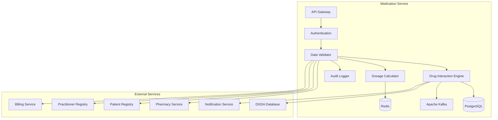

# MS Medication Service

The Medication Service manages medications, prescriptions, drug information, and pharmaceutical operations with comprehensive Bangladesh drug regulatory integration.

## 📋 Service Overview

- **Repository**: [ms-medication-service](https://github.com/zs-his/ms-medication-service)
- **Status**: 🟡 In Progress
- **FHIR Resources**: Medication, MedicationRequest, MedicationStatement, MedicationDispense
- **Primary Database**: PostgreSQL
- **Cache Layer**: Redis
- **Event Streaming**: Apache Kafka

## 🎯 Key Features

### Medication Management
- **Drug Information**: Comprehensive drug database with Bangladesh context
- **Prescription Management**: Electronic prescribing and order management
- **Medication History**: Patient medication tracking and history
- **Drug Interactions**: Clinical decision support for drug interactions
- **Dosage Calculations**: Age and weight-based dosing

### Bangladesh-Specific Features
- **DGDA Integration**: Directorate General of Drug Administration
- **Local Drug Database**: Bangladesh-registered medications
- **Generic Drug Promotion**: Generic name prescribing
- **Price Control**: Government-mandated drug pricing
- **Drug Quality**: Bangladesh drug quality standards

## 🏗️ Architecture



## 📊 Database Schema

### Medication Table
```sql
CREATE TABLE medications (
    id UUID PRIMARY KEY DEFAULT gen_random_uuid(),
    medication_id VARCHAR(50) UNIQUE NOT NULL,
    code JSONB NOT NULL,
    status VARCHAR(20) DEFAULT 'active',
    manufacturer JSONB,
    form JSONB NOT NULL,
    amount JSONB,
    ingredient JSONB,
    batch JSONB,
    expiration_date DATE,
    strength JSONB,
    package_type VARCHAR(50),
    package_quantity INTEGER,
    route JSONB,
    dgda_registration_number VARCHAR(50),
    generic_name VARCHAR(200),
    brand_name VARCHAR(200),
    price DECIMAL(10,2),
    is_controlled BOOLEAN DEFAULT false,
    storage_requirements JSONB,
    contraindications JSONB,
    indications JSONB,
    dosage_form VARCHAR(50),
    therapeutic_class VARCHAR(100),
    atc_code VARCHAR(10),
    created_at TIMESTAMP DEFAULT CURRENT_TIMESTAMP,
    updated_at TIMESTAMP DEFAULT CURRENT_TIMESTAMP,
    metadata JSONB
);
```

### Medication Request Table
```sql
CREATE TABLE medication_requests (
    id UUID PRIMARY KEY DEFAULT gen_random_uuid(),
    request_id VARCHAR(50) UNIQUE NOT NULL,
    patient_id UUID NOT NULL,
    encounter_id UUID REFERENCES encounters(id),
    status VARCHAR(20) NOT NULL DEFAULT 'active',
    status_reason JSONB,
    intent VARCHAR(20) NOT NULL,
    category JSONB,
    priority VARCHAR(20),
    medication_reference UUID REFERENCES medications(id),
    medication_codeable_concept JSONB,
    subject_type VARCHAR(20) DEFAULT 'patient',
    subject_id UUID NOT NULL,
    encounter_reference UUID REFERENCES encounters(id),
    supporting_info JSONB,
    authored_on TIMESTAMP DEFAULT CURRENT_TIMESTAMP,
    requester JSONB,
    performer_type VARCHAR(20),
    performer JSONB,
    recorder JSONB,
    reason_code JSONB,
    reason_reference JSONB,
    course_therapy_type VARCHAR(20),
    dosage_instruction JSONB,
    dispense_request JSONB,
    substitution JSONB,
    prior_prescription UUID,
    detected_issue JSONB,
    event_history JSONB,
    created_at TIMESTAMP DEFAULT CURRENT_TIMESTAMP,
    updated_at TIMESTAMP DEFAULT CURRENT_TIMESTAMP,
    metadata JSONB,
    FOREIGN KEY (patient_id) REFERENCES patients(id)
);
```

### Drug Interaction Table
```sql
CREATE TABLE drug_interactions (
    id UUID PRIMARY KEY DEFAULT gen_random_uuid(),
    medication_a_id UUID REFERENCES medications(id),
    medication_b_id UUID REFERENCES medications(id),
    interaction_type VARCHAR(50) NOT NULL,
    severity VARCHAR(20) NOT NULL,
    description TEXT NOT NULL,
    clinical_management TEXT,
    evidence_level VARCHAR(20),
    onset_type VARCHAR(20),
    duration VARCHAR(50),
    action_required BOOLEAN DEFAULT true,
    created_at TIMESTAMP DEFAULT CURRENT_TIMESTAMP,
    updated_at TIMESTAMP DEFAULT CURRENT_TIMESTAMP
);
```

## 🔌 API Endpoints

### Medication CRUD Operations
```go
// Create new medication
POST /api/medications
{
  "code": {
    "coding": [{
      "system": "http://snomed.info/sct",
      "code": "318851002",
      "display": "Paracetamol 500mg tablet"
    }]
  },
  "status": "active",
  "manufacturer": {
    "display": "Square Pharmaceuticals Ltd."
  },
  "form": {
    "coding": [{
      "system": "http://snomed.info/sct",
      "code": "385055001",
      "display": "Tablet dose form"
    }]
  },
  "amount": {
    "numerator": {
      "value": 500,
      "unit": "mg",
      "system": "http://unitsofmeasure.org",
      "code": "mg"
    }
  },
  "ingredient": [{
    "itemCodeableConcept": {
      "coding": [{
        "system": "http://snomed.info/sct",
        "code": "387458008",
        "display": "Paracetamol"
      }]
    },
    "strength": {
      "numerator": {
        "value": 500,
        "unit": "mg",
        "system": "http://unitsofmeasure.org",
        "code": "mg"
      },
      "denominator": {
        "value": 1,
        "unit": "Tablet",
        "system": "http://unitsofmeasure.org",
        "code": "{Tablet}"
      }
    }
  }],
  "batch": {
    "lotNumber": "PAR-2024-001",
    "expirationDate": "2026-12-31"
  },
  "dgdaRegistrationNumber": "DGDA/REG/2023/1234",
  "genericName": "Paracetamol",
  "brandName": "Paracip",
  "price": 2.50,
  "isControlled": false
}

// Get medication by ID
GET /api/medications/{id}

// Search medications
GET /api/medications?generic-name=Paracetamol&brand-name=Paracip&dgda-registered=true

// Update medication
PUT /api/medications/{id}
```

### Prescription Management
```go
// Create medication request (prescription)
POST /api/medication-requests
{
  "status": "active",
  "intent": "order",
  "category": [{"coding": [{"code": "inpatient"}]}],
  "priority": "routine",
  "medicationReference": {"reference": "Medication/12345"},
  "subject": {"reference": "Patient/67890"},
  "encounter": {"reference": "Encounter/111"},
  "authoredOn": "2026-01-21T10:30:00+06:00",
  "requester": {
    "reference": "Practitioner/222",
    "display": "Dr. John Doe"
  },
  "dosageInstruction": [{
    "sequence": 1,
    "text": "Take 1 tablet every 6 hours as needed for pain",
    "timing": {
      "repeat": {
        "frequency": 1,
        "period": 6,
        "periodUnit": "h"
      }
    },
    "route": {
      "coding": [{
        "system": "http://snomed.info/sct",
        "code": "26643006",
        "display": "Oral route"
      }]
    },
    "doseAndRate": [{
      "type": {
        "coding": [{
          "system": "http://terminology.hl7.org/CodeSystem/dose-rate-type",
          "code": "ordered",
          "display": "Ordered"
        }]
      },
      "doseQuantity": {
        "value": 1,
        "unit": "Tablet",
        "system": "http://unitsofmeasure.org",
        "code": "{Tablet}"
      }
    }]
  }],
  "dispenseRequest": {
    "validityPeriod": {
      "start": "2026-01-21T10:30:00+06:00",
      "end": "2026-02-21T10:30:00+06:00"
    },
    "numberOfRepeatsAllowed": 2,
    "quantity": {
      "value": 20,
      "unit": "Tablet",
      "system": "http://unitsofmeasure.org",
      "code": "{Tablet}"
    }
  }
}

// Get patient prescriptions
GET /api/medication-requests?patient=67890&status=active

// Update prescription status
PUT /api/medication-requests/{id}/status
{
  "status": "completed",
  "statusReason": {
    "coding": [{
      "system": "http://terminology.hl7.org/CodeSystem/medication-request-status-reason",
      "code": "complt",
      "display": "Completed"
    }]
  }
}
```

### Drug Interaction Check
```go
// Check drug interactions
POST /api/medications/interactions/check
{
  "medications": [
    {"medicationId": "12345", "name": "Paracetamol"},
    {"medicationId": "67890", "name": "Warfarin"}
  ],
  "patientId": "111"
}

// Response
{
  "interactions": [
    {
      "medicationA": "Paracetamol",
      "medicationB": "Warfarin", 
      "severity": "moderate",
      "description": "Paracetamol may enhance the anticoagulant effect of warfarin",
      "clinicalManagement": "Monitor INR more frequently when starting or stopping paracetamol",
      "actionRequired": true
    }
  ],
  "totalInteractions": 1,
  "criticalInteractions": 0
}
```

## 🏥 Bangladesh Drug Database

### DGDA Registered Medications
```go
var BangladeshMedications = map[string]MedicationInfo{
    "PAR-001": {
        Code:                "PAR-001",
        GenericName:         "Paracetamol",
        BrandNames:          []string{"Paracip", "Tylenol", "Napa"},
        DGDARegistration:    "DGDA/REG/2023/1234",
        Strength:            "500mg",
        Form:                "Tablet",
        Price:               2.50,
        Manufacturer:        "Square Pharmaceuticals Ltd.",
        TherapeuticClass:    "Analgesic, Antipyretic",
        ATCCode:             "N02BE01",
        Controlled:          false,
    },
    "AMO-001": {
        Code:                "AMO-001",
        GenericName:         "Amoxicillin",
        BrandNames:          []string{"Amoxil", "Mox", "Novamox"},
        DGDARegistration:    "DGDA/REG/2023/2345",
        Strength:            "500mg",
        Form:                "Capsule",
        Price:               8.00,
        Manufacturer:        "Beximco Pharmaceuticals Ltd.",
        TherapeuticClass:    "Antibiotic",
        ATCCode:             "J01CA04",
        Controlled:          false,
        PrescriptionRequired: true,
    },
    "WAR-001": {
        Code:                "WAR-001",
        GenericName:         "Warfarin Sodium",
        BrandNames:          []string{"Coumadin", "Warf"},
        DGDARegistration:    "DGDA/REG/2023/3456",
        Strength:            "5mg",
        Form:                "Tablet",
        Price:               15.00,
        Manufacturer:        "Incepta Pharmaceuticals Ltd.",
        TherapeuticClass:    "Anticoagulant",
        ATCCode:             "B01AA03",
        Controlled:          true,
        PrescriptionRequired: true,
        MonitoringRequired:  true,
    },
}
```

### Generic Drug Promotion
```go
type GenericDrugPolicy struct {
    RequireGenericPrescription bool     `json:"require_generic_prescription"`
    AllowBrandSubstitution     bool     `json:"allow_brand_substitution"`
    GenericFirst               bool     `json:"generic_first"`
    PriceControl               bool     `json:"price_control"`
    EssentialMedicines         []string `json:"essential_medicines"`
}

var BangladeshGenericPolicy = GenericDrugPolicy{
    RequireGenericPrescription: true,
    AllowBrandSubstitution:     true,
    GenericFirst:               true,
    PriceControl:               true,
    EssentialMedicines: []string{
        "Paracetamol",
        "Amoxicillin",
        "Ibuprofen",
        "Omeprazole",
        "Metformin",
        "Amlodipine",
        "Atenolol",
        "Salbutamol",
    },
}
```

## 🔍 Search and Filtering

### Advanced Medication Search
```go
type MedicationSearchCriteria struct {
    GenericName         string  `json:"generic_name"`
    BrandName          string  `json:"brand_name"`
    TherapeuticClass    string  `json:"therapeutic_class"`
    ATCCode            string  `json:"atc_code"`
    DGDARegistered     bool    `json:"dgda_registered"`
    Controlled         bool    `json:"controlled"`
    PrescriptionRequired bool  `json:"prescription_required"`
    PriceMin           float64 `json:"price_min"`
    PriceMax           float64 `json:"price_max"`
    Form               string  `json:"form"`
    Manufacturer       string  `json:"manufacturer"`
}

func (s *MedicationService) SearchMedications(criteria MedicationSearchCriteria) ([]Medication, error) {
    query := s.db.NewSelect().Model(&Medication{}).Where("status = 'active'")
    
    if criteria.GenericName != "" {
        query = query.Where("generic_name ILIKE ?", "%"+criteria.GenericName+"%")
    }
    
    if criteria.BrandName != "" {
        query = query.Where("brand_name ILIKE ?", "%"+criteria.BrandName+"%")
    }
    
    if criteria.TherapeuticClass != "" {
        query = query.Where("therapeutic_class = ?", criteria.TherapeuticClass)
    }
    
    if criteria.DGDARegistered {
        query = query.Where("dgda_registration_number IS NOT NULL")
    }
    
    if criteria.PriceMin > 0 {
        query = query.Where("price >= ?", criteria.PriceMin)
    }
    
    if criteria.PriceMax > 0 {
        query = query.Where("price <= ?", criteria.PriceMax)
    }
    
    var medications []Medication
    err := query.Scan(ctx, &medications)
    return medications, err
}
```

## 📈 Performance Optimization

### Caching Strategy
```go
// Cache medication data for 2 hours
func (s *MedicationService) GetMedication(id string) (*Medication, error) {
    cacheKey := fmt.Sprintf("medication:%s", id)
    
    // Try cache first
    if cached, err := s.cache.Get(cacheKey); err == nil {
        return cached.(*Medication), nil
    }
    
    // Get from database
    medication, err := s.repository.GetByID(id)
    if err != nil {
        return nil, err
    }
    
    // Cache for 2 hours
    s.cache.Set(cacheKey, medication, 2*time.Hour)
    return medication, nil
}

// Cache drug interactions for 1 hour
func (s *MedicationService) GetDrugInteractions(medA, medB string) ([]DrugInteraction, error) {
    cacheKey := fmt.Sprintf("interaction:%s:%s", medA, medB)
    
    if cached, err := s.cache.Get(cacheKey); err == nil {
        return cached.([]DrugInteraction), nil
    }
    
    interactions, err := s.repository.GetInteractions(medA, medB)
    if err != nil {
        return nil, err
    }
    
    s.cache.Set(cacheKey, interactions, time.Hour)
    return interactions, nil
}
```

### Database Indexing
```sql
-- Performance indexes
CREATE INDEX idx_medications_generic ON medications(generic_name);
CREATE INDEX idx_medications_brand ON medications(brand_name);
CREATE INDEX idx_medications_class ON medications(therapeutic_class);
CREATE INDEX idx_medications_atc ON medications(atc_code);
CREATE INDEX idx_medications_dgda ON medications(dgda_registration_number);
CREATE INDEX idx_medications_controlled ON medications(is_controlled);
CREATE INDEX idx_med_requests_patient ON medication_requests(patient_id);
CREATE INDEX idx_med_requests_status ON medication_requests(status);
CREATE INDEX idx_med_requests_encounter ON medication_requests(encounter_reference);
CREATE INDEX idx_interactions_medications ON drug_interactions(medication_a_id, medication_b_id);
```

## 🚨 Drug Interaction Engine

### Interaction Detection
```go
type InteractionResult struct {
    MedicationA        string  `json:"medication_a"`
    MedicationB        string  `json:"medication_b"`
    InteractionType    string  `json:"interaction_type"`
    Severity           string  `json:"severity"`
    Description        string  `json:"description"`
    ClinicalManagement string  `json:"clinical_management"`
    ActionRequired     bool    `json:"action_required"`
    EvidenceLevel      string  `json:"evidence_level"`
}

func (s *MedicationService) CheckDrugInteractions(medicationIDs []string, patientID string) ([]InteractionResult, error) {
    var interactions []InteractionResult
    
    // Check all pairs
    for i := 0; i < len(medicationIDs); i++ {
        for j := i + 1; j < len(medicationIDs); j++ {
            medA := medicationIDs[i]
            medB := medicationIDs[j]
            
            // Get interactions from database
            dbInteractions, err := s.repository.GetInteractions(medA, medB)
            if err != nil {
                continue
            }
            
            // Convert to result format
            for _, interaction := range dbInteractions {
                result := InteractionResult{
                    MedicationA:        s.getMedicationName(medA),
                    MedicationB:        s.getMedicationName(medB),
                    InteractionType:    interaction.InteractionType,
                    Severity:           interaction.Severity,
                    Description:        interaction.Description,
                    ClinicalManagement: interaction.ClinicalManagement,
                    ActionRequired:     interaction.ActionRequired,
                    EvidenceLevel:      interaction.EvidenceLevel,
                }
                interactions = append(interactions, result)
            }
        }
    }
    
    // Check patient-specific interactions (allergies, conditions)
    patientInteractions := s.checkPatientSpecificInteractions(medicationIDs, patientID)
    interactions = append(interactions, patientInteractions...)
    
    return interactions, nil
}

func (s *MedicationService) checkPatientSpecificInteractions(medicationIDs []string, patientID string) []InteractionResult {
    var interactions []InteractionResult
    
    // Get patient allergies
    allergies, err := s.getAllergyService.GetPatientAllergies(patientID)
    if err != nil {
        return interactions
    }
    
    // Check for allergic reactions
    for _, medID := range medicationIDs {
        medication, err := s.repository.GetByID(medID)
        if err != nil {
            continue
        }
        
        for _, allergy := range allergies {
            if s.isAllergicReaction(medication, allergy) {
                result := InteractionResult{
                    MedicationA:        medication.GenericName,
                    MedicationB:        allergy.Substance,
                    InteractionType:    "allergy",
                    Severity:           "severe",
                    Description:        "Patient has known allergy to this medication",
                    ClinicalManagement: "Do not prescribe - patient allergic",
                    ActionRequired:     true,
                    EvidenceLevel:      "patient_record",
                }
                interactions = append(interactions, result)
            }
        }
    }
    
    return interactions
}
```

## 💊 Dosage Calculator

### Pediatric and Adult Dosing
```go
type DosageCalculation struct {
    PatientAge       int     `json:"patient_age"`
    PatientWeight    float64 `json:"patient_weight"`
    MedicationID     string  `json:"medication_id"`
    Indication       string  `json:"indication"`
    CalculatedDose   float64 `json:"calculated_dose"`
    DoseUnit         string  `json:"dose_unit"`
    Frequency        string  `json:"frequency"`
    MaximumDose      float64 `json:"maximum_dose"`
    Duration         string  `json:"duration"`
    Instructions     string  `json:"instructions"`
}

func (s *MedicationService) CalculateDosage(patientID, medicationID, indication string) (*DosageCalculation, error) {
    // Get patient information
    patient, err := s.patientService.GetPatient(patientID)
    if err != nil {
        return nil, err
    }
    
    // Get medication information
    medication, err := s.repository.GetByID(medicationID)
    if err != nil {
        return nil, err
    }
    
    // Calculate based on weight
    weight := s.getPatientWeight(patient)
    age := s.calculateAge(patient.BirthDate)
    
    var dose float64
    var unit string
    var frequency string
    
    // Weight-based dosing for pediatric
    if age < 12 {
        dose = s.calculatePediatricDose(medication, weight, indication)
        unit = "mg/kg"
        frequency = "6 hourly"
    } else {
        dose = s.calculateAdultDose(medication, indication)
        unit = "mg"
        frequency = "8 hourly"
    }
    
    return &DosageCalculation{
        PatientAge:     age,
        PatientWeight:  weight,
        MedicationID:   medicationID,
        Indication:     indication,
        CalculatedDose: dose,
        DoseUnit:       unit,
        Frequency:      frequency,
        MaximumDose:    s.getMaximumDose(medication, age),
        Duration:       "5-7 days",
        Instructions:   s.generateDosageInstructions(medication, dose, frequency),
    }, nil
}

func (s *MedicationService) calculatePediatricDose(medication Medication, weight float64, indication string) float64 {
    // Example: Paracetamol 10-15 mg/kg/dose
    if medication.GenericName == "Paracetamol" {
        return weight * 12.5 // Average of 10-15 mg/kg
    }
    
    // Example: Amoxicillin 25-50 mg/kg/dose
    if medication.GenericName == "Amoxicillin" {
        return weight * 37.5 // Average of 25-50 mg/kg
    }
    
    return 0 // Default case
}
```

## 🔒 Security Features

### Access Control
```go
func (s *MedicationService) CanAccessMedication(userID, medicationID string, action string) bool {
    // Check user permissions
    permissions := s.authService.GetUserPermissions(userID)
    
    switch action {
    case "read":
        return permissions.Contains("medication.read")
    case "write":
        return permissions.Contains("medication.write") || 
               s.isPrescriber(userID)
    case "prescribe":
        return permissions.Contains("medication.prescribe") || 
               s.isLicensedPrescriber(userID)
    case "dispense":
        return permissions.Contains("medication.dispense") || 
               s.isPharmacist(userID)
    default:
        return false
    }
}

func (s *MedicationService) isLicensedPrescriber(userID string) bool {
    practitioner, err := s.practitionerService.GetPractitionerByUser(userID)
    if err != nil {
        return false
    }
    
    // Check if practitioner has prescribing license
    return practitioner.Qualification != nil && 
           s.hasValidPrescribingLicense(practitioner.Qualification)
}
```

### Controlled Substance Monitoring
```go
func (s *MedicationService) checkControlledSubstanceAccess(userID, medicationID string) error {
    medication, err := s.repository.GetByID(medicationID)
    if err != nil {
        return err
    }
    
    if !medication.IsControlled {
        return nil
    }
    
    // Check if user has controlled substance registration
    hasRegistration, err := s.authService.HasControlledSubstanceRegistration(userID)
    if err != nil {
        return err
    }
    
    if !hasRegistration {
        return errors.New("user not authorized to prescribe controlled substances")
    }
    
    // Check for prescription limits
    dailyLimit, err := s.checkDailyPrescriptionLimit(userID, medicationID)
    if err != nil {
        return err
    }
    
    if dailyLimit.Exceeded {
        return fmt.Errorf("daily prescription limit exceeded for %s", medication.GenericName)
    }
    
    return nil
}
```

## 📊 Monitoring and Metrics

### Health Checks
```go
func (s *MedicationService) HealthCheck() map[string]interface{} {
    return map[string]interface{}{
        "database":         s.checkDatabase(),
        "cache":            s.checkCache(),
        "kafka":            s.checkKafka(),
        "dgda_service":     s.checkDGDAIntegration(),
        "interaction_engine": s.checkInteractionEngine(),
        "dosage_calculator": s.checkDosageCalculator(),
        "patient_service":  s.checkPatientService(),
        "timestamp":        time.Now(),
    }
}
```

### Performance Metrics
```go
// Prometheus metrics
var (
    medicationRequestsTotal = prometheus.NewCounterVec(
        prometheus.CounterOpts{
            Name: "medication_requests_total",
            Help: "Total number of medication requests",
        },
        []string{"method", "endpoint", "status"},
    )
    
    interactionChecksTotal = prometheus.NewCounterVec(
        prometheus.CounterOpts{
            Name: "interaction_checks_total",
            Help: "Total number of drug interaction checks",
        },
        []string{"result", "severity"},
    )
    
    dosageCalculationsTotal = prometheus.NewCounterVec(
        prometheus.CounterOpts{
            Name: "dosage_calculations_total",
            Help: "Total number of dosage calculations",
        },
        []string{"patient_age_group", "medication_type"},
    )
)
```

## 🧪 Testing

### Unit Tests
```go
func TestMedicationService_CreateMedicationRequest(t *testing.T) {
    service := NewMedicationService(mockRepo, mockCache, mockInteraction)
    request := &MedicationRequest{
        Status:          "active",
        Intent:          "order",
        MedicationReference: "medication-123",
        PatientID:        "patient-456",
        EncounterReference: "encounter-789",
        AuthoredOn:       time.Now(),
        Requester:        PractitionerReference{Reference: "Practitioner/111"},
        DosageInstruction: []DosageInstruction{
            {
                Text: "Take 1 tablet every 6 hours",
                Route: Code{Coding: []Coding{{Code: "26643006", Display: "Oral route"}}},
                DoseAndRate: []DoseAndRate{{
                    DoseQuantity: Quantity{Value: 1, Unit: "Tablet"},
                }},
            },
        },
    }
    
    result, err := service.CreateMedicationRequest(request)
    
    assert.NoError(t, err)
    assert.NotNil(t, result)
    assert.NotEmpty(t, result.ID)
    assert.Equal(t, "active", result.Status)
    assert.Equal(t, "patient-456", result.PatientID)
}
```

## 🚀 Deployment

### Docker Configuration
```dockerfile
FROM golang:1.25-alpine AS builder

WORKDIR /app
COPY go.mod go.sum ./
RUN go mod download

COPY . .
RUN CGO_ENABLED=0 GOOS=linux go build -o main cmd/server/main.go

FROM alpine:latest
RUN apk --no-cache add ca-certificates
WORKDIR /root/
COPY --from=builder /app/main .
EXPOSE 8080
CMD ["./main"]
```

### Kubernetes Deployment
```yaml
apiVersion: apps/v1
kind: Deployment
metadata:
  name: ms-medication-service
spec:
  replicas: 3
  selector:
    matchLabels:
      app: ms-medication-service
  template:
    metadata:
      labels:
        app: ms-medication-service
    spec:
      containers:
      - name: ms-medication-service
        image: zarish-his/ms-medication-service:latest
        ports:
        - containerPort: 8080
        env:
        - name: DB_HOST
          value: "postgresql-service"
        - name: REDIS_HOST
          value: "redis-service"
        - name: KAFKA_BROKERS
          value: "kafka-service:9092"
        - name: DGDA_SERVICE_URL
          value: "https://dgda.gov.bd/api"
```

## 🔗 Related Resources

- **Frontend Integration**: [ESM Pharmacy](../frontend/esm-pharmacy.md)
- **FHIR Implementation**: [FHIR Medication Profile](../fhir/medication-profile.md)
- **API Documentation**: [Medication API Reference](../api-reference/rest-apis.md)

---

*Last updated: 2026-01-21*
