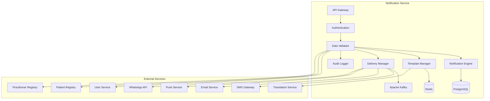

# MS Notification Service

The Notification Service manages multi-channel notifications, alerts, reminders, and communication workflows with comprehensive Bangladesh healthcare communication standards.

## 📋 Service Overview

- **Repository**: [ms-notification-service](https://github.com/zs-his/ms-notification-service)
- **Status**: 🟡 In Progress
- **FHIR Resources**: Communication, Appointment, Task
- **Primary Database**: PostgreSQL
- **Cache Layer**: Redis
- **Event Streaming**: Apache Kafka

## 🎯 Key Features

### Notification Management
- **Multi-Channel Support**: SMS, Email, Push notifications, WhatsApp
- **Template Management**: Dynamic notification templates
- **Delivery Tracking**: Real-time delivery status monitoring
- **Scheduling**: Advanced notification scheduling
- **Personalization**: Context-aware personalized messages

### Bangladesh-Specific Features
- **Local Language Support**: Bengali and English notifications
- **Bangladesh SMS Gateways**: Local SMS provider integration
- **Regional Time Zones**: Bangladesh time zone handling
- **Cultural Adaptation**: Bangladesh-appropriate messaging
- **Emergency Broadcasting**: Bangladesh emergency alert systems

## 🏗️ Architecture



## 📊 Database Schema

### Notification Table
```sql
CREATE TABLE notifications (
    id UUID PRIMARY KEY DEFAULT gen_random_uuid(),
    notification_id VARCHAR(50) UNIQUE NOT NULL,
    recipient_type VARCHAR(20) NOT NULL,
    recipient_id UUID NOT NULL,
    sender_id UUID REFERENCES users(id),
    facility_id UUID REFERENCES organizations(id),
    notification_type VARCHAR(50) NOT NULL,
    channel VARCHAR(20) NOT NULL,
    priority VARCHAR(20) DEFAULT 'normal',
    subject VARCHAR(255),
    content TEXT NOT NULL,
    template_id UUID REFERENCES notification_templates(id),
    template_variables JSONB,
    scheduled_at TIMESTAMP,
    sent_at TIMESTAMP,
    delivery_status VARCHAR(20) DEFAULT 'pending',
    delivery_attempts INTEGER DEFAULT 0,
    last_attempt_at TIMESTAMP,
    delivered_at TIMESTAMP,
    read_at TIMESTAMP,
    error_message TEXT,
    metadata JSONB,
    created_at TIMESTAMP DEFAULT CURRENT_TIMESTAMP,
    updated_at TIMESTAMP DEFAULT CURRENT_TIMESTAMP
);
```

### Notification Template Table
```sql
CREATE TABLE notification_templates (
    id UUID PRIMARY KEY DEFAULT gen_random_uuid(),
    template_id VARCHAR(50) UNIQUE NOT NULL,
    template_name VARCHAR(100) NOT NULL,
    template_type VARCHAR(50) NOT NULL,
    channel VARCHAR(20) NOT NULL,
    language VARCHAR(10) DEFAULT 'en',
    subject_template TEXT,
    content_template TEXT NOT NULL,
    variables JSONB,
    default_priority VARCHAR(20) DEFAULT 'normal',
    is_system_template BOOLEAN DEFAULT false,
    is_active BOOLEAN DEFAULT true,
    created_by UUID REFERENCES users(id),
    created_at TIMESTAMP DEFAULT CURRENT_TIMESTAMP,
    updated_at TIMESTAMP DEFAULT CURRENT_TIMESTAMP,
    metadata JSONB
);
```

### Delivery Log Table
```sql
CREATE TABLE delivery_logs (
    id UUID PRIMARY KEY DEFAULT gen_random_uuid(),
    log_id VARCHAR(50) UNIQUE NOT NULL,
    notification_id UUID REFERENCES notifications(id),
    channel VARCHAR(20) NOT NULL,
    gateway_provider VARCHAR(50),
    gateway_message_id VARCHAR(100),
    delivery_status VARCHAR(20) NOT NULL,
    status_code VARCHAR(20),
    status_message TEXT,
    attempt_number INTEGER NOT NULL,
    attempted_at TIMESTAMP NOT NULL,
    response_data JSONB,
    error_details JSONB,
    created_at TIMESTAMP DEFAULT CURRENT_TIMESTAMP
);
```

## 🔌 API Endpoints

### Notification Management
```go
// Send notification
POST /api/notifications/send
{
  "recipientType": "patient",
  "recipientId": "patient-123",
  "senderId": "user-456",
  "facilityId": "facility-789",
  "notificationType": "appointment_reminder",
  "channel": "sms",
  "priority": "normal",
  "subject": "Appointment Reminder",
  "content": "Your appointment is scheduled for tomorrow at 10:00 AM",
  "templateId": "template-001",
  "templateVariables": {
    "patientName": "John Doe",
    "appointmentDate": "2026-01-22",
    "appointmentTime": "10:00 AM",
    "doctorName": "Dr. Smith",
    "facilityName": "ZARISH Hospital"
  },
  "scheduledAt": "2026-01-21T18:00:00+06:00"
}

// Get notification by ID
GET /api/notifications/{id}

// Search notifications
GET /api/notifications?recipient=patient-123&type=appointment_reminder&status=delivered

// Send bulk notifications
POST /api/notifications/bulk
{
  "recipients": [
    {
      "recipientType": "patient",
      "recipientId": "patient-123"
    },
    {
      "recipientType": "patient", 
      "recipientId": "patient-124"
    }
  ],
  "notificationType": "health_camp_announcement",
  "channel": "sms",
  "content": "Free health camp this Saturday at ZARISH Hospital",
  "scheduledAt": "2026-01-21T09:00:00+06:00"
}
```

### Template Management
```go
// Create notification template
POST /api/notifications/templates
{
  "templateName": "Appointment Reminder",
  "templateType": "appointment_reminder",
  "channel": "sms",
  "language": "en",
  "subjectTemplate": "Appointment Reminder - {{facilityName}}",
  "contentTemplate": "Dear {{patientName}}, your appointment with {{doctorName}} is scheduled for {{appointmentDate}} at {{appointmentTime}}. Please arrive 15 minutes early. {{facilityName}}",
  "variables": [
    "patientName",
    "appointmentDate", 
    "appointmentTime",
    "doctorName",
    "facilityName"
  ],
  "defaultPriority": "normal"
}

// Get template by ID
GET /api/notifications/templates/{id}

// Search templates
GET /api/notifications/templates?type=appointment_reminder&channel=sms&language=en

// Preview template
POST /api/notifications/templates/{id}/preview
{
  "variables": {
    "patientName": "John Doe",
    "appointmentDate": "2026-01-22",
    "appointmentTime": "10:00 AM",
    "doctorName": "Dr. Smith",
    "facilityName": "ZARISH Hospital"
  }
}
```

### Delivery Management
```go
// Get delivery status
GET /api/notifications/{id}/delivery-status

// Get delivery logs
GET /api/notifications/{id}/delivery-logs

// Retry failed notification
POST /api/notifications/{id}/retry

// Cancel scheduled notification
POST /api/notifications/{id}/cancel

// Get notification statistics
GET /api/notifications/statistics?facility=789&date=2026-01-21
```

## 🏥 Bangladesh Notification Features

### SMS Gateway Integration
```go
type BangladeshSMSGateway struct {
    GatewayName     string    `json:"gateway_name"`
    GatewayURL      string    `json:"gateway_url"`
    APIKey          string    `json:"api_key"`
    APISecret       string    `json:"api_secret"`
    SenderID        string    `json:"sender_id"`
    MaxLength       int       `json:"max_length"`
    SupportsUnicode bool      `json:"supports_unicode"`
    DeliveryReport  bool      `json:"delivery_report"`
    RateLimit       int       `json:"rate_limit_per_second"`
    PopularInBD     bool      `json:"popular_in_bd"`
}

var BangladeshSMSGateways = map[string]BangladeshSMSGateway{
    "GRAMEENPHONE": {
        GatewayName:     "Grameenphone",
        GatewayURL:      "https://gpgpsms.com/api",
        APIKey:          "gp_api_key",
        APISecret:       "gp_api_secret",
        SenderID:        "ZARISH",
        MaxLength:       160,
        SupportsUnicode: true,
        DeliveryReport:  true,
        RateLimit:       10,
        PopularInBD:     true,
    },
    "ROBI": {
        GatewayName:     "Robi Axiata",
        GatewayURL:      "https://sms.robi.com/api",
        APIKey:          "robi_api_key",
        APISecret:       "robi_api_secret",
        SenderID:        "ZARISHH",
        MaxLength:       160,
        SupportsUnicode: true,
        DeliveryReport:  true,
        RateLimit:       8,
        PopularInBD:     true,
    },
    "BANGLALINK": {
        GatewayName:     "Banglalink",
        GatewayURL:      "https://sms.banglalink.com/api",
        APIKey:          "bl_api_key",
        APISecret:       "bl_api_secret",
        SenderID:        "ZARISH",
        MaxLength:       160,
        SupportsUnicode: true,
        DeliveryReport:  true,
        RateLimit:       12,
        PopularInBD:     true,
    },
    "TELETALK": {
        GatewayName:     "Teletalk",
        GatewayURL:      "https://sms.teletalk.com/api",
        APIKey:          "tt_api_key",
        APISecret:       "tt_api_secret",
        SenderID:        "ZARISH",
        MaxLength:       160,
        SupportsUnicode: false,
        DeliveryReport:  false,
        RateLimit:       5,
        PopularInBD:     false,
    },
}

func (s *NotificationService) SendSMS(notification *Notification) error {
    // Get recipient phone number
    phoneNumber, err := s.getRecipientPhoneNumber(notification.RecipientType, notification.RecipientID)
    if err != nil {
        return fmt.Errorf("failed to get phone number: %w", err)
    }
    
    // Select gateway based on provider
    gateway, err := s.selectSMSGateway(phoneNumber)
    if err != nil {
        return fmt.Errorf("failed to select SMS gateway: %w", err)
    }
    
    // Format message for Bangladesh
    message := s.formatMessageForBangladesh(notification.Content, gateway.SupportsUnicode)
    
    // Send SMS
    response, err := s.sendViaGateway(gateway, phoneNumber, message)
    if err != nil {
        return fmt.Errorf("failed to send SMS: %w", err)
    }
    
    // Log delivery attempt
    err = s.logDeliveryAttempt(notification.ID, "sms", gateway.GatewayName, response)
    if err != nil {
        log.Printf("Failed to log delivery attempt: %v", err)
    }
    
    return nil
}

func (s *NotificationService) formatMessageForBangladesh(content string, supportsUnicode bool) string {
    // Check if content contains Bengali characters
    hasBengali := regexp.MustCompile(`[\u0980-\u09FF]`).MatchString(content)
    
    if hasBengali && !supportsUnicode {
        // Transliterate to English if gateway doesn't support Unicode
        return s.transliterateToEnglish(content)
    }
    
    // Add Bangladesh-specific formatting
    return s.addBangladeshFormatting(content)
}
```

### Multilingual Support
```go
type TranslationService struct {
    SupportedLanguages []string
    DefaultLanguage    string
    TranslationCache    map[string]map[string]string
}

var BangladeshLanguages = map[string]LanguageInfo{
    "en": {
        Code:        "en",
        Name:        "English",
        NativeName:  "English",
        IsRTL:       false,
        DateFormat:  "YYYY-MM-DD",
        TimeFormat:  "hh:mm A",
        NumberFormat: "1,234.56",
        PopularInBD: true,
    },
    "bn": {
        Code:        "bn",
        Name:        "Bengali",
        NativeName:  "বাংলা",
        IsRTL:       false,
        DateFormat:  "DD/MM/YYYY",
        TimeFormat:  "hh:mm A",
        NumberFormat: "১,২৩৪.৫৬",
        PopularInBD: true,
    },
}

type LanguageInfo struct {
    Code         string `json:"code"`
    Name         string `json:"name"`
    NativeName   string `json:"native_name"`
    IsRTL        bool   `json:"is_rtl"`
    DateFormat   string `json:"date_format"`
    TimeFormat   string `json:"time_format"`
    NumberFormat string `json:"number_format"`
    PopularInBD  bool   `json:"popular_in_bd"`
}

func (s *NotificationService) TranslateMessage(message string, targetLanguage string, variables map[string]string) (string, error) {
    // Get recipient's preferred language
    language := s.getRecipientLanguage(targetLanguage)
    
    // Translate message
    translatedMessage, err := s.translationService.Translate(message, "en", language, variables)
    if err != nil {
        return message, err // Return original message if translation fails
    }
    
    // Apply language-specific formatting
    formattedMessage := s.applyLanguageFormatting(translatedMessage, language)
    
    return formattedMessage, nil
}

func (s *NotificationService) applyLanguageFormatting(message string, language string) string {
    langInfo, exists := BangladeshLanguages[language]
    if !exists {
        return message
    }
    
    // Apply date/time formatting
    message = s.formatDateTimeForLanguage(message, langInfo)
    
    // Apply number formatting
    message = s.formatNumbersForLanguage(message, langInfo)
    
    // Apply text direction if RTL
    if langInfo.IsRTL {
        message = fmt.Sprintf("\u200E%s\u200E", message) // Add LTR marks
    }
    
    return message
}

var CommonTranslations = map[string]map[string]string{
    "appointment_reminder": {
        "en": "Dear {{patientName}}, your appointment with {{doctorName}} is scheduled for {{appointmentDate}} at {{appointmentTime}}. Please arrive 15 minutes early. {{facilityName}}",
        "bn": "প্রিয় {{patientName}}, আপনার {{doctorName}} এর সাথে অ্যাপয়েন্টমেন্ট {{appointmentDate}} তারিখে {{appointmentTime}} এ নির্ধারিত হয়েছে। অনুগ্রহ করে ১৫ মিনিট আগে আসুন। {{facilityName}}",
    },
    "medicine_reminder": {
        "en": "Reminder: Please take your {{medicineName}} ({{dosage}}) now. {{instructions}}",
        "bn": "অনুস্মরণ: অনুগ্রহ করে আপনার {{medicineName}} ({{dosage}}) এখনই সেবন করুন। {{instructions}}",
    },
    "test_results": {
        "en": "Your test results are ready. Please login to the patient portal or visit the hospital to collect your reports. {{facilityName}}",
        "bn": "আপনার টেস্টের ফলাফল প্রস্তুত হয়েছে। অনুগ্রহ করে পেশেন্ট পোর্টালে লগইন করুন বা আপনার রিপোর্ট সংগ্রহ করতে হাসপাতালে ভিজিট করুন। {{facilityName}}",
    },
}
```

## 🔍 Search and Filtering

### Advanced Notification Search
```go
type NotificationSearchCriteria struct {
    FacilityID      string    `json:"facility_id"`
    RecipientType   string    `json:"recipient_type"`
    RecipientID     string    `json:"recipient_id"`
    NotificationType string   `json:"notification_type"`
    Channel         string    `json:"channel"`
    Priority        string    `json:"priority"`
    Status          string    `json:"status"`
    DateFrom        time.Time `json:"date_from"`
    DateTo          time.Time `json:"date_to"`
    TemplateID      string    `json:"template_id"`
    SenderID        string    `json:"sender_id"`
}

func (s *NotificationService) SearchNotifications(criteria NotificationSearchCriteria) ([]Notification, error) {
    query := s.db.NewSelect().Model(&Notification{})
    
    if criteria.FacilityID != "" {
        query = query.Where("facility_id = ?", criteria.FacilityID)
    }
    
    if criteria.RecipientType != "" {
        query = query.Where("recipient_type = ?", criteria.RecipientType)
    }
    
    if criteria.RecipientID != "" {
        query = query.Where("recipient_id = ?", criteria.RecipientID)
    }
    
    if criteria.NotificationType != "" {
        query = query.Where("notification_type = ?", criteria.NotificationType)
    }
    
    if criteria.Channel != "" {
        query = query.Where("channel = ?", criteria.Channel)
    }
    
    if criteria.Status != "" {
        query = query.Where("delivery_status = ?", criteria.Status)
    }
    
    if !criteria.DateFrom.IsZero() {
        query = query.Where("created_at >= ?", criteria.DateFrom)
    }
    
    if !criteria.DateTo.IsZero() {
        query = query.Where("created_at <= ?", criteria.DateTo)
    }
    
    var notifications []Notification
    err := query.Scan(ctx, &notifications)
    return notifications, err
}
```

## 📈 Performance Optimization

### Caching Strategy
```go
// Cache notification templates for 2 hours
func (s *NotificationService) GetNotificationTemplate(templateID string) (*NotificationTemplate, error) {
    cacheKey := fmt.Sprintf("notification_template:%s", templateID)
    
    if cached, err := s.cache.Get(cacheKey); err == nil {
        return cached.(*NotificationTemplate), nil
    }
    
    template, err := s.repository.GetTemplate(templateID)
    if err != nil {
        return nil, err
    }
    
    s.cache.Set(cacheKey, template, 2*time.Hour)
    return template, nil
}

// Cache recipient contact information for 30 minutes
func (s *NotificationService) GetRecipientContactInfo(recipientType, recipientID string) (*ContactInfo, error) {
    cacheKey := fmt.Sprintf("contact_info:%s:%s", recipientType, recipientID)
    
    if cached, err := s.cache.Get(cacheKey); err == nil {
        return cached.(*ContactInfo), nil
    }
    
    contactInfo, err := s.getContactInfoFromService(recipientType, recipientID)
    if err != nil {
        return nil, err
    }
    
    s.cache.Set(cacheKey, contactInfo, 30*time.Minute)
    return contactInfo, nil
}
```

### Database Indexing
```sql
-- Performance indexes
CREATE INDEX idx_notifications_recipient ON notifications(recipient_type, recipient_id);
CREATE INDEX idx_notifications_facility ON notifications(facility_id);
CREATE INDEX idx_notifications_type ON notifications(notification_type);
CREATE INDEX idx_notifications_channel ON notifications(channel);
CREATE INDEX idx_notifications_status ON notifications(delivery_status);
CREATE INDEX idx_notifications_priority ON notifications(priority);
CREATE INDEX idx_notifications_scheduled ON notifications(scheduled_at);
CREATE INDEX idx_notifications_created ON notifications(created_at);
CREATE INDEX idx_templates_type ON notification_templates(template_type);
CREATE INDEX idx_templates_channel ON notification_templates(channel);
CREATE INDEX idx_templates_language ON notification_templates(language);
CREATE INDEX idx_delivery_logs_notification ON delivery_logs(notification_id);
CREATE INDEX idx_delivery_logs_status ON delivery_logs(delivery_status);
CREATE INDEX idx_delivery_logs_attempted ON delivery_logs(attempted_at);
```

## 📨 Notification Engine

### Multi-Channel Delivery
```go
type NotificationEngine struct {
    Channels        map[string]NotificationChannel
    RetryPolicy     RetryPolicy
    RateLimiters    map[string]*RateLimiter
    QueueManager    *QueueManager
}

type NotificationChannel interface {
    Send(notification *Notification) error
    GetDeliveryStatus(messageID string) (*DeliveryStatus, error)
    GetChannelType() string
    IsAvailable() bool
}

func (s *NotificationService) ProcessNotification(notification *Notification) error {
    // Validate notification
    err := s.validateNotification(notification)
    if err != nil {
        return fmt.Errorf("notification validation failed: %w", err)
    }
    
    // Process template if specified
    if notification.TemplateID != "" {
        err = s.processTemplate(notification)
        if err != nil {
            return fmt.Errorf("template processing failed: %w", err)
        }
    }
    
    // Translate if needed
    if notification.Language != "en" {
        notification.Content, err = s.TranslateMessage(notification.Content, notification.Language, notification.TemplateVariables)
        if err != nil {
            log.Printf("Translation failed: %v", err)
        }
    }
    
    // Get channel handler
    channel, err := s.getChannelHandler(notification.Channel)
    if err != nil {
        return fmt.Errorf("channel handler not found: %w", err)
    }
    
    // Check rate limits
    err = s.checkRateLimits(notification)
    if err != nil {
        return fmt.Errorf("rate limit exceeded: %w", err)
    }
    
    // Send notification
    err = channel.Send(notification)
    if err != nil {
        // Schedule retry if applicable
        if s.shouldRetry(notification) {
            return s.scheduleRetry(notification)
        }
        return fmt.Errorf("notification delivery failed: %w", err)
    }
    
    // Update status
    notification.DeliveryStatus = "sent"
    notification.SentAt = time.Now()
    err = s.repository.UpdateNotification(notification)
    if err != nil {
        log.Printf("Failed to update notification status: %v", err)
    }
    
    return nil
}

func (s *NotificationService) processTemplate(notification *Notification) error {
    template, err := s.GetNotificationTemplate(notification.TemplateID)
    if err != nil {
        return err
    }
    
    // Process subject template
    if template.SubjectTemplate != "" {
        notification.Subject, err = s.renderTemplate(template.SubjectTemplate, notification.TemplateVariables)
        if err != nil {
            return fmt.Errorf("failed to render subject template: %w", err)
        }
    }
    
    // Process content template
    notification.Content, err = s.renderTemplate(template.ContentTemplate, notification.TemplateVariables)
    if err != nil {
        return fmt.Errorf("failed to render content template: %w", err)
    }
    
    return nil
}

func (s *NotificationService) renderTemplate(template string, variables map[string]string) (string, error) {
    result := template
    
    for key, value := range variables {
        placeholder := fmt.Sprintf("{{%s}}", key)
        result = strings.ReplaceAll(result, placeholder, value)
    }
    
    return result, nil
}
```

## 📱 Channel Implementations

### SMS Channel
```go
type SMSChannel struct {
    Gateways       map[string]SMSGateway
    DefaultGateway string
    MaxRetries     int
    RetryDelay     time.Duration
}

func (s *SMSChannel) Send(notification *Notification) error {
    // Get recipient phone number
    phoneNumber, err := s.getPhoneNumber(notification.RecipientType, notification.RecipientID)
    if err != nil {
        return fmt.Errorf("failed to get phone number: %w", err)
    }
    
    // Select best gateway
    gateway, err := s.selectGateway(phoneNumber)
    if err != nil {
        return fmt.Errorf("failed to select gateway: %w", err)
    }
    
    // Validate phone number
    if !s.isValidBangladeshPhoneNumber(phoneNumber) {
        return fmt.Errorf("invalid Bangladesh phone number: %s", phoneNumber)
    }
    
    // Format message
    message := s.formatSMSMessage(notification.Content)
    
    // Send SMS
    response, err := gateway.Send(phoneNumber, message)
    if err != nil {
        return fmt.Errorf("SMS send failed: %w", err)
    }
    
    // Store gateway message ID for tracking
    notification.GatewayMessageID = response.MessageID
    
    return nil
}

func (s *SMSChannel) isValidBangladeshPhoneNumber(phoneNumber string) bool {
    // Bangladesh phone number formats:
    // +8801XXXXXXXXX (international format)
    // 01XXXXXXXXX (local format)
    patterns := []string{
        `^\+8801[3-9]\d{8}$`,
        `^01[3-9]\d{8}$`,
    }
    
    for _, pattern := range patterns {
        if regexp.MustCompile(pattern).MatchString(phoneNumber) {
            return true
        }
    }
    
    return false
}

func (s *SMSChannel) formatSMSMessage(content string) string {
    // Remove HTML tags
    content = regexp.MustCompile(`<[^>]*>`).ReplaceAllString(content, "")
    
    // Limit to SMS length
    if len(content) > 160 {
        content = content[:157] + "..."
    }
    
    // Add Bangladesh-specific formatting
    content = strings.ReplaceAll(content, "$", "BDT ")
    
    return content
}
```

### Email Channel
```go
type EmailChannel struct {
    SMTPConfig     SMTPConfig
    TemplatesPath  string
    MaxRetries     int
    RetryDelay     time.Duration
}

func (s *EmailChannel) Send(notification *Notification) error {
    // Get recipient email
    email, err := s.getEmailAddress(notification.RecipientType, notification.RecipientID)
    if err != nil {
        return fmt.Errorf("failed to get email address: %w", err)
    }
    
    // Create email message
    msg := &Message{
        To:      []string{email},
        Subject: notification.Subject,
        Body:    notification.Content,
        IsHTML:  s.isHTMLContent(notification.Content),
    }
    
    // Send email
    err = s.sendEmail(msg)
    if err != nil {
        return fmt.Errorf("email send failed: %w", err)
    }
    
    return nil
}

func (s *EmailChannel) sendEmail(msg *Message) error {
    // Connect to SMTP server
    conn, err := s.connectSMTP()
    if err != nil {
        return err
    }
    defer conn.Close()
    
    // Send message
    err = s.sendMessage(conn, msg)
    if err != nil {
        return err
    }
    
    return nil
}
```

## 📊 Scheduling and Automation

### Notification Scheduler
```go
type NotificationScheduler struct {
    Queue           *PriorityQueue
    Workers         int
    MaxRetries      int
    RetryIntervals  []time.Duration
    TimeZones       map[string]*time.Location
}

func (s *NotificationService) ScheduleNotification(notification *Notification, scheduledTime time.Time) error {
    // Validate scheduled time
    if scheduledTime.Before(time.Now()) {
        return fmt.Errorf("scheduled time must be in the future")
    }
    
    // Set scheduling
    notification.ScheduledAt = scheduledTime
    notification.DeliveryStatus = "scheduled"
    
    // Save to database
    err := s.repository.CreateNotification(notification)
    if err != nil {
        return fmt.Errorf("failed to save scheduled notification: %w", err)
    }
    
    // Add to scheduler queue
    s.scheduler.Queue.Push(notification, scheduledTime)
    
    return nil
}

func (s *NotificationService) ProcessScheduledNotifications() {
    for {
        // Get next scheduled notification
        notification := s.scheduler.Queue.Pop()
        if notification == nil {
            time.Sleep(1 * time.Minute)
            continue
        }
        
        // Check if it's time to send
        if time.Now().Before(notification.ScheduledAt) {
            // Put back in queue and wait
            s.scheduler.Queue.Push(notification, notification.ScheduledAt)
            time.Sleep(time.Until(notification.ScheduledAt))
            continue
        }
        
        // Process notification
        err := s.ProcessNotification(notification)
        if err != nil {
            log.Printf("Failed to process scheduled notification %s: %v", notification.ID, err)
            
            // Schedule retry if applicable
            if s.shouldRetry(notification) {
                retryTime := time.Now().Add(s.getRetryDelay(notification.DeliveryAttempts))
                notification.ScheduledAt = retryTime
                s.scheduler.Queue.Push(notification, retryTime)
            }
        }
    }
}
```

## 🔒 Security Features

### Access Control
```go
func (s *NotificationService) CanAccessNotificationData(userID, recordID string, action string) bool {
    // Check user permissions
    permissions := s.authService.GetUserPermissions(userID)
    
    switch action {
    case "read":
        return permissions.Contains("notification.read") || 
               s.canViewUserNotifications(userID, recordID)
    case "write":
        return permissions.Contains("notification.write") || 
               s.isAuthorizedNotificationStaff(userID)
    case "send":
        return permissions.Contains("notification.send") || 
               s.isAuthorizedSender(userID)
    case "manage":
        return permissions.Contains("notification.manage") || 
               s.isAuthorizedNotificationManager(userID)
    default:
        return false
    }
}

func (s *NotificationService) isAuthorizedNotificationStaff(userID string) bool {
    practitioner, err := s.practitionerService.GetPractitionerByUser(userID)
    if err != nil {
        return false
    }
    
    // Check if practitioner has notification role
    for _, role := range practitioner.Roles {
        if role.Specialty == "administration" || 
           role.Specialty == "reception" ||
           role.Specialty == "nursing" {
            return true
        }
    }
    
    return false
}
```

### Data Privacy
```go
func (s *NotificationService) anonymizeSensitiveNotifications(notifications []Notification, requestUserID string) []Notification {
    // Check if requester has full access
    if s.authService.HasFullAccess(requestUserID) {
        return notifications
    }
    
    // Anonymize sensitive notification information
    var anonymized []Notification
    for _, notification := range notifications {
        if s.isSensitiveNotification(notification) {
            // Remove sensitive details
            notification.Content = "Sensitive notification content"
            notification.Subject = "Sensitive notification"
            notification.TemplateVariables = nil
        }
        anonymized = append(anonymized, notification)
    }
    
    return anonymized
}

func (s *NotificationService) isSensitiveNotification(notification Notification) bool {
    // Check for sensitive notification types
    sensitiveTypes := []string{
        "test_results_positive",
        "diagnosis_confidential",
        "psychiatric_appointment",
        "reproductive_health",
    }
    
    for _, sensitiveType := range sensitiveTypes {
        if notification.NotificationType == sensitiveType {
            return true
        }
    }
    
    return false
}
```

## 📊 Monitoring and Metrics

### Health Checks
```go
func (s *NotificationService) HealthCheck() map[string]interface{} {
    return map[string]interface{}{
        "database":             s.checkDatabase(),
        "cache":                s.checkCache(),
        "kafka":                s.checkKafka(),
        "notification_engine":  s.checkNotificationEngine(),
        "template_manager":     s.checkTemplateManager(),
        "delivery_manager":     s.checkDeliveryManager(),
        "sms_gateways":         s.checkSMSGateways(),
        "email_service":        s.checkEmailService(),
        "push_service":         s.checkPushService(),
        "timestamp":            time.Now(),
    }
}
```

### Performance Metrics
```go
// Prometheus metrics
var (
    notificationRequestsTotal = prometheus.NewCounterVec(
        prometheus.CounterOpts{
            Name: "notification_requests_total",
            Help: "Total number of notification requests",
        },
        []string{"method", "endpoint", "status"},
    )
    
    deliveryProcessingTime = prometheus.NewHistogramVec(
        prometheus.HistogramOpts{
            Name: "notification_delivery_processing_seconds",
            Help: "Time taken to process notification delivery",
        },
        []string{"channel", "notification_type", "status"},
    )
    
    deliverySuccessRate = prometheus.NewGaugeVec(
        prometheus.GaugeOpts{
            Name: "notification_delivery_success_rate",
            Help: "Success rate of notification delivery",
        },
        []string{"channel", "facility"},
    )
)
```

## 🧪 Testing

### Unit Tests
```go
func TestNotificationService_SendSMS(t *testing.T) {
    service := NewNotificationService(mockRepo, mockCache, mockSMS)
    
    notification := &Notification{
        RecipientType:    "patient",
        RecipientID:      "patient-123",
        NotificationType: "appointment_reminder",
        Channel:         "sms",
        Content:         "Your appointment is tomorrow at 10:00 AM",
        TemplateVariables: map[string]string{
            "patientName": "John Doe",
            "appointmentTime": "10:00 AM",
        },
    }
    
    err := service.SendSMS(notification)
    
    assert.NoError(t, err)
    assert.Equal(t, "sent", notification.DeliveryStatus)
    assert.NotNil(t, notification.SentAt)
}
```

## 🚀 Deployment

### Docker Configuration
```dockerfile
FROM golang:1.25-alpine AS builder

WORKDIR /app
COPY go.mod go.sum ./
RUN go mod download

COPY . .
RUN CGO_ENABLED=0 GOOS=linux go build -o main cmd/server/main.go

FROM alpine:latest
RUN apk --no-cache add ca-certificates
WORKDIR /root/
COPY --from=builder /app/main .
EXPOSE 8080
CMD ["./main"]
```

### Kubernetes Deployment
```yaml
apiVersion: apps/v1
kind: Deployment
metadata:
  name: ms-notification-service
spec:
  replicas: 3
  selector:
    matchLabels:
      app: ms-notification-service
  template:
    metadata:
      labels:
        app: ms-notification-service
    spec:
      containers:
      - name: ms-notification-service
        image: zarish-his/ms-notification-service:latest
        ports:
        - containerPort: 8080
        env:
        - name: DB_HOST
          value: "postgresql-service"
        - name: REDIS_HOST
          value: "redis-service"
        - name: KAFKA_BROKERS
          value: "kafka-service:9092"
        - name: SMTP_HOST
          value: "smtp.gmail.com"
        - name: SMS_GATEWAY_URL
          value: "https://gpgpsms.com/api"
```

## 🔗 Related Resources

- **Frontend Integration**: [ESM Admin](../frontend/esm-admin.md)
- **FHIR Implementation**: [FHIR Communication Profile](../fhir/communication-profile.md)
- **API Documentation**: [Notification API Reference](../api-reference/rest-apis.md)
- **SMS Integration**: [SMS Gateway Documentation](#)

---

*Last updated: 2026-01-21*
