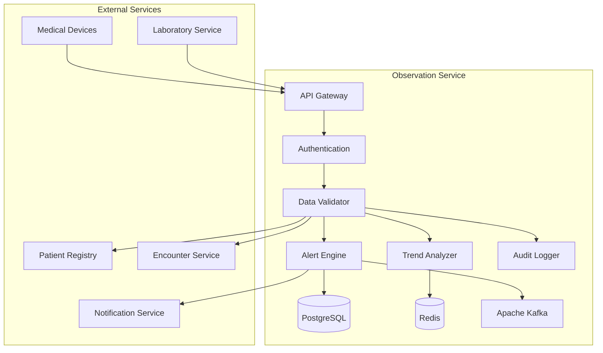

# MS Observation Service

The Observation Service manages clinical observations, vital signs, and measurements with comprehensive validation, trend analysis, and alerting capabilities.

## 📋 Service Overview

- **Repository**: [ms-observation-service](https://github.com/zs-his/ms-observation-service)
- **Status**: 🟡 In Progress
- **FHIR Resources**: Observation, DeviceMetric, BodyHeight, BodyWeight, BloodPressure
- **Primary Database**: PostgreSQL
- **Cache Layer**: Redis
- **Event Streaming**: Apache Kafka

## 🎯 Key Features

### Observation Management
- **Vital Signs**: Blood pressure, heart rate, temperature, respiratory rate
- **Clinical Measurements**: Height, weight, BMI, pain scores
- **Laboratory Values**: Lab results and clinical chemistry
- **Device Integration**: Medical device data capture
- **Trend Analysis**: Historical data analysis and visualization

### Alert System
- **Critical Values**: Automatic alerting for abnormal results
- **Threshold Monitoring**: Customizable alert thresholds
- **Trend Alerts**: Significant changes over time
- **Provider Notifications**: Real-time alerts to healthcare providers

## 🏗️ Architecture



## 📊 Database Schema

### Observation Table
```sql
CREATE TABLE observations (
    id UUID PRIMARY KEY DEFAULT gen_random_uuid(),
    observation_id VARCHAR(50) UNIQUE NOT NULL,
    patient_id UUID NOT NULL,
    encounter_id UUID,
    status VARCHAR(20) NOT NULL DEFAULT 'final',
    category JSONB NOT NULL,
    code JSONB NOT NULL,
    subject_type VARCHAR(20) DEFAULT 'patient',
    subject_id UUID NOT NULL,
    focus_type VARCHAR(20),
    focus_id UUID,
    encounter_reference UUID REFERENCES encounters(id),
    effective_date_time TIMESTAMP,
    effective_period JSONB,
    issued TIMESTAMP,
    performer JSONB,
    data_absent_reason VARCHAR(50),
    interpretation JSONB,
    note JSONB,
    body_site JSONB,
    method JSONB,
    specimen JSONB,
    device JSONB,
    reference_range JSONB,
    component JSONB,
    value_quantity JSONB,
    value_codeable_concept JSONB,
    value_string TEXT,
    value_boolean BOOLEAN,
    value_integer INTEGER,
    value_range JSONB,
    value_ratio JSONB,
    value_sampled_data JSONB,
    value_time TIMESTAMP,
    value_date_time TIMESTAMP,
    value_period JSONB,
    value_attachment JSONB,
    created_at TIMESTAMP DEFAULT CURRENT_TIMESTAMP,
    updated_at TIMESTAMP DEFAULT CURRENT_TIMESTAMP,
    metadata JSONB,
    FOREIGN KEY (patient_id) REFERENCES patients(id)
);
```

### Vital Signs Configuration
```sql
CREATE TABLE vital_signs_config (
    id UUID PRIMARY KEY DEFAULT gen_random_uuid(),
    code_system VARCHAR(100) NOT NULL,
    code VARCHAR(50) NOT NULL,
    display VARCHAR(200) NOT NULL,
    category VARCHAR(50) NOT NULL,
    unit VARCHAR(20) NOT NULL,
    reference_range JSONB,
    critical_range JSONB,
    alert_thresholds JSONB,
    age_groups JSONB,
    gender_specific BOOLEAN DEFAULT false,
    is_active BOOLEAN DEFAULT true,
    created_at TIMESTAMP DEFAULT CURRENT_TIMESTAMP,
    updated_at TIMESTAMP DEFAULT CURRENT_TIMESTAMP
);
```

### Observation Trends
```sql
CREATE TABLE observation_trends (
    id UUID PRIMARY KEY DEFAULT gen_random_uuid(),
    patient_id UUID NOT NULL,
    observation_code VARCHAR(50) NOT NULL,
    trend_period_start TIMESTAMP NOT NULL,
    trend_period_end TIMESTAMP NOT NULL,
    trend_type VARCHAR(20) NOT NULL,
    trend_value DECIMAL(10,4),
    trend_direction VARCHAR(10),
    significance_level VARCHAR(10),
    data_points INTEGER NOT NULL,
    created_at TIMESTAMP DEFAULT CURRENT_TIMESTAMP,
    FOREIGN KEY (patient_id) REFERENCES patients(id)
);
```

## 🔌 API Endpoints

### Observation CRUD Operations
```go
// Create new observation
POST /api/observations
{
  "status": "final",
  "category": [{"coding": [{"code": "vital-signs"}]}],
  "code": {
    "coding": [{
      "system": "http://loinc.org",
      "code": "8480-6",
      "display": "Systolic blood pressure"
    }]
  },
  "subject": {"reference": "Patient/12345"},
  "encounter": {"reference": "Encounter/67890"},
  "effectiveDateTime": "2026-01-21T10:30:00+06:00",
  "valueQuantity": {
    "value": 120,
    "unit": "mmHg",
    "system": "http://unitsofmeasure.org",
    "code": "mm[Hg]"
  }
}

// Get observation by ID
GET /api/observations/{id}

// Search observations
GET /api/observations?patient=12345&category=vital-signs&date=2026-01-21

// Update observation
PUT /api/observations/{id}

// Delete observation
DELETE /api/observations/{id}
```

### Vital Signs Management
```go
// Batch vital signs entry
POST /api/observations/vital-signs
{
  "patientId": "12345",
  "encounterId": "67890",
  "vitalSigns": {
    "bloodPressure": {
      "systolic": {"value": 120, "unit": "mmHg"},
      "diastolic": {"value": 80, "unit": "mmHg"}
    },
    "heartRate": {"value": 72, "unit": "/min"},
    "temperature": {"value": 36.5, "unit": "Celsius"},
    "respiratoryRate": {"value": 16, "unit": "/min"},
    "oxygenSaturation": {"value": 98, "unit": "%"}
  },
  "recordedAt": "2026-01-21T10:30:00+06:00"
}

// Get patient vital signs history
GET /api/observations/vital-signs/{patientId}?period=7d&includeTrends=true
```

### Trend Analysis
```go
// Get observation trends
GET /api/observations/trends/{patientId}
{
  "observationCode": "8480-6",
  "period": "30d",
  "interval": "daily",
  "includeStatistics": true
}

// Response
{
  "trends": [
    {
      "date": "2026-01-21",
      "value": 120,
      "trend": "stable",
      "significance": "normal"
    }
  ],
  "statistics": {
    "mean": 118.5,
    "median": 120,
    "stdDev": 4.2,
    "min": 110,
    "max": 125
  }
}
```

## 🏥 Vital Signs Configuration

### LOINC Codes for Bangladesh
```go
var VitalSignsCodes = map[string]VitalSignConfig{
    "8480-6": {
        Code:        "8480-6",
        Display:     "Systolic blood pressure",
        Category:    "vital-signs",
        Unit:        "mmHg",
        NormalRange: []Range{{Low: 90, High: 140}},
        CriticalRange: []Range{{Low: 0, High: 60}, {Low: 180, High: 300}},
    },
    "8462-4": {
        Code:        "8462-4",
        Display:     "Diastolic blood pressure", 
        Category:    "vital-signs",
        Unit:        "mmHg",
        NormalRange: []Range{{Low: 60, High: 90}},
        CriticalRange: []Range{{Low: 0, High: 40}, {Low: 120, High: 200}},
    },
    "8867-4": {
        Code:        "8867-4",
        Display:     "Heart rate",
        Category:    "vital-signs",
        Unit:        "/min",
        NormalRange: []Range{{Low: 60, High: 100}},
        CriticalRange: []Range{{Low: 0, High: 40}, {Low: 130, High: 300}},
    },
    "8310-2": {
        Code:        "8310-2",
        Display:     "Body temperature",
        Category:    "vital-signs",
        Unit:        "Celsius",
        NormalRange: []Range{{Low: 36.1, High: 37.2}},
        CriticalRange: []Range{{Low: 35.0, High: 36.0}, {Low: 38.5, High: 42.0}},
    },
    "9279-1": {
        Code:        "9279-1",
        Display:     "Respiratory rate",
        Category:    "vital-signs",
        Unit:        "/min",
        NormalRange: []Range{{Low: 12, High: 20}},
        CriticalRange: []Range{{Low: 0, High: 8}, {Low: 25, High: 60}},
    },
    "59408-5": {
        Code:        "59408-5",
        Display:     "Oxygen saturation",
        Category:    "vital-signs",
        Unit:        "%",
        NormalRange: []Range{{Low: 95, High: 100}},
        CriticalRange: []Range{{Low: 0, High: 85}, {Low: 101, High: 100}},
    },
}
```

### Age and Gender Specific Ranges
```go
type AgeGroupRange struct {
    AgeGroup     string  `json:"age_group"`
    Gender       string  `json:"gender"`
    NormalLow    float64 `json:"normal_low"`
    NormalHigh   float64 `json:"normal_high"`
    CriticalLow  float64 `json:"critical_low"`
    CriticalHigh float64 `json:"critical_high"`
}

var BloodPressureRanges = []AgeGroupRange{
    {AgeGroup: "adult", Gender: "male", NormalLow: 90, NormalHigh: 140, CriticalLow: 60, CriticalHigh: 180},
    {AgeGroup: "adult", Gender: "female", NormalLow: 90, NormalHigh: 140, CriticalLow: 60, CriticalHigh: 180},
    {AgeGroup: "pediatric", Gender: "male", NormalLow: 80, NormalHigh: 120, CriticalLow: 50, CriticalHigh: 150},
    {AgeGroup: "pediatric", Gender: "female", NormalLow: 80, NormalHigh: 120, CriticalLow: 50, CriticalHigh: 150},
    {AgeGroup: "geriatric", Gender: "male", NormalLow: 100, NormalHigh: 160, CriticalLow: 70, CriticalHigh: 200},
    {AgeGroup: "geriatric", Gender: "female", NormalLow: 100, NormalHigh: 160, CriticalLow: 70, CriticalHigh: 200},
}
```

## 🔍 Search and Filtering

### Advanced Observation Search
```go
type ObservationSearchCriteria struct {
    PatientID     string    `json:"patient_id"`
    EncounterID   string    `json:"encounter_id"`
    Category      string    `json:"category"`
    Code          string    `json:"code"`
    Status        string    `json:"status"`
    DateFrom      time.Time `json:"date_from"`
    DateTo        time.Time `json:"date_to"`
    ValueFrom     float64   `json:"value_from"`
    ValueTo       float64   `json:"value_to"`
    Unit          string    `json:"unit"`
    PerformerID   string    `json:"performer_id"`
    DeviceID      string    `json:"device_id"`
}

func (s *ObservationService) SearchObservations(criteria ObservationSearchCriteria) ([]Observation, error) {
    query := s.db.NewSelect().Model(&Observation{})
    
    if criteria.PatientID != "" {
        query = query.Where("patient_id = ?", criteria.PatientID)
    }
    
    if criteria.Category != "" {
        query = query.Where("category->>'coding'->>0->>'code' = ?", criteria.Category)
    }
    
    if criteria.Code != "" {
        query = query.Where("code->>'coding'->>0->>'code' = ?", criteria.Code)
    }
    
    if !criteria.DateFrom.IsZero() {
        query = query.Where("effective_date_time >= ?", criteria.DateFrom)
    }
    
    if !criteria.DateTo.IsZero() {
        query = query.Where("effective_date_time <= ?", criteria.DateTo)
    }
    
    var observations []Observation
    err := query.Scan(ctx, &observations)
    return observations, err
}
```

## 📈 Performance Optimization

### Caching Strategy
```go
// Cache vital signs for 5 minutes
func (s *ObservationService) GetLatestVitalSigns(patientID string) (map[string]Observation, error) {
    cacheKey := fmt.Sprintf("latest_vitals:%s", patientID)
    
    // Try cache first
    if cached, err := s.cache.Get(cacheKey); err == nil {
        return cached.(map[string]Observation), nil
    }
    
    // Get from database
    vitals, err := s.repository.GetLatestVitalSigns(patientID)
    if err != nil {
        return nil, err
    }
    
    // Cache for 5 minutes
    s.cache.Set(cacheKey, vitals, 5*time.Minute)
    return vitals, nil
}
```

### Database Indexing
```sql
-- Performance indexes
CREATE INDEX idx_observations_patient ON observations(patient_id);
CREATE INDEX idx_observations_encounter ON observations(encounter_reference);
CREATE INDEX idx_observations_code ON observations USING gin(to_tsvector('english', code->>'coding'->>0->>'code'));
CREATE INDEX idx_observations_category ON observations USING gin(to_tsvector('english', category->>'coding'->>0->>'code'));
CREATE INDEX idx_observations_effective_date ON observations(effective_date_time);
CREATE INDEX idx_observations_status ON observations(status);
CREATE INDEX idx_observations_performer ON observations USING gin(to_tsvector('english', performer));
CREATE INDEX idx_trends_patient_code ON observation_trends(patient_id, observation_code);
```

## 🚨 Alert System

### Alert Engine
```go
type AlertRule struct {
    ID              string  `json:"id"`
    ObservationCode string  `json:"observation_code"`
    Condition       string  `json:"condition"`
    Threshold       float64 `json:"threshold"`
    Severity        string  `json:"severity"`
    Message         string  `json:"message"`
    Recipients      []string `json:"recipients"`
}

func (s *ObservationService) checkAlerts(observation *Observation) error {
    rules, err := s.alertRepository.GetRulesForObservation(observation.Code)
    if err != nil {
        return err
    }
    
    for _, rule := range rules {
        if s.evaluateRule(rule, observation) {
            alert := Alert{
                RuleID:        rule.ID,
                PatientID:     observation.PatientID,
                ObservationID: observation.ID,
                Severity:      rule.Severity,
                Message:       rule.Message,
                Timestamp:     time.Now(),
            }
            
            // Send alert
            err := s.notificationService.SendAlert(alert, rule.Recipients)
            if err != nil {
                log.Printf("Failed to send alert: %v", err)
            }
        }
    }
    
    return nil
}

func (s *ObservationService) evaluateRule(rule AlertRule, observation *Observation) bool {
    if observation.ValueQuantity == nil {
        return false
    }
    
    value := observation.ValueQuantity.Value
    
    switch rule.Condition {
    case "greater_than":
        return value > rule.Threshold
    case "less_than":
        return value < rule.Threshold
    case "equals":
        return value == rule.Threshold
    default:
        return false
    }
}
```

## 📊 Trend Analysis

### Trend Calculation
```go
type TrendAnalysis struct {
    PatientID       string    `json:"patient_id"`
    ObservationCode string    `json:"observation_code"`
    Period          string    `json:"period"`
    Trend           string    `json:"trend"`
    Slope           float64   `json:"slope"`
    Significance    string    `json:"significance"`
    DataPoints      int       `json:"data_points"`
    LastUpdated     time.Time `json:"last_updated"`
}

func (s *ObservationService) calculateTrend(patientID, code string, period string) (*TrendAnalysis, error) {
    observations, err := s.repository.GetObservationsForPeriod(patientID, code, period)
    if err != nil {
        return nil, err
    }
    
    if len(observations) < 2 {
        return &TrendAnalysis{Trend: "insufficient_data"}, nil
    }
    
    // Calculate linear regression
    var sumX, sumY, sumXY, sumX2 float64
    n := float64(len(observations))
    
    for i, obs := range observations {
        x := float64(i)
        y := obs.ValueQuantity.Value
        
        sumX += x
        sumY += y
        sumXY += x * y
        sumX2 += x * x
    }
    
    slope := (n*sumXY - sumX*sumY) / (n*sumX2 - sumX*sumX)
    
    // Determine trend direction
    trend := "stable"
    if slope > 0.5 {
        trend = "increasing"
    } else if slope < -0.5 {
        trend = "decreasing"
    }
    
    // Calculate significance (simplified)
    significance := "normal"
    if math.Abs(slope) > 2.0 {
        significance = "significant"
    }
    
    return &TrendAnalysis{
        PatientID:       patientID,
        ObservationCode: code,
        Period:          period,
        Trend:           trend,
        Slope:           slope,
        Significance:    significance,
        DataPoints:      len(observations),
        LastUpdated:     time.Now(),
    }, nil
}
```

## 🔒 Security Features

### Access Control
```go
func (s *ObservationService) CanAccessObservation(userID, observationID string, action string) bool {
    // Check user permissions
    permissions := s.authService.GetUserPermissions(userID)
    
    switch action {
    case "read":
        return permissions.Contains("observation.read") || 
               s.canViewPatientData(userID, observationID)
    case "write":
        return permissions.Contains("observation.write") || 
               s.canRecordObservations(userID, observationID)
    case "delete":
        return permissions.Contains("observation.delete")
    default:
        return false
    }
}

func (s *ObservationService) canViewPatientData(userID, observationID string) bool {
    observation, err := s.repository.GetByID(observationID)
    if err != nil {
        return false
    }
    
    // Check if user has access to patient
    return s.authService.CanAccessPatient(userID, observation.PatientID)
}
```

## 📊 Monitoring and Metrics

### Health Checks
```go
func (s *ObservationService) HealthCheck() map[string]interface{} {
    return map[string]interface{}{
        "database":            s.checkDatabase(),
        "cache":               s.checkCache(),
        "kafka":               s.checkKafka(),
        "alert_engine":        s.checkAlertEngine(),
        "trend_analyzer":      s.checkTrendAnalyzer(),
        "patient_service":     s.checkPatientService(),
        "encounter_service":   s.checkEncounterService(),
        "timestamp":           time.Now(),
    }
}
```

### Performance Metrics
```go
// Prometheus metrics
var (
    observationRequestsTotal = prometheus.NewCounterVec(
        prometheus.CounterOpts{
            Name: "observation_requests_total",
            Help: "Total number of observation requests",
        },
        []string{"method", "endpoint", "status"},
    )
    
    alertTriggeredTotal = prometheus.NewCounterVec(
        prometheus.CounterOpts{
            Name: "alert_triggered_total",
            Help: "Total number of alerts triggered",
        },
        []string{"severity", "observation_code"},
    )
)
```

## 🧪 Testing

### Unit Tests
```go
func TestObservationService_CreateObservation(t *testing.T) {
    service := NewObservationService(mockRepo, mockCache, mockAlert)
    observation := &Observation{
        Status:     "final",
        Category:   []Code{{Coding: []Coding{{Code: "vital-signs"}}}},
        Code:       Code{Coding: []Coding{{System: "http://loinc.org", Code: "8480-6"}}},
        PatientID:  "patient-123",
        EncounterReference: "encounter-456",
        EffectiveDateTime: time.Now(),
        ValueQuantity: &Quantity{
            Value:  120,
            Unit:   "mmHg",
            System: "http://unitsofmeasure.org",
            Code:   "mm[Hg]",
        },
    }
    
    result, err := service.CreateObservation(observation)
    
    assert.NoError(t, err)
    assert.NotNil(t, result)
    assert.NotEmpty(t, result.ID)
    assert.Equal(t, "final", result.Status)
    assert.Equal(t, 120.0, result.ValueQuantity.Value)
}
```

## 🚀 Deployment

### Docker Configuration
```dockerfile
FROM golang:1.25-alpine AS builder

WORKDIR /app
COPY go.mod go.sum ./
RUN go mod download

COPY . .
RUN CGO_ENABLED=0 GOOS=linux go build -o main cmd/server/main.go

FROM alpine:latest
RUN apk --no-cache add ca-certificates
WORKDIR /root/
COPY --from=builder /app/main .
EXPOSE 8080
CMD ["./main"]
```

### Kubernetes Deployment
```yaml
apiVersion: apps/v1
kind: Deployment
metadata:
  name: ms-observation-service
spec:
  replicas: 3
  selector:
    matchLabels:
      app: ms-observation-service
  template:
    metadata:
      labels:
        app: ms-observation-service
    spec:
      containers:
      - name: ms-observation-service
        image: zarish-his/ms-observation-service:latest
        ports:
        - containerPort: 8080
        env:
        - name: DB_HOST
          value: "postgresql-service"
        - name: REDIS_HOST
          value: "redis-service"
        - name: KAFKA_BROKERS
          value: "kafka-service:9092"
```

## 🔗 Related Resources

- **Frontend Integration**: [ESM Patient Chart](../frontend/esm-patient-chart.md)
- **FHIR Implementation**: [FHIR Observation Profile](../fhir/observation-profile.md)
- **API Documentation**: [Observation API Reference](../api-reference/rest-apis.md)
- **Alert System**: [MS Notification Service](./ms-notification-service.md)

---

*Last updated: 2026-01-21*
