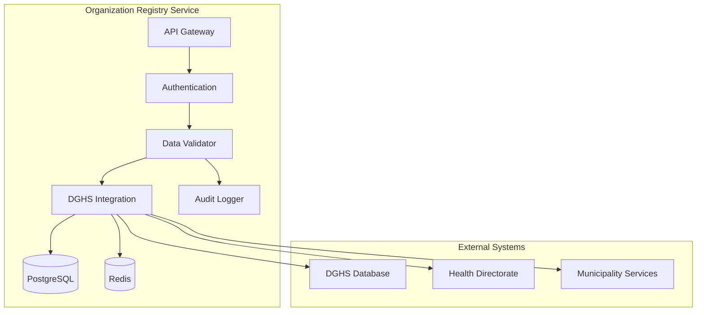

# MS Organization Registry

The Organization Registry Service manages healthcare organizations, facilities, departments, and service locations with DGHS integration and Bangladesh healthcare system context.

## 📋 Service Overview

- **Repository**: [ms-organization-registry](https://github.com/zs-his/ms-organization-registry)
- **Status**: 🟡 In Progress
- **FHIR Resources**: Organization, Location, HealthcareService
- **Primary Database**: PostgreSQL
- **Cache Layer**: Redis

## 🎯 Key Features

### Organization Management
- **Facility Registration**: Hospital and clinic registration
- **Department Structure**: Organizational hierarchy management
- **Service Catalog**: Healthcare services and specialties
- **Location Management**: Physical locations and facilities
- **Contact Information**: Communication details and addresses

### Bangladesh-Specific Features
- **DGHS Integration**: Directorate General of Health Services registration
- **Hospital Classification**: Bangladesh hospital classification system
- **Service Standards**: Local healthcare service standards
- **Regional Mapping**: Bangladesh administrative divisions

## 🏗️ Architecture



## 📊 Database Schema

### Organization Table
```sql
CREATE TABLE organizations (
    id UUID PRIMARY KEY DEFAULT gen_random_uuid(),
    organization_id VARCHAR(50) UNIQUE NOT NULL,
    name VARCHAR(200) NOT NULL,
    alias VARCHAR(100),
    organization_type VARCHAR(50) NOT NULL,
    classification VARCHAR(50),
    status VARCHAR(20) DEFAULT 'active',
    phone VARCHAR(20),
    email VARCHAR(100),
    website VARCHAR(200),
    address JSONB NOT NULL,
    contact_person JSONB,
    services_offered JSONB,
    bed_capacity INTEGER,
    emergency_services BOOLEAN DEFAULT false,
    dghs_registration_number VARCHAR(50),
    dghs_registration_date DATE,
    license_number VARCHAR(50),
    license_expiry_date DATE,
    created_at TIMESTAMP DEFAULT CURRENT_TIMESTAMP,
    updated_at TIMESTAMP DEFAULT CURRENT_TIMESTAMP,
    metadata JSONB
);
```

### Location Table
```sql
CREATE TABLE locations (
    id UUID PRIMARY KEY DEFAULT gen_random_uuid(),
    location_id VARCHAR(50) UNIQUE NOT NULL,
    organization_id UUID REFERENCES organizations(id),
    name VARCHAR(200) NOT NULL,
    status VARCHAR(20) DEFAULT 'active',
    location_type VARCHAR(50) NOT NULL,
    physical_type VARCHAR(50),
    managing_organization UUID REFERENCES organizations(id),
    address JSONB NOT NULL,
    coordinates JSONB,
    hours_of_operation JSONB,
    availability JSONB,
    created_at TIMESTAMP DEFAULT CURRENT_TIMESTAMP,
    updated_at TIMESTAMP DEFAULT CURRENT_TIMESTAMP
);
```

### Healthcare Services Table
```sql
CREATE TABLE healthcare_services (
    id UUID PRIMARY KEY DEFAULT gen_random_uuid(),
    service_id VARCHAR(50) UNIQUE NOT NULL,
    organization_id UUID REFERENCES organizations(id),
    location_id UUID REFERENCES locations(id),
    service_type VARCHAR(50) NOT NULL,
    service_name VARCHAR(200) NOT NULL,
    specialty VARCHAR(100),
    available_time JSONB,
    not_available_time JSONB,
    referral_method JSONB,
    created_at TIMESTAMP DEFAULT CURRENT_TIMESTAMP,
    updated_at TIMESTAMP DEFAULT CURRENT_TIMESTAMP
);
```

## 🔌 API Endpoints

### Organization CRUD Operations
```go
// Create new organization
POST /api/organizations
{
  "name": "Dhaka Medical College Hospital",
  "type": "hospital",
  "classification": "tertiary",
  "address": {
    "line": ["Shahbagh", "Dhaka"],
    "city": "Dhaka",
    "postalCode": "1000",
    "country": "Bangladesh"
  },
  "contact": [{
    "system": "phone",
    "value": "+880-2-9661551"
  }]
}

// Get organization by ID
GET /api/organizations/{id}

// Search organizations
GET /api/organizations?type=hospital&city=Dhaka&classification=tertiary

// Update organization
PUT /api/organizations/{id}

// Delete organization (soft delete)
DELETE /api/organizations/{id}
```

### Location Management
```go
// Add location to organization
POST /api/organizations/{orgId}/locations
{
  "name": "Emergency Department",
  "status": "active",
  "physicalType": "building",
  "address": {
    "line": ["Emergency Wing", "DMCH"],
    "city": "Dhaka"
  },
  "hoursOfOperation": {
    "daysOfWeek": ["mon", "tue", "wed", "thu", "fri", "sat", "sun"],
    "openingTime": "00:00",
    "closingTime": "23:59"
  }
}

// Get organization locations
GET /api/organizations/{orgId}/locations

// Update location
PUT /api/organizations/{orgId}/locations/{locationId}
```

### Healthcare Services
```go
// Add healthcare service
POST /api/organizations/{orgId}/services
{
  "serviceType": "clinical",
  "serviceName": "Emergency Medicine",
  "specialty": "emergency-medicine",
  "availableTime": [{
    "daysOfWeek": ["mon", "tue", "wed", "thu", "fri", "sat", "sun"],
    "availableStartTime": "00:00",
    "availableEndTime": "23:59"
  }]
}

// Get organization services
GET /api/organizations/{orgId}/services?specialty=cardiology
```

## 🏥 Bangladesh Healthcare Organization Types

### Organization Classifications
```go
var BangladeshOrganizationTypes = map[string]string{
    "hospital-tertiary":     "Tertiary Care Hospital",
    "hospital-secondary":    "Secondary Care Hospital",
    "hospital-primary":      "Primary Care Hospital",
    "medical-college":       "Medical College Hospital",
    "specialized-hospital":  "Specialized Hospital",
    "upazila-health-complex": "Upazila Health Complex",
    "union-health-center":   "Union Health and Family Welfare Center",
    "community-clinic":      "Community Clinic",
    "diagnostic-center":     "Diagnostic Center",
    "blood-bank":           "Blood Bank",
    "ambulance-service":    "Ambulance Service",
}

var BangladeshHospitalClassifications = map[string]string{
    "specialized":     "Specialized Hospital",
    "general":         "General Hospital",
    "teaching":        "Teaching Hospital",
    "district":        "District Hospital",
    "upazila":         "Upazila Health Complex",
    "medical-college": "Medical College & Hospital",
}
```

### Administrative Divisions
```go
type BangladeshDivision struct {
    Code        string `json:"code"`
    Name        string `json:"name"`
    Districts   []BangladeshDistrict `json:"districts"`
}

type BangladeshDistrict struct {
    Code       string `json:"code"`
    Name       string `json:"name"`
    Division   string `json:"division"`
    Upazilas   []BangladeshUpazila `json:"upazilas"`
}

var BangladeshDivisions = []BangladeshDivision{
    {
        Code: "1",
        Name: "Barishal",
        Districts: []BangladeshDistrict{
            {Code: "10", Name: "Barishal", Division: "Barishal"},
            {Code: "11", Name: "Barguna", Division: "Barishal"},
            // ... more districts
        },
    },
    {
        Code: "2", 
        Name: "Chattogram",
        Districts: []BangladeshDistrict{
            {Code: "20", Name: "Chattogram", Division: "Chattogram"},
            {Code: "21", Name: "Cox's Bazar", Division: "Chattogram"},
            // ... more districts
        },
    },
    // ... more divisions
}
```

## 🔍 Search and Filtering

### Advanced Organization Search
```go
type OrganizationSearchCriteria struct {
    Name              string   `json:"name"`
    Type              string   `json:"type"`
    Classification    string   `json:"classification"`
    City              string   `json:"city"`
    Division          string   `json:"division"`
    District          string   `json:"district"`
    Service           string   `json:"service"`
    EmergencyServices bool     `json:"emergency_services"`
    BedCapacityMin    int      `json:"bed_capacity_min"`
    BedCapacityMax    int      `json:"bed_capacity_max"`
}

func (s *OrganizationService) SearchOrganizations(criteria OrganizationSearchCriteria) ([]Organization, error) {
    query := s.db.NewSelect().Model(&Organization{}).Where("status = 'active'")
    
    if criteria.Name != "" {
        query = query.Where("name ILIKE ?", "%"+criteria.Name+"%")
    }
    
    if criteria.Type != "" {
        query = query.Where("organization_type = ?", criteria.Type)
    }
    
    if criteria.Classification != "" {
        query = query.Where("classification = ?", criteria.Classification)
    }
    
    if criteria.EmergencyServices {
        query = query.Where("emergency_services = true")
    }
    
    var organizations []Organization
    err := query.Scan(ctx, &organizations)
    return organizations, err
}
```

## 📈 Performance Optimization

### Caching Strategy
```go
// Cache organization data for 1 hour
func (s *OrganizationService) GetOrganization(id string) (*Organization, error) {
    cacheKey := fmt.Sprintf("organization:%s", id)
    
    // Try cache first
    if cached, err := s.cache.Get(cacheKey); err == nil {
        return cached.(*Organization), nil
    }
    
    // Get from database
    organization, err := s.repository.GetByID(id)
    if err != nil {
        return nil, err
    }
    
    // Cache for 1 hour
    s.cache.Set(cacheKey, organization, time.Hour)
    return organization, nil
}

// Cache organization hierarchy
func (s *OrganizationService) GetOrganizationHierarchy(orgId string) (*OrganizationHierarchy, error) {
    cacheKey := fmt.Sprintf("org_hierarchy:%s", orgId)
    
    if cached, err := s.cache.Get(cacheKey); err == nil {
        return cached.(*OrganizationHierarchy), nil
    }
    
    hierarchy, err := s.buildHierarchy(orgId)
    if err != nil {
        return nil, err
    }
    
    // Cache hierarchy for 30 minutes
    s.cache.Set(cacheKey, hierarchy, 30*time.Minute)
    return hierarchy, nil
}
```

### Database Indexing
```sql
-- Performance indexes
CREATE INDEX idx_organizations_name ON organizations USING gin(to_tsvector('english', name));
CREATE INDEX idx_organizations_type ON organizations(organization_type);
CREATE INDEX idx_organizations_classification ON organizations(classification);
CREATE INDEX idx_organizations_city ON organizations USING gin(to_tsvector('english', address->>'city'));
CREATE INDEX idx_organizations_status ON organizations(status);
CREATE INDEX idx_organizations_dghs_reg ON organizations(dghs_registration_number);
CREATE INDEX idx_locations_organization ON locations(organization_id);
CREATE INDEX idx_locations_type ON locations(location_type);
CREATE INDEX idx_healthcare_services_organization ON healthcare_services(organization_id);
CREATE INDEX idx_healthcare_services_specialty ON healthcare_services(specialty);
```

## 🔒 Security Features

### Data Protection
```go
// Encrypt sensitive organization data
func (s *OrganizationService) encryptSensitiveData(organization *Organization) error {
    if organization.Phone != "" {
        encrypted, err := s.crypto.Encrypt(organization.Phone)
        if err != nil {
            return err
        }
        organization.Phone = encrypted
    }
    
    if organization.Email != "" {
        encrypted, err := s.crypto.Encrypt(organization.Email)
        if err != nil {
            return err
        }
        organization.Email = encrypted
    }
    
    return nil
}
```

### DGHS Data Validation
```go
func (s *OrganizationService) ValidateDGHSRegistration(regNumber string) error {
    // Format validation
    if !regexp.MustCompile(`^DGHS\d{8}$`).MatchString(regNumber) {
        return errors.New("invalid DGHS registration number format")
    }
    
    // External verification
    verification, err := s.dghsService.VerifyRegistration(regNumber)
    if err != nil {
        return fmt.Errorf("DGHS verification failed: %w", err)
    }
    
    if !verification.Valid {
        return errors.New("DGHS registration not found or invalid")
    }
    
    return nil
}
```

## 📊 Monitoring and Metrics

### Health Checks
```go
func (s *OrganizationService) HealthCheck() map[string]interface{} {
    return map[string]interface{}{
        "database":         s.checkDatabase(),
        "cache":            s.checkCache(),
        "dghs_service":     s.checkDGHSIntegration(),
        "municipality_api": s.checkMunicipalityAPI(),
        "timestamp":        time.Now(),
    }
}
```

### Performance Metrics
```go
// Prometheus metrics
var (
    organizationRequestsTotal = prometheus.NewCounterVec(
        prometheus.CounterOpts{
            Name: "organization_requests_total",
            Help: "Total number of organization requests",
        },
        []string{"method", "endpoint", "status"},
    )
    
    dghsVerificationTotal = prometheus.NewCounterVec(
        prometheus.CounterOpts{
            Name: "dghs_verification_total",
            Help: "Total number of DGHS verifications",
        },
        []string{"result"},
    )
)
```

## 🧪 Testing

### Unit Tests
```go
func TestOrganizationService_CreateOrganization(t *testing.T) {
    service := NewOrganizationService(mockRepo, mockCache, mockDGHS)
    organization := &Organization{
        Name:        "Dhaka Medical College Hospital",
        Type:        "hospital",
        Classification: "tertiary",
        Address:     Address{City: "Dhaka", Country: "Bangladesh"},
        DGHSRegNumber: "DGHS12345678",
    }
    
    result, err := service.CreateOrganization(organization)
    
    assert.NoError(t, err)
    assert.NotNil(t, result)
    assert.NotEmpty(t, result.ID)
    assert.Equal(t, "Dhaka Medical College Hospital", result.Name)
    assert.Equal(t, "hospital", result.Type)
}
```

## 🚀 Deployment

### Docker Configuration
```dockerfile
FROM golang:1.25-alpine AS builder

WORKDIR /app
COPY go.mod go.sum ./
RUN go mod download

COPY . .
RUN CGO_ENABLED=0 GOOS=linux go build -o main cmd/server/main.go

FROM alpine:latest
RUN apk --no-cache add ca-certificates
WORKDIR /root/
COPY --from=builder /app/main .
EXPOSE 8080
CMD ["./main"]
```

### Kubernetes Deployment
```yaml
apiVersion: apps/v1
kind: Deployment
metadata:
  name: ms-organization-registry
spec:
  replicas: 3
  selector:
    matchLabels:
      app: ms-organization-registry
  template:
    metadata:
      labels:
        app: ms-organization-registry
    spec:
      containers:
      - name: ms-organization-registry
        image: zarish-his/ms-organization-registry:latest
        ports:
        - containerPort: 8080
        env:
        - name: DB_HOST
          value: "postgresql-service"
        - name: REDIS_HOST
          value: "redis-service"
        - name: DGHS_SERVICE_URL
          value: "https://dghs.gov.bd/api"
```

## 🔗 Related Resources

- **Frontend Integration**: [ESM Admin](../frontend/esm-admin.md)
- **FHIR Implementation**: [FHIR Organization Profile](../fhir/organization-profile.md)
- **API Documentation**: [Organization API Reference](../api-reference/rest-apis.md)

---

*Last updated: 2026-01-21*
