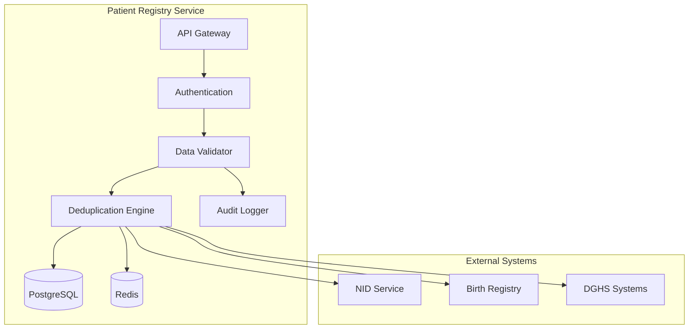

# MS Patient Registry

The Patient Registry Service is the cornerstone of ZARISH HIS, managing comprehensive patient demographic and medical information with FHIR R5 compliance.

## 📋 Service Overview

- **Repository**: [ms-patient-registry](https://github.com/zs-his/ms-patient-registry)
- **Status**: ✅ Active
- **FHIR Resources**: Patient, RelatedPerson, Person
- **Primary Database**: PostgreSQL
- **Cache Layer**: Redis

## 🎯 Key Features

### Patient Management
- **Registration**: Complete patient registration with demographics
- **Search**: Advanced patient search with multiple criteria
- **Deduplication**: Duplicate patient detection and merging
- **Medical History**: Comprehensive medical record management
- **Document Management**: Patient document storage and retrieval

### Bangladesh-Specific Features
- **NID Integration**: Bangladesh National ID verification
- **Birth Registration**: Digital birth certificate integration
- **Mobile Verification**: Bangladesh mobile number verification
- **Local Formats**: Bangladesh address and phone formats

## 🏗️ Architecture



## 📊 Database Schema

### Patient Table
```sql
CREATE TABLE patients (
    id UUID PRIMARY KEY DEFAULT gen_random_uuid(),
    patient_id VARCHAR(50) UNIQUE NOT NULL,
    first_name VARCHAR(100) NOT NULL,
    last_name VARCHAR(100) NOT NULL,
    birth_date DATE,
    gender VARCHAR(20),
    national_id VARCHAR(20),
    birth_certificate_no VARCHAR(20),
    mobile_phone VARCHAR(20),
    email VARCHAR(100),
    blood_group VARCHAR(10),
    marital_status VARCHAR(20),
    occupation VARCHAR(100),
    religion VARCHAR(50),
    education VARCHAR(50),
    address JSONB,
    emergency_contact JSONB,
    medical_history JSONB,
    allergies JSONB,
    medications JSONB,
    created_at TIMESTAMP DEFAULT CURRENT_TIMESTAMP,
    updated_at TIMESTAMP DEFAULT CURRENT_TIMESTAMP,
    is_active BOOLEAN DEFAULT true,
    metadata JSONB
);
```

### Patient Identifiers
```sql
CREATE TABLE patient_identifiers (
    id UUID PRIMARY KEY DEFAULT gen_random_uuid(),
    patient_id UUID REFERENCES patients(id),
    identifier_type VARCHAR(50) NOT NULL,
    identifier_value VARCHAR(100) NOT NULL,
    issuer VARCHAR(100),
    period JSONB,
    created_at TIMESTAMP DEFAULT CURRENT_TIMESTAMP,
    UNIQUE(patient_id, identifier_type, identifier_value)
);
```

## 🔌 API Endpoints

### Patient CRUD Operations
```go
// Create new patient
POST /api/patients
{
  "name": [{"given": ["John"], "family": "Doe"}],
  "gender": "male",
  "birthDate": "1990-01-01",
  "identifier": [{
    "type": {"coding": [{"code": "MRN"}]},
    "value": "MRN123456789"
  }]
}

// Get patient by ID
GET /api/patients/{id}

// Search patients
GET /api/patients?name=John&gender=male&birth_date=1990-01-01

// Update patient
PUT /api/patients/{id}

// Delete patient (soft delete)
DELETE /api/patients/{id}
```

### Advanced Search
```go
// Advanced patient search
POST /api/patients/search
{
  "criteria": {
    "name": "John",
    "gender": "male",
    "birthDateRange": {"start": "1980-01-01", "end": "2000-12-31"},
    "identifier": {"type": "NID", "value": "1234567890"},
    "address": {"city": "Dhaka", "division": "Dhaka"}
  },
  "pagination": {"page": 1, "limit": 20}
}
```

### NID Verification
```go
// Verify Bangladesh National ID
POST /api/patients/verify-nid
{
  "national_id": "1234567890123",
  "date_of_birth": "1990-01-01",
  "name": "John Doe"
}

// Response
{
  "verified": true,
  "details": {
    "name": "John Doe",
    "birth_date": "1990-01-01",
    "address": "Dhaka, Bangladesh"
  }
}
```

## 🔍 Deduplication Algorithm

### Patient Matching Logic
```go
type PatientMatch struct {
    NameSimilarity    float64 `json:"name_similarity"`
    BirthDateMatch    bool    `json:"birth_date_match"`
    MobileMatch       bool    `json:"mobile_match"`
    NIDMatch          bool    `json:"nid_match"`
    AddressSimilarity float64 `json:"address_similarity"`
    OverallScore      float64 `json:"overall_score"`
}

func (s *PatientService) FindDuplicates(patient *Patient) ([]PatientMatch, error) {
    candidates, _ := s.repository.FindPotentialMatches(patient)
    var matches []PatientMatch
    
    for _, candidate := range candidates {
        score := s.calculateMatchScore(patient, candidate)
        if score.OverallScore > 0.8 {
            matches = append(matches, score)
        }
    }
    
    return matches, nil
}
```

## 📈 Performance Optimization

### Caching Strategy
```go
// Cache patient data for 1 hour
func (s *PatientService) GetPatient(id string) (*Patient, error) {
    cacheKey := fmt.Sprintf("patient:%s", id)
    
    // Try cache first
    if cached, err := s.cache.Get(cacheKey); err == nil {
        return cached.(*Patient), nil
    }
    
    // Get from database
    patient, err := s.repository.GetByID(id)
    if err != nil {
        return nil, err
    }
    
    // Cache for 1 hour
    s.cache.Set(cacheKey, patient, time.Hour)
    return patient, nil
}
```

### Database Indexing
```sql
-- Performance indexes
CREATE INDEX idx_patients_name ON patients USING gin(to_tsvector('english', first_name || ' ' || last_name));
CREATE INDEX idx_patients_birth_date ON patients(birth_date);
CREATE INDEX idx_patients_national_id ON patients(national_id);
CREATE INDEX idx_patients_mobile_phone ON patients(mobile_phone);
CREATE INDEX idx_patients_created_at ON patients(created_at);
CREATE INDEX idx_identifiers_value ON patient_identifiers(identifier_value);
CREATE INDEX idx_identifiers_type ON patient_identifiers(identifier_type);
```

## 🔒 Security Features

### Data Encryption
```go
// Encrypt sensitive patient data
func (s *PatientService) encryptSensitiveData(patient *Patient) error {
    if patient.NationalID != "" {
        encrypted, err := s.crypto.Encrypt(patient.NationalID)
        if err != nil {
            return err
        }
        patient.NationalID = encrypted
    }
    
    if patient.MobilePhone != "" {
        encrypted, err := s.crypto.Encrypt(patient.MobilePhone)
        if err != nil {
            return err
        }
        patient.MobilePhone = encrypted
    }
    
    return nil
}
```

### Access Control
```go
// Role-based access control
func (s *PatientService) CanAccess(userID, patientID string, action string) bool {
    // Check user permissions
    permissions := s.authService.GetUserPermissions(userID)
    
    switch action {
    case "read":
        return permissions.Contains("patient.read") || 
               s.isAssignedPatient(userID, patientID)
    case "write":
        return permissions.Contains("patient.write")
    case "delete":
        return permissions.Contains("patient.delete")
    default:
        return false
    }
}
```

## 📊 Monitoring and Metrics

### Health Checks
```go
func (s *PatientService) HealthCheck() map[string]interface{} {
    return map[string]interface{}{
        "database": s.checkDatabase(),
        "cache":    s.checkCache(),
        "nid_service": s.checkNIDService(),
        "duplicate_detection": s.checkDeduplicationService(),
        "timestamp": time.Now(),
    }
}
```

### Performance Metrics
```go
// Prometheus metrics
var (
    patientRequestsTotal = prometheus.NewCounterVec(
        prometheus.CounterOpts{
            Name: "patient_requests_total",
            Help: "Total number of patient requests",
        },
        []string{"method", "endpoint", "status"},
    )
    
    patientResponseTime = prometheus.NewHistogramVec(
        prometheus.HistogramOpts{
            Name: "patient_response_time_seconds",
            Help: "Patient request response time",
        },
        []string{"method", "endpoint"},
    )
)
```

## 🧪 Testing

### Unit Tests
```go
func TestPatientService_CreatePatient(t *testing.T) {
    // Setup
    service := NewPatientService(mockRepo, mockCache, mockNID)
    patient := &Patient{
        Name:        []Name{{Given: []string{"John"}, Family: "Doe"}},
        Gender:      "male",
        BirthDate:   "1990-01-01",
        NationalID:  "1234567890123",
    }
    
    // Execute
    result, err := service.CreatePatient(patient)
    
    // Assert
    assert.NoError(t, err)
    assert.NotNil(t, result)
    assert.NotEmpty(t, result.ID)
    assert.Equal(t, "John", result.Name[0].Given[0])
    assert.Equal(t, "Doe", result.Name[0].Family)
}
```

### Integration Tests
```go
func TestPatientAPI_CreatePatient(t *testing.T) {
    // Setup test server
    router := setupTestRouter()
    
    patient := map[string]interface{}{
        "name": []map[string]interface{}{
            {"given": []string{"John"}, "family": "Doe"},
        },
        "gender": "male",
        "birthDate": "1990-01-01",
    }
    
    body, _ := json.Marshal(patient)
    req, _ := http.NewRequest("POST", "/api/patients", bytes.NewBuffer(body))
    req.Header.Set("Content-Type", "application/json")
    
    w := httptest.NewRecorder()
    router.ServeHTTP(w, req)
    
    assert.Equal(t, http.StatusCreated, w.Code)
    
    var response Patient
    json.Unmarshal(w.Body.Bytes(), &response)
    assert.NotEmpty(t, response.ID)
}
```

## 🚀 Deployment

### Docker Configuration
```dockerfile
FROM golang:1.25-alpine AS builder

WORKDIR /app
COPY go.mod go.sum ./
RUN go mod download

COPY . .
RUN CGO_ENABLED=0 GOOS=linux go build -o main cmd/server/main.go

FROM alpine:latest
RUN apk --no-cache add ca-certificates
WORKDIR /root/
COPY --from=builder /app/main .
EXPOSE 8080
CMD ["./main"]
```

### Kubernetes Deployment
```yaml
apiVersion: apps/v1
kind: Deployment
metadata:
  name: ms-patient-registry
spec:
  replicas: 3
  selector:
    matchLabels:
      app: ms-patient-registry
  template:
    metadata:
      labels:
        app: ms-patient-registry
    spec:
      containers:
      - name: ms-patient-registry
        image: zarish-his/ms-patient-registry:latest
        ports:
        - containerPort: 8080
        env:
        - name: DB_HOST
          value: "postgresql-service"
        - name: REDIS_HOST
          value: "redis-service"
        - name: NID_SERVICE_URL
          value: "https://nid.gov.bd/api"
```

## 🔗 Related Resources

- **Frontend Integration**: [ESM Patient Management](../frontend/esm-patient-management.md)
- **FHIR Implementation**: [FHIR Patient Profile](../fhir/patient-profile.md)
- **API Documentation**: [Patient API Reference](../api-reference/rest-apis.md)
- **Security Guidelines**: [Data Protection](../compliance/hipaa-compliance.md)

---

*Last updated: 2026-01-21*
