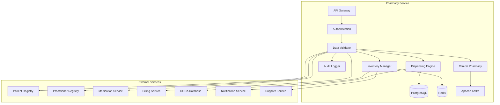

# MS Pharmacy Service

The Pharmacy Service manages pharmacy operations, medication dispensing, inventory management, and clinical pharmacy services with comprehensive Bangladesh DGDA integration.

## 📋 Service Overview

- **Repository**: [ms-pharmacy-service](https://github.com/zs-his/ms-pharmacy-service)
- **Status**: 🟡 In Progress
- **FHIR Resources**: MedicationDispense, MedicationAdministration, MedicationStatement
- **Primary Database**: PostgreSQL
- **Cache Layer**: Redis
- **Event Streaming**: Apache Kafka

## 🎯 Key Features

### Pharmacy Operations
- **Medication Dispensing**: Prescription processing and dispensing
- **Inventory Management**: Stock tracking, expiry monitoring, reorder points
- **Clinical Pharmacy**: Drug therapy monitoring and clinical interventions
- **Compounding**: Custom medication preparation
- **Patient Counseling**: Medication counseling and education

### Bangladesh-Specific Features
- **DGDA Integration**: Directorate General of Drug Administration
- **Generic Drug Promotion**: Bangladesh generic drug policy
- **Price Control**: Government-mandated drug pricing
- **Local Drug Database**: Bangladesh-registered medications
- **Quality Assurance**: Bangladesh pharmaceutical quality standards

## 🏗️ Architecture



## 📊 Database Schema

### Medication Dispense Table
```sql
CREATE TABLE medication_dispenses (
    id UUID PRIMARY KEY DEFAULT gen_random_uuid(),
    dispense_id VARCHAR(50) UNIQUE NOT NULL,
    patient_id UUID NOT NULL,
    encounter_id UUID REFERENCES encounters(id),
    status VARCHAR(20) NOT NULL DEFAULT 'preparation',
    category JSONB NOT NULL,
    medication_reference UUID REFERENCES medications(id),
    subject_type VARCHAR(20) DEFAULT 'patient',
    subject_id UUID NOT NULL,
    encounter_reference UUID REFERENCES encounters(id),
    supporting_information JSONB,
    authorizing_prescription UUID REFERENCES medication_requests(id),
    quantity JSONB NOT NULL,
    days_supply INTEGER,
    when_prepared TIMESTAMP,
    when_handed_over TIMESTAMP,
    destination JSONB,
    receiver JSONB,
    dosage_instruction JSONB,
    substitution JSONB,
    detected_issue JSONB,
    event_history JSONB,
    not_performed_reason JSONB,
    performer JSONB,
    created_at TIMESTAMP DEFAULT CURRENT_TIMESTAMP,
    updated_at TIMESTAMP DEFAULT CURRENT_TIMESTAMP,
    metadata JSONB,
    FOREIGN KEY (patient_id) REFERENCES patients(id)
);
```

### Pharmacy Inventory Table
```sql
CREATE TABLE pharmacy_inventory (
    id UUID PRIMARY KEY DEFAULT gen_random_uuid(),
    inventory_id VARCHAR(50) UNIQUE NOT NULL,
    medication_id UUID REFERENCES medications(id),
    facility_id UUID REFERENCES organizations(id),
    location_id UUID REFERENCES locations(id),
    quantity_on_hand INTEGER NOT NULL DEFAULT 0,
    quantity_on_order INTEGER NOT NULL DEFAULT 0,
    reorder_level INTEGER NOT NULL DEFAULT 0,
    max_level INTEGER NOT NULL DEFAULT 0,
    expiry_date DATE,
    batch_number VARCHAR(50),
    manufacturer VARCHAR(200),
    supplier VARCHAR(200),
    cost_per_unit DECIMAL(10,2),
    selling_price DECIMAL(10,2),
    storage_location VARCHAR(100),
    storage_conditions JSONB,
    last_restocked TIMESTAMP,
    last_dispensed TIMESTAMP,
    created_at TIMESTAMP DEFAULT CURRENT_TIMESTAMP,
    updated_at TIMESTAMP DEFAULT CURRENT_TIMESTAMP,
    metadata JSONB
);
```

### Clinical Pharmacy Table
```sql
CREATE TABLE clinical_pharmacy_interventions (
    id UUID PRIMARY KEY DEFAULT gen_random_uuid(),
    intervention_id VARCHAR(50) UNIQUE NOT NULL,
    patient_id UUID NOT NULL,
    encounter_id UUID REFERENCES encounters(id),
    intervention_type VARCHAR(50) NOT NULL,
    intervention_category VARCHAR(50),
    medication_reference UUID REFERENCES medications(id),
    issue_identified TEXT NOT NULL,
    recommendation TEXT NOT NULL,
    outcome TEXT,
    status VARCHAR(20) DEFAULT 'pending',
    priority VARCHAR(20) DEFAULT 'medium',
    pharmacist JSONB,
    prescriber JSONB,
    created_at TIMESTAMP DEFAULT CURRENT_TIMESTAMP,
    updated_at TIMESTAMP DEFAULT CURRENT_TIMESTAMP,
    metadata JSONB,
    FOREIGN KEY (patient_id) REFERENCES patients(id)
);
```

## 🔌 API Endpoints

### Medication Dispensing
```go
// Create medication dispense
POST /api/pharmacy/dispenses
{
  "status": "preparation",
  "category": [{"coding": [{"code": "outpatient"}]}],
  "medicationReference": {"reference": "Medication/12345"},
  "subject": {"reference": "Patient/67890"},
  "encounter": {"reference": "Encounter/111"},
  "authorizingPrescription": {"reference": "MedicationRequest/222"},
  "quantity": {
    "value": 30,
    "unit": "Tablet",
    "system": "http://unitsofmeasure.org",
    "code": "{Tablet}"
  },
  "daysSupply": 10,
  "whenPrepared": "2026-01-21T10:30:00+06:00",
  "whenHandedOver": "2026-01-21T11:00:00+06:00",
  "destination": {
    "reference": "Patient/67890",
    "display": "Patient"
  },
  "receiver": {
    "reference": "Patient/67890",
    "display": "John Doe"
  },
  "dosageInstruction": [{
    "sequence": 1,
    "text": "Take 1 tablet twice daily with meals",
    "timing": {
      "repeat": {
        "frequency": 2,
        "period": 1,
        "periodUnit": "d"
      }
    },
    "route": {
      "coding": [{
        "system": "http://snomed.info/sct",
        "code": "26643006",
        "display": "Oral route"
      }]
    },
    "doseAndRate": [{
      "type": {
        "coding": [{
          "system": "http://terminology.hl7.org/CodeSystem/dose-rate-type",
          "code": "ordered",
          "display": "Ordered"
        }]
      },
      "doseQuantity": {
        "value": 1,
        "unit": "Tablet",
        "system": "http://unitsofmeasure.org",
        "code": "{Tablet}"
      }
    }]
  }],
  "performer": [{
    "function": {
      "coding": [{
        "system": "http://terminology.hl7.org/CodeSystem/v3-ParticipationType",
        "code": "DISP",
        "display": "Dispenser"
      }]
    },
    "actor": {
      "reference": "Practitioner/333",
      "display": "Pharmacist Jane Smith"
    }
  }]
}

// Get dispense by ID
GET /api/pharmacy/dispenses/{id}

// Search dispenses
GET /api/pharmacy/dispenses?patient=67890&status=completed&date=2026-01-21

// Update dispense status
PUT /api/pharmacy/dispenses/{id}/status
{
  "status": "completed",
  "whenHandedOver": "2026-01-21T11:00:00+06:00",
  "receiver": {
    "reference": "Patient/67890",
    "display": "John Doe"
  }
}
```

### Inventory Management
```go
// Get inventory levels
GET /api/pharmacy/inventory?medication=12345&location=pharmacy-1

// Update inventory
PUT /api/pharmacy/inventory/{inventoryId}
{
  "quantityOnHand": 150,
  "reorderLevel": 50,
  "maxLevel": 500,
  "costPerUnit": 2.50,
  "sellingPrice": 3.00
}

// Stock adjustment
POST /api/pharmacy/inventory/{inventoryId}/adjustment
{
  "adjustmentType": "increase",
  "quantity": 100,
  "reason": "New stock received",
  "batchNumber": "PAR-2024-002",
  "expiryDate": "2026-12-31",
  "supplier": "Square Pharmaceuticals",
  "performedBy": {
    "reference": "Practitioner/333",
    "display": "Pharmacist Jane Smith"
  }
}

// Get low stock alerts
GET /api/pharmacy/inventory/low-stock?facility=hospital-1

// Get expiring medications
GET /api/pharmacy/inventory/expiring?days=30&facility=hospital-1
```

### Clinical Pharmacy
```go
// Create clinical intervention
POST /api/pharmacy/clinical/interventions
{
  "interventionType": "drug_interaction",
  "interventionCategory": "clinical_review",
  "patient": {"reference": "Patient/12345"},
  "encounter": {"reference": "Encounter/67890"},
  "medicationReference": {"reference": "Medication/111"},
  "issueIdentified": "Potential interaction between Warfarin and Amoxicillin",
  "recommendation": "Monitor INR more frequently during Amoxicillin therapy",
  "priority": "high",
  "pharmacist": {
    "reference": "Practitioner/222",
    "display": "Clinical Pharmacist John Doe"
  },
  "prescriber": {
    "reference": "Practitioner/333",
    "display": "Dr. Jane Smith"
  }
}

// Get patient interventions
GET /api/pharmacy/clinical/interventions?patient=12345&status=pending

// Update intervention outcome
PUT /api/pharmacy/clinical/interventions/{id}/outcome
{
  "outcome": "INR monitoring increased to twice weekly",
  "status": "completed",
  "resolvedBy": {
    "reference": "Practitioner/333",
    "display": "Dr. Jane Smith"
  }
}

// Get drug interaction alerts
GET /api/pharmacy/clinical/interactions?patient=12345&severity=high
```

## 🏥 Bangladesh Pharmacy Features

### Generic Drug Policy
```go
type GenericDrugPolicy struct {
    RequireGenericPrescription bool     `json:"require_generic_prescription"`
    AllowBrandSubstitution     bool     `json:"allow_brand_substitution"`
    GenericFirst               bool     `json:"generic_first"`
    PriceControl               bool     `json:"price_control"`
    EssentialMedicines         []string `json:"essential_medicines"`
    MaximumMarkup              float64  `json:"maximum_markup"`
}

var BangladeshGenericPolicy = GenericDrugPolicy{
    RequireGenericPrescription: true,
    AllowBrandSubstitution:     true,
    GenericFirst:               true,
    PriceControl:               true,
    EssentialMedicines: []string{
        "Paracetamol",
        "Amoxicillin",
        "Ibuprofen",
        "Omeprazole",
        "Metformin",
        "Amlodipine",
        "Atenolol",
        "Salbutamol",
        "Ranitidine",
        "Ciprofloxacin",
    },
    MaximumMarkup: 0.15, // 15% maximum markup
}
```

### Essential Medicines List
```go
var BangladeshEssentialMedicines = map[string]EssentialMedicine{
    "PARACETAMOL": {
        GenericName:    "Paracetamol",
        BrandNames:     []string{"Paracip", "Tylenol", "Napa"},
        Strength:       "500mg",
        Form:           "Tablet",
        Category:       "Analgesic, Antipyretic",
        PriceControl:   true,
        MaxPrice:       2.50,
        Essential:       true,
        DGDARegistered:  true,
    },
    "AMOXICILLIN": {
        GenericName:    "Amoxicillin",
        BrandNames:     []string{"Amoxil", "Mox", "Novamox"},
        Strength:       "500mg",
        Form:           "Capsule",
        Category:       "Antibiotic",
        PriceControl:   true,
        MaxPrice:       8.00,
        Essential:       true,
        DGDARegistered:  true,
        PrescriptionRequired: true,
    },
    "IBUPROFEN": {
        GenericName:    "Ibuprofen",
        BrandNames:     []string{"Brufen", "Advil", "Motrin"},
        Strength:       "400mg",
        Form:           "Tablet",
        Category:       "NSAID",
        PriceControl:   true,
        MaxPrice:       3.00,
        Essential:       true,
        DGDARegistered:  true,
    },
    "SALBUTAMOL": {
        GenericName:    "Salbutamol",
        BrandNames:     []string{"Ventolin", "Asthmol"},
        Strength:       "100mcg",
        Form:           "Inhaler",
        Category:       "Bronchodilator",
        PriceControl:   true,
        MaxPrice:       50.00,
        Essential:       true,
        DGDARegistered:  true,
        PrescriptionRequired: true,
    },
}

type EssentialMedicine struct {
    GenericName           string   `json:"generic_name"`
    BrandNames           []string `json:"brand_names"`
    Strength             string   `json:"strength"`
    Form                 string   `json:"form"`
    Category             string   `json:"category"`
    PriceControl         bool     `json:"price_control"`
    MaxPrice             float64  `json:"max_price"`
    Essential            bool     `json:"essential"`
    DGDARegistered      bool     `json:"dgda_registered"`
    PrescriptionRequired bool     `json:"prescription_required"`
}
```

## 🔍 Search and Filtering

### Advanced Dispense Search
```go
type DispenseSearchCriteria struct {
    PatientID       string    `json:"patient_id"`
    EncounterID     string    `json:"encounter_id"`
    Status          string    `json:"status"`
    Category        string    `json:"category"`
    MedicationID    string    `json:"medication_id"`
    PerformerID     string    `json:"performer_id"`
    DateFrom        time.Time `json:"date_from"`
    DateTo          time.Time `json:"date_to"`
    FacilityID      string    `json:"facility_id"`
    LocationID      string    `json:"location_id"`
}

func (s *PharmacyService) SearchDispenses(criteria DispenseSearchCriteria) ([]MedicationDispense, error) {
    query := s.db.NewSelect().Model(&MedicationDispense{})
    
    if criteria.PatientID != "" {
        query = query.Where("patient_id = ?", criteria.PatientID)
    }
    
    if criteria.Status != "" {
        query = query.Where("status = ?", criteria.Status)
    }
    
    if criteria.MedicationID != "" {
        query = query.Where("medication_reference = ?", criteria.MedicationID)
    }
    
    if !criteria.DateFrom.IsZero() {
        query = query.Where("when_prepared >= ?", criteria.DateFrom)
    }
    
    if !criteria.DateTo.IsZero() {
        query = query.Where("when_prepared <= ?", criteria.DateTo)
    }
    
    var dispenses []MedicationDispense
    err := query.Scan(ctx, &dispenses)
    return dispenses, err
}
```

## 📈 Performance Optimization

### Caching Strategy
```go
// Cache inventory levels for 15 minutes
func (s *PharmacyService) GetInventoryLevels(facilityID string) ([]PharmacyInventory, error) {
    cacheKey := fmt.Sprintf("inventory_levels:%s", facilityID)
    
    if cached, err := s.cache.Get(cacheKey); err == nil {
        return cached.([]PharmacyInventory), nil
    }
    
    inventory, err := s.repository.GetByFacility(facilityID)
    if err != nil {
        return nil, err
    }
    
    s.cache.Set(cacheKey, inventory, 15*time.Minute)
    return inventory, nil
}

// Cache essential medicines for 2 hours
func (s *PharmacyService) GetEssentialMedicines() ([]EssentialMedicine, error) {
    cacheKey := "essential_medicines"
    
    if cached, err := s.cache.Get(cacheKey); err == nil {
        return cached.([]EssentialMedicine), nil
    }
    
    medicines, err := s.repository.GetEssentialMedicines()
    if err != nil {
        return nil, err
    }
    
    s.cache.Set(cacheKey, medicines, 2*time.Hour)
    return medicines, nil
}
```

### Database Indexing
```sql
-- Performance indexes
CREATE INDEX idx_medication_dispenses_patient ON medication_dispenses(patient_id);
CREATE INDEX idx_medication_dispenses_status ON medication_dispenses(status);
CREATE INDEX idx_medication_dispenses_medication ON medication_dispenses(medication_reference);
CREATE INDEX idx_medication_dispenses_when_prepared ON medication_dispenses(when_prepared);
CREATE INDEX idx_pharmacy_inventory_medication ON pharmacy_inventory(medication_id);
CREATE INDEX idx_pharmacy_inventory_facility ON pharmacy_inventory(facility_id);
CREATE INDEX idx_pharmacy_inventory_quantity ON pharmacy_inventory(quantity_on_hand);
CREATE INDEX idx_pharmacy_inventory_expiry ON pharmacy_inventory(expiry_date);
CREATE INDEX idx_clinical_interventions_patient ON clinical_pharmacy_interventions(patient_id);
CREATE INDEX idx_clinical_interventions_status ON clinical_pharmacy_interventions(status);
```

## 💊 Dispensing Engine

### Automated Dispensing Process
```go
type DispensingProcess struct {
    DispenseID     string    `json:"dispense_id"`
    PatientID      string    `json:"patient_id"`
    PrescriptionID string    `json:"prescription_id"`
    Status         string    `json:"status"`
    Steps          []ProcessStep `json:"steps"`
    CurrentStep    int       `json:"current_step"`
    StartedAt      time.Time `json:"started_at"`
    CompletedAt    time.Time `json:"completed_at"`
    PerformedBy    string    `json:"performed_by"`
}

type ProcessStep struct {
    StepID      string    `json:"step_id"`
    StepName    string    `json:"step_name"`
    Status      string    `json:"status"`
    StartedAt   time.Time `json:"started_at"`
    CompletedAt time.Time `json:"completed_at"`
    PerformedBy  string    `json:"performed_by"`
    Notes       string    `json:"notes"`
}

func (s *PharmacyService) ProcessDispensing(prescriptionID string) (*DispensingProcess, error) {
    // Get prescription
    prescription, err := s.medicationService.GetPrescription(prescriptionID)
    if err != nil {
        return nil, err
    }
    
    // Create dispensing process
    process := &DispensingProcess{
        DispenseID:     generateID(),
        PatientID:      prescription.PatientID,
        PrescriptionID: prescriptionID,
        Status:         "in_progress",
        CurrentStep:    0,
        StartedAt:      time.Now(),
        PerformedBy:    getCurrentUserID(),
    }
    
    // Define dispensing steps
    steps := []ProcessStep{
        {StepID: "verify", StepName: "Verify Prescription"},
        {StepID: "check_inventory", StepName: "Check Inventory"},
        {StepID: "prepare", StepName: "Prepare Medication"},
        {StepID: "quality_check", StepName: "Quality Check"},
        {StepID: "package", StepName: "Package Medication"},
        {StepID: "counsel", StepName: "Patient Counseling"},
        {StepID: "dispense", StepName: "Dispense Medication"},
    }
    
    // Execute steps
    for i, step := range steps {
        process.CurrentStep = i
        step.StartedAt = time.Now()
        step.PerformedBy = getCurrentUserID()
        
        // Execute step
        err = s.executeDispensingStep(step, prescription)
        if err != nil {
            step.Status = "failed"
            step.Notes = err.Error()
            process.Status = "failed"
            return process, err
        }
        
        step.Status = "completed"
        step.CompletedAt = time.Now()
        process.Steps = append(process.Steps, step)
    }
    
    // Complete process
    process.Status = "completed"
    process.CompletedAt = time.Now()
    
    return process, nil
}

func (s *PharmacyService) executeDispensingStep(step ProcessStep, prescription MedicationRequest) error {
    switch step.StepID {
    case "verify":
        return s.verifyPrescription(prescription)
    case "check_inventory":
        return s.checkInventoryAvailability(prescription)
    case "prepare":
        return s.prepareMedication(prescription)
    case "quality_check":
        return s.performQualityCheck(prescription)
    case "package":
        return s.packageMedication(prescription)
    case "counsel":
        return s.counselPatient(prescription)
    case "dispense":
        return s.completeDispensing(prescription)
    default:
        return fmt.Errorf("unknown dispensing step: %s", step.StepID)
    }
}
```

## 🏪 Inventory Management

### Stock Management
```go
type StockAlert struct {
    InventoryID    string    `json:"inventory_id"`
    MedicationName  string    `json:"medication_name"`
    CurrentStock    int       `json:"current_stock"`
    ReorderLevel    int       `json:"reorder_level"`
    AlertType       string    `json:"alert_type"`
    Severity        string    `json:"severity"`
    FacilityID      string    `json:"facility_id"`
    LocationID      string    `json:"location_id"`
    CreatedAt       time.Time `json:"created_at"`
    Resolved        bool      `json:"resolved"`
}

func (s *PharmacyService) GenerateStockAlerts() ([]StockAlert, error) {
    var alerts []StockAlert
    
    // Get all inventory items
    inventory, err := s.repository.GetAllInventory()
    if err != nil {
        return nil, err
    }
    
    for _, item := range inventory {
        // Check for low stock
        if item.QuantityOnHand <= item.ReorderLevel {
            alert := StockAlert{
                InventoryID:   item.InventoryID,
                MedicationName: s.getMedicationName(item.MedicationID),
                CurrentStock:  item.QuantityOnHand,
                ReorderLevel:  item.ReorderLevel,
                AlertType:    "low_stock",
                Severity:      "high",
                FacilityID:    item.FacilityID,
                LocationID:    item.LocationID,
                CreatedAt:     time.Now(),
                Resolved:      false,
            }
            alerts = append(alerts, alert)
        }
        
        // Check for expired medications
        if item.ExpiryDate != nil && time.Until(*item.ExpiryDate) <= 30*24*time.Hour {
            alert := StockAlert{
                InventoryID:   item.InventoryID,
                MedicationName: s.getMedicationName(item.MedicationID),
                CurrentStock:  item.QuantityOnHand,
                AlertType:    "expiring_soon",
                Severity:      "medium",
                FacilityID:    item.FacilityID,
                LocationID:    item.LocationID,
                CreatedAt:     time.Now(),
                Resolved:      false,
            }
            alerts = append(alerts, alert)
        }
        
        // Check for expired medications
        if item.ExpiryDate != nil && time.Until(*item.ExpiryDate) <= 0 {
            alert := StockAlert{
                InventoryID:   item.InventoryID,
                MedicationName: s.getMedicationName(item.MedicationID),
                CurrentStock:  item.QuantityOnHand,
                AlertType:    "expired",
                Severity:      "critical",
                FacilityID:    item.FacilityID,
                LocationID:    item.LocationID,
                CreatedAt:     time.Now(),
                Resolved:      false,
            }
            alerts = append(alerts, alert)
        }
    }
    
    return alerts, nil
}
```

## 🔒 Security Features

### Access Control
```go
func (s *PharmacyService) CanAccessPharmacyData(userID, dispenseID string, action string) bool {
    // Check user permissions
    permissions := s.authService.GetUserPermissions(userID)
    
    switch action {
    case "read":
        return permissions.Contains("pharmacy.read") || 
               s.canViewPatientPharmacyData(userID, dispenseID)
    case "write":
        return permissions.Contains("pharmacy.write") || 
               s.isPharmacyPersonnel(userID)
    case "dispense":
        return permissions.Contains("pharmacy.disense") || 
               s.isQualifiedPharmacist(userID)
    case "clinical":
        return permissions.Contains("pharmacy.clinical") || 
               s.isClinicalPharmacist(userID)
    default:
        return false
    }
}

func (s *PharmacyService) isPharmacyPersonnel(userID string) bool {
    practitioner, err := s.practitionerService.GetPractitionerByUser(userID)
    if err != nil {
        return false
    }
    
    // Check if practitioner has pharmacy specialization
    for _, role := range practitioner.Roles {
        if role.Specialty == "pharmacy" || 
           role.Specialty == "clinical_pharmacy" {
            return true
        }
    }
    
    return false
}
```

### Data Privacy
```go
func (s *PharmacyService) anonymizeSensitiveDispenses(dispenses []MedicationDispense, requestUserID string) []MedicationDispense {
    // Check if requester has full access
    if s.authService.HasFullAccess(requestUserID) {
        return dispenses
    }
    
    // Anonymize sensitive medication data (reproductive health, mental health, etc.)
    var anonymized []MedicationDispense
    for _, dispense := range dispenses {
        if s.isSensitiveMedication(dispense) {
            // Remove sensitive details
            dispense.DosageInstruction = nil
            dispense.Receiver = nil
            dispense.Destination = nil
        }
        anonymized = append(anonymized, dispense)
    }
    
    return anonymized
}

func (s *PharmacyService) isSensitiveMedication(dispense MedicationDispense) bool {
    sensitiveMedications := []string{
        "contraceptive",
        "antidepressant",
        "antipsychotic",
        // Add more sensitive medication categories
    }
    
    medication, err := s.medicationService.GetMedication(dispense.MedicationReference.Reference)
    if err != nil {
        return false
    }
    
    for _, category := range sensitiveMedications {
        if strings.Contains(strings.ToLower(medication.TherapeuticClass), category) {
            return true
        }
    }
    
    return false
}
```

## 📊 Monitoring and Metrics

### Health Checks
```go
func (s *PharmacyService) HealthCheck() map[string]interface{} {
    return map[string]interface{}{
        "database":           s.checkDatabase(),
        "cache":              s.checkCache(),
        "kafka":              s.checkKafka(),
        "dispensing_engine":  s.checkDispensingEngine(),
        "inventory_manager":  s.checkInventoryManager(),
        "clinical_pharmacy":  s.checkClinicalPharmacy(),
        "dghs_integration":   s.checkDGHSIntegration(),
        "patient_service":   s.checkPatientService(),
        "timestamp":         time.Now(),
    }
}
```

### Performance Metrics
```go
// Prometheus metrics
var (
    pharmacyRequestsTotal = prometheus.NewCounterVec(
        prometheus.CounterOpts{
            Name: "pharmacy_requests_total",
            Help: "Total number of pharmacy requests",
        },
        []string{"method", "endpoint", "status"},
    )
    
    dispensingTime = prometheus.NewHistogramVec(
        prometheus.HistogramOpts{
            Name: "pharmacy_dispensing_time_seconds",
            Help: "Time taken to complete medication dispensing",
        },
        []string{"medication_type", "facility"},
    )
    
    stockAlertsTotal = prometheus.NewCounterVec(
        prometheus.CounterOpts{
            Name: "pharmacy_stock_alerts_total",
            Help: "Total number of stock alerts generated",
        },
        []string{"alert_type", "severity"},
    )
)
```

## 🧪 Testing

### Unit Tests
```go
func TestPharmacyService_CreateMedicationDispense(t *testing.T) {
    service := NewPharmacyService(mockRepo, mockCache, mockDispensing)
    dispense := &MedicationDispense{
        Status:    "preparation",
        Category:  []Code{{Coding: []Coding{{Code: "outpatient"}}}},
        MedicationReference: Reference{Reference: "Medication/12345"},
        PatientID: "patient-67890",
        EncounterReference: "encounter-111",
        Quantity: Quantity{Value: 30, Unit: "Tablet"},
        DaysSupply: 10,
        WhenPrepared: time.Now(),
        DosageInstruction: []DosageInstruction{{
            Sequence: 1,
            Text: "Take 1 tablet twice daily",
            Route: Code{Coding: []Coding{{Code: "26643006", Display: "Oral route"}}},
            DoseAndRate: []DoseAndRate{{
                DoseQuantity: Quantity{Value: 1, Unit: "Tablet"},
            }},
        }},
        Performer: []Performer{{
            Function: Code{Coding: []Coding{{Code: "DISP", Display: "Dispenser"}}},
            Actor: Reference{Reference: "Practitioner/333"},
        }},
    }
    
    result, err := service.CreateMedicationDispense(dispense)
    
    assert.NoError(t, err)
    assert.NotNil(t, result)
    assert.NotEmpty(t, result.ID)
    assert.Equal(t, "preparation", result.Status)
    assert.Equal(t, "patient-67890", result.PatientID)
}
```

## 🚀 Deployment

### Docker Configuration
```dockerfile
FROM golang:1.25-alpine AS builder

WORKDIR /app
COPY go.mod go.sum ./
RUN go mod download

COPY . .
RUN CGO_ENABLED=0 GOOS=linux go build -o main cmd/server/main.go

FROM alpine:latest
RUN apk --no-cache add ca-certificates
WORKDIR /root/
COPY --from=builder /app/main .
EXPOSE 8080
CMD ["./main"]
```

### Kubernetes Deployment
```yaml
apiVersion: apps/v1
kind: Deployment
metadata:
  name: ms-pharmacy-service
spec:
  replicas: 3
  selector:
    matchLabels:
      app: ms-pharmacy-service
  template:
    metadata:
      labels:
        app: ms-pharmacy-service
    spec:
      containers:
      - name: ms-pharmacy-service
        image: zarish-his/ms-pharmacy-service:latest
        ports:
        - containerPort: 8080
        env:
        - name: DB_HOST
          value: "postgresql-service"
        - name: REDIS_HOST
          value: "redis-service"
        - name: KAFKA_BROKERS
          value: "kafka-service:9092"
        - name: DGDA_SERVICE_URL
          value: "https://dgda.gov.bd/api"
```

## 🔗 Related Resources

- **Frontend Integration**: [ESM Pharmacy](../frontend/esm-pharmacy.md)
- **FHIR Implementation**: [FHIR MedicationDispense Profile](../fhir/medication-dispense-profile.md)
- **API Documentation**: [Pharmacy API Reference](../api-reference/rest-apis.md)

---

*Last updated: 2026-01-21*
