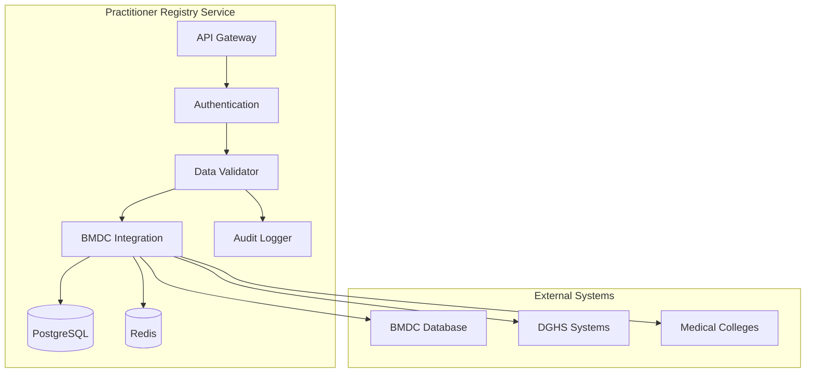

# MS Practitioner Registry

The Practitioner Registry Service manages healthcare provider information, credentials, and professional details with BMDC integration and Bangladesh healthcare context.

## 📋 Service Overview

- **Repository**: [ms-practitioner-registry](https://github.com/zs-his/ms-practitioner-registry)
- **Status**: 🟡 In Progress
- **FHIR Resources**: Practitioner, PractitionerRole, RelatedPerson
- **Primary Database**: PostgreSQL
- **Cache Layer**: Redis

## 🎯 Key Features

### Practitioner Management
- **Registration**: Healthcare provider registration and verification
- **Credentials**: Professional credentials and certifications
- **Specializations**: Medical specialties and sub-specialties
- **Employment**: Employment history and current positions
- **Scheduling**: Availability and working hours

### Bangladesh-Specific Features
- **BMDC Integration**: Bangladesh Medical and Dental Council verification
- **Local Specializations**: Bangladesh-recognized medical specialties
- **Government Registration**: DGHS practitioner registration
- **Regional Context**: Local healthcare system integration

## 🏗️ Architecture



## 📊 Database Schema

### Practitioner Table
```sql
CREATE TABLE practitioners (
    id UUID PRIMARY KEY DEFAULT gen_random_uuid(),
    practitioner_id VARCHAR(50) UNIQUE NOT NULL,
    first_name VARCHAR(100) NOT NULL,
    last_name VARCHAR(100) NOT NULL,
    middle_name VARCHAR(100),
    birth_date DATE,
    gender VARCHAR(20),
    bmdc_number VARCHAR(20) UNIQUE,
    bmdc_registration_date DATE,
    bmdc_expiry_date DATE,
    primary_specialization VARCHAR(100),
    secondary_specialization VARCHAR(100),
    qualification JSONB,
    experience_years INTEGER,
    mobile_phone VARCHAR(20),
    email VARCHAR(100),
    address JSONB,
    employment_status VARCHAR(20),
    current_facility UUID,
    created_at TIMESTAMP DEFAULT CURRENT_TIMESTAMP,
    updated_at TIMESTAMP DEFAULT CURRENT_TIMESTAMP,
    is_active BOOLEAN DEFAULT true,
    metadata JSONB
);
```

### Practitioner Roles
```sql
CREATE TABLE practitioner_roles (
    id UUID PRIMARY KEY DEFAULT gen_random_uuid(),
    practitioner_id UUID REFERENCES practitioners(id),
    organization_id UUID,
    role_code VARCHAR(50) NOT NULL,
    role_display VARCHAR(100) NOT NULL,
    specialty_code VARCHAR(50),
    period JSONB,
    active BOOLEAN DEFAULT true,
    created_at TIMESTAMP DEFAULT CURRENT_TIMESTAMP
);
```

## 🔌 API Endpoints

### Practitioner CRUD Operations
```go
// Create new practitioner
POST /api/practitioners
{
  "name": [{"given": ["Dr. John"], "family": "Doe"}],
  "gender": "male",
  "birthDate": "1980-01-01",
  "qualification": [{
    "code": "MBBS",
    "display": "Bachelor of Medicine, Bachelor of Surgery"
  }],
  "identifier": [{
    "type": {"coding": [{"code": "BMDC"}]},
    "value": "BMDC123456"
  }]
}

// Get practitioner by ID
GET /api/practitioners/{id}

// Search practitioners
GET /api/practitioners?name=John&specialty=Cardiology&facility=Hospital

// Update practitioner
PUT /api/practitioners/{id}

// Delete practitioner (soft delete)
DELETE /api/practitioners/{id}
```

### BMDC Verification
```go
// Verify BMDC registration
POST /api/practitioners/verify-bmdc
{
  "bmdc_number": "BMDC123456",
  "date_of_birth": "1980-01-01",
  "name": "Dr. John Doe"
}

// Response
{
  "verified": true,
  "details": {
    "name": "Dr. John Doe",
    "registration_date": "2005-01-01",
    "expiry_date": "2025-12-31",
    "qualification": "MBBS",
    "specialization": "Internal Medicine",
    "status": "Active"
  }
}
```

## 🔍 Search and Filtering

### Advanced Practitioner Search
```go
type PractitionerSearchCriteria struct {
    Name              string   `json:"name"`
    Specialization    string   `json:"specialization"`
    Facility          string   `json:"facility"`
    Gender            string   `json:"gender"`
    AvailableFromDate string   `json:"available_from_date"`
    AvailableToDate   string   `json:"available_to_date"`
    Languages         []string `json:"languages"`
    ExperienceMin     int      `json:"experience_min"`
    ExperienceMax     int      `json:"experience_max"`
}

func (s *PractitionerService) SearchPractitioners(criteria PractitionerSearchCriteria) ([]Practitioner, error) {
    query := s.db.NewSelect().Model(&Practitioner{})
    
    if criteria.Name != "" {
        query = query.Where("first_name ILIKE ? OR last_name ILIKE ?", 
            "%"+criteria.Name+"%", "%"+criteria.Name+"%")
    }
    
    if criteria.Specialization != "" {
        query = query.Where("primary_specialization = ?", criteria.Specialization)
    }
    
    if criteria.ExperienceMin > 0 {
        query = query.Where("experience_years >= ?", criteria.ExperienceMin)
    }
    
    var practitioners []Practitioner
    err := query.Scan(ctx, &practitioners)
    return practitioners, err
}
```

## 🏥 Bangladesh Medical Specializations

### Local Specialization Codes
```go
var BangladeshSpecializations = map[string]string{
    "internal-medicine":   "Internal Medicine",
    "cardiology":          "Cardiology",
    "pediatrics":          "Pediatrics",
    "obstetrics-gynecology": "Obstetrics & Gynecology",
    "surgery-general":     "General Surgery",
    "orthopedics":         "Orthopedics",
    "psychiatry":          "Psychiatry",
    "dermatology":         "Dermatology",
    "radiology":           "Radiology",
    "pathology":           "Pathology",
    "anesthesiology":      "Anesthesiology",
    "ent":                 "ENT (Otorhinolaryngology)",
    "ophthalmology":       "Ophthalmology",
    "pulmonology":         "Pulmonology",
    "nephrology":          "Nephrology",
    "gastroenterology":    "Gastroenterology",
    "endocrinology":       "Endocrinology",
    "neurology":           "Neurology",
    "neurosurgery":        "Neurosurgery",
    "pediatric-surgery":   "Pediatric Surgery",
    "plastic-surgery":     "Plastic Surgery",
    "urology":             "Urology",
}
```

## 📈 Performance Optimization

### Caching Strategy
```go
// Cache practitioner data for 30 minutes
func (s *PractitionerService) GetPractitioner(id string) (*Practitioner, error) {
    cacheKey := fmt.Sprintf("practitioner:%s", id)
    
    // Try cache first
    if cached, err := s.cache.Get(cacheKey); err == nil {
        return cached.(*Practitioner), nil
    }
    
    // Get from database
    practitioner, err := s.repository.GetByID(id)
    if err != nil {
        return nil, err
    }
    
    // Cache for 30 minutes
    s.cache.Set(cacheKey, practitioner, 30*time.Minute)
    return practitioner, nil
}
```

### Database Indexing
```sql
-- Performance indexes
CREATE INDEX idx_practitioners_name ON practitioners USING gin(to_tsvector('english', first_name || ' ' || last_name));
CREATE INDEX idx_practitioners_bmdc ON practitioners(bmdc_number);
CREATE INDEX idx_practitioners_specialization ON practitioners(primary_specialization);
CREATE INDEX idx_practitioners_facility ON practitioners(current_facility);
CREATE INDEX idx_practitioners_active ON practitioners(is_active);
CREATE INDEX idx_practitioner_roles_practitioner ON practitioner_roles(practitioner_id);
CREATE INDEX idx_practitioner_roles_organization ON practitioner_roles(organization_id);
```

## 🔒 Security Features

### Data Protection
```go
// Encrypt sensitive practitioner data
func (s *PractitionerService) encryptSensitiveData(practitioner *Practitioner) error {
    if practitioner.MobilePhone != "" {
        encrypted, err := s.crypto.Encrypt(practitioner.MobilePhone)
        if err != nil {
            return err
        }
        practitioner.MobilePhone = encrypted
    }
    
    if practitioner.Email != "" {
        encrypted, err := s.crypto.Encrypt(practitioner.Email)
        if err != nil {
            return err
        }
        practitioner.Email = encrypted
    }
    
    return nil
}
```

### BMDC Data Validation
```go
func (s *PractitionerService) ValidateBMDCRegistration(bmdcNumber, name, dob string) error {
    // Format validation
    if !regexp.MustCompile(`^BMDC\d{6}$`).MatchString(bmdcNumber) {
        return errors.New("invalid BMDC number format")
    }
    
    // External verification
    verification, err := s.bmdcService.VerifyRegistration(bmdcNumber, name, dob)
    if err != nil {
        return fmt.Errorf("BMDC verification failed: %w", err)
    }
    
    if !verification.Valid {
        return errors.New("BMDC registration not found or invalid")
    }
    
    return nil
}
```

## 📊 Monitoring and Metrics

### Health Checks
```go
func (s *PractitionerService) HealthCheck() map[string]interface{} {
    return map[string]interface{}{
        "database":      s.checkDatabase(),
        "cache":         s.checkCache(),
        "bmdc_service":  s.checkBMDCService(),
        "dghs_service":  s.checkDGHSIntegration(),
        "timestamp":     time.Now(),
    }
}
```

### Performance Metrics
```go
// Prometheus metrics
var (
    practitionerRequestsTotal = prometheus.NewCounterVec(
        prometheus.CounterOpts{
            Name: "practitioner_requests_total",
            Help: "Total number of practitioner requests",
        },
        []string{"method", "endpoint", "status"},
    )
    
    bmdcVerificationTotal = prometheus.NewCounterVec(
        prometheus.CounterOpts{
            Name: "bmdc_verification_total",
            Help: "Total number of BMDC verifications",
        },
        []string{"result"},
    )
)
```

## 🧪 Testing

### Unit Tests
```go
func TestPractitionerService_CreatePractitioner(t *testing.T) {
    service := NewPractitionerService(mockRepo, mockCache, mockBMDC)
    practitioner := &Practitioner{
        Name:        []Name{{Given: []string{"Dr. John"}, Family: "Doe"}},
        Gender:      "male",
        BirthDate:   "1980-01-01",
        BMDCNumber:  "BMDC123456",
        Qualification: []Qualification{
            {Code: "MBBS", Display: "Bachelor of Medicine, Bachelor of Surgery"},
        },
    }
    
    result, err := service.CreatePractitioner(practitioner)
    
    assert.NoError(t, err)
    assert.NotNil(t, result)
    assert.NotEmpty(t, result.ID)
    assert.Equal(t, "Dr. John", result.Name[0].Given[0])
    assert.Equal(t, "Doe", result.Name[0].Family)
}
```

## 🚀 Deployment

### Docker Configuration
```dockerfile
FROM golang:1.25-alpine AS builder

WORKDIR /app
COPY go.mod go.sum ./
RUN go mod download

COPY . .
RUN CGO_ENABLED=0 GOOS=linux go build -o main cmd/server/main.go

FROM alpine:latest
RUN apk --no-cache add ca-certificates
WORKDIR /root/
COPY --from=builder /app/main .
EXPOSE 8080
CMD ["./main"]
```

### Kubernetes Deployment
```yaml
apiVersion: apps/v1
kind: Deployment
metadata:
  name: ms-practitioner-registry
spec:
  replicas: 3
  selector:
    matchLabels:
      app: ms-practitioner-registry
  template:
    metadata:
      labels:
        app: ms-practitioner-registry
    spec:
      containers:
      - name: ms-practitioner-registry
        image: zarish-his/ms-practitioner-registry:latest
        ports:
        - containerPort: 8080
        env:
        - name: DB_HOST
          value: "postgresql-service"
        - name: REDIS_HOST
          value: "redis-service"
        - name: BMDC_SERVICE_URL
          value: "https://bmdc.org.bd/api"
```

## 🔗 Related Resources

- **Frontend Integration**: [ESM Admin](../frontend/esm-admin.md)
- **FHIR Implementation**: [FHIR Practitioner Profile](../fhir/practitioner-profile.md)
- **API Documentation**: [Practitioner API Reference](../api-reference/rest-apis.md)

---

*Last updated: 2026-01-21*
