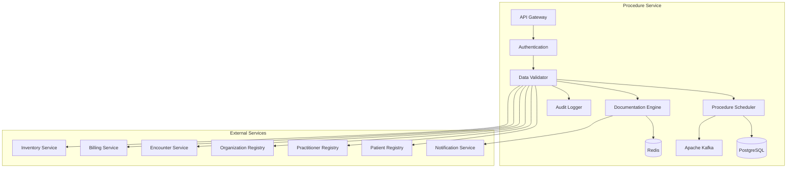

# MS Procedure Service

The Procedure Service manages medical procedures, surgical interventions, and clinical procedures with comprehensive scheduling, documentation, and Bangladesh healthcare context.

## 📋 Service Overview

- **Repository**: [ms-procedure-service](https://github.com/zs-his/ms-procedure-service)
- **Status**: 🟡 In Progress
- **FHIR Resources**: Procedure, ServiceRequest, Device
- **Primary Database**: PostgreSQL
- **Cache Layer**: Redis
- **Event Streaming**: Apache Kafka

## 🎯 Key Features

### Procedure Management
- **Surgical Procedures**: Operating room procedures and surgeries
- **Clinical Procedures**: Diagnostic and therapeutic procedures
- **Procedure Documentation**: Pre-operative, intra-operative, post-operative notes
- **Device Tracking**: Medical devices and implants used
- **Complication Recording**: Procedure complications and outcomes

### Bangladesh-Specific Features
- **Common Procedures**: High-volume procedures in Bangladesh
- **Resource Optimization**: Cost-effective procedure selection
- **Training Context**: Medical education and residency procedures
- **Quality Metrics**: Bangladesh-specific outcome tracking

## 🏗️ Architecture



## 📊 Database Schema

### Procedure Table
```sql
CREATE TABLE procedures (
    id UUID PRIMARY KEY DEFAULT gen_random_uuid(),
    procedure_id VARCHAR(50) UNIQUE NOT NULL,
    patient_id UUID NOT NULL,
    encounter_id UUID REFERENCES encounters(id),
    status VARCHAR(20) NOT NULL DEFAULT 'preparation',
    category JSONB NOT NULL,
    code JSONB NOT NULL,
    subject_type VARCHAR(20) DEFAULT 'patient',
    subject_id UUID NOT NULL,
    encounter_reference UUID REFERENCES encounters(id),
    performed_period JSONB,
    recorder JSONB,
    asserter JSONB,
    performer JSONB,
    location JSONB,
    reason_code JSONB,
    reason_reference JSONB,
    body_site JSONB,
    outcome JSONB,
    report JSONB,
    complication JSONB,
    follow_up JSONB,
    note JSONB,
    focal_device JSONB,
    used_code JSONB,
    created_at TIMESTAMP DEFAULT CURRENT_TIMESTAMP,
    updated_at TIMESTAMP DEFAULT CURRENT_TIMESTAMP,
    metadata JSONB,
    FOREIGN KEY (patient_id) REFERENCES patients(id)
);
```

### Procedure Code Table
```sql
CREATE TABLE procedure_codes (
    id UUID PRIMARY KEY DEFAULT gen_random_uuid(),
    code_system VARCHAR(100) NOT NULL,
    code VARCHAR(50) NOT NULL,
    display VARCHAR(500) NOT NULL,
    category VARCHAR(100),
    specialty VARCHAR(100),
    complexity VARCHAR(20),
    duration_minutes INTEGER,
    anesthesia_required BOOLEAN DEFAULT false,
    common_in_bangladesh BOOLEAN DEFAULT false,
    cost DECIMAL(10,2),
    resource_requirements JSONB,
    contraindications JSONB,
    complications JSONB,
    recovery_time_days INTEGER,
    is_active BOOLEAN DEFAULT true,
    created_at TIMESTAMP DEFAULT CURRENT_TIMESTAMP,
    updated_at TIMESTAMP DEFAULT CURRENT_TIMESTAMP
);
```

### Procedure Device Table
```sql
CREATE TABLE procedure_devices (
    id UUID PRIMARY KEY DEFAULT gen_random_uuid(),
    procedure_id UUID REFERENCES procedures(id) ON DELETE CASCADE,
    device_id UUID NOT NULL,
    device_type VARCHAR(50) NOT NULL,
    action VARCHAR(20) NOT NULL,
    manipulated BOOLEAN DEFAULT false,
    created_at TIMESTAMP DEFAULT CURRENT_TIMESTAMP
);
```

## 🔌 API Endpoints

### Procedure CRUD Operations
```go
// Create new procedure
POST /api/procedures
{
  "status": "preparation",
  "category": [{"coding": [{"code": "surgical"}]}],
  "code": {
    "coding": [{
      "system": "http://snomed.info/sct",
      "code": "80146002",
      "display": "Appendectomy"
    }]
  },
  "subject": {"reference": "Patient/12345"},
  "encounter": {"reference": "Encounter/67890"},
  "performedPeriod": {
    "start": "2026-01-21T09:00:00+06:00",
    "end": "2026-01-21T10:30:00+06:00"
  },
  "performer": [{
    "function": {
      "coding": [{
        "system": "http://snomed.info/sct",
        "code": "112247003",
        "display": "Surgeon"
      }]
    },
    "actor": {
      "reference": "Practitioner/111",
      "display": "Dr. John Doe"
    }
  }],
  "location": {
    "reference": "Location/222",
    "display": "Operating Room 1"
  },
  "reasonCode": [{
    "coding": [{
      "system": "http://snomed.info/sct",
      "code": "16346001",
      "display": "Acute appendicitis"
    }]
  }],
  "bodySite": [{
    "coding": [{
      "system": "http://snomed.info/sct",
      "code": "66754008",
      "display": "Appendix structure"
    }]
  }]
}

// Get procedure by ID
GET /api/procedures/{id}

// Search procedures
GET /api/procedures?patient=12345&status=completed&category=surgical

// Update procedure
PUT /api/procedures/{id}

// Complete procedure
POST /api/procedures/{id}/complete
{
  "status": "completed",
  "performedPeriod": {"end": "2026-01-21T10:30:00+06:00"},
  "outcome": {
    "coding": [{
      "system": "http://snomed.info/sct",
      "code": "385669000",
      "display": "Successful"
    }]
  },
  "complication": [],
  "followUp": "Return in 7 days for wound check"
}
```

### Procedure Scheduling
```go
// Schedule procedure
POST /api/procedures/schedule
{
  "procedureCode": "80146002",
  "patientId": "12345",
  "encounterId": "67890",
  "scheduledDate": "2026-01-21T09:00:00+06:00",
  "duration": 90,
  "locationId": "222",
  "performers": [
    {
      "role": "surgeon",
      "practitionerId": "111"
    },
    {
      "role": "anesthesiologist", 
      "practitionerId": "333"
    }
  ],
  "resources": [
    {
      "type": "operating_room",
      "resourceId": "OR-001"
    },
    {
      "type": "anesthesia_machine",
      "resourceId": "AM-001"
    }
  ]
}

// Get scheduled procedures
GET /api/procedures/scheduled?date=2026-01-21&location=OR-001

// Update procedure status
PUT /api/procedures/{id}/status
{
  "status": "in-progress",
  "timestamp": "2026-01-21T09:00:00+06:00"
}
```

### Procedure Documentation
```go
// Add procedure note
POST /api/procedures/{id}/notes
{
  "time": "2026-01-21T09:15:00+06:00",
  "author": {
    "reference": "Practitioner/111",
    "display": "Dr. John Doe"
  },
  "text": "Patient positioned supine. Standard appendectomy technique performed.",
  "noteType": "intra-operative"
}

// Add complication
POST /api/procedures/{id}/complications
{
  "complication": {
    "coding": [{
      "system": "http://snomed.info/sct",
      "code": "263726006",
      "display": "Postoperative hemorrhage"
    }]
  },
  "severity": "moderate",
  "detectedTime": "2026-01-21T11:00:00+06:00",
  "management": "Blood transfusion given, patient stabilized"
}

// Add device used
POST /api/procedures/{id}/devices
{
  "deviceId": "IMPLANT-001",
  "deviceType": "surgical_mesh",
  "action": "implanted",
  "manipulated": true
}
```

## 🏥 Bangladesh Procedure Codes

### Common Surgical Procedures
```go
var BangladeshCommonProcedures = map[string]ProcedureInfo{
    "APPENDECTOMY": {
        Code:           "80146002",
        Display:        "Appendectomy",
        Category:       "surgical",
        Specialty:      "general_surgery",
        Complexity:     "moderate",
        Duration:       90,
        Anesthesia:     true,
        CommonInBD:     true,
        Cost:           8000.00,
        RecoveryDays:   7,
    },
    "CESAREAN": {
        Code:           "1149608003",
        Display:        "Cesarean section",
        Category:       "surgical",
        Specialty:      "obstetrics_gynecology",
        Complexity:     "moderate",
        Duration:       120,
        Anesthesia:     true,
        CommonInBD:     true,
        Cost:           15000.00,
        RecoveryDays:   14,
    },
    "CATARACT": {
        Code:           "37894004",
        Display:        "Cataract extraction",
        Category:       "surgical",
        Specialty:      "ophthalmology",
        Complexity:     "low",
        Duration:       30,
        Anesthesia:     true,
        CommonInBD:     true,
        Cost:           5000.00,
        RecoveryDays:   3,
    },
    "Hernia_Repair": {
        Code:           "36724003",
        Display:        "Hernia repair",
        Category:       "surgical",
        Specialty:      "general_surgery",
        Complexity:     "low",
        Duration:       60,
        Anesthesia:     true,
        CommonInBD:     true,
        Cost:           6000.00,
        RecoveryDays:   5,
    },
    "Tubal_Ligation": {
        Code:           "58656001",
        Display:        "Tubal ligation",
        Category:       "surgical",
        Specialty:      "obstetrics_gynecology",
        Complexity:     "low",
        Duration:       45,
        Anesthesia:     true,
        CommonInBD:     true,
        Cost:           4000.00,
        RecoveryDays:   2,
    },
}
```

### Resource Requirements
```go
type ResourceRequirement struct {
    ResourceType string   `json:"resource_type"`
    Quantity     int      `json:"quantity"`
    Duration     int      `json:"duration_minutes"`
    Priority     string   `json:"priority"`
    Alternatives  []string `json:"alternatives"`
}

var ProcedureResourceRequirements = map[string][]ResourceRequirement{
    "APPENDECTOMY": {
        {ResourceType: "operating_room", Quantity: 1, Duration: 90, Priority: "high"},
        {ResourceType: "surgeon", Quantity: 1, Duration: 90, Priority: "high"},
        {ResourceType: "anesthesiologist", Quantity: 1, Duration: 90, Priority: "high"},
        {ResourceType: "scrub_nurse", Quantity: 1, Duration: 90, Priority: "high"},
        {ResourceType: "anesthesia_machine", Quantity: 1, Duration: 90, Priority: "high"},
        {ResourceType: "surgical_instruments", Quantity: 1, Duration: 90, Priority: "high"},
    },
    "CESAREAN": {
        {ResourceType: "operating_room", Quantity: 1, Duration: 120, Priority: "high"},
        {ResourceType: "obstetrician", Quantity: 1, Duration: 120, Priority: "high"},
        {ResourceType: "anesthesiologist", Quantity: 1, Duration: 120, Priority: "high"},
        {ResourceType: "pediatrician", Quantity: 1, Duration: 30, Priority: "medium"},
        {ResourceType: "scrub_nurse", Quantity: 2, Duration: 120, Priority: "high"},
        {ResourceType: "anesthesia_machine", Quantity: 1, Duration: 120, Priority: "high"},
        {ResourceType: "incubator", Quantity: 1, Duration: 60, Priority: "medium"},
    },
}
```

## 🔍 Search and Filtering

### Advanced Procedure Search
```go
type ProcedureSearchCriteria struct {
    PatientID       string    `json:"patient_id"`
    EncounterID     string    `json:"encounter_id"`
    Status          string    `json:"status"`
    Category        string    `json:"category"`
    Code            string    `json:"code"`
    PerformerID     string    `json:"performer_id"`
    LocationID      string    `json:"location_id"`
    DateFrom        time.Time `json:"date_from"`
    DateTo          time.Time `json:"date_to"`
    Outcome         string    `json:"outcome"`
    Complication    bool      `json:"complication"`
    Specialty       string    `json:"specialty"`
}

func (s *ProcedureService) SearchProcedures(criteria ProcedureSearchCriteria) ([]Procedure, error) {
    query := s.db.NewSelect().Model(&Procedure{})
    
    if criteria.PatientID != "" {
        query = query.Where("patient_id = ?", criteria.PatientID)
    }
    
    if criteria.Status != "" {
        query = query.Where("status = ?", criteria.Status)
    }
    
    if criteria.Category != "" {
        query = query.Where("category->>'coding'->>0->>'code' = ?", criteria.Category)
    }
    
    if criteria.PerformerID != "" {
        query = query.WhereJSON("performer @> ?", fmt.Sprintf(`[{"actor": {"reference": "Practitioner/%s"}}]`, criteria.PerformerID))
    }
    
    if !criteria.DateFrom.IsZero() {
        query = query.Where("performed_period->>'start' >= ?", criteria.DateFrom.Format(time.RFC3339))
    }
    
    var procedures []Procedure
    err := query.Scan(ctx, &procedures)
    return procedures, err
}
```

## 📈 Performance Optimization

### Caching Strategy
```go
// Cache procedure codes for 4 hours
func (s *ProcedureService) GetProcedureCodes() ([]ProcedureCode, error) {
    cacheKey := "procedure_codes"
    
    if cached, err := s.cache.Get(cacheKey); err == nil {
        return cached.([]ProcedureCode), nil
    }
    
    codes, err := s.repository.GetAllActiveCodes()
    if err != nil {
        return nil, err
    }
    
    s.cache.Set(cacheKey, codes, 4*time.Hour)
    return codes, nil
}

// Cache patient procedures for 1 hour
func (s *ProcedureService) GetPatientProcedures(patientID string) ([]Procedure, error) {
    cacheKey := fmt.Sprintf("patient_procedures:%s", patientID)
    
    if cached, err := s.cache.Get(cacheKey); err == nil {
        return cached.([]Procedure), nil
    }
    
    procedures, err := s.repository.GetByPatient(patientID)
    if err != nil {
        return nil, err
    }
    
    s.cache.Set(cacheKey, procedures, time.Hour)
    return procedures, nil
}
```

### Database Indexing
```sql
-- Performance indexes
CREATE INDEX idx_procedures_patient ON procedures(patient_id);
CREATE INDEX idx_procedures_status ON procedures(status);
CREATE INDEX idx_procedures_code ON procedures USING gin(to_tsvector('english', code->>'coding'->>0->>'code'));
CREATE INDEX idx_procedures_category ON procedures USING gin(to_tsvector('english', category->>'coding'->>0->>'code'));
CREATE INDEX idx_procedures_performed ON procedures USING gin(to_tsvector('english', performed_period));
CREATE INDEX idx_procedures_performer ON procedures USING gin(to_tsvector('english', performer));
CREATE INDEX idx_procedure_codes_code ON procedure_codes(code, code_system);
CREATE INDEX idx_procedure_codes_specialty ON procedure_codes(specialty);
CREATE INDEX idx_procedure_devices_procedure ON procedure_devices(procedure_id);
```

## 🔄 Procedure Workflow

### Procedure States
```go
type ProcedureState string

const (
    ProcedurePreparation ProcedureState = "preparation"
    ProcedureInProgress  ProcedureState = "in-progress"
    ProcedureCompleted   ProcedureState = "completed"
    ProcedureCancelled   ProcedureState = "cancelled"
    ProcedureSuspended   ProcedureState = "suspended"
)

type ProcedureWorkflow struct {
    ProcedureID string          `json:"procedure_id"`
    CurrentState ProcedureState `json:"current_state"`
    History     []StateTransition `json:"history"`
    Timestamp   time.Time       `json:"timestamp"`
    UserID      string          `json:"user_id"`
    Comments    string          `json:"comments"`
}

type StateTransition struct {
    From      ProcedureState `json:"from"`
    To        ProcedureState `json:"to"`
    Timestamp time.Time     `json:"timestamp"`
    UserID    string        `json:"user_id"`
    Reason    string        `json:"reason"`
}

func (s *ProcedureService) TransitionProcedureState(procedureID string, newState ProcedureState, userID, reason string) error {
    // Get current procedure
    procedure, err := s.repository.GetByID(procedureID)
    if err != nil {
        return err
    }
    
    // Validate transition
    if !s.isValidTransition(procedure.Status, newState) {
        return fmt.Errorf("invalid state transition from %s to %s", procedure.Status, newState)
    }
    
    // Create transition record
    transition := StateTransition{
        From:      ProcedureState(procedure.Status),
        To:        newState,
        Timestamp: time.Now(),
        UserID:    userID,
        Reason:    reason,
    }
    
    // Update procedure
    procedure.Status = string(newState)
    if newState == ProcedureCompleted {
        procedure.PerformedPeriod.End = time.Now()
    }
    
    // Save changes
    err = s.repository.Update(procedure)
    if err != nil {
        return err
    }
    
    // Record workflow
    return s.workflowService.RecordTransition(procedureID, transition)
}

func (s *ProcedureService) isValidTransition(from, to ProcedureState) bool {
    validTransitions := map[ProcedureState][]ProcedureState{
        ProcedurePreparation: {ProcedureInProgress, ProcedureCancelled},
        ProcedureInProgress:  {ProcedureCompleted, ProcedureCancelled, ProcedureSuspended},
        ProcedureSuspended:  {ProcedureInProgress, ProcedureCancelled},
        ProcedureCompleted:   {}, // Terminal state
        ProcedureCancelled:   {}, // Terminal state
    }
    
    allowedStates, exists := validTransitions[from]
    if !exists {
        return false
    }
    
    for _, allowed := range allowedStates {
        if allowed == to {
            return true
        }
    }
    
    return false
}
```

## 🏥 Surgical Safety Checklists

### WHO Surgical Safety Checklist
```go
type SurgicalSafetyChecklist struct {
    ProcedureID   string                    `json:"procedure_id"`
    Phase         string                    `json:"phase"`
    ChecklistItems []ChecklistItem          `json:"checklist_items"`
    CompletedBy   string                    `json:"completed_by"`
    CompletedAt   time.Time                 `json:"completed_at"`
    Verified      bool                      `json:"verified"`
}

type ChecklistItem struct {
    ID          string `json:"id"`
    Description string `json:"description"`
    Completed   bool   `json:"completed"`
    Comments    string `json:"comments"`
}

func (s *ProcedureService) GetSurgicalChecklist(procedureID, phase string) (*SurgicalSafetyChecklist, error) {
    var items []ChecklistItem
    
    switch phase {
    case "sign_in":
        items = s.getSignInChecklist()
    case "time_out":
        items = s.getTimeOutChecklist()
    case "sign_out":
        items = s.getSignOutChecklist()
    default:
        return nil, fmt.Errorf("unknown checklist phase: %s", phase)
    }
    
    return &SurgicalSafetyChecklist{
        ProcedureID:   procedureID,
        Phase:         phase,
        ChecklistItems: items,
    }, nil
}

func (s *ProcedureService) getSignInChecklist() []ChecklistItem {
    return []ChecklistItem{
        {ID: "patient_identity", Description: "Confirm patient identity, site, procedure"},
        {ID: "consent", Description: "Confirm informed consent"},
        {ID: "site_marked", Description: "Confirm surgical site marked"},
        {ID: "anesthesia_safety", Description: "Anesthesia safety check completed"},
        {ID: "pulse_oximeter", Description: "Pulse oximeter on patient and functioning"},
        {ID: "allergies", Description: "Known allergies reviewed"},
        {ID: "airway_risk", Description: "Airway assessment and risk reviewed"},
        {ID: "blood_loss", Description: "Risk of blood loss reviewed"},
    }
}
```

## 🔒 Security Features

### Access Control
```go
func (s *ProcedureService) CanAccessProcedure(userID, procedureID string, action string) bool {
    // Check user permissions
    permissions := s.authService.GetUserPermissions(userID)
    
    switch action {
    case "read":
        return permissions.Contains("procedure.read") || 
               s.canViewPatientProcedure(userID, procedureID)
    case "write":
        return permissions.Contains("procedure.write") || 
               s.isSurgicalTeamMember(userID, procedureID)
    case "schedule":
        return permissions.Contains("procedure.schedule") || 
               s.isAuthorizedScheduler(userID)
    case "perform":
        return permissions.Contains("procedure.perform") || 
               s.isAuthorizedPerformer(userID, procedureID)
    default:
        return false
    }
}

func (s *ProcedureService) isSurgicalTeamMember(userID, procedureID string) bool {
    procedure, err := s.repository.GetByID(procedureID)
    if err != nil {
        return false
    }
    
    // Check if user is listed as performer
    for _, performer := range procedure.Performer {
        if strings.Contains(performer.Actor.Reference, userID) {
            return true
        }
    }
    
    return false
}
```

### Data Privacy
```go
func (s *ProcedureService) anonymizeSensitiveProcedures(procedures []Procedure, requestUserID string) []Procedure {
    // Check if requester has full access
    if s.authService.HasFullAccess(requestUserID) {
        return procedures
    }
    
    // Anonymize sensitive procedures (reproductive health, mental health, etc.)
    var anonymized []Procedure
    for _, procedure := range procedures {
        if s.isSensitiveProcedure(procedure) {
            // Remove sensitive details
            procedure.Note = nil
            procedure.Complication = nil
            procedure.Performer = nil
            procedure.ReasonCode = nil
        }
        anonymized = append(anonymized, procedure)
    }
    
    return anonymized
}

func (s *ProcedureService) isSensitiveProcedure(procedure Procedure) bool {
    sensitiveCodes := []string{
        "58656001", // Tubal ligation
        "312601006", // Abortion
        "41829006", // Vasectomy
        // Add more sensitive procedure codes
    }
    
    for _, code := range sensitiveCodes {
        if procedure.Code.Coding[0].Code == code {
            return true
        }
    }
    
    return false
}
```

## 📊 Monitoring and Metrics

### Health Checks
```go
func (s *ProcedureService) HealthCheck() map[string]interface{} {
    return map[string]interface{}{
        "database":         s.checkDatabase(),
        "cache":            s.checkCache(),
        "kafka":            s.checkKafka(),
        "scheduler":        s.checkScheduler(),
        "documentation":    s.checkDocumentationEngine(),
        "patient_service":  s.checkPatientService(),
        "practitioner_service": s.checkPractitionerService(),
        "timestamp":        time.Now(),
    }
}
```

### Performance Metrics
```go
// Prometheus metrics
var (
    procedureRequestsTotal = prometheus.NewCounterVec(
        prometheus.CounterOpts{
            Name: "procedure_requests_total",
            Help: "Total number of procedure requests",
        },
        []string{"method", "endpoint", "status"},
    )
    
    procedureDuration = prometheus.NewHistogramVec(
        prometheus.HistogramOpts{
            Name: "procedure_duration_minutes",
            Help: "Procedure duration in minutes",
        },
        []string{"procedure_code", "specialty"},
    )
    
    complicationRate = prometheus.NewGaugeVec(
        prometheus.GaugeOpts{
            Name: "procedure_complication_rate",
            Help: "Procedure complication rate",
        },
        []string{"procedure_code", "hospital"},
    )
)
```

## 🧪 Testing

### Unit Tests
```go
func TestProcedureService_CreateProcedure(t *testing.T) {
    service := NewProcedureService(mockRepo, mockCache, mockScheduler)
    procedure := &Procedure{
        Status:    "preparation",
        Category:  []Code{{Coding: []Coding{{Code: "surgical"}}}},
        Code:      Code{Coding: []Coding{{System: "http://snomed.info/sct", Code: "80146002"}}},
        PatientID: "patient-123",
        EncounterReference: "encounter-456",
        PerformedPeriod: Period{
            Start: time.Now(),
            End:   time.Now().Add(90 * time.Minute),
        },
        Performer: []ProcedurePerformer{{
            Function: Code{Coding: []Coding{{Code: "112247003", Display: "Surgeon"}}},
            Actor:     Reference{Reference: "Practitioner/111"},
        }},
    }
    
    result, err := service.CreateProcedure(procedure)
    
    assert.NoError(t, err)
    assert.NotNil(t, result)
    assert.NotEmpty(t, result.ID)
    assert.Equal(t, "preparation", result.Status)
    assert.Equal(t, "patient-123", result.PatientID)
}
```

## 🚀 Deployment

### Docker Configuration
```dockerfile
FROM golang:1.25-alpine AS builder

WORKDIR /app
COPY go.mod go.sum ./
RUN go mod download

COPY . .
RUN CGO_ENABLED=0 GOOS=linux go build -o main cmd/server/main.go

FROM alpine:latest
RUN apk --no-cache add ca-certificates
WORKDIR /root/
COPY --from=builder /app/main .
EXPOSE 8080
CMD ["./main"]
```

### Kubernetes Deployment
```yaml
apiVersion: apps/v1
kind: Deployment
metadata:
  name: ms-procedure-service
spec:
  replicas: 3
  selector:
    matchLabels:
      app: ms-procedure-service
  template:
    metadata:
      labels:
        app: ms-procedure-service
    spec:
      containers:
      - name: ms-procedure-service
        image: zarish-his/ms-procedure-service:latest
        ports:
        - containerPort: 8080
        env:
        - name: DB_HOST
          value: "postgresql-service"
        - name: REDIS_HOST
          value: "redis-service"
        - name: KAFKA_BROKERS
          value: "kafka-service:9092"
```

## 🔗 Related Resources

- **Frontend Integration**: [ESM Surgery](../frontend/esm-surgery.md)
- **FHIR Implementation**: [FHIR Procedure Profile](../fhir/procedure-profile.md)
- **API Documentation**: [Procedure API Reference](../api-reference/rest-apis.md)
- **Scheduling Integration**: [MS Appointment Service](./ms-appointment-service.md)

---

*Last updated: 2026-01-21*
