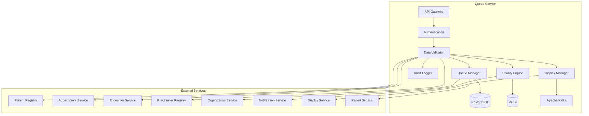

# MS Queue Service

The Queue Service manages patient queuing, appointment scheduling, wait time management, and service flow optimization with comprehensive Bangladesh healthcare queue management.

## 📋 Service Overview

- **Repository**: [ms-queue-service](https://github.com/zs-his/ms-queue-service)
- **Status**: 🟡 In Progress
- **FHIR Resources**: Encounter, ServiceRequest, Task
- **Primary Database**: PostgreSQL
- **Cache Layer**: Redis
- **Event Streaming**: Apache Kafka

## 🎯 Key Features

### Queue Management
- **Patient Queuing**: Digital queue management for all services
- **Service Queues**: Multi-service queue handling
- **Wait Time Tracking**: Real-time wait time monitoring
- **Priority Management**: Emergency and priority patient handling
- **Queue Analytics**: Comprehensive queue performance metrics

### Bangladesh-Specific Features
- **Government Hospital Queues**: Public sector queue management
- **Private Clinic Queues**: Private healthcare queue systems
- **Regional Queue Patterns**: Bangladesh-specific patient flow patterns
- **Emergency Queue Triage**: Bangladesh emergency response protocols
- **Multilingual Queue Display**: Bengali and English support

## 🏗️ Architecture



## 📊 Database Schema

### Queue Table
```sql
CREATE TABLE queues (
    id UUID PRIMARY KEY DEFAULT gen_random_uuid(),
    queue_id VARCHAR(50) UNIQUE NOT NULL,
    facility_id UUID REFERENCES organizations(id),
    service_type VARCHAR(50) NOT NULL,
    queue_name VARCHAR(100) NOT NULL,
    queue_status VARCHAR(20) NOT NULL DEFAULT 'active',
    current_capacity INTEGER NOT NULL DEFAULT 0,
    max_capacity INTEGER NOT NULL DEFAULT 100,
    average_wait_time INTEGER DEFAULT 0,
    service_duration INTEGER DEFAULT 15,
    priority_enabled BOOLEAN DEFAULT false,
    auto_advance BOOLEAN DEFAULT true,
    display_enabled BOOLEAN DEFAULT true,
    notification_enabled BOOLEAN DEFAULT true,
    operating_hours JSONB,
    created_at TIMESTAMP DEFAULT CURRENT_TIMESTAMP,
    updated_at TIMESTAMP DEFAULT CURRENT_TIMESTAMP,
    metadata JSONB
);
```

### Queue Entry Table
```sql
CREATE TABLE queue_entries (
    id UUID PRIMARY KEY DEFAULT gen_random_uuid(),
    entry_id VARCHAR(50) UNIQUE NOT NULL,
    queue_id UUID REFERENCES queues(id),
    patient_id UUID REFERENCES patients(id),
    encounter_id UUID REFERENCES encounters(id),
    facility_id UUID REFERENCES organizations(id),
    ticket_number VARCHAR(20) NOT NULL,
    priority_level INTEGER DEFAULT 3,
    entry_status VARCHAR(20) NOT NULL DEFAULT 'waiting',
    arrival_time TIMESTAMP NOT NULL,
    start_time TIMESTAMP,
    completion_time TIMESTAMP,
    wait_time INTEGER,
    service_time INTEGER,
    practitioner_id UUID REFERENCES practitioners(id),
    service_room VARCHAR(50),
    notes TEXT,
    priority_reason VARCHAR(100),
    created_at TIMESTAMP DEFAULT CURRENT_TIMESTAMP,
    updated_at TIMESTAMP DEFAULT CURRENT_TIMESTAMP,
    metadata JSONB
);
```

### Queue Configuration Table
```sql
CREATE TABLE queue_configurations (
    id UUID PRIMARY KEY DEFAULT gen_random_uuid(),
    config_id VARCHAR(50) UNIQUE NOT NULL,
    facility_id UUID REFERENCES organizations(id),
    service_type VARCHAR(50) NOT NULL,
    queue_settings JSONB NOT NULL,
    priority_rules JSONB,
    notification_settings JSONB,
    display_settings JSONB,
    integration_settings JSONB,
    active BOOLEAN DEFAULT true,
    created_at TIMESTAMP DEFAULT CURRENT_TIMESTAMP,
    updated_at TIMESTAMP DEFAULT CURRENT_TIMESTAMP,
    metadata JSONB
);
```

## 🔌 API Endpoints

### Queue Management
```go
// Create queue
POST /api/queue/queues
{
  "queueId": "QUEUE-001",
  "facilityId": "facility-123",
  "serviceType": "consultation",
  "queueName": "General Consultation Queue",
  "queueStatus": "active",
  "currentCapacity": 0,
  "maxCapacity": 50,
  "averageWaitTime": 15,
  "serviceDuration": 15,
  "priorityEnabled": true,
  "autoAdvance": true,
  "displayEnabled": true,
  "notificationEnabled": true,
  "operatingHours": {
    "monday": {"open": "08:00", "close": "17:00"},
    "tuesday": {"open": "08:00", "close": "17:00"},
    "wednesday": {"open": "08:00", "close": "17:00"},
    "thursday": {"open": "08:00", "close": "17:00"},
    "friday": {"open": "08:00", "close": "17:00"},
    "saturday": {"open": "09:00", "close": "13:00"},
    "sunday": {"closed": true}
  }
}

// Get queue by ID
GET /api/queue/queues/{id}

// Search queues
GET /api/queue/queues?facility=123&service=consultation&status=active

// Update queue
PUT /api/queue/queues/{id}

// Get queue statistics
GET /api/queue/queues/{id}/statistics
```

### Queue Entry Management
```go
// Add patient to queue
POST /api/queue/entries
{
  "queueId": "queue-123",
  "patientId": "patient-456",
  "encounterId": "encounter-789",
  "facilityId": "facility-123",
  "priorityLevel": 3,
  "priorityReason": "Regular appointment",
  "notes": "Patient arrived on time for scheduled appointment"
}

// Get queue entry by ID
GET /api/queue/entries/{id}

// Search queue entries
GET /api/queue/entries?queue=123&status=waiting&date=2026-01-21

// Update queue entry status
PUT /api/queue/entries/{id}/status
{
  "entryStatus": "in_service",
  "startTime": "2026-01-21T10:30:00+06:00",
  "practitionerId": "practitioner-101",
  "serviceRoom": "Consultation Room A"
}

// Complete queue entry
POST /api/queue/entries/{id}/complete
{
  "completionTime": "2026-01-21T10:45:00+06:00",
  "notes": "Consultation completed successfully"
}
```

### Queue Operations
```go
// Call next patient
POST /api/queue/queues/{id}/next
{
  "practitionerId": "practitioner-101",
  "serviceRoom": "Consultation Room A",
  "notes": "Calling next patient for consultation"
}

// Skip patient
POST /api/queue/entries/{id}/skip
{
  "skipReason": "Patient not ready",
  "notes": "Patient requested to be called later"
}

// Transfer patient
POST /api/queue/entries/{id}/transfer
{
  "targetQueueId": "queue-456",
  "transferReason": "Specialist consultation required",
  "notes": "Transferring to specialist queue"
}

// Get current queue status
GET /api/queue/queues/{id}/status

// Get wait time estimates
GET /api/queue/queues/{id}/wait-times
```

## 🏥 Bangladesh Queue Features

### Service Types and Categories
```go
type ServiceType struct {
    ServiceCode     string    `json:"service_code"`
    ServiceName     string    `json:"service_name"`
    ServiceCategory string    `json:"service_category"`
    AverageDuration int       `json:"average_duration_minutes"`
    PriorityLevels  []int     `json:"priority_levels"`
    CommonInBD      bool      `json:"common_in_bd"`
    GovtHospitals   bool      `json:"govt_hospitals"`
    PrivateHospitals bool     `json:"private_hospitals"`
}

var BangladeshServiceTypes = map[string]ServiceType{
    "GENERAL_CONSULTATION": {
        ServiceCode:     "GC",
        ServiceName:     "General Consultation",
        ServiceCategory: "outpatient",
        AverageDuration: 15,
        PriorityLevels:  []int{1, 2, 3, 4, 5},
        CommonInBD:      true,
        GovtHospitals:   true,
        PrivateHospitals: true,
    },
    "SPECIALIST_CONSULTATION": {
        ServiceCode:     "SC",
        ServiceName:     "Specialist Consultation",
        ServiceCategory: "outpatient",
        AverageDuration: 20,
        PriorityLevels:  []int{1, 2, 3, 4, 5},
        CommonInBD:      true,
        GovtHospitals:   true,
        PrivateHospitals: true,
    },
    "EMERGENCY": {
        ServiceCode:     "ER",
        ServiceName:     "Emergency Services",
        ServiceCategory: "emergency",
        AverageDuration: 30,
        PriorityLevels:  []int{1, 2, 3},
        CommonInBD:      true,
        GovtHospitals:   true,
        PrivateHospitals: true,
    },
    "LABORATORY": {
        ServiceCode:     "LAB",
        ServiceName:     "Laboratory Services",
        ServiceCategory: "diagnostic",
        AverageDuration: 10,
        PriorityLevels:  []int{2, 3, 4, 5},
        CommonInBD:      true,
        GovtHospitals:   true,
        PrivateHospitals: true,
    },
    "RADIOLOGY": {
        ServiceCode:     "RAD",
        ServiceName:     "Radiology Services",
        ServiceCategory: "diagnostic",
        AverageDuration: 25,
        PriorityLevels:  []int{1, 2, 3, 4, 5},
        CommonInBD:      true,
        GovtHospitals:   true,
        PrivateHospitals: true,
    },
    "PHARMACY": {
        ServiceCode:     "PHM",
        ServiceName:     "Pharmacy Services",
        ServiceCategory: "pharmacy",
        AverageDuration: 8,
        PriorityLevels:  []int{3, 4, 5},
        CommonInBD:      true,
        GovtHospitals:   true,
        PrivateHospitals: true,
    },
    "VACCINATION": {
        ServiceCode:     "VAC",
        ServiceName:     "Vaccination Services",
        ServiceCategory: "preventive",
        AverageDuration: 12,
        PriorityLevels:  []int{2, 3, 4, 5},
        CommonInBD:      true,
        GovtHospitals:   true,
        PrivateHospitals: false,
    },
}
```

### Priority System
```go
type PriorityLevel struct {
    Level       int    `json:"level"`
    LevelName   string `json:"level_name"`
    Description string `json:"description"`
    Color       string `json:"color"`
    WaitTimeLimit int  `json:"wait_time_limit_minutes"`
    AutoAdvance bool   `json:"auto_advance"`
}

var BangladeshPriorityLevels = map[int]PriorityLevel{
    1: {
        Level:         1,
        LevelName:     "Critical Emergency",
        Description:   "Life-threatening conditions requiring immediate attention",
        Color:         "red",
        WaitTimeLimit: 0,
        AutoAdvance:   true,
    },
    2: {
        Level:         2,
        LevelName:     "Emergency",
        Description:   "Serious conditions requiring urgent attention",
        Color:         "orange",
        WaitTimeLimit: 15,
        AutoAdvance:   true,
    },
    3: {
        Level:         3,
        LevelName:     "Urgent",
        Description:   "Conditions requiring prompt attention",
        Color:         "yellow",
        WaitTimeLimit: 30,
        AutoAdvance:   false,
    },
    4: {
        Level:         4,
        LevelName:     "Routine",
        Description:   "Non-urgent conditions requiring regular attention",
        Color:         "green",
        WaitTimeLimit: 60,
        AutoAdvance:   false,
    },
    5: {
        Level:         5,
        LevelName:     "Low Priority",
        Description:   "Non-urgent conditions that can wait",
        Color:         "blue",
        WaitTimeLimit: 120,
        AutoAdvance:   false,
    },
}
```

## 🔍 Search and Filtering

### Advanced Queue Search
```go
type QueueSearchCriteria struct {
    FacilityID      string    `json:"facility_id"`
    ServiceType     string    `json:"service_type"`
    QueueStatus     string    `json:"queue_status"`
    PriorityLevel   int       `json:"priority_level"`
    EntryStatus     string    `json:"entry_status"`
    DateFrom        time.Time `json:"date_from"`
    DateTo          time.Time `json:"date_to"`
    PractitionerID  string    `json:"practitioner_id"`
    MinWaitTime     int       `json:"min_wait_time"`
    MaxWaitTime     int       `json:"max_wait_time"`
}

func (s *QueueService) SearchQueueEntries(criteria QueueSearchCriteria) ([]QueueEntry, error) {
    query := s.db.NewSelect().Model(&QueueEntry{})
    
    if criteria.FacilityID != "" {
        query = query.Where("facility_id = ?", criteria.FacilityID)
    }
    
    if criteria.ServiceType != "" {
        query = query.Join("JOIN queues ON queue_entries.queue_id = queues.id").
                   Where("queues.service_type = ?", criteria.ServiceType)
    }
    
    if criteria.PriorityLevel > 0 {
        query = query.Where("priority_level = ?", criteria.PriorityLevel)
    }
    
    if criteria.EntryStatus != "" {
        query = query.Where("entry_status = ?", criteria.EntryStatus)
    }
    
    if !criteria.DateFrom.IsZero() {
        query = query.Where("arrival_time >= ?", criteria.DateFrom)
    }
    
    if !criteria.DateTo.IsZero() {
        query = query.Where("arrival_time <= ?", criteria.DateTo)
    }
    
    var entries []QueueEntry
    err := query.Scan(ctx, &entries)
    return entries, err
}
```

## 📈 Performance Optimization

### Caching Strategy
```go
// Cache queue status for 2 minutes
func (s *QueueService) GetQueueStatus(queueID string) (*QueueStatus, error) {
    cacheKey := fmt.Sprintf("queue_status:%s", queueID)
    
    if cached, err := s.cache.Get(cacheKey); err == nil {
        return cached.(*QueueStatus), nil
    }
    
    status, err := s.calculateQueueStatus(queueID)
    if err != nil {
        return nil, err
    }
    
    s.cache.Set(cacheKey, status, 2*time.Minute)
    return status, nil
}

// Cache wait time estimates for 5 minutes
func (s *QueueService) GetWaitTimeEstimates(queueID string) (*WaitTimeEstimate, error) {
    cacheKey := fmt.Sprintf("wait_time_estimate:%s", queueID)
    
    if cached, err := s.cache.Get(cacheKey); err == nil {
        return cached.(*WaitTimeEstimate), nil
    }
    
    estimate, err := s.calculateWaitTimeEstimate(queueID)
    if err != nil {
        return nil, err
    }
    
    s.cache.Set(cacheKey, estimate, 5*time.Minute)
    return estimate, nil
}
```

### Database Indexing
```sql
-- Performance indexes
CREATE INDEX idx_queues_facility ON queues(facility_id);
CREATE INDEX idx_queues_service_type ON queues(service_type);
CREATE INDEX idx_queues_status ON queues(queue_status);
CREATE INDEX idx_queue_entries_queue ON queue_entries(queue_id);
CREATE INDEX idx_queue_entries_patient ON queue_entries(patient_id);
CREATE INDEX idx_queue_entries_status ON queue_entries(entry_status);
CREATE INDEX idx_queue_entries_priority ON queue_entries(priority_level);
CREATE INDEX idx_queue_entries_arrival ON queue_entries(arrival_time);
CREATE INDEX idx_queue_entries_practitioner ON queue_entries(practitioner_id);
CREATE INDEX idx_queue_configurations_facility ON queue_configurations(facility_id);
CREATE INDEX idx_queue_configurations_service ON queue_configurations(service_type);
```

## 🎫 Queue Management Engine

### Smart Queue Processing
```go
type QueueProcessingEngine struct {
    ProcessingRules  []ProcessingRule
    PriorityMatrix   map[string]int
    ServiceMatrix    map[string]int
    AutoProcessing   bool
}

type ProcessingRule struct {
    RuleID       string `json:"rule_id"`
    RuleName     string `json:"rule_name"`
    Condition    string `json:"condition"`
    Action       string `json:"action"`
    Priority     int    `json:"priority"`
    Active       bool   `json:"active"`
}

func (s *QueueService) ProcessNextInQueue(queueID string, practitionerID string) (*QueueProcessingResult, error) {
    // Get queue
    queue, err := s.repository.GetQueue(queueID)
    if err != nil {
        return nil, err
    }
    
    // Get next patient based on priority
    nextEntry, err := s.getNextPatient(queueID)
    if err != nil {
        return nil, err
    }
    
    if nextEntry == nil {
        return &QueueProcessingResult{
            Success: false,
            Message: "No patients in queue",
        }, nil
    }
    
    // Start service for patient
    err = s.startServiceForPatient(nextEntry, practitionerID)
    if err != nil {
        return nil, fmt.Errorf("failed to start service: %w", err)
    }
    
    // Update queue statistics
    err = s.updateQueueStatistics(queueID)
    if err != nil {
        log.Printf("Failed to update queue statistics: %v", err)
    }
    
    // Send notifications
    err = s.sendQueueNotifications(nextEntry, "called")
    if err != nil {
        log.Printf("Failed to send queue notifications: %v", err)
    }
    
    return &QueueProcessingResult{
        Success:       true,
        QueueEntry:    nextEntry,
        QueueStatus:   s.getQueueStatus(queueID),
        WaitTime:      nextEntry.WaitTime,
        Message:       fmt.Sprintf("Patient %s called for service", nextEntry.TicketNumber),
    }, nil
}

func (s *QueueService) getNextPatient(queueID string) (*QueueEntry, error) {
    // Get waiting patients ordered by priority and arrival time
    entries, err := s.repository.GetWaitingEntries(queueID)
    if err != nil {
        return nil, err
    }
    
    if len(entries) == 0 {
        return nil, nil
    }
    
    // Sort by priority (lower number = higher priority), then by arrival time
    sort.Slice(entries, func(i, j int) bool {
        if entries[i].PriorityLevel != entries[j].PriorityLevel {
            return entries[i].PriorityLevel < entries[j].PriorityLevel
        }
        return entries[i].ArrivalTime.Before(entries[j].ArrivalTime)
    })
    
    return &entries[0], nil
}

func (s *QueueService) startServiceForPatient(entry *QueueEntry, practitionerID string) error {
    // Update entry status
    entry.EntryStatus = "in_service"
    entry.StartTime = time.Now()
    entry.PractitionerID = practitionerID
    entry.ServiceRoom = s.getAvailableRoom(entry.QueueID)
    
    // Calculate wait time
    entry.WaitTime = int(entry.StartTime.Sub(entry.ArrivalTime).Minutes())
    
    return s.repository.UpdateQueueEntry(entry)
}
```

## 📊 Real-time Queue Display

### Display Management
```go
type DisplayManager struct {
    DisplayConfigs map[string]DisplayConfig
    UpdateInterval int
    Languages      []string
    Themes         []string
}

type DisplayConfig struct {
    DisplayID       string   `json:"display_id"`
    DisplayName     string   `json:"display_name"`
    QueueIDs        []string `json:"queue_ids"`
    DisplayFormat   string   `json:"display_format"`
    Language        string   `json:"language"`
    Theme           string   `json:"theme"`
    RefreshInterval int      `json:"refresh_interval_seconds"`
    ShowWaitTimes   bool     `json:"show_wait_times"`
    ShowStatistics  bool     `json:"show_statistics"`
    SoundEnabled    bool     `json:"sound_enabled"`
}

func (s *QueueService) GetDisplayData(displayID string) (*DisplayData, error) {
    // Get display configuration
    config, err := s.getDisplayConfig(displayID)
    if err != nil {
        return nil, err
    }
    
    // Get queue data for all configured queues
    var queueData []QueueDisplayData
    for _, queueID := range config.QueueIDs {
        data, err := s.getQueueDisplayData(queueID, config)
        if err != nil {
            log.Printf("Failed to get display data for queue %s: %v", queueID, err)
            continue
        }
        queueData = append(queueData, *data)
    }
    
    return &DisplayData{
        DisplayID:    displayID,
        DisplayName:  config.DisplayName,
        Timestamp:    time.Now(),
        QueueData:    queueData,
        Language:     config.Language,
        Theme:        config.Theme,
        Statistics:   s.getOverallStatistics(config.QueueIDs),
    }, nil
}

func (s *QueueService) getQueueDisplayData(queueID string, config DisplayConfig) (*QueueDisplayData, error) {
    // Get queue information
    queue, err := s.repository.GetQueue(queueID)
    if err != nil {
        return nil, err
    }
    
    // Get current serving patient
    servingEntry, err := s.repository.GetServingEntry(queueID)
    if err != nil {
        return nil, err
    }
    
    // Get next 5 patients
    nextEntries, err := s.repository.GetNextEntries(queueID, 5)
    if err != nil {
        return nil, err
    }
    
    // Translate queue name if needed
    queueName := queue.QueueName
    if config.Language == "bn" {
        queueName = s.translateToBengali(queueName)
    }
    
    return &QueueDisplayData{
        QueueID:       queueID,
        QueueName:     queueName,
        CurrentServing: servingEntry,
        NextPatients:  nextEntries,
        WaitTime:      s.getEstimatedWaitTime(queueID),
        QueueLength:   s.getQueueLength(queueID),
        AverageWaitTime: queue.AverageWaitTime,
    }, nil
}

func (s *QueueService) translateToBengali(text string) string {
    translations := map[string]string{
        "General Consultation Queue": "সাধারণ পরামর্শ সারি",
        "Emergency Queue":           "জরুরি সারি",
        "Laboratory Queue":          "ল্যাবরেটরি সারি",
        "Pharmacy Queue":            "ফার্মেসি সারি",
        "Now Serving":               "বর্তমানে সেবা দিচ্ছে",
        "Next":                     "পরবর্তী",
        "Waiting":                  "অপেক্ষমান",
        "Estimated Wait Time":     "আনুমানিক অপেক্ষার সময়",
        "minutes":                  "মিনিট",
    }
    
    if translation, exists := translations[text]; exists {
        return translation
    }
    
    return text
}
```

## 🔔 Notification System

### Queue Notifications
```go
type NotificationService struct {
    Channels       map[string]NotificationChannel
    Templates      map[string]NotificationTemplate
    DefaultChannel string
}

type NotificationChannel interface {
    SendNotification(notification *QueueNotification) error
    GetChannelStatus() (*ChannelStatus, error)
}

func (s *QueueService) SendQueueNotification(entry *QueueEntry, notificationType string) error {
    // Get patient contact information
    patient, err := s.patientService.GetPatient(entry.PatientID)
    if err != nil {
        return fmt.Errorf("failed to get patient information: %w", err)
    }
    
    // Get notification template
    template, err := s.getNotificationTemplate(notificationType)
    if err != nil {
        return fmt.Errorf("failed to get notification template: %w", err)
    }
    
    // Prepare notification
    notification := &QueueNotification{
        PatientID:      entry.PatientID,
        QueueEntryID:   entry.ID,
        NotificationType: notificationType,
        PhoneNumber:    patient.MobilePhone,
        Email:          patient.Email,
        TicketNumber:   entry.TicketNumber,
        QueueName:      s.getQueueName(entry.QueueID),
        EstimatedWaitTime: s.getEstimatedWaitTime(entry.QueueID),
        Position:       s.getPatientPosition(entry.QueueID, entry.ID),
        Language:       s.getPatientLanguage(patient),
    }
    
    // Format message
    message, err := s.formatNotificationMessage(notification, template)
    if err != nil {
        return fmt.Errorf("failed to format notification message: %w", err)
    }
    
    notification.Message = message
    
    // Send through appropriate channels
    channels := s.getNotificationChannels(notificationType)
    for _, channel := range channels {
        err = channel.SendNotification(notification)
        if err != nil {
            log.Printf("Failed to send notification via %s: %v", channel.GetChannelType(), err)
        }
    }
    
    return nil
}

func (s *QueueService) formatNotificationMessage(notification *QueueNotification, template *NotificationTemplate) (string, error) {
    message := template.Message
    
    // Replace placeholders
    replacements := map[string]string{
        "{{ticket_number}}": notification.TicketNumber,
        "{{queue_name}}":    notification.QueueName,
        "{{wait_time}}":     fmt.Sprintf("%d minutes", notification.EstimatedWaitTime),
        "{{position}}":      fmt.Sprintf("%d", notification.Position),
        "{{patient_name}}":  notification.PatientName,
    }
    
    for placeholder, value := range replacements {
        message = strings.ReplaceAll(message, placeholder, value)
    }
    
    // Translate if needed
    if notification.Language == "bn" {
        message = s.translateToBengali(message)
    }
    
    return message, nil
}
```

## 🔒 Security Features

### Access Control
```go
func (s *QueueService) CanAccessQueueData(userID, recordID string, action string) bool {
    // Check user permissions
    permissions := s.authService.GetUserPermissions(userID)
    
    switch action {
    case "read":
        return permissions.Contains("queue.read") || 
               s.canViewFacilityQueues(userID, recordID)
    case "write":
        return permissions.Contains("queue.write") || 
               s.isAuthorizedQueueStaff(userID)
    case "manage":
        return permissions.Contains("queue.manage") || 
               s.isAuthorizedQueueManager(userID)
    case "display":
        return permissions.Contains("queue.display") || 
               s.isAuthorizedDisplayManager(userID)
    default:
        return false
    }
}

func (s *QueueService) isAuthorizedQueueStaff(userID string) bool {
    practitioner, err := s.practitionerService.GetPractitionerByUser(userID)
    if err != nil {
        return false
    }
    
    // Check if practitioner has queue management role
    for _, role := range practitioner.Roles {
        if role.Specialty == "reception" || 
           role.Specialty == "nursing" ||
           role.Specialty == "administration" {
            return true
        }
    }
    
    return false
}
```

### Data Privacy
```go
func (s *QueueService) anonymizeSensitiveQueueData(entries []QueueEntry, requestUserID string) []QueueEntry {
    // Check if requester has full access
    if s.authService.HasFullAccess(requestUserID) {
        return entries
    }
    
    // Anonymize sensitive queue information
    var anonymized []QueueEntry
    for _, entry := range entries {
        if s.isSensitiveEntry(entry) {
            // Remove sensitive details
            entry.PatientID = ""
            entry.EncounterID = ""
            entry.Notes = ""
            entry.PriorityReason = ""
        }
        anonymized = append(anonymized, entry)
    }
    
    return anonymized
}

func (s *QueueService) isSensitiveEntry(entry QueueEntry) bool {
    // Check for sensitive priority levels
    if entry.PriorityLevel <= 2 {
        return true
    }
    
    // Check for sensitive service types
    sensitiveServices := []string{
        "psychiatric",
        "reproductive_health",
        "hiv_aids",
    }
    
    queue, err := s.repository.GetQueue(entry.QueueID)
    if err != nil {
        return false
    }
    
    for _, service := range sensitiveServices {
        if strings.Contains(strings.ToLower(queue.ServiceType), service) {
            return true
        }
    }
    
    return false
}
```

## 📊 Monitoring and Metrics

### Health Checks
```go
func (s *QueueService) HealthCheck() map[string]interface{} {
    return map[string]interface{}{
        "database":          s.checkDatabase(),
        "cache":             s.checkCache(),
        "kafka":             s.checkKafka(),
        "queue_manager":     s.checkQueueManager(),
        "priority_engine":   s.checkPriorityEngine(),
        "display_manager":   s.checkDisplayManager(),
        "notification_service": s.checkNotificationService(),
        "patient_service":   s.checkPatientService(),
        "timestamp":         time.Now(),
    }
}
```

### Performance Metrics
```go
// Prometheus metrics
var (
    queueRequestsTotal = prometheus.NewCounterVec(
        prometheus.CounterOpts{
            Name: "queue_requests_total",
            Help: "Total number of queue requests",
        },
        []string{"method", "endpoint", "status"},
    )
    
    queueProcessingTime = prometheus.NewHistogramVec(
        prometheus.HistogramOpts{
            Name: "queue_processing_seconds",
            Help: "Time taken to process queue operations",
        },
        []string{"queue_type", "operation", "status"},
    )
    
    averageWaitTime = prometheus.NewGaugeVec(
        prometheus.GaugeOpts{
            Name: "queue_average_wait_time_minutes",
            Help: "Average wait time in minutes",
        },
        []string{"queue_type", "facility"},
    )
)
```

## 🧪 Testing

### Unit Tests
```go
func TestQueueService_AddPatientToQueue(t *testing.T) {
    service := NewQueueService(mockRepo, mockCache, mockNotification)
    entry := &QueueEntry{
        QueueID:      "queue-123",
        PatientID:    "patient-456",
        EncounterID:  "encounter-789",
        FacilityID:   "facility-123",
        PriorityLevel: 3,
        ArrivalTime:  time.Now(),
        EntryStatus:  "waiting",
        Notes:        "Regular appointment",
    }
    
    result, err := service.AddPatientToQueue(entry)
    
    assert.NoError(t, err)
    assert.NotNil(t, result)
    assert.NotEmpty(t, result.TicketNumber)
    assert.Equal(t, "waiting", result.EntryStatus)
    assert.Equal(t, "patient-456", result.PatientID)
}
```

## 🚀 Deployment

### Docker Configuration
```dockerfile
FROM golang:1.25-alpine AS builder

WORKDIR /app
COPY go.mod go.sum ./
RUN go mod download

COPY . .
RUN CGO_ENABLED=0 GOOS=linux go build -o main cmd/server/main.go

FROM alpine:latest
RUN apk --no-cache add ca-certificates
WORKDIR /root/
COPY --from=builder /app/main .
EXPOSE 8080
CMD ["./main"]
```

### Kubernetes Deployment
```yaml
apiVersion: apps/v1
kind: Deployment
metadata:
  name: ms-queue-service
spec:
  replicas: 3
  selector:
    matchLabels:
      app: ms-queue-service
  template:
    metadata:
      labels:
        app: ms-queue-service
    spec:
      containers:
      - name: ms-queue-service
        image: zarish-his/ms-queue-service:latest
        ports:
        - containerPort: 8080
        env:
        - name: DB_HOST
          value: "postgresql-service"
        - name: REDIS_HOST
          value: "redis-service"
        - name: KAFKA_BROKERS
          value: "kafka-service:9092"
        - name: DISPLAY_SERVICE_URL
          value: "display-service:8080"
```

## 🔗 Related Resources

- **Frontend Integration**: [ESM Admin](../frontend/esm-admin.md)
- **FHIR Implementation**: [FHIR Encounter Profile](../fhir/encounter-profile.md)
- **API Documentation**: [Queue API Reference](../api-reference/rest-apis.md)
- **Display Integration**: [Display Service Documentation](#)

---

*Last updated: 2026-01-21*
