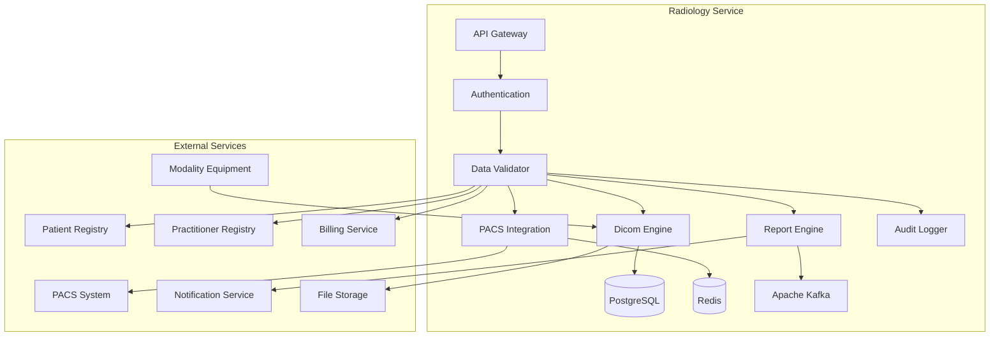

# MS Radiology Service

The Radiology Service manages radiology imaging, DICOM operations, and radiology reporting with comprehensive PACS integration and Bangladesh healthcare context.

## 📋 Service Overview

- **Repository**: [ms-radiology-service](https://github.com/zs-his/ms-radiology-service)
- **Status**: 🟡 In Progress
- **FHIR Resources**: ImagingStudy, DiagnosticReport, Media, Observation
- **Primary Database**: PostgreSQL
- **Cache Layer**: Redis
- **Event Streaming**: Apache Kafka

## 🎯 Key Features

### Radiology Operations
- **Imaging Studies**: Complete radiology study management
- **DICOM Integration**: DICOM image acquisition and management
- **PACS Integration**: Picture Archiving and Communication System
- **Radiology Reporting: Specialized radiology report generation
- **Worklist Management**: Radiology worklist and scheduling

### Bangladesh-Specific Features
- **Common Imaging Procedures**: High-volume radiology procedures in Bangladesh
- **Resource Optimization**: Cost-effective imaging strategies
- **Regional Expertise**: Local radiologist networks
- **Quality Standards**: Bangladesh radiology quality protocols

## 🏗️ Architecture



## 📊 Database Schema

### Imaging Study Table
```sql
CREATE TABLE imaging_studies (
    id UUID PRIMARY KEY DEFAULT gen_random_uuid(),
    study_id VARCHAR(50) UNIQUE NOT NULL,
    patient_id UUID NOT NULL,
    encounter_id UUID REFERENCES encounters(id),
    status VARCHAR(20) NOT NULL DEFAULT 'registered',
    modality JSONB NOT NULL,
    subject_type VARCHAR(20) DEFAULT 'patient',
    subject_id UUID NOT NULL,
    encounter_reference UUID REFERENCES encounters(id),
    started TIMESTAMP,
    based_on JSONB,
    referrer JSONB,
    interpreter JSONB,
    endpoint JSONB,
    location JSONB,
    reason_code JSONB,
    reason_reference JSONB,
    series JSONB,
    instance JSONB,
    procedure_code JSONB,
    study_description TEXT,
    accession_number VARCHAR(50),
    study_instance_uid VARCHAR(64) UNIQUE,
    created_at TIMESTAMP DEFAULT CURRENT_TIMESTAMP,
    updated_at TIMESTAMP DEFAULT CURRENT_TIMESTAMP,
    metadata JSONB,
    FOREIGN KEY (patient_id) REFERENCES patients(id)
);
```

### Imaging Series Table
```sql
CREATE TABLE imaging_series (
    id UUID PRIMARY KEY DEFAULT gen_random_uuid(),
    series_id VARCHAR(50) UNIQUE NOT NULL,
    study_id UUID REFERENCES imaging_studies(id) ON DELETE CASCADE,
    series_instance_uid VARCHAR(64) UNIQUE,
    modality VARCHAR(10) NOT NULL,
    series_description TEXT,
    series_number INTEGER,
    body_site JSONB,
    laterality VARCHAR(10),
    started TIMESTAMP,
    performer JSONB,
    instance JSONB,
    protocol_name VARCHAR(200),
    acquisition_parameters JSONB,
    created_at TIMESTAMP DEFAULT CURRENT_TIMESTAMP,
    updated_at TIMESTAMP DEFAULT CURRENT_TIMESTAMP
);
```

### Radiology Report Table
```sql
CREATE TABLE radiology_reports (
    id UUID PRIMARY KEY DEFAULT gen_random_uuid(),
    report_id VARCHAR(50) UNIQUE NOT NULL,
    study_id UUID REFERENCES imaging_studies(id) ON DELETE CASCADE,
    patient_id UUID NOT NULL,
    encounter_id UUID REFERENCES encounters(id),
    status VARCHAR(20) NOT NULL DEFAULT 'preliminary',
    category JSONB NOT NULL,
    code JSONB NOT NULL,
    subject_type VARCHAR(20) DEFAULT 'patient',
    subject_id UUID NOT NULL,
    encounter_reference UUID REFERENCES encounters(id),
    effective_date_time TIMESTAMP,
    issued TIMESTAMP,
    performer JSONB,
    results_interpreter JSONB,
    findings TEXT,
    impression TEXT,
    recommendation TEXT,
    comparison TEXT,
    technique TEXT,
    created_at TIMESTAMP DEFAULT CURRENT_TIMESTAMP,
    updated_at TIMESTAMP DEFAULT CURRENT_TIMESTAMP,
    metadata JSONB,
    FOREIGN KEY (patient_id) REFERENCES patients(id)
);
```

## 🔌 API Endpoints

### Imaging Study Operations
```go
// Create imaging study
POST /api/radiology/studies
{
  "status": "registered",
  "modality": [{
    "coding": [{
      "system": "http://dicom.nema.org/resources/ontology/DCM",
      "code": "DX",
      "display": "Digital Radiography"
    }]
  }],
  "subject": {"reference": "Patient/12345"},
  "encounter": {"reference": "Encounter/67890"},
  "started": "2026-01-21T14:00:00+06:00",
  "basedOn": [{"reference": "ServiceRequest/111"}],
  "referrer": {
    "reference": "Practitioner/222",
    "display": "Dr. Jane Smith"
  },
  "interpreter": {
    "reference": "Practitioner/333",
    "display": "Dr. John Doe"
  },
  "location": {
    "reference": "Location/444",
    "display": "Radiology Department"
  },
  "reasonCode": [{
    "coding": [{
      "system": "http://snomed.info/sct",
      "code": "267036007",
      "display": "Chest pain"
    }]
  }],
  "procedureCode": [{
    "coding": [{
      "system": "http://loinc.org",
      "code": "34839-5",
      "display": "Chest X-ray"
    }]
  }],
  "studyDescription": "Chest PA and Lateral",
  "accessionNumber": "ACC-2026-001234",
  "studyInstanceUID": "1.2.840.113619.2.55.3.604688237.621.1233964439.625"
}

// Get imaging study by ID
GET /api/radiology/studies/{id}

// Search imaging studies
GET /api/radiology/studies?patient=12345&modality=DX&status=completed

// Update study status
PUT /api/radiology/studies/{id}/status
{
  "status": "completed",
  "completed": "2026-01-21T14:45:00+06:00"
}
```

### DICOM Operations
```go
// Receive DICOM images (C-STORE)
POST /api/radiology/dicom/store
Content-Type: application/dicom

<DICOM binary data>

// Query DICOM studies (C-FIND)
POST /api/radiology/dicom/query
{
  "level": "STUDY",
  "query": {
    "PatientID": "12345",
    "StudyDate": "20260121",
    "Modality": "DX"
  }
}

// Retrieve DICOM images (C-MOVE)
POST /api/radiology/dicom/move
{
  "studyInstanceUID": "1.2.840.113619.2.55.3.604688237.621.1233964439.625",
  "destinationAE": "RADIOLOGY_WORKSTATION"
}

// Get DICOM metadata
GET /api/radiology/studies/{id}/dicom/metadata
```

### Radiology Reporting
```go
// Create radiology report
POST /api/radiology/reports
{
  "studyId": "study-123",
  "status": "preliminary",
  "category": [{"coding": [{"code": "imaging"}]}],
  "code": {
    "coding": [{
      "system": "http://loinc.org",
      "code": "34839-5",
      "display": "Chest X-ray"
    }]
  },
  "subject": {"reference": "Patient/12345"},
  "encounter": {"reference": "Encounter/67890"},
  "effectiveDateTime": "2026-01-21T14:30:00+06:00",
  "performer": [{
    "function": {
      "coding": [{
        "system": "http://terminology.hl7.org/CodeSystem/v3-ParticipationType",
        "code": "ATND",
        "display": "Attender"
      }]
    },
    "actor": {
      "reference": "Practitioner/111",
      "display": "Dr. John Doe"
    }
  }],
  "resultsInterpreter": {
    "reference": "Practitioner/222",
    "display": "Dr. Jane Smith"
  },
  "findings": "Lungs are clear without evidence of acute infiltrate, consolidation, or effusion. Cardiac silhouette is normal in size and contour. Visualized bony structures are intact without fracture.",
  "impression": "No acute cardiopulmonary abnormality.",
  "recommendation": "Correlate clinically. Consider follow-up chest X-ray in 6-12 months if clinically indicated.",
  "comparison": "Compared to previous chest X-ray from 2025-06-15, no significant interval change.",
  "technique": "Standard PA and lateral chest radiographs obtained with digital technique."
}

// Get radiology report by ID
GET /api/radiology/reports/{id}

// Search radiology reports
GET /api/radiology/reports?patient=12345&status=final&modality=DX

// Approve report
POST /api/radiology/reports/{id}/approve
{
  "status": "final",
  "issued": "2026-01-21T16:45:00+06:00",
  "approver": {
    "reference": "Practitioner/222",
    "display": "Dr. Jane Smith"
  }
}
```

## 🏥 Bangladesh Radiology Procedures

### Common Imaging Modalities
```go
var BangladeshRadiologyProcedures = map[string]RadiologyProcedure{
    "CHEST_XRAY": {
        Modality:          "DX",
        ProcedureCode:     "34839-5",
        Display:           "Chest X-ray",
        TurnaroundHours:   4,
        Priority:           "routine",
        CommonInBD:         true,
        Cost:               300.00,
        Indications:        []string{"Chest pain", "Shortness of breath", "Fever", "Trauma"},
        Preparation:        "Remove jewelry and clothing from chest area",
        RadiationDose:     "0.1 mSv",
    },
    "ABDOMEN_ULTRASOUND": {
        Modality:          "US",
        ProcedureCode:     "39026-1",
        Display:           "Abdomen Ultrasound",
        TurnaroundHours:   2,
        Priority:           "routine",
        CommonInBD:         true,
        Cost:               800.00,
        Indications:        []string{"Abdominal pain", "Gallbladder disease", "Liver disease"},
        Preparation:        "6 hours fasting required",
        RadiationDose:     "None",
    },
    "CT_BRAIN": {
        Modality:          "CT",
        ProcedureCode:     "24603-0",
        Display:           "CT Brain",
        TurnaroundHours:   6,
        Priority:           "urgent",
        CommonInBD:         true,
        Cost:               2500.00,
        Indications:        []string{"Head trauma", "Stroke", "Severe headache"},
        Preparation:        "No preparation needed for non-contrast CT",
        RadiationDose:     "2-4 mSv",
    },
    "MRI_KNEE": {
        Modality:          "MR",
        ProcedureCode:     "39625-0",
        Display:           "MRI Knee",
        TurnaroundHours:   24,
        Priority:           "routine",
        CommonInBD:         false,
        Cost:               5000.00,
        Indications:        []string{"Joint pain", "Ligament injury", "Arthritis"},
        Preparation:        "Remove all metal objects",
        RadiationDose:     "None",
    },
    "MAMMOGRAPHY": {
        Modality:          "MG",
        ProcedureCode:     "24606-6",
        Display:           "Mammography",
        TurnaroundHours:   8,
        Priority:           "routine",
        CommonInBD:         true,
        Cost:               1500.00,
        Indications:        []string{"Breast screening", "Breast lump", "Breast pain"},
        Preparation:        "Avoid using deodorant on day of exam",
        RadiationDose:     "0.4 mSv",
    },
}

type RadiologyProcedure struct {
    Modality          string   `json:"modality"`
    ProcedureCode     string   `json:"procedure_code"`
    Display           string   `json:"display"`
    TurnaroundHours   int      `json:"turnaround_hours"`
    Priority          string   `json:"priority"`
    CommonInBD        bool     `json:"common_in_bd"`
    Cost              float64  `json:"cost"`
    Indications       []string `json:"indications"`
    Preparation       string   `json:"preparation"`
    RadiationDose     string   `json:"radiation_dose"`
}
```

### Regional Imaging Patterns
```go
var BangladeshImagingPatterns = map[string]ImagingPattern{
    "Urban_Hospitals": {
        CommonModalities: []string{"DX", "CT", "MRI", "US", "MG"},
        AdvancedImaging:  true,
        247Service:       true,
        Subspecialty:     []string{"Neuroradiology", "Cardiac Imaging", "Interventional Radiology"},
    },
    "District_Hospitals": {
        CommonModalities: []string{"DX", "US", "CT"},
        AdvancedImaging:  false,
        247Service:       false,
        Subspecialty:     []string{"General Radiology"},
    },
    "Upazila_Health_Complexes": {
        CommonModalities: []string{"DX", "US"},
        AdvancedImaging:  false,
        247Service:       false,
        Subspecialty:     []string{"Basic Radiology"},
    },
    "Private_Clinics": {
        CommonModalities: []string{"DX", "US", "CT"},
        AdvancedImaging:  false,
        247Service:       false,
        Subspecialty:     []string{"General Radiology"},
    },
}

type ImagingPattern struct {
    CommonModalities []string `json:"common_modalities"`
    AdvancedImaging  bool     `json:"advanced_imaging"`
    247Service       bool     `json:"247_service"`
    Subspecialty     []string `json:"subspecialty"`
}
```

## 🔍 Search and Filtering

### Advanced Imaging Study Search
```go
type ImagingStudySearchCriteria struct {
    PatientID       string    `json:"patient_id"`
    EncounterID     string    `json:"encounter_id"`
    Status          string    `json:"status"`
    Modality        string    `json:"modality"`
    ProcedureCode   string    `json:"procedure_code"`
    PerformerID     string    `json:"performer_id"`
    InterpreterID   string    `json:"interpreter_id"`
    DateFrom        time.Time `json:"date_from"`
    DateTo          time.Time `json:"date_to"`
    AccessionNumber string    `json:"accession_number"`
    StudyInstanceUID string  `json:"study_instance_uid"`
}

func (s *RadiologyService) SearchImagingStudies(criteria ImagingStudySearchCriteria) ([]ImagingStudy, error) {
    query := s.db.NewSelect().Model(&ImagingStudy{})
    
    if criteria.PatientID != "" {
        query = query.Where("patient_id = ?", criteria.PatientID)
    }
    
    if criteria.Status != "" {
        query = query.Where("status = ?", criteria.Status)
    }
    
    if criteria.Modality != "" {
        query = query.Where("modality->>'coding'->>0->>'code' = ?", criteria.Modality)
    }
    
    if !criteria.DateFrom.IsZero() {
        query = query.Where("started >= ?", criteria.DateFrom)
    }
    
    if !criteria.DateTo.IsZero() {
        query = query.Where("started <= ?", criteria.DateTo)
    }
    
    var studies []ImagingStudy
    err := query.Scan(ctx, &studies)
    return studies, err
}
```

## 📈 Performance Optimization

### Caching Strategy
```go
// Cache radiology procedures for 4 hours
func (s *RadiologyService) GetRadiologyProcedures() ([]RadiologyProcedure, error) {
    cacheKey := "radiology_procedures"
    
    if cached, err := s.cache.Get(cacheKey); err == nil {
        return cached.([]RadiologyProcedure), nil
    }
    
    procedures, err := s.repository.GetAllProcedures()
    if err != nil {
        return nil, err
    }
    
    s.cache.Set(cacheKey, procedures, 4*time.Hour)
    return procedures, nil
}

// Cache patient imaging studies for 30 minutes
func (s *RadiologyService) GetPatientImagingStudies(patientID string) ([]ImagingStudy, error) {
    cacheKey := fmt.Sprintf("patient_studies:%s", patientID)
    
    if cached, err := s.cache.Get(cacheKey); err == nil {
        return cached.([]ImagingStudy), nil
    }
    
    studies, err := s.repository.GetByPatient(patientID)
    if err != nil {
        return nil, err
    }
    
    s.cache.Set(cacheKey, studies, 30*time.Minute)
    return studies, nil
}
```

### Database Indexing
```sql
-- Performance indexes
CREATE INDEX idx_imaging_studies_patient ON imaging_studies(patient_id);
CREATE INDEX idx_imaging_studies_status ON imaging_studies(status);
CREATE INDEX idx_imaging_studies_modality ON imaging_studies USING gin(to_tsvector('english', modality->>'coding'->>0->>'code'));
CREATE INDEX idx_imaging_studies_started ON imaging_studies(started);
CREATE INDEX idx_imaging_studies_accession ON imaging_studies(accession_number);
CREATE INDEX idx_imaging_studies_study_uid ON imaging_studies(study_instance_uid);
CREATE INDEX idx_imaging_series_study ON imaging_series(study_id);
CREATE INDEX idx_imaging_series_modality ON imaging_series(modality);
CREATE INDEX idx_radiology_reports_study ON radiology_reports(study_id);
CREATE INDEX idx_radiology_reports_patient ON radiology_reports(patient_id);
CREATE INDEX idx_radiology_reports_status ON radiology_reports(status);
```

## 📺 DICOM Integration

### DICOM Operations
```go
type DICOMOperation struct {
    OperationType string      `json:"operation_type"`
    StudyUID      string      `json:"study_uid"`
    SeriesUID     string      `json:"series_uid"`
    InstanceUID   string      `json:"instance_uid"`
    Data          []byte      `json:"data"`
    Metadata      DICOMMetadata `json:"metadata"`
    Timestamp     time.Time   `json:"timestamp"`
    SourceAE      string      `json:"source_ae"`
    DestinationAE string      `json:"destination_ae"`
}

type DICOMMetadata struct {
    PatientID       string `json:"patient_id"`
    PatientName     string `json:"patient_name"`
    StudyDate       string `json:"study_date"`
    StudyTime       string `json:"study_time"`
    Modality        string `json:"modality"`
    StudyDescription string `json:"study_description"`
    AccessionNumber string `json:"accession_number"`
    ReferringPhysician string `json:"referring_physician"`
}

func (s *RadiologyService) HandleDICOMStore(operation DICOMOperation) error {
    // Parse DICOM metadata
    metadata, err := s.parseDICOMMetadata(operation.Data)
    if err != nil {
        return fmt.Errorf("failed to parse DICOM metadata: %w", err)
    }
    
    // Find or create imaging study
    study, err := s.findOrCreateStudy(metadata)
    if err != nil {
        return fmt.Errorf("failed to find/create study: %w", err)
    }
    
    // Store DICOM file
    filePath, err := s.storeDICOMFile(operation.Data, metadata)
    if err != nil {
        return fmt.Errorf("failed to store DICOM file: %w", err)
    }
    
    // Create imaging series and instances
    err = s.createSeriesAndInstances(study, metadata, filePath)
    if err != nil {
        return fmt.Errorf("failed to create series/instances: %w", err)
    }
    
    // Update study status
    if study.Status == "registered" {
        study.Status = "in-progress"
        err = s.repository.UpdateStudy(study)
        if err != nil {
            return fmt.Errorf("failed to update study status: %w", err)
        }
    }
    
    // Send notification
    err = s.notificationService.NotifyDICOMReceived(study.StudyID, metadata)
    if err != nil {
        log.Printf("Failed to send DICOM notification: %v", err)
    }
    
    return nil
}

func (s *RadiologyService) HandleDICOMQuery(query DICOMQuery) ([]DICOMQueryResult, error) {
    var results []DICOMQueryResult
    
    switch query.Level {
    case "PATIENT":
        studies, err := s.repository.QueryByPatient(query.Query.PatientID)
        if err != nil {
            return nil, err
        }
        
        for _, study := range studies {
            results = append(results, DICOMQueryResult{
                StudyUID:  study.StudyInstanceUID,
                PatientID: study.PatientID,
                Metadata: s.convertStudyToMetadata(study),
            })
        }
        
    case "STUDY":
        study, err := s.repository.GetByStudyUID(query.Query.StudyInstanceUID)
        if err != nil {
            return nil, err
        }
        
        results = append(results, DICOMQueryResult{
            StudyUID:  study.StudyInstanceUID,
            PatientID: study.PatientID,
            Metadata: s.convertStudyToMetadata(study),
        })
        
    case "SERIES":
        series, err := s.repository.GetSeriesByStudyUID(query.Query.StudyInstanceUID)
        if err != nil {
            return nil, err
        }
        
        for _, serie := range series {
            results = append(results, DICOMQueryResult{
                StudyUID:  serie.StudyInstanceUID,
                SeriesUID: serie.SeriesInstanceUID,
                Metadata: s.convertSeriesToMetadata(serie),
            })
        }
    }
    
    return results, nil
}
```

## 📊 Radiology Reporting Engine

### Structured Reporting Templates
```go
type RadiologyReportTemplate struct {
    ID          string                 `json:"id"`
    Name        string                 `json:"name"`
    Modality    string                 `json:"modality"`
    Sections    []ReportSection        `json:"sections"`
    Variables   map[string]interface{} `json:"variables"`
    AutoFill    bool                   `json:"auto_fill"`
}

type ReportSection struct {
    ID          string `json:"id"`
    Title       string `json:"title"`
    Template    string `json:"template"`
    Required    bool   `json:"required"`
    Order       int    `json:"order"`
}

var ChestXRayReportTemplate = RadiologyReportTemplate{
    ID:       "chest_xray_report",
    Name:     "Chest X-Ray Report",
    Modality: "DX",
    Sections: []ReportSection{
        {
            ID:       "patient_info",
            Title:    "Patient Information",
            Template: "Patient: {{patient.name}}, Age: {{patient.age}}, Gender: {{patient.gender}}",
            Required: true,
            Order:    1,
        },
        {
            ID:       "clinical_info",
            Title:    "Clinical Information",
            Template: "Indication: {{clinical.indication}}",
            Required: true,
            Order:    2,
        },
        {
            ID:       "technique",
            Title:    "Technique",
            Template: "Standard PA and lateral chest radiographs obtained with digital technique.",
            Required: true,
            Order:    3,
        },
        {
            ID:       "findings",
            Title:    "Findings",
            Template: "{{findings.description}}",
            Required: true,
            Order:    4,
        },
        {
            ID:       "impression",
            Title:    "Impression",
            Template: "{{impression.description}}",
            Required: true,
            Order:    5,
        },
        {
            ID:       "comparison",
            Title:    "Comparison",
            Template: "{{comparison.description}}",
            Required: false,
            Order:    6,
        },
        {
            ID:       "recommendation",
            Title:    "Recommendation",
            Template: "{{recommendation.description}}",
            Required: false,
            Order:    7,
        },
    },
    AutoFill: true,
}

func (s *RadiologyService) GenerateRadiologyReport(studyID string, templateID string) (*RadiologyReport, error) {
    // Get imaging study
    study, err := s.repository.GetImagingStudy(studyID)
    if err != nil {
        return nil, err
    }
    
    // Get template
    template, err := s.getReportTemplate(templateID)
    if err != nil {
        return nil, err
    }
    
    // Get patient information
    patient, err := s.patientService.GetPatient(study.PatientID)
    if err != nil {
        return nil, err
    }
    
    // Get previous studies for comparison
    previousStudies, err := s.repository.GetPreviousStudies(study.PatientID, study.ProcedureCode.Coding[0].Code)
    if err != nil {
        log.Printf("Failed to get previous studies: %v", err)
    }
    
    // Prepare variables for template
    variables := map[string]interface{}{
        "patient": map[string]interface{}{
            "name": fmt.Sprintf("%s %s", patient.Name[0].Given[0], patient.Name[0].Family),
            "age":  s.calculateAge(patient.BirthDate),
            "gender": patient.Gender,
        },
        "clinical": map[string]interface{}{
            "indication": s.getClinicalIndication(study),
        },
        "findings": map[string]interface{}{
            "description": s.generateFindings(study),
        },
        "impression": map[string]interface{}{
            "description": s.generateImpression(study),
        },
        "comparison": map[string]interface{}{
            "description": s.generateComparison(previousStudies),
        },
        "recommendation": map[string]interface{}{
            "description": s.generateRecommendation(study),
        },
    }
    
    // Generate report sections
    var sections []ReportSection
    for _, section := range template.Sections {
        content := s.fillTemplate(section.Template, variables)
        sections = append(sections, ReportSection{
            ID:       section.ID,
            Title:    section.Title,
            Content:  content,
            Order:    section.Order,
        })
    }
    
    // Create radiology report
    report := &RadiologyReport{
        StudyID:    studyID,
        Status:     "preliminary",
        Category:   []Code{{Coding: []Coding{{Code: "imaging"}}}},
        Code:       Code{Coding: []Coding{{System: "http://loinc.org", Code: "34839-5", Display: "Chest X-ray"}}},
        PatientID:  study.PatientID,
        EncounterReference: study.EncounterReference,
        EffectiveDateTime: time.Now(),
        Findings:   variables["findings"].(map[string]interface{})["description"].(string),
        Impression: variables["impression"].(map[string]interface{})["description"].(string),
        Comparison: variables["comparison"].(map[string]interface{})["description"].(string),
        Recommendation: variables["recommendation"].(map[string]interface{})["description"].(string),
        Technique:  "Standard PA and lateral chest radiographs obtained with digital technique.",
    }
    
    return s.repository.CreateReport(report)
}
```

## 🔒 Security Features

### Access Control
```go
func (s *RadiologyService) CanAccessRadiologyData(userID, studyID string, action string) bool {
    // Check user permissions
    permissions := s.authService.GetUserPermissions(userID)
    
    switch action {
    case "read":
        return permissions.Contains("radiology.read") || 
               s.canViewPatientRadiologyData(userID, studyID)
    case "write":
        return permissions.Contains("radiology.write") || 
               s.isRadiologyPersonnel(userID)
    case "interpret":
        return permissions.Contains("radiology.interpret") || 
               s.isQualifiedRadiologist(userID)
    case "approve":
        return permissions.Contains("radiology.approve") || 
               s.isAuthorizedApprover(userID)
    default:
        return false
    }
}

func (s *RadiologyService) isRadiologyPersonnel(userID string) bool {
    practitioner, err := s.practitionerService.GetPractitionerByUser(userID)
    if err != nil {
        return false
    }
    
    // Check if practitioner has radiology specialization
    for _, role := range practitioner.Roles {
        if role.Specialty == "radiology" || 
           role.Specialty == "diagnostic_radiology" {
            return true
        }
    }
    
    return false
}
```

### Data Privacy
```go
func (s *RadiologyService) anonymizeSensitiveStudies(studies []ImagingStudy, requestUserID string) []ImagingStudy {
    // Check if requester has full access
    if s.authService.HasFullAccess(requestUserID) {
        return studies
    }
    
    // Anonymize sensitive imaging data (reproductive health, etc.)
    var anonymized []ImagingStudy
    for _, study := range studies {
        if s.isSensitiveImaging(study) {
            // Remove sensitive details
            study.ReasonCode = nil
            study.ReasonReference = nil
            study.StudyDescription = "Sensitive imaging study"
        }
        anonymized = append(anonymized, study)
    }
    
    return anonymized
}

func (s *RadiologyService) isSensitiveImaging(study ImagingStudy) bool {
    sensitiveProcedures := []string{
        "24606-6", // Mammography
        "40199007", // Pelvic ultrasound
        // Add more sensitive procedure codes
    }
    
    for _, code := range sensitiveProcedures {
        if study.ProcedureCode.Coding[0].Code == code {
            return true
        }
    }
    
    return false
}
```

## 📊 Monitoring and Metrics

### Health Checks
```go
func (s *RadiologyService) HealthCheck() map[string]interface{} {
    return map[string]interface{}{
        "database":         s.checkDatabase(),
        "cache":            s.checkCache(),
        "kafka":            s.checkKafka(),
        "dicom_engine":     s.checkDICOMEEngine(),
        "pacs_integration": s.checkPACSIntegration(),
        "report_engine":    s.checkReportEngine(),
        "storage_service":  s.checkStorageService(),
        "timestamp":        time.Now(),
    }
}
```

### Performance Metrics
```go
// Prometheus metrics
var (
    radiologyRequestsTotal = prometheus.NewCounterVec(
        prometheus.CounterOpts{
            Name: "radiology_requests_total",
            Help: "Total number of radiology requests",
        },
        []string{"method", "endpoint", "status"},
    )
    
    dicomOperationsTotal = prometheus.NewCounterVec(
        prometheus.CounterOpts{
            Name: "dicom_operations_total",
            Help: "Total number of DICOM operations",
        },
        []string{"operation", "status"},
    )
    
    reportGenerationTime = prometheus.NewHistogramVec(
        prometheus.HistogramOpts{
            Name: "radiology_report_generation_seconds",
            Help: "Time taken to generate radiology reports",
        },
        []string{"modality", "report_type"},
    )
)
```

## 🧪 Testing

### Unit Tests
```go
func TestRadiologyService_CreateImagingStudy(t *testing.T) {
    service := NewRadiologyService(mockRepo, mockCache, mockDICOM)
    study := &ImagingStudy{
        Status:    "registered",
        Modality:  []Code{{Coding: []Coding{{System: "http://dicom.nema.org/resources/ontology/DCM", Code: "DX"}}},
        PatientID: "patient-123",
        EncounterReference: "encounter-456",
        Started:   time.Now(),
        ProcedureCode: Code{Coding: []Coding{{System: "http://loinc.org", Code: "34839-5"}}},
        StudyDescription: "Chest PA and Lateral",
        AccessionNumber: "ACC-2026-001234",
        StudyInstanceUID: "1.2.840.113619.2.55.3.604688237.621.1233964439.625",
    }
    
    result, err := service.CreateImagingStudy(study)
    
    assert.NoError(t, err)
    assert.NotNil(t, result)
    assert.NotEmpty(t, result.ID)
    assert.Equal(t, "registered", result.Status)
    assert.Equal(t, "patient-123", result.PatientID)
}
```

## 🚀 Deployment

### Docker Configuration
```dockerfile
FROM golang:1.25-alpine AS builder

WORKDIR /app
COPY go.mod go.sum ./
RUN go mod download

COPY . .
RUN CGO_ENABLED=0 GOOS=linux go build -o main cmd/server/main.go

FROM alpine:latest
RUN apk --no-cache add ca-certificates
WORKDIR /root/
COPY --from=builder /app/main .
EXPOSE 8080
CMD ["./main"]
```

### Kubernetes Deployment
```yaml
apiVersion: apps/v1
kind: Deployment
metadata:
  name: ms-radiology-service
spec:
  replicas: 3
  selector:
    matchLabels:
      app: ms-radiology-service
  template:
    metadata:
      labels:
        app: ms-radiology-service
    spec:
      containers:
      - name: ms-radiology-service
        image: zarish-his/ms-radiology-service:latest
        ports:
        - containerPort: 8080
        env:
        - name: DB_HOST
          value: "postgresql-service"
        - name: REDIS_HOST
          value: "redis-service"
        - name: KAFKA_BROKERS
          value: "kafka-service:9092"
        - name: PACS_URL
          value: "pacs-service:104"
        - name: STORAGE_URL
          value: "minio-service:9000"
```

## 🔗 Related Resources

- **Frontend Integration**: [ESM Radiology](../frontend/esm-radiology.md)
- **FHIR Implementation**: [FHIR ImagingStudy Profile](../fhir/imaging-study-profile.md)
- **API Documentation**: [Radiology API Reference](../api-reference/radiology-api.md)
- **PACS Integration**: [PACS Service Documentation](#)

---

*Last updated: 2026-01-21*
