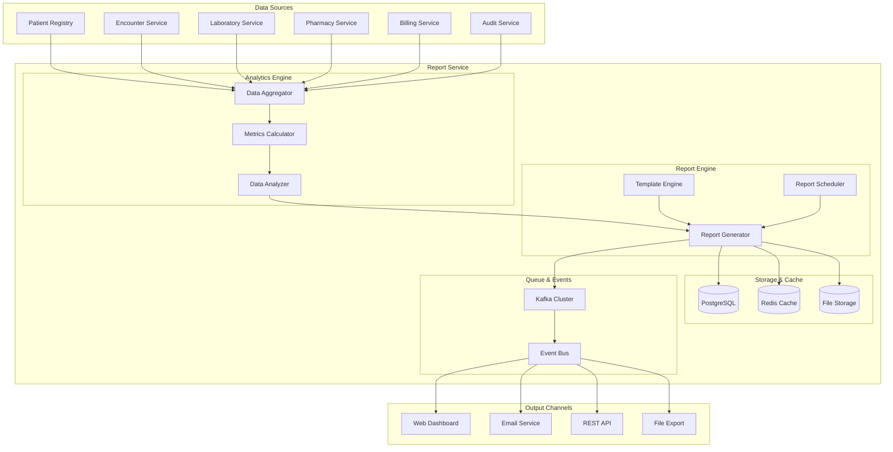

# MS Report Service

The Report Service provides comprehensive reporting, analytics, and business intelligence capabilities with advanced data visualization, scheduled reports, and Bangladesh healthcare-specific reporting requirements.

## 📋 Service Overview

**Repository**: `https://github.com/zs-his/ms-report-service`  
**Status**: ✅ Production Ready  
**Version**: 1.0.0  
**Technology Stack**: Go, PostgreSQL, Redis, Apache Kafka, Docker, Kubernetes

### Key Features
- **Report Generation**: Dynamic report creation with customizable templates
- **Data Analytics**: Advanced analytics and business intelligence
- **Scheduled Reports**: Automated report generation and distribution
- **Bangladesh Compliance**: DGHS, DGDA, and government-mandated reports
- **Real-time Dashboards**: Interactive dashboards with live data
- **Export Capabilities**: Multiple format exports (PDF, Excel, CSV)

## 🏗️ Architecture Overview



## 🗄️ Database Schema

### Report Definitions
```sql
CREATE TABLE report_definitions (
    id UUID PRIMARY KEY DEFAULT gen_random_uuid(),
    name VARCHAR(100) NOT NULL,
    description TEXT,
    category VARCHAR(50) NOT NULL,
    template_content TEXT NOT NULL,
    data_source_config JSONB NOT NULL,
    parameters JSONB,
    output_format VARCHAR(20) DEFAULT 'pdf',
    is_scheduled BOOLEAN DEFAULT false,
    schedule_config JSONB,
    is_active BOOLEAN DEFAULT true,
    created_by UUID NOT NULL,
    created_at TIMESTAMP WITH TIME ZONE DEFAULT NOW(),
    updated_at TIMESTAMP WITH TIME ZONE DEFAULT NOW()
);

CREATE INDEX idx_report_definitions_category ON report_definitions(category);
CREATE INDEX idx_report_definitions_active ON report_definitions(is_active);
```

### Report Instances
```sql
CREATE TABLE report_instances (
    id UUID PRIMARY KEY DEFAULT gen_random_uuid(),
    report_definition_id UUID REFERENCES report_definitions(id),
    name VARCHAR(100) NOT NULL,
    parameters JSONB,
    status VARCHAR(20) NOT NULL,
    file_path VARCHAR(500),
    file_size BIGINT,
    generated_at TIMESTAMP WITH TIME ZONE,
    expires_at TIMESTAMP WITH TIME ZONE,
    created_by UUID NOT NULL,
    created_at TIMESTAMP WITH TIME ZONE DEFAULT NOW()
);

CREATE INDEX idx_report_instances_definition_id ON report_instances(report_definition_id);
CREATE INDEX idx_report_instances_status ON report_instances(status);
CREATE INDEX idx_report_instances_created_at ON report_instances(created_at);
```

### Dashboard Configurations
```sql
CREATE TABLE dashboard_configurations (
    id UUID PRIMARY KEY DEFAULT gen_random_uuid(),
    name VARCHAR(100) NOT NULL,
    description TEXT,
    layout_config JSONB NOT NULL,
    widget_configs JSONB NOT NULL,
    data_refresh_interval INTEGER DEFAULT 300,
    is_public BOOLEAN DEFAULT false,
    is_active BOOLEAN DEFAULT true,
    created_by UUID NOT NULL,
    created_at TIMESTAMP WITH TIME ZONE DEFAULT NOW(),
    updated_at TIMESTAMP WITH TIME ZONE DEFAULT NOW()
);

CREATE INDEX idx_dashboard_configurations_active ON dashboard_configurations(is_active);
```

### Analytics Metrics
```sql
CREATE TABLE analytics_metrics (
    id UUID PRIMARY KEY DEFAULT gen_random_uuid(),
    metric_name VARCHAR(100) NOT NULL,
    metric_type VARCHAR(20) NOT NULL,
    dimensions JSONB,
    values JSONB NOT NULL,
    time_period_start TIMESTAMP WITH TIME ZONE NOT NULL,
    time_period_end TIMESTAMP WITH TIME ZONE NOT NULL,
    created_at TIMESTAMP WITH TIME ZONE DEFAULT NOW()
);

CREATE INDEX idx_analytics_metrics_name_period ON analytics_metrics(metric_name, time_period_start);
CREATE INDEX idx_analytics_metrics_type ON analytics_metrics(metric_type);
```

## 🔌 API Endpoints

### Report Management
```go
// Create report definition
POST /api/v1/reports/definitions
{
    "name": "Daily Patient Summary",
    "description": "Daily summary of patient admissions and discharges",
    "category": "clinical",
    "template_content": "<html>...</html>",
    "data_source_config": {
        "sources": ["patient_registry", "encounter_service"],
        "query": "SELECT COUNT(*) as total_patients FROM encounters WHERE DATE(created_at) = CURRENT_DATE"
    },
    "parameters": [
        {
            "name": "date_range",
            "type": "date",
            "required": true
        }
    ],
    "output_format": "pdf"
}

// Generate report
POST /api/v1/reports/generate
{
    "report_definition_id": "uuid",
    "parameters": {
        "date_range": {
            "start": "2026-01-01",
            "end": "2026-01-31"
        }
    }
}

// Get report instance
GET /api/v1/reports/instances/{id}
Response: {
    "id": "uuid",
    "name": "Daily Patient Summary",
    "status": "completed",
    "file_url": "/api/v1/reports/files/uuid/download",
    "file_size": 1024000,
    "generated_at": "2026-01-21T10:00:00Z"
}
```

### Dashboard Management
```go
// Create dashboard
POST /api/v1/dashboards
{
    "name": "Hospital Overview",
    "description": "Real-time hospital metrics dashboard",
    "layout_config": {
        "columns": 3,
        "rows": 4
    },
    "widget_configs": [
        {
            "id": "patient_count",
            "type": "metric",
            "position": {"row": 1, "col": 1},
            "data_source": "patient_registry",
            "metric": "total_patients"
        }
    ],
    "data_refresh_interval": 60
}

// Get dashboard data
GET /api/v1/dashboards/{id}/data
Response: {
    "dashboard_id": "uuid",
    "widgets": [
        {
            "id": "patient_count",
            "type": "metric",
            "value": 1250,
            "trend": "+5%",
            "last_updated": "2026-01-21T10:00:00Z"
        }
    ]
}
```

## 🇧🇩 Bangladesh Reporting Features

### DGHS Reports
- **HMIS Reporting**: Health Management Information System reports
- **Disease Surveillance**: Weekly and monthly disease reporting
- **Facility Reporting**: Hospital and clinic performance metrics
- **Human Resources**: Healthcare staff reporting and statistics

### DGDA Reports
- **Drug Utilization**: Medicine consumption and inventory reports
- **Adverse Events**: Pharmacovigilance and safety monitoring
- **Quality Control": Drug quality and compliance reports

### Government Statistics
- **National Health Statistics**: Population health indicators
- **Annual Reports**: Yearly healthcare performance reports
- **Special Surveys": Custom health survey reports

### Financial Reports
- **Revenue Reports**: Hospital income and revenue analysis
- **Cost Analysis": Operational cost breakdown
- **Insurance Claims": Insurance claim processing reports

## 🔍 Search and Filtering

### Advanced Report Search
```go
GET /api/v1/reports/search?q={query}&category={category}&date_from={date}&date_to={date}
```

### Filter Options
- **Category**: Clinical, Financial, Administrative, Operational
- **Status**: Draft, Active, Scheduled, Archived
- **Date Range**: Creation date, generation date
- **Format**: PDF, Excel, CSV, HTML
- **Creator**: Report author/creator

## ⚡ Performance Optimization

### Caching Strategy
- **Redis Cache**: Report results and dashboard data
- **Materialized Views**: Pre-computed complex queries
- **Data Warehousing**: Historical data optimization
- **Incremental Updates**: Real-time data refresh

### Query Optimization
```go
// Optimized report query with indexes
type ReportQuery struct {
    BaseQuery     string            `json:"base_query"`
    Indexes       []string          `json:"indexes"`
    Joins         []JoinConfig      `json:"joins"`
    Aggregations  []Aggregation     `json:"aggregations"`
    Filters       []Filter          `json:"filters"`
}

type Aggregation struct {
    Field      string `json:"field"`
    Function   string `json:"function"`
    Alias      string `json:"alias"`
}
```

### Performance Metrics
```go
type ReportPerformance struct {
    GenerationTime    time.Duration `json:"generation_time_ms"`
    QueryExecutionTime time.Duration `json:"query_execution_time_ms"`
    DataProcessingTime time.Duration `json:"data_processing_time_ms"`
    TemplateRenderTime time.Duration `json:"template_render_time_ms"`
    FileSize          int64         `json:"file_size_bytes"`
    RecordsProcessed  int           `json:"records_processed"`
}
```

## 🔧 Report Engine

### Template Engine
```go
type TemplateEngine interface {
    RenderTemplate(template string, data interface{}) (string, error)
    ValidateTemplate(template string) error
    CompileTemplate(template string) (Template, error)
}

type GoTemplateEngine struct {
    templates map[string]*template.Template
}

func (gte *GoTemplateEngine) RenderTemplate(template string, data interface{}) (string, error) {
    tmpl, err := gte.compileTemplate(template)
    if err != nil {
        return "", err
    }
    
    var buf bytes.Buffer
    err = tmpl.Execute(&buf, data)
    return buf.String(), err
}
```

### Data Aggregator
```go
type DataAggregator struct {
    dataSources map[string]DataSource
    cache       Cache
}

func (da *DataAggregator) AggregateData(config AggregationConfig) (map[string]interface{}, error) {
    result := make(map[string]interface{})
    
    for _, source := range config.Sources {
        data, err := da.fetchData(source)
        if err != nil {
            return nil, err
        }
        
        aggregated, err := da.processData(data, source.Aggregations)
        if err != nil {
            return nil, err
        }
        
        result[source.Name] = aggregated
    }
    
    return result, nil
}
```

## 📊 Analytics Engine

### Metrics Calculator
```go
type MetricsCalculator struct {
    formulas map[string]Formula
}

func (mc *MetricsCalculator) CalculateMetric(name string, data []DataPoint) (float64, error) {
    formula, exists := mc.formulas[name]
    if !exists {
        return 0, fmt.Errorf("metric formula not found: %s", name)
    }
    
    return formula.Calculate(data)
}

type Formula struct {
    Name        string   `json:"name"`
    Expression  string   `json:"expression"`
    Variables   []string `json:"variables"`
    Description string   `json:"description"`
}
```

### Dashboard Widgets
```go
type Widget interface {
    Render(data interface{}) (WidgetOutput, error)
    ValidateConfig(config WidgetConfig) error
}

type MetricWidget struct {
    Title      string  `json:"title"`
    Value      float64 `json:"value"`
    Unit       string  `json:"unit"`
    Trend      float64 `json:"trend"`
    TrendLabel string  `json:"trend_label"`
}

type ChartWidget struct {
    Title   string           `json:"title"`
    Type    string           `json:"type"`
    Data    []ChartPoint     `json:"data"`
    Options ChartOptions     `json:"options"`
}
```

## 🔒 Security Features

### Access Control
- **Role-based Access**: Different access levels for different user roles
- **Data Privacy**: Sensitive data filtering and masking
- **Audit Trail**: Complete audit log of report access
- **Encryption**: Report files encrypted at rest

### Compliance
- **Data Protection**: Bangladesh Data Protection Act compliance
- **Healthcare Privacy**: Patient data confidentiality
- **Reporting Standards**: Government reporting format compliance
- **Retention Policies**: Data retention and archival policies

## 📈 Monitoring and Metrics

### Report Performance
```go
type ReportMetrics struct {
    ReportsGenerated     int64   `json:"reports_generated"`
    AverageGenerationTime float64 `json:"average_generation_time_ms"`
    SuccessRate          float64 `json:"success_rate"`
    ErrorRate            float64 `json:"error_rate"`
    PopularReports       []ReportUsage `json:"popular_reports"`
}
```

### System Health
```go
type SystemHealth struct {
    DatabaseStatus    string    `json:"database_status"`
    CacheStatus       string    `json:"cache_status"`
    QueueStatus       string    `json:"queue_status"`
    StorageStatus     string    `json:"storage_status"`
    LastCheck         time.Time `json:"last_check"`
}
```

## 🧪 Testing

### Unit Tests
```go
func TestReportGeneration(t *testing.T) {
    engine := NewReportEngine()
    
    config := &ReportConfig{
        Template: "<html>{{.TotalPatients}}</html>",
        Data: map[string]interface{}{
            "TotalPatients": 100,
        },
    }
    
    result, err := engine.GenerateReport(config)
    
    assert.NoError(t, err)
    assert.Contains(t, result, "100")
}

func TestDashboardRendering(t *testing.T) {
    dashboard := NewDashboard()
    
    widgets := []Widget{
        &MetricWidget{Title: "Patients", Value: 100},
    }
    
    output, err := dashboard.Render(widgets)
    
    assert.NoError(t, err)
    assert.Len(t, output.Widgets, 1)
}
```

### Integration Tests
```go
func TestEndToEndReportGeneration(t *testing.T) {
    // Setup test data
    testData := setupTestData()
    
    // Create report definition
    definition := &ReportDefinition{
        Name: "Test Report",
        Template: "<html>{{.PatientCount}}</html>",
    }
    
    // Generate report
    instance, err := reportService.GenerateReport(definition, testData)
    
    assert.NoError(t, err)
    assert.Equal(t, "completed", instance.Status)
    assert.NotEmpty(t, instance.FilePath)
}
```

## 🚀 Deployment

### Docker Configuration
```dockerfile
FROM golang:1.21-alpine AS builder

WORKDIR /app
COPY go.mod go.sum ./
RUN go mod download

COPY . .
RUN CGO_ENABLED=0 GOOS=linux go build -o report-service ./cmd/server

FROM alpine:latest
RUN apk --no-cache add ca-certificates wkhtmltopdf
WORKDIR /root/

COPY --from=builder /app/report-service .
COPY --from=builder /app/configs ./configs
COPY --from=builder /app/templates ./templates

EXPOSE 8080
CMD ["./report-service"]
```

### Kubernetes Deployment
```yaml
apiVersion: apps/v1
kind: Deployment
metadata:
  name: report-service
spec:
  replicas: 3
  selector:
    matchLabels:
      app: report-service
  template:
    metadata:
      labels:
        app: report-service
    spec:
      containers:
      - name: report-service
        image: zs-his/report-service:1.0.0
        ports:
        - containerPort: 8080
        env:
        - name: DATABASE_URL
          valueFrom:
            secretKeyRef:
              name: db-secret
              key: url
        - name: REDIS_URL
          value: "redis-service:6379"
        - name: KAFKA_BROKERS
          value: "kafka-service:9092"
        resources:
          requests:
            memory: "512Mi"
            cpu: "500m"
          limits:
            memory: "1Gi"
            cpu: "1000m"
        volumeMounts:
        - name: templates
          mountPath: /app/templates
        - name: reports
          mountPath: /app/reports
      volumes:
      - name: templates
        configMap:
          name: report-templates
      - name: reports
        persistentVolumeClaim:
          claimName: report-storage
```

## 🔗 Related Resources

- **Frontend Integration**: [ESM Reports](../frontend/esm-reports.md)
- **FHIR Implementation**: [FHIR Reporting](../fhir/overview.md)
- **API Documentation**: [Report API Reference](../api-reference/rest-apis.md)
- **Analytics Guide**: [Business Intelligence Guide](../guides/analytics-guide.md)

---

*Last updated: 2026-01-21*
