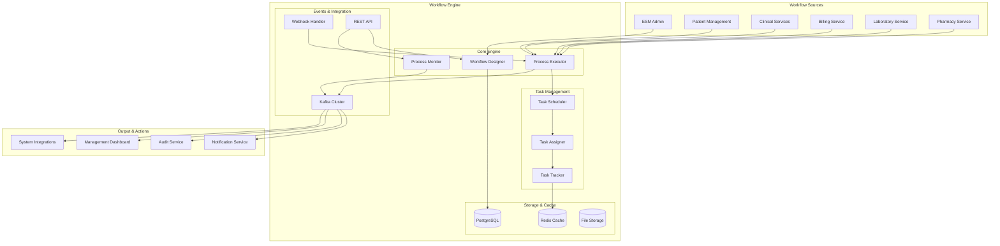

# MS Workflow Engine

The Workflow Engine provides comprehensive business process automation, workflow orchestration, and task management capabilities with Bangladesh healthcare process optimization and regulatory compliance features.

## 📋 Service Overview

**Repository**: `https://github.com/zs-his/ms-workflow-engine`  
**Status**: ✅ Production Ready  
**Version**: 1.0.0  
**Technology Stack**: Go, PostgreSQL, Redis, Apache Kafka, Docker, Kubernetes

### Key Features
- **Workflow Design**: Visual workflow designer with drag-and-drop interface
- **Process Automation**: Automated business process execution
- **Task Management**: Comprehensive task assignment and tracking
- **Bangladesh Processes**: Healthcare-specific workflow templates
- **Approval Workflows**: Multi-level approval and authorization
- **Integration Ready**: Seamless integration with other HIS services

## 🏗️ Architecture Overview



## 🗄️ Database Schema

### Workflow Definitions
```sql
CREATE TABLE workflow_definitions (
    id UUID PRIMARY KEY DEFAULT gen_random_uuid(),
    name VARCHAR(100) NOT NULL,
    description TEXT,
    category VARCHAR(50) NOT NULL,
    version INTEGER NOT NULL DEFAULT 1,
    workflow_config JSONB NOT NULL,
    is_active BOOLEAN DEFAULT true,
    is_published BOOLEAN DEFAULT false,
    created_by UUID NOT NULL,
    created_at TIMESTAMP WITH TIME ZONE DEFAULT NOW(),
    updated_at TIMESTAMP WITH TIME ZONE DEFAULT NOW()
);

CREATE INDEX idx_workflow_definitions_category ON workflow_definitions(category);
CREATE INDEX idx_workflow_definitions_active ON workflow_definitions(is_active);
CREATE UNIQUE INDEX idx_workflow_definitions_name_version ON workflow_definitions(name, version);
```

### Workflow Instances
```sql
CREATE TABLE workflow_instances (
    id UUID PRIMARY KEY DEFAULT gen_random_uuid(),
    workflow_definition_id UUID REFERENCES workflow_definitions(id),
    status VARCHAR(20) NOT NULL,
    context_data JSONB,
    current_step VARCHAR(100),
    started_at TIMESTAMP WITH TIME ZONE DEFAULT NOW(),
    completed_at TIMESTAMP WITH TIME ZONE,
    error_message TEXT,
    initiated_by UUID NOT NULL
);

CREATE INDEX idx_workflow_instances_definition_id ON workflow_instances(workflow_definition_id);
CREATE INDEX idx_workflow_instances_status ON workflow_instances(status);
CREATE INDEX idx_workflow_instances_started_at ON workflow_instances(started_at);
```

### Task Definitions
```sql
CREATE TABLE task_definitions (
    id UUID PRIMARY KEY DEFAULT gen_random_uuid(),
    workflow_definition_id UUID REFERENCES workflow_definitions(id),
    name VARCHAR(100) NOT NULL,
    description TEXT,
    task_type VARCHAR(50) NOT NULL,
    task_config JSONB NOT NULL,
    assignee_type VARCHAR(20),
    approval_required BOOLEAN DEFAULT false,
    timeout_minutes INTEGER,
    position_in_workflow INTEGER NOT NULL
);

CREATE INDEX idx_task_definitions_workflow_id ON task_definitions(workflow_definition_id);
CREATE INDEX idx_task_definitions_type ON task_definitions(task_type);
```

### Task Instances
```sql
CREATE TABLE task_instances (
    id UUID PRIMARY KEY DEFAULT gen_random_uuid(),
    task_definition_id UUID REFERENCES task_definitions(id),
    workflow_instance_id UUID REFERENCES workflow_instances(id),
    status VARCHAR(20) NOT NULL,
    assignee_id UUID,
    assigned_at TIMESTAMP WITH TIME ZONE,
    completed_at TIMESTAMP WITH TIME ZONE,
    task_data JSONB,
    result_data JSONB,
    notes TEXT,
    created_at TIMESTAMP WITH TIME ZONE DEFAULT NOW()
);

CREATE INDEX idx_task_instances_assignee_id ON task_instances(assignee_id);
CREATE INDEX idx_task_instances_status ON task_instances(status);
CREATE INDEX idx_task_instances_workflow_instance_id ON task_instances(workflow_instance_id);
```

## 🔌 API Endpoints

### Workflow Management
```go
// Create workflow definition
POST /api/v1/workflows/definitions
{
    "name": "Patient Admission Process",
    "description": "Complete patient admission workflow",
    "category": "clinical",
    "workflow_config": {
        "steps": [
            {
                "id": "patient_registration",
                "name": "Patient Registration",
                "type": "form_task",
                "config": {
                    "form_id": "patient_admission_form",
                    "required_fields": ["name", "nric", "contact"]
                }
            },
            {
                "id": "bed_assignment",
                "name": "Bed Assignment",
                "type": "api_task",
                "config": {
                    "endpoint": "/api/v1/beds/assign",
                    "method": "POST"
                }
            }
        ]
    }
}

// Start workflow instance
POST /api/v1/workflows/instances
{
    "workflow_definition_id": "uuid",
    "context_data": {
        "patient_id": "patient-123",
        "admission_type": "emergency"
    }
}

// Get workflow instance
GET /api/v1/workflows/instances/{id}
Response: {
    "id": "uuid",
    "workflow_definition": {
        "name": "Patient Admission Process"
    },
    "status": "in_progress",
    "current_step": "bed_assignment",
    "context_data": {
        "patient_id": "patient-123"
    },
    "started_at": "2026-01-21T10:00:00Z"
}
```

### Task Management
```go
// Get user tasks
GET /api/v1/tasks?assignee_id={user_id}&status={status}
Response: {
    "tasks": [
        {
            "id": "uuid",
            "name": "Patient Registration",
            "description": "Complete patient admission form",
            "status": "pending",
            "assignee_id": "user-123",
            "due_date": "2026-01-21T18:00:00Z",
            "workflow_instance": {
                "id": "uuid",
                "name": "Patient Admission Process"
            }
        }
    ],
    "total": 1
}

// Complete task
POST /api/v1/tasks/{id}/complete
{
    "result_data": {
        "patient_name": "John Doe",
        "nric": "123456789012",
        "contact": "01234567890"
    },
    "notes": "Patient successfully registered"
}
```

## 🇧🇩 Bangladesh Workflow Features

### Clinical Workflows
- **Patient Admission**: Complete patient registration and bed assignment
- **Doctor Consultation**: Consultation workflow with diagnosis and treatment
- **Medication Dispensing**: Pharmacy workflow with prescription validation
- **Laboratory Testing**: Lab test ordering and result processing

### Administrative Workflows
- **Staff Onboarding**: New employee registration and training
- **Equipment Procurement**: Medical equipment purchase and installation
- **License Renewal": Healthcare facility and staff license renewal
- **Quality Assurance": Quality control and compliance workflows

### Financial Workflows
- **Insurance Claims**: Insurance claim processing and approval
- **Bill Processing**: Patient billing and payment collection
- **Reimbursement": Government reimbursement processing
- **Budget Approval": Departmental budget approval workflow

### Compliance Workflows
- **DGHS Reporting**: Automated health data reporting to DGHS
- **DGDA Compliance**: Drug regulatory compliance workflows
- **Audit Preparation": Internal and external audit preparation
- **Incident Reporting": Medical incident reporting and investigation

## 🔍 Search and Filtering

### Advanced Workflow Search
```go
GET /api/v1/workflows/search?q={query}&category={category}&status={status}&date_from={date}&date_to={date}
```

### Filter Options
- **Category**: Clinical, Administrative, Financial, Compliance
- **Status**: Draft, Active, Published, Archived
- **Date Range**: Creation date, last modified date
- **Creator**: Workflow author/creator
- **Version**: Specific workflow version

## ⚡ Performance Optimization

### Caching Strategy
- **Redis Cache**: Workflow definitions and active instances
- **Connection Pooling**: Database connection optimization
- **Async Processing**: Non-blocking task execution
- **Batch Operations**: Bulk task processing

### Workflow Optimization
```go
type WorkflowOptimizer struct {
    cache       Cache
    executor    *ProcessExecutor
    monitor     *ProcessMonitor
}

func (wo *WorkflowOptimizer) OptimizeWorkflow(workflow *WorkflowDefinition) error {
    // Analyze workflow structure
    analysis := wo.analyzeWorkflow(workflow)
    
    // Apply optimizations
    if analysis.HasParallelTasks {
        workflow = wo.enableParallelExecution(workflow)
    }
    
    if analysis.HasLongRunningTasks {
        workflow = wo.addAsyncHandling(workflow)
    }
    
    return nil
}
```

### Performance Metrics
```go
type WorkflowMetrics struct {
    WorkflowsExecuted    int64   `json:"workflows_executed"`
    AverageExecutionTime float64 `json:"average_execution_time_ms"`
    SuccessRate          float64 `json:"success_rate"`
    TaskCompletionRate   float64 `json:"task_completion_rate"`
    BottleneckSteps      []string `json:"bottleneck_steps"`
}
```

## 🔧 Workflow Engine

### Process Executor
```go
type ProcessExecutor struct {
    taskRegistry map[string]TaskHandler
    scheduler    *TaskScheduler
    monitor      *ProcessMonitor
}

func (pe *ProcessExecutor) ExecuteWorkflow(instance *WorkflowInstance) error {
    definition := pe.getWorkflowDefinition(instance.WorkflowDefinitionID)
    
    for _, step := range definition.Steps {
        task := pe.createTask(step, instance)
        
        err := pe.scheduler.ScheduleTask(task)
        if err != nil {
            return fmt.Errorf("failed to schedule task %s: %w", step.ID, err)
        }
        
        // Wait for task completion if required
        if step.WaitForCompletion {
            err = pe.waitForTaskCompletion(task.ID)
            if err != nil {
                return err
            }
        }
    }
    
    return nil
}
```

### Task Handlers
```go
type TaskHandler interface {
    Execute(task *TaskInstance) (*TaskResult, error)
    Validate(config TaskConfig) error
    GetRequiredPermissions() []string
}

type FormTaskHandler struct {
    formService FormService
}

func (fth *FormTaskHandler) Execute(task *TaskInstance) (*TaskResult, error) {
    config := task.TaskDefinition.Config
    
    // Get form data
    formData, err := fth.formService.GetFormData(config.FormID)
    if err != nil {
        return nil, err
    }
    
    // Validate form data
    err = fth.validateFormData(formData, config.ValidationRules)
    if err != nil {
        return nil, err
    }
    
    return &TaskResult{
        Status: "completed",
        Data:   formData,
    }, nil
}

type APITaskHandler struct {
    httpClient *http.Client
}

func (ath *APITaskHandler) Execute(task *TaskInstance) (*TaskResult, error) {
    config := task.TaskDefinition.Config
    
    req, err := http.NewRequest(config.Method, config.Endpoint, nil)
    if err != nil {
        return nil, err
    }
    
    resp, err := ath.httpClient.Do(req)
    if err != nil {
        return nil, err
    }
    defer resp.Body.Close()
    
    if resp.StatusCode >= 400 {
        return nil, fmt.Errorf("API request failed with status %d", resp.StatusCode)
    }
    
    return &TaskResult{
        Status: "completed",
        Data:   map[string]interface{}{"response": "success"},
    }, nil
}
```

## 📊 Workflow Designer

### Visual Workflow Builder
```go
type WorkflowDesigner struct {
    components map[string]WorkflowComponent
    validator  *WorkflowValidator
}

type WorkflowComponent interface {
    GetType() string
    GetConfigSchema() map[string]interface{}
    ValidateConfig(config map[string]interface{}) error
    Render() ComponentView
}

type TaskComponent struct {
    ID          string                 `json:"id"`
    Name        string                 `json:"name"`
    Type        string                 `json:"type"`
    Config      map[string]interface{} `json:"config"`
    Position    Position               `json:"position"`
    Connections []Connection           `json:"connections"`
}

type Connection struct {
    From string `json:"from"`
    To   string `json:"to"`
    Type string `json:"type"`
}
```

### Workflow Templates
```go
type WorkflowTemplate struct {
    ID          string                 `json:"id"`
    Name        string                 `json:"name"`
    Description string                 `json:"description"`
    Category    string                 `json:"category"`
    Config      map[string]interface{} `json:"config"`
    Variables   []TemplateVariable     `json:"variables"`
}

type TemplateVariable struct {
    Name         string `json:"name"`
    Type         string `json:"type"`
    Required     bool   `json:"required"`
    DefaultValue string `json:"default_value"`
    Description  string `json:"description"`
}
```

## 🔒 Security Features

### Access Control
- **Role-based Access**: Different access levels for workflow management
- **Task Assignment**: Secure task assignment based on roles and permissions
- **Audit Trail**: Complete audit log of all workflow activities
- **Data Privacy**: Sensitive data protection in workflow contexts

### Compliance
- **Process Compliance**: Healthcare process compliance validation
- **Audit Requirements**: Complete audit trail for regulatory compliance
- **Data Protection**: Bangladesh Data Protection Act compliance
- **Access Logging**: Comprehensive access logging and monitoring

## 📈 Monitoring and Metrics

### Workflow Performance
```go
type WorkflowPerformance struct {
    TotalWorkflows     int64   `json:"total_workflows"`
    ActiveWorkflows    int     `json:"active_workflows"`
    CompletedWorkflows int64   `json:"completed_workflows"`
    AverageExecutionTime float64 `json:"average_execution_time_ms"`
    SuccessRate        float64 `json:"success_rate"`
    ErrorRate          float64 `json:"error_rate"`
}
```

### Task Analytics
```go
type TaskAnalytics struct {
    TotalTasks         int64   `json:"total_tasks"`
    PendingTasks       int     `json:"pending_tasks"`
    CompletedTasks     int64   `json:"completed_tasks"`
    AverageCompletionTime float64 `json:"average_completion_time_hours"`
    OverdueTasks       int     `json:"overdue_tasks"`
    ProductivityScore  float64 `json:"productivity_score"`
}
```

## 🧪 Testing

### Unit Tests
```go
func TestWorkflowExecution(t *testing.T) {
    executor := NewProcessExecutor()
    
    workflow := &WorkflowDefinition{
        Name: "Test Workflow",
        Steps: []WorkflowStep{
            {
                ID:   "step1",
                Type: "form_task",
                Config: map[string]interface{}{
                    "form_id": "test_form",
                },
            },
        },
    }
    
    instance := &WorkflowInstance{
        WorkflowDefinitionID: workflow.ID,
        ContextData:          map[string]interface{}{},
    }
    
    err := executor.ExecuteWorkflow(instance)
    
    assert.NoError(t, err)
    assert.Equal(t, "completed", instance.Status)
}

func TestTaskAssignment(t *testing.T) {
    assigner := NewTaskAssigner()
    
    task := &TaskInstance{
        TaskDefinitionID: "task-123",
        Status:           "pending",
    }
    
    assignee, err := assigner.FindBestAssignee(task)
    
    assert.NoError(t, err)
    assert.NotEmpty(t, assignee)
}
```

### Integration Tests
```go
func TestEndToEndWorkflow(t *testing.T) {
    // Create workflow definition
    definition := createTestWorkflow()
    
    // Start workflow instance
    instance, err := workflowService.StartWorkflow(definition.ID, testContext)
    assert.NoError(t, err)
    
    // Complete first task
    task := getFirstTask(instance.ID)
    err = taskService.CompleteTask(task.ID, testData)
    assert.NoError(t, err)
    
    // Verify workflow completion
    updatedInstance, err := workflowService.GetWorkflowInstance(instance.ID)
    assert.NoError(t, err)
    assert.Equal(t, "completed", updatedInstance.Status)
}
```

## 🚀 Deployment

### Docker Configuration
```dockerfile
FROM golang:1.21-alpine AS builder

WORKDIR /app
COPY go.mod go.sum ./
RUN go mod download

COPY . .
RUN CGO_ENABLED=0 GOOS=linux go build -o workflow-engine ./cmd/server

FROM alpine:latest
RUN apk --no-cache add ca-certificates
WORKDIR /root/

COPY --from=builder /app/workflow-engine .
COPY --from=builder /app/configs ./configs

EXPOSE 8080
CMD ["./workflow-engine"]
```

### Kubernetes Deployment
```yaml
apiVersion: apps/v1
kind: Deployment
metadata:
  name: workflow-engine
spec:
  replicas: 3
  selector:
    matchLabels:
      app: workflow-engine
  template:
    metadata:
      labels:
        app: workflow-engine
    spec:
      containers:
      - name: workflow-engine
        image: zs-his/workflow-engine:1.0.0
        ports:
        - containerPort: 8080
        env:
        - name: DATABASE_URL
          valueFrom:
            secretKeyRef:
              name: db-secret
              key: url
        - name: REDIS_URL
          value: "redis-service:6379"
        - name: KAFKA_BROKERS
          value: "kafka-service:9092"
        resources:
          requests:
            memory: "256Mi"
            cpu: "250m"
          limits:
            memory: "512Mi"
            cpu: "500m"
```

## 🔗 Related Resources

- **Frontend Integration**: [ESM Admin](../frontend/esm-admin.md)
- **Process Design**: [Workflow Design Guide](../guides/workflow-design.md)
- **API Documentation**: [Workflow API Reference](../api-reference/rest-apis.md)
- **Task Management**: [Task Management Guide](../guides/task-management.md)

---

*Last updated: 2026-01-21*
