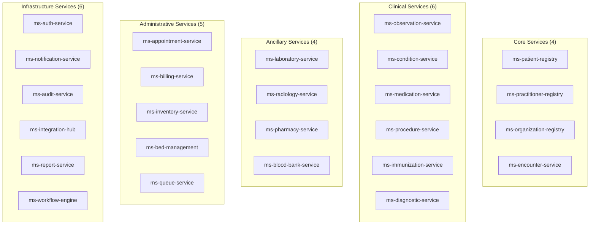
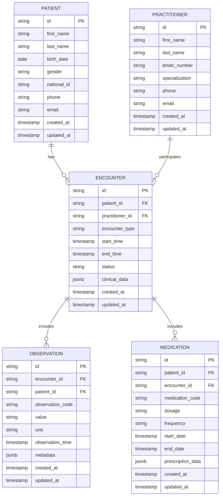
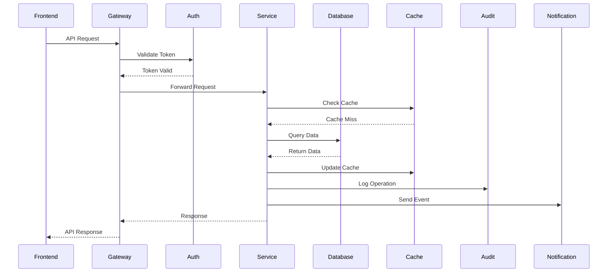
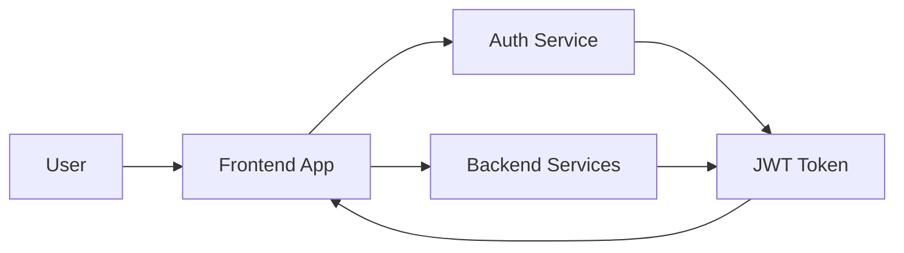

# Backend Overview

The ZARISH HIS backend consists of 25 microservices organized into logical categories, each handling specific domains of healthcare operations. All services are built with Golang 1.25.x and follow FHIR R5 standards.

## 🏗️ Architecture Overview

### Microservices Categories



## 🔧 Technology Stack

### Core Technologies

| Technology | Version | Purpose |
|-------------|--------|---------|
| **Golang** | 1.25.x | Primary programming language |
| **PostgreSQL** | 15+ | Primary database |
| **Redis** | 7+ | Caching and sessions |
| **Docker** | Latest | Containerization |
| **Kubernetes** | 1.28+ | Orchestration |

### Communication Protocols

| Protocol | Use Case | Implementation |
|----------|------------|----------------|
| **REST API** | External communication | HTTP/JSON with FHIR |
| **gRPC** | Internal service communication | Protocol Buffers |
| **Apache Kafka** | Event streaming | Async messaging |
| **WebSocket** | Real-time updates | Live notifications |

## 🗄️ Data Architecture

### Database Schema



### Data Flow



## 🔐 Security Architecture

### Authentication Flow



### Security Layers

1. **Network Security**
   - TLS 1.3 encryption
   - API rate limiting
   - DDoS protection
   - IP whitelisting

2. **Application Security**
   - JWT authentication
   - RBAC authorization
   - Input validation
   - SQL injection prevention
   - XSS protection

3. **Data Security**
   - Encryption at rest
   - Encryption in transit
   - Data masking
   - Audit logging

4. **Compliance Security**
   - HIPAA compliance
   - Data privacy
   - Access controls
   - Audit trails

## 📊 Service Details

### Core Services

#### Patient Registry Service
- **Repository**: [ms-patient-registry](https://github.com/zs-his/ms-patient-registry)
- **Purpose**: Manage patient demographic and medical information
- **FHIR Resources**: Patient, RelatedPerson, Person
- **Key Features**:
  - Patient registration and search
  - Medical record management
  - NID verification
  - Duplicate detection
  - Data export/import

#### Practitioner Registry Service
- **Repository**: [ms-practitioner-registry](https://github.com/zs-his/ms-practitioner-registry)
- **Purpose**: Manage healthcare provider information
- **FHIR Resources**: Practitioner, PractitionerRole
- **Key Features**:
  - Practitioner registration
  - BMDC verification
  - Specialization management
  - Schedule management
  - Credential tracking

#### Organization Registry Service
- **Repository**: [ms-organization-registry](https://github.com/zs-his/ms-organization-registry)
- **Purpose**: Manage healthcare organizations and facilities
- **FHIR Resources**: Organization, Location
- **Key Features**:
  - Hospital registration
  - Department management
  - Facility information
  - Service catalog
  - Location mapping

#### Encounter Service
- **Repository**: [ms-encounter-service](https://github.com/zs-his/ms-encounter-service)
- **Purpose**: Manage clinical encounters and visits
- **FHIR Resources**: Encounter, EpisodeOfCare
- **Key Features**:
  - Encounter creation and management
  - Visit tracking
  - Clinical workflow
  - Status management
  - Encounter types

### Clinical Services

#### Observation Service
- **Repository**: [ms-observation-service](https://github.com/zs-his/ms-observation-service)
- **Purpose**: Manage clinical observations and measurements
- **FHIR Resources**: Observation, DeviceMetric
- **Key Features**:
  - Vital signs recording
  - Clinical measurements
  - Lab results entry
  - Trend analysis
  - Alert thresholds

#### Condition Service
- **Repository**: [ms-condition-service](https://github.com/zs-his/ms-condition-service)
- **Purpose**: Manage medical conditions and diagnoses
- **FHIR Resources**: Condition, AllergyIntolerance
- **Key Features**:
  - Diagnosis recording
  - Condition tracking
  - Allergy management
  - Clinical history
  - ICD-10 coding

#### Medication Service
- **Repository**: [ms-medication-service](https://github.com/zs-his/ms-medication-service)
- **Purpose**: Manage medications and prescriptions
- **FHIR Resources**: Medication, MedicationRequest, MedicationDispense
- **Key Features**:
  - Medication catalog
  - Prescription management
  - Drug interactions
  - Dosage calculations
  - Medication history

### Ancillary Services

#### Laboratory Service
- **Repository**: [ms-laboratory-service](https://github.com/zs-his/ms-laboratory-service)
- **Purpose**: Manage laboratory tests and results
- **FHIR Resources**: DiagnosticReport, Specimen, Observation
- **Key Features**:
  - Test ordering
  - Result entry
  - Quality control
  - Report generation
  - Integration with lab equipment

#### Radiology Service
- **Repository**: [ms-radiology-service](https://github.com/zs-his/ms-radiology-service)
- **Purpose**: Manage radiology imaging and reports
- **FHIR Resources**: ImagingStudy, DiagnosticReport
- **Key Features**:
  - Imaging scheduling
  - DICOM management
  - Report generation
  - Image storage
  - Integration with PACS

#### Pharmacy Service
- **Repository**: [ms-pharmacy-service](https://github.com/zs-his/ms-pharmacy-service)
- **Purpose**: Manage pharmacy operations and dispensing
- **FHIR Resources**: Medication, MedicationDispense
- **Key Features**:
  - Inventory management
  - Prescription dispensing
  - Drug interactions
  - Stock tracking
  - Expiry monitoring

### Administrative Services

#### Appointment Service
- **Repository**: [ms-appointment-service](https://github.com/zs-his/ms-appointment-service)
- **Purpose**: Manage patient appointments and scheduling
- **FHIR Resources**: Appointment, Schedule
- **Key Features**:
  - Appointment scheduling
  - Resource booking
  - Calendar integration
  - Reminders
  - Waitlist management

#### Billing Service
- **Repository**: [ms-billing-service](https://github.com/zs-his/ms-billing-service)
- **Purpose**: Manage billing and financial transactions
- **FHIR Resources**: Account, Invoice, Claim
- **Key Features**:
  - Service billing
  - Invoice generation
  - Insurance claims
  - Payment processing
  - Financial reporting

### Infrastructure Services

#### Auth Service
- **Repository**: [ms-auth-service](https://github.com/zs-his/ms-auth-service)
- **Purpose**: Centralized authentication and authorization
- **Key Features**:
  - User authentication
  - JWT token management
  - Role-based access control
  - Session management
  - Password policies

#### Notification Service
- **Repository**: [ms-notification-service](https://github.com/zs-his/ms-notification-service)
- **Purpose**: Manage notifications and alerts
- **Key Features**:
  - Multi-channel notifications
  - Email/SMS/Push
  - Template management
  - Delivery tracking
  - Notification preferences

#### Audit Service
- **Repository**: [ms-audit-service](https://github.com/zs-his/ms-audit-service)
- **Purpose**: Comprehensive audit logging and compliance
- **Key Features**:
  - Event logging
  - User activity tracking
  - Compliance reporting
  - Log retention
  - Audit trail analysis

## 🚀 Deployment

### Container Configuration

```dockerfile
# Example Dockerfile for microservices
FROM golang:1.25-alpine AS builder

WORKDIR /app
COPY go.mod go.sum ./
RUN go mod download

COPY . .
RUN CGO_ENABLED=0 GOOS=linux go build -o main cmd/server/main.go

FROM alpine:latest
RUN apk --no-cache add ca-certificates
WORKDIR /root/
COPY --from=builder /app/main .
EXPOSE 8080
CMD ["./main"]
```

### Kubernetes Deployment

```yaml
# Example Kubernetes deployment
apiVersion: apps/v1
kind: Deployment
metadata:
  name: ms-patient-registry
spec:
  replicas: 3
  selector:
    matchLabels:
      app: ms-patient-registry
  template:
    metadata:
      labels:
        app: ms-patient-registry
    spec:
      containers:
      - name: ms-patient-registry
        image: zarish-his/ms-patient-registry:latest
        ports:
        - containerPort: 8080
        env:
        - name: DB_HOST
          value: "postgresql-service"
        - name: REDIS_HOST
          value: "redis-service"
        resources:
          requests:
            memory: "256Mi"
            cpu: "250m"
          limits:
            memory: "512Mi"
            cpu: "500m"
```

## 📈 Monitoring and Observability

### Health Checks

```go
// Health check endpoint
func (s *Server) HealthCheck(c *gin.Context) {
    status := map[string]interface{}{
        "status": "healthy",
        "timestamp": time.Now(),
        "version": os.Getenv("SERVICE_VERSION"),
        "database": s.checkDatabase(),
        "redis": s.checkRedis(),
        "kafka": s.checkKafka(),
    }
    
    c.JSON(http.StatusOK, status)
}
```

### Metrics Collection

```go
// Prometheus metrics
var (
    requestsTotal = prometheus.NewCounterVec(
        prometheus.CounterOpts{
            Name: "http_requests_total",
            Help: "Total number of HTTP requests",
        },
        []string{"method", "endpoint", "status"},
    )
    
    requestDuration = prometheus.NewHistogramVec(
        prometheus.HistogramOpts{
            Name: "http_request_duration_seconds",
            Help: "HTTP request duration in seconds",
        },
        []string{"method", "endpoint"},
    )
)
```

## 🧪 Testing

### Unit Testing

```go
// Example unit test
func TestPatientService_CreatePatient(t *testing.T) {
    // Setup
    service := NewPatientService(mockDB, mockCache)
    patient := &Patient{
        Name:        []Name{{Given: []string{"John"}, Family: "Doe"}},
        Gender:      "male",
        BirthDate:   "1990-01-01",
    }
    
    // Execute
    result, err := service.CreatePatient(patient)
    
    // Assert
    assert.NoError(t, err)
    assert.NotNil(t, result)
    assert.NotEmpty(t, result.ID)
    assert.Equal(t, "John", result.Name[0].Given[0])
    assert.Equal(t, "Doe", result.Name[0].Family)
}
```

### Integration Testing

```go
// Example integration test
func TestPatientAPI_CreatePatient(t *testing.T) {
    // Setup test server
    router := setupTestRouter()
    
    // Test data
    patient := map[string]interface{}{
        "name": []map[string]interface{}{
            {"given": []string{"John"}, "family": "Doe"},
        },
        "gender": "male",
        "birthDate": "1990-01-01",
    }
    
    // Make request
    body, _ := json.Marshal(patient)
    req, _ := http.NewRequest("POST", "/api/patients", bytes.NewBuffer(body))
    req.Header.Set("Content-Type", "application/json")
    
    // Execute request
    w := httptest.NewRecorder()
    router.ServeHTTP(w, req)
    
    // Assert response
    assert.Equal(t, http.StatusCreated, w.Code)
    
    var response Patient
    json.Unmarshal(w.Body.Bytes(), &response)
    assert.NotEmpty(t, response.ID)
}
```

## 🔗 Related Resources

- **API Documentation**: [API Reference](../api-reference/)
- **FHIR Implementation**: [FHIR Guide](../fhir/)
- **Deployment Guide**: [Infrastructure](../guides/deployment-guide.md)
- **Security Guidelines**: [Compliance](../compliance/)

---

*Last updated: 2026-01-21*
