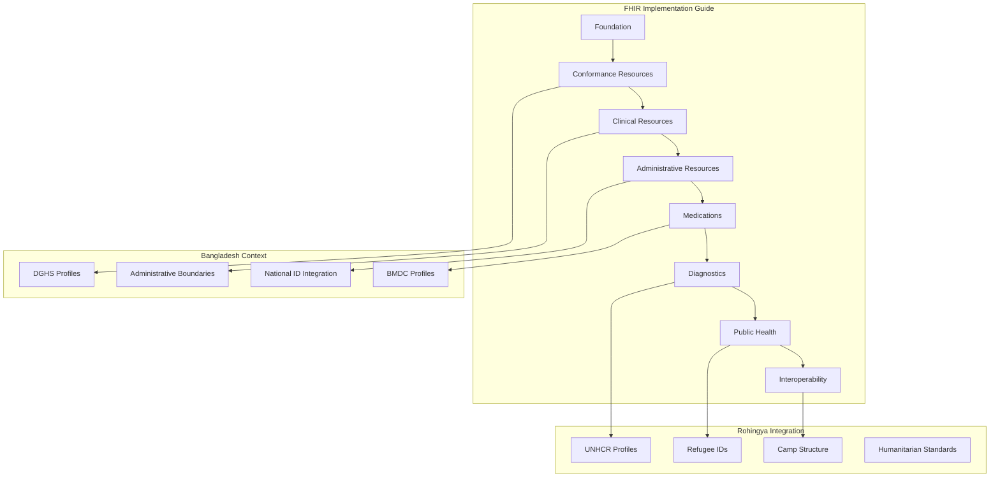

# FHIR Implementation Guide

## 🎯 Overview

Comprehensive FHIR Implementation Guide for ZARISH HIS with Bangladesh healthcare context and Rohingya refugee integration support.

## 🏥 FHIR Architecture

### Implementation Guide Structure



### Implementation Guide Configuration

```json
{
  "resourceType": "ImplementationGuide",
  "id": "zarish-his-ig",
  "url": "https://zarish-his.com/fhir/ImplementationGuide/zarish-his-ig",
  "version": "1.0.0",
  "name": "ZARISHHealthInformationSystemImplementationGuide",
  "title": "ZARISH Health Information System Implementation Guide",
  "status": "active",
  "date": "2026-01-21",
  "publisher": "ZARISH Health Systems",
  "contact": [
    {
      "name": "ZARISH Health Systems",
      "telecom": [
        {
          "system": "url",
          "value": "https://zarish-his.com"
        },
        {
          "system": "email",
          "value": "fhir@zarish-his.com"
        }
      ]
    }
  ],
  "description": "Implementation Guide for ZARISH Health Information System with Bangladesh healthcare context and Rohingya refugee integration",
  "packageId": "com.zarish.his.ig",
  "license": "CC0-1.0",
  "fhirVersion": "5.0.0",
  "dependsOn": [
    {
      "uri": "http://hl7.org/fhir/uv/ips/ImplementationGuide/hl7.fhir.uv.ips",
      "packageId": "hl7.fhir.uv.ips",
      "version": "2.0.0"
    }
  ],
  "definition": {
    "resource": [
      {
        "reference": {
          "reference": "StructureDefinition/zarish-patient"
        },
        "name": "ZARISH Patient Profile",
        "description": "Patient profile with Bangladesh and Rohingya context",
        "exampleBoolean": false
      },
      {
        "reference": {
          "reference": "StructureDefinition/zarish-practitioner"
        },
        "name": "ZARISH Practitioner Profile",
        "description": "Practitioner profile with BMDC integration",
        "exampleBoolean": false
      },
      {
        "reference": {
          "reference": "StructureDefinition/zarish-encounter"
        },
        "name": "ZARISH Encounter Profile",
        "description": "Encounter profile with Bangladesh healthcare workflows",
        "exampleBoolean": false
      }
    ],
    "page": {
      "nameUrl": "toc.html",
      "title": "Table of Contents",
      "generation": "html",
      "page": [
        {
          "nameUrl": "index.html",
          "title": "Home",
          "generation": "markdown"
        },
        {
          "nameUrl": "bangladesh-context.html",
          "title": "Bangladesh Healthcare Context",
          "generation": "markdown"
        },
        {
          "nameUrl": "rohingya-integration.html",
          "title": "Rohingya Refugee Integration",
          "generation": "markdown"
        }
      ]
    }
  }
}
```

## 🏗️ Core FHIR Profiles

### Patient Profile

```xml
<!-- StructureDefinition/zarish-patient.xml -->
<StructureDefinition xmlns="http://hl7.org/fhir">
  <id value="zarish-patient"/>
  <url value="https://zarish-his.com/fhir/StructureDefinition/zarish-patient"/>
  <name value="ZARISHPatient"/>
  <title value="ZARISH Patient Profile"/>
  <status value="active"/>
  <date value="2026-01-21"/>
  <publisher value="ZARISH Health Systems"/>
  <description value="Patient profile with Bangladesh healthcare context and Rohingya refugee integration"/>
  
  <kind value="resource"/>
  <abstract value="false"/>
  <type value="Patient"/>
  <baseDefinition value="http://hl7.org/fhir/StructureDefinition/Patient"/>
  <derivation value="constraint"/>
  
  <differential>
    <element id="Patient.extension">
      <path value="Patient.extension"/>
      <slicing>
        <discriminator>
          <type value="value"/>
          <path value="url"/>
        </discriminator>
        <rules value="open"/>
      </slicing>
    </element>
    
    <!-- Bangladesh Nationality Extension -->
    <element id="Patient.extension:patientNationality">
      <path value="Patient.extension"/>
      <sliceName value="patientNationality"/>
      <min value="0"/>
      <max value="1"/>
      <type>
        <code value="Extension"/>
        <profile value="https://zarish-his.com/fhir/StructureDefinition/patient-nationality"/>
      </type>
    </element>
    
    <!-- BMDC Registration Extension -->
    <element id="Patient.extension:bmdcRegistration">
      <path value="Patient.extension"/>
      <sliceName value="bmdcRegistration"/>
      <min value="0"/>
      <max value="1"/>
      <type>
        <code value="Extension"/>
        <profile value="https://zarish-his.com/fhir/StructureDefinition/bmdc-registration"/>
      </type>
    </element>
    
    <!-- Administrative Address Extension -->
    <element id="Patient.address.extension:administrativeBoundary">
      <path value="Patient.address.extension"/>
      <sliceName value="administrativeBoundary"/>
      <min value="0"/>
      <max value="1"/>
      <type>
        <code value="Extension"/>
        <profile value="https://zarish-his.com/fhir/StructureDefinition/administrative-boundary"/>
      </type>
    </element>
    
    <!-- Refugee Camp Address Extension -->
    <element id="Patient.address.extension:campAddress">
      <path value="Patient.address.extension"/>
      <sliceName value="campAddress"/>
      <min value="0"/>
      <max value="1"/>
      <type>
        <code value="Extension"/>
        <profile value="https://zarish-his.com/fhir/StructureDefinition/camp-address"/>
      </type>
    </element>
    
    <!-- Bangladesh National ID -->
    <element id="Patient.identifier:nationalId">
      <path value="Patient.identifier"/>
      <sliceName value="nationalId"/>
      <min value="0"/>
      <max value="1"/>
      <type>
        <code value="Identifier"/>
      </type>
      <patternIdentifier>
        <system value="https://zarish-his.com/fhir/sid/national-id"/>
        <type>
          <coding>
            <system value="https://zarish-his.com/fhir/vs/identifier-types"/>
            <code value="NID"/>
          </coding>
        </type>
      </patternIdentifier>
    </element>
    
    <!-- ProGress ID -->
    <element id="Patient.identifier:progressId">
      <path value="Patient.identifier"/>
      <sliceName value="progressId"/>
      <min value="0"/>
      <max value="1"/>
      <type>
        <code value="Identifier"/>
      </type>
      <patternIdentifier>
        <system value="https://zarish-his.com/fhir/sid/progress-id"/>
        <type>
          <coding>
            <system value="https://zarish-his.com/fhir/vs/identifier-types"/>
            <code value="PROG"/>
          </coding>
        </type>
      </patternIdentifier>
    </element>
    
    <!-- MRC Card -->
    <element id="Patient.identifier:mrcCard">
      <path value="Patient.identifier"/>
      <sliceName value="mrcCard"/>
      <min value="0"/>
      <max value="1"/>
      <type>
        <code value="Identifier"/>
      </type>
      <patternIdentifier>
        <system value="https://zarish-his.com/fhir/sid/mrc-card"/>
        <type>
          <coding>
            <system value="https://zarish-his.com/fhir/vs/identifier-types"/>
            <code value="MRC"/>
          </coding>
        </type>
      </patternIdentifier>
    </element>
  </differential>
</StructureDefinition>
```

### Practitioner Profile

```xml
<!-- StructureDefinition/zarish-practitioner.xml -->
<StructureDefinition xmlns="http://hl7.org/fhir">
  <id value="zarish-practitioner"/>
  <url value="https://zarish-his.com/fhir/StructureDefinition/zarish-practitioner"/>
  <name value="ZARISHPractitioner"/>
  <title value="ZARISH Practitioner Profile"/>
  <status value="active"/>
  <date value="2026-01-21"/>
  <publisher value="ZARISH Health Systems"/>
  <description value="Practitioner profile with BMDC integration and Bangladesh healthcare context"/>
  
  <kind value="resource"/>
  <abstract value="false"/>
  <type value="Practitioner"/>
  <baseDefinition value="http://hl7.org/fhir/StructureDefinition/Practitioner"/>
  <derivation value="constraint"/>
  
  <differential>
    <element id="Practitioner.extension">
      <path value="Practitioner.extension"/>
      <slicing>
        <discriminator>
          <type value="value"/>
          <path value="url"/>
        </discriminator>
        <rules value="open"/>
      </slicing>
    </element>
    
    <!-- BMDC Registration Extension -->
    <element id="Practitioner.extension:bmdcRegistration">
      <path value="Practitioner.extension"/>
      <sliceName value="bmdcRegistration"/>
      <min value="0"/>
      <max value="1"/>
      <type>
        <code value="Extension"/>
        <profile value="https://zarish-his.com/fhir/StructureDefinition/bmdc-registration"/>
      </type>
    </element>
    
    <!-- BMDC Registration Number -->
    <element id="Practitioner.identifier:bmdcRegistration">
      <path value="Practitioner.identifier"/>
      <sliceName value="bmdcRegistration"/>
      <min value="0"/>
      <max value="1"/>
      <type>
        <code value="Identifier"/>
      </type>
      <patternIdentifier>
        <system value="https://zarish-his.com/fhir/sid/bmdc-registration"/>
        <type>
          <coding>
            <system value="https://zarish-his.com/fhir/vs/identifier-types"/>
            <code value="BMDC"/>
          </coding>
        </type>
      </patternIdentifier>
    </element>
    
    <!-- Speciality -->
    <element id="Practitioner.qualification:speciality">
      <path value="Practitioner.qualification"/>
      <sliceName value="speciality"/>
      <min value="0"/>
      <max value="*"/>
      <type>
        <code value="BackboneElement"/>
      </type>
      <binding>
        <strength value="required"/>
        <valueSet value="https://zarish-his.com/fhir/ValueSet/bmdc-specialities"/>
      </binding>
    </element>
  </differential>
</StructureDefinition>
```

## 🏛️ Bangladesh Healthcare Profiles

### DGHS Integration Profile

```xml
<!-- StructureDefinition/dghs-patient.xml -->
<StructureDefinition xmlns="http://hl7.org/fhir">
  <id value="dghs-patient"/>
  <url value="https://zarish-his.com/fhir/StructureDefinition/dghs-patient"/>
  <name value="DGHSPatient"/>
  <title value="DGHS Patient Profile"/>
  <status value="active"/>
  <date value="2026-01-21"/>
  <publisher value="ZARISH Health Systems"/>
  <description value="Patient profile for DGHS integration with Bangladesh healthcare system"/>
  
  <kind value="resource"/>
  <abstract value="false"/>
  <type value="Patient"/>
  <baseDefinition value="https://zarish-his.com/fhir/StructureDefinition/zarish-patient"/>
  <derivation value="constraint"/>
  
  <differential>
    <!-- DGHS Patient ID -->
    <element id="Patient.identifier:dghsPatientId">
      <path value="Patient.identifier"/>
      <sliceName value="dghsPatientId"/>
      <min value="1"/>
      <max value="1"/>
      <type>
        <code value="Identifier"/>
      </type>
      <patternIdentifier>
        <system value="https://dghs.gov.bd/fhir/sid/patient-id"/>
        <type>
          <coding>
            <system value="https://zarish-his.com/fhir/vs/identifier-types"/>
            <code value="DGHS_PID"/>
          </coding>
        </type>
      </patternIdentifier>
    </element>
    
    <!-- DGHS Health Card -->
    <element id="Patient.identifier:dghsHealthCard">
      <path value="Patient.identifier"/>
      <sliceName value="dghsHealthCard"/>
      <min value="0"/>
      <max value="1"/>
      <type>
        <code value="Identifier"/>
      </type>
      <patternIdentifier>
        <system value="https://dghs.gov.bd/fhir/sid/health-card"/>
        <type>
          <coding>
            <system value="https://zarish-his.com/fhir/vs/identifier-types"/>
            <code value="DGHS_HC"/>
          </coding>
        </type>
      </patternIdentifier>
    </element>
    
    <!-- DGHS Registration Date -->
    <element id="Patient.extension:dghsRegistrationDate">
      <path value="Patient.extension"/>
      <sliceName value="dghsRegistrationDate"/>
      <min value="0"/>
      <max value="1"/>
      <type>
        <code value="Extension"/>
        <profile value="https://zarish-his.com/fhir/StructureDefinition/dghs-registration-date"/>
      </type>
    </element>
  </differential>
</StructureDefinition>
```

### Administrative Boundary Profile

```xml
<!-- StructureDefinition/administrative-boundary.xml -->
<StructureDefinition xmlns="http://hl7.org/fhir">
  <id value="administrative-boundary"/>
  <url value="https://zarish-his.com/fhir/StructureDefinition/administrative-boundary"/>
  <name value="AdministrativeBoundary"/>
  <title value="Bangladesh Administrative Boundary"/>
  <status value="active"/>
  <date value="2026-01-21"/>
  <publisher value="ZARISH Health Systems"/>
  <description value="Bangladesh administrative boundary structure (BD.X.Y.Z.W)"/>
  
  <kind value="complex-type"/>
  <abstract value="false"/>
  <type value="Extension"/>
  <baseDefinition value="http://hl7.org/fhir/StructureDefinition/Extension"/>
  <derivation value="constraint"/>
  
  <differential>
    <element id="Extension.extension">
      <path value="Extension.extension"/>
      <slicing>
        <discriminator>
          <type value="value"/>
          <path value="url"/>
        </discriminator>
        <rules value="open"/>
      </slicing>
    </element>
    
    <!-- Division -->
    <element id="Extension.extension:division">
      <path value="Extension.extension"/>
      <sliceName value="division"/>
      <min value="1"/>
      <max value="1"/>
      <type>
        <code value="Extension"/>
      </type>
      <binding>
        <strength value="required"/>
        <valueSet value="https://zarish-his.com/fhir/ValueSet/bangladesh-divisions"/>
      </binding>
    </element>
    
    <!-- District -->
    <element id="Extension.extension:district">
      <path value="Extension.extension"/>
      <sliceName value="district"/>
      <min value="1"/>
      <max value="1"/>
      <type>
        <code value="Extension"/>
      </type>
      <binding>
        <strength value="required"/>
        <valueSet value="https://zarish-his.com/fhir/ValueSet/bangladesh-districts"/>
      </binding>
    </element>
    
    <!-- Upazila -->
    <element id="Extension.extension:upazila">
      <path value="Extension.extension"/>
      <sliceName value="upazila"/>
      <min value="1"/>
      <max value="1"/>
      <type>
        <code value="Extension"/>
      </type>
      <binding>
        <strength value="required"/>
        <valueSet value="https://zarish-his.com/fhir/ValueSet/bangladesh-upazilas"/>
      </binding>
    </element>
    
    <!-- Union -->
    <element id="Extension.extension:union">
      <path value="Extension.extension"/>
      <sliceName value="union"/>
      <min value="0"/>
      <max value="1"/>
      <type>
        <code value="Extension"/>
      </type>
      <binding>
        <strength value="required"/>
        <valueSet value="https://zarish-his.com/fhir/ValueSet/bangladesh-unions"/>
      </binding>
    </element>
  </differential>
</StructureDefinition>
```

## 🏕️ Rohingya Refugee Profiles

### UNHCR Integration Profile

```xml
<!-- StructureDefinition/unhcr-patient.xml -->
<StructureDefinition xmlns="http://hl7.org/fhir">
  <id value="unhcr-patient"/>
  <url value="https://zarish-his.com/fhir/StructureDefinition/unhcr-patient"/>
  <name value="UNHCRPatient"/>
  <title value="UNHCR Refugee Patient Profile"/>
  <status value="active"/>
  <date value="2026-01-21"/>
  <publisher value="ZARISH Health Systems"/>
  <description value="Patient profile for UNHCR refugee integration with Rohingya refugees"/>
  
  <kind value="resource"/>
  <abstract value="false"/>
  <type value="Patient"/>
  <baseDefinition value="https://zarish-his.com/fhir/StructureDefinition/zarish-patient"/>
  <derivation value="constraint"/>
  
  <differential>
    <!-- UNHCR Registration Number -->
    <element id="Patient.identifier:unhcrRegistration">
      <path value="Patient.identifier"/>
      <sliceName value="unhcrRegistration"/>
      <min value="1"/>
      <max value="1"/>
      <type>
        <code value="Identifier"/>
      </type>
      <patternIdentifier>
        <system value="https://unhcr.org/fhir/sid/registration"/>
        <type>
          <coding>
            <system value="https://zarish-his.com/fhir/vs/identifier-types"/>
            <code value="UNHCR_REG"/>
          </coding>
        </type>
      </patternIdentifier>
    </element>
    
    <!-- Family Counting Number -->
    <element id="Patient.identifier:familyCountingNumber">
      <path value="Patient.identifier"/>
      <sliceName value="familyCountingNumber"/>
      <min value="0"/>
      <max value="1"/>
      <type>
        <code value="Identifier"/>
      </type>
      <patternIdentifier>
        <system value="https://zarish-his.com/fhir/sid/fcn"/>
        <type>
          <coding>
            <system value="https://zarish-his.com/fhir/vs/identifier-types"/>
            <code value="FCN"/>
          </coding>
        </type>
      </patternIdentifier>
    </element>
    
    <!-- Camp Registration Date -->
    <element id="Patient.extension:campRegistrationDate">
      <path value="Patient.extension"/>
      <sliceName value="campRegistrationDate"/>
      <min value="0"/>
      <max value="1"/>
      <type>
        <code value="Extension"/>
        <profile value="https://zarish-his.com/fhir/StructureDefinition/camp-registration-date"/>
      </type>
    </element>
  </differential>
</StructureDefinition>
```

### Camp Address Profile

```xml
<!-- StructureDefinition/camp-address.xml -->
<StructureDefinition xmlns="http://hl7.org/fhir">
  <id value="camp-address"/>
  <url value="https://zarish-his.com/fhir/StructureDefinition/camp-address"/>
  <name value="CampAddress"/>
  <title value="Rohingya Camp Address"/>
  <status value="active"/>
  <date value="2026-01-21"/>
  <publisher value="ZARISH Health Systems"/>
  <description value="Rohingya refugee camp address structure"/>
  
  <kind value="complex-type"/>
  <abstract value="false"/>
  <type value="Extension"/>
  <baseDefinition value="http://hl7.org/fhir/StructureDefinition/Extension"/>
  <derivation value="constraint"/>
  
  <differential>
    <element id="Extension.extension">
      <path value="Extension.extension"/>
      <slicing>
        <discriminator>
          <type value="value"/>
          <path value="url"/>
        </discriminator>
        <rules value="open"/>
      </slicing>
    </element>
    
    <!-- Camp Name -->
    <element id="Extension.extension:campName">
      <path value="Extension.extension"/>
      <sliceName value="campName"/>
      <min value="1"/>
      <max value="1"/>
      <type>
        <code value="Extension"/>
      </type>
      <binding>
        <strength value="required"/>
        <valueSet value="https://zarish-his.com/fhir/ValueSet/rohingya-camps"/>
      </binding>
    </element>
    
    <!-- Block -->
    <element id="Extension.extension:block">
      <path value="Extension.extension"/>
      <sliceName value="block"/>
      <min value="1"/>
      <max value="1"/>
      <type>
        <code value="Extension"/>
      </type>
      <binding>
        <strength value="required"/>
        <valueSet value="https://zarish-his.com/fhir/ValueSet/camp-blocks"/>
      </binding>
    </element>
    
    <!-- Sub-Block -->
    <element id="Extension.extension:subBlock">
      <path value="Extension.extension"/>
      <sliceName value="subBlock"/>
      <min value="0"/>
      <max value="1"/>
      <type>
        <code value="Extension"/>
      </type>
    </element>
    
    <!-- Shelter -->
    <element id="Extension.extension:shelter">
      <path value="Extension.extension"/>
      <sliceName value="shelter"/>
      <min value="0"/>
      <max value="1"/>
      <type>
        <code value="Extension"/>
      </type>
    </element>
  </differential>
</StructureDefinition>
```

## 📊 Clinical Terminology Integration

### Bangladesh-Specific Value Sets

```xml
<!-- ValueSet/bangladesh-divisions.xml -->
<ValueSet xmlns="http://hl7.org/fhir">
  <id value="bangladesh-divisions"/>
  <url value="https://zarish-his.com/fhir/ValueSet/bangladesh-divisions"/>
  <name value="BangladeshDivisions"/>
  <title value="Bangladesh Administrative Divisions"/>
  <status value="active"/>
  <date value="2026-01-21"/>
  <publisher value="ZARISH Health Systems"/>
  <description value="Bangladesh administrative divisions (ADM1 level)"/>
  
  <compose>
    <include>
      <system value="https://zarish-his.com/fhir/sid/administrative-boundaries"/>
      <filter>
        <property value="level"/>
        <op value="="/>
        <value value="1"/>
      </filter>
    </include>
  </compose>
  
  <expansion>
    <contains>
      <system value="https://zarish-his.com/fhir/sid/administrative-boundaries"/>
      <code value="BD.1"/>
      <display value="Barishal"/>
      <designation>
        <language value="bn"/>
        <value value="বরিশাল"/>
      </designation>
    </contains>
    <contains>
      <system value="https://zarish-his.com/fhir/sid/administrative-boundaries"/>
      <code value="BD.2"/>
      <display value="Chattogram"/>
      <designation>
        <language value="bn"/>
        <value value="চট্টগ্রাম"/>
      </designation>
    </contains>
    <contains>
      <system value="https://zarish-his.com/fhir/sid/administrative-boundaries"/>
      <code value="BD.3"/>
      <display value="Dhaka"/>
      <designation>
        <language value="bn"/>
        <value value="ঢাকা"/>
      </designation>
    </contains>
  </expansion>
</ValueSet>
```

### Medical Specialities Value Set

```xml
<!-- ValueSet/bmdc-specialities.xml -->
<ValueSet xmlns="http://hl7.org/fhir">
  <id value="bmdc-specialities"/>
  <url value="https://zarish-his.com/fhir/ValueSet/bmdc-specialities"/>
  <name value="BMDCSpecialities"/>
  <title value="BMDC Medical Specialities"/>
  <status value="active"/>
  <date value="2026-01-21"/>
  <publisher value="ZARISH Health Systems"/>
  <description value="Bangladesh Medical and Dental Council recognized specialities"/>
  
  <compose>
    <include>
      <system value="https://zarish-his.com/fhir/sid/bmdc-specialities"/>
    </include>
  </compose>
  
  <expansion>
    <contains>
      <system value="https://zarish-his.com/fhir/sid/bmdc-specialities"/>
      <code value="001"/>
      <display value="General Medicine"/>
      <designation>
        <language value="bn"/>
        <value value="সাধারণ চিকিৎসা"/>
      </designation>
    </contains>
    <contains>
      <system value="https://zarish-his.com/fhir/sid/bmdc-specialities"/>
      <code value="002"/>
      <display value="Surgery"/>
      <designation>
        <language value="bn"/>
        <value value="সার্জারি"/>
      </designation>
    </contains>
    <contains>
      <system value="https://zarish-his.com/fhir/sid/bmdc-specialities"/>
      <code value="003"/>
      <display value="Pediatrics"/>
      <designation>
        <language value="bn"/>
        <value value="শিশু চিকিৎসা"/>
      </designation>
    </contains>
  </expansion>
</ValueSet>
```

## 🔗 Interoperability Standards

### DGHS Integration Standards

```xml
<!-- CapabilityStatement/dghs-integration.xml -->
<CapabilityStatement xmlns="http://hl7.org/fhir">
  <id value="dghs-integration"/>
  <url value="https://zarish-his.com/fhir/CapabilityStatement/dghs-integration"/>
  <name value="DGHSIntegration"/>
  <title value="DGHS Integration Capability"/>
  <status value="active"/>
  <date value="2026-01-21"/>
  <publisher value="ZARISH Health Systems"/>
  <description value="DGHS integration capabilities for ZARISH HIS"/>
  
  <kind value="instance"/>
  <implementation>
    <description value="ZARISH HIS DGHS Integration"/>
    <url value="https://api.zarish-his.com/fhir"/>
  </implementation>
  
  <rest>
    <mode value="server"/>
    <documentation value="DGHS integration FHIR API"/>
    
    <resource>
      <type value="Patient"/>
      <profile value="https://zarish-his.com/fhir/StructureDefinition/dghs-patient"/>
      <interaction>
        <code value="read"/>
        <documentation value="Read patient data"/>
      </interaction>
      <interaction>
        <code value="create"/>
        <documentation value="Create new patient"/>
      </interaction>
      <interaction>
        <code value="update"/>
        <documentation value="Update patient data"/>
      </interaction>
      <interaction>
        <code value="search-type"/>
        <documentation value="Search patients"/>
      </interaction>
    </resource>
    
    <resource>
      <type value="Encounter"/>
      <profile value="https://zarish-his.com/fhir/StructureDefinition/dghs-encounter"/>
      <interaction>
        <code value="read"/>
        <documentation value="Read encounter data"/>
      </interaction>
      <interaction>
        <code value="create"/>
        <documentation value="Create new encounter"/>
      </interaction>
    </resource>
  </rest>
</CapabilityStatement>
```

### UNHCR Integration Standards

```xml
<!-- CapabilityStatement/unhcr-integration.xml -->
<CapabilityStatement xmlns="http://hl7.org/fhir">
  <id value="unhcr-integration"/>
  <url value="https://zarish-his.com/fhir/CapabilityStatement/unhcr-integration"/>
  <name value="UNHCRIntegration"/>
  <title value="UNHCR Integration Capability"/>
  <status value="active"/>
  <date value="2026-01-21"/>
  <publisher value="ZARISH Health Systems"/>
  <description value="UNHCR integration capabilities for ZARISH HIS refugee services"/>
  
  <kind value="instance"/>
  <implementation>
    <description value="ZARISH HIS UNHCR Integration"/>
    <url value="https://api.zarish-his.com/fhir"/>
  </implementation>
  
  <rest>
    <mode value="server"/>
    <documentation value="UNHCR integration FHIR API for refugee services"/>
    
    <resource>
      <type value="Patient"/>
      <profile value="https://zarish-his.com/fhir/StructureDefinition/unhcr-patient"/>
      <interaction>
        <code value="read"/>
        <documentation value="Read refugee patient data"/>
      </interaction>
      <interaction>
        <code value="create"/>
        <documentation value="Register new refugee patient"/>
      </interaction>
      <interaction>
        <code value="update"/>
        <documentation value="Update refugee patient data"/>
      </interaction>
      <interaction>
        <code value="search-type"/>
        <documentation value="Search refugee patients"/>
      </interaction>
    </resource>
    
    <resource>
      <type value="Observation"/>
      <profile value="https://zarish-his.com/fhir/StructureDefinition/refugee-health-observation"/>
      <interaction>
        <code value="create"/>
        <documentation value="Record refugee health observation"/>
      </interaction>
      <interaction>
        <code value="search-type"/>
        <documentation value="Search refugee health observations"/>
      </interaction>
    </resource>
  </rest>
</CapabilityStatement>
```

---

**Guide Version**: 1.0  
**Last Updated**: January 2026  
**Compliance**: FHIR R5 Standards
