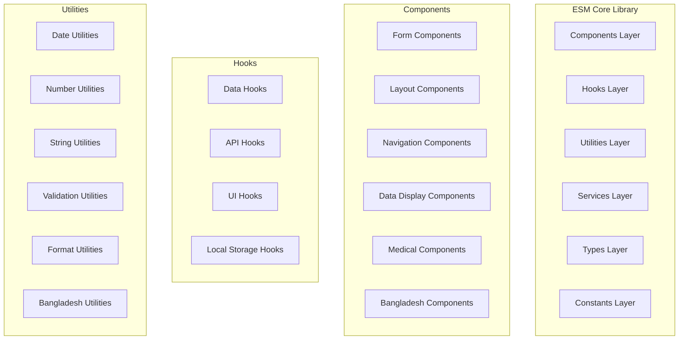

# ESM Core - Enhanced Component Library

## 🎯 Overview

ESM Core is the foundational component library for ZARISH HIS frontend applications,
providing reusable UI components, utilities, hooks, and services with Bangladesh healthcare context
and Rohingya refugee support.

## 🏗️ Architecture Overview

### Library Structure



## 📦 Enhanced Components

### Bangladesh-Specific Components

#### National ID Input Component

```typescript
// src/components/forms/NationalIDInput.tsx
import React, { useState, useEffect } from 'react';
import { Input, Alert } from '@/components/ui';
import { validateNID } from '@/utils/validation';

interface NationalIDInputProps {
  value?: string;
  onChange?: (value: string) => void;
  onError?: (error: string) => void;
  placeholder?: string;
  disabled?: boolean;
}

export const NationalIDInput: React.FC<NationalIDInputProps> = ({
  value,
  onChange,
  onError,
  placeholder = "Enter 13-digit NID",
  disabled = false
}) => {
  const [error, setError] = useState<string>('');
  const [isValidating, setIsValidating] = useState(false);
  
  const handleChange = async (newValue: string) => {
    setError('');
    setIsValidating(true);
    
    // Validate NID format (13 digits)
    if (newValue.length === 13) {
      try {
        const response = await api.post('/api/v1/validation/nid', { nid: newValue });
        
        if (response.data.valid) {
          onChange?.(newValue);
        } else {
          setError(response.data.message || 'Invalid NID');
          onError?.(response.data.message || 'Invalid NID');
        }
      } catch (error) {
        setError('Validation failed');
        onError?.('Validation failed');
      }
    } else {
      onChange?.(newValue);
    }
    
    setIsValidating(false);
  };
  
  return (
    <div className="relative">
      <Input
        value={value}
        onChange={handleChange}
        placeholder={placeholder}
        disabled={disabled || isValidating}
        maxLength={13}
        className={`text-center tracking-wider ${
          error ? 'border-red-500 focus:border-red-500' : ''
        }`}
        error={error}
      />
      
      {isValidating && (
        <div className="absolute right-3 top-3">
          <div className="animate-spin rounded-full h-4 w-4 border-b-2 border-blue-600"></div>
        </div>
      )}
      
      {error && (
        <Alert type="error" message={error} className="mt-2" />
      )}
      
      <div className="text-xs text-gray-500 mt-1">
        13-digit Bangladeshi National ID
      </div>
    </div>
  );
};
```

#### Administrative Boundary Selector

```typescript
// src/components/forms/AdministrativeBoundarySelector.tsx
import React, { useState, useEffect } from 'react';
import { Select } from '@/components/ui';
import { BangladeshDivisions, BangladeshDistricts } from '@/data/bangladesh';

interface AdministrativeBoundarySelectorProps {
  division?: string;
  district?: string;
  upazila?: string;
  union?: string;
  onDivisionChange?: (division: string) => void;
  onDistrictChange?: (district: string) => void;
  onUpazilaChange?: (upazila: string) => void;
  onUnionChange?: (union: string) => void;
}

export const AdministrativeBoundarySelector: React.FC<AdministrativeBoundarySelectorProps> = ({
  division,
  district,
  upazila,
  union,
  onDivisionChange,
  onDistrictChange,
  onUpazilaChange,
  onUnionChange
}) => {
  const [availableDistricts, setAvailableDistricts] = useState<string[]>([]);
  const [availableUpazilas, setAvailableUpazilas] = useState<string[]>([]);
  const [availableUnions, setAvailableUnions] = useState<string[]>([]);
  
  useEffect(() => {
    if (division) {
      const districts = BangladeshDistricts.filter(d => d.divisionCode === division);
      setAvailableDistricts(districts);
    }
  }, [division]);
  
  useEffect(() => {
    if (district) {
      const upazilas = BangladeshUpazilas.filter(u => u.districtCode === district);
      setAvailableUpazilas(upazilas);
    }
  }, [district]);
  
  useEffect(() => {
    if (upazila) {
      const unions = BangladeshUnions.filter(u => u.upazilaCode === upazila);
      setAvailableUnions(unions);
    }
  }, [upazila]);
  
  return (
    <div className="grid grid-cols-1 md:grid-cols-2 lg:grid-cols-4 gap-4">
      <div>
        <label className="block text-sm font-medium text-gray-700 mb-2">
          Division (বিভাগ)
        </label>
        <Select
          value={division}
          onChange={onDivisionChange}
          placeholder="Select Division"
          options={BangladeshDivisions.map(d => ({
            value: d.code,
            label: `${d.name} (${d.nameBn})`,
          }))}
        />
      </div>
      
      <div>
        <label className="block text-sm font-medium text-gray-700 mb-2">
          District (জেলা)
        </label>
        <Select
          value={district}
          onChange={onDistrictChange}
          placeholder="Select District"
          disabled={!division}
          options={availableDistricts.map(d => ({
            value: d.code,
            label: `${d.name} (${d.nameBn})`,
          }))}
        />
      </div>
      
      <div>
        <label className="block text-sm font-medium text-gray-700 mb-2">
          Upazila (উপজেলা)
        </label>
        <Select
          value={upazila}
          onChange={onUpazilaChange}
          placeholder="Select Upazila"
          disabled={!district}
          options={availableUpazilas.map(u => ({
            value: u.code,
            label: `${u.name} (${u.nameBn})`,
          }))}
        />
      </div>
      
      <div>
        <label className="block text-sm font-medium text-gray-700 mb-2">
          Union (ইউনিয়ন)
        </label>
        <Select
          value={union}
          onChange={onUnionChange}
          placeholder="Select Union"
          disabled={!upazila}
          options={availableUnions.map(u => ({
            value: u.code,
            label: `${u.name} (${u.nameBn})`,
          }))}
        />
      </div>
    </div>
  );
};
```

#### Rohingya Camp Selector

```typescript
// src/components/forms/RohingyaCampSelector.tsx
import React, { useState, useEffect } from 'react';
import { Select } from '@/components/ui';
import { RohingyaCamps } from '@/data/rohingya';

interface RohinyaCampSelectorProps {
  camp?: string;
  block?: string;
  subBlock?: string;
  onCampChange?: (camp: string) => void;
  onBlockChange?: (block: string) => void;
  onSubBlockChange?: (subBlock: string) => void;
}

export const RohinyaCampSelector: React.FC<RohinyaCampSelectorProps> = ({
  camp,
  block,
  subBlock,
  onCampChange,
  onBlockChange,
  onSubBlockChange
}) => {
  const [availableBlocks, setAvailableBlocks] = useState<string[]>([]);
  const [availableSubBlocks, setAvailableSubBlocks] = useState<string[]>([]);
  
  useEffect(() => {
    if (camp) {
      const selectedCamp = RohingyaCamps.find(c => c.code === camp);
      if (selectedCamp) {
        setAvailableBlocks(selectedCamp.blocks);
      }
    }
  }, [camp]);
  
  useEffect(() => {
    if (block) {
      const selectedBlock = availableBlocks.find(b => b.code === block);
      if (selectedBlock) {
        setAvailableSubBlocks(selectedBlock.subBlocks);
      }
    }
  }, [block, availableBlocks]);
  
  return (
    <div className="grid grid-cols-1 md:grid-cols-3 gap-4">
      <div>
        <label className="block text-sm font-medium text-gray-700 mb-2">
          Camp (စခား)
        </label>
        <Select
          value={camp}
          onChange={onCampChange}
          placeholder="Select Camp"
          options={RohinyaCamps.map(c => ({
            value: c.code,
            label: `${c.name} (${c.nameMy})`,
          }))}
        />
      </div>
      
      <div>
        <label className="block text-sm font-medium text-gray-700 mb-2">
          Block (တိုံး)
        </label>
        <Select
          value={block}
          onChange={onBlockChange}
          placeholder="Select Block"
          disabled={!camp}
          options={availableBlocks.map(b => ({
            value: b.code,
            label: `${b.name} (${b.nameMy})`,
          }))}
        />
      </div>
      
      <div>
        <label className="block text-sm font-medium text-gray-700 mb-2">
          Sub-Block (တိုံးစား)
        </label>
        <Select
          value={subBlock}
          onChange={onSubBlockChange}
          placeholder="Select Sub-Block"
          disabled={!block}
          options={availableSubBlocks.map(sb => ({
            value: sb.code,
            label: `${sb.name} (${sb.nameMy})`,
          }))}
        />
      </div>
    </div>
  );
};
```

### Medical Components

#### Vital Signs Display

```typescript
// src/components/medical/VitalSignsDisplay.tsx
import React from 'react';
import { Line } from 'react-chartjs-2';
import { VitalSigns, VitalSignReading } from '@/types/medical';

interface VitalSignsDisplayProps {
  vitalSigns: VitalSigns;
  unit?: 'metric' | 'imperial';
  language?: 'en' | 'bn' | 'my';
}

export const VitalSignsDisplay: React.FC<VitalSignsDisplayProps> = ({
  vitalSigns,
  unit = 'metric',
  language = 'en'
}) => {
  const formatValue = (value: number, unit: string) => {
    if (language === 'bn') {
      return `${value.toLocaleString('bn-BD')} ${unit}`;
    }
    return `${value} ${unit}`;
  };
  
  const bloodPressureData = {
    labels: vitalSigns.bloodPressure?.readings?.map(r => 
      new Date(r.timestamp).toLocaleTimeString()
    ) || [],
    datasets: [{
      label: 'Systolic',
      data: vitalSigns.bloodPressure?.readings?.map(r => r.systolic) || [],
      borderColor: 'rgb(239, 68, 68)',
      backgroundColor: 'rgba(239, 68, 68, 0.1)',
    }, {
      label: 'Diastolic',
      data: vitalSigns.bloodPressure?.readings?.map(r => r.diastolic) || [],
      borderColor: 'rgb(59, 130, 246)',
      backgroundColor: 'rgba(59, 130, 246, 0.1)',
    }]
  };
  
  return (
    <div className="bg-white rounded-lg shadow p-6">
      <h3 className="text-lg font-medium text-gray-900 mb-4">
        {language === 'bn' ? 'প্রাণ চিহ্ন' : 'Vital Signs'}
      </h3>
      
      <div className="grid grid-cols-1 md:grid-cols-2 gap-6">
        {/* Blood Pressure */}
        <div className="bg-red-50 p-4 rounded-lg">
          <h4 className="text-md font-medium text-red-900 mb-2">
            {language === 'bn' ? 'রক্তনাচাপ' : 'Blood Pressure'}
          </h4>
          <div className="text-2xl font-bold text-red-700">
            {formatValue(vitalSigns.bloodPressure?.systolic || 0, 'mmHg')} / 
            {formatValue(vitalSigns.bloodPressure?.diastolic || 0, 'mmHg')}
          </div>
          <div className="text-sm text-red-600">
            {vitalSigns.bloodPressure?.timestamp &&
              new Date(vitalSigns.bloodPressure.timestamp).toLocaleString()
            }
          </div>
          <Line data={bloodPressureData} options={{ responsive: true }} />
        </div>
        
        {/* Heart Rate */}
        <div className="bg-pink-50 p-4 rounded-lg">
          <h4 className="text-md font-medium text-pink-900 mb-2">
            {language === 'bn' ? 'হৃদসপন্দ' : 'Heart Rate'}
          </h4>
          <div className="text-2xl font-bold text-pink-700">
            {formatValue(vitalSigns.heartRate || 0, 'bpm')}
          </div>
          <div className="text-sm text-pink-600">
            {vitalSigns.heartRate?.timestamp &&
              new Date(vitalSigns.heartRate.timestamp).toLocaleString()
            }
          </div>
        </div>
        
        {/* Temperature */}
        <div className="bg-blue-50 p-4 rounded-lg">
          <h4 className="text-md font-medium text-blue-900 mb-2">
            {language === 'bn' ? 'তাপরাচ' : 'Temperature'}
          </h4>
          <div className="text-2xl font-bold text-blue-700">
            {formatValue(vitalSigns.temperature || 0, unit === 'metric' ? '°C' : '°F')}
          </div>
          <div className="text-sm text-blue-600">
            {vitalSigns.temperature?.timestamp &&
              new Date(vitalSigns.temperature.timestamp).toLocaleString()
            }
          </div>
        </div>
        
        {/* Oxygen Saturation */}
        <div className="bg-green-50 p-4 rounded-lg">
          <h4 className="text-md font-medium text-green-900 mb-2">
            {language === 'bn' ? 'অক্সিজেন পরিমাণ' : 'Oxygen Saturation'}
          </h4>
          <div className="text-2xl font-bold text-green-700">
            {formatValue(vitalSigns.oxygenSaturation || 0, '%')}
          </div>
          <div className="text-sm text-green-600">
            {vitalSigns.oxygenSaturation?.timestamp &&
              new Date(vitalSigns.oxygenSaturation.timestamp).toLocaleString()
            }
          </div>
        </div>
      </div>
    </div>
  );
};
```

## 🔧 Enhanced Hooks

### Bangladesh Data Hooks

```typescript
// src/hooks/useBangladeshData.ts
import { useState, useEffect } from 'react';
import { BangladeshDivisions, BangladeshDistricts } from '@/data/bangladesh';

export const useBangladeshData = () => {
  const [selectedDivision, setSelectedDivision] = useState<string>('');
  const [selectedDistrict, setSelectedDistrict] = useState<string>('');
  const [availableDistricts, setAvailableDistricts] = useState<string[]>([]);
  const [availableUpazilas, setAvailableUpazilas] = useState<string[]>([]);
  
  const getDistrictsByDivision = (divisionCode: string) => {
    return BangladeshDistricts.filter(d => d.divisionCode === divisionCode);
  };
  
  const getUpazilasByDistrict = (districtCode: string) => {
    return BangladeshUpazilas.filter(u => u.districtCode === districtCode);
  };
  
  const formatAdministrativeCode = (division: string, district: string, upazila: string, union: string) => {
    return `BD.${division}.${district}.${upazila}.${union}`;
  };
  
  return {
    selectedDivision,
    selectedDistrict,
    availableDistricts,
    availableUpazilas,
    setSelectedDivision,
    setSelectedDistrict,
    getDistrictsByDivision,
    getUpazilasByDistrict,
    formatAdministrativeCode,
  };
};
```

### Rohingya Data Hooks

```typescript
// src/hooks/useRohingyaData.ts
import { useState, useEffect } from 'react';
import { RohingyaCamps } from '@/data/rohingya';

export const useRohingyaData = () => {
  const [selectedCamp, setSelectedCamp] = useState<string>('');
  const [selectedBlock, setSelectedBlock] = useState<string>('');
  const [availableBlocks, setAvailableBlocks] = useState<string[]>([]);
  const [availableSubBlocks, setAvailableSubBlocks] = useState<string[]>([]);
  
  const getBlocksByCamp = (campCode: string) => {
    const camp = RohingyaCamps.find(c => c.code === campCode);
    return camp ? camp.blocks : [];
  };
  
  const getSubBlocksByBlock = (campCode: string, blockCode: string) => {
    const camp = RohingyaCamps.find(c => c.code === campCode);
    const block = camp?.blocks.find(b => b.code === blockCode);
    return block ? block.subBlocks : [];
  };
  
  const validateRefugeeID = (type: 'progress' | 'mrc' | 'fcn', value: string) => {
    switch (type) {
      case 'progress':
        return /^PROG\d{9}$/.test(value);
      case 'mrc':
        return /^MRC\d{9}$/.test(value);
      case 'fcn':
        return /^FCN-[A-Z]{3}-BLOCK-[A-Z]-\d{3}$/.test(value);
      default:
        return false;
    }
  };
  
  return {
    selectedCamp,
    selectedBlock,
    availableBlocks,
    availableSubBlocks,
    setSelectedCamp,
    setSelectedBlock,
    getBlocksByCamp,
    getSubBlocksByBlock,
    validateRefugeeID,
  };
};
```

### API Integration Hooks

```typescript
// src/hooks/useZarishAPI.ts
import { useState, useEffect, useCallback } from 'react';
import { api } from '@/services/api';
import { Patient, Appointment, BillingData } from '@/types';

export const useZarishAPI = () => {
  const [loading, setLoading] = useState(false);
  const [error, setError] = useState<string | null>(null);
  
  const createPatient = useCallback(async (patientData: Partial<Patient>) => {
    setLoading(true);
    setError(null);
    
    try {
      const response = await api.post('/patients', patientData);
      return response.data;
    } catch (err) {
      setError(err.message || 'Failed to create patient');
      throw err;
    } finally {
      setLoading(false);
    }
  }, []);
  
  const searchPatients = useCallback(async (filters: any) => {
    setLoading(true);
    setError(null);
    
    try {
      const response = await api.get('/patients', { params: filters });
      return response.data;
    } catch (err) {
      setError(err.message || 'Failed to search patients');
      throw err;
    } finally {
      setLoading(false);
    }
  }, []);
  
  const getPatientById = useCallback(async (id: string) => {
    setLoading(true);
    setError(null);
    
    try {
      const response = await api.get(`/patients/${id}`);
      return response.data;
    } catch (err) {
      setError(err.message || 'Failed to get patient');
      throw err;
    } finally {
      setLoading(false);
    }
  }, []);
  
  return {
    loading,
    error,
    createPatient,
    searchPatients,
    getPatientById,
  };
};
```

## 🌐 Bangladesh Healthcare Integration

### Language Support

```typescript
// src/contexts/BangladeshLanguageContext.tsx
import React, { createContext, useContext, useState, useEffect } from 'react';

type Language = 'en' | 'bn';

interface BangladeshLanguageContextType {
  language: Language;
  setLanguage: (lang: Language) => void;
  t: (key: string, params?: Record<string, any>) => string;
  formatDate: (date: Date) => string;
  formatNumber: (number: number) => string;
  formatCurrency: (number: number) => string;
}

const translations = {
  en: {
    welcome: 'Welcome',
    patients: 'Patients',
    appointments: 'Appointments',
    billing: 'Billing',
    rohingya_patients: 'Rohingya Patients',
    blood_pressure: 'Blood Pressure',
    heart_rate: 'Heart Rate',
    temperature: 'Temperature',
    oxygen_saturation: 'Oxygen Saturation',
  },
  bn: {
    welcome: 'স্বাগতময়ন',
    patients: 'রোগী',
    appointments: 'অ্যাপয়ন্টমেন্ট',
    billing: 'বিলিং',
    rohingya_patients: 'রোহিঙ্গা রোগী',
    blood_pressure: 'রক্তনাচাপ',
    heart_rate: 'হৃদসপন্দ',
    temperature: 'তাপরাচ',
    oxygen_saturation: 'অক্সিজেন পরিমাণ',
  },
};

export const BangladeshLanguageContext = createContext<BangladeshLanguageContextType | undefined>(undefined);

export const BangladeshLanguageProvider: React.FC<{ children: React.ReactNode }> = ({ children }) => {
  const [language, setLanguage] = useState<Language>('bn');
  
  const t = (key: string, params?: Record<string, any>) => {
    let translation = translations[language][key] || key;
    
    if (params) {
      Object.keys(params).forEach(param => {
        translation = translation.replace(`{{${param}}}`, params[param]);
      });
    }
    
    return translation;
  };
  
  const formatDate = (date: Date) => {
    return new Intl.DateTimeFormat(language === 'bn' ? 'bn-BD' : 'en-US').format(date);
  };
  
  const formatNumber = (number: number) => {
    return new Intl.NumberFormat(language === 'bn' ? 'bn-BD' : 'en-US').format(number);
  };
  
  const formatCurrency = (number: number) => {
    if (language === 'bn') {
      return `৳${number.toLocaleString('bn-BD')}`;
    }
    return new Intl.NumberFormat('en-US', {
      style: 'currency',
      currency: 'BDT',
    }).format(number);
  };
  
  return (
    <BangladeshLanguageContext.Provider value={{
      language,
      setLanguage,
      t,
      formatDate,
      formatNumber,
      formatCurrency,
    }}>
      {children}
    </BangladeshLanguageContext.Provider>
  );
};

export const useBangladeshLanguage = () => useContext(BangladeshLanguageContext);
```

## 🔒 Security Implementation

### Data Protection

```typescript
// src/utils/security.ts
import CryptoJS from 'crypto-js';

const ENCRYPTION_KEY = process.env.REACT_APP_ENCRYPTION_KEY || 'zarish-his-2026';

export class SecurityUtils {
  static encryptSensitiveData(data: any): string {
    return CryptoJS.AES.encrypt(JSON.stringify(data), ENCRYPTION_KEY).toString();
  }
  
  static decryptSensitiveData(encryptedData: string): any {
    const bytes = CryptoJS.AES.decrypt(encryptedData, ENCRYPTION_KEY);
    return JSON.parse(bytes.toString(CryptoJS.enc.Utf8));
  }
  
  static hashPassword(password: string): string {
    return CryptoJS.SHA256(password).toString();
  }
  
  static validateInput(input: string, type: 'nid' | 'phone' | 'email'): boolean {
    switch (type) {
      case 'nid':
        return /^\d{13}$/.test(input);
      case 'phone':
        return /^\+880\d{10}$/.test(input);
      case 'email':
        return /^[^\s@]+@[^\s@]+\.[^\s@]+$/.test(input);
      default:
        return false;
    }
  }
  
  static sanitizeInput(input: string): string {
    return input.replace(/<script\b[^<]*(?:(?!<\/script>)<[^<]*<\/script>|[\s\S])/gi, '');
  }
}
```

---

**Library Version**: 2.0  
**Last Updated**: January 2026  
**React Version**: 19.3.0  
**TypeScript Version**: 5.0  
**Compliance**: ZARISH HIS Frontend Standards
