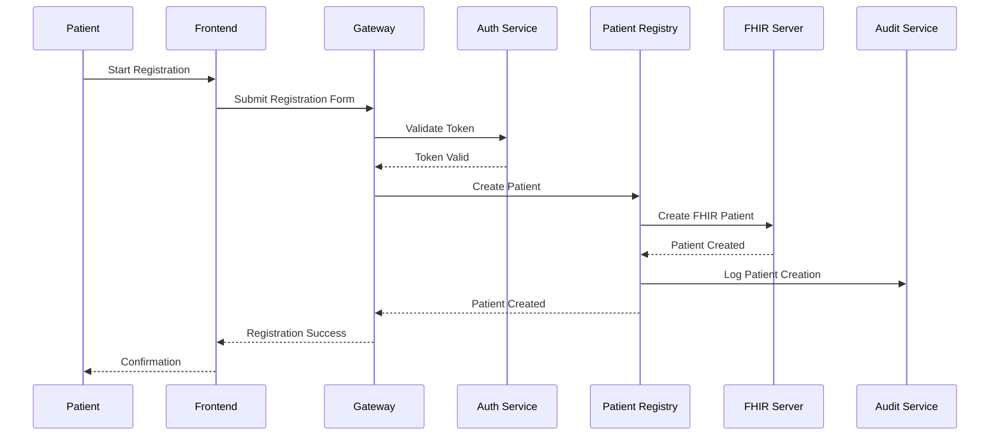
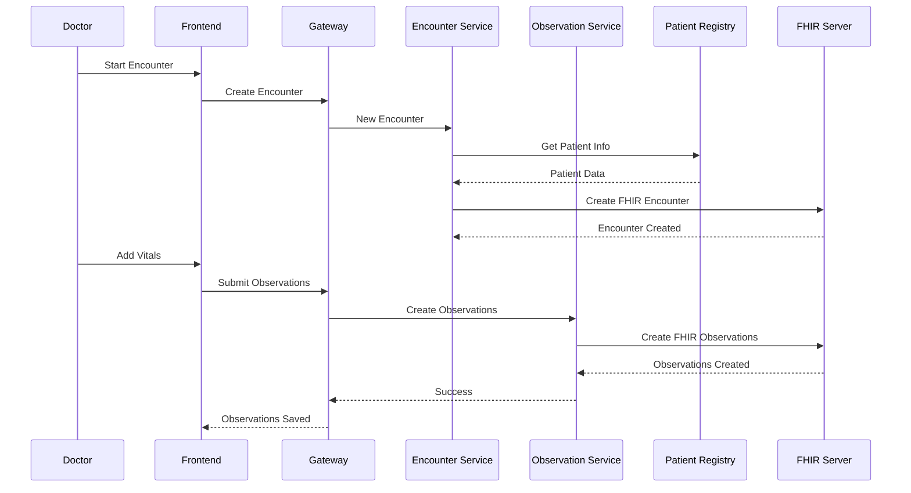
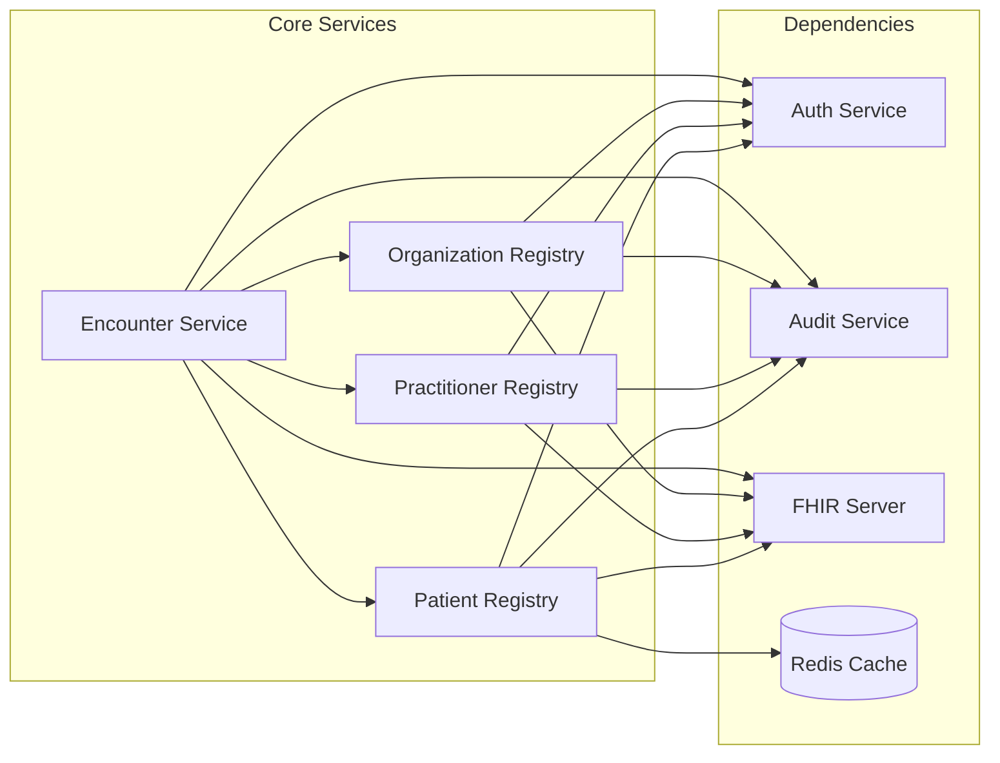
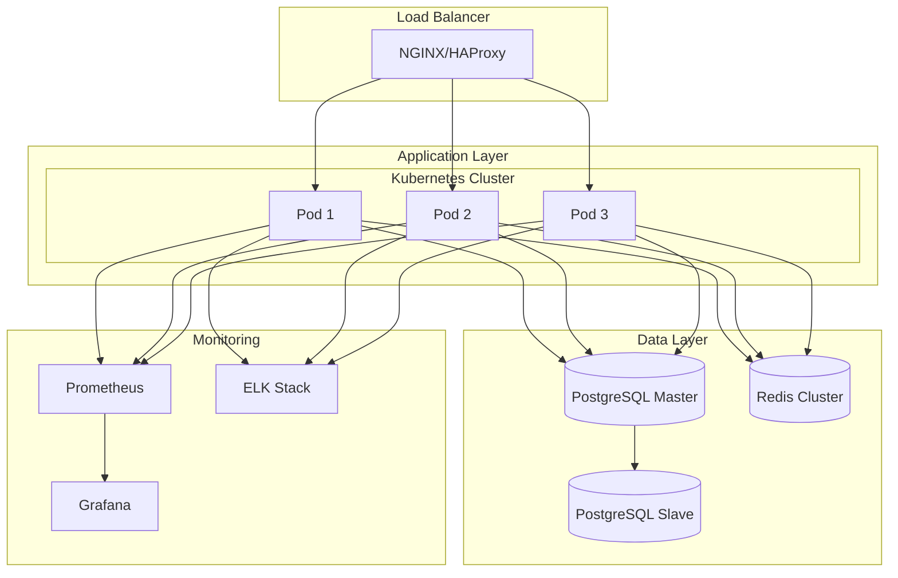
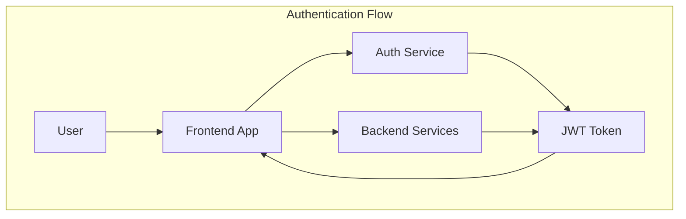

# ZARISH HIS Architecture

This section provides detailed architectural documentation for the ZARISH Health Information System.

## 🏗️ High-Level Architecture

```mermaid
graph TB
    subgraph "Frontend Layer"
        ESM[esm-core Framework]
        PM[esm-patient-management]
        PC[esm-patient-chart]
        FE[esm-form-engine]
        PH[esm-pharmacy]
        LA[esm-laboratory]
        RA[esm-radiology]
        BI[esm-billing]
        IN[esm-inpatient]
        AD[esm-admin]
        RE[esm-reports]
        EM[esm-emergency]
        SU[esm-surgery]
        MH[esm-maternal-health]
        MO[esm-mobile]
    end
    
    subgraph "API Gateway"
        GW[Kong/APISIX Gateway]
        AUTH[Authentication Service]
        RATE[Rate Limiting]
        LB[Load Balancer]
    end
    
    subgraph "Backend Services"
        subgraph "Core Services"
            PR[ms-patient-registry]
            PRACT[ms-practitioner-registry]
            ORG[ms-organization-registry]
            ENC[ms-encounter-service]
        end
        
        subgraph "Clinical Services"
            OBS[ms-observation-service]
            COND[ms-condition-service]
            MED[ms-medication-service]
            PROC[ms-procedure-service]
            IMM[ms-immunization-service]
            DIAG[ms-diagnostic-service]
        end
        
        subgraph "Ancillary Services"
            LAB[ms-laboratory-service]
            RAD[ms-radiology-service]
            PHARM[ms-pharmacy-service]
            BB[ms-blood-bank-service]
        end
        
        subgraph "Administrative Services"
            APPT[ms-appointment-service]
            BILL[ms-billing-service]
            INV[ms-inventory-service]
            BED[ms-bed-management]
            QUEUE[ms-queue-service]
        end
        
        subgraph "Infrastructure Services"
            AUTH_SVC[ms-auth-service]
            NOTIF[ms-notification-service]
            AUDIT[ms-audit-service]
            INTEG[ms-integration-hub]
            REPORT[ms-report-service]
            WORKFLOW[ms-workflow-engine]
        end
    end
    
    subgraph "Data Layer"
        PG[(PostgreSQL)]
        REDIS[(Redis)]
        FHIR[FHIR Server]
        FILES[File Storage]
    end
    
    subgraph "External Systems"
        DGHS[DGHS Systems]
        INSURANCE[Insurance Gateways]
        LABS[External Labs]
        PHARMACIES[External Pharmacies]
    end
    
    %% Frontend to Gateway
    PM --> GW
    PC --> GW
    FE --> GW
    PH --> GW
    LA --> GW
    RA --> GW
    BI --> GW
    IN --> GW
    AD --> GW
    RE --> GW
    EM --> GW
    SU --> GW
    MH --> GW
    MO --> GW
    
    %% Gateway to Services
    GW --> AUTH
    GW --> RATE
    GW --> LB
    
    %% Load Balancer to Services
    LB --> PR
    LB --> PRACT
    LB --> ORG
    LB --> ENC
    LB --> OBS
    LB --> COND
    LB --> MED
    LB --> PROC
    LB --> IMM
    LB --> DIAG
    LB --> LAB
    LB --> RAD
    LB --> PHARM
    LB --> BB
    LB --> APPT
    LB --> BILL
    LB --> INV
    LB --> BED
    LB --> QUEUE
    LB --> AUTH_SVC
    LB --> NOTIF
    LB --> AUDIT
    LB --> INTEG
    LB --> REPORT
    LB --> WORKFLOW
    
    %% Services to Data
    PR --> PG
    PRACT --> PG
    ORG --> PG
    ENC --> PG
    OBS --> PG
    COND --> PG
    MED --> PG
    PROC --> PG
    IMM --> PG
    DIAG --> PG
    LAB --> PG
    RAD --> PG
    PHARM --> PG
    BB --> PG
    APPT --> PG
    BILL --> PG
    INV --> PG
    BED --> PG
    QUEUE --> PG
    AUTH_SVC --> PG
    NOTIF --> PG
    AUDIT --> PG
    INTEG --> PG
    REPORT --> PG
    WORKFLOW --> PG
    
    %% Caching
    AUTH_SVC --> REDIS
    PR --> REDIS
    OBS --> REDIS
    BILL --> REDIS
    
    %% FHIR Integration
    PR --> FHIR
    PRACT --> FHIR
    ENC --> FHIR
    OBS --> FHIR
    COND --> FHIR
    MED --> FHIR
    
    %% File Storage
    LAB --> FILES
    RAD --> FILES
    BILL --> FILES
    
    %% External Integrations
    INTEG --> DGHS
    BILL --> INSURANCE
    LAB --> LABS
    PHARM --> PHARMACIES
```

## 🔄 Data Flow Architecture

### Patient Registration Flow

### Clinical Encounter Flow

## 🏛️ Service Dependencies

### Core Service Dependencies

## 🔧 Technology Stack

### Frontend Technologies
- **React 19+**: Modern UI framework
- **TypeScript**: Type-safe development
- **Material-UI**: Component library
- **Redux Toolkit**: State management
- **React Query**: Data fetching
- **Vite**: Build tool

### Backend Technologies
- **Golang 1.25.x**: Primary backend language
- **PostgreSQL**: Primary database
- **Redis**: Caching and sessions
- **Docker**: Containerization
- **Kubernetes**: Orchestration

### Integration Technologies
- **FHIR R5**: Healthcare data standard
- **HL7 v2**: Legacy system integration
- **REST APIs**: External integrations
- **gRPC**: Internal service communication
- **Apache Kafka**: Event streaming

## 🌐 Deployment Architecture

### Production Environment

## 🔒 Security Architecture

### Authentication & Authorization

### Security Layers

1. **Network Security**
   - TLS/SSL encryption
   - Firewall rules
   - DDoS protection

2. **Application Security**
   - JWT authentication
   - RBAC authorization
   - Input validation
   - SQL injection prevention

3. **Data Security**
   - Encryption at rest
   - Encryption in transit
   - Data masking
   - Audit logging

4. **Compliance Security**
   - HIPAA compliance
   - Data privacy
   - Audit trails
   - Access controls

---

*For more detailed architecture information, see:*
- [Service Dependencies](service-dependencies.md)
- [Data Flows](data-flows.md)
- [Deployment Architecture](deployment-architecture.md)
- [Frontend Dependencies](frontend-dependencies.md)

*Last updated: 2026-01-21*
