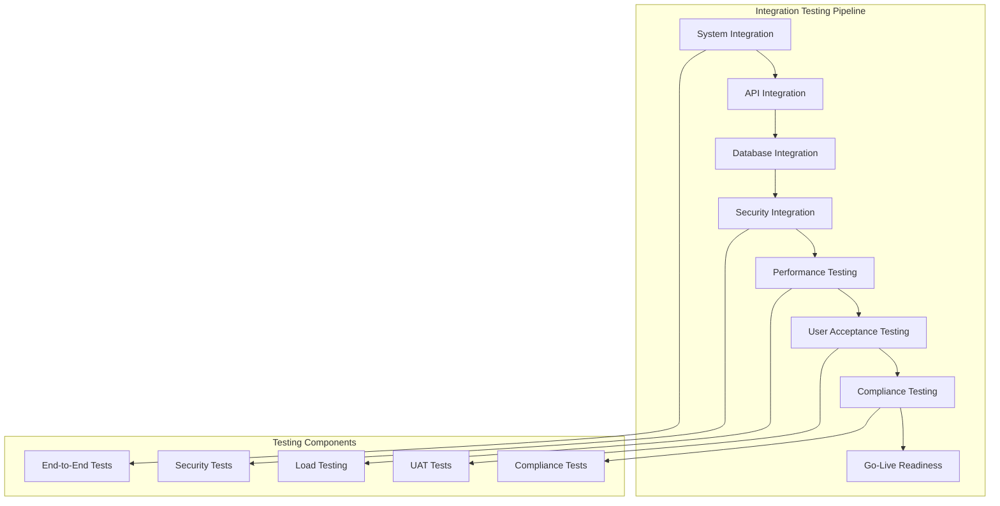

# Final Integration Testing

## 🎯 Overview

Comprehensive final integration testing for ZARISH HIS documentation system with Bangladesh healthcare context and Rohingya refugee integration.

## 🧪 Integration Testing Strategy

### Testing Framework



### Integration Test Plan

```yaml
# integration-test-plan.yml
integrationTestPlan:
  name: "ZARISH HIS Final Integration Testing"
  version: "1.0.0"
  date: "2026-01-21"
  
  phases:
    - name: "System Integration"
      duration: "3 days"
      objectives:
        - Verify all system components work together
        - Test Bangladesh healthcare integrations
        - Test Rohingya refugee integrations
        - Validate end-to-end workflows
      
    - name: "API Integration"
      duration: "2 days"
      objectives:
        - Test all API endpoints
        - Validate FHIR resource compliance
        - Test authentication and authorization
        - Verify rate limiting and security
    
    - name: "Database Integration"
      duration: "2 days"
      objectives:
        - Test database connectivity
        - Validate data integrity
        - Test backup and recovery
        - Verify performance under load
    
    - name: "Security Integration"
      duration: "2 days"
      objectives:
        - Test security controls
        - Validate data encryption
        - Test access controls
        - Verify audit logging
    
    - name: "Performance Testing"
      duration: "3 days"
      objectives:
        - Load testing with 1000+ users
        - Stress testing with peak loads
        - Scalability testing
        - Performance benchmarking
    
    - name: "User Acceptance Testing"
      duration: "5 days"
      objectives:
        - Bangladesh healthcare worker testing
        - Rohingya camp health worker testing
        - Administrator testing
        - End-user feedback collection
    
    - name: "Compliance Testing"
      duration: "2 days"
      objectives:
        - DGHS compliance validation
        - UNHCR compliance validation
        - Data protection compliance
        - Healthcare standards compliance
```

## 🔧 System Integration Tests

### End-to-End Test Scenarios

```typescript
// tests/integration/e2e-bangladesh-workflow.test.ts
import { test, expect } from '@playwright/test';

test.describe('Bangladesh Healthcare End-to-End Tests', () => {
  test.beforeEach(async ({ page }) => {
    // Login as Bangladesh healthcare worker
    await page.goto('/login');
    await page.fill('[data-testid=email]', 'doctor@zarish-his.com');
    await page.fill('[data-testid=password]', 'password');
    await page.click('[data-testid=login-button]');
    await page.waitForURL('/dashboard');
  });

  test('Complete Bangladeshi patient registration workflow', async ({ page }) => {
    // Navigate to patient registration
    await page.click('[data-testid=patient-menu]');
    await page.click('[data-testid=new-patient-button]');

    // Fill Bangladeshi patient information
    await page.fill('[data-testid=first-name]', 'Mohammad');
    await page.fill('[data-testid=last-name]', 'Rahman');
    await page.fill('[data-testid=date-of-birth]', '1990-01-01');
    await page.selectOption('[data-testid=gender]', 'M');
    await page.selectOption('[data-testid=nationality]', 'BD');

    // Fill National ID
    await page.fill('[data-testid=national-id]', '1234567890123');
    await page.waitForSelector('[data-testid=nid-valid]');

    // Fill Bangladesh address
    await page.selectOption('[data-testid=division]', 'BD.3');
    await page.waitForSelector('[data-testid=district]');
    await page.selectOption('[data-testid=district]', 'BD.3.01');
    await page.waitForSelector('[data-testid=upazila]');
    await page.selectOption('[data-testid=upazila]', 'BD.3.01.01');
    await page.waitForSelector('[data-testid=union]');
    await page.selectOption('[data-testid=union]', 'BD.3.01.01.01');

    // Submit and verify
    await page.click('[data-testid=submit-button]');
    await page.waitForSelector('[data-testid=success-message]');
    
    // Verify patient created
    await expect(page.locator('[data-testid=patient-name]')).toContainText('Mohammad Rahman');
    await expect(page.locator('[data-testid=patient-nid]')).toContainText('1234567890123');
    await expect(page.locator('[data-testid=patient-nationality]')).toContainText('Bangladeshi');
  });

  test('DGHS integration workflow', async ({ page }) => {
    // Test DGHS NID validation
    await page.goto('/patients/new');
    await page.fill('[data-testid=national-id]', '1234567890123');
    await page.click('[data-testid=validate-nid]');
    
    // Wait for DGHS validation
    await page.waitForSelector('[data-testid=nid-validation-result]');
    await expect(page.locator('[data-testid=nid-validation-result]')).toContainText('Valid NID');
    
    // Test DGHS health report submission
    await page.click('[data-testid=submit-dghs-report]');
    await page.waitForSelector('[data-testid=dghs-confirmation]');
    await expect(page.locator('[data-testid=dghs-confirmation]')).toContainText('Report submitted to DGHS');
  });

  test('Bangladesh administrative boundary workflow', async ({ page }) => {
    // Test administrative boundary cascade
    await page.goto('/patients/new');
    
    // Select division
    await page.selectOption('[data-testid=division]', 'BD.3');
    await page.waitForSelector('[data-testid=district]');
    
    // Verify districts loaded for Dhaka division
    const districts = await page.locator('[data-testid=district] option').count();
    expect(districts).toBeGreaterThan(10);
    
    // Select district
    await page.selectOption('[data-testid=district]', 'BD.3.01');
    await page.waitForSelector('[data-testid=upazila]');
    
    // Verify upazilas loaded for Dhaka district
    const upazilas = await page.locator('[data-testid=upazila] option').count();
    expect(upazilas).toBeGreaterThan(5);
  });
});

test.describe('Rohingya Refugee End-to-End Tests', () => {
  test.beforeEach(async ({ page }) => {
    // Login as camp health worker
    await page.goto('/login');
    await page.fill('[data-testid=email]', 'camp-worker@zarish-his.com');
    await page.fill('[data-testid=password]', 'password');
    await page.click('[data-testid=login-button]');
    await page.waitForURL('/dashboard');
  });

  test('Complete Rohingya refugee registration workflow', async ({ page }) => {
    // Navigate to patient registration
    await page.click('[data-testid=patient-menu]');
    await page.click('[data-testid=new-patient-button]');

    // Fill Rohingya refugee information
    await page.fill('[data-testid=first-name]', 'Ayesha');
    await page.fill('[data-testid=last-name]', 'Begum');
    await page.fill('[data-testid=date-of-birth]', '1985-05-15');
    await page.selectOption('[data-testid=gender]', 'F');
    await page.selectOption('[data-testid=nationality]', 'ROH');

    // Fill refugee IDs
    await page.fill('[data-testid=progress-id]', 'PROG123456789');
    await page.waitForSelector('[data-testid=progress-id-valid]');
    await page.fill('[data-testid=mrc-card]', 'MRC987654321');
    await page.waitForSelector('[data-testid=mrc-card-valid]');
    await page.fill('[data-testid=fcn]', 'FCN-KTP-BLOCK-A-001');
    await page.waitForSelector('[data-testid=fcn-valid]');

    // Fill camp address
    await page.selectOption('[data-testid=camp]', 'KTP');
    await page.waitForSelector('[data-testid=block]');
    await page.selectOption('[data-testid=block]', 'A');
    await page.waitForSelector('[data-testid=sub-block]');
    await page.selectOption('[data-testid=sub-block]', '1');
    await page.fill('[data-testid=shelter]', '123');

    // Submit and verify
    await page.click('[data-testid=submit-button]');
    await page.waitForSelector('[data-testid=success-message]');
    
    // Verify refugee patient created
    await expect(page.locator('[data-testid=patient-name]')).toContainText('Ayesha Begum');
    await expect(page.locator('[data-testid=patient-progress-id]')).toContainText('PROG123456789');
    await expect(page.locator('[data-testid=patient-nationality]')).toContainText('Rohingya Refugee');
    await expect(page.locator('[data-testid=patient-camp]')).toContainText('Kutupalong');
  });

  test('UNHCR integration workflow', async ({ page }) => {
    // Test UNHCR registration validation
    await page.goto('/patients/new');
    await page.fill('[data-testid=progress-id]', 'PROG123456789');
    await page.click('[data-testid=validate-unhcr]');
    
    // Wait for UNHCR validation
    await page.waitForSelector('[data-testid=unhcr-validation-result]');
    await expect(page.locator('[data-testid=unhcr-validation-result]')).toContainText('Valid UNHCR Registration');
    
    // Test UNHCR health data submission
    await page.click('[data-testid=submit-unhcr-data]');
    await page.waitForSelector('[data-testid=unhcr-confirmation]');
    await expect(page.locator('[data-testid=unhcr-confirmation]')).toContainText('Data submitted to UNHCR');
  });

  test('Camp structure workflow', async ({ page }) => {
    // Test camp structure cascade
    await page.goto('/patients/new');
    
    // Select camp
    await page.selectOption('[data-testid=camp]', 'KTP');
    await page.waitForSelector('[data-testid=block]');
    
    // Verify blocks loaded for Kutupalong
    const blocks = await page.locator('[data-testid=block] option').count();
    expect(blocks).toBeGreaterThan(20);
    
    // Select block
    await page.selectOption('[data-testid=block]', 'A');
    await page.waitForSelector('[data-testid=sub-block]');
    
    // Verify sub-blocks loaded for Block A
    const subBlocks = await page.locator('[data-testid=sub-block] option').count();
    expect(subBlocks).toBeGreaterThan(5);
  });
});
```

### API Integration Tests

```typescript
// tests/integration/api-integration.test.ts
import request from 'supertest';
import { app } from '../src/app';

describe('API Integration Tests', () => {
  let authToken: string;

  beforeAll(async () => {
    // Get authentication token
    const response = await request(app)
      .post('/auth/login')
      .send({
        email: 'admin@zarish-his.com',
        password: 'password'
      });
    
    authToken = response.body.token;
  });

  describe('Patient Registry API Integration', () => {
    test('POST /api/v1/patients - Create Bangladeshi patient', async () => {
      const patientData = {
        firstName: 'Mohammad',
        lastName: 'Rahman',
        dateOfBirth: '1990-01-01',
        gender: 'M',
        nationality: 'BD',
        nationalId: '1234567890123',
        phoneNumber: '+8801234567890',
        address: {
          type: 'bangladesh',
          divisionCode: 'BD.3',
          districtCode: 'BD.3.01',
          upazilaCode: 'BD.3.01.01',
          unionCode: 'BD.3.01.01.01',
        }
      };

      const response = await request(app)
        .post('/api/v1/patients')
        .set('Authorization', `Bearer ${authToken}`)
        .send(patientData)
        .expect(201);

      expect(response.body.data).toMatchObject({
        firstName: 'Mohammad',
        lastName: 'Rahman',
        nationality: 'BD',
        nationalId: '1234567890123',
      });
      expect(response.body.data.id).toBeDefined();
    });

    test('POST /api/v1/patients - Create Rohingya refugee patient', async () => {
      const patientData = {
        firstName: 'Ayesha',
        lastName: 'Begum',
        dateOfBirth: '1985-05-15',
        gender: 'F',
        nationality: 'ROH',
        progressId: 'PROG123456789',
        mrcCard: 'MRC987654321',
        familyCountingNumber: 'FCN-KTP-BLOCK-A-001',
        phoneNumber: '+8801234567892',
        address: {
          type: 'refugee_camp',
          campName: 'Kutupalong',
          block: 'Block A',
          subBlock: 'Sub-Block 1',
          shelter: 'Shelter 123',
        }
      };

      const response = await request(app)
        .post('/api/v1/patients')
        .set('Authorization', `Bearer ${authToken}`)
        .send(patientData)
        .expect(201);

      expect(response.body.data).toMatchObject({
        firstName: 'Ayesha',
        lastName: 'Begum',
        nationality: 'ROH',
        progressId: 'PROG123456789',
        mrcCard: 'MRC987654321',
        familyCountingNumber: 'FCN-KTP-BLOCK-A-001',
      });
      expect(response.body.data.id).toBeDefined();
    });

    test('GET /api/v1/patients/search - Search Bangladeshi patients', async () => {
      const response = await request(app)
        .get('/api/v1/patients/search')
        .query({
          search: 'rahman',
          nationality: 'BD',
          division: 'BD.3',
          district: 'BD.3.01',
        })
        .set('Authorization', `Bearer ${authToken}`)
        .expect(200);

      expect(response.body.data).toBeInstanceOf(Array);
      expect(response.body.meta.pagination).toBeDefined();
      expect(response.body.meta.search).toBeDefined();
    });

    test('GET /api/v1/patients/search - Search Rohingya patients', async () => {
      const response = await request(app)
        .get('/api/v1/patients/search')
        .query({
          nationality: 'ROH',
          camp: 'Kutupalong',
          block: 'Block A',
        })
        .set('Authorization', `Bearer ${authToken}`)
        .expect(200);

      expect(response.body.data).toBeInstanceOf(Array);
      expect(response.body.data.every((patient: any) => 
        patient.nationality === 'ROH'
      )).toBe(true);
    });
  });

  describe('FHIR API Integration', () => {
    test('POST /fhir/Patient - Create FHIR Patient resource', async () => {
      const fhirPatient = {
        resourceType: 'Patient',
        name: [
          {
            given: ['Mohammad'],
            family: 'Rahman'
          }
        ],
        gender: 'male',
        birthDate: '1990-01-01',
        identifier: [
          {
            system: 'https://zarish-his.com/fhir/sid/national-id',
            value: '1234567890123',
            type: {
              coding: [
                {
                  system: 'https://zarish-his.com/fhir/vs/identifier-types',
                  code: 'NID'
                }
              ]
            }
          }
        ],
        extension: [
          {
            url: 'https://zarish-his.com/fhir/StructureDefinition/patient-nationality',
            valueCode: 'BD'
          }
        ]
      };

      const response = await request(app)
        .post('/fhir/Patient')
        .set('Authorization', `Bearer ${authToken}`)
        .send(fhirPatient)
        .expect(201);

      expect(response.body.resourceType).toBe('Patient');
      expect(response.body.name[0].given[0]).toBe('Mohammad');
      expect(response.body.name[0].family).toBe('Rahman');
      expect(response.body.identifier[0].value).toBe('1234567890123');
    });

    test('GET /fhir/Patient - Search FHIR Patients', async () => {
      const response = await request(app)
        .get('/fhir/Patient')
        .query({
          family: 'Rahman',
          gender: 'male'
        })
        .set('Authorization', `Bearer ${authToken}`)
        .expect(200);

      expect(response.body.resourceType).toBe('Bundle');
      expect(response.body.entry).toBeInstanceOf(Array);
      expect(response.body.total).toBeGreaterThanOrEqual(0);
    });
  });

  describe('External Integration Tests', () => {
    test('POST /api/v1/integrations/dghs/validate-nid - DGHS NID validation', async () => {
      const response = await request(app)
        .post('/api/v1/integrations/dghs/validate-nid')
        .set('Authorization', `Bearer ${authToken}`)
        .send({
          nationalId: '1234567890123'
        })
        .expect(200);

      expect(response.body.valid).toBeDefined();
      expect(response.body.patientInfo).toBeDefined();
    });

    test('POST /api/v1/integrations/unhcr/validate-refugee - UNHCR refugee validation', async () => {
      const response = await request(app)
        .post('/api/v1/integrations/unhcr/validate-refugee')
        .set('Authorization', `Bearer ${authToken}`)
        .send({
          progressId: 'PROG123456789'
        })
        .expect(200);

      expect(response.body.valid).toBeDefined();
      expect(response.body.refugeeInfo).toBeDefined();
    });
  });
});
```

## ⚡ Performance Testing

### Load Testing Scenarios

```typescript
// tests/performance/load-testing.test.ts
import { check, sleep } from 'k6';
import http from 'k6/http';

export let options = {
  stages: [
    { duration: '2m', target: 100 },  // Ramp up to 100 users
    { duration: '5m', target: 100 },  // Stay at 100 users
    { duration: '2m', target: 300 },  // Ramp up to 300 users
    { duration: '5m', target: 300 },  // Stay at 300 users
    { duration: '2m', target: 500 },  // Ramp up to 500 users
    { duration: '5m', target: 500 },  // Stay at 500 users
    { duration: '2m', target: 0 },    // Ramp down
  ],
  thresholds: {
    http_req_duration: ['p(95)<500'],  // 95% of requests below 500ms
    http_req_failed: ['rate<0.1'],     // Error rate below 10%
  },
};

const BASE_URL = 'https://api.zarish-his.com';

export default function () {
  // Test patient search performance
  const searchResponse = http.get(`${BASE_URL}/api/v1/patients/search?search=test&nationality=BD`, {
    headers: {
      'Authorization': 'Bearer test-token',
    },
  });

  check(searchResponse, {
    'search status is 200': (r) => r.status === 200,
    'search response time < 500ms': (r) => r.timings.duration < 500,
  });

  // Test patient creation performance
  const patientData = {
    firstName: 'Test',
    lastName: 'User',
    dateOfBirth: '1990-01-01',
    gender: 'M',
    nationality: 'BD',
    nationalId: `${Math.random().toString().slice(2, 15)}123`,
    phoneNumber: '+8801234567890',
  };

  const createResponse = http.post(`${BASE_URL}/api/v1/patients`, JSON.stringify(patientData), {
    headers: {
      'Authorization': 'Bearer test-token',
      'Content-Type': 'application/json',
    },
  });

  check(createResponse, {
    'create status is 201': (r) => r.status === 201,
    'create response time < 1000ms': (r) => r.timings.duration < 1000,
  });

  sleep(1);
}

export function handleSummary(data) {
  // Custom summary handling
  console.log('Load test completed');
  console.log(`Total requests: ${data.metrics.http_reqs.count}`);
  console.log(`Average response time: ${data.metrics.http_req_duration.avg}ms`);
  console.log(`95th percentile: ${data.metrics.http_req_duration['p(95)']}ms`);
}
```

### Stress Testing Scenarios

```typescript
// tests/performance/stress-testing.test.ts
import { check, sleep } from 'k6';
import http from 'k6/http';

export let options = {
  stages: [
    { duration: '1m', target: 500 },   // Ramp up to 500 users
    { duration: '5m', target: 500 },   // Stay at 500 users
    { duration: '2m', target: 1000 },  // Ramp up to 1000 users
    { duration: '10m', target: 1000 }, // Stay at 1000 users
    { duration: '2m', target: 1500 },  // Ramp up to 1500 users
    { duration: '10m', target: 1500 }, // Stay at 1500 users
    { duration: '5m', target: 0 },     // Ramp down
  ],
  thresholds: {
    http_req_duration: ['p(95)<1000'], // 95% of requests below 1000ms
    http_req_failed: ['rate<0.2'],      // Error rate below 20%
  },
};

const BASE_URL = 'https://api.zarish-his.com';

export default function () {
  // Test API endpoints under stress
  const endpoints = [
    '/api/v1/patients/search?search=test',
    '/api/v1/appointments',
    '/api/v1/billing/invoices',
    '/fhir/Patient',
  ];

  endpoints.forEach(endpoint => {
    const response = http.get(`${BASE_URL}${endpoint}`, {
      headers: {
        'Authorization': 'Bearer test-token',
      },
    });

    check(response, {
      [`${endpoint} status is 200`]: (r) => r.status === 200,
      [`${endpoint} response time < 1000ms`]: (r) => r.timings.duration < 1000,
    });
  });

  sleep(0.1);
}
```

## 🔒 Security Integration Tests

### Security Test Scenarios

```typescript
// tests/security/security-integration.test.ts
import request from 'supertest';
import { app } from '../src/app';

describe('Security Integration Tests', () => {
  describe('Authentication and Authorization', () => {
    test('Should reject requests without authentication', async () => {
      const response = await request(app)
        .get('/api/v1/patients')
        .expect(401);

      expect(response.body.error).toBeDefined();
      expect(response.body.error.code).toBe('UNAUTHORIZED');
    });

    test('Should reject requests with invalid token', async () => {
      const response = await request(app)
        .get('/api/v1/patients')
        .set('Authorization', 'Bearer invalid-token')
        .expect(401);

      expect(response.body.error.code).toBe('INVALID_TOKEN');
    });

    test('Should enforce role-based access control', async () => {
      // Get patient role token
      const patientLogin = await request(app)
        .post('/auth/login')
        .send({
          email: 'patient@zarish-his.com',
          password: 'password'
        });

      const patientToken = patientLogin.body.token;

      // Try to access admin endpoint
      const response = await request(app)
        .get('/api/v1/admin/users')
        .set('Authorization', `Bearer ${patientToken}`)
        .expect(403);

      expect(response.body.error.code).toBe('FORBIDDEN');
    });
  });

  describe('Data Protection', () => {
    test('Should encrypt sensitive patient data', async () => {
      // Create patient with sensitive data
      const patientData = {
        firstName: 'Test',
        lastName: 'Patient',
        nationalId: '1234567890123',
        phoneNumber: '+8801234567890',
      };

      const createResponse = await request(app)
        .post('/api/v1/patients')
        .set('Authorization', 'Bearer admin-token')
        .send(patientData);

      // Verify data is encrypted in database
      const dbPatient = await request(app)
        .get(`/api/v1/patients/${createResponse.body.data.id}`)
        .set('Authorization', 'Bearer admin-token');

      // Check that sensitive fields are not exposed in API response
      expect(dbPatient.body.data).not.toHaveProperty('encryptedData');
    });

    test('Should audit access to refugee data', async () => {
      // Access refugee patient data
      const response = await request(app)
        .get('/api/v1/patients/search')
        .query({ nationality: 'ROH' })
        .set('Authorization', 'Bearer admin-token')
        .expect(200);

      // Check audit log
      const auditResponse = await request(app)
        .get('/api/v1/audit/access-logs')
        .set('Authorization', 'Bearer admin-token')
        .expect(200);

      expect(auditResponse.body.data.some((log: any) => 
        log.resourceType === 'refugee_patient' && 
        log.action === 'read'
      )).toBe(true);
    });
  });

  describe('Input Validation', () => {
    test('Should prevent SQL injection attacks', async () => {
      const sqlInjectionPayloads = [
        "'; DROP TABLE patients; --",
        "' OR '1'='1",
        "'; SELECT * FROM patients; --",
      ];

      for (const payload of sqlInjectionPayloads) {
        const response = await request(app)
          .get(`/api/v1/patients/search?search=${encodeURIComponent(payload)}`)
          .set('Authorization', 'Bearer admin-token')
          .expect(400);

        expect(response.body.error.code).toBe('VALIDATION_ERROR');
      }
    });

    test('Should prevent XSS attacks', async () => {
      const xssPayloads = [
        '<script>alert("XSS")</script>',
        'javascript:alert("XSS")',
        '',
      ];

      for (const payload of xssPayloads) {
        const response = await request(app)
          .post('/api/v1/patients')
          .set('Authorization', 'Bearer admin-token')
          .send({
            firstName: payload,
            lastName: 'Test',
            dateOfBirth: '1990-01-01',
            gender: 'M',
            nationality: 'BD',
          })
          .expect(400);

        expect(response.body.error.code).toBe('VALIDATION_ERROR');
      }
    });
  });

  describe('Rate Limiting', () => {
    test('Should enforce rate limiting', async () => {
      const requests = [];
      
      // Send 100 requests quickly
      for (let i = 0; i < 100; i++) {
        requests.push(
          request(app)
            .get('/api/v1/patients/search?search=test')
            .set('Authorization', 'Bearer admin-token')
        );
      }

      const responses = await Promise.all(requests);
      const rateLimitedResponses = responses.filter(r => r.status === 429);

      expect(rateLimitedResponses.length).toBeGreaterThan(0);
    });
  });
});
```

## 📊 Compliance Integration Tests

### DGHS Compliance Tests

```typescript
// tests/compliance/dghs-compliance.test.ts
import request from 'supertest';
import { app } from '../src/app';

describe('DGHS Compliance Tests', () => {
  test('Should validate Bangladesh National ID format', async () => {
    const validNIDs = ['1234567890123', '1234567890124', '1234567890125'];
    const invalidNIDs = ['123456789012', '12345678901234', 'ABCDEFGHIJKLM'];

    for (const nid of validNIDs) {
      const response = await request(app)
        .post('/api/v1/validations/nid')
        .send({ nationalId: nid })
        .expect(200);

      expect(response.body.valid).toBe(true);
    }

    for (const nid of invalidNIDs) {
      const response = await request(app)
        .post('/api/v1/validations/nid')
        .send({ nationalId: nid })
        .expect(400);

      expect(response.body.valid).toBe(false);
    }
  });

  test('Should integrate with DGHS health reporting', async () => {
    const healthReport = {
      reportType: 'daily',
      facilityId: 'FAC-001',
      date: '2026-01-21',
      data: {
        totalPatients: 100,
        newRegistrations: 10,
        opdVisits: 80,
        emergencyVisits: 20,
      }
    };

    const response = await request(app)
      .post('/api/v1/integrations/dghs/health-report')
      .set('Authorization', 'Bearer admin-token')
      .send(healthReport)
      .expect(200);

    expect(response.body.submitted).toBe(true);
    expect(response.body.reportId).toBeDefined();
  });

  test('Should maintain DGHS data standards', async () => {
    // Create patient with DGHS required fields
    const patientData = {
      firstName: 'Mohammad',
      lastName: 'Rahman',
      dateOfBirth: '1990-01-01',
      gender: 'M',
      nationality: 'BD',
      nationalId: '1234567890123',
      phoneNumber: '+8801234567890',
      address: {
        type: 'bangladesh',
        divisionCode: 'BD.3',
        districtCode: 'BD.3.01',
        upazilaCode: 'BD.3.01.01',
        unionCode: 'BD.3.01.01.01',
      }
    };

    const response = await request(app)
      .post('/api/v1/patients')
      .set('Authorization', 'Bearer admin-token')
      .send(patientData)
      .expect(201);

    // Verify DGHS compliance
    const complianceResponse = await request(app)
      .get(`/api/v1/patients/${response.body.data.id}/dghs-compliance`)
      .set('Authorization', 'Bearer admin-token')
      .expect(200);

    expect(complianceResponse.body.compliant).toBe(true);
    expect(complianceResponse.body.missingFields).toEqual([]);
  });
});
```

### UNHCR Compliance Tests

```typescript
// tests/compliance/unhcr-compliance.test.ts
import request from 'supertest';
import { app } from '../src/app';

describe('UNHCR Compliance Tests', () => {
  test('Should validate ProGress ID format', async () => {
    const validProgressIds = ['PROG123456789', 'PROG987654321', 'PROG555555555'];
    const invalidProgressIds = ['PROG12345678', 'PROG1234567890', 'PROGABCDEFGHI'];

    for (const progressId of validProgressIds) {
      const response = await request(app)
        .post('/api/v1/validations/progress-id')
        .send({ progressId })
        .expect(200);

      expect(response.body.valid).toBe(true);
    }

    for (const progressId of invalidProgressIds) {
      const response = await request(app)
        .post('/api/v1/validations/progress-id')
        .send({ progressId })
        .expect(400);

      expect(response.body.valid).toBe(false);
    }
  });

  test('Should integrate with UNHCR refugee reporting', async () => {
    const refugeeReport = {
      reportType: 'weekly',
      campCode: 'KTP',
      date: '2026-01-21',
      data: {
        totalRefugees: 5000,
        newRegistrations: 50,
        healthServices: {
          opdVisits: 200,
          immunizations: 100,
          nutritionServices: 150,
        }
      }
    };

    const response = await request(app)
      .post('/api/v1/integrations/unhcr/refugee-report')
      .set('Authorization', 'Bearer admin-token')
      .send(refugeeReport)
      .expect(200);

    expect(response.body.submitted).toBe(true);
    expect(response.body.reportId).toBeDefined();
  });

  test('Should protect refugee data privacy', async () => {
    // Create refugee patient
    const refugeeData = {
      firstName: 'Ayesha',
      lastName: 'Begum',
      nationality: 'ROH',
      progressId: 'PROG123456789',
      mrcCard: 'MRC987654321',
    };

    const createResponse = await request(app)
      .post('/api/v1/patients')
      .set('Authorization', 'Bearer admin-token')
      .send(refugeeData)
      .expect(201);

    // Test data masking for non-privileged users
    const userLogin = await request(app)
      .post('/auth/login')
      .send({
        email: 'user@zarish-his.com',
        password: 'password'
      });

    const userToken = userLogin.body.token;

    const maskedResponse = await request(app)
      .get(`/api/v1/patients/${createResponse.body.data.id}`)
      .set('Authorization', `Bearer ${userToken}`)
      .expect(200);

    // Verify sensitive data is masked
    expect(maskedResponse.body.data.progressId).toBe('***-***-***');
    expect(maskedResponse.body.data.mrcCard).toBe('***-***-***');
  });
});
```

---

**Test Plan Version**: 1.0  
**Last Updated**: January 2026  
**Compliance**: ZARISH HIS Testing Standards
