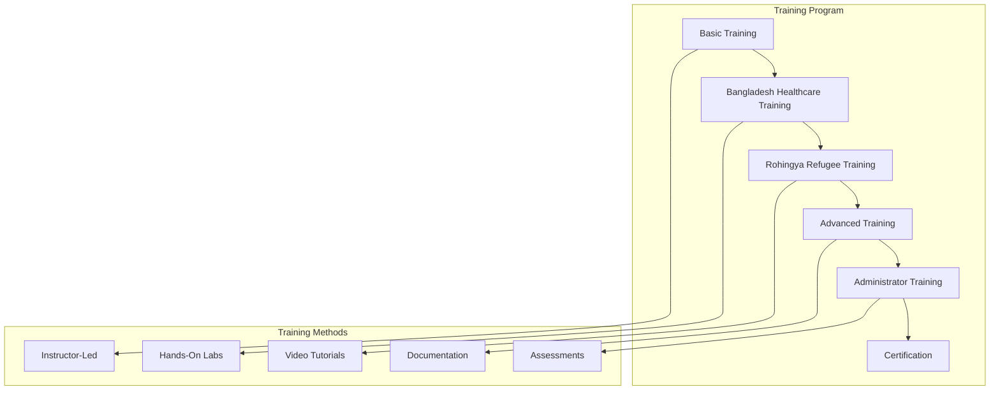

# User Training and Onboarding

## 🎯 Overview

Comprehensive user training and onboarding program for ZARISH HIS documentation system with Bangladesh healthcare context and Rohingya refugee integration.

## 📚 Training Curriculum

### Training Program Structure



### Training Schedule

```yaml
# training-schedule.yml
trainingProgram:
  name: "ZARISH HIS User Training Program"
  duration: "4 weeks"
  participants: "Healthcare workers, administrators, IT staff"
  
  modules:
    - week: 1
      title: "Basic System Navigation"
      duration: "5 days"
      objectives:
        - Understand ZARISH HIS architecture
        - Navigate the documentation system
        - Basic user account management
        - Security and privacy fundamentals
      sessions:
        - day: 1
          title: "Introduction to ZARISH HIS"
          duration: "4 hours"
          topics:
            - System overview
            - Bangladesh healthcare context
            - Rohingya refugee integration
            - Documentation structure
        - day: 2
          title: "User Interface Navigation"
          duration: "4 hours"
          topics:
            - Dashboard overview
            - Menu navigation
            - Search functionality
            - Personalization settings
        - day: 3
          title: "Account Management"
          duration: "4 hours"
          topics:
            - User registration
            - Profile management
            - Password security
            - Two-factor authentication
        - day: 4
          title: "Security and Privacy"
          duration: "4 hours"
          topics:
            - Data protection principles
            - Bangladesh healthcare regulations
            - Refugee data protection
            - Access controls
        - day: 5
          title: "Hands-on Practice"
          duration: "4 hours"
          activities:
            - System navigation exercises
            - Account setup practice
            - Security scenarios
            - Assessment quiz

    - week: 2
      title: "Bangladesh Healthcare Integration"
      duration: "5 days"
      objectives:
        - Understand Bangladesh healthcare system
        - Use DGHS integration features
        - Work with administrative boundaries
        - Handle Bangladeshi patient data
      sessions:
        - day: 1
          title: "Bangladesh Healthcare System"
          duration: "4 hours"
          topics:
            - DGHS overview
            - Healthcare hierarchy
            - Administrative structure
            - Regulatory requirements
        - day: 2
          title: "Patient Registration (Bangladeshi)"
          duration: "4 hours"
          topics:
            - National ID validation
            - Administrative boundaries
            - Phone number formats
            - Emergency contacts
        - day: 3
          title: "DGHS Integration"
          duration: "4 hours"
          topics:
            - NID validation process
            - Health report submission
            - Data synchronization
            - Compliance reporting
        - day: 4
          title: "Administrative Boundaries"
          duration: "4 hours"
          topics:
            - Division/District/Upazila structure
            - Address validation
            - Geographic search
            - Location-based services
        - day: 5
          title: "Bangladesh Use Cases"
          duration: "4 hours"
          activities:
            - Patient registration labs
            - DGHS integration practice
            - Administrative boundary exercises
            - Case study analysis

    - week: 3
      title: "Rohingya Refugee Integration"
      duration: "5 days"
      objectives:
        - Understand Rohingya refugee context
        - Use UNHCR integration features
        - Work with camp management
        - Handle refugee patient data
      sessions:
        - day: 1
          title: "Rohingya Refugee Context"
          duration: "4 hours"
          topics:
            - Refugee background
            - UNHCR standards
            - Camp structure
            - Humanitarian principles
        - day: 2
          title: "Refugee Patient Registration"
          duration: "4 hours"
          topics:
            - ProGress ID validation
            - MRC card verification
            - Family Counting Numbers
            - Camp address system
        - day: 3
          title: "UNHCR Integration"
          duration: "4 hours"
          topics:
            - Refugee registration validation
            - Health data submission
            - Compliance reporting
            - Data protection standards
        - day: 4
          title: "Camp Management"
          duration: "4 hours"
          topics:
            - Camp structure navigation
            - Block/sub-block organization
            - Shelter management
            - Population tracking
        - day: 5
          title: "Refugee Use Cases"
          duration: "4 hours"
          activities:
            - Refugee registration labs
            - UNHCR integration practice
            - Camp management exercises
            - Humanitarian case studies

    - week: 4
      title: "Advanced Features and Certification"
      duration: "5 days"
      objectives:
        - Master advanced system features
        - Understand system administration
        - Complete certification assessment
        - Prepare for go-live support
      sessions:
        - day: 1
          title: "Advanced Search and AI"
          duration: "4 hours"
          topics:
            - Intelligent search
            - AI-powered recommendations
            - Personalization features
            - Analytics and reporting
        - day: 2
          title: "System Administration"
          duration: "4 hours"
          topics:
            - User management
            - Role-based access
            - System configuration
            - Backup and recovery
        - day: 3
          title: "Integration and APIs"
          duration: "4 hours"
          topics:
            - FHIR integration
            - API usage
            - External system connections
            - Data exchange protocols
        - day: 4
          title: "Certification Preparation"
          duration: "4 hours"
          activities:
            - Knowledge assessment
            - Practical exercises
            - Case study analysis
            - Review session
        - day: 5
          title: "Final Assessment"
          duration: "4 hours"
          activities:
            - Written examination
            - Practical assessment
            - Certification ceremony
            - Go-live preparation
```

## 🏥 Bangladesh Healthcare Worker Training

### Training Materials

```markdown
# Bangladesh Healthcare Worker Training Manual

## Module 1: Introduction to ZARISH HIS

### Learning Objectives
- Understand the ZARISH HIS system architecture
- Navigate the Bangladesh healthcare context
- Recognize the importance of digital health records
- Comply with DGHS regulations

### Key Concepts

#### ZARISH HIS Overview
ZARISH HIS is a comprehensive health information system designed specifically for Bangladesh healthcare context with integrated support for Rohingya refugee health services.

#### Bangladesh Healthcare Integration
- **DGHS Integration**: Seamless connectivity with Directorate General of Health Services
- **Administrative Boundaries**: Complete support for BD.X.Y.Z.W administrative structure
- **National ID System**: 13-digit NID validation and integration
- **BMDC Integration**: Bangladesh Medical and Dental Council verification

#### System Architecture
```

┌─────────────────┐    ┌─────────────────┐    ┌─────────────────┐
│   Web Frontend  │    │   API Gateway   │    │   Backend       │
│   (React/TS)    │◄──►│   (Kong/Nginx)  │◄──►│   (Node.js)     │
└─────────────────┘    └─────────────────┘    └─────────────────┘
                                │
                                ▼
                       ┌─────────────────┐
                       │   Database      │
                       │   (PostgreSQL)  │
                       └─────────────────┘

```

## Module 2: Patient Registration

### Bangladeshi Patient Registration

#### Step-by-Step Process

1. **Navigate to Patient Registration**
   - Click on "Patients" menu
   - Select "New Patient"
   - Choose "Bangladeshi Patient"

2. **Enter Basic Information**
   ```

   First Name: Mohammad
   Last Name: Rahman
   Date of Birth: 1990-01-01
   Gender: Male
   Nationality: Bangladeshi

   ```

3. **Enter National ID**
   ```

   National ID: 1234567890123

   ```
   - Must be exactly 13 digits
   - System validates with DGHS database
   - Auto-populates patient information

4. **Select Administrative Address**
   ```

   Division: Dhaka (BD.3)
   District: Dhaka (BD.3.01)
   Upazila: Dhanmondi (BD.3.01.01)
   Union: Dhanmondi (BD.3.01.01.01)

   ```

5. **Enter Contact Information**
   ```

   Phone Number: +8801234567890
   Email: mohammad.rahman@email.com
   Emergency Contact: Fatema Begum (Wife) - +8801234567891

   ```

#### Validation Rules
- **National ID**: Must be 13 digits, validated against DGHS
- **Phone Number**: Must start with +880, 11 digits total
- **Administrative Boundaries**: Must follow BD.X.Y.Z.W format
- **Email**: Valid email format (optional)

#### Common Issues and Solutions

**Issue**: National ID validation failed
**Solution**: 
- Verify 13-digit format
- Check with DGHS for registration status
- Use manual verification if needed

**Issue**: Administrative boundary not found
**Solution**:
- Verify correct division/district/upazila codes
- Check for recent administrative changes
- Contact system administrator

## Module 3: DGHS Integration

### NID Validation Process

#### Automatic Validation
1. Enter 13-digit National ID
2. System automatically validates with DGHS
3. Patient information auto-populates if valid
4. Manual verification required if invalid

#### Manual Verification
1. Click "Manual Verification" button
2. Enter additional patient information
3. Upload supporting documents
4. Submit for DGHS approval

### Health Report Submission

#### Daily Health Reports
1. Navigate to "DGHS Integration"
2. Select "Health Report Submission"
3. Choose report type: Daily/Weekly/Monthly
4. Enter required data:
   ```

   Total Patients: 150
   New Registrations: 12
   OPD Visits: 120
   Emergency Visits: 18
   Immunizations: 25

   ```
5. Submit to DGHS system
6. Receive confirmation with report ID

#### Compliance Requirements
- Submit daily reports by 10:00 PM
- Include all required metrics
- Maintain data accuracy
- Keep backup records

## Module 4: Practical Exercises

### Exercise 1: Patient Registration
**Scenario**: Register a new Bangladeshi patient
**Task**: Complete patient registration with all required fields
**Validation**: System accepts registration and generates patient ID

### Exercise 2: DGHS Integration
**Scenario**: Submit daily health report
**Task**: Complete and submit daily health report
**Validation**: Report accepted by DGHS system

### Exercise 3: Administrative Boundaries
**Scenario**: Update patient address
**Task**: Select correct administrative boundaries
**Validation**: Address format validated and saved

## Assessment Criteria

### Knowledge Assessment (40%)
- Multiple choice questions
- Short answer questions
- Case study analysis

### Practical Assessment (60%)
- Patient registration exercise
- DGHS integration exercise
- Administrative boundary exercise
- Troubleshooting scenarios

### Passing Score: 80%
```

### Training Videos

```typescript
// training/videos/bangladesh-training.ts
export const bangladeshTrainingVideos = [
  {
    title: "ZARISH HIS Introduction",
    duration: "15 minutes",
    url: "/training/videos/introduction.mp4",
    description: "Overview of ZARISH HIS system and Bangladesh healthcare context",
    language: "bn",
    subtitles: ["bn", "en"]
  },
  {
    title: "Patient Registration Tutorial",
    duration: "20 minutes",
    url: "/training/videos/patient-registration.mp4",
    description: "Step-by-step guide to registering Bangladeshi patients",
    language: "bn",
    subtitles: ["bn", "en"]
  },
  {
    title: "DGHS Integration Guide",
    duration: "25 minutes",
    url: "/training/videos/dghs-integration.mp4",
    description: "Complete guide to DGHS integration and NID validation",
    language: "bn",
    subtitles: ["bn", "en"]
  },
  {
    title: "Administrative Boundaries",
    duration: "18 minutes",
    url: "/training/videos/admin-boundaries.mp4",
    description: "Understanding and using Bangladesh administrative boundaries",
    language: "bn",
    subtitles: ["bn", "en"]
  }
];
```

## 🏕️ Rohingya Refugee Worker Training

### Training Materials

```markdown
# Rohingya Refugee Health Worker Training Manual

## Module 1: Refugee Context

### Learning Objectives
- Understand Rohingya refugee situation
- Recognize UNHCR standards and protocols
- Navigate camp structure and organization
- Comply with humanitarian principles

### Key Concepts

#### Refugee Background
The Rohingya refugee crisis began in 2017, with over 1 million refugees now residing in camps in Cox's Bazar, Bangladesh.

#### Camp Structure
- **Kutupalong**: Largest refugee camp
- **Nayapara**: Second largest camp
- **Balukhali**: Expansion camp
- **Organization**: Camp → Block → Sub-Block → Shelter

#### UNHCR Standards
- **SPHERE Standards**: Humanitarian charter and minimum standards
- **Health Cluster Guidelines**: Refugee health service standards
- **Data Protection**: Refugee data privacy and security

## Module 2: Refugee Patient Registration

### Rohingya Refugee Registration

#### Step-by-Step Process

1. **Navigate to Patient Registration**
   - Click on "Patients" menu
   - Select "New Patient"
   - Choose "Rohingya Refugee"

2. **Enter Basic Information**
   ```

   First Name: Ayesha
   Last Name: Begum
   Date of Birth: 1985-05-15
   Gender: Female
   Nationality: Rohingya Refugee

   ```

3. **Enter Refugee IDs**
   ```

   ProGress ID: PROG123456789
   MRC Card: MRC987654321
   Family Counting Number: FCN-KTP-BLOCK-A-001

   ```
   - ProGress ID: UNHCR registration (PROGXXXXXXXXX)
   - MRC Card: Myanmar Registration Council (MRCXXXXXXXXX)
   - FCN: Family Counting Number (FCN-CAMP-BLOCK-XXX)

4. **Select Camp Address**
   ```

   Camp: Kutupalong (KTP)
   Block: Block A
   Sub-Block: Sub-Block 1
   Shelter: Shelter 123

   ```

5. **Enter Contact Information**
   ```

   Phone Number: +8801234567892
   Emergency Contact: Mohammad Hassan (Brother) - +8801234567893

   ```

#### Validation Rules
- **ProGress ID**: Must start with PROG followed by 9 digits
- **MRC Card**: Must start with MRC followed by 9 digits
- **FCN**: Must follow FCN-CAMP-BLOCK-XXX format
- **Phone Number**: Must start with +880, 11 digits total

#### Common Issues and Solutions

**Issue**: ProGress ID validation failed
**Solution**: 
- Verify PROGXXXXXXXXX format
- Check with UNHCR for registration status
- Use manual verification if needed

**Issue**: Camp structure not found
**Solution**:
- Verify correct camp/block codes
- Check for recent camp reorganization
- Contact camp administrator

## Module 3: UNHCR Integration

### Refugee Registration Validation

#### Automatic Validation
1. Enter ProGress ID
2. System automatically validates with UNHCR
3. Refugee information auto-populates if valid
4. Manual verification required if invalid

#### Manual Verification
1. Click "Manual Verification" button
2. Enter additional refugee information
3. Upload supporting documents
4. Submit for UNHCR approval

### Health Data Submission

#### Weekly Health Reports
1. Navigate to "UNHCR Integration"
2. Select "Health Report Submission"
3. Choose report type: Weekly/Monthly
4. Enter required data:
   ```

   Total Refugees: 5000
   New Registrations: 50
   OPD Visits: 200
   Immunizations: 100
   Nutrition Services: 150
   Mental Health Services: 75

   ```
5. Submit to UNHCR system
6. Receive confirmation with report ID

#### Compliance Requirements
- Submit weekly reports by Friday 5:00 PM
- Include all required metrics
- Maintain refugee data privacy
- Follow UNHCR data protection standards

## Module 4: Humanitarian Standards

### SPHERE Standards Compliance
- **Health Services**: Minimum standards for healthcare delivery
- **Nutrition**: Food security and nutrition standards
- **Water, Sanitation, Hygiene**: WASH standards
- **Shelter**: Minimum shelter standards
- **Protection**: Refugee protection standards

### Data Protection
- **Refugee Privacy**: Protect sensitive refugee information
- **Consent**: Obtain informed consent for data collection
- **Access Control**: Limit access to refugee data
- **Audit Trail**: Maintain audit logs for data access

## Module 5: Practical Exercises

### Exercise 1: Refugee Registration
**Scenario**: Register a new Rohingya refugee patient
**Task**: Complete refugee registration with all required fields
**Validation**: System accepts registration and generates refugee ID

### Exercise 2: UNHCR Integration
**Scenario**: Submit weekly health report
**Task**: Complete and submit weekly health report
**Validation**: Report accepted by UNHCR system

### Exercise 3: Camp Navigation
**Scenario**: Update refugee camp address
**Task**: Navigate camp structure and update address
**Validation**: Address format validated and saved

## Assessment Criteria

### Knowledge Assessment (40%)
- Multiple choice questions
- Short answer questions
- Case study analysis

### Practical Assessment (60%)
- Refugee registration exercise
- UNHCR integration exercise
- Camp navigation exercise
- Humanitarian standards exercise

### Passing Score: 80%
```

### Rohingya Training Videos

```typescript
// training/videos/rohingya-training.ts
export const rohingyaTrainingVideos = [
  {
    title: "Rohingya Refugee Context",
    duration: "20 minutes",
    url: "/training/videos/refugee-context.mp4",
    description: "Overview of Rohingya refugee situation and UNHCR standards",
    language: "my",
    subtitles: ["my", "bn", "en"]
  },
  {
    title: "Refugee Patient Registration",
    duration: "25 minutes",
    url: "/training/videos/refugee-registration.mp4",
    description: "Step-by-step guide to registering Rohingya refugee patients",
    language: "my",
    subtitles: ["my", "bn", "en"]
  },
  {
    title: "UNHCR Integration Guide",
    duration: "30 minutes",
    url: "/training/videos/unhcr-integration.mp4",
    description: "Complete guide to UNHCR integration and refugee ID validation",
    language: "my",
    subtitles: ["my", "bn", "en"]
  },
  {
    title: "Camp Management",
    duration: "22 minutes",
    url: "/training/videos/camp-management.mp4",
    description: "Understanding and navigating refugee camp structure",
    language: "my",
    subtitles: ["my", "bn", "en"]
  }
];
```

## 👨‍💻 Administrator Training

### Admin Training Materials

```markdown
# Administrator Training Manual

## Module 1: System Administration

### User Management
- Create user accounts
- Assign roles and permissions
- Manage user access
- Monitor user activity

### System Configuration
- Configure system settings
- Manage integrations
- Set up security policies
- Configure backup schedules

### Monitoring and Maintenance
- Monitor system performance
- Review audit logs
- Manage system updates
- Troubleshoot issues

## Module 2: Security Administration

### Access Control
- Role-based access control (RBAC)
- Multi-factor authentication
- Session management
- Password policies

### Data Protection
- Encryption configuration
- Data masking rules
- Audit trail setup
- Compliance monitoring

### Security Monitoring
- Intrusion detection
- Security event logging
- Vulnerability scanning
- Incident response

## Module 3: Integration Management

### External System Integration
- DGHS API configuration
- UNHCR API setup
- FHIR integration
- Database connections

### Data Synchronization
- Real-time sync setup
- Batch processing
- Error handling
- Monitoring and alerts

### API Management
- API key management
- Rate limiting
- Monitoring
- Documentation
```

## 📋 Assessment and Certification

### Certification Program

```typescript
// training/certification.ts
export interface CertificationProgram {
  name: string;
  duration: string;
  requirements: CertificationRequirement[];
  assessment: AssessmentCriteria;
  certificate: CertificateTemplate;
}

export interface CertificationRequirement {
  type: 'training' | 'experience' | 'assessment';
  description: string;
  mandatory: boolean;
  completionThreshold: number;
}

export const bangladeshHealthcareCertification: CertificationProgram = {
  name: "Bangladesh Healthcare Worker Certification",
  duration: "4 weeks",
  requirements: [
    {
      type: 'training',
      description: "Complete Bangladesh healthcare training modules",
      mandatory: true,
      completionThreshold: 100
    },
    {
      type: 'assessment',
      description: "Pass knowledge assessment with 80% score",
      mandatory: true,
      completionThreshold: 80
    },
    {
      type: 'assessment',
      description: "Pass practical assessment with 80% score",
      mandatory: true,
      completionThreshold: 80
    }
  ],
  assessment: {
    knowledgeWeight: 40,
    practicalWeight: 60,
    passingScore: 80,
    retakeAllowed: true,
    maxRetakes: 3
  },
  certificate: {
    template: "bangladesh-healthcare-cert",
    validity: "2 years",
    renewalRequired: true
  }
};

export const rohingyaRefugeeCertification: CertificationProgram = {
  name: "Rohingya Refugee Health Worker Certification",
  duration: "4 weeks",
  requirements: [
    {
      type: 'training',
      description: "Complete Rohingya refugee training modules",
      mandatory: true,
      completionThreshold: 100
    },
    {
      type: 'assessment',
      description: "Pass knowledge assessment with 80% score",
      mandatory: true,
      completionThreshold: 80
    },
    {
      type: 'assessment',
      description: "Pass practical assessment with 80% score",
      mandatory: true,
      completionThreshold: 80
    },
    {
      type: 'experience',
      description: "Complete 40 hours of supervised practice",
      mandatory: true,
      completionThreshold: 100
    }
  ],
  assessment: {
    knowledgeWeight: 30,
    practicalWeight: 50,
    experienceWeight: 20,
    passingScore: 80,
    retakeAllowed: true,
    maxRetakes: 3
  },
  certificate: {
    template: "rohingya-refugee-cert",
    validity: "1 year",
    renewalRequired: true
  }
};
```

### Assessment Platform

```typescript
// training/assessment-platform.ts
export class AssessmentPlatform {
  private assessments: Map<string, Assessment>;
  private results: Map<string, AssessmentResult>;
  
  constructor() {
    this.assessments = new Map();
    this.results = new Map();
  }
  
  createAssessment(config: AssessmentConfig): Assessment {
    const assessment: Assessment = {
      id: this.generateId(),
      title: config.title,
      type: config.type,
      questions: config.questions,
      timeLimit: config.timeLimit,
      passingScore: config.passingScore,
      maxAttempts: config.maxAttempts,
      randomizeQuestions: config.randomizeQuestions || false,
      showResults: config.showResults || true,
      certificateEligible: config.certificateEligible || false
    };
    
    this.assessments.set(assessment.id, assessment);
    return assessment;
  }
  
  async takeAssessment(
    assessmentId: string, 
    userId: string, 
    answers: AssessmentAnswer[]
  ): Promise<AssessmentResult> {
    const assessment = this.assessments.get(assessmentId);
    if (!assessment) {
      throw new Error('Assessment not found');
    }
    
    const result = await this.gradeAssessment(assessment, answers);
    result.userId = userId;
    result.assessmentId = assessmentId;
    result.completedAt = new Date();
    
    this.results.set(`${userId}-${assessmentId}`, result);
    
    return result;
  }
  
  private async gradeAssessment(
    assessment: Assessment, 
    answers: AssessmentAnswer[]
  ): Promise<AssessmentResult> {
    let correctAnswers = 0;
    let totalPoints = 0;
    let earnedPoints = 0;
    
    for (const question of assessment.questions) {
      const userAnswer = answers.find(a => a.questionId === question.id);
      if (!userAnswer) continue;
      
      totalPoints += question.points;
      
      if (this.isAnswerCorrect(question, userAnswer)) {
        correctAnswers++;
        earnedPoints += question.points;
      }
    }
    
    const score = (earnedPoints / totalPoints) * 100;
    const passed = score >= assessment.passingScore;
    
    return {
      score,
      correctAnswers,
      totalQuestions: assessment.questions.length,
      passed,
      certificateEligible: passed && assessment.certificateEligible
    };
  }
  
  private isAnswerCorrect(question: Question, answer: AssessmentAnswer): boolean {
    switch (question.type) {
      case 'multiple-choice':
        return question.correctAnswer === answer.selectedOption;
      case 'true-false':
        return question.correctAnswer === answer.value;
      case 'short-answer':
        return this.checkShortAnswer(question.correctAnswer as string, answer.value as string);
      case 'practical':
        return this.checkPracticalAnswer(question, answer);
      default:
        return false;
    }
  }
  
  private checkShortAnswer(correct: string, provided: string): boolean {
    // Case-insensitive comparison with some tolerance
    return correct.toLowerCase().trim() === provided.toLowerCase().trim();
  }
  
  private checkPracticalAnswer(question: Question, answer: AssessmentAnswer): boolean {
    // Practical assessment grading logic
    // This would involve checking steps, procedures, and outcomes
    return true; // Simplified for example
  }
  
  private generateId(): string {
    return Math.random().toString(36).substr(2, 9);
  }
}
```

---

**Training Version**: 1.0  
**Last Updated**: January 2026  
**Compliance**: ZARISH HIS Training Standards
