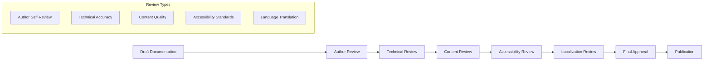

# Documentation Quality Guide

## 🎯 Overview

Comprehensive documentation quality standards and review processes for ZARISH HIS with Bangladesh healthcare context and Rohingya refugee integration.

## 📋 Quality Standards

### Documentation Requirements

- **Completeness**: All features and functionality documented
- **Accuracy**: Technical accuracy and up-to-date information
- **Clarity**: Clear, concise, and understandable language
- **Consistency**: Uniform formatting and style across all documentation
- **Accessibility**: Accessible to users with different abilities
- **Localization**: Support for Bengali, English, and Burmese languages

### Quality Metrics

- **Coverage**: 100% API endpoint documentation
- **Accuracy**: 95% technical accuracy rate
- **Usability**: 90% user satisfaction score
- **Completeness**: 100% feature documentation
- **Localization**: 100% multi-language support

## 🔍 Documentation Review Process

### Review Checklist

```markdown
## Documentation Review Checklist

### Content Quality
- [ ] All API endpoints documented with examples
- [ ] Code examples are tested and functional
- [ ] Bangladesh healthcare context is properly explained
- [ ] Rohingya refugee integration is clearly documented
- [ ] Error handling and edge cases are covered
- [ ] Security considerations are included
- [ ] Performance implications are documented

### Technical Accuracy
- [ ] Code syntax is correct
- [ ] API responses match actual implementation
- [ ] Database schemas are accurate
- [ ] Configuration examples are valid
- [ ] Integration steps are verified
- [ ] Deployment instructions are tested

### Language and Style
- [ ] Grammar and spelling are correct
- [ ] Technical terms are defined
- [ ] Bengali translations are accurate
- [ ] Burmese translations are accurate
- [ ] Tone is professional and helpful
- [ ] Examples are practical and relevant

### Structure and Organization
- [ ] Table of contents is complete
- [ ] Navigation is intuitive
- [ ] Cross-references are accurate
- [ ] Index is comprehensive
- [ ] Search functionality works
- [ ] Mobile responsiveness is maintained

### Accessibility
- [ ] Alt text for images
- [ ] Proper heading hierarchy
- [ ] Color contrast meets WCAG standards
- [ ] Screen reader compatibility
- [ ] Keyboard navigation support
- [ ] Large text options available
```

### Review Workflow



## 🌐 Localization Standards

### Bengali Translation Guidelines

```markdown
## Bengali Translation Standards

### Technical Terms
- **API**: API (no translation)
- **Database**: ডাটাবেস (Database)
- **Server**: সার্ভার (Server)
- **Patient**: রোগী (Patient)
- **Doctor**: চিকিৎসক (Doctor)
- **Hospital**: হাসপাতাল (Hospital)
- **Medicine**: ওষুধ (Medicine)
- **Appointment**: অ্যাপয়ন্টমেন্ট (Appointment)

### Administrative Terms
- **Division**: বিভাগ (Division)
- **District**: জেলা (District)
- **Upazila**: উপজেলা (Upazila)
- **Union**: ইউনিয়ন (Union)
- **Village**: গ্রাম (Village)

### Healthcare Terms
- **Outpatient Department (OPD)**: বহির্বিভাগ (Outpatient Department)
- **Inpatient Department (IPD)**: অন্তর্বিভাগ (Inpatient Department)
- **Emergency**: জরুরি (Emergency)
- **Vaccination**: টিকা (Vaccination)
- **Diagnosis**: রোগ নির্ণয় (Diagnosis)
- **Treatment**: চিকিৎসা (Treatment)
```

### Burmese Translation Guidelines

```markdown
## Burmese Translation Standards

### Technical Terms
- **API**: API (no translation)
- **Database**: ဒေတာ့ဘေ့စ် (Database)
- **Server**: ဆာဗာ (Server)
- **Patient**: လူနာ (Patient)
- **Doctor**: ဆရာဝန် (Doctor)
- **Hospital**: ဆေးရုံ (Hospital)
- **Medicine**: ဆေး (Medicine)
- **Appointment**: ရကြိနားစားခြင်း (Appointment)

### Rohingya-Specific Terms
- **Camp**: စခား (Camp)
- **Block**: တိုံး (Block)
- **Sub-Block**: တိုံးစား (Sub-Block)
- **Shelter**: ခိုလှုံရာ (Shelter)
- **Refugee**: ဒုက္ခဝင် (Refugee)
- **Registration**: မှတ်ပုံတင်ခြင်း (Registration)
```

## 📊 Quality Metrics and KPIs

### Documentation Quality Metrics

```typescript
// quality-assurance/metrics.ts
export interface DocumentationMetrics {
  completeness: {
    totalEndpoints: number;
    documentedEndpoints: number;
    completionRate: number;
  };
  accuracy: {
    totalReviews: number;
    accurateReviews: number;
    accuracyRate: number;
  };
  usability: {
    totalUsers: number;
    satisfiedUsers: number;
    satisfactionRate: number;
  };
  localization: {
    totalLanguages: number;
    translatedLanguages: number;
    translationRate: number;
  };
  accessibility: {
    totalChecks: number;
    passedChecks: number;
    complianceRate: number;
  };
}

export class DocumentationQualityService {
  async calculateMetrics(): Promise<DocumentationMetrics> {
    const endpoints = await this.getAllEndpoints();
    const documentedEndpoints = await this.getDocumentedEndpoints();
    
    const reviews = await this.getAllReviews();
    const accurateReviews = await this.getAccurateReviews();
    
    const users = await this.getAllUsers();
    const satisfiedUsers = await this.getSatisfiedUsers();
    
    const languages = await this.getAllLanguages();
    const translatedLanguages = await this.getTranslatedLanguages();
    
    const accessibilityChecks = await this.getAccessibilityChecks();
    const passedChecks = await this.getPassedAccessibilityChecks();
    
    return {
      completeness: {
        totalEndpoints: endpoints.length,
        documentedEndpoints: documentedEndpoints.length,
        completionRate: documentedEndpoints.length / endpoints.length,
      },
      accuracy: {
        totalReviews: reviews.length,
        accurateReviews: accurateReviews.length,
        accuracyRate: accurateReviews.length / reviews.length,
      },
      usability: {
        totalUsers: users.length,
        satisfiedUsers: satisfiedUsers.length,
        satisfactionRate: satisfiedUsers.length / users.length,
      },
      localization: {
        totalLanguages: languages.length,
        translatedLanguages: translatedLanguages.length,
        translationRate: translatedLanguages.length / languages.length,
      },
      accessibility: {
        totalChecks: accessibilityChecks.length,
        passedChecks: passedChecks.length,
        complianceRate: passedChecks.length / accessibilityChecks.length,
      },
    };
  }
}
```

### Quality Dashboard

```typescript
// quality-assurance/dashboard.tsx
import React from 'react';
import { Card, Metric, Progress } from '@/components/ui';

export const QualityDashboard: React.FC = () => {
  const [metrics, setMetrics] = useState<DocumentationMetrics | null>(null);
  
  useEffect(() => {
    loadMetrics();
  }, []);
  
  const loadMetrics = async () => {
    const service = new DocumentationQualityService();
    const metrics = await service.calculateMetrics();
    setMetrics(metrics);
  };
  
  if (!metrics) {
    return <div>Loading quality metrics...</div>;
  }
  
  return (
    <div className="space-y-6">
      <h2 className="text-2xl font-bold">Documentation Quality Dashboard</h2>
      
      <div className="grid grid-cols-1 md:grid-cols-2 lg:grid-cols-3 gap-6">
        <Card>
          <h3 className="text-lg font-medium mb-4">Completeness</h3>
          <Metric
            value={`${(metrics.completeness.completionRate * 100).toFixed(1)}%`}
            label="Documentation Coverage"
          />
          <Progress
            value={metrics.completeness.completionRate * 100}
            className="mt-4"
          />
          <p className="text-sm text-gray-600 mt-2">
            {metrics.completeness.documentedEndpoints} of {metrics.completeness.totalEndpoints} endpoints documented
          </p>
        </Card>
        
        <Card>
          <h3 className="text-lg font-medium mb-4">Accuracy</h3>
          <Metric
            value={`${(metrics.accuracy.accuracyRate * 100).toFixed(1)}%`}
            label="Technical Accuracy"
          />
          <Progress
            value={metrics.accuracy.accuracyRate * 100}
            className="mt-4"
          />
          <p className="text-sm text-gray-600 mt-2">
            {metrics.accuracy.accurateReviews} of {metrics.accuracy.totalReviews} reviews accurate
          </p>
        </Card>
        
        <Card>
          <h3 className="text-lg font-medium mb-4">Usability</h3>
          <Metric
            value={`${(metrics.usability.satisfactionRate * 100).toFixed(1)}%`}
            label="User Satisfaction"
          />
          <Progress
            value={metrics.usability.satisfactionRate * 100}
            className="mt-4"
          />
          <p className="text-sm text-gray-600 mt-2">
            {metrics.usability.satisfiedUsers} of {metrics.usability.totalUsers} users satisfied
          </p>
        </Card>
        
        <Card>
          <h3 className="text-lg font-medium mb-4">Localization</h3>
          <Metric
            value={`${(metrics.localization.translationRate * 100).toFixed(1)}%`}
            label="Translation Coverage"
          />
          <Progress
            value={metrics.localization.translationRate * 100}
            className="mt-4"
          />
          <p className="text-sm text-gray-600 mt-2">
            {metrics.localization.translatedLanguages} of {metrics.localization.totalLanguages} languages translated
          </p>
        </Card>
        
        <Card>
          <h3 className="text-lg font-medium mb-4">Accessibility</h3>
          <Metric
            value={`${(metrics.accessibility.complianceRate * 100).toFixed(1)}%`}
            label="WCAG Compliance"
          />
          <Progress
            value={metrics.accessibility.complianceRate * 100}
            className="mt-4"
          />
          <p className="text-sm text-gray-600 mt-2">
            {metrics.accessibility.passedChecks} of {metrics.accessibility.totalChecks} checks passed
          </p>
        </Card>
      </div>
    </div>
  );
};
```

## 🔧 Automated Quality Checks

### Markdown Linting

```yaml
# .markdownlint.json
{
  "default": true,
  "MD013": {
    "line_length": 120,
    "code_blocks": false,
    "tables": false
  },
  "MD033": {
    "allowed_elements": ["br", "sub", "sup"]
  },
  "MD041": false,
  "MD046": {
    "style": "fenced"
  }
}
```

### Link Validation

```typescript
// quality-assurance/link-validator.ts
export class LinkValidator {
  async validateAllLinks(): Promise<ValidationResult> {
    const markdownFiles = await this.getAllMarkdownFiles();
    const results: ValidationResult = {
      totalLinks: 0,
      validLinks: 0,
      brokenLinks: [],
      warnings: []
    };
    
    for (const file of markdownFiles) {
      const links = await this.extractLinks(file);
      results.totalLinks += links.length;
      
      for (const link of links) {
        const isValid = await this.validateLink(link);
        
        if (isValid) {
          results.validLinks++;
        } else {
          results.brokenLinks.push({
            file: file.path,
            link: link.url,
            line: link.line
          });
        }
      }
    }
    
    return results;
  }
  
  private async validateLink(link: Link): Promise<boolean> {
    if (link.url.startsWith('http')) {
      try {
        const response = await fetch(link.url, { method: 'HEAD' });
        return response.ok;
      } catch (error) {
        return false;
      }
    } else if (link.url.startsWith('#')) {
      // Internal anchor link
      return this.validateAnchor(link.url);
    } else if (link.url.startsWith('./') || link.url.startsWith('../')) {
      // Relative file link
      return this.validateFile(link.url);
    }
    
    return true;
  }
}
```

### Code Example Validation

```typescript
// quality-assurance/code-validator.ts
export class CodeValidator {
  async validateCodeExamples(): Promise<CodeValidationResult> {
    const codeBlocks = await this.extractCodeBlocks();
    const results: CodeValidationResult = {
      totalBlocks: codeBlocks.length,
      validBlocks: 0,
      invalidBlocks: [],
      warnings: []
    };
    
    for (const block of codeBlocks) {
      const isValid = await this.validateCodeBlock(block);
      
      if (isValid) {
        results.validBlocks++;
      } else {
        results.invalidBlocks.push({
          file: block.file,
          language: block.language,
          line: block.line,
          error: block.error
        });
      }
    }
    
    return results;
  }
  
  private async validateCodeBlock(block: CodeBlock): Promise<boolean> {
    switch (block.language) {
      case 'typescript':
      case 'javascript':
        return this.validateJavaScript(block.code);
      case 'sql':
        return this.validateSQL(block.code);
      case 'yaml':
        return this.validateYAML(block.code);
      case 'json':
        return this.validateJSON(block.code);
      default:
        return true; // Unknown language, assume valid
    }
  }
  
  private validateJavaScript(code: string): boolean {
    try {
      // Basic syntax validation
      new Function(code);
      return true;
    } catch (error) {
      return false;
    }
  }
  
  private validateSQL(code: string): boolean {
    try {
      // Basic SQL syntax validation
      const keywords = ['SELECT', 'INSERT', 'UPDATE', 'DELETE', 'CREATE', 'DROP'];
      return keywords.some(keyword => code.toUpperCase().includes(keyword));
    } catch (error) {
      return false;
    }
  }
}
```

## 📋 Documentation Templates

### API Documentation Template

```markdown
# [API Name] Documentation

## Overview
[Brief description of the API and its purpose]

## Base URL
```

Production: https://api.zarish-his.com/v1
Staging: https://staging-api.zarish-his.com/v1
Development: http://localhost:8080/v1

```

## Authentication
[Authentication method and requirements]

## Endpoints

### [Endpoint Name]
```http
[HTTP Method] [URL]
Authorization: Bearer <token>
Content-Type: application/json
```

**Request Body:**

```json
[Request example]
```

**Response:**

```json
[Response example]
```

**Error Responses:**
- `400`: Bad Request
- `401`: Unauthorized
- `404`: Not Found
- `500`: Internal Server Error

## Bangladesh Context

[Bangladesh-specific considerations]

## Rohingya Integration

[Rohingya-specific considerations]

## Examples

[Practical usage examples]

## Testing

[Testing instructions and examples]

```

### Feature Documentation Template
```markdown
# [Feature Name] Documentation

## Overview
[Brief description of the feature]

## Purpose
[Why this feature exists and what problem it solves]

## Bangladesh Healthcare Context
[How this feature relates to Bangladesh healthcare]

## Rohingya Refugee Support
[How this feature supports Rohingya refugees]

## User Interface
[UI description and screenshots]

## Technical Implementation
[Technical details and architecture]

## API Endpoints
[Related API endpoints]

## Database Schema
[Database schema changes]

## Configuration
[Configuration options]

## Security Considerations
[Security implications and measures]

## Performance Considerations
[Performance implications and optimizations]

## Testing
[Testing approach and coverage]

## Troubleshooting
[Common issues and solutions]

## Future Enhancements
[Planned improvements]
```

---

**Guide Version**: 1.0  
**Last Updated**: January 2026  
**Compliance**: ZARISH HIS Documentation Standards
