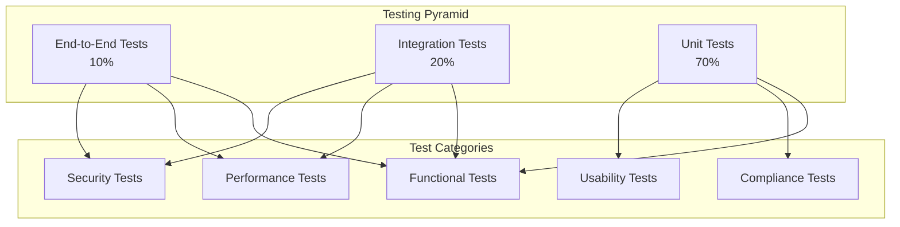

# Testing Guide

## 🎯 Overview

Comprehensive testing guide for ZARISH HIS with Bangladesh healthcare context and Rohingya refugee integration testing.

## 🧪 Testing Strategy

### Testing Pyramid



### Test Coverage Requirements

- **Unit Tests**: Minimum 80% code coverage
- **Integration Tests**: All API endpoints covered
- **E2E Tests**: Critical user journeys covered
- **Performance Tests**: Load testing for 1000 concurrent users
- **Security Tests**: OWASP Top 10 vulnerabilities covered
- **Compliance Tests**: Bangladesh healthcare regulations covered

## 🔬 Unit Testing

### Backend Unit Tests

```typescript
// backend/patient-registry/src/tests/patient.service.test.ts
import { PatientService } from '../services/patient.service';
import { PatientRepository } from '../repositories/patient.repository';
import { CacheService } from '../services/cache.service';

describe('PatientService', () => {
  let patientService: PatientService;
  let mockPatientRepository: jest.Mocked<PatientRepository>;
  let mockCacheService: jest.Mocked<CacheService>;

  beforeEach(() => {
    mockPatientRepository = {
      create: jest.fn(),
      findById: jest.fn(),
      findByNationalId: jest.fn(),
      search: jest.fn(),
      update: jest.fn(),
      delete: jest.fn(),
    } as any;

    mockCacheService = {
      get: jest.fn(),
      set: jest.fn(),
      delete: jest.fn(),
    } as any;

    patientService = new PatientService(
      mockPatientRepository,
      mockCacheService
    );
  });

  describe('createPatient', () => {
    it('should create a Bangladeshi patient successfully', async () => {
      // Arrange
      const patientData = {
        firstName: 'Mohammad',
        lastName: 'Rahman',
        dateOfBirth: '1990-01-01',
        gender: 'M',
        nationality: 'BD',
        nationalId: '1234567890123',
        phoneNumber: '+8801234567890',
        address: {
          type: 'bangladesh',
          divisionCode: 'BD.3',
          districtCode: 'BD.3.01',
          upazilaCode: 'BD.3.01.01',
          unionCode: 'BD.3.01.01.01',
        }
      };

      const expectedPatient = {
        id: '550e8400-e29b-41d4-a716-446655440000',
        ...patientData,
        createdAt: new Date(),
        updatedAt: new Date(),
      };

      mockPatientRepository.create.mockResolvedValue(expectedPatient);
      mockCacheService.get.mockResolvedValue(null);

      // Act
      const result = await patientService.createPatient(patientData);

      // Assert
      expect(result).toEqual(expectedPatient);
      expect(mockPatientRepository.create).toHaveBeenCalledWith(patientData);
      expect(mockCacheService.set).toHaveBeenCalledWith(
        `patient:${expectedPatient.id}`,
        expectedPatient,
        'L1'
      );
    });

    it('should create a Rohingya refugee patient successfully', async () => {
      // Arrange
      const patientData = {
        firstName: 'Ayesha',
        lastName: 'Begum',
        dateOfBirth: '1985-05-15',
        gender: 'F',
        nationality: 'ROH',
        progressId: 'PROG123456789',
        mrcCard: 'MRC987654321',
        familyCountingNumber: 'FCN-KTP-BLOCK-A-001',
        phoneNumber: '+8801234567892',
        address: {
          type: 'refugee_camp',
          campName: 'Kutupalong',
          block: 'Block A',
          subBlock: 'Sub-Block 1',
          shelter: 'Shelter 123',
        }
      };

      const expectedPatient = {
        id: '550e8400-e29b-41d4-a716-446655440001',
        ...patientData,
        createdAt: new Date(),
        updatedAt: new Date(),
      };

      mockPatientRepository.create.mockResolvedValue(expectedPatient);
      mockCacheService.get.mockResolvedValue(null);

      // Act
      const result = await patientService.createPatient(patientData);

      // Assert
      expect(result).toEqual(expectedPatient);
      expect(mockPatientRepository.create).toHaveBeenCalledWith(patientData);
      expect(mockCacheService.set).toHaveBeenCalledWith(
        `patient:${expectedPatient.id}`,
        expectedPatient,
        'L1'
      );
    });

    it('should throw validation error for invalid NID format', async () => {
      // Arrange
      const patientData = {
        firstName: 'Mohammad',
        lastName: 'Rahman',
        dateOfBirth: '1990-01-01',
        gender: 'M',
        nationality: 'BD',
        nationalId: '123456789012', // Invalid 12-digit NID
        phoneNumber: '+8801234567890',
      };

      // Act & Assert
      await expect(patientService.createPatient(patientData))
        .rejects
        .toThrow('Invalid NID format');
    });
  });

  describe('searchPatients', () => {
    it('should search patients with Bangladesh filters', async () => {
      // Arrange
      const searchFilters = {
        query: 'rahman',
        nationality: 'BD',
        division: 'BD.3',
        district: 'BD.3.01',
        ageMin: 18,
        ageMax: 65,
        gender: 'M',
      };

      const expectedResults = [
        {
          id: '550e8400-e29b-41d4-a716-446655440000',
          firstName: 'Mohammad',
          lastName: 'Rahman',
          nationality: 'BD',
          matchScore: 0.95,
        }
      ];

      mockCacheService.get.mockResolvedValue(null);
      mockPatientRepository.search.mockResolvedValue(expectedResults);

      // Act
      const result = await patientService.searchPatients(searchFilters);

      // Assert
      expect(result).toEqual(expectedResults);
      expect(mockPatientRepository.search).toHaveBeenCalledWith(searchFilters);
      expect(mockCacheService.set).toHaveBeenCalledWith(
        `search:${JSON.stringify(searchFilters)}`,
        expectedResults,
        'L2'
      );
    });
  });
});
```

### Frontend Unit Tests

```typescript
// frontend/esm-admin/src/tests/components/PatientCard.test.tsx
import React from 'react';
import { render, screen, fireEvent } from '@testing-library/react';
import { PatientCard } from '../PatientCard';
import { Patient } from '@/types/patient';

describe('PatientCard', () => {
  const mockBangladeshiPatient: Patient = {
    id: '550e8400-e29b-41d4-a716-446655440000',
    firstName: 'Mohammad',
    lastName: 'Rahman',
    dateOfBirth: '1990-01-01',
    gender: 'M',
    nationality: 'BD',
    nationalId: '1234567890123',
    phoneNumber: '+8801234567890',
    address: {
      type: 'bangladesh',
      divisionCode: 'BD.3',
      districtCode: 'BD.3.01',
      upazilaCode: 'BD.3.01.01',
      unionCode: 'BD.3.01.01.01',
      village: 'Dhaka',
    },
  };

  const mockRohingyaPatient: Patient = {
    id: '550e8400-e29b-41d4-a716-446655440001',
    firstName: 'Ayesha',
    lastName: 'Begum',
    dateOfBirth: '1985-05-15',
    gender: 'F',
    nationality: 'ROH',
    progressId: 'PROG123456789',
    mrcCard: 'MRC987654321',
    familyCountingNumber: 'FCN-KTP-BLOCK-A-001',
    phoneNumber: '+8801234567892',
    address: {
      type: 'refugee_camp',
      campName: 'Kutupalong',
      block: 'Block A',
      subBlock: 'Sub-Block 1',
      shelter: 'Shelter 123',
    },
  };

  it('should render Bangladeshi patient card correctly', () => {
    // Arrange
    const onView = jest.fn();
    const onEdit = jest.fn();

    // Act
    render(
      <PatientCard
        patient={mockBangladeshiPatient}
        onView={onView}
        onEdit={onEdit}
      />
    );

    // Assert
    expect(screen.getByText('Mohammad Rahman')).toBeInTheDocument();
    expect(screen.getByText('1234567890123')).toBeInTheDocument();
    expect(screen.getByText('+8801234567890')).toBeInTheDocument();
    expect(screen.getByText('Bangladeshi')).toBeInTheDocument();
    expect(screen.getByText('View Details')).toBeInTheDocument();
    expect(screen.getByText('Edit Patient')).toBeInTheDocument();
  });

  it('should render Rohingya patient card correctly', () => {
    // Arrange
    const onView = jest.fn();
    const onEdit = jest.fn();

    // Act
    render(
      <PatientCard
        patient={mockRohingyaPatient}
        onView={onView}
        onEdit={onEdit}
      />
    );

    // Assert
    expect(screen.getByText('Ayesha Begum')).toBeInTheDocument();
    expect(screen.getByText('PROG123456789')).toBeInTheDocument();
    expect(screen.getByText('MRC987654321')).toBeInTheDocument();
    expect(screen.getByText('FCN-KTP-BLOCK-A-001')).toBeInTheDocument();
    expect(screen.getByText('Rohingya Refugee')).toBeInTheDocument();
    expect(screen.getByText('Kutupalong')).toBeInTheDocument();
    expect(screen.getByText('Block A')).toBeInTheDocument();
  });

  it('should call onView when View Details button is clicked', () => {
    // Arrange
    const onView = jest.fn();
    const onEdit = jest.fn();

    // Act
    render(
      <PatientCard
        patient={mockBangladeshiPatient}
        onView={onView}
        onEdit={onEdit}
      />
    );

    fireEvent.click(screen.getByText('View Details'));

    // Assert
    expect(onView).toHaveBeenCalledWith('550e8400-e29b-41d4-a716-446655440000');
  });

  it('should call onEdit when Edit Patient button is clicked', () => {
    // Arrange
    const onView = jest.fn();
    const onEdit = jest.fn();

    // Act
    render(
      <PatientCard
        patient={mockBangladeshiPatient}
        onView={onView}
        onEdit={onEdit}
      />
    );

    fireEvent.click(screen.getByText('Edit Patient'));

    // Assert
    expect(onEdit).toHaveBeenCalledWith('550e8400-e29b-41d4-a716-446655440000');
  });
});
```

## 🔗 Integration Testing

### API Integration Tests

```typescript
// tests/integration/patient-api.test.ts
import request from 'supertest';
import { app } from '../src/app';
import { setupTestDatabase, cleanupTestDatabase } from './helpers/database';

describe('Patient API Integration Tests', () => {
  beforeAll(async () => {
    await setupTestDatabase();
  });

  afterAll(async () => {
    await cleanupTestDatabase();
  });

  describe('POST /api/v1/patients', () => {
    it('should create a Bangladeshi patient', async () => {
      // Arrange
      const patientData = {
        firstName: 'Mohammad',
        lastName: 'Rahman',
        dateOfBirth: '1990-01-01',
        gender: 'M',
        nationality: 'BD',
        nationalId: '1234567890123',
        phoneNumber: '+8801234567890',
        address: {
          type: 'bangladesh',
          divisionCode: 'BD.3',
          districtCode: 'BD.3.01',
          upazilaCode: 'BD.3.01.01',
          unionCode: 'BD.3.01.01.01',
        }
      };

      // Act
      const response = await request(app)
        .post('/api/v1/patients')
        .set('Authorization', 'Bearer valid-token')
        .send(patientData)
        .expect(201);

      // Assert
      expect(response.body.data).toMatchObject({
        firstName: 'Mohammad',
        lastName: 'Rahman',
        nationality: 'BD',
        nationalId: '1234567890123',
      });
      expect(response.body.data.id).toBeDefined();
      expect(response.body.data.createdAt).toBeDefined();
    });

    it('should create a Rohingya refugee patient', async () => {
      // Arrange
      const patientData = {
        firstName: 'Ayesha',
        lastName: 'Begum',
        dateOfBirth: '1985-05-15',
        gender: 'F',
        nationality: 'ROH',
        progressId: 'PROG123456789',
        mrcCard: 'MRC987654321',
        familyCountingNumber: 'FCN-KTP-BLOCK-A-001',
        phoneNumber: '+8801234567892',
        address: {
          type: 'refugee_camp',
          campName: 'Kutupalong',
          block: 'Block A',
          subBlock: 'Sub-Block 1',
          shelter: 'Shelter 123',
        }
      };

      // Act
      const response = await request(app)
        .post('/api/v1/patients')
        .set('Authorization', 'Bearer valid-token')
        .send(patientData)
        .expect(201);

      // Assert
      expect(response.body.data).toMatchObject({
        firstName: 'Ayesha',
        lastName: 'Begum',
        nationality: 'ROH',
        progressId: 'PROG123456789',
        mrcCard: 'MRC987654321',
        familyCountingNumber: 'FCN-KTP-BLOCK-A-001',
      });
      expect(response.body.data.id).toBeDefined();
    });

    it('should return 400 for invalid NID format', async () => {
      // Arrange
      const patientData = {
        firstName: 'Mohammad',
        lastName: 'Rahman',
        dateOfBirth: '1990-01-01',
        gender: 'M',
        nationality: 'BD',
        nationalId: '123456789012', // Invalid 12-digit NID
        phoneNumber: '+8801234567890',
      };

      // Act & Assert
      const response = await request(app)
        .post('/api/v1/patients')
        .set('Authorization', 'Bearer valid-token')
        .send(patientData)
        .expect(400);

      expect(response.body.error.code).toBe('PATIENT_VALIDATION_ERROR');
      expect(response.body.error.message).toContain('Invalid NID format');
    });
  });

  describe('GET /api/v1/patients/search', () => {
    it('should search patients with Bangladesh filters', async () => {
      // Act
      const response = await request(app)
        .get('/api/v1/patients/search')
        .query({
          search: 'rahman',
          nationality: 'BD',
          division: 'BD.3',
          district: 'BD.3.01',
          ageMin: 18,
          ageMax: 65,
          gender: 'M',
        })
        .set('Authorization', 'Bearer valid-token')
        .expect(200);

      // Assert
      expect(response.body.data).toBeInstanceOf(Array);
      expect(response.body.meta.pagination).toBeDefined();
      expect(response.body.meta.search).toBeDefined();
    });

    it('should search Rohingya patients', async () => {
      // Act
      const response = await request(app)
        .get('/api/v1/patients/search')
        .query({
          nationality: 'ROH',
          camp: 'Kutupalong',
          block: 'Block A',
        })
        .set('Authorization', 'Bearer valid-token')
        .expect(200);

      // Assert
      expect(response.body.data).toBeInstanceOf(Array);
      expect(response.body.data.every((patient: any) => 
        patient.nationality === 'ROH'
      )).toBe(true);
    });
  });
});
```

### Database Integration Tests

```typescript
// tests/integration/database.test.ts
import { DatabaseService } from '../src/services/database.service';
import { setupTestDatabase, cleanupTestDatabase } from './helpers/database';

describe('Database Integration Tests', () => {
  let dbService: DatabaseService;

  beforeAll(async () => {
    dbService = new DatabaseService();
    await setupTestDatabase();
  });

  afterAll(async () => {
    await cleanupTestDatabase();
  });

  describe('Patient Repository', () => {
    it('should create and retrieve a patient', async () => {
      // Arrange
      const patientData = {
        firstName: 'Test',
        lastName: 'Patient',
        dateOfBirth: '1990-01-01',
        gender: 'M',
        nationality: 'BD',
        nationalId: '1234567890123',
        phoneNumber: '+8801234567890',
      };

      // Act
      const createdPatient = await dbService.query(
        'INSERT INTO patients (first_name, last_name, date_of_birth, gender, nationality, national_id, phone_number) VALUES ($1, $2, $3, $4, $5, $6, $7) RETURNING *',
        [patientData.firstName, patientData.lastName, patientData.dateOfBirth, patientData.gender, patientData.nationality, patientData.nationalId, patientData.phoneNumber]
      );

      const retrievedPatient = await dbService.query(
        'SELECT * FROM patients WHERE id = $1',
        [createdPatient[0].id]
      );

      // Assert
      expect(retrievedPatient[0]).toMatchObject(patientData);
    });

    it('should handle Bangladesh administrative boundaries', async () => {
      // Arrange
      const patientData = {
        firstName: 'Test',
        lastName: 'Patient',
        dateOfBirth: '1990-01-01',
        gender: 'M',
        nationality: 'BD',
        nationalId: '1234567890124',
        phoneNumber: '+8801234567891',
        address: {
          type: 'bangladesh',
          divisionCode: 'BD.3',
          districtCode: 'BD.3.01',
          upazilaCode: 'BD.3.01.01',
          unionCode: 'BD.3.01.01.01',
        }
      };

      // Act
      const createdPatient = await dbService.query(
        'INSERT INTO patients (first_name, last_name, date_of_birth, gender, nationality, national_id, phone_number, address) VALUES ($1, $2, $3, $4, $5, $6, $7, $8) RETURNING *',
        [patientData.firstName, patientData.lastName, patientData.dateOfBirth, patientData.gender, patientData.nationality, patientData.nationalId, patientData.phoneNumber, JSON.stringify(patientData.address)]
      );

      // Assert
      expect(createdPatient[0].address).toEqual(JSON.stringify(patientData.address));
    });
  });
});
```

## 🎭 End-to-End Testing

### E2E Test Scenarios

```typescript
// tests/e2e/patient-registration.test.ts
import { test, expect } from '@playwright/test';

test.describe('Patient Registration E2E Tests', () => {
  test.beforeEach(async ({ page }) => {
    await page.goto('/login');
    await page.fill('[data-testid=email]', 'admin@zarish-his.com');
    await page.fill('[data-testid=password]', 'password');
    await page.click('[data-testid=login-button]');
    await page.waitForURL('/dashboard');
  });

  test('should register a Bangladeshi patient successfully', async ({ page }) => {
    // Navigate to patient registration
    await page.click('[data-testid=patient-menu]');
    await page.click('[data-testid=new-patient-button]');

    // Fill patient information
    await page.fill('[data-testid=first-name]', 'Mohammad');
    await page.fill('[data-testid=last-name]', 'Rahman');
    await page.fill('[data-testid=date-of-birth]', '1990-01-01');
    await page.selectOption('[data-testid=gender]', 'M');
    await page.selectOption('[data-testid=nationality]', 'BD');

    // Fill NID
    await page.fill('[data-testid=national-id]', '1234567890123');
    await page.waitForSelector('[data-testid=nid-valid]');

    // Fill phone number
    await page.fill('[data-testid=phone-number]', '+8801234567890');

    // Fill address
    await page.selectOption('[data-testid=division]', 'BD.3');
    await page.waitForSelector('[data-testid=district]');
    await page.selectOption('[data-testid=district]', 'BD.3.01');
    await page.waitForSelector('[data-testid=upazila]');
    await page.selectOption('[data-testid=upazila]', 'BD.3.01.01');
    await page.waitForSelector('[data-testid=union]');
    await page.selectOption('[data-testid=union]', 'BD.3.01.01.01');

    // Fill emergency contact
    await page.fill('[data-testid=emergency-name]', 'Fatema Begum');
    await page.selectOption('[data-testid=emergency-relationship]', 'Spouse');
    await page.fill('[data-testid=emergency-phone]', '+8801234567891');

    // Submit form
    await page.click('[data-testid=submit-button]');

    // Verify success
    await page.waitForSelector('[data-testid=success-message]');
    await expect(page.locator('[data-testid=success-message]')).toContainText('Patient registered successfully');
    
    // Verify patient details
    await expect(page.locator('[data-testid=patient-name]')).toContainText('Mohammad Rahman');
    await expect(page.locator('[data-testid=patient-nid]')).toContainText('1234567890123');
    await expect(page.locator('[data-testid=patient-nationality]')).toContainText('Bangladeshi');
  });

  test('should register a Rohingya refugee patient successfully', async ({ page }) => {
    // Navigate to patient registration
    await page.click('[data-testid=patient-menu]');
    await page.click('[data-testid=new-patient-button]');

    // Fill patient information
    await page.fill('[data-testid=first-name]', 'Ayesha');
    await page.fill('[data-testid=last-name]', 'Begum');
    await page.fill('[data-testid=date-of-birth]', '1985-05-15');
    await page.selectOption('[data-testid=gender]', 'F');
    await page.selectOption('[data-testid=nationality]', 'ROH');

    // Fill refugee IDs
    await page.fill('[data-testid=progress-id]', 'PROG123456789');
    await page.waitForSelector('[data-testid=progress-id-valid]');
    await page.fill('[data-testid=mrc-card]', 'MRC987654321');
    await page.waitForSelector('[data-testid=mrc-card-valid]');
    await page.fill('[data-testid=fcn]', 'FCN-KTP-BLOCK-A-001');
    await page.waitForSelector('[data-testid=fcn-valid]');

    // Fill phone number
    await page.fill('[data-testid=phone-number]', '+8801234567892');

    // Fill camp address
    await page.selectOption('[data-testid=camp]', 'KTP');
    await page.waitForSelector('[data-testid=block]');
    await page.selectOption('[data-testid=block]', 'A');
    await page.waitForSelector('[data-testid=sub-block]');
    await page.selectOption('[data-testid=sub-block]', '1');
    await page.fill('[data-testid=shelter]', '123');

    // Fill emergency contact
    await page.fill('[data-testid=emergency-name]', 'Mohammad Hassan');
    await page.selectOption('[data-testid=emergency-relationship]', 'Brother');
    await page.fill('[data-testid=emergency-phone]', '+8801234567893');

    // Submit form
    await page.click('[data-testid=submit-button]');

    // Verify success
    await page.waitForSelector('[data-testid=success-message]');
    await expect(page.locator('[data-testid=success-message]')).toContainText('Patient registered successfully');
    
    // Verify patient details
    await expect(page.locator('[data-testid=patient-name]')).toContainText('Ayesha Begum');
    await expect(page.locator('[data-testid=patient-progress-id]')).toContainText('PROG123456789');
    await expect(page.locator('[data-testid=patient-nationality]')).toContainText('Rohingya Refugee');
    await expect(page.locator('[data-testid=patient-camp]')).toContainText('Kutupalong');
  });

  test('should show validation errors for invalid data', async ({ page }) => {
    // Navigate to patient registration
    await page.click('[data-testid=patient-menu]');
    await page.click('[data-testid=new-patient-button]');

    // Submit empty form
    await page.click('[data-testid=submit-button]');

    // Verify validation errors
    await expect(page.locator('[data-testid=first-name-error]')).toBeVisible();
    await expect(page.locator('[data-testid=last-name-error]')).toBeVisible();
    await expect(page.locator('[data-testid=date-of-birth-error]')).toBeVisible();
    await expect(page.locator('[data-testid=gender-error]')).toBeVisible();
    await expect(page.locator('[data-testid=nationality-error]')).toBeVisible();

    // Fill invalid NID
    await page.fill('[data-testid=first-name]', 'Test');
    await page.fill('[data-testid=last-name]', 'Patient');
    await page.fill('[data-testid=date-of-birth]', '1990-01-01');
    await page.selectOption('[data-testid=gender]', 'M');
    await page.selectOption('[data-testid=nationality]', 'BD');
    await page.fill('[data-testid=national-id]', '123456789012'); // Invalid 12-digit NID

    // Verify NID validation error
    await expect(page.locator('[data-testid=nid-error]')).toContainText('Invalid NID format');
  });
});
```

## ⚡ Performance Testing

### Load Testing Script

```typescript
// tests/performance/load-test.ts
import { loadTest } from 'k6';
import http from 'k6/http';
import { check, sleep } from 'k6';

export let options = {
  stages: [
    { duration: '2m', target: 100 }, // Ramp up to 100 users
    { duration: '5m', target: 100 }, // Stay at 100 users
    { duration: '2m', target: 200 }, // Ramp up to 200 users
    { duration: '5m', target: 200 }, // Stay at 200 users
    { duration: '2m', target: 0 },   // Ramp down
  ],
  thresholds: {
    http_req_duration: ['p(95)<500'], // 95% of requests should be below 500ms
    http_req_failed: ['rate<0.1'],    // Error rate should be below 10%
  },
};

const BASE_URL = 'http://localhost:8080';

export default function () {
  // Test patient search
  const searchResponse = http.get(`${BASE_URL}/api/v1/patients/search?search=rahman&nationality=BD`, {
    headers: {
      'Authorization': 'Bearer valid-token',
    },
  });

  check(searchResponse, {
    'search status is 200': (r) => r.status === 200,
    'search response time < 500ms': (r) => r.timings.duration < 500,
  });

  // Test patient creation
  const patientData = {
    firstName: 'Test',
    lastName: 'User',
    dateOfBirth: '1990-01-01',
    gender: 'M',
    nationality: 'BD',
    nationalId: `${Math.random().toString().slice(2, 15)}123`, // Random 13-digit NID
    phoneNumber: '+8801234567890',
  };

  const createResponse = http.post(`${BASE_URL}/api/v1/patients`, JSON.stringify(patientData), {
    headers: {
      'Authorization': 'Bearer valid-token',
      'Content-Type': 'application/json',
    },
  });

  check(createResponse, {
    'create status is 201': (r) => r.status === 201,
    'create response time < 1000ms': (r) => r.timings.duration < 1000,
  });

  sleep(1);
}
```

### Stress Testing

```typescript
// tests/performance/stress-test.ts
import { stressTest } from 'k6';
import http from 'k6/http';
import { check, sleep } from 'k6';

export let options = {
  stages: [
    { duration: '2m', target: 500 }, // Ramp up to 500 users
    { duration: '10m', target: 500 }, // Stay at 500 users
    { duration: '2m', target: 1000 }, // Ramp up to 1000 users
    { duration: '10m', target: 1000 }, // Stay at 1000 users
    { duration: '2m', target: 0 },   // Ramp down
  ],
  thresholds: {
    http_req_duration: ['p(95)<1000'], // 95% of requests should be below 1000ms
    http_req_failed: ['rate<0.2'],     // Error rate should be below 20%
  },
};

const BASE_URL = 'http://localhost:8080';

export default function () {
  // Test API endpoints under stress
  const endpoints = [
    '/api/v1/patients/search?search=test',
    '/api/v1/appointments',
    '/api/v1/billing/invoices',
  ];

  endpoints.forEach(endpoint => {
    const response = http.get(`${BASE_URL}${endpoint}`, {
      headers: {
        'Authorization': 'Bearer valid-token',
      },
    });

    check(response, {
      [`${endpoint} status is 200`]: (r) => r.status === 200,
      [`${endpoint} response time < 1000ms`]: (r) => r.timings.duration < 1000,
    });
  });

  sleep(0.1);
}
```

## 🔒 Security Testing

### OWASP Security Tests

```typescript
// tests/security/security-test.ts
import { test, expect } from '@playwright/test';

test.describe('Security Tests', () => {
  test('should prevent SQL injection attacks', async ({ request }) => {
    // Test SQL injection in search
    const sqlInjectionPayloads = [
      "'; DROP TABLE patients; --",
      "' OR '1'='1",
      "'; SELECT * FROM patients; --",
      "' UNION SELECT password FROM users --",
    ];

    for (const payload of sqlInjectionPayloads) {
      const response = await request.get(`/api/v1/patients/search?search=${encodeURIComponent(payload)}`, {
        headers: {
          'Authorization': 'Bearer valid-token',
        },
      });

      expect(response.status()).toBe(400);
      expect(response.headers()['content-type']).toContain('application/json');
    }
  });

  test('should prevent XSS attacks', async ({ request }) => {
    const xssPayloads = [
      '<script>alert("XSS")</script>',
      'javascript:alert("XSS")',
      '',
      '"><script>alert("XSS")</script>',
    ];

    for (const payload of xssPayloads) {
      const response = await request.post('/api/v1/patients', {
        headers: {
          'Authorization': 'Bearer valid-token',
          'Content-Type': 'application/json',
        },
        data: {
          firstName: payload,
          lastName: 'Test',
          dateOfBirth: '1990-01-01',
          gender: 'M',
          nationality: 'BD',
          nationalId: '1234567890123',
          phoneNumber: '+8801234567890',
        },
      });

      expect(response.status()).toBe(400);
    }
  });

  test('should enforce rate limiting', async ({ request }) => {
    const requests = [];
    
    // Send 100 requests quickly
    for (let i = 0; i < 100; i++) {
      requests.push(
        request.get('/api/v1/patients/search?search=test', {
          headers: {
            'Authorization': 'Bearer valid-token',
          },
        })
      );
    }

    const responses = await Promise.all(requests);
    const rateLimitedResponses = responses.filter(r => r.status() === 429);

    expect(rateLimitedResponses.length).toBeGreaterThan(0);
  });

  test('should validate authentication', async ({ request }) => {
    // Test without authentication
    const response = await request.get('/api/v1/patients/search?search=test');
    expect(response.status()).toBe(401);

    // Test with invalid token
    const invalidAuthResponse = await request.get('/api/v1/patients/search?search=test', {
      headers: {
        'Authorization': 'Bearer invalid-token',
      },
    });
    expect(invalidAuthResponse.status()).toBe(401);

    // Test with expired token
    const expiredAuthResponse = await request.get('/api/v1/patients/search?search=test', {
      headers: {
        'Authorization': 'Bearer expired-token',
      },
    });
    expect(expiredAuthResponse.status()).toBe(401);
  });
});
```

---

**Guide Version**: 1.0  
**Last Updated**: January 2026  
**Compliance**: ZARISH HIS Testing Standards
