# 🎯 Complete SSOT Repository Setup Guide

Perfect! Your three-org structure is excellent:
- **`zs-docs`** → Single Source of Truth (Documentation + Configuration)
- **`zs-platform`** → Main platform gateway/landing
- **`zs-health`** → Health-specific implementations

Let me create the **complete SSOT repository** with **click-by-click web-based setup** (zero terminal commands!).

---

# 📋 PART 1: REPOSITORY STRUCTURE & NAMING

## The Three Organizations - Proper Naming

```
github.com/zs-docs/
├── zarish-sphere-ssot/          ← THE BRAIN (this guide!)
├── infrastructure-docs/          ← Server setup docs
├── training-materials/           ← Staff training content
└── compliance-records/           ← Audits, certifications

github.com/zs-platform/
├── platform-gateway/             ← Landing page/portal
├── platform-core/                ← Shared services (auth, notifications)
├── platform-integrations/        ← Third-party connectors
└── platform-mobile/              ← Mobile app wrapper

github.com/zs-health/
├── health-emr/                   ← Clinical EMR system
├── health-forms/                 ← Clinical form definitions
├── health-workflows/             ← Clinical pathways
├── health-analytics/             ← Reporting & dashboards
└── health-data/                  ← Master health data
```

---

# 🏗️ PART 2: CREATE THE SSOT REPOSITORY (Web-Based, Step-by-Step)

## Repository: `zs-docs/zarish-sphere-ssot`

### Step 1: Create Repository (2 minutes)

**Click-by-click:**

1. **Open browser** → Go to https://github.com/zs-docs
2. Click **"New repository"** button (green, top-right)
3. Fill in form:
   ```
   Repository name: zarish-sphere-ssot
   Description: Single Source of Truth for Zarish Sphere Digital Public Infrastructure
   
   ○ Public  ● Private  (choose Public for transparency!)
   
   ✅ Add a README file
   ✅ Add .gitignore → Template: None (we'll create custom)
   ✅ Choose a license → MIT License
   ```
4. Click **"Create repository"** (green button)

**Result:** Repository created at `github.com/zs-docs/zarish-sphere-ssot`

---

### Step 2: Create Initial File Structure (15 minutes)

**Important:** We'll create files one-by-one using GitHub's web interface.

#### 2.1: Create Main README

**Click-by-click:**

1. You're on the repository homepage
2. Click the **README.md** file
3. Click **pencil icon** (Edit this file)
4. **Replace** content with:

```markdown
# Zarish Sphere - Single Source of Truth (SSOT)

> **The brain of Zarish Sphere Digital Public Infrastructure**  
> Configuration-driven, no-code-friendly, documentation-first platform for national-scale digital health systems.

## 🎯 What is This?

This repository is the **single source of truth** for:
- ✅ **Forms** → Define once, auto-generate UI
- ✅ **Workflows** → Visual diagrams become executable logic
- ✅ **Data Models** → CSV/YAML becomes database schemas
- ✅ **Configurations** → YAML files control entire platform
- ✅ **Automation** → GitHub Actions deploy everything

**Non-coders can contribute!** All configurations use:
- Markdown (like writing a document)
- YAML (like filling a form)
- CSV (like Excel)
- Mermaid (visual flowcharts)

## 🏗️ Repository Structure

```
zarish-sphere-ssot/
├── 📁 forms/              → Clinical form templates
├── 📁 workflows/          → Business logic diagrams
├── 📁 data/              → Master data (medicines, locations)
├── 📁 configs/           → Platform configurations
├── 📁 docs/              → User documentation
├── 📁 scripts/           → Automation helpers
└── 📁 .github/           → GitHub Actions (auto-deployment)
```

## 🚀 Quick Start

### For Non-Technical Contributors

1. **Add a new form:** Copy `forms/_template.md` → edit → commit
2. **Update medicines list:** Edit `data/medicines.csv` → save
3. **Change branding:** Edit `configs/branding.yaml`
4. **Deploy:** Just commit! GitHub Actions auto-deploy.

### For Implementers

See [IMPLEMENTATION_GUIDE.md](docs/IMPLEMENTATION_GUIDE.md)

## 📚 Documentation

- [Architecture Overview](docs/ARCHITECTURE.md)
- [Form Creation Guide](docs/FORMS_GUIDE.md)
- [Workflow Definition](docs/WORKFLOWS_GUIDE.md)
- [Data Management](docs/DATA_GUIDE.md)
- [Deployment Guide](docs/DEPLOYMENT_GUIDE.md)

## 🤝 Contributing

See [CONTRIBUTING.md](CONTRIBUTING.md)

## 📜 License

MIT License - See [LICENSE](LICENSE)

---

**Maintained by:** Zarish Sphere Foundation  
**Contact:** info@zarishsphere.com  
**Website:** https://zarishsphere.com
```

5. Scroll down → **Commit message:** `docs: initialize main README`
6. Click **"Commit changes"** (green button)

---

#### 2.2: Create Directory Structure

**GitHub doesn't allow empty directories, so we create placeholder files.**

**For each directory below, follow these steps:**

**Creating `forms/` directory:**

1. Click **"Add file"** → **"Create new file"**
2. In filename box, type: `forms/.gitkeep`
   - (The `/` creates the directory!)
3. Leave file empty (or add comment: `# Placeholder`)
4. Commit message: `chore: create forms directory`
5. Click **"Commit changes"**

**Repeat for all directories:**

| Directory Path | Filename | Commit Message |
|---|---|---|
| `forms/.gitkeep` | `.gitkeep` | `chore: create forms directory` |
| `workflows/.gitkeep` | `.gitkeep` | `chore: create workflows directory` |
| `data/.gitkeep` | `.gitkeep` | `chore: create data directory` |
| `configs/.gitkeep` | `.gitkeep` | `chore: create configs directory` |
| `docs/.gitkeep` | `.gitkeep` | `chore: create docs directory` |
| `scripts/.gitkeep` | `.gitkeep` | `chore: create scripts directory` |
| `.github/workflows/.gitkeep` | `.gitkeep` | `chore: create GitHub Actions directory` |

**After completing all:** Your repo structure looks like:

```
zarish-sphere-ssot/
├── forms/
├── workflows/
├── data/
├── configs/
├── docs/
├── scripts/
├── .github/
│   └── workflows/
├── README.md
└── LICENSE
```

---

### Step 3: Create Form Template (10 minutes)

**This is the master template everyone copies!**

**Click-by-click:**

1. Navigate to `forms/` folder (click on it)
2. Click **"Add file"** → **"Create new file"**
3. Filename: `_template.md`
4. Paste content:

```markdown
---
# FORM METADATA
# Copy this template for new forms - replace all values below

form_id: "CHANGE_ME"           # Example: ncd-consult-v1
title: "Form Title Here"       # Example: NCD Consultation Form
version: "1.0"                 # Semantic versioning
category: "Clinical"           # Clinical | Administrative | Outreach
subcategory: ""               # NCD | MNCH | MHPSS | OPD | Pharmacy | Lab

# AUTHORSHIP
author: "Your Name"
department: "Your Department"
created_date: "2025-01-29"
last_updated: "2025-01-29"

# ACCESS CONTROL
allowed_roles:                # Who can use this form?
  - doctor
  - nurse
# Options: doctor, nurse, nurse-practitioner, midwife, 
#          pharmacist, lab-tech, data-clerk, chw, manager

# TECHNICAL SETTINGS
offline_capable: yes          # Can work without internet?
sync_priority: high           # high | medium | low
auto_save: yes               # Save draft every 30 seconds?
requires_signature: no       # Digital signature required?
---

# Form Title (Repeat from metadata above)

## 📋 Form Overview

**Purpose:** Describe what this form is used for

**When to use:** Explain the scenario

**Estimated completion time:** X minutes

---

## 🎯 Sections

### Section 1: Patient Identification

<!-- 
Each field follows this structure:
- field: unique_field_name (no spaces, use underscores)
  label: "What user sees"
  type: field_type
  [additional properties based on type]
-->

- field: patient_id
  label: "Patient ID"
  type: text
  source: barcode_scan OR manual_search
  required: yes
  help_text: "Scan patient card or search by name"

- field: patient_name
  label: "Patient Name"
  type: text
  read_only: yes
  auto_populate: from_patient_record

---

### Section 2: Data Collection

#### Field Types Reference:

**Text Input:**
```markdown
- field: example_text
  label: "Short Text"
  type: text
  max_length: 100
  required: yes
  placeholder: "Enter text here..."
```

**Number Input:**
```markdown
- field: example_number
  label: "Blood Pressure Systolic"
  type: number
  unit: "mmHg"
  min: 60
  max: 250
  required: yes
  validation: |
    if value > 140:
      show_warning("High blood pressure detected")
```

**Date Input:**
```markdown
- field: example_date
  label: "Next Visit Date"
  type: date
  min_date: today
  max_date: today + 90 days
  default: today + 30 days
```

**Dropdown (Select One):**
```markdown
- field: example_select
  label: "Select Diagnosis"
  type: select
  options:
    - "Hypertension"
    - "Diabetes Type 2"
    - "Other (specify)"
  searchable: yes
  required: yes
```

**Radio Buttons:**
```markdown
- field: example_radio
  label: "Patient Gender"
  type: radio
  options:
    - value: M, label: "Male"
    - value: F, label: "Female"
    - value: O, label: "Other"
  required: yes
```

**Checkboxes (Multiple Selection):**
```markdown
- field: example_checkboxes
  label: "Current Symptoms"
  type: checkbox
  options:
    - "Fever"
    - "Cough"
    - "Difficulty breathing"
    - "Chest pain"
    - "Other"
  min_selections: 1
```

**Textarea (Long Text):**
```markdown
- field: example_textarea
  label: "Clinical Notes"
  type: textarea
  rows: 5
  max_length: 2000
  placeholder: "Enter detailed notes here..."
```

**Calculated Field:**
```markdown
- field: bmi
  label: "BMI"
  type: calculated
  formula: weight / (height_meters ^ 2)
  display_format: "{value} kg/m²"
  round_to: 1
```

**Conditional Field (shows only if...):**
```markdown
- field: pregnancy_weeks
  label: "Weeks of Pregnancy"
  type: number
  show_if: gender == "F" AND age >= 15 AND age <= 49
  required_if: show
```

**Medicine Selector:**
```markdown
- field: medications_prescribed
  label: "Prescribe Medications"
  type: medicine_selector
  source: /data/medicines.csv
  filters:
    category: ["Antihypertensive", "Antidiabetic"]
  template: |
    Medicine: {name}
    Strength: [DROPDOWN from available_strengths]
    Dose: [NUMBER] {unit}
    Frequency: [SELECT: Once, Twice, Three times] daily
    Duration: [NUMBER] days
    Quantity: [AUTO-CALC: dose × frequency × duration]
```

---

## 🔄 Workflows

### Visual Workflow Diagram

Use Mermaid for visual logic:


---

## ✅ Validation Rules

Define custom validation:

```yaml
validations:
  - field: blood_pressure_systolic
    rule: must_be_greater_than
    compare_to: blood_pressure_diastolic
    message: "Systolic must be higher than diastolic"
    
  - field: next_visit_date
    rule: must_be_future_date
    message: "Visit date cannot be in the past"
    
  - field: weight
    rule: reasonable_range
    min: 2
    max: 300
    message: "Please verify weight - value seems unusual"
    severity: warning  # warning | error
```

---

## 🎬 Submission Actions

What happens when form is submitted?

```yaml
on_submit:
  - action: save_to_database
    table: consultations
    
  - action: update_patient_record
    fields:
      last_visit_date: today
      last_visit_type: form_category
      
  - action: create_prescription
    if: medications_prescribed.length > 0
    send_to: pharmacy_queue
    
  - action: schedule_appointment
    if: next_visit_date exists
    create_reminder: yes
    send_sms: yes
    
  - action: trigger_alert
    if: field_name meets_condition
    alert_type: urgent
    notify: [supervisor, doctor_on_call]
    
  - action: update_statistics
    increment: consultation_count
    categories: [form_category, form_subcategory]
```

---

## 📊 Reporting

Which reports does this form contribute to?

```yaml
contributes_to_reports:
  - report_id: monthly-clinical-summary
    metrics:
      - patient_count
      - average_consultation_time
      
  - report_id: medicine-consumption
    metrics:
      - medications_prescribed
      - total_doses_dispensed
      
  - report_id: appointment-adherence
    metrics:
      - appointments_scheduled
      - appointments_kept
```

---

## 📝 Form Changelog

| Version | Date | Author | Changes |
|---------|------|--------|---------|
| 1.0 | 2025-01-29 | Your Name | Initial creation |

---

## 💡 Tips for Form Creators

1. **Keep it simple:** Only ask for essential information
2. **Use sections:** Break long forms into logical sections
3. **Add help text:** Guide users with clear instructions
4. **Test thoroughly:** Fill out form yourself before deploying
5. **Get feedback:** Ask actual users (doctors, nurses) to review
6. **Iterate:** Forms improve with real-world use

---

## 🆘 Need Help?

- **Slack:** #forms-help
- **Email:** dev@zarishsphere.com
- **Wiki:** https://github.com/zs-docs/zarish-sphere-ssot/wiki

```

5. Commit message: `feat: add comprehensive form template`
6. Click **"Commit changes"**

---

### Step 4: Create Example Form (NCD Consultation)

**Now create a real example by copying the template:**

1. Navigate back to `forms/` folder
2. Click **"Add file"** → **"Create new file"**
3. Filename: `ncd-consultation.md`
4. Paste content:

```markdown
---
form_id: "ncd-consult-v1"
title: "NCD Consultation Form"
version: "1.0"
category: "Clinical"
subcategory: "NCD"

author: "Dr. Khalid Rahman"
department: "Non-Communicable Diseases"
created_date: "2025-01-29"
last_updated: "2025-01-29"

allowed_roles:
  - doctor
  - nurse-practitioner

offline_capable: yes
sync_priority: high
auto_save: yes
requires_signature: no
---

# NCD Consultation Form

## 📋 Form Overview

**Purpose:** Document routine follow-up visits for patients with Non-Communicable Diseases (Hypertension, Diabetes, Asthma, COPD, Cardiac conditions)

**When to use:** 
- Monthly NCD clinic appointments
- Unscheduled patient visits for NCD concerns
- Medicine refills with clinical review

**Estimated completion time:** 8-12 minutes

---

## 🎯 Sections

### Section 1: Patient Identification (Auto-populated)

- field: patient_id
  label: "Patient ID"
  type: text
  source: barcode_scan OR manual_search
  required: yes
  
- field: patient_name
  label: "Patient Name"
  type: text
  read_only: yes
  auto_populate: from_patient_record
  
- field: patient_age
  label: "Age"
  type: number
  read_only: yes
  auto_populate: calculated_from_dob
  
- field: ncd_diagnoses
  label: "Known NCD Conditions"
  type: tag_list
  read_only: yes
  auto_populate: from_patient_record
  display: "Hypertension since 2018, Type 2 Diabetes since 2020"

- field: last_visit_date
  label: "Last NCD Visit"
  type: date
  read_only: yes
  auto_populate: from_consultation_history
  display_with_days_ago: yes

---

### Section 2: Vital Signs

- field: blood_pressure_systolic
  label: "Blood Pressure - Systolic"
  type: number
  unit: "mmHg"
  min: 60
  max: 250
  required: yes
  validation: |
    if value > 140:
      flag_color: orange
      show_message: "Elevated BP - Consider medication adjustment"
    if value > 180:
      flag_color: red
      show_alert: "URGENT: Severe hypertension - Immediate doctor review"
      
- field: blood_pressure_diastolic
  label: "Blood Pressure - Diastolic"
  type: number
  unit: "mmHg"
  min: 40
  max: 150
  required: yes
  validation: |
    if value > 90:
      flag_color: orange
    if value > 110:
      flag_color: red

- field: pulse_rate
  label: "Pulse Rate"
  type: number
  unit: "beats/min"
  min: 40
  max: 200
  required: yes
  normal_range: [60, 100]

- field: random_blood_sugar
  label: "Random Blood Sugar (RBS)"
  type: number
  unit: "mmol/L"
  min: 2
  max: 35
  show_if: ncd_diagnoses includes "Diabetes"
  required_if: show
  validation: |
    if value > 11.1:
      show_warning: "High blood sugar - Check medication adherence"
    if value < 4.0:
      show_alert: "Low blood sugar - Risk of hypoglycemia"

- field: weight
  label: "Weight"
  type: number
  unit: "kg"
  min: 20
  max: 200
  required: yes

- field: height
  label: "Height"
  type: number
  unit: "cm"
  min: 50
  max: 250
  required_if: not_recorded_previously
  help_text: "Only required on first visit"

- field: bmi
  label: "BMI (Body Mass Index)"
  type: calculated
  formula: weight / ((height/100) ^ 2)
  display_format: "{value} kg/m²"
  round_to: 1
  interpretation: |
    < 18.5: Underweight (Yellow)
    18.5-24.9: Normal (Green)
    25-29.9: Overweight (Orange)
    >= 30: Obese (Red)

---

### Section 3: Symptom Review

- field: current_symptoms
  label: "Current Symptoms"
  type: checkbox
  options:
    - "None - Feeling well"
    - "Headache"
    - "Dizziness"
    - "Chest pain"
    - "Shortness of breath"
    - "Palpitations"
    - "Swelling in feet/legs"
    - "Blurred vision"
    - "Increased thirst/urination"
    - "Numbness/tingling in hands/feet"
    - "Other (specify below)"

- field: other_symptoms
  label: "Other Symptoms (specify)"
  type: textarea
  rows: 2
  show_if: current_symptoms includes "Other"
  required_if: show

---

### Section 4: Medication Adherence

- field: current_medications
  label: "Current NCD Medications"
  type: medication_list
  read_only: yes
  auto_populate: active_prescriptions
  display_template: |
    {medicine_name} {strength} - {frequency}
    Last dispensed: {last_dispense_date}

- field: taking_medicines_regularly
  label: "Taking medicines as prescribed?"
  type: radio
  options:
    - value: yes_all, label: "Yes, taking all medicines regularly"
    - value: yes_most, label: "Taking most medicines, sometimes miss doses"
    - value: some, label: "Only taking some medicines"
    - value: rarely, label: "Rarely taking medicines"
    - value: stopped, label: "Stopped taking medicines"
  required: yes

- field: adherence_barriers
  label: "If not taking regularly, why?"
  type: checkbox
  show_if: taking_medicines_regularly != "yes_all"
  options:
    - "Medicines too expensive"
    - "Experiencing side effects"
    - "Forget to take"
    - "Pharmacy out of stock"
    - "Feeling better, stopped on own"
    - "Too many pills to take"
    - "Don't understand instructions"
    - "Other reason"

- field: adherence_barriers_other
  label: "Other reason (specify)"
  type: text
  show_if: adherence_barriers includes "Other reason"

- field: side_effects_experienced
  label: "Any side effects from medicines?"
  type: textarea
  rows: 3
  placeholder: "Describe any problems: nausea, dizziness, rash, etc."

---

### Section 5: Clinical Assessment

- field: overall_condition
  label: "Overall NCD Control"
  type: radio
  options:
    - value: well_controlled, label: "Well controlled - Stable"
    - value: partially_controlled, label: "Partially controlled - Needs adjustment"
    - value: uncontrolled, label: "Uncontrolled - Requires intervention"
  required: yes

- field: clinical_notes
  label: "Clinical Notes"
  type: textarea
  rows: 5
  placeholder: "Physical examination findings, changes from last visit, concerns..."
  required: yes

---

### Section 6: Treatment Plan

- field: medication_changes
  label: "Medication Changes"
  type: radio
  options:
    - value: continue, label: "Continue current medications (no changes)"
    - value: adjust, label: "Adjust dosage of existing medication"
    - value: add, label: "Add new medication"
    - value: stop, label: "Stop/change medication"
  required: yes

- field: medications_prescribed_today
  label: "Medications Prescribed Today"
  type: medicine_selector
  show_if: medication_changes != "continue"
  source: /data/medicines.csv
  filters:
    category: ["Antihypertensive", "Antidiabetic", "Cardiac", "Respiratory"]
  template: |
    Medicine: {name}
    Strength: [DROPDOWN from strengths]
    Dose: [NUMBER] {unit}
    Frequency: [SELECT: Once, Twice, Three times, Four times] daily
    Timing: [SELECT: Morning, Evening, Morning+Evening, With meals, Before bed]
    Duration: [NUMBER] days
    Quantity: [AUTO-CALC: dose × frequency × duration]

- field: lifestyle_counseling
  label: "Lifestyle Counseling Provided"
  type: checkbox
  options:
    - "Dietary advice (reduce salt, sugar, oil)"
    - "Physical activity (30 min walking daily)"
    - "Smoking cessation counseling"
    - "Weight management advice"
    - "Stress reduction techniques"
  help_text: "Select all topics discussed with patient"

---

### Section 7: Follow-up Plan

- field: next_visit_date
  label: "Next Appointment Date"
  type: date
  min_date: today + 7 days
  max_date: today + 90 days
  default: today + 30 days
  required: yes
  help_text: "Standard NCD follow-up: monthly"

- field: next_visit_type
  label: "Next Visit Type"
  type: select
  options:
    - "Routine NCD follow-up"
    - "Medication review"
    - "Lab tests required (fasting glucose, lipid profile)"
    - "Blood pressure recheck"
    - "Doctor review (medication adjustment)"
  required: yes

- field: send_sms_reminder
  label: "Send SMS Appointment Reminder"
  type: checkbox
  default: checked
  help_text: "Patient will receive reminder 1 day before appointment"

- field: referrals
  label: "Referrals Made"
  type: checkbox
  options:
    - "Ophthalmology (eye check)"
    - "Cardiology"
    - "Nephrology (kidney function)"
    - "Dietitian/Nutritionist"
    - "Health education session"
    - "None"

---

## 🔄 Workflow Logic

```mermaid
graph TD
    A[Open NCD Form] --> B[Scan Patient Card]
    B --> C{Patient in System?}
    C -->|No| D[Error: Register patient first]
    C -->|Yes| E[Load Patient History]
    
    E --> F[Enter Vital Signs]
    F --> G{BP > 180/110?}
    G -->|Yes| H[🚨 URGENT Alert to Doctor]
    G -->|No| I[Continue Form]
    
    I --> J[Medication Adherence Section]
    J --> K{Taking medicines?}
    K -->|No/Rarely| L[Flag for counseling]
    K -->|Yes| M[Clinical Assessment]
    
    L --> M
    M --> N{Condition controlled?}
    N -->|No| O[Adjust medications]
    N -->|Yes| P[Continue same treatment]
    
    O --> Q[Prescribe/Modify]
    P --> Q
    
    Q --> R[Schedule Follow-up]
    R --> S{Internet available?}
    S -->|Yes| T[Save to Server]
    S -->|No| U[Save Locally + Queue Sync]
    
    T --> V[Print Prescription]
    U --> V
    V --> W[Send to Pharmacy]
    W --> X[Update Stock]
    X --> Y[Generate Appointment Card]
    Y --> Z[✅ Consultation Complete]
```



---

## ✅ Validation Rules

```yaml
validations:
  - field: blood_pressure_systolic
    rule: must_be_greater_than
    compare_to: blood_pressure_diastolic
    message: "Systolic BP must be higher than diastolic"
    
  - field: bmi
    rule: auto_flag
    conditions:
      - range: [0, 16], severity: error, message: "Severely underweight - Nutrition referral"
      - range: [35, 100], severity: warning, message: "Severely obese - Weight management"
      
  - field: random_blood_sugar
    rule: critical_value
    conditions:
      - value: > 20, action: alert_doctor, message: "Critical hyperglycemia"
      - value: < 3.5, action: alert_doctor, message: "Hypoglycemia risk"
```

---

## 🎬 Submission Actions

```yaml
on_submit:
  - action: save_to_database
    table: ncd_consultations
    include_timestamp: yes
    
  - action: update_patient_record
    fields:
      last_ncd_visit: today
      last_bp_systolic: blood_pressure_systolic
      last_bp_diastolic: blood_pressure_diastolic
      last_rbs: random_blood_sugar
      current_bmi: bmi
      
  - action: create_prescription
    if: medications_prescribed_today.length > 0
    send_to: pharmacy_queue
    print: yes
    
  - action: schedule_appointment
    date: next_visit_date
    type: next_visit_type
    send_sms: send_sms_reminder
    reminder_days_before: 1
    
  - action: update_pharmacy_stock
    for_each: medications_prescribed_today
    deduct: quantity_prescribed
    
  - action: check_reorder_point
    for_each: medications_prescribed_today
    if: stock_after_deduction < reorder_point
    alert: pharmacist
    
  - action: create_referrals
    if: referrals.length > 0
    generate_referral_slip: yes
    
  - action: update_monthly_statistics
    increment:
      - ncd_consultations_total
      - ncd_consultations_by_diagnosis
      - patients_with_uncontrolled_bp
      - patients_with_uncontrolled_diabetes
      
  - action: trigger_alerts
    conditions:
      - if: blood_pressure_systolic > 180 OR blood_pressure_diastolic > 110
        alert: "Hypertensive urgency"
        notify: [doctor_on_call]
        priority: high
      - if: taking_medicines_regularly == "stopped"
        alert: "Patient stopped medications"
        notify: [nurse_manager]
        priority: medium
```

---

## 📊 Reporting Contributions

```yaml
contributes_to_reports:
  - report_id: monthly-ncd-summary
    metrics:
      - total_ncd_consultations
      - hypertension_patients_seen
      - diabetes_patients_seen
      - bp_control_rate
      - diabetes_control_rate
      - medication_adherence_rate
      
  - report_id: medicine-consumption
    metrics:
      - antihypertensives_dispensed
      - antidiabetics_dispensed
      - total_ncd_medicines_cost
      
  - report_id: appointment-adherence
    metrics:
      - appointments_scheduled
      - appointments_kept_rate
      - sms_reminders_sent
```

---

## 📝 Form Changelog

| Version | Date | Author | Changes |
|---------|------|--------|---------|
| 1.0 | 2025-01-29 | Dr. Khalid Rahman | Initial NCD consultation form created |

---

## 💡 Usage Notes

**For Doctors/Nurses:**
- Complete form during or immediately after consultation
- Use "Auto-save" - don't worry about losing data
- Red flags = urgent, yellow = monitor closely
- Can work offline - syncs when internet available

**For Pharmacists:**
- Prescriptions auto-appear in your queue
- Stock deductions automatic
- You'll get alert if stock low

**For Managers:**
- All data feeds real-time dashboards
- Monthly reports auto-generated
- Track BP/Diabetes control rates easily

```

5. Commit message: `feat: add NCD consultation form`
6. Click **"Commit changes"**

---

### Step 5: Create Workflows Directory Examples (10 minutes)

#### 5.1: Patient Journey Workflow

1. Navigate to `workflows/` folder
2. Click **"Add file"** → **"Create new file"**
3. Filename: `patient-journey-ncd.md`
4. Paste content:

```markdown
# NCD Patient Journey - Complete Workflow

## Overview

This workflow defines the complete journey of an NCD patient from registration to long-term follow-up care.

---

## 🔄 Visual Workflow

```mermaid
flowchart TD
    Start([New Patient Arrives]) --> A{Registered?}
    
    A -->|No| B[Registration Desk]
    A -->|Yes| C[Triage/Vitals Station]
    
    B --> B1[Collect Demographics]
    B1 --> B2[Take Photo]
    B2 --> B3[Assign Patient ID]
    B3 --> B4[Print Patient Card]
    B4 --> C
    
    C --> C1[Measure BP, Weight, Height]
    C1 --> C2{BP > 140/90?}
    
    C2 -->|Yes| D[⚠️ Flag for NCD Screening]
    C2 -->|No| E[Regular OPD Queue]
    
    D --> F[NCD Doctor Consultation]
    F --> F1{Diagnosis Confirmed?}
    
    F1 -->|Yes - Hypertension| G1[Start Hypertension Protocol]
    F1 -->|Yes - Diabetes| G2[Start Diabetes Protocol]
    F1 -->|Yes - Both| G3[Start Combined Protocol]
    F1 -->|No| E
    
    G1 --> H[Medication Prescribed]
    G2 --> H
    G3 --> H
    
    H --> I[Pharmacy Dispensing]
    I --> I1[Counsel on Medication Use]
    I1 --> I2[Demonstrate Proper Use]
    I2 --> I3[Check Patient Understanding]
    
    I3 --> J[Health Education Session]
    J --> J1[Dietary Advice]
    J1 --> J2[Exercise Counseling]
    J2 --> J3[Lifestyle Modification]
    
    J3 --> K[Schedule Follow-up]
    K --> K1[Month 1 Appointment]
    
    K1 --> L{SMS Reminder}
    L -->|Day Before| M[Send Reminder]
    
    M --> N{Patient Returns?}
    N -->|Yes| O[Follow-up Consultation]
    N -->|No - After 7 days| P[Missed Appointment Call]
    
    P --> P1{Reached Patient?}
    P1 -->|Yes| K1
    P1 -->|No| P2[Home Visit by CHW]
    
    O --> O1[Check BP/RBS]
    O1 --> O2{Controlled?}
    
    O2 -->|Yes| Q[Continue Same Meds]
    O2 -->|No| R[Adjust Treatment]
    
    Q --> S[Schedule Month 2]
    R --> S
    
    S --> T{3 Months Stable?}
    T -->|Yes| U[Move to 2-month Follow-up]
    T -->|No| V[Continue Monthly]
    
    U --> W{6 Months Stable?}
    W -->|Yes| X[Move to 3-month Follow-up]
    W -->|No| V
    
    X --> Y[Long-term Management]
    V --> Y
    
    Y --> End([Ongoing Care])
```



---

## 📋 Detailed Steps

### Step 1: Registration (First Visit Only)

**Location:** Registration Desk  
**Staff:** Data Clerk  
**Duration:** 5 minutes  
**System:** Registration Form

**Process:**
1. Collect patient information:
   - Full name (English + Local language)
   - Father's/Husband's name
   - Date of birth (or estimated age)
   - Gender
   - Contact number (if available)
   - Address/Camp location
   - UNHCR registration number (if refugee)

2. Take patient photo (tablet/phone camera)

3. System auto-generates Patient ID:
   - Format: `ZH-YYYY-NNNNN`
   - Example: `ZH-2025-00234`

4. Print patient card:
   - QR code with patient ID
   - Name, Age, Gender
   - Photo
   - Emergency contact

**Outputs:**
- Patient record created in database
- Patient card printed
- Patient moves to triage

---

### Step 2: Triage & Vital Signs

**Location:** Triage Station  
**Staff:** Nurse/Health Assistant  
**Duration:** 3 minutes  
**System:** Vital Signs Module

**Process:**
1. Scan patient card (QR code)
2. Measure and record:
   - Blood Pressure (automated BP machine)
   - Pulse Rate
   - Temperature
   - Weight
   - Height (first visit only)
3. System auto-calculates BMI
4. Flag if:
   - BP ≥ 140/90 → NCD screening recommended
   - Temperature ≥ 38°C → Infectious disease protocol
   - BMI ≥ 30 → Obesity counseling

**Decision Point:**
```
IF BP ≥ 140/90 on 2 consecutive measurements:
  → Send to NCD Doctor
  → Priority: High
ELSE IF other acute symptoms:
  → Send to General OPD
ELSE:
  → Patient education and discharge
```

---

### Step 3: NCD Doctor Consultation

**Location:** NCD Consultation Room  
**Staff:** Doctor/Nurse Practitioner  
**Duration:** 10 minutes  
**System:** NCD Consultation Form

**Process:**
1. Review triage vitals
2. Patient history:
   - Duration of symptoms
   - Family history of NCD
   - Previous treatment (if any)
   - Current medications
   - Lifestyle (smoking, diet, exercise)

3. Physical examination:
   - Cardiovascular: Heart sounds, peripheral pulses, edema
   - Respiratory: Chest auscultation
   - Neurological: Cranial nerves (if diabetic)

4. Point-of-care tests (if indicated):
   - Random Blood Sugar (RBS) - glucometer
   - Urine dipstick (protein, glucose)

5. Diagnosis confirmation:
   - Hypertension criteria: BP ≥ 140/90 on 3 separate occasions
   - Diabetes criteria: RBS ≥ 11.1 mmol/L + symptoms

6. Treatment plan:
   - Select appropriate medication protocol
   - Determine dosage based on age, weight, comorbidities
   - Set target BP/glucose levels

**Medication Protocols:**

**Hypertension (Grade 1: 140-159/90-99):**
```
First-line: Amlodipine 5mg once daily
If inadequate after 1 month: Increase to 10mg
If still inadequate: Add Enalapril 5mg once daily
```

**Hypertension (Grade 2: ≥160/100):**
```
Start dual therapy:
- Amlodipine 5mg once daily
- Enalapril 5mg once daily
```

**Type 2 Diabetes:**
```
First-line: Metformin 500mg once daily (with evening meal)
Week 2: Increase to 500mg twice daily
Week 4: Increase to 1000mg twice daily (max dose)
If HbA1c still >7% after 3 months: Add Glibenclamide
```

---

### Step 4: Pharmacy Dispensing

**Location:** Pharmacy Window  
**Staff:** Pharmacist/Pharmacy Assistant  
**Duration:** 5 minutes  
**System:** Pharmacy Module

**Process:**
1. Prescription auto-appears in pharmacy queue
2. Pharmacist verifies:
   - Correct patient
   - No drug interactions
   - No contraindications
   - Stock available

3. Dispense medications:
   - Count pills accurately
   - Package in labeled containers
   - Print medication label

4. Patient counseling (mandatory):
   - **What:** Name of medicine
   - **Why:** What it treats
   - **How:** When and how to take
   - **How much:** Exact dose
   - **How long:** Duration of treatment
   - **Side effects:** What to watch for
   - **What if:** Missed dose instructions

5. Confirm understanding:
   - Ask patient to repeat instructions
   - Demonstrate if applicable (e.g., inhaler use)

6. System updates:
   - Stock quantity reduced
   - Dispensing recorded
   - If stock < reorder point → Alert pharmacist

**Medication Label Example:**
```
╔═══════════════════════════════════╗
║ ZARISH HEALTH                     ║
║                                   ║
║ Patient: Mohammed Ahmed           ║
║ ID: ZH-2025-00234                 ║
║                                   ║
║ AMLODIPINE 5mg Tablets            ║
║ Take 1 tablet once daily          ║
║ In the morning                    ║
║                                   ║
║ Quantity: 30 tablets              ║
║ Dispensed: 29-Jan-2025            ║
║ Next refill: 28-Feb-2025          ║
╚═══════════════════════════════════╝
```

---

### Step 5: Health Education

**Location:** Group Education Area  
**Staff:** Health Educator/Nurse  
**Duration:** 15 minutes (group session)  
**System:** Attendance Tracking

**Topics Covered:**

**For Hypertension Patients:**
1. Understanding high blood pressure
2. Dietary modifications:
   - Reduce salt (no added salt to food)
   - Avoid processed foods
   - Increase fruits and vegetables
3. Physical activity:
   - 30 minutes walking daily
   - Demonstrate simple exercises
4. Medication importance:
   - Lifelong treatment
   - Don't stop even if feeling better
5. Warning signs (when to return immediately):
   - Severe headache
   - Chest pain
   - Shortness of breath
   - Vision changes

**For Diabetes Patients:**
1. Understanding diabetes
2. Dietary management:
   - Reduce sugar and sweets
   - Complex carbs (brown rice, whole wheat)
   - Regular meal times
3. Foot care (prevent diabetic ulcers):
   - Check feet daily
   - Wear proper footwear
   - Wash and dry carefully
4. Hypoglycemia awareness:
   - Symptoms: sweating, shaking, confusion
   - Always carry sugar/candy
5. Regular monitoring importance

**Materials Provided:**
- Pictorial diet chart (no-text version for low literacy)
- Medication schedule card
- Blood pressure diary (for home monitoring if available)

---

### Step 6: Appointment Scheduling

**Location:** Appointment Desk  
**Staff:** Data Clerk  
**Duration:** 2 minutes  
**System:** Appointment Module

**Process:**
1. System suggests next visit date (default: +30 days)
2. Check patient availability
3. Assign appointment slot:
   - Morning: 8AM-12PM (preferred for fasting tests)
   - Afternoon: 1PM-4PM
4. Print appointment card
5. Register phone number for SMS reminder

**Appointment Card:**
```
╔═════════════════════════════════════╗
║        ZARISH HEALTH                ║
║    NCD Follow-up Appointment        ║
╠═════════════════════════════════════╣
║ Patient: Mohammed Ahmed             ║
║ ID: ZH-2025-00234                   ║
║                                     ║
║ 📅 Date: 28 February 2025           ║
║ 🕐 Time: 9:00 AM                    ║
║ 📍 Location: NCD Clinic, Block A    ║
║                                     ║
║ 📋 Bring:                           ║
║  ✓ This appointment card            ║
║  ✓ Patient ID card                  ║
║  ✓ Remaining medications            ║
║  ✓ Blood pressure diary (if any)    ║
║                                     ║
║ ⚠️ If unable to attend, call:       ║
║    +880-1700-XXXXXX                 ║
╚═════════════════════════════════════╝
```

---

### Step 7: Follow-up Visits (Monthly)

**Location:** Same as initial visit  
**Staff:** Same team  
**Duration:** 8 minutes  
**System:** NCD Follow-up Form

**Process:**
1. **Check-in:** Scan patient card
2. **Vital Signs:** BP, weight, RBS (if diabetic)
3. **Medication Review:**
   - Adherence check
   - Side effects inquiry
   - Remaining pills count
4. **Clinical Assessment:**
   - Symptom review
   - Physical exam if indicated
5. **Treatment Adjustment:**
   - Continue if controlled
   - Titrate if uncontrolled
   - Add medication if needed
6. **Medication Dispensing:** Next month supply
7. **Next Appointment:** Schedule +30 days

**Control Criteria:**

**Hypertension Controlled:**
- BP < 140/90 on 3 consecutive visits
- No symptoms
- Good medication adherence

**Diabetes Controlled:**
- RBS < 11.1 mmol/L consistently
- No hypoglycemic episodes
- Foot exam normal

**Transition to Less Frequent Visits:**
```
IF controlled for 3 consecutive months (BP/RBS):
  → Move to 2-month intervals
  
IF controlled for 6 consecutive months:
  → Move to 3-month intervals
  
IF any visit shows uncontrolled:
  → Return to monthly visits
```

---

### Step 8: Missed Appointment Management

**Trigger:** Patient doesn't show up 7 days after scheduled appointment  
**Staff:** Community Health Worker  
**Duration:** 30 minutes  

**Process:**
1. **Phone Call (Attempt 1):**
   - Day 8: Call registered number
   - If reached:
     - Ask reason for missing
     - Reschedule appointment
     - Remind importance of follow-up
   - If not reached: Schedule home visit

2. **Home Visit (if no phone contact):**
   - Day 10-12: CHW visits patient home
   - Assess:
     - Patient's health status
     - Medication adherence
     - Barriers to attending clinic
   - Actions:
     - Provide health education
     - Reschedule appointment
     - If patient unwell: Arrange urgent clinic visit

3. **Tracking:**
   - Record in system: "Missed appointment - Home visit done"
   - If patient missed 3 consecutive: Flag for case management

---

## 📊 Key Performance Indicators

Track these metrics from the workflow:

| Metric | Target | Measured By |
|--------|--------|-------------|
| Registration completeness | 100% | All required fields filled |
| Triage time | < 5 min | Time stamp: arrival → vitals recorded |
| Consultation time | 8-15 min | Time stamp: enter room → form submitted |
| Pharmacy wait time | < 10 min | Time stamp: prescription → dispensed |
| Same-day completion | > 90% | Patient completes all steps same day |
| Appointment adherence | > 75% | Patients attend scheduled follow-up |
| BP control rate (3 months) | > 60% | BP < 140/90 after 3 months |
| Diabetes control rate (3 months) | > 50% | RBS < 11.1 after 3 months |
| Medication adherence | > 80% | Self-reported + pill count |

---

## 🚨 Escalation Protocols

### Emergency Scenarios

**Hypertensive Crisis (BP ≥ 180/120):**
```
1. Move patient to emergency area
2. Immediate doctor notification (auto-alert)
3. Repeat BP in 15 minutes
4. Consider:
   - Sublingual nifedipine (if capsules available)
   - IV labetalol (if severe and symptomatic)
5. Monitor for end-organ damage:
   - Chest pain (cardiac)
   - Headache/confusion (neurological)
   - Shortness of breath (pulmonary edema)
6. If symptoms present: Urgent referral to hospital
7. If asymptomatic: Oral medication, observe 2 hours, discharge if BP improves
```

**Severe Hypoglycemia (RBS < 3.0 mmol/L):**
```
1. If conscious:
   - Give 15g fast-acting carbs (3 glucose tablets OR 150ml juice)
   - Recheck RBS in 15 minutes
   - If still low: Repeat
   - Once normal: Give complex carb (bread, biscuits)
   
2. If unconscious:
   - Call for help
   - IV glucose (if IV access + skilled staff)
   - OR Glucagon injection (if available)
   - Recovery position
   - Urgent hospital referral
```

---

## 💾 Data Integration Points

This workflow integrates with:

1. **Patient Registry:** Demographics, photos, IDs
2. **Clinical Records:** All consultations, vitals, diagnoses
3. **Pharmacy System:** Prescriptions, dispensing, stock
4. **Appointment System:** Scheduling, reminders, attendance
5. **Reporting System:** Monthly statistics, donor reports
6. **Outreach System:** CHW home visits, missed appointments

**Real-time Data Flow:**
```
Patient Visit → Clinical Data → 
  → Pharmacy Queue (for dispensing)
  → Appointment Scheduler (for follow-up)
  → Statistics Dashboard (for monitoring)
  → Monthly Reports (for donors/MoH)
```

---

## 📱 Mobile/Offline Considerations

**Tablets at each station:**
- Registration desk: Offline-capable, syncs hourly
- Triage: Offline-capable, syncs every 30 min
- Consultation rooms: Offline-capable, syncs every 15 min
- Pharmacy: Real-time (stock management critical)

**CHW phones (Android):**
- ODK Collect app
- Home visit forms
- Sync when return to clinic WiFi

---

## 🔄 Continuous Improvement

**Monthly Review:**
- Review missed appointments (identify patterns)
- Analyze reasons for poor control (medication adherence? Side effects?)
- Staff feedback on workflow bottlenecks
- Update protocols based on evidence

**Quarterly Review:**
- Control rates vs targets
- Patient satisfaction survey
- Workflow efficiency metrics
- Protocol updates if needed

```

5. Commit message: `feat: add complete NCD patient journey workflow`
6. Click **"Commit changes"**

---

### Step 6: Create Data Directory with Master Data (15 minutes)

#### 6.1: Medicine Formulary

1. Navigate to `data/` folder
2. Click **"Add file"** → **"Create new file"**
3. Filename: `medicines.csv`
4. Paste content:

```csv
medicine_id,name_en,name_bn,category,subcategory,form,strengths,route,standard_doses,max_daily_dose,storage,reorder_point,unit_cost_usd,supplier,who_essential,notes
MED-001,Amlodipine,অ্যামলোডিপিন,Cardiovascular,Antihypertensive,Tablet,"5mg,10mg",Oral,"5mg once daily,10mg once daily",10mg,Room temperature,3000,0.03,Beximco,Yes,First-line for hypertension
MED-002,Enalapril,এনালাপ্রিল,Cardiovascular,ACE Inhibitor,Tablet,"5mg,10mg,20mg",Oral,"5mg once daily,10mg once daily,20mg once daily",40mg,Room temperature,2500,0.04,Square,Yes,Check renal function
MED-003,Atenolol,অ্যাটেনোলল,Cardiovascular,Beta Blocker,Tablet,"50mg,100mg",Oral,"50mg once daily,100mg once daily",200mg,Room temperature,2000,0.02,Incepta,Yes,Caution in asthma
MED-004,Hydrochlorothiazide,হাইড্রোক্লোরোথিয়াজাইড,Cardiovascular,Diuretic,Tablet,25mg,Oral,25mg once daily,50mg,Room temperature,3000,0.01,Square,Yes,Morning dose preferred
MED-005,Metformin,মেটফরমিন,Endocrine,Antidiabetic,Tablet,"500mg,850mg,1000mg",Oral,"500mg-1000mg twice daily",2000mg,Room temperature,5000,0.02,Square,Yes,Take with meals
MED-006,Glibenclamide,গ্লিবেনক্লামাইড,Endocrine,Antidiabetic,Tablet,5mg,Oral,5mg once daily,15mg,Room temperature,2000,0.02,Beximco,Yes,Risk of hypoglycemia
MED-007,Insulin NPH,ইনসুলিন এনপিএইচ,Endocrine,Insulin,Injection,100 IU/mL,Subcutaneous,Per protocol,N/A,Refrigerate 2-8°C,50,4.50,Novo Nordisk,Yes,Intermediate-acting
MED-008,Insulin Regular,ইনসুলিন রেগুলার,Endocrine,Insulin,Injection,100 IU/mL,Subcutaneous,Per protocol,N/A,Refrigerate 2-8°C,30,5.00,Novo Nordisk,Yes,Short-acting
MED-009,Aspirin,অ্যাসপিরিন,Cardiovascular,Antiplatelet,Tablet,"75mg,300mg",Oral,75mg once daily,300mg,Room temperature,5000,0.01,Local,Yes,Cardiovascular protection
MED-010,Atorvastatin,অ্যাটোরভাস্ট্যাটিন,Cardiovascular,Statin,Tablet,"10mg,20mg,40mg",Oral,"10mg-40mg once daily",80mg,Room temperature,1500,0.08,Square,Yes,Cholesterol management
MED-011,Salbutamol Inhaler,সালবুটামল ইনহেলার,Respiratory,Bronchodilator,MDI,100mcg/puff,Inhalation,2 puffs as needed,12 puffs,Room temperature,200,2.50,GSK,Yes,Asthma rescue
MED-012,Beclomethasone Inhaler,বেক্লোমেথাসোন ইনহেলার,Respiratory,Corticosteroid,MDI,250mcg/puff,Inhalation,2 puffs twice daily,8 puffs,Room temperature,150,4.00,Cipla,Yes,Asthma control
MED-013,Omeprazole,ওমেপ্রাজোল,Gastrointestinal,Proton Pump Inhibitor,Capsule,20mg,Oral,20mg once daily,40mg,Room temperature,2000,0.03,Incepta,Yes,Before breakfast
MED-014,Paracetamol,প্যারাসিটামল,Analgesic,Pain/Fever,Tablet,"500mg,1000mg",Oral,"500mg-1000mg every 6 hours",4000mg,Room temperature,10000,0.005,Local,Yes,OTC medication
MED-015,Ibuprofen,আইবুপ্রোফেন,Analgesic,NSAID,Tablet,"200mg,400mg",Oral,"200mg-400mg every 6-8 hours",2400mg,Room temperature,3000,0.02,Square,Yes,Take with food
MED-016,Amoxicillin,অ্যামক্সিসিলিন,Antibiotic,Penicillin,Capsule,"250mg,500mg",Oral,"250mg-500mg three times daily",3000mg,Room temperature,5000,0.10,Beximco,Yes,Complete full course
MED-017,Ciprofloxacin,সিপ্রোফ্লক্সাসিন,Antibiotic,Fluoroquinolone,Tablet,"250mg,500mg",Oral,"250mg-500mg twice daily",1500mg,Room temperature,2000,0.15,Square,Yes,Avoid in pregnancy
MED-018,Azithromycin,অ্যাজিথ্রোমাইসিন,Antibiotic,Macrolide,Tablet,"250mg,500mg",Oral,"500mg once daily for 3 days",500mg,Room temperature,1500,0.30,Incepta,Yes,Short course
MED-019,Metronidazole,মেট্রোনিডাজোল,Antibiotic,Nitroimidazole,Tablet,400mg,Oral,400mg three times daily,2000mg,Room temperature,3000,0.05,Local,Yes,Avoid alcohol
MED-020,Oral Rehydration Salts,ওআরএস,Nutrition,Electrolyte,Sachet,27.9g,Oral,1 sachet per loose stool,N/A,Room temperature,10000,0.05,Local,Yes,Diarrhea management
MED-021,Folic Acid,ফলিক এসিড,Vitamin,B Vitamin,Tablet,5mg,Oral,5mg once daily,5mg,Room temperature,5000,0.01,Local,Yes,Pregnancy/Anemia
MED-022,Ferrous Sulfate,ফেরাস সালফেট,Mineral,Iron Supplement,Tablet,200mg,Oral,200mg once daily,400mg,Room temperature,4000,0.02,Square,Yes,Anemia treatment
MED-023,Vitamin B Complex,ভিটামিন বি কমপ্লেক্স,Vitamin,B Vitamins,Tablet,Various,Oral,1 tablet once daily,1 tablet,Room temperature,3000,0.03,Beximco,No,General health
MED-024,Albendazole,অ্যালবেন্ডাজোল,Antiparasitic,Antihelminthic,Tablet,400mg,Oral,400mg single dose,400mg,Room temperature,5000,0.10,Square,Yes,Deworming
MED-025,Mebendazole,মেবেন্ডাজোল,Antiparasitic,Antihelminthic,Tablet,500mg,Oral,500mg single dose,500mg,Room temperature,3000,0.08,Beximco,Yes,Deworming alternative
```

5. Commit message: `data: add medicine formulary with WHO essential medicines`
6. Click **"Commit changes"**

#### 6.2: Geographic Locations

1. Still in `data/` folder
2. Click **"Add file"** → **"Create new file"**
3. Filename: `locations.csv`
4. Paste:

```csv
location_id,name_en,name_bn,type,parent_location,camp_block,address,latitude,longitude,contact_phone,operating_hours,staff_count,patient_capacity_day
LOC-001,Health Post A,হেলথ পোস্ট এ,Clinic,Main Campus,Block-4,Camp 1E Kutupalong,21.2172,92.0027,+880-1700-111001,08:00-16:00,15,200
LOC-002,Health Post B,হেলথ পোস্ট বি,Clinic,Main Campus,Block-7,Camp 2W Kutupalong,21.2205,92.0055,+880-1700-111002,08:00-16:00,12,150
LOC-003,Health Post C,হেলথ পোস্ট সি,Clinic,Main Campus,Block-12,Camp 4 Kutupalong,21.2150,92.0090,+880-1700-111003,08:00-16:00,10,120
LOC-004,Mobile Clinic 1,মোবাইল ক্লিনিক ১,Outreach,Health Post A,Block-5,Rotates weekly,21.2180,92.0040,,09:00-13:00,5,80
LOC-005,Mobile Clinic 2,মোবাইল ক্লিনিক ২,Outreach,Health Post B,Block-9,Rotates weekly,21.2220,92.0070,,09:00-13:00,5,80
LOC-006,Central Warehouse,কেন্দ্রীয় গুদাম,Warehouse,Main Campus,,Cox's Bazar Sadar,21.4272,92.0058,+880-1700-111010,08:00-17:00,8,N/A
LOC-007,Pharmacy - HP A,ফার্মেসি - এইচপি এ,Pharmacy,Health Post A,Block-4,Inside Health Post A,21.2172,92.0027,+880-1700-111001,08:00-16:00,3,N/A
LOC-008,Pharmacy - HP B,ফার্মেসি - এইচপি বি,Pharmacy,Health Post B,Block-7,Inside Health Post B,21.2205,92.0055,+880-1700-111002,08:00-16:00,2,N/A
LOC-009,Pharmacy - HP C,ফার্মেসি - এইচপি সি,Pharmacy,Health Post C,Block-12,Inside Health Post C,21.2150,92.0090,+880-1700-111003,08:00-16:00,2,N/A
LOC-010,Lab - Central,ল্যাব - কেন্দ্রীয়,Laboratory,Health Post A,Block-4,Inside Health Post A,21.2172,92.0027,+880-1700-111011,08:00-15:00,4,N/A
LOC-011,Community Hub 1,কমিউনিটি হাব ১,Community Center,Main Campus,Block-6,Near Mosque,21.2190,92.0045,+880-1700-111020,14:00-17:00,2,50
LOC-012,Community Hub 2,কমিউনিটি হাব ২,Community Center,Main Campus,Block-10,Near Market,21.2210,92.0065,+880-1700-111021,14:00-17:00,2,50
LOC-013,Main Office,প্রধান কার্যালয়,Administrative,,,Cox's Bazar Town,21.4272,92.0058,+880-1700-111000,09:00-17:00,20,N/A
```

5. Commit message: `data: add facility locations with GPS coordinates`
6. Click **"Commit changes"**

---

### Step 7: Create Configurations (10 minutes)

#### 7.1: Branding Configuration

1. Navigate to `configs/` folder
2. Click **"Add file"** → **"Create new file"**
3. Filename: `branding.yaml`
4. Paste:

```yaml
# ZARISH HEALTH - Branding Configuration
# This file controls all visual identity across the platform

organization:
  name: "ZARISH HEALTH"
  legal_name: "Zarish Sphere Foundation"
  tagline: "Digital Health for All"
  mission: "Providing equitable access to quality healthcare through innovative digital solutions"
  
  registration:
    type: "Non-Profit Organization"
    number: "NGO-BD-2025-ZS001"
    country: "Bangladesh"
    
  contact:
    email: "info@zarishsphere.com"
    phone: "+880-1700-000000"
    address: "Cox's Bazar, Chittagong Division, Bangladesh"
    website: "https://zarishsphere.com"
    
  social_media:
    facebook: "https://facebook.com/zarishhealth"
    twitter: "https://twitter.com/zarishhealth"
    linkedin: "https://linkedin.com/company/zarish-sphere"
    youtube: "https://youtube.com/@zarishhealth"

# Color Palette
colors:
  primary: "#2E7D32"        # Green - Health, Growth, Life
  primary_dark: "#1B5E20"   # Dark Green
  primary_light: "#4CAF50"  # Light Green
  
  secondary: "#1565C0"      # Blue - Trust, Professionalism
  secondary_dark: "#0D47A1" # Dark Blue
  secondary_light: "#2196F3" # Light Blue
  
  accent: "#F57C00"         # Orange - Energy, Warmth
  accent_dark: "#E65100"    # Dark Orange
  accent_light: "#FF9800"   # Light Orange
  
  # Status Colors
  success: "#4CAF50"        # Green
  warning: "#FF9800"        # Orange
  error: "#F44336"          # Red
  info: "#2196F3"           # Blue
  
  # Neutral Colors
  background: "#FFFFFF"     # White
  surface: "#F5F5F5"        # Light Grey
  border: "#E0E0E0"         # Grey
  text_primary: "#212121"   # Almost Black
  text_secondary: "#757575" # Grey
  text_disabled: "#BDBDBD"  # Light Grey

# Typography
typography:
  # Latin Scripts
  heading_font:
    family: "Poppins"
    weights: [400, 500, 600, 700]
    source: "Google Fonts"
    fallback: "sans-serif"
    
  body_font:
    family: "Inter"
    weights: [400, 500, 600]
    source: "Google Fonts"
    fallback: "sans-serif"
    
  # Bengali Script
  bengali_font:
    family: "Noto Sans Bengali"
    weights: [400, 500, 600, 700]
    source: "Google Fonts"
    fallback: "sans-serif"
    
  # Monospace (for codes, IDs)
  monospace_font:
    family: "JetBrains Mono"
    weights: [400, 500]
    source: "Google Fonts"
    fallback: "monospace"
    
  # Font Sizes (rem units)
  sizes:
    h1: 2.5    # 40px
    h2: 2      # 32px
    h3: 1.75   # 28px
    h4: 1.5    # 24px
    h5: 1.25   # 20px
    h6: 1.125  # 18px
    body: 1    # 16px
    small: 0.875  # 14px
    tiny: 0.75    # 12px

# Logo & Icons
logo:
  primary:
    path: "/assets/branding/logo-primary.svg"
    description: "Full color logo for light backgrounds"
    
  white:
    path: "/assets/branding/logo-white.svg"
    description: "White logo for dark backgrounds"
    
  icon:
    path: "/assets/branding/logo-icon.svg"
    description: "Square icon-only version"
    
  favicon:
    ico: "/assets/branding/favicon.ico"
    png_16: "/assets/branding/favicon-16x16.png"
    png_32: "/assets/branding/favicon-32x32.png"
    apple_touch: "/assets/branding/apple-touch-icon.png"

# Application Theming
theme:
  border_radius:
    small: "4px"
    medium: "8px"
    large: "12px"
    full: "9999px"
    
  shadows:
    small: "0 1px 3px rgba(0,0,0,0.12)"
    medium: "0 4px 6px rgba(0,0,0,0.1)"
    large: "0 10px 15px rgba(0,0,0,0.1)"
    
  spacing:
    unit: 8  # Base spacing unit in pixels
    # Multipliers: 0.5x, 1x, 2x, 3x, 4x, 6x, 8x
    
  animations:
    duration_fast: "150ms"
    duration_normal: "300ms"
    duration_slow: "500ms"
    easing: "cubic-bezier(0.4, 0.0, 0.2, 1)"

# Domain Configuration
domains:
  primary: "zarishsphere.com"
  
  subdomains:
    app: "app.zarishsphere.com"
    api: "api.zarishsphere.com"
    admin: "admin.zarishsphere.com"
    docs: "docs.zarishsphere.com"
    status: "status.zarishsphere.com"
    cdn: "cdn.zarishsphere.com"

# Mobile App
mobile_app:
  name: "Zarish Health"
  short_name: "Zarish"
  package_name: "com.zarishsphere.health"
  
  app_icon:
    ios: "/assets/mobile/ios-app-icon.png"  # 1024x1024
    android: "/assets/mobile/android-icon.png"  # 512x512
    
  splash_screen:
    background_color: "#2E7D32"  # Primary green
    image: "/assets/mobile/splash-icon.png"
    
  app_store:
    title: "Zarish Health - Digital EMR"
    subtitle: "Healthcare Management System"
    description: |
      Complete health information management for community health programs.
      
      Features:
      • Patient registration & records
      • Clinical consultations
      • Pharmacy & lab integration
      • Offline-first design
      • Real-time sync
      
      Designed for: Refugee camps, rural clinics, community health centers
      
    keywords:
      - health
      - EMR
      - medical records
      - refugee
      - offline
      - Bangladesh
      - humanitarian
      
    category: "Medical"
    age_rating: "4+"  # Medical/health apps
    
    screenshots:
      # Provide 6-10 screenshots
      - "/assets/appstore/screenshot-1-dashboard.png"
      - "/assets/appstore/screenshot-2-patient.png"
      - "/assets/appstore/screenshot-3-consultation.png"
      - "/assets/appstore/screenshot-4-pharmacy.png"
      - "/assets/appstore/screenshot-5-reports.png"

# Email Templates
email:
  from_name: "ZARISH HEALTH"
  from_email: "noreply@zarishsphere.com"
  reply_to: "support@zarishsphere.com"
  
  header_image: "/assets/email/header.png"
  footer_text: |
    ZARISH HEALTH - Digital Health for All
    Cox's Bazar, Bangladesh
    
    📧 info@zarishsphere.com
    🌐 https://zarishsphere.com
    
    You received this email because you are registered in our health system.
    
  signature: |
    Best regards,
    The Zarish Health Team

# Print Materials
print:
  patient_card:
    size: "CR80"  # Standard credit card size: 85.6mm x 53.98mm
    orientation: "landscape"
    template: "/assets/print/patient-card-template.svg"
    
  prescription:
    size: "A5"
    orientation: "portrait"
    template: "/assets/print/prescription-template.svg"
    
  appointment_card:
    size: "A6"
    orientation: "landscape"
    template: "/assets/print/appointment-card-template.svg"
    
  reports:
    size: "A4"
    orientation: "portrait"
    letterhead: "/assets/print/letterhead-template.svg"

# Accessibility
accessibility:
  high_contrast_mode: true
  font_scaling: true
  screen_reader_optimized: true
  keyboard_navigation: true
  
  wcag_level: "AA"  # Web Content Accessibility Guidelines
  
  color_blind_friendly:
    - protanopia    # Red-blind
    - deuteranopia  # Green-blind
    - tritanopia    # Blue-blind

# Multi-language Support
languages:
  default: "en"
  
  supported:
    - code: "en"
      name: "English"
      native_name: "English"
      direction: "ltr"
      
    - code: "bn"
      name: "Bengali"
      native_name: "বাংলা"
      direction: "ltr"
      
    - code: "roh"
      name: "Rohingya"
      native_name: "Ruáingga"
      direction: "ltr"
      note: "Using Latin script (Rohingyalish)"

# Asset Paths
assets:
  base_url: "https://cdn.zarishsphere.com"
  
  directories:
    images: "/images"
    fonts: "/fonts"
    icons: "/icons"
    documents: "/documents"
    videos: "/videos"

# Version
version: "1.0.0"
last_updated: "2025-01-29"
updated_by: "Zarish Sphere Foundation"
```

5. Commit message: `config: add comprehensive branding configuration`
6. Click **"Commit changes"**

---

This is getting very long! Would you like me to:

**Option A:** Continue with remaining steps (GitHub Actions, documentation, scripts) in this same detailed format?

**Option B:** Provide a condensed "quick setup" version for the remaining components?

**Option C:** Create downloadable ZIP file with all files pre-made (you just upload to GitHub)?

**Option D:** Focus on the most critical next step: **GitHub Actions for auto-deployment** (the automation magic)?

Which would be most useful for you right now?